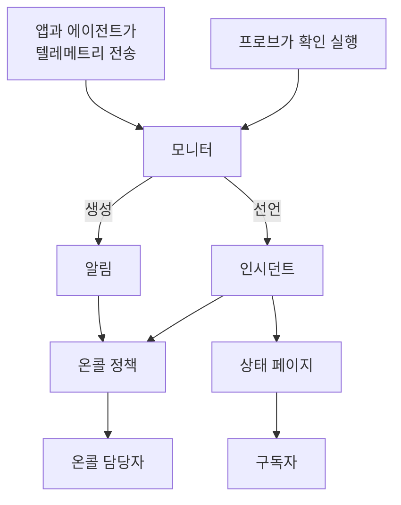

# 핵심 개념

OneUptime에는 많은 제품이 있지만, 모두 몇 가지 개념 위에 서 있습니다. 프로젝트, 모니터, 인시던트와 알림, 온콜, 상태 페이지, 텔레메트리입니다. 이 페이지는 각 개념을 몇 문장으로 설명하고, 서로 어떻게 연결되는지 보여 주며, 자세히 다루는 페이지로 안내합니다. 한 번 읽어 두면 문서의 다른 모든 페이지가 더 쉽게 읽힙니다.

:::cards
- [프로젝트와 사람](#프로젝트와-사람): 모든 것이 있는 곳, 그리고 누가 무엇을 할 수 있는지.
- [모니터와 프로브](#모니터와-프로브): OneUptime이 문제를 알아채는 방법.
- [인시던트와 알림](#인시던트와-알림): 팀이 작업의 기준으로 삼는 기록.
- [온콜](#온콜): 누가, 어떻게 호출되고, 다음은 누구인지.
:::

## 요소들이 연결되는 방식

문제는 OneUptime 안에서 한 방향으로 흐릅니다. 프로브와 여러분의 텔레메트리가 모니터에 데이터를 공급합니다. 모니터의 기준이 언제 문제가 있는지, 그리고 무엇을 열지(인시던트, 알림 또는 둘 다)를 결정합니다. 온콜 정책은 이에 대해 사람을 호출하고, 상태 페이지는 인시던트를 고객에게 알립니다.

## 프로젝트와 사람

**프로젝트**는 모든 것을 담습니다. 모니터, 인시던트, 온콜 정책, 상태 페이지, 텔레메트리, 설정입니다. 대부분의 회사는 하나면 충분하고, 환경이나 사업부마다 하나씩 두는 회사도 있습니다. 한 프로젝트에서 만든 것은 다른 프로젝트에서 보이지 않습니다.

**계정**은 프로젝트와 별개입니다. 이메일과 비밀번호가 하나인 계정 하나로 프로젝트에 몇 개든 속할 수 있으며, 왼쪽 위의 프로젝트 선택기로 프로젝트를 전환합니다. [내 계정](/docs/introduction/your-account)을 참고하세요.

사람은 **팀**을 통해 프로젝트에 속하며, 팀의 권한이 구성원이 할 수 있는 일을 결정합니다. 모든 새 프로젝트는 세 개의 팀으로 시작합니다. 여러분이 속한 Owners, 그리고 Admin과 Members입니다. OneUptime Cloud에서는 프로젝트마다 요금제가 따로 있습니다.

:::cards
- [사용자, 팀 및 권한](/docs/permissions/index): 사람을 초대하고 할 수 있는 일을 정합니다.
:::

## 모니터와 프로브

**모니터**는 여러분이 운영하는 것 하나를 확인하고, 그것이 동작하는지 판단합니다. 대부분의 모니터는 **프로브**가 확인합니다. 프로브는 페이지 요청, API 호출, 호스트 ping, 데이터베이스 쿼리 같은 확인을 일정에 따라 실행하는 머신입니다. OneUptime Cloud는 여러 리전에서 프로브를 실행하고, 자체 호스팅 설치는 자체 프로브를 실행하며, 네트워크 안에 사용자 지정 프로브를 추가할 수도 있습니다. 다른 모니터는 대신 여러분이 보내는 것을 읽습니다. 앱의 텔레메트리, 또는 서버, Kubernetes 클러스터, 기타 인프라의 에이전트가 보고하는 데이터입니다.

모니터의 **기준**은 각 결과가 무엇을 뜻하는지 정합니다. 기준은 순서대로 확인되며, 처음 일치한 기준이 모니터의 상태를 바꾸거나, 인시던트를 선언하거나, 알림을 생성하거나, 셋 모두를 할 수 있습니다. 모든 새 프로젝트에는 **정상 작동**, **저하됨**, **오프라인**의 세 가지 모니터 상태가 있습니다.

:::cards
- [모니터 만들기](/docs/monitor/create-monitor): 유형을 고르고, 무엇을 얼마나 자주 확인할지 정합니다.
- [사용자 지정 프로브](/docs/probe/custom-probe): 자체 네트워크에서만 닿을 수 있는 것을 확인합니다.
:::

## 인시던트와 알림

둘 다 문제를 기록하며, 둘 다 온콜 담당자를 호출할 수 있습니다. 차이는 그 문제가 누구에게 영향을 주는가입니다.

| | 인시던트 | 알림 |
| --- | --- | --- |
| **무엇인가** | 장애나 속도 저하처럼 사용자에게 영향을 주는 문제 | 사용자에게 영향이 가기 전에 팀이 살펴봐야 할 문제 |
| **상태 페이지에서** | 표시될 수 있으며 구독자에게 알림 | 표시되지 않음 |
| **시작 상태** | **Identified**, **인지됨**, **해결됨** | **Identified**, **인지됨**, **해결됨** |
| **시작 심각도** | Critical Incident, Major Incident, Minor Incident | **High**, **Low** |

인지하면 누군가 처리 중이라는 뜻이 되고, 온콜 정책이 다음 단계를 호출하지 않습니다. 해결하면 닫힙니다. 직접 상태와 심각도를 추가할 수 있고, 알림을 그것이 속한 것으로 밝혀진 인시던트에 연결할 수 있습니다.

**에피소드**는 관련된 인시던트나 관련된 알림을 묶어, 팀이 하나로 다룰 수 있게 합니다. 무엇을 함께 묶을지는 그룹화 규칙이 결정합니다.

:::cards
- [인시던트 개요](/docs/incidents/index): 인시던트를 선언하고, 처리하고, 해결하는 방법.
- [연결된 알림](/docs/incidents/linked-alerts): 장애가 일으킨 알림을 그 인시던트에 연결합니다.
:::

## 온콜

**온콜 정책**은 인시던트나 알림에 대해 누구를 호출할지, 아무도 응답하지 않으면 다음은 누구인지 정합니다. 정책의 **에스컬레이션 규칙**이 단계입니다. 각 단계는 담당자를 호출한 다음, 누군가 인지하기를 기다렸다가 다음 단계를 호출합니다. 단계는 사람, 팀, 또는 **온콜 스케줄**을 호출할 수 있습니다. 온콜 스케줄은 어느 순간이든 누가 온콜인지 아는 로테이션입니다.

각자에게 연락하는 방법은 본인이 정합니다. 모든 사람은 **사용자 설정**에서 OneUptime이 연락할 수 있는 방법(이메일, SMS, 전화, 푸시 알림, Slack, Microsoft Teams 등)과, 호출될 때 그중 무엇을 사용할지를 관리합니다.

:::cards
- [에스컬레이션 규칙](/docs/on-call/escalation-rules): 누군가 응답할 때까지 단계별로 사람을 호출합니다.
- [온콜 스케줄](/docs/on-call/schedules): 로테이션, 레이어, 인수인계.
:::

## 상태 페이지와 유지 관리

**상태 페이지**는 서비스가 동작하는지 고객에게 보여 줍니다. 어떤 모니터를 보여 줄지, 고객이 이해하는 이름으로 고릅니다. 그 모니터 중 하나에서 인시던트가 진행 중이면 페이지에 표시되고, 페이지의 **구독자**는 이메일, SMS, Slack, Microsoft Teams 또는 웹훅으로 알림을 받습니다. 상태 페이지는 공개할 수도 있고, 들여보낸 사람에게만 보이도록 비공개로 둘 수도 있습니다.

**예정된 유지 관리**는 계획된 작업을 미리 알립니다. 이벤트는 **예정됨**, **진행 중**, **종료됨**, **완료됨**을 거치며, 이벤트를 표시하는 상태 페이지가 방문자와 구독자에게 이를 알립니다.

:::cards
- [상태 페이지 개요](/docs/status-pages/index): 상태 페이지를 만들고 무엇을 보여 줄지 정합니다.
- [구독자 및 공지](/docs/status-pages/subscribers): 누구에게, 언제 알리는지.
:::

## 텔레메트리

**텔레메트리**는 시스템이 OneUptime에 보내는 것으로, 로그, 메트릭, 트레이스, 예외, 프로파일이 있습니다. 앱은 OpenTelemetry로 보내고, OneUptime의 에이전트는 호스트, Kubernetes 클러스터, Docker 호스트, 기타 인프라에서 보냅니다. 모든 송신자는 **수집 키**를 사용하며, 수집 키는 **프로젝트 설정 → 텔레메트리 및 APM → 수집 키**에서 만듭니다. 텔레메트리를 검색하고, 대시보드에 차트로 그리고, 텔레메트리 모니터로 지켜볼 수 있습니다. 텔레메트리 모니터는 다른 모니터처럼 인시던트와 알림을 생성합니다.

:::cards
- [OpenTelemetry](/docs/telemetry/open-telemetry): 앱에서 로그, 메트릭, 트레이스를 보냅니다.
- [로그 모니터](/docs/monitor/logs-monitor): 로그에 특정 패턴이 나타나면 알림을 받습니다.
:::

## 자동화와 AI

- **워크플로**는 무언가 일어날 때 작업을 실행합니다. 예를 들어 인시던트가 선언되면 Slack에 게시합니다.
- **런북**은 대응 절차를, 팀이 직접 또는 자동으로 실행할 수 있는 단계로 바꿉니다.
- **OneUptime AI**는 새 인시던트와 알림을 조사하고 찾은 내용을 타임라인에 게시하며, **Ask AI**는 프로젝트에 대한 질문에 답합니다. 새 프로젝트는 AI가 켜진 상태로 시작하며, **프로젝트 설정 → AI → AI Features**의 **AI 활성화** 스위치로 모두 끌 수 있습니다.

:::cards
- [워크플로 개요](/docs/workflows/index): 트리거와 컴포넌트로 작업을 자동화합니다.
- [AI SRE](/docs/ai/ai-sre): OneUptime AI가 인시던트와 알림을 조사하는 방식.
:::

## 레이블과 소유자

**레이블**은 모니터, 인시던트, 상태 페이지 및 대부분의 다른 리소스에 붙이는 태그로, 필터링과 그룹화에 씁니다. 팀의 권한을 특정 레이블이 붙은 리소스로 제한할 수 있습니다. **소유자**는 하나의 리소스를 책임지는 사람과 팀으로, 그 리소스에 무슨 일이 생기면 알림을 받습니다. 레이블 규칙과 소유자 규칙은 새 리소스에 레이블과 소유자를 자동으로 추가합니다.

:::cards
- [레이블 및 소유자 규칙](/docs/configuration/label-and-owner-rules): 새 리소스에 레이블을 붙이고 소유자를 자동으로 지정합니다.
:::

## 다음 단계

:::cards
- [빠른 시작](/docs/introduction/quickstart): 이 개념들을 15분 안에 실제로 적용합니다.
- [홈 화면과 단축키](/docs/introduction/home): 대시보드에서 모든 제품을 찾습니다.
- [모니터 만들기](/docs/monitor/create-monitor): 첫 모니터를 항목별로 설정합니다.
- [인시던트 개요](/docs/incidents/index): 모니터가 인시던트를 선언한 뒤에 일어나는 일.
:::
