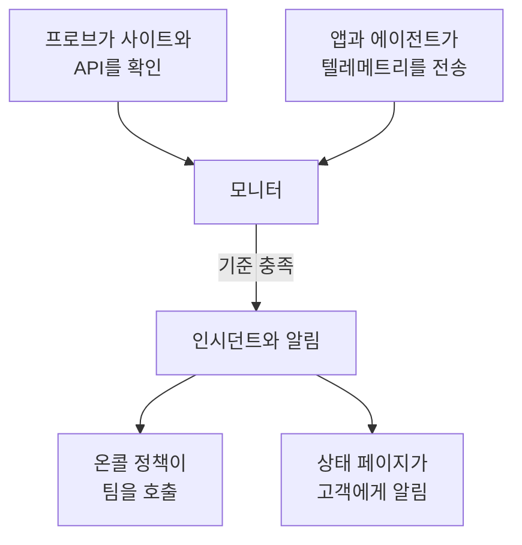

# 시작하기

OneUptime은 오픈 소스 옵저버빌리티 플랫폼입니다. 웹사이트, API, 서버가 제대로 동작하는지 확인하고, 앱이 보내는 로그, 메트릭, 트레이스를 수집하며, 무언가 고장 나면 온콜 담당자를 호출하고, 상태 페이지로 고객에게 알립니다. 이 모든 일이 하나의 제품 안에서 일어나므로, 문제를 알아챈 도구가 곧바로 팀을 호출합니다. OneUptime Cloud에서 사용하거나 자체 서버에서 실행할 수 있습니다.

여기서 시작하세요:

:::cards
- [빠른 시작](/docs/introduction/quickstart): 웹사이트를 모니터링하고, 장애가 나면 호출을 받고, 상태 페이지를 게시합니다.
- [핵심 개념](/docs/introduction/core-concepts): 다른 모든 것의 바탕이 되는 몇 가지 개념과 그 연결 방식.
- [홈 화면과 단축키](/docs/introduction/home): 대시보드를 둘러보는 방법과 클릭을 줄여 주는 키.
- [내 계정](/docs/introduction/your-account): 프로필, 비밀번호, 패스키, 2단계 인증.
:::

## OneUptime의 구성

모든 것은 여러분이 지켜보는 대상에서 시작합니다. 모니터는 그 대상을 일정에 따라 확인하거나, 그 대상이 보내는 텔레메트리를 읽습니다. 모니터의 기준이 충족되면 OneUptime은 인시던트를 선언하거나 알림을 생성하고, 온콜 담당자를 호출하며, 원하면 인시던트를 상태 페이지에 표시합니다.

- **인시던트**는 사용자에게 영향을 주는 문제입니다. 온콜 담당자를 호출하고, 상태 페이지에 표시될 수 있습니다.
- **알림**은 사용자가 알아채기 전에 팀이 살펴봐야 할 문제입니다. 알림도 온콜 담당자를 호출할 수 있지만, 상태 페이지에는 절대 표시되지 않습니다.

[핵심 개념](/docs/introduction/core-concepts)에서 각 요소를 몇 문장으로 설명합니다.

## 문서 둘러보기

문서는 사이드바와 같이 아홉 개의 섹션으로 구성되어 있습니다. 필요한 부분을 고르세요.

### 모니터링

:::cards
- [모니터](/docs/monitor/create-monitor): 전 세계의 프로브에서 웹사이트, API, 포트, DNS, NTP 서버, 인증서 등을 확인합니다.
- [인프라 모니터](/docs/monitor/server-monitor): 서버, Kubernetes, Docker, VMware, 네트워크 장비, 스토리지를 지켜봅니다.
- [텔레메트리 모니터](/docs/monitor/logs-monitor): 보내는 로그, 메트릭, 트레이스, 예외, 프로파일을 기준으로 알림을 생성합니다.
- [SLO](/docs/slo/introduction): 신뢰성 목표, 오류 예산, 소진율을 추적합니다.
- [프로브](/docs/probe/custom-probe): 자체 네트워크 안에서 확인을 실행합니다.
- [OneUptime이 데이터를 받지 못할 때](/docs/monitor/when-oneuptime-is-not-receiving): OneUptime 쪽의 공백이 여러분의 다운타임으로 계산되지 않는 이유.
:::

### 인시던트 대응

:::cards
- [인시던트](/docs/incidents/index): 인시던트를 선언, 조율, 해결하고 전체 타임라인을 남깁니다.
- [온콜](/docs/on-call/schedules): 로테이션, 에스컬레이션 규칙, 누가 언제 호출되는지.
- [상태 페이지](/docs/status-pages/index): 공개 또는 비공개 상태 페이지로 고객에게 상황을 알립니다.
- [워크스페이스 연결](/docs/workspace-connections/slack): Slack과 Microsoft Teams에서 인시던트에 대응합니다.
:::

### 옵저버빌리티

:::cards
- [텔레메트리](/docs/telemetry/open-telemetry): OpenTelemetry로 로그, 메트릭, 트레이스를 보내고 검색합니다.
- [인프라 에이전트](/docs/telemetry/kubernetes-agent): Kubernetes, 호스트, Docker, Proxmox, VMware 등을 위한 에이전트를 설치합니다.
- [클라우드](/docs/telemetry/cloud-environments): ECS, Cloud Run, Azure Container Apps 등 관리형 플랫폼을 관찰합니다.
- [AI 옵저버빌리티](/docs/telemetry/ai-llm-observability): AI의 대화를 따라가고, 답변이 좋지 않을 때 알림을 받습니다.
- [보안](/docs/telemetry/security-events): 보안 이벤트와 위협 인텔리전스를 수집합니다.
- [실제 사용자 모니터링](/docs/rum/index): Core Web Vitals와 세션 리플레이로 실제 사용자의 경험을 측정합니다.
- [대시보드](/docs/dashboards/index): 메트릭, 로그, 모니터로 대시보드를 만듭니다.
- [인벤토리](/docs/inventory/overview): OneUptime이 알고 있는 모든 서비스, 호스트, 장치를 확인합니다.
:::

### 자동화 및 AI

:::cards
- [런북](/docs/runbooks/index): 대응 절차를 팀이 실행할 수 있는 단계로 바꿉니다.
- [양식](/docs/forms/index): 누구나 양식으로 문제를 보고할 수 있고, 그 양식이 인시던트를 엽니다.
- [워크플로](/docs/workflows/index): OneUptime에서 무언가 일어날 때 작업을 자동화합니다.
- [AI](/docs/ai/ai-sre): OneUptime AI에게 인시던트와 알림 조사를 맡기고, 시스템에 대해 질문합니다.
:::

### 통합

:::cards
- [통합](/docs/integrations/index): Jira, ServiceNow, Grafana, Datadog, Huntress, SIEM 도구, Discord, Telegram, IRC 등과 연결합니다.
:::

### 개발자

:::cards
- [API 레퍼런스](/docs/api-reference/api-reference): REST API로 OneUptime을 자동화합니다.
- [CLI](/docs/cli/index): 터미널과 CI에서 OneUptime을 관리합니다.
- [Terraform 프로바이더](/docs/terraform/index): 모니터, 상태 페이지, 온콜을 코드로 관리합니다.
:::

### 관리

:::cards
- [사용자와 권한](/docs/permissions/index): 사람을 초대하고, 팀을 구성하고, 할 수 있는 일을 제어합니다.
- [ID](/docs/identity/sso): SAML 또는 OIDC 싱글 사인온으로 로그인하고, SCIM으로 사용자를 프로비저닝합니다.
- [구성](/docs/configuration/label-and-owner-rules): 리소스에 레이블을 붙이고 소유자를 자동으로 지정합니다.
- [이메일](/docs/emails/smtp): OneUptime의 이메일을 자체 SMTP 서버로 보냅니다.
- [모바일 및 데스크톱 앱](/docs/mobile-desktop-apps/index): iOS, Android, macOS, Windows, Linux에서 호출을 받고 대응합니다.
:::

### 자체 호스팅

:::cards
- [설치](/docs/installation/docker-compose): 자체 OneUptime을 설치하고, 규모를 정하고, 업그레이드합니다.
- [자체 호스팅 환경](/docs/self-hosted/architecture): 자체 설치의 아키텍처, 통합, Enterprise 기능.
:::

## 다른 도구에서 옮겨 오기

### 기존 설정 가져오기

**프로젝트 설정 → 다른 도구에서 가져오기**는 다른 도구의 설정을 API 키로(Uptime Kuma는 파일로) 읽습니다. 찾은 항목을 보여 주고, 체크한 항목을 만듭니다. 다른 도구에서는 아무것도 바뀌지 않으며, 가져오기를 다시 실행해도 같은 것을 두 번 만들지 않습니다.

| 이전 도구 | OneUptime이 읽는 항목 |
| --- | --- |
| [Opsgenie](/docs/moving-to-oneuptime/opsgenie) | 사용자, 팀, 스케줄, 에스컬레이션, 서비스 |
| [PagerDuty](/docs/moving-to-oneuptime/pagerduty) | 사용자, 팀, 스케줄, 에스컬레이션 정책, 서비스 |
| [incident.io](/docs/moving-to-oneuptime/incident-io) | 사용자, 팀, 스케줄, 에스컬레이션 경로, 서비스, 인시던트 설정 |
| [Splunk On-Call](/docs/moving-to-oneuptime/splunk-on-call) | 사용자, 팀, 로테이션, 에스컬레이션 정책 |
| [Grafana OnCall](/docs/moving-to-oneuptime/grafana-oncall) | 사용자, 팀, 스케줄, 에스컬레이션 체인 |
| [UptimeRobot](/docs/moving-to-oneuptime/uptimerobot) | 모니터와 공개 상태 페이지 |
| [Atlassian Statuspage](/docs/moving-to-oneuptime/atlassian-statuspage) | 페이지, 그 컴포넌트와 그룹, 이메일 구독자 |
| [Better Stack](/docs/moving-to-oneuptime/better-stack) | 모니터, 하트비트, 상태 페이지, 이메일 구독자 |
| [Pingdom](/docs/moving-to-oneuptime/pingdom) | 업타임 확인 |
| [StatusCake](/docs/moving-to-oneuptime/statuscake) | 업타임, SSL, 하트비트 확인 |
| [Uptime Kuma](/docs/moving-to-oneuptime/uptime-kuma) | 모니터(백업 또는 메트릭 페이지에서) |

### OneUptime이 대체하는 도구

| 기능 | 하는 일 | 대체하는 도구 예시 |
| --- | --- | --- |
| 업타임 모니터링 | 전 세계 여러 위치에서 가용성과 응답 시간을 확인합니다. | Pingdom, UptimeRobot |
| 상태 페이지 | 서비스의 현재 상태와 이력을 고객에게 보여 줍니다. | Atlassian Statuspage |
| 인시던트 관리 | 메모, 소유자, 타임라인과 함께 인시던트를 처음부터 끝까지 관리합니다. | incident.io |
| 온콜 및 알림 | 온콜 근무를 편성하고, 누군가 응답할 때까지 에스컬레이션합니다. | PagerDuty, Opsgenie |
| 로그 관리 | 로그를 수집, 검색, 시각화합니다. | Loggly |
| 워크플로 | 작업을 자동화하고, 이미 사용 중인 도구와 OneUptime을 연결합니다. | Zapier |
| 애플리케이션 성능 모니터링 | 트레이스, 응답 시간, 처리량, 오류율을 추적합니다. | New Relic, Datadog |
| 오류 추적 | 예외를 스택 트레이스, 컨텍스트와 함께 그룹화합니다. | Sentry |

## 다음 단계

:::cards
- [빠른 시작](/docs/introduction/quickstart): 첫 모니터, 온콜 정책, 상태 페이지를 설정합니다.
- [핵심 개념](/docs/introduction/core-concepts): 다른 모든 페이지에서 쓰는 용어를 익힙니다.
- [홈 화면과 단축키](/docs/introduction/home): 대시보드에서 원하는 페이지, 설정, 작업을 찾습니다.
- [Docker Compose](/docs/installation/docker-compose): 자체 서버에서 OneUptime을 실행합니다.
:::
