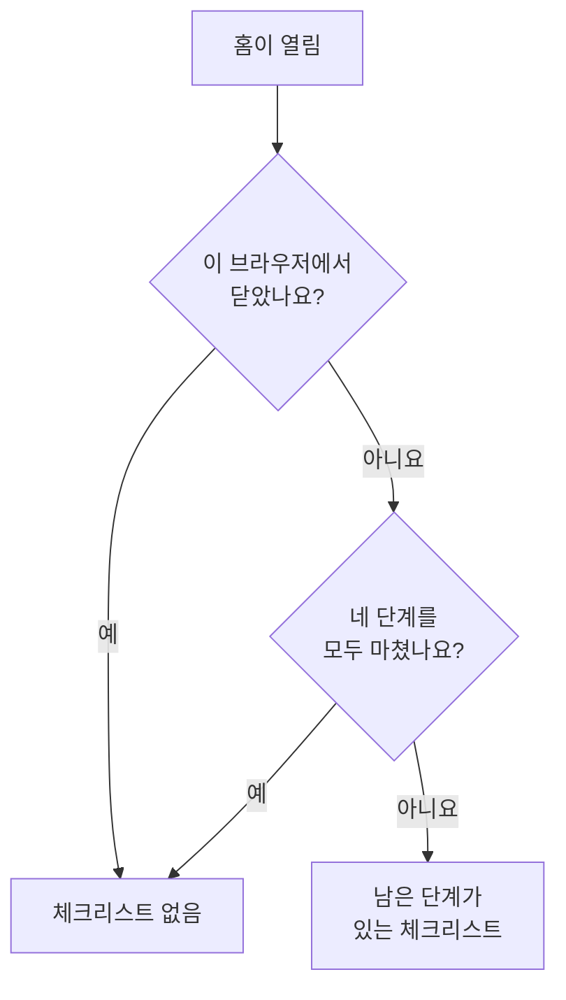

# 홈 화면과 단축키

홈은 프로젝트에서 가장 먼저 보는 페이지입니다. 지금 여러분이 처리해야 할 일이 있는지 한눈에 알려 주고, 새 프로젝트의 첫 설정을 안내합니다. 이 페이지에서는 홈에 무엇이 표시되는지, 대시보드에서 제품, 페이지, 작업을 찾는 방법, 그리고 메뉴를 오가는 수고를 덜어 주는 키보드 단축키를 설명합니다.

:::cards
- [홈에 표시되는 것](#홈에-표시되는-것): 환영 체크리스트, 다섯 개의 타일, 활성 인시던트.
- [둘러보기](#둘러보기): 제품 메뉴와 모든 페이지 위쪽의 바.
- [검색](#페이지-설정-또는-작업-검색): 이름을 입력해 원하는 페이지, 설정, 작업을 찾습니다.
- [키보드 단축키](#키보드-단축키): 키 두 개로 홈, 모니터, 인시던트로 이동합니다.
:::

## 홈에 표시되는 것

위쪽 바에서 **홈**을 열거나, 어디서든 `g`를 누른 다음 `h`를 누릅니다. 홈에는 위에서 아래로 다음이 표시됩니다.

1. **OneUptime에 오신 것을 환영합니다 👋**: 새 프로젝트를 위한 체크리스트로, 완료될 때까지 표시됩니다.
2. 주의가 필요한 것을 세는 다섯 개의 타일.
3. **활성 인시던트**: 아직 해결되지 않은 모든 인시던트.

### 환영 체크리스트

체크리스트는 프로젝트가 쓸모 있어지기 전에 필요한 네 가지를 안내합니다. 각 단계는 그 일을 하는 페이지를 열고, 프로젝트가 요구한 것을 갖추면 저절로 완료 표시됩니다.

| 단계 | 완료 조건 | 여는 곳 |
| --- | --- | --- |
| **첫 번째 모니터 만들기** | 프로젝트에 모니터가 있습니다. | **모니터 생성** 양식. 모니터를 만들 수 없는 사람에게는 **모니터** 목록. |
| **상태 페이지 게시하기** | 프로젝트에 상태 페이지가 있습니다. | **상태 페이지** |
| **팀 초대하기** | 여러분 외에 누군가 프로젝트에 있거나 초대되었습니다. | **사용자** |
| **온콜 정책 설정하기** | 프로젝트에 온콜 정책이 있습니다. | **온콜 듀티** |

단계 아래의 **OneUptime 작동 방식**은 문제가 거쳐 가는 순서대로 네 가지 핵심 제품을 보여 줍니다. **모니터**, **인시던트 및 경고**, **온콜 듀티**, **상태 페이지**입니다. 하나를 클릭하면 열립니다.

체크리스트는 네 단계를 모두 마치면 사라집니다. 더 일찍 숨기려면 **닫기**를 클릭합니다. 닫은 상태는 이 브라우저에, 이 프로젝트에 대해 기억됩니다. 단계가 여는 모든 것은 여전히 **제품** 메뉴에 있습니다.

### 타일

각 타일은 무언가를 세고, 그것이 주의가 필요한지 알려 주며, 숫자 뒤의 목록을 엽니다.

| 타일 | 세는 것 | 수가 0일 때 |
| --- | --- | --- |
| **활성 인시던트** | 해결되지 않은 인시던트 | **모두 정상** |
| **활성 알림** | 해결되지 않은 알림 | **모두 정상** |
| **작동 중지된 모니터** | 상태가 정상 작동 상태가 아닌 모니터. 보관된 모니터는 제외됩니다. | **모두 정상 작동** |
| **진행 중인 유지 관리** | 진행 중인 예정된 유지 관리 이벤트 | **진행 중인 항목 없음** |
| **위험한 SLO** | 켜져 있는 SLO 중 위험하거나 오류 예산을 다 쓴 것 | **예산 정상** |

수가 0보다 크면 **확인 필요**로 표시되며, 유지 관리 타일과 SLO 타일에서는 각각 **진행 중**과 **예산 소진 중**으로 표시됩니다. 아직 모니터가 없는 프로젝트는 모니터 타일에서 **아직 모니터가 없습니다**를, SLO가 없는 프로젝트는 **아직 SLO가 없습니다**를 봅니다. 빈 프로젝트는 건강한 프로젝트와 같지 않기 때문입니다. 이때 두 타일은 **모니터** 목록과 **SLOs** 목록을 열며, 거기서 첫 항목을 만들 수 있습니다.

### 홈의 사이드 메뉴

홈 옆의 사이드 메뉴에는 같은 목록이 각각 개수와 함께 있습니다.

| 섹션 | 페이지 |
| --- | --- |
| **인시던트** | **활성 인시던트**와 **활성 에피소드** |
| **알림** | **활성 알림**과 **활성 에피소드** |
| **모니터** | **작동하지 않음** |
| **예정된 이벤트** | **진행 중** |

에피소드는 관련된 인시던트나 알림을 묶어 하나로 다룰 수 있게 합니다. [핵심 개념](/docs/introduction/core-concepts#인시던트와-알림)을 참고하세요.

## 둘러보기

OneUptime의 모든 것은 위쪽 바의 **제품** 아래에 있습니다. 메뉴는 그룹을 하나의 목록의 행으로 보여 주며, 항상 첫 번째 그룹인 필수를 펼친 상태로 열립니다. 필수에는 모니터, 인시던트, 경고, 온콜 듀티, 상태 페이지, 예정된 유지 관리, SLOs가 있습니다. 다른 모든 그룹(관측 가능성, AI, 코드, 리소스, 인프라, 대시보드 및 자동화, 설정)은 같은 목록의 한 행으로 접혀 있습니다. 각 행은 그룹에 있는 제품의 이름과 개수를 보여 줍니다. 행을 클릭하면 펼치거나 접을 수 있고, 화살표 키로 행으로 이동해 **Enter**를 눌러도 됩니다.

- **검색으로 모든 것을 찾습니다.** 메뉴의 검색 상자에 입력하면 이름, 하는 일, 또는 `k8s`나 `RUM` 같은 익숙한 단어로 어떤 제품이든 찾을 수 있습니다. 검색은 접힌 그룹 안까지 찾습니다.
- **지금 있는 곳에서 시작합니다.** 보고 있는 페이지의 그룹은 저절로 펼쳐지고, 최근에 연 제품은 맨 위에 나열됩니다.
- **선택이 유지됩니다.** 메뉴는 다른 그룹 중 무엇을 펼치고 접었는지 브라우저에 기억합니다. 필수 그룹은 접었더라도 메뉴를 열 때마다 다시 펼쳐집니다.
- **휴대폰에서는** 메뉴 버튼이 제품을 같은 방식으로 나열합니다. 필수 그룹은 맨 위에 펼쳐져 있고, 다른 그룹은 각각 탭하면 펼쳐지는 한 행입니다.

### 위쪽의 바

모든 페이지 위쪽에는 두 개의 바가 있습니다.

| 위치 | 있는 것 |
| --- | --- |
| 왼쪽 위 | 프로젝트 선택기: 다른 프로젝트로 전환하거나 새 프로젝트를 만듭니다. |
| 오른쪽 위 | **검색**과 **Ask AI**, 지금 처리할 일(활성 인시던트와 알림, 여러분이 당번인 온콜 정책, 대기 중인 초대)을 보여 주는 알림 벨, **도움말**, 그리고 [계정](/docs/introduction/your-account) 메뉴를 여는 여러분의 사진. |
| 그 아래 | 왼쪽에 **홈**과 **제품**, 오른쪽에 **사용자 설정**: 이 프로젝트에서 OneUptime이 여러분에게 연락하는 방법. |

**도움말**은 이 문서(**문서**)와 **Keyboard shortcuts** 목록을 열고, 이메일과 Slack 지원도 제공합니다. 휴대폰처럼 좁은 화면에서는 공간을 아끼기 위해 **검색**, **Ask AI**, **도움말**이 빠지고, 알림 벨과 사진은 남습니다.

## 페이지, 설정 또는 작업 검색

**Cmd+K**(Mac) 또는 **Ctrl+K**(Windows 및 Linux)를 누르거나, 위쪽 바의 검색 아이콘을 클릭하고 입력을 시작합니다. 검색으로 찾을 수 있는 것은 다음과 같습니다.

- **메뉴의 모든 페이지**: 메뉴에 표시된 이름으로 찾습니다. API 키, 위험 영역, 온콜 스케줄, 인시던트 심각도, 자신의 알림 방법 등입니다. 각 결과에는 *프로젝트 설정 › 고급*처럼 위치가 표시되므로, 이름이 같은 페이지(인시던트, 알림, 모니터의 사용자 정의 필드)도 쉽게 구분할 수 있습니다.
- **작업**: 하려는 일로 찾습니다. 인시던트 선언, 모니터 생성, 또는 위험 영역을 여는 Delete Project 등입니다. 무언가를 바꾸는 작업은 그 일을 할 수 있는 사람에게만 표시됩니다.
- **모니터, 인시던트, 알림, 상태 페이지, 온콜 정책**: 이름으로 찾습니다.

검색은 입력한 내용을 여러분의 뜻대로 읽습니다.

- 대소문자, 악센트, 공백, 하이픈은 상관없습니다. *on-call*, *on call*, *oncall*은 같은 페이지를 찾고, 단어 순서도 자유입니다.
- 많은 페이지에 대해 다른 단어(영어)도 압니다. 온콜 정책에는 *pager*나 *escalation*, 온콜 스케줄에는 *rota*, 2단계 인증에는 *2fa*, 위험 영역에는 *delete project*입니다.
- 제품 이름을 더하면 검색 범위를 좁힐 수 있습니다. *incident custom fields*는 인시던트의 사용자 정의 필드 페이지를 찾습니다.
- *incidnet* 같은 작은 오타도, 입력한 그대로 일치하는 것이 없으면 의도한 것을 찾아 줍니다.

검색 상자가 비어 있으면 최근에 연 페이지, 작업, 제품을 보여 줍니다.

## 키보드 단축키

대시보드 어디에서든 `?`를 누르면 모든 단축키를 볼 수 있습니다. **도움말**을 열고 **Keyboard shortcuts**를 골라도 됩니다. Mac에서 `Mod`는 Command 키이고, Windows와 Linux에서는 Ctrl 키입니다.

| 키 | 하는 일 |
| --- | --- |
| `Mod` + `K` | 명령 팔레트를 열어 원하는 페이지, 설정, 작업을 검색합니다. |
| `Mod` + `I` | 지금 보고 있는 것에 대해 AI에게 묻습니다. |
| `/` | 이 페이지의 목록을 검색합니다. |
| `?` | 키보드 단축키를 보여 줍니다. |
| `Esc` | 대화 상자나 패널을 닫습니다. |

### 제품으로 이동

`g`를 누른 다음 문자 키를 누르면 바로 그 제품으로 이동합니다. 문자 키는 `g`를 누르고 1.5초 안에 눌러야 합니다.

| 키 | 이동하는 곳 |
| --- | --- |
| `g` 다음 `h` | 홈 |
| `g` 다음 `m` | 모니터 |
| `g` 다음 `i` | 인시던트 |
| `g` 다음 `a` | 경고 |
| `g` 다음 `o` | 온콜 듀티 |
| `g` 다음 `s` | 상태 페이지 |
| `g` 다음 `e` | 예정된 유지 관리 |
| `g` 다음 `d` | 대시보드 |
| `g` 다음 `l` | 로그 |
| `g` 다음 `t` | 트레이스 |

단축키는 방해가 되지 않습니다. 필드에 입력하는 동안에는 `?`, `/`, `g`가 아무 일도 하지 않으며, 대화 상자가 열려 있는 동안에는 어떤 키도 페이지를 벗어나지 않으므로, 실수로 누른 키 때문에 작성 중인 양식을 잃지 않습니다. 다른 제품도 `Mod` + `K`로 검색하면 바로 열 수 있습니다.

## 다음 단계

:::cards
- [빠른 시작](/docs/introduction/quickstart): 환영 체크리스트를 단계별로 진행합니다.
- [내 계정](/docs/introduction/your-account): 프로필, 로그인 보안, 언어, 테마.
- [AI에게 질문](/docs/ai/ask-ai): Ask AI가 답하고 대신 할 수 있는 일.
- [핵심 개념](/docs/introduction/core-concepts): 모니터, 인시던트, 알림, 온콜이란 무엇인지.
:::
