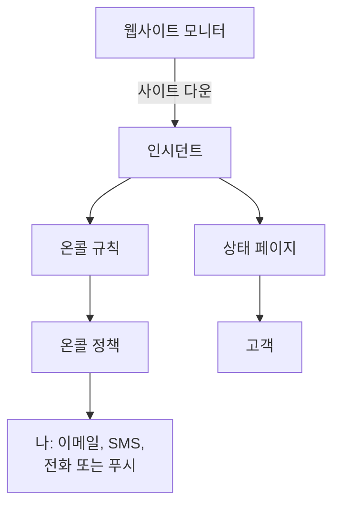

# 빠른 시작

이 가이드는 새 계정에서 시작해 약 15분 만에 작동하는 구성을 완성하도록 안내합니다. 5분마다 웹사이트를 확인하는 모니터, 사이트가 다운되면 여러분을 호출하는 온콜 정책, 그리고 고객에게 알리는 상태 페이지입니다. 프로젝트 홈 페이지의 **OneUptime에 오신 것을 환영합니다 👋** 체크리스트를 따라 진행합니다.

## 시작하기 전에

- **계정.** OneUptime Cloud에서는 [oneuptime.com](https://oneuptime.com/accounts/register)에서 가입하고, 받은 이메일의 링크를 엽니다. 자체 설치에서는 브라우저에서 설치 주소를 열고 가입합니다. 첫 번째 계정이 마스터 관리자가 됩니다. 설치 방법은 [Docker Compose](/docs/installation/docker-compose)를 참고하세요.
- **모니터링할 웹사이트.** HTTP 또는 HTTPS로 응답하는 주소면 무엇이든 됩니다. 예를 들면 회사 홈페이지입니다.

## 프로젝트 만들기

OneUptime의 모든 것은 프로젝트 안에 있습니다. 모니터, 인시던트, 온콜 정책, 상태 페이지, 그리고 이를 다루는 사람들입니다.

:::steps
### 새 프로젝트 시작

처음 로그인하면 OneUptime에 **프로젝트가 없습니다**라는 메시지가 표시됩니다. **새 프로젝트 만들기**를 클릭합니다. 누군가 이미 여러분을 프로젝트에 초대했다면, 대신 같은 페이지에서 초대를 수락합니다.

### 이름 지정

**프로젝트 이름**에 회사 이름 등을 입력합니다. OneUptime Cloud에서는 다음 단계에서 요금제를 고릅니다.

### 만들기

**프로젝트 생성**을 클릭합니다. 프로젝트의 홈 페이지가 열리고, 맨 위에 **OneUptime에 오신 것을 환영합니다 👋** 체크리스트가 표시됩니다.
:::

## 웹사이트 모니터링

:::steps
### 모니터 생성 열기

체크리스트에서 **첫 번째 모니터 만들기**를 클릭합니다. **제품** 메뉴에서 **모니터**를 열고 **모니터 생성**을 클릭해도 됩니다.

### 웹사이트 선택

**모니터 유형**에서 **웹사이트**를 고릅니다. **이름**에 `Website` 같은 이름을 입력하고 **다음**을 클릭합니다.

### 주소 입력

**웹사이트 URL**에 사이트의 전체 주소를 입력합니다. 예: `https://example.com`. 기준은 OneUptime이 자동으로 추가합니다. 사이트가 응답하지 않거나 오류로 응답하면, 모니터가 **오프라인**이 되고 인시던트를 선언합니다. **다음**을 클릭합니다.

### 모니터 만들기

선택된 **프로브**와 **모니터링 간격**의 **5분마다**를 그대로 두고 **모니터 생성**을 클릭합니다. 모니터 페이지가 열리고, 프로브가 사이트 확인을 시작합니다.
:::

저장하기 전에 확인을 시험해 보려면, 두 번째 단계에서 **모니터 테스트**를 클릭합니다. 다른 모든 모니터 유형은 [모니터 만들기](/docs/monitor/create-monitor)에서 설명합니다.

## 다운되면 호출 받기

지금 상태로는 소유자가 없는 인시던트가 프로젝트 소유자에게 이메일로 전송되며, 여기에는 여러분도 포함됩니다. 누군가 응답할 때까지 호출을 받으려면, 온콜 정책을 만들고 모든 인시던트가 그 정책을 호출하도록 합니다.

:::steps
### 온콜 정책 만들기

체크리스트에서 **온콜 정책 설정하기**를 클릭하거나, **제품** 메뉴에서 **온콜 듀티**를 엽니다. **온콜 정책 만들기**를 클릭하고 **이름**을 입력합니다. **누구에게 먼저 알릴까요?** 에서 **응답자 추가**를 클릭하고 자신을 고릅니다. **온콜 정책 만들기**를 클릭합니다.

### 모든 인시던트에 호출

**제품** 메뉴에서 **인시던트**를 열고, 사이드 메뉴에서 **규칙**을 펼친 다음 **온콜 규칙**을 고릅니다. **Incident On-Call Rule 만들기**를 클릭하고 **이름**을 입력한 뒤 **다음**을 클릭합니다. 모든 인시던트와 일치하도록 **일치 기준**은 비워 두고 **다음**을 클릭합니다. **온콜 정책**에서 정책을 고르고 **Incident On-Call Rule 만들기**를 클릭합니다.

### 연락 방법 선택

로그인 이메일은 이미 여러분에게 연락하는 방법입니다. 문자나 전화로도 연락을 받으려면, 위쪽 바 아래의 바에서 **사용자 설정**을 열고 **알림 방법**으로 이동한 다음, **Direct Contact** 탭의 **전화번호 SMS 알림용** 또는 **통화 알림용 전화번호**에 번호를 추가합니다. **인증**을 클릭하고 OneUptime이 보낸 코드를 입력합니다. 인증된 번호는 바로 온콜 호출에 사용됩니다.
:::

> [!NOTE]
> 새 프로젝트에서는 SMS와 전화 통화가 꺼져 있습니다. 프로젝트 소유자, Billing Admin 또는 Manage Billing 권한이 있는 사람이 **프로젝트 설정 → 알림 → 알림 설정**의 **알림 채널** 카드에서 켭니다.

단계 추가, 로테이션, 각 단계의 대기 시간은 [에스컬레이션 규칙](/docs/on-call/escalation-rules)과 [온콜 스케줄](/docs/on-call/schedules)을 참고하세요.

## 상태 페이지 게시

:::steps
### 상태 페이지 만들기

체크리스트에서 **상태 페이지 게시하기**를 클릭하거나, **제품** 메뉴에서 **상태 페이지**를 엽니다. **상태 페이지 생성**을 클릭하고 **이름**에 `Acme Status` 같은 이름을 입력한 뒤 **상태 페이지 생성**을 클릭합니다.

### 모니터 추가

새 상태 페이지를 엽니다. 사이드 메뉴의 **리소스** 아래에서 **모니터**를 고릅니다. 모니터 그룹이 켜진 프로젝트에서는 이 항목이 **리소스**로 표시됩니다. **모니터 추가**를 클릭하고 웹사이트 모니터를 고른 다음 **모니터 추가**를 클릭합니다. 행에는 방문자에게 보이는 모니터 이름이 표시되며, 원하면 **표시 이름**에서 바꿀 수 있습니다.

### 페이지 열기

사이드 메뉴에서 **개요**를 고릅니다. **Status Page Preview URL** 카드가 상태 페이지로 연결됩니다. 열어 보면 웹사이트가 정상 작동으로 표시됩니다.
:::

새 상태 페이지는 공개 상태이므로, 주소를 아는 사람은 누구나 열 수 있습니다. 자체 도메인, 로고, 색상을 적용하려면 [상태 페이지 브랜딩 및 도메인](/docs/status-pages/branding-and-domains)을 참고하세요.

## 팀 초대

체크리스트에서 **팀 초대하기**를 클릭하거나, **제품** 메뉴의 **설정** 아래에서 **사용자**를 엽니다. **사용자 초대**를 클릭하고 상대의 **이메일**을 입력한 뒤 **팀**을 고릅니다. 처음에는 멤버 팀이 선택되어 있습니다. **초대**를 클릭합니다. OneUptime이 초대 이메일을 보내며, 그 사람이 할 수 있는 일은 팀이 결정합니다. [사용자, 팀 및 권한](/docs/permissions/index)을 참고하세요.

## 시험해 보기

테스트 인시던트를 선언해 전체 흐름이 동작하는지 확인합니다.

:::steps
### 테스트 인시던트 선언

**인시던트**를 열고 **인시던트 선언**을 클릭합니다. **제목**에 `Test incident` 같은 제목을 입력하고, **인시던트 심각도**를 고른 다음 **다음**을 클릭합니다. **모니터**에서 웹사이트 모니터를 고르면 인시던트가 상태 페이지에 표시됩니다. 요약에 도달할 때까지 **다음**을 클릭한 뒤 **인시던트 선언**을 클릭합니다.

### 결과 확인

1~2분 안에 온콜 정책이 여러분을 호출하고, 인시던트가 상태 페이지에 표시됩니다.

### 해결

인시던트 페이지에서 **해결**을 클릭합니다. 호출이 멈추고, 인시던트가 상태 페이지에서 사라집니다.
:::

> [!WARNING]
> 상태 페이지를 여는 사람은 여러분이 해결할 때까지 테스트 인시던트를 보게 됩니다. 페이지 주소를 공유하기 전에 테스트하세요.

## 문제 해결

:::details 호출을 받지 못했습니다
인시던트를 열고 사이드 메뉴에서 **온콜 실행**을 고릅니다. 정책이 실행되었는지, 누구를 호출했는지 보여 줍니다. 실행되지 않았다면 온콜 규칙이 활성화되어 있고 그 정책을 지정하는지 확인합니다. 실행되었다면 **사용자 설정 → 알림 방법**의 방법이 인증되었는지 확인합니다.
:::

:::details 인시던트가 상태 페이지에 없습니다
상태 페이지는 인시던트의 모니터 중 하나가 그 페이지에 있을 때 인시던트를 표시합니다. 인시던트의 영향받는 리소스에 여러분의 모니터가 포함되어 있는지, 그리고 그 모니터가 상태 페이지에 있는지 확인하세요.
:::

:::details 모니터는 오프라인이라고 하지만 사이트는 정상입니다
모니터를 열고 프로브가 무엇을 받았는지 확인합니다. [웹사이트 모니터](/docs/monitor/website-monitor)의 문제 해결 섹션을 참고하세요.
:::

## 다음 단계

:::cards
- [핵심 개념](/docs/introduction/core-concepts): 방금 설정한 것의 바탕이 되는 개념.
- [온콜 스케줄](/docs/on-call/schedules): 팀과 온콜을 나눠 맡습니다.
- [상태 페이지 브랜딩 및 도메인](/docs/status-pages/branding-and-domains): 상태 페이지를 우리 회사에 맞게 꾸밉니다.
- [OpenTelemetry](/docs/telemetry/open-telemetry): 앱에서 로그, 메트릭, 트레이스를 보냅니다.
:::
