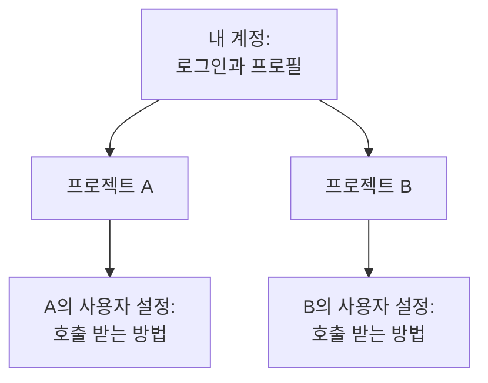

# 내 계정

계정은 OneUptime이 여러분을 알아보는 방법입니다. 로그인에 쓰는 이메일과 비밀번호, 이름과 시간대, 그리고 로그인을 보호하는 수단이 여기에 속합니다. 계정 하나로 여러 프로젝트에 속할 수 있으며, 이 설정은 어느 프로젝트에서든 그대로 따라갑니다. OneUptime이 여러분에게 연락하는 방법과 호출하는 시점은 프로젝트마다 **사용자 설정**에서 정합니다.

:::cards
- [프로필](#프로필): 이름, 이메일, 시간대, 사진.
- [안전한 로그인](#안전한-로그인): 비밀번호, 패스키, 2단계 인증.
- [내 프로젝트](#내-프로젝트): 프로젝트 전환, 만들기, 초대 수락.
- [사용자 설정](#각-프로젝트가-여러분을-위해-보관하는-것): 각 프로젝트에서 OneUptime이 여러분에게 연락하는 방법.
:::

## 사용자 메뉴

대시보드 오른쪽 위의 사진을 클릭합니다.

| 항목 | 하는 일 |
| --- | --- |
| **프로필** | **사용자 프로필**을 엽니다. 이름, 이메일, 시간대, 사진, 로그인 보안이 있습니다. |
| **관리자 설정** | Admin Dashboard를 엽니다. 자체 호스팅 설치의 마스터 관리자에게만 보입니다. |
| **다크 테마** | 대시보드를 다크 테마로 바꿉니다. 다크 테마에서는 이 항목이 **라이트 테마**로 표시됩니다. |
| **로그아웃** | 로그아웃합니다. |

**사용자 프로필**에는 자체 사이드 메뉴가 있습니다. **기본**에는 **개요**와 **프로필 사진**이 있습니다. **보안**과 **위험 영역**은 접혀 있으며, 섹션 제목을 클릭하면 펼쳐집니다.

## 프로필

:::steps
### 프로필 열기

오른쪽 위의 사진을 클릭하고 **프로필**을 고릅니다. **개요** 페이지가 열리고, **기본 정보** 카드에 이름, 이메일, 시간대가 표시됩니다.

### 정보 수정

**사용자 편집**을 클릭하고 필요한 항목을 바꿉니다.

- **이메일**: 로그인에 쓰는 주소입니다. 바꾸면 새 주소를 다시 인증합니다.
- **전체 이름**: OneUptime 어디에서나 팀원에게 보이는 이름입니다.
- **시간대**: 대시보드가 시간을 표시하고 읽을 때 쓰는 시간대이며, 여러분에게 보내는 알림의 시간에도 쓰입니다.

**변경 사항 저장**을 클릭합니다.

### 사진 추가

**프로필 사진**을 고르고 **Update Profile Picture**를 클릭해 이미지를 업로드합니다. 사진은 사용자 메뉴와, 사람 목록에서 이름 옆에 표시됩니다.
:::

> [!NOTE]
> 어떤 브라우저에서 처음 로그인하면, OneUptime은 그 브라우저의 시간대를 프로필에 저장합니다. 나중에 브라우저의 시간대가 다른 곳에서 로그인하면, 대시보드가 **시간대 업데이트** 여부를 묻습니다. 닫으면 그 시간대에 대해서는 다시 묻지 않습니다.

## 안전한 로그인

**사용자 프로필**의 사이드 메뉴에서 **보안**을 펼칩니다. 세 개의 페이지가 있습니다.

| 페이지 | 용도 |
| --- | --- |
| **비밀번호 관리** | 새 비밀번호를 설정합니다. |
| **Passkeys** | 지문, 얼굴, 화면 잠금 또는 보안 키로 비밀번호 없이 로그인합니다. |
| **Two-factor authentication** | 비밀번호 다음에 두 번째 단계(앱의 코드 또는 보안 키)를 요구합니다. |

### 비밀번호 변경

:::steps
1. **보안 → 비밀번호 관리**를 엽니다.
2. **비밀번호**에 새 비밀번호를 입력하고, **비밀번호 확인**에 한 번 더 입력합니다. 6자 이상이어야 합니다.
3. **비밀번호 업데이트**를 클릭합니다.
:::

### 패스키 추가

:::steps
1. **보안 → Passkeys**를 열고 **Add Passkey**를 클릭합니다.
2. 기기나 비밀번호 관리자 이름처럼 알아볼 수 있는 이름을 붙이고 **Create Passkey**를 클릭합니다.
3. 브라우저의 안내에 따라 패스키를 저장합니다.
:::

다음부터는 로그인 페이지에서 **패스키로 로그인**을 고릅니다.

### 2단계 인증 켜기

2단계 인증은 비밀번호로 로그인할 때 적용됩니다. 먼저 두 번째 단계를 추가한 다음 켭니다.

:::steps
### 인증 앱 추가

**보안 → Two-factor authentication**을 엽니다. **Authenticator apps**에서 앱을 추가하고 이름을 붙입니다. 1Password, Google Authenticator, Microsoft Authenticator 같은 앱으로 QR 코드를 스캔하고, 앱에 표시된 6자리 코드를 입력한 다음 **Verify and finish**를 클릭합니다. 대신 USB 또는 NFC 키를 쓰려면 **Security keys**에서 추가합니다.

### 백업 코드 저장

앱, 키 또는 패스키를 처음 추가하면 OneUptime이 **Your backup codes**를 보여 줍니다. 앱이나 키를 잃어버렸을 때 각 코드로 한 번 로그인할 수 있습니다. 복사하거나 다운로드하고, 저장했다는 확인란에 체크한 다음 **완료**를 클릭합니다.

### 켜기

페이지 위쪽에서 **Enable two-factor authentication**을 클릭하고 확인합니다. 카드에 **활성화됨**이 표시됩니다. 다음에 비밀번호로 로그인할 때부터 OneUptime이 두 번째 단계를 요구합니다.
:::

> [!TIP]
> 백업 코드가 얼마 남지 않았나요? 같은 페이지의 **Regenerate codes**로 새 코드 세트를 받을 수 있으며, 이전 코드는 즉시 쓸 수 없게 됩니다.

## 내 프로젝트

프로젝트에는 몇 개든 속할 수 있습니다. 대시보드 왼쪽 위의 프로젝트 선택기에 모두 표시되며, 하나를 고르면 전환됩니다.

- **프로젝트 만들기**: 프로젝트 선택기를 열고 **새 프로젝트 만들기**를 클릭합니다. 자체 호스팅 설치에서는 관리자가 프로젝트 생성을 관리자만 할 수 있게 제한할 수 있습니다.
- **초대 수락**: 누군가 여러분을 초대하면 오른쪽 위의 알림 벨에 대기 중인 초대가 표시되고, 벨에서 **프로젝트 초대**가 열립니다. 거기서 **수락** 또는 **Reject**를 고릅니다.
- **프로젝트 나가기**: 그 프로젝트의 사용자를 관리하는 사람에게, 프로젝트의 **사용자** 페이지에서 **프로젝트에서 제거**로 여러분을 제거해 달라고 요청합니다.

## 각 프로젝트가 여러분을 위해 보관하는 것

위쪽 바 아래의 바 오른쪽에 있는 **사용자 설정**은 여러분만의 것이며, 프로젝트마다 따로 있습니다. 온콜을 맡는 모든 프로젝트에서 열어 보세요.

| 페이지 | 용도 | 자세히 |
| --- | --- | --- |
| **설정 체크리스트** | 아래의 모든 것을 안내하고, 남은 일을 보여 줍니다. | |
| **알림 방법** | OneUptime이 여러분에게 연락할 수 있는 이메일, 전화번호, 앱, 웹훅. 로그인 이메일은 자동으로 추가됩니다. | |
| **온콜 규칙** | 온콜 정책이 여러분을 호출할 때, 어떤 방법을 얼마 후에 쓸지. | [에스컬레이션 규칙](/docs/on-call/escalation-rules) |
| **알림 설정** | 인시던트, 알림, 모니터 등에 대해 어떤 소식을 어떤 채널로 받을지. | |
| **이메일 환경설정** | 이메일을 얼마나 받을지: 하나씩, 또는 모아서. | [알림 요약](/docs/emails/notification-rollup) |
| **온콜 로그** | 여러분에게 보낸 모든 호출과 그 결과. | |
| **수신 전화번호** | 수신 전화 정책이 여러분에게 전화를 거는 번호. | [수신 전화 정책](/docs/on-call/incoming-call-policy) |
| **캘린더 피드** | Google 캘린더, Apple 캘린더, Outlook에서 보는 여러분의 온콜 근무. | [캘린더 피드](/docs/on-call/calendar-feeds) |

## 언어와 테마

둘 다 계정이 아니라 브라우저에 저장되므로, 다른 브라우저나 기기에서는 다시 설정하세요.

- **언어**: 대시보드는 브라우저의 언어로 시작합니다. 바꾸려면 모든 페이지 아래쪽의 언어 메뉴를 사용합니다. 이 문서에는 위쪽에 자체 언어 메뉴가 있습니다.
- **테마**: 사용자 메뉴에서 **다크 테마**를 고릅니다. 대시보드는 라이트 테마로 시작합니다.

## 계정 삭제

**위험 영역 → 계정 삭제**를 엽니다. 계정은 어떤 프로젝트에도 속해 있지 않을 때만 삭제할 수 있으며, 이 페이지에 아직 속한 프로젝트가 나열됩니다. 먼저 그 프로젝트에서 나간 다음 **계정 삭제**를 클릭하고 확인합니다. 계정 삭제는 영구적이며 되돌릴 수 없습니다.

## 문제 해결

:::details 주소 인증 이메일을 받지 못했습니다
다시 로그인하면 새 링크가 전송됩니다. 스팸 폴더도 확인하세요. 로그인할 수 없다면 로그인 페이지의 **비밀번호를 잊으셨나요?** 를 사용합니다. 재설정 링크로도 주소가 인증됩니다.
:::

:::details 인증 앱을 잃어버렸습니다
로그인의 두 번째 단계에서 **인증 앱에 액세스할 수 없나요?** 를 고르고 백업 코드 중 하나를 입력합니다. 그런 다음 **보안 → Two-factor authentication**을 열고 새 앱을 추가합니다. 백업 코드가 없다면 OneUptime 설치의 관리자에게 계정의 2단계 인증을 재설정해 달라고 요청하세요.
:::

:::details 대시보드의 시간이 한 시간 어긋납니다
대시보드는 컴퓨터가 아니라 프로필의 **시간대**로 시간을 표시합니다. **사용자 프로필 → 개요**에서 확인하세요.
:::

## 다음 단계

:::cards
- [홈 화면과 단축키](/docs/introduction/home): 대시보드를 둘러보는 방법.
- [에스컬레이션 규칙](/docs/on-call/escalation-rules): 온콜 정책이 여러분을 호출하는 방식.
- [사용자, 팀 및 권한](/docs/permissions/index): 프로젝트에서 할 수 있는 일을 정하는 것.
- [SSO](/docs/identity/sso): 회사의 ID 공급자로 로그인합니다.
:::
