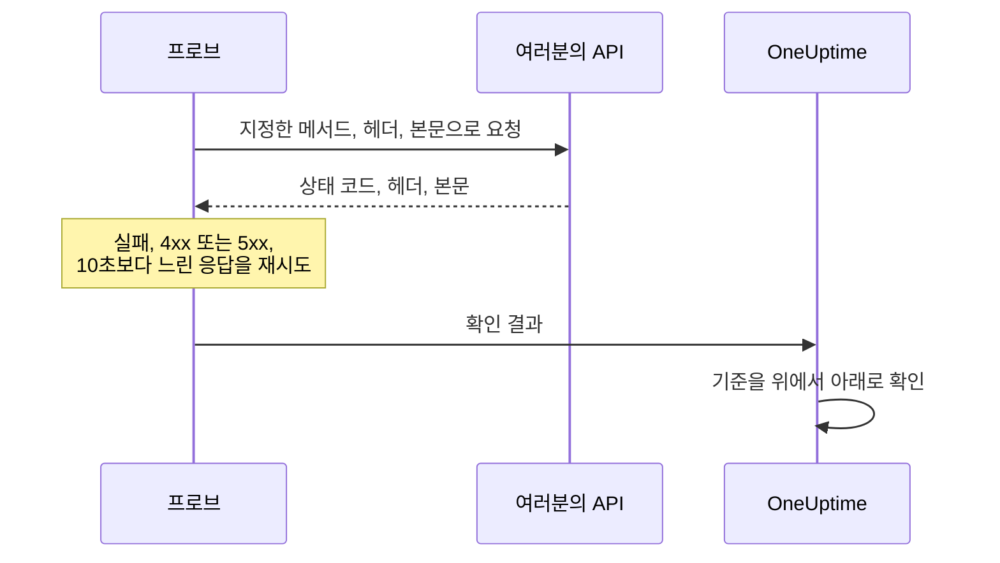

# API 모니터

API 모니터는 여러분이 고른 메서드, 헤더, 본문으로 일정에 따라 HTTP 엔드포인트를 호출하고, 돌아온 것을 확인합니다. 상태 코드, 응답 시간, 헤더, 본문입니다. REST, JSON, GraphQL 엔드포인트, 상태 확인, 그리고 사용자가 의존하는 모든 호출에 사용하세요.

:::cards
- [모니터 만들기](#api-모니터-만들기): 대시보드에서 여섯 단계.
- [구성 옵션](#구성-옵션): 메서드, 헤더, 본문, 리디렉션, 인증서, 시간 초과, 재시도.
- [모니터링 기준](#모니터링-기준): 처음부터 무엇을 정상 또는 중단으로 보는지.
- [문제 해결](#문제-해결): 통과해야 할 확인이 실패할 때.
:::

## 작동 방식

확인할 때마다 프로브는 요청을 보내고, 리디렉션을 따라간 뒤, 상태 코드, 응답 시간, 헤더, 본문을 기록합니다. 실패했거나, 시간 초과되었거나, `4xx` 또는 `5xx` 상태로 응답했거나, 10초보다 오래 걸린 요청은 허용한 재시도 횟수만큼 다시 시도합니다. 그런 다음 OneUptime이 결과를 모니터의 기준에 통과시킵니다.



자체 네트워크 연결을 잃은 프로브는 결과를 보고하지 않으므로 API를 오프라인으로 표시할 수 없습니다.

## 시작하기 전에

- **모니터를 만들 수 있는 역할**: Project Owner, Project Admin, Project Member, Monitor Admin 또는 Monitor Member, 또는 Create Monitor 권한이 있는 사용자 지정 역할.
- **API에 연결할 수 있는 프로브.** 모든 새 모니터에는 프로젝트의 기본 프로브가 선택됩니다. API 앞에 방화벽이 있으면 [OneUptime Cloud의 프로브 IP 주소](/docs/configuration/ip-addresses)를 허용합니다. 프라이빗 네트워크의 API에는 그 네트워크 안에서 실행되고 프라이빗 주소에 연결하도록 허용된 [사용자 지정 프로브](/docs/probe/custom-probe)가 필요합니다. [프라이빗 네트워크 접근](/docs/self-hosted/private-network-access)을 참고하세요.
- **모니터 시크릿으로 저장한 자격 증명.** API에 키나 토큰이 필요하면 먼저 [모니터 시크릿](/docs/monitor/monitor-secrets)으로 저장해, 모니터가 그것에 대한 참조만 갖게 합니다.

## API 모니터 만들기

:::steps
### 새 모니터 시작

**모니터**로 이동해 **모니터 생성**을 클릭합니다. **모니터 유형**에서 **API**를 선택합니다.

### 이름 지정

`Orders API` 같은 **이름**을 입력하고 **다음**을 클릭합니다.

### 요청 입력

**API URL**에 엔드포인트의 전체 URL을 입력합니다(예: `https://api.example.com/health`). **API 요청 유형**을 고릅니다(바꾸지 않으면 **GET**). 헤더나 본문을 추가하려면 **추가 필드**를 열고 **요청 헤더**와 **요청 본문(JSON 형식)** 필드를 채웁니다.

### 테스트

**모니터 테스트**를 클릭하고 **프로브 선택**에서 프로브를 고른 다음 **테스트 실행**을 클릭합니다. **모니터 테스트 결과**에 API가 응답한 내용이 표시됩니다.

### 기준 검토

**모니터 기준**은 [기본 기준](#기본-기준)으로 시작합니다. API가 응답하지 않거나 오류로 응답하면 오프라인, `2xx` 또는 `3xx` 상태면 온라인입니다. API가 반환하는 내용도 확인하려면 필터를 추가한 다음 **다음**을 클릭합니다.

### 프로브 선택 및 생성

**프로브**와 **모니터링 간격**(**5분마다**로 시작)을 그대로 두거나 바꾼 다음 **모니터 생성**을 클릭합니다. 모니터 페이지가 열립니다.
:::

## 구성 옵션

### API URL

호출할 엔드포인트를 스킴을 포함한 전체 URL로 입력합니다(예: `https://api.example.com/v1/health`). URL에 [모니터 시크릿](/docs/monitor/monitor-secrets)을 `{{monitorSecrets.NAME}}` 형태로 넣을 수 있습니다.

### 동적 URL 자리 표시자

API 앞에 CDN이나 캐싱 프록시가 있으면 프로브가 서버 대신 캐시에서 응답을 받을 수 있습니다. 캐시를 우회하려면 URL에 자리 표시자를 추가합니다. 프로브는 확인할 때마다 자리 표시자를 새 값으로 바꿉니다.

| 자리 표시자 | 바뀌는 값 | 값 예시 |
| --- | --- | --- |
| `{{timestamp}}` | 현재 Unix 시간(초) | `1719500000` |
| `{{random}}` | 16진수 32자로 된 임의의 고유 문자열 | `3f2b8c1d9e7a4b6c8d0e1f2a3b4c5d6e` |

자리 표시자가 들어간 URL:

```text
https://api.example.com/health?cb={{timestamp}}
```

5분 간격의 두 번의 확인에서 프로브가 요청하는 URL:

```text
https://api.example.com/health?cb=1719500000
https://api.example.com/health?cb=1719500300
```

`{{random}}`도 같은 방식으로 사용합니다: `https://api.example.com/health?nocache={{random}}`.

### API 요청 유형

보낼 HTTP 메서드입니다. 기본값은 **GET**이고, 나머지는 **POST**, **PUT**, **PATCH**, **DELETE**, **HEAD**입니다. **HEAD** 요청이 `4xx` 또는 `5xx` 상태로 응답받으면 프로브는 그 요청을 `GET`으로 다시 보냅니다.

### 추가 필드

이 설정들은 **추가 필드**에 접혀 있습니다. 접힌 머리글에 설정 이름이 나열되고, 바꾼 설정이 표시됩니다.

| 필드 | 기본값 | 하는 일 |
| --- | --- | --- |
| **요청 헤더** | 없음 | 보낼 헤더를 이름과 값의 쌍으로 지정합니다. 헤더마다 **Request Header 추가**를 클릭합니다. |
| **요청 본문(JSON 형식)** | 없음 | 본문으로 보낼 JSON 객체로, 보통 **POST**, **PUT**, **PATCH**와 함께 씁니다. 올바른 JSON이어야 합니다. |
| **리디렉션을 따르지 않음** | 꺼짐 | 리디렉션을 따라가지 않고 첫 응답을 판단합니다. [아래](#리디렉션을-따르지-않음)를 참고하세요. |
| **자체 서명된 인증서 허용** | 꺼짐 | 모니터 자체의 호스트 이름에 대해 TLS 인증서 검증을 건너뜁니다. |
| **클라이언트 인증서(mTLS) 사용** | 꺼짐 | 클라이언트 인증서와 개인 키를 제시합니다. [클라이언트 인증서(mTLS)](#클라이언트-인증서mtls)를 참고하세요. |
| **요청 시간 초과(초)** | `60` | 각 시도를 기다리는 시간. 최대 60초입니다. |
| **실패 시 재시도** | 프로브 기본값, 보통 `3` | 실패한 시도를 다시 시도하는 횟수. 최대 3번입니다. [재시도와 시간 초과](#재시도와-시간-초과)를 참고하세요. |

요청 헤더와 요청 본문에는 [모니터 시크릿](/docs/monitor/monitor-secrets)을 쓸 수 있습니다. 예를 들어 값이 `Bearer {{monitorSecrets.ApiKey}}`인 `Authorization` 헤더입니다.

#### 리디렉션을 따르지 않음

기본적으로 프로브는 리디렉션(`301`, `302`, `303`, `307`, `308`)을 최대 10번까지 따라가고, 마지막에 도착한 응답을 판단합니다. 대신 리디렉션 응답 자체를 판단하려면 **리디렉션을 따르지 않음**을 켭니다. [기본 기준](#기본-기준)은 리디렉션 응답을 온라인으로 봅니다.

리디렉션을 따라갈 때:

- `303`, 또는 `POST`에 대한 `301`이나 `302`는 브라우저처럼 요청을 본문 없는 `GET`으로 바꿉니다.
- 요청 헤더는 URL 자체의 오리진(같은 스킴, 호스트, 포트)에만 보냅니다. 다른 오리진으로의 리디렉션은 헤더 없이 보냅니다.
- 요청에 아직 본문이 있거나 메서드가 `GET` 또는 `HEAD`가 아니면, 다른 오리진으로의 리디렉션은 확인을 실패시킵니다.
- **자체 서명된 인증서 허용**은 모니터 자체의 호스트 이름에 머무는 리디렉션을 따라갑니다. 다른 호스트 이름으로의 리디렉션은 평소처럼 검증됩니다.

#### 클라이언트 인증서(mTLS)

API에 상호 TLS가 필요하면 **클라이언트 인증서(mTLS) 사용**을 켜고 다음을 입력합니다.

| 필드 | 입력할 내용 |
| --- | --- |
| **클라이언트 인증서 (PEM)** | 제시할 PEM 인코딩 클라이언트 인증서. |
| **클라이언트 개인 키 (PEM)** | 짝이 되는 PEM 인코딩 개인 키. |
| **클라이언트 개인 키 암호** | 선택 사항. 개인 키가 암호화된 경우에만 필요한 암호. |

이는 curl의 `--cert` 및 `--key` 플래그에 해당합니다.

```bash
curl --cert client.crt --key client.key https://api.example.com/health
```

키를 모니터 설정에 두지 않으려면 인증서와 키를 [모니터 시크릿](/docs/monitor/monitor-secrets)으로 저장하고 이 필드에 `{{monitorSecrets.NAME}}`을 입력합니다. 시크릿은 서버에서 채워지며, 그 값은 대시보드에 절대 표시되지 않습니다.

클라이언트 인증서는 요청이 URL의 오리진에 머무는 동안에만 제시됩니다. 다른 오리진으로 리디렉션된 뒤에는 프로브가 인증서 없이 계속합니다.

#### 재시도와 시간 초과

**실패 시 재시도**는 첫 시도 _이후의_ 재시도를 세므로, `0`이면 확인을 한 번 실행하고 `2`면 최대 세 번 실행합니다. 비워 두면 프로브의 기본값을 사용합니다. 프로브의 `PROBE_MONITOR_RETRY_LIMIT`가 다르게 정하지 않는 한 3입니다. 프로브는 시도 사이에 1초를 기다리며, 각 시도에는 **요청 시간 초과(초)** 전체가 주어집니다.

다음 실패는 다시 시도합니다: 연결 오류, 시간 초과, `4xx` 및 `5xx` 응답, 10초보다 느린 응답. 다음은 다시 시도해도 바뀌지 않으므로 다시 시도하지 않습니다: 잘못되었거나 차단된 URL, 10번을 넘는 리디렉션, 512 KiB보다 큰 응답.

## 모니터링 기준

기준은 API를 온라인, 저하됨, 오프라인 중 무엇으로 볼지, 그리고 그에 따라 인시던트를 선언할지 알림을 생성할지를 정합니다. 각 기준은 하나 이상의 필터를 확인합니다.

| 필터 | 조건 | 확인하는 것 |
| --- | --- | --- |
| **Is Online** | **참**, **거짓** | 상태 코드와 관계없이 API가 응답했는지 여부. |
| **응답 상태 코드** | **Equal To**, **Not Equal To**, **Greater Than**, **Less Than**, **Greater Than Or Equal To**, **Less Than Or Equal To** | HTTP 상태 코드. |
| **응답 시간(ms)** | **Greater Than**, **Less Than**, **Greater Than Or Equal To**, **Less Than Or Equal To** | 리디렉션을 포함해 요청에 걸린 시간. |
| **응답 본문** | **포함**, **Not Contains** | 응답 본문의 텍스트. 대소문자를 구분합니다. |
| **Response Header** | **포함**, **Not Contains** | 응답에 이 이름의 헤더가 있는지 여부. `x-request-id`처럼 이름을 소문자로 입력합니다. |
| **Response Header Value** | **포함**, **Not Contains** | 헤더가 정확히 이 값을 가지는지 여부. `application/json`처럼 소문자로 비교합니다. |
| **JavaScript Expression** | **Evaluates To True** | 응답에 대한 식. [JavaScript 표현식](/docs/monitor/javascript-expression)을 참고하세요. |
| **Is Request Timeout** | **참**, **거짓** | 모든 시도에서 요청이 시간 초과되었는지 여부. |

JSON 응답은 키와 값 사이에 공백이 없는 압축된 형태로 확인합니다. **응답 본문**으로 `"status": "ok"`를 찾으려면 `"status":"ok"`를 입력합니다.

**기준 추가**는 필터 이름을 딴 이름이 이미 붙은 기준을 추가합니다(예: _Response Time (in ms) is above 3000_). 직접 이름을 입력하기 전까지 이름은 필터에 따라 바뀝니다. 설명은 선택 사항이며, 추가하려면 기준의 **설정**을 엽니다.

필터가 둘 이상이면 **일치 조건**이 필터가 모두 일치해야 하는지(**전체**), 하나만 일치하면 되는지(**모두**)를 정합니다. 기준의 **작업**은 그 기준이 하는 일을 정합니다: 모니터 상태 변경, 알림 생성, 인시던트 선언, 또는 이들 중 여러 개.

### 기본 기준

새 API 모니터는 두 가지 기준으로 시작하므로, 아무것도 바꾸지 않아도 작동합니다.

- **오프라인** — API가 응답하지 않거나, `400` 이상(또는 `200` 미만)의 상태 코드로 응답합니다. 모니터는 **오프라인**으로 표시되고 인시던트가 생성됩니다. API가 돌아오면 인시던트는 스스로 해결됩니다.
- **온라인** — API가 `200`, `201`, `202`, `204`처럼 `2xx` 또는 `3xx` 상태 코드로 응답합니다. 모니터는 **정상 작동**으로 표시됩니다.

기준 목록에서 두 기준은 모니터 이름을 따서 이름이 붙습니다: _Check if (name) is offline_, _Check if (name) is online_.

따라서 `201 Created` 또는 `204 No Content`로 응답하는 엔드포인트도 정상으로 봅니다. 정상을 뜻하는 상태 코드가 하나뿐이라면 모니터의 **구성 → 기준** 페이지에서 두 기준을 모두 바꿉니다. 예를 들어 각 기준에 있는 두 상태 코드 필터 대신, 온라인 기준에는 **응답 상태 코드** / **Equal To** / `200`을, 오프라인 기준에는 **Not Equal To** / `200`을 둡니다. API가 반환하는 내용도 확인하려면 오프라인 기준에 **응답 본문** 또는 **JavaScript Expression** 필터를 추가합니다.

기준은 위에서 아래로 확인되며, 처음 일치한 기준이 무엇을 할지 정합니다.

일치하는 기준이 없으면 모니터는 기본 상태로 돌아갑니다. 기준 아래의 **추가 필드**에서 다른 상태를 고르지 않으면 **정상 작동**입니다. 접힌 **추가 필드** 머리글에 그 상태가 표시됩니다.

OneUptime이 이 기본값을 바꾸기 전에 만든 모니터는 만들 때의 기준을 유지하며, `200`만 온라인으로 봅니다. API나 Terraform으로 만든 모니터는 보낸 기준을 사용합니다.

### 일정 기간에 걸친 평가

**일정 기간에 걸쳐 이 기준을 평가**는 필터 아래의 확인란으로, **Is Online**, **응답 상태 코드**, **응답 시간(ms)** 필터에 제공됩니다. 켜면 최신 확인 대신 지난 확인들의 기간을 판단합니다. **평가**에서 집계를 고르고, **지난 시간 동안(분)** 항목에서 2분에서 60분 사이의 기간을 고릅니다.

| 집계 | 일치하는 경우 |
| --- | --- |
| **평균**, **합계**, **Maximum Value**, **Minimum Value** | 기간 전체에 대한 그 값이 조건을 충족할 때. 숫자 필터만 해당합니다. |
| **All Values** | 기간 안의 모든 확인이 조건을 충족할 때. |
| **Any Value** | 기간 안의 확인 중 적어도 하나가 조건을 충족할 때. |

**All Values**는 기간이 실제로 데이터로 채워진 뒤에만 일치합니다. 방금 만든 모니터나 확인이 더 이상 기록되지 않는 모니터에는 지난 N분에 대해 말할 만한 기록이 없으므로, 기준은 가진 값 하나로 일치하지 않고 기다립니다. **Any Value**는 "확인 한 번이라도 임계값을 넘으면 바로 알려 달라"를 위한 설정이며, 여전히 즉시 실행됩니다.

**데이터가 없는 경우**는 기간이 기준을 뒷받침할 수 없는 동안 무슨 일이 일어날지 정합니다.

| 옵션 | 일어나는 일 | 용도 |
| --- | --- | --- |
| **Ignore**(기본값) | 기준이 일치하지 않습니다. | 일반적인 임계값 알림. |
| **트리거** | 데이터가 없는 것 자체를 문제로 봅니다. | 침묵 자체가 장애인 확인. |
| **Treat As Zero** | 기간을 하나의 0으로 비교합니다. | 이벤트가 없으면 정말로 0을 뜻하는 카운터. |

### 기준 예시

| 목표 | 필터 | 조건 | 값 |
| --- | --- | --- | --- |
| 느릴 때 API를 저하됨으로 표시 | **응답 시간(ms)** | **Greater Than** | `1000` |
| 상태 확인이 문제를 보고하면 오프라인 | **응답 본문** | **Not Contains** | `"status":"ok"` |
| 같은 확인을 파싱된 JSON에서 읽기 | **JavaScript Expression** | **Evaluates To True** | `"{{responseBody.status}}" !== "ok"` |
| `POST`에서 `201`만 인정 | **응답 상태 코드** | **Equal To** | `201` |

## 문제 해결

:::details API는 내 요청에 응답하는데 모니터는 오프라인임
프로브가 여러분과 다른 응답을 받았습니다. 인시던트의 근본 원인과 모니터의 **모니터링 로그**에 프로브가 본 내용이 표시됩니다. 프로브가 API가 기대하는 것을 보내는지 확인하세요: 메서드, `Authorization` 헤더, 본문. API 앞의 방화벽이나 속도 제한기가 프로브를 차단할 수도 있습니다. [OneUptime Cloud의 프로브 IP 주소](/docs/configuration/ip-addresses)를 허용하세요.
:::

:::details 모니터가 `{{monitorSecrets.NAME}}`을 글자 그대로 보냄
모니터가 시크릿을 사용할 수 없거나 이름이 일치하지 않습니다. 누가 시크릿을 사용할 수 있는지는 [모니터 시크릿](/docs/monitor/monitor-secrets)을 참고하세요.
:::

:::details 확인이 "unsafe cross-origin redirect"로 실패함
API가 본문이 있거나 메서드가 `GET` 또는 `HEAD`가 아닌 요청을 다른 오리진으로 리디렉션했으며, 프로브는 이런 요청을 전달하지 않습니다. API가 리디렉션하는 URL을 모니터 대상으로 하거나, **리디렉션을 따르지 않음**을 켜고 리디렉션 자체를 확인합니다.
:::

:::details 확인이 "Remote response exceeded the allowed size."로 실패함
프로브는 응답을 최대 512 KiB까지만 읽는데, 이 응답은 그보다 큽니다. 페이지 크기를 줄이는 등 더 적게 반환하는 엔드포인트를 호출합니다.
:::

## 다음 단계

:::cards
- [JavaScript 표현식](/docs/monitor/javascript-expression): JSON 응답 깊숙한 곳의 필드를 확인합니다.
- [모니터 시크릿](/docs/monitor/monitor-secrets): API 키와 토큰을 모니터 설정에 두지 않습니다.
- [웹사이트 모니터](/docs/monitor/website-monitor): 엔드포인트 대신 웹 페이지를 확인합니다.
- [인시던트 및 알림 템플릿](/docs/monitor/incident-alert-templating): 응답 세부 정보를 인시던트와 알림 제목에 넣습니다.
:::
