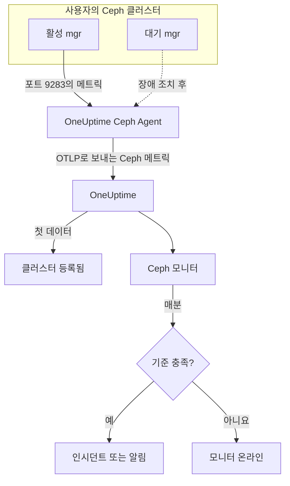

# Ceph 모니터

Ceph 모니터는 하나의 Ceph 클러스터(상태, 헬스 체크, 모니터 쿼럼, OSD, 풀, 배치 그룹)를 감시하고, 상태가 나빠지거나 OSD가 다운되거나 용량이 부족해지는 순간 알려 줍니다. Ceph mgr의 `prometheus` 모듈이 내보내고 OneUptime Ceph Agent가 수집한 `ceph_*` 메트릭을 읽으므로, 외부에서 아무것도 프로브하지 않습니다.

:::cards
- [모니터 만들기](#ceph-모니터-만들기): 대시보드에서 진행하는 6단계.
- [템플릿](#기본-제공-알림-템플릿): 상태, OSD, 배치 그룹, 용량에 대한 23개의 기본 제공 알림.
- [헬스 체크](#헬스-체크-시리즈): 모든 Ceph 헬스 체크에 대해 이름으로 알림을 설정합니다.
- [메트릭](#수집되는-메트릭): 모니터가 알림을 보낼 수 있는 모든 `ceph_*` 시리즈.
:::

## 작동 방식

Ceph mgr의 `prometheus` 모듈은 클러스터의 메트릭을 포트 9283에서 제공합니다. OneUptime Ceph Agent는 30초마다 모든 mgr 데몬을 스크레이프하고(활성 mgr이 응답하며, 대기 mgr은 역할을 넘겨받기 전까지 아무것도 반환하지 않습니다), Ceph 고유의 레이블(`ceph_daemon`, `pool_id`)을 유지한 채 클러스터 이름 `ceph.cluster.name`을 붙여 OTLP로 OneUptime에 메트릭을 보냅니다. 첫 데이터가 도착하면 클러스터가 등록됩니다.

Ceph 모니터는 하나의 클러스터에 연결됩니다. 매분 그 클러스터의 메트릭에 대해 쿼리를 실행하고 결과를 기준과 비교합니다.



## 시작하기 전에

- 클러스터에서 **mgr `prometheus` 모듈을 활성화합니다**:

  ```bash
  ceph mgr module enable prometheus
  ```

- 포트 9283으로 모든 mgr 데몬에 접근할 수 있는 머신에 **Ceph Agent를 설치**하고, 그 데몬을 모두 `CEPH_MGR_ENDPOINTS`에 나열합니다. 설치 방법은 [Ceph 에이전트 가이드](/docs/telemetry/ceph)에서 다룹니다.
- **클러스터가 등록되었는지 확인합니다.** 첫 스크레이프 후 약 1분이 지나면 에이전트의 `CEPH_CLUSTER_NAME` 이름으로 **제품 → 인프라 → Ceph → 모든 클러스터**에 표시됩니다.
- **헬스 체크 알림을 쓰려면** Ceph Quincy 이상을 실행하세요. 이전 릴리스는 `ceph_health_detail`을 내보내지 않습니다.

## Ceph 모니터 만들기

:::steps
### 새 모니터 시작하기

**모니터**로 이동해 **모니터 생성**을 클릭합니다.

### Ceph 선택하기

**모니터 유형**에서 **더 많은 모니터 유형**을 클릭하고 **인프라** 아래의 **Ceph**를 선택하거나, 검색 상자에 `ceph`를 입력합니다. **이름**을 입력하고(인시던트와 알림 제목에 쓰입니다) **다음**을 클릭합니다.

### 클러스터 선택하기

**Ceph Monitor Configuration**에서 **Ceph Cluster** 목록의 클러스터를 선택합니다. 데이터를 보낸 적이 있는 모든 클러스터가 목록에 있습니다.

### 감시할 대상 선택하기

세 탭 중 하나를 선택합니다:

- **Quick Setup**: [템플릿](#기본-제공-알림-템플릿)을 클릭합니다. 템플릿이 메트릭, 필터, 집계, 시간 범위, 임계값을 설정하고, 아래의 기준을 템플릿의 기준으로 바꿉니다. **시간 범위**는 그 뒤에도 바꿀 수 있습니다.
- **Custom Metric**: **Ceph Metric**에서 메트릭 하나를 고른 다음 **집계**와 **시간 범위**를 설정합니다. **OSD**와 **Pool ID**로 데몬 하나나 풀 하나로 좁힐 수 있습니다.
- **고급**: **메트릭 선택**에서 쿼리와 수식을 직접 만듭니다. 예를 들어 `ceph_cluster_total_used_bytes / ceph_cluster_total_bytes`로 사용 용량 비율을 구합니다. **Group by**에 `ceph_daemon` 또는 `pool_id`를 지정하면 데몬이나 풀마다 따로 판단합니다.

### 기준 확인하기

**모니터 기준**에서 각 기준을 열고 **메트릭**, **집계**, **조건**, **Threshold**를 확인합니다. 템플릿을 쓰면 이 값들이 채워집니다. **Custom Metric**이나 **고급**을 쓰면 모니터는 [기본 기준](#기본-기준)으로 시작하는데, 이 기준은 메트릭이 0으로 떨어지는 것만 알아차리므로 직접 임계값을 설정하세요.

### 모니터 만들기

**모니터 생성**을 클릭합니다. OneUptime이 모니터 페이지를 열고 매분 모니터를 평가합니다. 모니터가 만든 인시던트와 알림은 클러스터의 **인시던트** 페이지와 **알림** 페이지에도 표시됩니다.
:::

> [!TIP]
> 여러 템플릿을 한 번에 설정하려면 **제품 → 인프라 → Ceph**에서 클러스터를 열고 **Recommendations**로 이동합니다. 원하는 템플릿과 호출할 사람을 고르면 OneUptime이 템플릿마다 모니터를 하나씩 만듭니다.

## 모니터 설정

| 필드 | 탭 | 역할 |
| --- | --- | --- |
| **Ceph Cluster** | 전체 | 필수. 모든 쿼리를 `resource.ceph.cluster.name`으로 한정합니다. |
| **OSD** | Custom Metric, 고급 | 선택. `ceph_daemon` 레이블과 정확히 일치해야 합니다. 예: `osd.3`. |
| **Pool ID** | Custom Metric, 고급 | 선택. `pool_id` 레이블과 정확히 일치해야 합니다. 예: `2`. |
| **Ceph Metric** | Custom Metric | [카탈로그](#수집되는-메트릭)의 메트릭 하나. |
| **집계** | Custom Metric | 샘플을 합치는 방법: **평균**, **최대**, **최소**, **합계** 또는 **개수**. 처음에는 그 메트릭의 일반적인 집계로 설정됩니다. |
| **시간 범위** | 전체 | 쿼리가 읽는 이동 창으로, **Past 1 Minute**부터 **Past 365 Days**까지입니다. 새 모니터는 **Past 1 Minute**로 시작하고, 템플릿은 자체 값을 설정합니다. |
| **메트릭 선택** | 고급 | 쿼리 빌더: **메트릭**, **Aggregate by**, **Filter by attributes**, **Group by**, 그리고 쿼리를 합치는 **메트릭 추가**와 **수식 추가**. |

풀 데이터 시리즈에는 `pool_id` 레이블만 있습니다. 풀 이름은 `ceph_pool_metadata`에만 있습니다. 풀 시리즈는 `pool_id`로 필터링하고 그룹화하며, 이름이 필요하면 `ceph_pool_metadata`에서 찾아봅니다.

### 헬스 체크 시리즈

`ceph_health_detail`은 **활성 헬스 체크마다 시리즈 하나**를 내보내며, 레이블은 `name`(예: `OSD_NEARFULL` 또는 `RECENT_CRASH`)과 `severity`입니다. 시리즈는 체크가 발생하는 동안에만 존재하므로, 시리즈가 없으면 정상입니다. 모든 Ceph 헬스 체크에 대해 알림을 보내려면 그 `name`으로 필터링하고, **최대**가 `0`을 넘으면 발생시키고, **데이터가 없는 경우**를 **Treat As Zero**로 설정해 `0`에서 복구되게 합니다. 헬스 체크 템플릿이 바로 이렇게 만들어져 있습니다. `ceph_daemon_health_metrics`도 데몬별로 같은 방식으로 동작하며, `type` 레이블(예: `SLOW_OPS`)과 `ceph_daemon`이 키입니다.

## 기본 제공 알림 템플릿

**Quick Setup**에는 클러스터 상태, OSD, 배치 그룹, 용량을 다루는 23개의 템플릿이 있습니다. 각 템플릿은 완전한 모니터(쿼리, 레이블 필터, 그룹화, 발생하는 기준과 복구되는 기준)를 만듭니다. 임계값은 수정할 수 있는 출발점입니다.

템플릿은 표에 따로 적혀 있지 않으면 최근 5분을 읽습니다. 기준은 창의 모든 분 동안 조건이 유지될 때만 발생하며, 임계값 기준은 임계값에서 10% 벗어난 지점에서 복구되므로 경계선 근처를 오가는 값 때문에 상태가 깜박이지 않습니다. **심각도**는 선택 목록에 표시되는 레이블입니다. 템플릿이 만드는 인시던트와 알림은 프로젝트에서 가장 심각한 인시던트 심각도와 알림 심각도로 시작합니다.

### 클러스터 상태 템플릿

| 템플릿 | 심각도 | 감시 대상 | 발생 조건 | 복구 조건 |
| --- | --- | --- | --- | --- |
| Cluster Health Error | 심각 | `ceph_health_status`, Max, 최근 1분 | 2 이상: `HEALTH_ERR` | 1.8 미만: `HEALTH_WARN` 또는 더 나은 상태 |
| Cluster Health Warning | Warning | `ceph_health_status`, Max | 1 이상: `HEALTH_WARN` 또는 더 나쁜 상태 | 0.9 미만: `HEALTH_OK` |
| Monitor Quorum Degraded | 심각 | `ceph_mon_quorum_status`, `ceph_daemon`별 Min, 최근 1분 | 모니터가 1 아래로 떨어져 쿼럼에서 빠짐. 모니터마다 인시던트 하나 | 다시 1 |
| Slow Operations | Warning | `ceph_healthcheck_slow_ops`, Max | 0 초과: 클러스터의 `SLOW_OPS` 체크가 활성 상태 | 0 |
| Daemon Slow Operations | Warning | `type = SLOW_OPS`인 `ceph_daemon_health_metrics`, `ceph_daemon`별 Max | 0 초과. OSD 또는 모니터마다 인시던트 하나 | 시리즈가 사라짐 |
| Daemon Crash | 심각 | `name = RECENT_CRASH`인 `ceph_health_detail`, Max | 체크가 활성 상태: 보관되지 않은 데몬 크래시가 있음. mgr에는 `ceph_crash_*` 메트릭이 없으므로 이것이 유일한 크래시 신호 | 크래시가 보관됨 |
| Monitor Clock Skew | Warning | `name = MON_CLOCK_SKEW`인 `ceph_health_detail`, Max | 체크가 활성 상태: 모니터 시계가 허용된 편차(기본값 0.05초)를 넘어 어긋남 | 체크가 사라짐 |
| Monitor Disk Critically Low | 심각 | `name = MON_DISK_CRIT`인 `ceph_health_detail`, Max | 체크가 활성 상태: 모니터 데이터베이스 디스크의 여유 공간이 5% 미만(기본값) | 체크가 사라짐 |
| Monitor Disk Space Low | Warning | `name = MON_DISK_LOW`인 `ceph_health_detail`, Max | 체크가 활성 상태: 여유 공간이 30% 미만(기본값) | 체크가 사라짐 |

### OSD 템플릿

| 템플릿 | 심각도 | 감시 대상 | 발생 조건 | 복구 조건 |
| --- | --- | --- | --- | --- |
| OSD Down | 심각 | `ceph_osd_up`, `ceph_daemon`별 Min | OSD가 1 아래로 떨어짐. OSD마다 인시던트 하나 | 다시 1 |
| OSD Out | Warning | `ceph_osd_in`, `ceph_daemon`별 Min | OSD가 1 아래로 떨어짐: 데이터 분산에서 out으로 표시됨 | 다시 1 |
| OSD High Latency | Warning | `ceph_osd_apply_latency_ms`, `ceph_daemon`별 Avg | 100 ms 초과. OSD마다 인시던트 하나 | 90 ms 이하 |
| OSD Slow Heartbeats | Warning | `name = OSD_SLOW_PING_TIME_FRONT`와 `name = OSD_SLOW_PING_TIME_BACK`인 `ceph_health_detail`, Max | 둘 중 하나의 체크가 활성 상태: 공용 네트워크나 클러스터 네트워크의 하트비트가 느림. mgr은 핑 시간 게이지를 내보내지 않음 | 두 체크가 모두 사라짐 |

### 배치 그룹 템플릿

| 템플릿 | 심각도 | 감시 대상 | 발생 조건 | 복구 조건 |
| --- | --- | --- | --- | --- |
| Inactive Placement Groups | 심각 | `ceph_pg_total` − `ceph_pg_active`, `pool_id`별 Max | 0 초과: PG가 I/O를 처리하지 못해 PG로 가는 클라이언트 요청이 멈춤. 풀마다 인시던트 하나 | 0 |
| Degraded Placement Groups | Warning | `ceph_pg_degraded`, `pool_id`별 Max | 0 초과: 객체의 복제본이 설정보다 적음 | 0 |
| Undersized Placement Groups | Warning | `ceph_pg_undersized`, `pool_id`별 Max | 0 초과: PG가 복제본 수보다 적은 OSD에 매핑됨 | 0 |
| Damaged Placement Groups | 심각 | `name = PG_DAMAGED`와 `name = OSD_SCRUB_ERRORS`인 `ceph_health_detail`, Max | 둘 중 하나의 체크가 활성 상태: 스크러빙에서 손상이나 읽기 오류가 발견됨 | 두 체크가 모두 사라짐 |

### 용량 템플릿

| 템플릿 | 심각도 | 감시 대상 | 발생 조건 | 복구 조건 |
| --- | --- | --- | --- | --- |
| Cluster Near Full | Warning | `ceph_cluster_total_used_bytes` ÷ `ceph_cluster_total_bytes` × 100 | 85% 초과(Ceph의 기본 nearfull 비율) | 76.5% 이하 |
| Cluster Full | 심각 | 같은 비율 | 95% 초과(Ceph의 기본 full 비율로, 클러스터 전체에서 쓰기가 멈춤) | 85.5% 이하 |
| Pool Near Full | Warning | `ceph_pool_stored` ÷ (`ceph_pool_stored` + `ceph_pool_max_avail`) × 100, `pool_id`별 | 풀이 담을 수 있는 양의 85% 초과. 풀마다 인시던트 하나 | 76.5% 이하 |
| OSD Nearfull | Warning | `name = OSD_NEARFULL`인 `ceph_health_detail`, Max | 체크가 활성 상태: OSD가 nearfull 임계값(기본값 85%)을 넘음. 개별 OSD는 클러스터 평균보다 훨씬 먼저 가득 참 | 체크가 사라짐 |
| OSD Backfillfull | Warning | `name = OSD_BACKFILLFULL`인 `ceph_health_detail`, Max | 체크가 활성 상태: OSD로의 백필이 거부되어(기본값 90%) 복구가 멈춤 | 체크가 사라짐 |
| OSD Full | 심각 | `name = OSD_FULL`인 `ceph_health_detail`, Max, 최근 1분 | 체크가 활성 상태: OSD가 full 임계값(기본값 95%)에 도달해 쓰기가 거부됨 | 체크가 사라짐 |

- **다운과 쿼럼 템플릿은 최소를 사용**하므로, 다운된 OSD 하나나 쿼럼에서 빠진 모니터 하나가 정상인 다수에 가려지지 않고 템플릿을 발생시킵니다.
- **개수와 헬스 체크 템플릿은 최대를 사용**하므로, 잘못된 스크레이프 한 번으로 충분합니다.
- **PG와 풀 시리즈는 풀별입니다**: 클러스터 전체 게이지가 없으므로 이 템플릿들은 `pool_id`로 그룹화하고 풀마다 인시던트를 하나씩 엽니다.
- **용량 비율**은 양쪽의 **합계**를 사용합니다. 둘 다 같은 mgr 스크레이프에서 오므로 결과는 실제 백분율입니다. **Inactive Placement Groups**는 대신 풀별 **최대**를 사용합니다. 뺄셈에서 합계를 쓰면 여러 스크레이프가 더해지기 때문입니다.
- **헬스 체크 템플릿**은 체크가 사라지면 복구됩니다. 복구 기준이 없는 시리즈를 0으로 세기 때문입니다.

일부 알림에는 템플릿이 없습니다. PG 불균형에는 기준이 계산할 수 없는, 여러 시리즈에 걸친 통계가 필요합니다. 용량 예측에는 증가 추세 피팅이 필요하며, 대신 클러스터 대시보드가 이를 그립니다. 디스크 장애 예측과 스크럽 지연에는 mgr 메트릭이 없고, NVMe-oF, RBD 미러링, cephadm에는 다른 익스포터가 필요합니다.

## 수집되는 메트릭

에이전트는 30초마다 모든 mgr 데몬을 스크레이프하고 Ceph 고유의 레이블을 유지하므로, 데몬별 시리즈에는 `ceph_daemon`(`osd.3`, `mon.a`)이, 풀별 시리즈에는 `pool_id`가 붙습니다.

### 클러스터 상태 메트릭

| 메트릭 | 단위 | 설명 |
| --- | --- | --- |
| `ceph_health_status` | — | 전체 상태: 0 = `HEALTH_OK`, 1 = `HEALTH_WARN`, 2 = `HEALTH_ERR`. |
| `ceph_health_detail` | 개수 | **활성** 헬스 체크마다 시리즈 하나. 레이블은 `name`과 `severity`. Quincy 이상만 해당. |
| `ceph_healthcheck_slow_ops` | 개수 | `SLOW_OPS` 체크가 보고하는 느린 OSD 및 모니터 작업. |
| `ceph_daemon_health_metrics` | 개수 | 데몬별 상태 메트릭. 키는 `type`(예: `SLOW_OPS`)과 `ceph_daemon`. |
| `ceph_mon_quorum_status` | 개수 | 모니터가 쿼럼에 있으면 1. `ceph_daemon`(예: `mon.a`)별. |
| `ceph_mon_metadata` | 개수 | 모니터 메타데이터. 항상 1. 합계하면 모니터 수가 됩니다. |
| `ceph_cluster_total_bytes` | 바이트 | 전체 원시 용량. |
| `ceph_cluster_total_used_bytes` | 바이트 | 사용 중인 원시 용량. |

### OSD 메트릭

| 메트릭 | 단위 | 설명 |
| --- | --- | --- |
| `ceph_osd_up` | 개수 | OSD가 up이면 1. `ceph_daemon`(예: `osd.3`)별. |
| `ceph_osd_in` | 개수 | OSD가 데이터 분산에 포함되어 있으면 1. |
| `ceph_osd_apply_latency_ms` | ms | 작업을 백엔드 저장소에 적용하는 데 걸린 시간. |
| `ceph_osd_commit_latency_ms` | ms | 작업을 저널이나 WAL에 커밋하는 데 걸린 시간. |
| `ceph_osd_stat_bytes` | 바이트 | OSD 장치의 원시 용량. |
| `ceph_osd_stat_bytes_used` | 바이트 | OSD에서 사용 중인 원시 바이트. 전체 용량과 비교하면 고르지 않거나 거의 가득 찬 OSD를 찾을 수 있습니다. |
| `ceph_osd_numpg` | 개수 | OSD에 있는 배치 그룹. |
| `ceph_osd_metadata` | 개수 | OSD 메타데이터(호스트 이름, 장치 클래스, 버전). 항상 1. 합계하면 OSD 수가 됩니다. |

### 풀 메트릭

| 메트릭 | 단위 | 설명 |
| --- | --- | --- |
| `ceph_pool_stored` | 바이트 | 풀에 저장된 사용자 데이터. |
| `ceph_pool_max_avail` | 바이트 | 복제 또는 이레이저 코딩 프로필을 고려할 때 풀에 아직 쓸 수 있는 바이트. |
| `ceph_pool_objects` | 개수 | 풀의 객체. |
| `ceph_pool_rd` | 작업 | 풀의 읽기 작업. 누적 카운터. |
| `ceph_pool_wr` | 작업 | 풀의 쓰기 작업. 누적 카운터. |
| `ceph_pool_rd_bytes` | 바이트 | 풀에서 읽은 바이트. 누적 카운터. |
| `ceph_pool_wr_bytes` | 바이트 | 풀에 쓴 바이트. 누적 카운터. |
| `ceph_pool_metadata` | 개수 | 풀 메타데이터. 항상 1이며, `pool_id`를 이름에 연결하는 유일한 시리즈입니다. |

### 배치 그룹 메트릭

모든 `ceph_pg_*` 시리즈는 풀별이며 `pool_id` 레이블이 붙습니다. 클러스터 전체 개수는 모든 풀에 걸쳐 합계해서 구합니다.

| 메트릭 | 단위 | 설명 |
| --- | --- | --- |
| `ceph_pg_total` | 개수 | 풀의 배치 그룹. |
| `ceph_pg_active` | 개수 | `active` 상태로 I/O를 처리할 수 있는 PG. |
| `ceph_pg_clean` | 개수 | `clean` 상태로 완전히 복제된 PG. |
| `ceph_pg_degraded` | 개수 | `degraded` 상태의 PG. |
| `ceph_pg_undersized` | 개수 | `undersized` 상태의 PG. |
| `ceph_num_objects_degraded` | 개수 | 복제본이 설정보다 적은 객체. |
| `ceph_num_objects_misplaced` | 개수 | CRUSH가 원하는 위치에 있지 않은 객체. 데이터는 안전하며, 배치만 잘못되었습니다. |

## 모니터링 기준

기준은 모니터의 쿼리나 수식 하나를 임계값과 비교합니다. Ceph 모니터의 기준에는 **필터 유형**이 없습니다. 모든 규칙은 다음 필드로 메트릭 값을 확인합니다.

| 필드 | 역할 |
| --- | --- |
| **메트릭** | 확인할 쿼리나 수식으로, 변수 이름으로 지정합니다. |
| **집계** | 창 안의 값을 하나의 답으로 만드는 방법: **평균**, **합계**, **Maximum Value**, **Minimum Value**, **All Values**(모든 값이 일치해야 함) 또는 **Any Value**(하나면 충분). |
| **조건** | **Greater Than**, **Less Than**, **Greater Than Or Equal To**, **Less Than Or Equal To** 또는 **Equal To**, 아니면 이상 조건인 **Anomalously High**, **Anomalously Low** 또는 **Anomalous**. |
| **Threshold** | 비교할 값. 메트릭에 단위가 있으면 옆에 단위 목록이 있습니다. 이상 조건에서는 표시되지 않습니다. |
| **민감도** | 이상 조건 전용. **Low**(4σ), **Medium**(3σ, 기본값) 또는 **High**(2σ). |
| **기준선 기간** | 이상 조건 전용. 14일(기본값), 28일, 60일 또는 90일의 기록. |
| **데이터가 없는 경우** | **추가 필드** 아래에 있습니다. 창에 샘플이 없을 때의 동작: **Ignore**(기본값), **Treat As Zero** 또는 **트리거**. |

이상 조건은 각 값을 기준선에서 같은 요일의 같은 시간대와 비교합니다. 기준선 기간에 기록이 충분히 쌓일 때까지는 "Learning" 상태로 머물며 아무것도 발생시키지 않습니다.

각 기준은 일치할 때 할 일도 정합니다. 모니터 상태 변경, 알림 생성, 인시던트 선언 중 하나입니다. 기준은 위에서 아래로 확인되며, 처음 일치한 기준이 결정합니다.

### 기본 기준

템플릿으로 만들지 않은 모니터는 두 가지 기준으로 시작합니다:

| 순서 | 기준 | 일치 조건 | 결과 |
| --- | --- | --- | --- |
| 1 | Check if _모니터 이름_ is offline | 첫 번째 쿼리의 값 중 하나가 `0` | 모니터를 **오프라인**으로 표시하고 인시던트 "_모니터 이름_ is offline"을 선언합니다. 이 인시던트는 모니터가 복구되면 자동으로 해결됩니다. |
| 2 | Check if _모니터 이름_ is online | 값 중 하나가 `0`보다 큼 | 모니터를 **정상 작동**으로 표시합니다. |

이 기본값이 맞는 Ceph 메트릭은 거의 없습니다. `ceph_health_status`는 클러스터가 정상일 때 0입니다. 템플릿을 고르거나 직접 기준을 설정하세요.

> [!IMPORTANT]
> 데이터가 오지 않는 상태는 어느 기준과도 일치하지 않습니다. 데이터 전송을 멈춘 클러스터는 모니터를 이전 상태 그대로 둡니다. 데이터가 멈췄을 때 알림을 받으려면 기준 하나에서 **데이터가 없는 경우**를 **트리거**로 설정하세요.

## 문제 해결

:::details 클러스터가 Ceph Cluster 목록에 없음
클러스터는 에이전트의 데이터로 스스로 등록됩니다. 에이전트가 실행 중이고 데이터를 보내고 있는지([Ceph 에이전트 가이드](/docs/telemetry/ceph) 참조), 그리고 `CEPH_CLUSTER_NAME`이 설정되어 있는지 확인합니다.
:::

:::details mgr 장애 조치 후 메트릭이 멈춤
에이전트는 활성 mgr만이 아니라 **모든** mgr 데몬을 스크레이프해야 합니다. 대기 mgr은 역할을 넘겨받기 전까지 아무것도 반환하지 않습니다. `CEPH_MGR_ENDPOINTS`에 모든 mgr을 나열하세요.
:::

:::details ceph_health_status가 1인데 아무것도 발생하지 않음
기준이 **Greater Than**이 아니라 **Greater Than Or Equal To** `1`을 쓰는지, 그리고 모니터의 **시간 범위**가 30초 간격의 스크레이프를 적어도 한 번 포함하는지 확인합니다.
:::

:::details 헬스 체크 템플릿이 발생하지 않음
`ceph_health_detail`을 감시하는 템플릿(Daemon Crash, Monitor Clock Skew, OSD Nearfull, OSD Backfillfull, OSD Full, 모니터 디스크 템플릿 두 개, Damaged Placement Groups, OSD Slow Heartbeats)에는 Quincy 이상의 mgr `prometheus` 모듈이 필요합니다. 체크가 활성 상태인 동안 시리즈가 있는지 확인하세요:

```bash
curl http://ACTIVE_MGR:9283/metrics | grep ceph_health_detail
```

헬스 체크 시리즈는 `ceph_daemon_health_metrics`를 포함해 체크가 발생하는 동안에만 존재하므로, 클러스터가 정상일 때 아무것도 보이지 않는 것은 예상된 동작입니다.
:::

:::details ceph_pool_wr_bytes 같은 카운터가 계속 증가하기만 함
풀 I/O 시리즈는 누적 카운터이고 기준은 원시 값을 비교합니다. 비율 연산자는 없으며, 쿼리 빌더의 **Convert to per-second rate**는 차트만 바꿉니다. 비율로 차트를 그리거나, 같은 카운터의 **최대** 쿼리에서 **최소** 쿼리를 빼는 수식으로 증가량에 대해 알림을 보내세요.
:::

## 다음 단계

:::cards
- [Ceph 에이전트](/docs/telemetry/ceph): 이 모니터가 읽는 에이전트를 설치하고 업그레이드합니다.
- [Proxmox 모니터](/docs/monitor/proxmox-monitor): 스토리지를 사용하는 Proxmox VE 클러스터를 감시합니다.
- [스토리지 어레이 모니터](/docs/monitor/storage-array-monitor): Pure Storage 어레이를 위한 같은 종류의 모니터.
- [인시던트](/docs/incidents/index): 기준이 인시던트를 선언한 뒤에 일어나는 일.
:::
