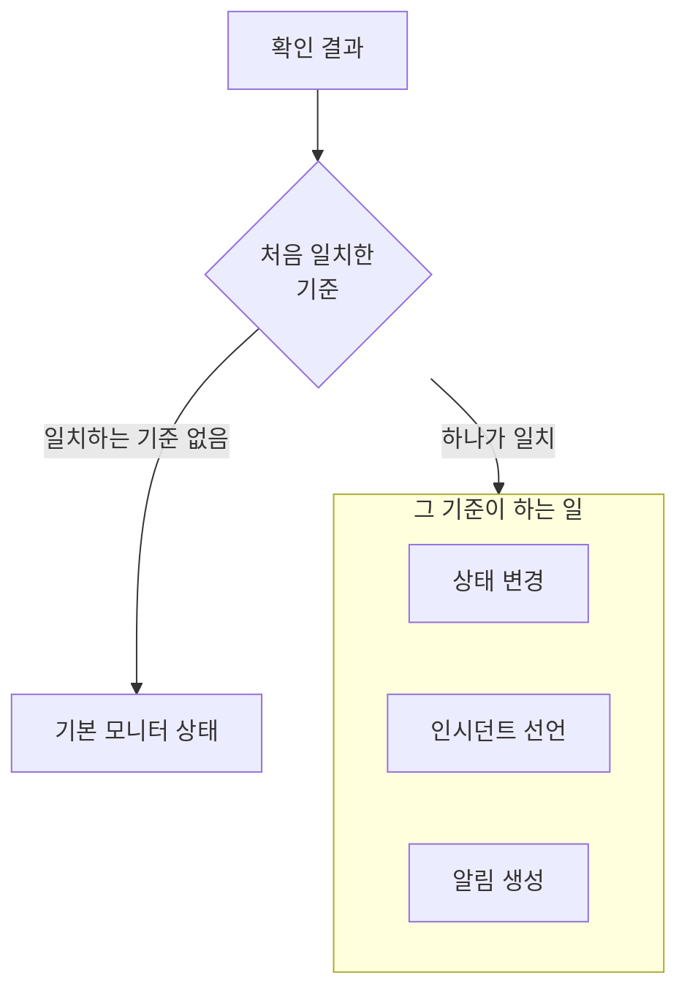

# 모니터 만들기

모니터는 웹사이트, API, 호스트, Kubernetes 클러스터처럼 여러분이 운영하는 대상을 확인하고, 그것이 작동을 멈추면 알려 줍니다. **모니터 생성**은 먼저 무엇을 모니터링할지, 다음으로 무엇을 확인할지, 그리고 얼마나 자주 확인할지를 묻습니다. 유형, 이름, 확인 대상을 제외한 모든 항목은 대부분의 모니터에 맞는 기본값으로 시작합니다.

> [!NOTE]
> 모니터를 만들려면 Project Owner, Project Admin, Project Member, Monitor Admin 또는 Monitor Member 역할이나 Create Monitor 권한이 있는 사용자 지정 역할이 필요합니다.

## 모니터 정보

첫 번째 단계에서는 무엇을 모니터링할지와 모니터의 이름을 묻습니다.

:::steps
### 모니터 생성 열기

**모니터**로 이동해 **모니터 생성**을 클릭합니다. 양식이 첫 번째 단계인 **모니터 정보**에서 열립니다.

### 모니터 유형 선택

첫 질문은 **모니터 유형**입니다. 무엇을 모니터링하시겠습니까?

- 가장 많이 만드는 여섯 가지 유형이 먼저 나옵니다. **웹사이트**, **API**, **Ping**, **포트**, **SSL Certificate**, 그리고 cron 작업과 웹훅의 하트비트를 위한 **Incoming Request**입니다.
- **더 많은 모니터 유형**은 나머지 모든 유형을 범주별로 보여 줍니다. 예를 들어 **인프라**(Kubernetes, Docker, 호스트)와 **텔레메트리**(로그, 메트릭, 트레이스)가 있습니다. 상태를 직접 설정하는 모니터인 **Manual**은 **기타** 아래에 있습니다.
- 또는 검색 상자에 입력합니다. 검색은 `k8s`, `postgres`, `heartbeat`, `tls`처럼 이미 쓰는 단어를 알아듣고, **Enter**를 누르면 첫 번째 결과가 선택됩니다.

선택한 유형은 한 줄로 줄어듭니다. 다른 유형을 고르려면 **변경**을 클릭하고, 고르는 도중 **Escape**를 누르면 원래 유형이 유지됩니다.

### 모니터 이름 지정

**이름**을 입력합니다. 이름은 알림과 인시던트 제목에 사용됩니다. **설명**과 **레이블**은 선택 사항이며 **추가 필드**에 있습니다.

**Manual** 모니터는 더 필요한 것이 없으므로 **모니터 생성**이 이 단계에 있습니다. 다른 유형에서는 **다음**을 클릭합니다.
:::

## 기준

두 번째 단계에서는 무엇을 확인할지 묻고, 무엇을 문제로 볼지 정합니다.

:::steps
### 확인할 대상 입력

이 단계는 확인할 대상을 입력하는 것으로 시작합니다. 웹사이트라면 그 URL이며, 상자에 예시가 표시됩니다. 다른 유형은 호스트, 쿼리, 클러스터, 로그 필터 등을 묻습니다. 시간 초과나 재시도처럼 대부분의 모니터가 바꾸지 않는 설정은 **추가 필드**에 접혀 있습니다.

프로브가 확인하는 모니터에서는 **모니터 테스트**로 저장하기 전에 확인을 한 번 실행할 수 있습니다. **프로브 선택**에서 프로브를 고르고 **테스트 실행**을 클릭합니다. 결과는 **모니터 테스트 결과**에 열립니다.

### 기준 검토

그 아래의 **모니터 기준**은 모니터가 상태를 바꾸거나, 인시던트를 선언하거나, 알림을 생성하는 시점을 정합니다. 새 모니터는 대부분의 모니터에 맞는 기준으로 시작하며, 각 기준은 무엇을 확인하고 무엇을 하는지 말해 주는 한 줄로 접혀 있습니다. 예를 들어 새 웹사이트 모니터는 사이트가 응답하지 않거나 오류 상태 코드로 응답하면 오프라인으로 표시되고 인시던트를 선언합니다.

기준을 클릭하면 열어서 바꿀 수 있습니다. **기준 추가**는 바로 입력할 수 있도록 열린 기준을 하나 추가합니다. 순서를 바꾸려면 기준 왼쪽의 핸들을 끌어 옮깁니다.

### 다음 단계로 이동

**다음**을 클릭합니다. **다음**을 클릭하기 전까지 이 단계에서 누락으로 표시되는 항목은 없습니다.
:::

### 기준 평가 방식

각 확인 결과는 기준을 위에서 아래로 거치며, 처음 일치한 기준이 무엇을 할지 정합니다. 그 기준은 모니터 상태를 바꾸거나, 인시던트를 선언하거나, 알림을 생성하거나, 이들을 함께 할 수 있습니다. 일치하는 기준이 없으면 모니터는 **기본 모니터 상태**를 표시하며, 이는 기준 아래의 **추가 필드**에서 설정합니다(다른 상태를 고르지 않으면 **정상 작동**).

기본 기준처럼 자동으로 해결되도록 설정한 인시던트와 알림은 기준이 더 이상 일치하지 않으면 스스로 해결됩니다. 둘 이상의 프로브가 확인하는 모니터는 프로브들의 결과가 일치할 때만 바뀝니다. 기본적으로 켜져 있고 연결된 모든 프로브가 같은 결과에 도달해야 합니다. 요구하는 수를 줄이려면 모니터의 **구성 → 프로브 및 간격** 페이지에서 **프로브 합의**를 설정합니다.

## 프로브 및 간격

프로브가 확인하는 모니터는 이 단계로 끝납니다. 웹사이트, API, Ping, IP, 포트, SSL Certificate, DNS, DNSSEC, NTP, 도메인, SQL Query, Database Health, Synthetic Monitor, Custom JavaScript Code, External Status Page입니다. **프로브**는 확인을 실행하는 머신이며, 프로젝트의 기본 프로브가 처음부터 선택되어 있습니다. **모니터링 간격**은 **5분마다**로 시작합니다.

:::steps
### 프로브 선택

선택된 **프로브**를 그대로 두거나 다른 프로브를 고릅니다. 프로브가 없는 모니터는 확인되지 않습니다. 프라이빗 네트워크의 대상을 확인하려면 그 네트워크 안에서 [사용자 지정 프로브](/docs/probe/custom-probe)를 실행하고 여기서 선택합니다.

### 확인 주기 선택

**매분**부터 **매주**까지 중에서 **모니터링 간격**을 고릅니다. Synthetic Monitor, Custom JavaScript Code, SSL Certificate 모니터에는 5분 이상의 간격만 제공됩니다.

### 모니터 생성

**모니터 생성**을 클릭합니다. 새 모니터의 페이지가 열립니다. 나중에 프로브나 간격을 바꾸려면 그 페이지에서 **구성 → 프로브 및 간격**을 엽니다.
:::

Manual을 제외한 다른 모든 유형은 **기준** 단계에서 생성됩니다.

## 템플릿이나 링크에서 시작하기

모니터 템플릿, 그리고 OneUptime의 다른 곳(메트릭 차트, 네트워크 장치, 탐지 규칙)에서 모니터를 만드는 링크는 유형이 선택되고 나머지가 채워진 상태로 **모니터 생성**을 엽니다. 다른 유형을 고르려면 **변경**을 클릭합니다. 템플릿의 양식도 같은 유형 선택기를 사용합니다. [모니터 템플릿](/docs/monitor/monitor-templates)을 참고하세요.

모니터 유형마다 설정, 기본 기준, 예시를 담은 전용 페이지가 있습니다. 다음으로 가 볼 만한 곳:

:::cards
- [웹사이트 모니터](/docs/monitor/website-monitor): 페이지가 로드되는지, 무엇을 응답하는지 확인합니다.
- [API 모니터](/docs/monitor/api-monitor): 메서드, 헤더, 본문을 지정해 엔드포인트를 호출합니다.
- [모니터 템플릿](/docs/monitor/monitor-templates): 하나의 구성으로 많은 모니터를 만들고 똑같이 유지합니다.
- [인시던트](/docs/incidents/index): 모니터가 인시던트를 선언한 뒤에 일어나는 일.
:::
