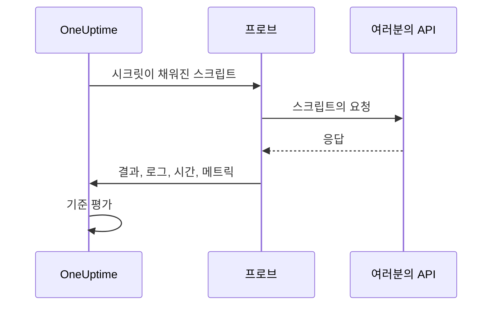

# 사용자 지정 코드 모니터

사용자 지정 코드 모니터는 직접 작성한 JavaScript 스크립트를 프로브에서 일정에 따라 실행합니다. 다른 모니터 유형으로는 표현할 수 없는 검사에 사용하세요. 예를 들어 로그인한 뒤 인증된 API를 호출하는 흐름, 여러 단계로 이루어진 트랜잭션, 여러 응답에서 계산한 값 같은 것입니다. 스크립트가 예외를 던지면 검사가 실패하고, 스크립트가 반환한 값은 기준과 인시던트 템플릿에서 사용할 수 있습니다.

:::cards
- [모니터 만들기](#사용자-지정-코드-모니터-만들기): 스크립트를 작성하고 이를 실행할 프로브를 고릅니다.
- [스크립트 작성](#스크립트-작성): 바로 실행할 수 있는 여러 단계의 API 검사로 시작합니다.
- [시크릿 사용](#모니터-시크릿-사용): 비밀번호와 토큰을 스크립트에서 빼 둡니다.
- [사용자 정의 메트릭 기록](#사용자-정의-메트릭): 스크립트가 계산한 모든 숫자를 차트로 그립니다.
:::

## 작동 방식

검사할 때마다 프로브는 모니터 시크릿이 이미 채워진 상태로, 격리된 JavaScript 샌드박스에서 스크립트를 실행합니다. 스크립트는 필요한 것을 호출한 뒤 결과를 반환하거나 오류를 던집니다. 프로브는 결과, 스크립트의 로그 메시지, 실행 시간, 기록된 메트릭을 보고하고, OneUptime은 이를 바탕으로 기준을 평가합니다.



샌드박스는 Node.js가 아닙니다. `require`, `process`, `fetch`, 파일 시스템이 없으며, [아래에 나열된 모듈](#스크립트에서-사용할-수-있는-모듈)만 사용할 수 있습니다.

## 시작하기 전에

- 스크립트가 호출하는 모든 엔드포인트에 도달할 수 있는 **프로브**. 네트워크 내부의 엔드포인트에는 [사용자 지정 프로브](/docs/probe/custom-probe)를 사용하세요.
- 사설 주소(예: `10.0.0.5`)를 호출하려면 프로브가 이를 허용해야 합니다. 해당 프로브에 `PROBE_ALLOW_PRIVATE_NETWORK_MONITORS=true` 를 설정하세요. 루프백, 링크 로컬, 클라우드 메타데이터 주소는 항상 거부됩니다. [프라이빗 네트워크 접근](/docs/self-hosted/private-network-access)을 참고하세요.
- 스크립트에 필요한 모든 비밀번호, API 키, 토큰을 [모니터 시크릿](/docs/monitor/monitor-secrets)으로 저장해 둡니다.

## 사용자 지정 코드 모니터 만들기

:::steps
### 새 모니터 시작

**모니터** 로 이동해 **모니터 생성** 을 클릭합니다. **모니터 유형** 에서 **더 많은 모니터 유형** 을 클릭하고 **Synthetic Monitoring** 아래의 **Custom JavaScript Code** 를 선택하거나, 검색 상자에 `script` 를 입력합니다. **이름** 을 입력한 다음 **다음** 을 클릭합니다.

### 스크립트 추가

**JavaScript 코드** 편집기에 스크립트를 작성합니다. [아래 예제](#스크립트-작성)에서 시작하세요.

### 테스트

**모니터 테스트** 를 클릭해 프로브에서 스크립트를 한 번 실행하고 결과를 확인합니다.

### 기준 검토

모니터는 두 가지 기준으로 시작합니다. 스크립트가 실패하면 오프라인이 되고 인시던트를 선언하며, 실패하지 않으면 온라인이 됩니다. 기준을 바꾸거나 직접 추가한 뒤([기준](#기준) 참고) **다음** 을 클릭합니다.

### 프로브 선택 및 생성

엔드포인트에 도달할 수 있는 **프로브** 와 **모니터링 간격** 을 선택하고(사용자 지정 코드 모니터는 5분 이상의 간격을 제공합니다) **모니터 생성** 을 클릭합니다.
:::

## 스크립트 작성

스크립트는 `async` 함수의 본문입니다. 최상위에서 `await` 를 쓰고, `return` 으로 결과를 반환하고, `throw` 로 검사를 실패시킬 수 있습니다. 다음 예제는 로그인한 뒤 돌려받은 토큰으로 엔드포인트를 호출하고, 응답이 예상과 다르면 실패합니다.

```javascript title="Custom code monitor script"
// 1. Log in. axios rejects a 4xx or 5xx response, which fails the check.
const login = await axios.post("https://api.example.com/v1/login", {
  username: "monitoring@example.com",
  password: "{{monitorSecrets.ApiPassword}}",
});

// 2. Call an endpoint that needs the token.
const orders = await axios.get("https://api.example.com/v1/orders?limit=10", {
  headers: { Authorization: `Bearer ${login.data.token}` },
  timeout: 10000,
});

// 3. Fail the check when the data is wrong, not only when the request fails.
if (!Array.isArray(orders.data.items)) {
  throw new Error("The orders endpoint returned no items");
}

console.log(`Fetched ${orders.data.items.length} orders`);

// 4. Return what the criteria and incident templates should see.
return {
  data: orders.data.items.length,
};
```

| 목적 | 방법 | OneUptime이 기록하는 것 |
| --- | --- | --- |
| 결과 보고 | 임의의 JSON 값으로 `return { data: ... }` | **결과**. `data` 속성만 유지되므로 `return 5` 는 결과를 기록하지 않습니다. |
| 검사 실패 | `throw new Error("...")` | **스크립트 오류**. 기본 기준이 이를 인시던트로 만듭니다. |
| 흔적 남기기 | `console.log(...)` | **로그 메시지**. 실행당 최대 1,000개입니다. |

실행 내용을 보려면 모니터의 **개요** 를 엽니다. **모니터 요약** 카드에는 프로브, 실행 시간, 오류가 표시되고, **자세히 보기** 를 누르면 결과, 스크립트 오류, 로그 메시지가 표시됩니다. 이전 검사에 대해서는 **모니터링 로그** 에 같은 요약이 있습니다.

> [!NOTE]
> 이 샌드박스의 `axios` 는 리디렉션을 따르지 않으며, 요청은 프로브에 설정된 프록시를 거치지 않습니다. 최종 URL로 요청하세요.

## 모니터 시크릿 사용

스크립트 어디에서나 시크릿을 `{{monitorSecrets.NAME}}` 으로 참조합니다. OneUptime은 스크립트가 프로브에 도달하기 전에 참조를 시크릿 값으로, 일반 텍스트 그대로 바꿉니다. 따라서 문자열로 쓰려면 시크릿을 따옴표로 감싸고, 숫자나 불리언으로 쓰려면 따옴표 없이 둡니다.

```javascript
// Used as a string: wrap it in quotes.
const apiKey = "{{monitorSecrets.ApiKey}}";

// Used as a number or a boolean: leave it bare.
const retryLimit = {{monitorSecrets.RetryLimit}};
const verbose = {{monitorSecrets.Verbose}};

// Check the secret was filled in without logging the secret itself.
console.log(apiKey.length > 0);
```

따옴표가 들어 있는 시크릿 값은 그것을 둘러싼 문자열을 깨뜨립니다. 모니터가 사용할 수 없는 참조는 작성된 그대로 스크립트에 남습니다. 시크릿을 만들고 사용할 수 있는 모니터를 고르는 방법은 [모니터 시크릿](/docs/monitor/monitor-secrets)을 참고하세요.

## 사용자 정의 메트릭

`oneuptime.captureMetric()` 함수로 스크립트에서 사용자 정의 메트릭을 기록할 수 있습니다. 이 메트릭은 OneUptime에 저장되며, Metric Explorer를 사용해 대시보드에 차트로 그릴 수 있습니다.

```javascript
oneuptime.captureMetric(name, value, attributes);
```

| 매개변수 | 유형 | 설명 |
| --- | --- | --- |
| `name` | string, 필수 | 메트릭 이름(예: `"api.response.time"`). 자동으로 `custom.monitor.` 접두사가 붙어 저장됩니다. |
| `value` | number, 필수 | 메트릭의 숫자 값. 숫자가 아닌 값은 무시됩니다. |
| `attributes` | object, 선택 | 추가 컨텍스트를 위한 키-값 쌍. 문자열, 숫자, 불리언 값이 기록됩니다(메트릭 속성은 측정값이 아니라 차원이므로 숫자와 불리언은 텍스트로 저장됩니다). 그 밖의 유형의 값은 무시됩니다. |

### 예제

```javascript
const response = await axios.get("https://api.example.com/health");

// Capture a simple metric
oneuptime.captureMetric("api.response.time", response.data.latency);

// Capture a metric with attributes
oneuptime.captureMetric("api.queue.depth", response.data.queueDepth, {
  region: "us-east-1",
  environment: "production",
});

return {
  data: response.data,
};
```

기록된 메트릭은 Metric Explorer에 `custom.monitor.api.response.time` 같은 이름으로 나타나고, 모니터의 **메트릭** 페이지의 **사용자 정의 메트릭** 에도 나타납니다. OneUptime은 모든 데이터 포인트에 모니터와 프로브를 추가하므로, 이를 차트로 그리고, 알림을 설정하고, 모니터, 프로브 또는 직접 지정한 사용자 정의 속성으로 필터링할 수 있습니다.

### 제한

| 제한 | 값 | 제한을 넘으면 |
| --- | --- | --- |
| 스크립트 실행당 메트릭 | 100 | 이후 호출은 무시됩니다. |
| 메트릭 이름 길이 | 200자 | 이름이 잘립니다. |
| 메트릭당 속성 | 50 | 이후 속성은 버려집니다. |
| 속성 키 길이 | 200자 | 키가 잘립니다. |
| 속성 값 길이 | 1000자 | 값이 잘립니다. |

### 예약된 속성 키

일부 속성 이름은 OneUptime 자체의 것이므로 스크립트가 쓸 수 없습니다. 스크립트가 이런 속성을 설정하면 그 속성은 버려지고(메트릭 자체는 그대로 기록됩니다), 키 이름을 담은 경고가 OneUptime 서버 로그에 기록됩니다. 해당하는 것은 다음과 같습니다.

- 모니터의 식별 정보: `monitorId`, `projectId`, `monitorName`, `probeName`, `probeId`, `isCustomMetric`.
- `oneuptime.` 또는 `resource.` 네임스페이스의 모든 것. 여기에는 OneUptime이 수집 시점에 붙이는 식별자가 들어 있습니다.
- 리소스 식별 속성: `service.name`, `host.name`, `k8s.cluster.name`, `iot.fleet.name`, `proxmox.cluster.name`, `vmware.vcenter.name`, `ceph.cluster.name`, `storage.array.name`, `docker.swarm.cluster.name`.

이 이름들은 단순한 레이블이 아닙니다. OneUptime은 이를 데이터 포인트가 어느 리소스에 속하는지에 대한 주장으로 읽습니다. `service.name: payments-api` 가 붙은 메트릭은 그 서비스의 메트릭 탭에 나타나고, 나중에 `service.name` 으로 그룹화한 메트릭 모니터를 만들면 그 알림은 그 서비스에 연결되고, 서비스 소유자를 호출하며, 그 서비스의 유지 관리 기간에는 울리지 않게 됩니다. 모니터를 서비스나 호스트와 연결하려면 대신 모니터 자체의 레이블을 사용하세요.

## 기준

사용자 지정 코드 모니터의 기준은 다음을 검사할 수 있습니다.

| 필터 유형 | 검사 대상 | 필터 조건 |
| --- | --- | --- |
| **오류** | 스크립트가 던진 오류(있는 경우). | 포함, Not Contains, Equal To, Not Equal To, Is Empty, Is Not Empty |
| **Result Value** | 스크립트가 반환한 `data`. 숫자이면 숫자로 비교합니다. | 위와 같은 조건과 Greater Than, Less Than, Greater Than Or Equal To, Less Than Or Equal To, 참, 거짓 |
| **실행 시간(ms)** | 스크립트가 실행된 시간. | 숫자 비교 |

기본 기준은 **오류** 가 비어 있으면 모니터를 온라인으로, 비어 있지 않으면 오프라인으로 표시합니다(스크립트가 다시 성공하면 저절로 해결되는 인시던트와 함께). 인시던트와 알림 템플릿에서는 실행 내용을 `{{result}}`, `{{scriptError}}`, `{{logMessages}}`, `{{executionTimeInMs}}` 로 사용할 수 있습니다. [인시던트 및 알림 템플릿](/docs/monitor/incident-alert-templating)을 참고하세요.

### 반환된 데이터로 알림 받기

스크립트가 `data` 로 반환한 값이 모니터의 **Result Value** 이며, 기준에서 이를 비교할 수 있습니다. 예를 들어 _Result Value is Equal To `UP`_ 처럼 씁니다.

`data` 가 객체나 배열이면 Result Value 필터의 **필드 경로(선택 사항)** 를 입력해 값 전체 대신 필드 하나를 비교합니다. 중첩된 필드에는 점을, 배열 항목에는 `[n]` 을 사용합니다.

```javascript
const response = await axios.get("https://api.example.com/health");

return {
  data: {
    status: response.data.status, // "UP"
    cpu_busy_percent: response.data.cpu, // 42
    healthy: response.data.healthy, // true
    checks: response.data.checks, // [{ name: "db", latency: 12 }]
  },
};
```

| 필드 경로 | 비교 대상 | 조건 예시 |
| --- | --- | --- |
| `status` | `"UP"` | Not Equal To `UP` |
| `cpu_busy_percent` | `42` | Greater Than `90` |
| `healthy` | `true` | 거짓 |
| `checks[0].latency` | `12` | Greater Than `500` |

검사하려는 필드마다 필터를 하나씩 추가하세요. 필터마다 고유한 조건과 값을 가질 수 있습니다.

- 숫자나 문자열 하나를 반환하는 스크립트처럼 값 전체를 비교하려면 필드 경로를 비워 둡니다.
- Greater Than, Less Than 같은 숫자 조건은 숫자에만 일치하므로 필드를 `"42"` 가 아니라 `42` 로 반환하세요. 참과 거짓은 불리언에만 일치합니다.
- 반환된 데이터에 없는 필드(없는 키나 배열 끝을 넘는 인덱스)는 빈 값으로 비교됩니다. **Is Empty** 는 일치하고 다른 조건은 일치하지 않습니다.
- 이름에 점이 들어 있는 필드는 경로로 지정할 수 없습니다.
- Terraform에서는 필터의 `custom_code_monitor_options` 가 필드 경로를 설정합니다. [모니터 단계](/docs/terraform/monitor-steps#comparing-one-field-of-a-scripts-result)를 참고하세요.

## 스크립트에서 사용할 수 있는 모듈

| 이름 | 설명 |
| --- | --- |
| `axios` | Promise 기반 HTTP 클라이언트입니다. `axios(...)` 를 호출하거나 `axios.get`, `post`, `put`, `patch`, `delete`, `head`, `options`, `request`, `create` 를 호출합니다. 요청과 응답 크기는 제한되며(각각 10 MB), 리디렉션은 따르지 않고, 프로브의 프록시는 사용하지 않습니다. |
| `crypto` | `createHash` 와 `createHmac`(`update()` 를 한 번 호출한 뒤 `digest()`), `randomBytes`, `randomInt`, `randomUUID`. Node.js의 `crypto` 모듈이 아니므로 암호화나 서명 기능은 없습니다. |
| `http`, `https` | `axios` 에 넘길 `Agent` 클래스만 있습니다. 예: `httpsAgent: new https.Agent({ rejectUnauthorized: false })`. `request` 나 `get` 은 없습니다. |
| `console.log` | 디버깅용 데이터를 기록합니다. `console.log` 만 있고 `console.error` 등은 없습니다. |
| `oneuptime.captureMetric` | 사용자 정의 메트릭을 기록합니다. [사용자 정의 메트릭](#사용자-정의-메트릭)을 참고하세요. |
| `setTimeout`, `clearTimeout`, `sleep(ms)` | 스크립트 안에서 기다립니다. 지연이 스크립트의 타임아웃을 넘는 일은 없습니다. |

## 고려 사항

- **타임아웃.** 60초보다 오래 실행되는 스크립트는 중지되고, 검사는 "Script execution timed out" 으로 실패합니다. 자체 호스팅 프로브에서는 `PROBE_CUSTOM_CODE_MONITOR_SCRIPT_TIMEOUT_IN_MS` 로 제한을 바꿀 수 있습니다.
- **메모리.** 실행마다 메모리 제한이 128 MB인 별도의 샌드박스를 받습니다.
- **리디렉션.** `axios` 는 리디렉션을 따르지 않으므로, 리디렉션되는 URL로는 요청이 실패합니다. 최종 URL을 사용하세요.

## 문제 해결

:::details 검사가 "Script execution timed out" 으로 실패합니다
스크립트가 시간 제한보다 오래 실행되었습니다. 느린 엔드포인트가 그 이름이 담긴 오류로 빠르게 실패하도록, 요청마다 자체 `timeout`(밀리초)을 지정하세요.
:::

:::details 요청이 301 또는 302 상태로 실패합니다
여기서 `axios` 는 리디렉션을 따르지 않습니다. URL을 리디렉션되는 주소로 바꾸세요.
:::

:::details 내부 주소로의 요청이 거부됩니다
프로브가 사설 네트워크 주소를 허용하지 않습니다. 네트워크 내부의 프로브에 `PROBE_ALLOW_PRIVATE_NETWORK_MONITORS=true` 를 설정하고 그 프로브에서 모니터를 실행하세요. [프라이빗 네트워크 접근](/docs/self-hosted/private-network-access)을 참고하세요.
:::

:::details 시크릿이 채워지지 않습니다
모니터가 그 시크릿을 사용할 수 없거나, 참조의 이름이 시크릿 이름과 정확히 일치하지 않습니다. [모니터 시크릿](/docs/monitor/monitor-secrets)을 참고하세요.
:::

## 다음 단계

:::cards
- [합성 모니터](/docs/monitor/synthetic-monitor): API를 호출하는 대신 실제 브라우저를 조작합니다.
- [모니터 시크릿](/docs/monitor/monitor-secrets): 스크립트가 사용하는 자격 증명을 저장합니다.
- [인시던트 및 알림 템플릿](/docs/monitor/incident-alert-templating): 스크립트의 결과와 로그를 인시던트에 넣습니다.
:::
