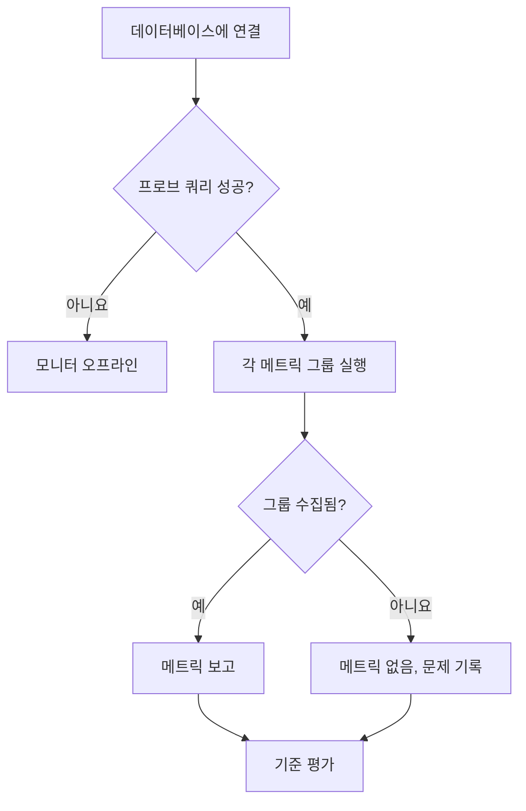

# 데이터베이스 상태 모니터

Database Health 모니터는 일정에 따라 PostgreSQL, MySQL 또는 Microsoft SQL Server에 연결해 서버 자체의 상태 신호(연결 여유, 차단된 세션, 복제 지연, 캐시 적중률, 데이터베이스 크기, 트랜잭션 ID 랩어라운드, 그 밖의 30여 가지)를 보고합니다. 웹사이트가 다운되었을 때 알림을 받는 것과 같은 방식으로 이 신호들에 대해 알림을 받을 수 있습니다.

SQL을 작성할 필요가 없습니다. 프로브는 엔진별로 정해진 읽기 전용 카탈로그 쿼리를 실행하고, 이름이 붙은 소수의 숫자를 보고합니다.

:::cards
- [모니터링 사용자 만들기](#모니터링-사용자-만들기): 엔진별로 필요한 권한. 가장 중요한 단계입니다.
- [모니터 만들기](#database-health-모니터-만들기): 프로브가 데이터베이스를 가리키게 하고 수집할 항목을 고릅니다.
- [수집되는 메트릭](#수집되는-메트릭): 모든 시리즈와 그 시리즈를 보고하는 엔진.
- [기준 설정하기](#기준-설정하기): 연결, 차단, 지연, 랩어라운드에 대해 알림을 받습니다.
:::

## Database Health와 SQL Query 중 무엇을 쓸까

두 가지 데이터베이스 모니터 유형은 서로 다른 질문에 답하며, 함께 쓰도록 만들어졌습니다.

| | Database Health | [SQL Query](/docs/monitor/sql-monitor) |
|---|---|---|
| 답하는 질문 | "데이터베이스 자체가 건강한가?" | "내 데이터가 예상한 대로인가?" |
| 쿼리 | 내장, 엔진별, 읽기 전용 | 직접 작성 |
| 보고하는 것 | 이름이 붙은 숫자 메트릭([수집되는 메트릭](#수집되는-메트릭) 참조) | 행 수, 스칼라 값, 첫 번째 행, 실행 시간 |
| 일반적인 알림 | 사용 중인 연결이 90% 초과 | 최근 5분 동안 취소된 주문이 50건 초과 |
| 필요한 권한 | 통계/DMV 읽기 권한 — [모니터링 사용자 만들기](#모니터링-사용자-만들기) 참조 | 쿼리가 접근하는 테이블에 대한 `SELECT` |

업무 조건에 대해 알림을 받으려면 SQL Query 모니터를 사용하세요. 업무 조건이 실패할 기회조차 생기기 전에 서버의 연결이 바닥나고 있다는 사실을 알고 싶다면 이 모니터를 사용하세요.

## 지원되는 데이터베이스

| 데이터베이스 | 기본 포트 |
|---|---|
| **PostgreSQL** | `5432` |
| **MySQL** | `3306` |
| **Microsoft SQL Server** | `1433` |

Azure SQL Database와 Azure SQL Managed Instance는 **Microsoft SQL Server**로 연결합니다. 필요한 권한은 다릅니다. [모니터링 사용자 만들기](#모니터링-사용자-만들기)를 참조하세요.

같은 와이어 프로토콜을 쓰는 PostgreSQL 호환 및 MySQL 호환 엔진도 대개 동작하지만, 통계 뷰를 더 적게 제공할 수 있습니다. 이 경우 해당 메트릭은 수집되지 않고 사용할 수 없음으로 보고됩니다. 공식적으로 테스트된 엔진은 위의 세 가지뿐입니다.

애플리케이션, 클러스터, 호스트가 사용하는 모든 데이터베이스(이 세 엔진과 그 밖의 많은 엔진)에는 엔진 메트릭, 로그, 해당 데이터베이스를 호출하는 서비스를 보여 주는 자체 페이지도 있습니다. [데이터베이스](/docs/telemetry/databases)를 참조하세요. Database Health 모니터가 연결하는 호스트와 포트가 어떤 데이터베이스의 엔드포인트 중 하나이면, 모니터의 알림과 인시던트가 그 데이터베이스의 페이지에도 표시됩니다([데이터베이스의 알림](/docs/telemetry/databases#alerts-on-a-database) 참조).

## 작동 방식

확인할 때마다 프로브는 다음을 수행합니다.

1. 설정한 자격 증명으로 데이터베이스에 연결합니다.
2. 가벼운 프로브 쿼리 하나를 실행합니다. **실패했을 때 모니터를 오프라인으로 만들 수 있는 문은 이것뿐입니다.**
3. 활성화된 각 [메트릭 그룹](#메트릭-그룹)의 카탈로그 쿼리를 하나씩, 각각 문 시간 제한을 걸어 실행합니다.
4. 수집한 숫자를 보고하고, 수집하지 못한 그룹마다 그 이유를 적은 메모를 덧붙입니다.



OneUptime으로는 이름이 붙은 숫자 집계값만 전송됩니다. 쿼리 텍스트, 테이블의 행, 스키마 이름은 네트워크 밖으로 나가지 않습니다. 쿼리는 엔진 자체의 통계 뷰(`pg_stat_activity`, `performance_schema.global_status`, `sys.dm_exec_sessions` 등)를 읽으며, 사용자 데이터는 절대 읽지 않습니다.

확인은 프로브에서 실행되므로 데이터베이스는 프로브에서만 접근할 수 있으면 됩니다. 네트워크 안에 [사용자 지정 프로브](/docs/probe/custom-probe)를 두면 OneUptime에서 데이터베이스까지의 경로가 전혀 필요하지 않습니다.

## 시작하기 전에

- 데이터베이스 호스트와 포트에 네트워크로 접근할 수 있는 **프로브**. 데이터베이스가 인터넷에서 접근 가능하면 OneUptime이 호스팅하는 프로브를, 그렇지 않으면 네트워크 안의 [사용자 지정 프로브](/docs/probe/custom-probe)를 사용하세요.
- 다음 섹션의 설명대로 만든 **모니터링 사용자**와 그 연결 정보.

## 모니터링 사용자 만들기

**가장 중요한 단계입니다.** 모니터는 일반 로그인이 볼 수 없는 통계 뷰를 읽습니다. 권한이 부족한 로그인이 항상 오류로 실패하는 것은 아니며, PostgreSQL에서는 틀린 답을 돌려줍니다. 정확히 아래 권한만 가진 전용 로그인을 만드세요.

### PostgreSQL

```sql
CREATE USER oneuptime_health WITH PASSWORD 'a-strong-password';
GRANT CONNECT ON DATABASE mydb TO oneuptime_health;
-- The one grant that matters. Without it, see the note below.
GRANT pg_monitor TO oneuptime_health;
```

`pg_monitor`는 통계 뷰와 모니터링 뷰에 대한 읽기 권한을 주는 기본 제공 역할(PostgreSQL 10 이상)입니다. 테이블에 대한 접근 권한은 주지 않습니다.

> [!IMPORTANT]
> **PostgreSQL에서 `pg_monitor`가 선택 사항이 아닌 이유.** 이 역할이 없으면 `pg_stat_activity`는 실패하지 않습니다. 쿼리는 성공하고, 모니터링 세션 자신의 행만 돌려줍니다. 그러면 실제로는 불이 난 서버에서도 연결 수는 `1`, 차단된 세션은 `0`, 복제 지연은 `0`으로 계속 표시됩니다. 그래서 프로브는 그 쿼리들을 실행하기 **전에** 로그인이 `pg_monitor`(또는 `pg_read_all_stats`)의 멤버이거나 슈퍼유저인지 확인합니다. 어느 쪽도 아니면 프로브는 Connections, Activity, Locks 그룹을 사용할 수 없음으로 보고하고, 필요한 `GRANT`를 함께 보여 줍니다. 아무것도 보고하지 않는 것이 정직한 답이며, `1`을 보고하는 것은 그렇지 않습니다.

`pg_monitor`를 쓸 수 없는 관리형 서비스에서는 `pg_read_all_stats`가 같은 뷰를 다룹니다. Amazon RDS에서는 `GRANT rds_superuser`가 필요 없으며, `GRANT pg_monitor TO oneuptime_health;`는 `rds_superuser`의 멤버로서 실행할 수 있습니다.

### MySQL

```sql
CREATE USER 'oneuptime_health'@'%' IDENTIFIED BY 'a-strong-password';
-- INNODB_TRX (open transactions, longest query) and replication status.
GRANT PROCESS, REPLICATION CLIENT ON *.* TO 'oneuptime_health'@'%';
-- Status counters, server variables, and lock waits.
GRANT SELECT ON performance_schema.* TO 'oneuptime_health'@'%';
-- Database size: information_schema.TABLES only shows tables the login can see.
GRANT SELECT ON mydb.* TO 'oneuptime_health'@'%';
FLUSH PRIVILEGES;
```

MySQL의 `performance_schema`가 켜져 있어야 합니다(`performance_schema = ON`, 5.6부터 기본값). 꺼져 있으면 Connections, Throughput, Locks 그룹이 사용할 수 없음으로 보고되며, 해결 방법은 권한이 아니라 서버 재시작입니다.

### Microsoft SQL Server와 Azure SQL Managed Instance

```sql
-- A server-level grant only runs while the current database is master.
USE master;
CREATE LOGIN oneuptime_health WITH PASSWORD = 'a-strong-password';
-- Every DMV the monitor reads. On SQL Server 2022 and later,
-- VIEW SERVER PERFORMANCE STATE alone is also enough.
GRANT VIEW SERVER STATE TO oneuptime_health;

USE mydb;
CREATE USER oneuptime_health FOR LOGIN oneuptime_health;
```

다른 데이터베이스에서 실행하면 `GRANT VIEW SERVER STATE`는 Msg 4621 "Permissions at the server scope can only be granted when the current database is master"로 실패합니다.

> [!WARNING]
> **테이블에 대한 읽기 권한만으로는 부족합니다.** 데이터를 읽기만 할 수 있는 로그인(`db_datareader` 또는 그 밖의 "읽기 권한" 역할)은 연결할 수 있고 데이터베이스 크기는 얻지만, 그 밖에는 아무것도 얻지 못합니다. SQL Server는 모니터가 읽는 뷰를 `The user does not have permission to perform this action.`(Msg 297)으로 거부합니다. 그 앞의 메시지가 무엇이 거부되었는지 알려 줍니다. 서버 뷰(트랜잭션 로그 공간과 tempdb 여유 공간 포함)는 Msg 300 `VIEW SERVER STATE`(2022에서는 `VIEW SERVER PERFORMANCE STATE`), 복제 뷰는 Msg 262 `VIEW DATABASE STATE`(2022에서는 `VIEW DATABASE PERFORMANCE STATE`)입니다. 모니터는 온라인 상태를 유지하고, Connections, Activity, Throughput, Locks, Storage, Replication 그룹에 권한이 없다고 보고하며, 그 옆에 위의 `GRANT`를 보여 줍니다. `VIEW SERVER STATE` 하나로 이 그룹을 모두 다룰 수 있습니다.
>
> 거부하지 않는 뷰가 두 개 있습니다. 권한이 없으면 `sys.dm_exec_sessions`와 `sys.dm_exec_requests`는 아무 말 없이 모니터 자신의 세션만 보여 줍니다. 모니터는 이 두 뷰를 단독으로 읽지 않고 항상 거부하는 뷰와 함께 읽으므로, 권한 누락이 "연결 1개"로 기록되는 일은 없습니다.

### Azure SQL Database

Azure SQL Database에는 서버 수준 권한이 없어 `GRANT VIEW SERVER STATE`가 실패합니다. 그래서 같은 뷰를 데이터베이스 수준 권한으로 엽니다. `master`에 로그인을 만들고, 모니터링할 데이터베이스에 그 로그인의 사용자를 만든 다음, 권한은 `master`가 아니라 그 데이터베이스에서 부여하세요.

```sql
-- Connected to master, as the server admin:
CREATE LOGIN oneuptime_health WITH PASSWORD = 'a-strong-password';

-- Connected to the monitored database:
CREATE USER oneuptime_health FOR LOGIN oneuptime_health;
GRANT VIEW DATABASE STATE TO oneuptime_health;
```

vCore 데이터베이스와 S2 이상의 DTU 데이터베이스에서는 이것으로 충분합니다. **Basic, S0, S1**과 **탄력적 풀**에 있는 모든 데이터베이스에서는, 데이터베이스 권한과 관계없이 서버 관리자, Microsoft Entra 관리자 또는 `##MS_ServerStateReader##` 서버 역할의 멤버만 이 뷰를 읽을 수 있습니다. 이 경우 서버 관리자가 로그인을 그 역할에도 추가합니다.

```sql
-- Connected to master, as the server admin:
ALTER SERVER ROLE ##MS_ServerStateReader## ADD MEMBER oneuptime_health;
```

`##MS_ServerStateReader##`는 모든 서비스 계층에서 동작하므로, `VIEW DATABASE STATE`로 부족할 때의 대안이기도 합니다. 새 역할 멤버 자격은 적용되기까지 몇 분 걸릴 수 있으며 새 연결에만 적용됩니다. 프로브는 확인할 때마다 새 연결을 엽니다.

포함된 데이터베이스 사용자(모니터링하는 데이터베이스에서 `CREATE USER oneuptime_health WITH PASSWORD = '...'`로 만든, 로그인이 없는 사용자)는 S2 이상에서 `VIEW DATABASE STATE`로 동작하지만 `##MS_ServerStateReader##`에는 들어갈 수 없습니다. 서버 역할에는 로그인만 넣을 수 있기 때문입니다. 포함된 사용자를 이 역할로 옮기려면 그 사용자를 삭제하고(`DROP USER oneuptime_health;`) 위의 문을 따르세요.

프로브는 Azure SQL Database를 버전이 아니라 `SERVERPROPERTY('EngineEdition')`로 인식합니다. Azure SQL Database는 실제로 무엇을 실행하든 `12.0.2000.8`을 보고하는데, 이는 SQL Server 2014로 읽히기 때문입니다. 그래서 모니터의 **Engine**에는 `Azure SQL Database 12.0.2000.8`이 표시되고, 권한 누락은 `VIEW SERVER STATE`가 아니라 항상 위의 Azure 문으로 표시됩니다.

- **Azure SQL Database에서는 복제를 수집하지 않습니다.** Azure SQL Database에는 `sys.dm_hadr_database_replica_states`가 없으므로, Replication 그룹은 확인할 때마다 실패로 보고되는 대신 건너뜁니다. Azure 자체의 복제본 뷰(`sys.dm_database_replica_states`, `sys.dm_geo_replication_link_status`)는 아직 읽지 않습니다.
- **연결은 데이터베이스 단위입니다.** `VIEW DATABASE STATE`로는 Azure SQL Database가 모니터링하는 데이터베이스의 세션만 보여 주므로, Connections는 논리 서버가 아니라 그 데이터베이스를 셉니다. 중요한 데이터베이스는 각각 모니터링하세요.
- **탄력적 풀에서 TempDB Free Space는 풀의 값입니다.** 풀의 데이터베이스들은 하나의 tempdb를 공유합니다.

## Database Health 모니터 만들기

:::steps
### 새 모니터 시작하기

**모니터**로 이동해 **모니터 생성**을 클릭합니다. **모니터 유형**에서 **더 많은 모니터 유형**을 클릭하고 **Database Monitoring** 아래의 **Database Health**를 선택하거나, 검색 상자에 `health`를 입력합니다. **이름**을 입력한 다음 **다음**을 클릭합니다.

### 연결 정보 입력하기

**Database Type**을 고른 다음 호스트, 포트, 데이터베이스 이름, 모니터링 사용자의 자격 증명을 입력합니다. 비밀번호는 직접 입력하지 말고 [모니터 시크릿](#비밀번호에-모니터-시크릿-사용하기)으로 참조하세요. 각 필드는 [구성](#구성)에서 설명합니다.

### 수집할 항목 고르기

끌 이유가 없다면 **Metric Groups**의 모든 그룹을 켜 둔 채로 두세요. [메트릭 그룹](#메트릭-그룹)을 참조하세요.

### 연결 테스트하기

**모니터 테스트**를 클릭해 저장하기 전에 확인을 한 번 실행하고, 무엇이 수집되었는지 확인하세요.

### 기준 정하기

모니터가 처음 가진 기준을 검토하고 직접 기준을 추가합니다. [기준 설정하기](#기준-설정하기)를 참조하세요. 그런 다음 **다음**을 클릭합니다.

### 프로브를 고르고 만들기

데이터베이스에 접근할 수 있는 **프로브**와 **모니터링 간격**을 선택한 다음 **모니터 생성**을 클릭합니다.
:::

## 구성

| 필드 | 입력할 내용 |
|---|---|
| **Database Type** | PostgreSQL, MySQL 또는 Microsoft SQL Server. 유형을 고르면 기본 포트가 설정되고 실행할 쿼리가 결정됩니다. |
| **호스트** | 프로브에서 접근할 수 있는 데이터베이스 호스트(예: `db.internal`). |
| **포트** | 데이터베이스 포트. |
| **데이터베이스 이름** | 연결할 데이터베이스. 데이터베이스 범위 메트릭(크기, 캐시 적중률, 임시 파일로의 유출)은 이 데이터베이스에 대해 보고되고, 서버 범위 메트릭(연결, 가동 시간, 복제)은 서버 전체에 대해 보고됩니다. 단, Azure SQL Database에서는 연결을 모니터링하는 데이터베이스에 대해서만 셉니다. |
| **Use Windows Integrated Authentication** | Microsoft SQL Server 전용. 사용자 이름과 비밀번호 대신 프로브 프로세스의 ID로 인증합니다. SQL Query 모니터 페이지의 [Windows 통합 인증](/docs/monitor/sql-monitor#windows-통합-인증)을 참조하세요. 설정 방법은 같습니다. |
| **사용자 이름** | 모니터링 사용자. Windows 통합 인증을 쓰지 않는다면 필수입니다. |
| **비밀번호** | 비밀번호. 일반 텍스트로 입력하지 말고 `{{monitorSecrets.name}}`으로 [모니터 시크릿](/docs/monitor/monitor-secrets)을 참조하세요([모니터 시크릿 사용하기](#비밀번호에-모니터-시크릿-사용하기) 참조). |
| **Use SSL/TLS** | TLS로 연결합니다. 켜면 자체 서명 인증서를 위해 **Verify server certificate**를 끌 수 있습니다. |
| **Metric Groups** | 실행할 그룹: Connections, 활동, Throughput, Locks and Blocking, 스토리지, Replication, 유지 관리. 기본적으로 모두 켜져 있습니다. [메트릭 그룹](#메트릭-그룹)을 참조하세요. 모니터 세부 정보에는 **Collected Metric Groups**로 표시됩니다. |

### 추가 필드

| 필드 | 기본값 | 최댓값 | 제한하는 것 |
|---|---|---|---|
| **Connection Timeout (ms)** | `10000` | `30000` | 연결을 맺을 때까지 기다리는 시간. |
| **Statement Timeout (ms)** | `10000` | `60000` | 각 카탈로그 쿼리의 상한. |

문 시간 제한의 기본값은 SQL Query 모니터보다 일부러 짧게 잡았습니다. 건강한 서버에서는 이 쿼리들이 밀리초 안에 응답하므로, `pg_stat_activity`가 10초나 걸린다면 유용한 신호는 더 오래 기다리는 것이 아니라 "이 서버에 문제가 있다"는 것입니다. 최댓값보다 큰 값은 최댓값으로 낮춰집니다.

## 비밀번호에 모니터 시크릿 사용하기

비밀번호가 모니터에 일반 텍스트로 저장되지 않게 하려면:

:::steps
1. **모니터 → 설정 → 시크릿**으로 이동해 [모니터 시크릿](/docs/monitor/monitor-secrets)을 만듭니다.
2. 이름을 붙이고(예: `dbPassword`) 이 모니터에 접근 권한을 줍니다.
3. 모니터의 **비밀번호** 필드에 `{{monitorSecrets.dbPassword}}`를 입력합니다.
:::

시크릿은 구성이 프로브에 전달되기 전에 서버 쪽에서 해석됩니다. 호스트, 사용자 이름, 데이터베이스 이름 필드도 같은 참조를 받습니다. 자격 증명은 로그, 모니터 피드, 알림 템플릿에 절대 기록되지 않습니다.

## 메트릭 그룹

그룹은 켜고 끄는 단위이자 권한 누락이 보고되는 단위입니다. 그룹이 있기 때문에 권한 하나가 빠져도 모니터 전체가 아니라 그룹 하나만 잃습니다. 그룹의 문은 하나씩 실행되므로 그룹이 일부만 수집될 수 있으며, 이때 그 그룹은 `collectedGroups`와 `unavailableGroups` 양쪽에 나타납니다. 흔한 예는 `VIEW SERVER STATE`가 없는 로그인의 SQL Server Storage 그룹으로, 데이터베이스 크기는 수집되지만 로그 공간과 tempdb 여유 공간은 수집되지 않습니다.

| 그룹 | 수집하는 것 | 필요한 것 |
|---|---|---|
| Connections | 연결 수, 설정된 상한, 중단된 연결, 서버 가동 시간 | PostgreSQL: `pg_monitor`. MySQL: `performance_schema`. SQL Server: `VIEW SERVER STATE` |
| Activity | 가장 오래 실행 중인 쿼리, 가장 오래 열린 트랜잭션, 열린 트랜잭션 | PostgreSQL: `pg_monitor`. MySQL: `PROCESS`. SQL Server: `VIEW SERVER STATE` |
| Throughput | 트랜잭션, 쿼리, 캐시 적중률, 디스크 읽기와 쓰기, I/O 시간 | PostgreSQL: `CONNECT` 외에는 필요 없음. MySQL: `performance_schema`. SQL Server: `VIEW SERVER STATE` |
| Locks | 차단된 세션, 잠금 대기, 교착 상태, 테이블 잠금 대기 | PostgreSQL: `pg_monitor`. MySQL: `performance_schema`. SQL Server: `VIEW SERVER STATE` |
| Storage | 데이터베이스 크기, 임시 파일로의 유출, 로그 공간, tempdb 여유 공간 | PostgreSQL: `CONNECT` 외에는 필요 없음. MySQL: 데이터베이스에 대한 `SELECT`. SQL Server: 데이터베이스 크기에는 필요 없음, 로그 공간과 tempdb 여유 공간에는 `VIEW SERVER STATE` |
| Replication | 연결된 복제본, 초와 바이트 단위의 복제 지연, 비활성 슬롯, 복구 상태 | PostgreSQL: `pg_monitor`. MySQL: `REPLICATION CLIENT`. SQL Server: `VIEW SERVER STATE`, Azure SQL Database에서는 수집하지 않음 |
| Maintenance | 트랜잭션 ID 랩어라운드까지의 여유, 죽은 튜플, autovacuum이 한 번도 처리하지 않은 테이블, 체크포인트 | PostgreSQL: `pg_monitor` |

Azure SQL Database에서는 이 표에서 `VIEW SERVER STATE`라고 한 곳을 모두 `VIEW DATABASE STATE`로 읽으세요. Basic, S0, S1과 탄력적 풀에서는 `##MS_ServerStateReader##`입니다. [Azure SQL Database](#azure-sql-database)를 참조하세요.

그룹을 끄는 일은 조용히 일어납니다. 메트릭도, 수집 문제도, 알림도 없습니다. 끄는 것이 옳은 경우는 두 가지입니다.

- **권한을 얻을 수 없을 때.** 그룹을 끄면 확인할 때마다 수집 문제가 반복되지 않습니다.
- **쿼리 비용이 너무 클 때.** MySQL에서는 **스토리지**가 흔한 후보입니다. 데이터베이스 크기는 `information_schema.TABLES`를 합산해서 구하는데, 테이블이 수만 개인 스키마에서는 부담이 작지 않고 확인할 때마다 실행됩니다. 그룹을 끄거나 그 모니터를 5분 간격으로 바꾸세요.

모든 그룹의 선택을 해제해도 아무것도 수집하지 않게 되는 것은 아닙니다. 빈 목록은 모든 그룹으로 다시 정규화되므로, 아무것도 수집하지 않는 상태로 모니터가 조용히 저장되는 일은 없습니다.

## 메트릭을 수집할 수 없을 때 일어나는 일

**권한 누락 때문에 모니터가 오프라인이 되는 일은 없습니다.** 이것이 이 모니터 유형의 가장 중요한 동작이므로 정확히 설명해 둡니다.

| 실패한 것 | 모니터 상태 | 보이는 것 |
|---|---|---|
| **연결** 또는 프로브 쿼리 — 잘못된 자격 증명, 연결 거부, TLS 실패, 연결 시간 초과 | **오프라인** | `Database Is Online`이 false가 되고, 여기에 연결한 인시던트와 온콜 정책이 발동합니다. |
| **그룹** — 권한 누락, 꺼진 `performance_schema`, 문 시간 초과 | **온라인 유지** | 그 그룹이 읽지 못한 메트릭은 0이 아니라 **존재하지 않습니다**. 차트 선이 그려지지 않고, 그 시리즈에 대한 임계값은 일치할 수 없으며, 거기서 인시던트가 생길 수도 없습니다. 확인 결과로 그룹, 이유, 그리고 (있다면) 실행할 정확한 `GRANT`를 담은 수집 문제가 하나 기록되며, 이는 모니터 요약에 표시되고 **Metric Groups Failed**에 집계됩니다. |
| **엔진이 메트릭을 아예 만들 수 없음** — 기본 MySQL에는 교착 상태 카운터가 없고, SQL Server는 기본적으로 연결 상한을 무제한으로 두므로 "사용 비율"이 의미가 없음 | **온라인 유지** | 메트릭은 그냥 존재하지 않습니다. 이것은 수집 문제가 **아니며**, Metric Groups Failed에 집계되지 않고, 고칠 대상도 아닙니다. [수집되는 메트릭](#수집되는-메트릭)의 Engines 열을 참조하세요. |

없는 값은 언제나 없는 값입니다. 측정하지 않은 값은 절대 `0`으로 보고되지 않습니다. 지어낸 0으로 채운 차트는 빈틈보다 나쁘기 때문입니다. 빈틈은 눈으로 볼 수 있습니다.

> [!TIP]
> 가시성을 잃었을 때 알림을 받으려면 `Database Collection Error`나 **Metric Groups Failed**에 대한 임계값을 사용하세요. 둘 다 인시던트가 아니라 알림으로 만드세요. 회수된 권한은 티켓으로 처리할 일이지 호출할 일이 아닙니다.

### "The user does not have permission to perform this action"

연결은 할 수 있지만 서버 상태 뷰를 읽을 수 없는 로그인에 대해 SQL Server가 보내는 메시지(Msg 297)입니다. 이 메시지는 항상 권한 누락을 뜻하며, 데이터베이스 장애를 뜻하지 않습니다. SQL Server는 거부한 권한을 밝히는 메시지 다음에 이 메시지를 두 번째로 보내며, 모니터는 둘 다 보여 줍니다. 예: `VIEW SERVER STATE permission was denied on object 'server', database 'master'. The user does not have permission to perform this action.` 그 옆에는 프로브가 연결한 플랫폼에 맞는 해결 문이 표시됩니다.

- **SQL Server 또는 Azure SQL Managed Instance** — `GRANT VIEW SERVER STATE TO oneuptime_health;`를 `master`에서 실행합니다(모니터에는 `GRANT VIEW SERVER STATE TO [<monitoring_login>]; -- run in master`로 표시됩니다).
- **Azure SQL Database** — `GRANT VIEW DATABASE STATE TO oneuptime_health;`를 모니터링하는 데이터베이스에서 실행합니다. Basic, S0, S1과 탄력적 풀에서는 대신 `##MS_ServerStateReader##` 멤버 자격이 필요합니다. [Azure SQL Database](#azure-sql-database)를 참조하세요.

그동안에도 데이터베이스 크기는 계속 수집됩니다. Storage 그룹에서 어떤 로그인이든 읽을 수 있는 메트릭은 이것 하나뿐이기 때문입니다.

## 수집되는 메트릭

8개 범주에 41개의 시리즈가 있습니다. Engines 열은 그 시리즈를 실제로 만들 수 있는 엔진이며, 다른 엔진에서는 시리즈가 그냥 존재하지 않습니다. Group 열은 시리즈가 속한 수집 그룹으로, 켜고 끄는 단위이자 함께 빠지는 단위입니다.

### 가용성

| 메트릭 | 시리즈 | Group | Engines |
|---|---|---|---|
| **Uptime** (s) | `oneuptime.monitor.database.uptime.seconds` | Connections | PostgreSQL, MySQL, SQL Server |
| **Metric Groups Failed** | `oneuptime.monitor.database.metric.groups.failed` | Connections | PostgreSQL, MySQL, SQL Server |

### 연결

| 메트릭 | 시리즈 | Group | Engines |
|---|---|---|---|
| **Connections** | `oneuptime.monitor.database.connections.total` | Connections | PostgreSQL, MySQL, SQL Server |
| **Active Connections** | `oneuptime.monitor.database.connections.active` | Connections | PostgreSQL, MySQL, SQL Server |
| **Maximum Connections** | `oneuptime.monitor.database.connections.max` | Connections | PostgreSQL, MySQL |
| **Connections Used** (%) | `oneuptime.monitor.database.connections.used.percent` | Connections | PostgreSQL, MySQL |
| **Idle In Transaction** | `oneuptime.monitor.database.connections.idle.in.transaction` | Connections | PostgreSQL |
| **Aborted Connects** | `oneuptime.monitor.database.connections.aborted.total` | Connections | MySQL |

### 처리량

| 메트릭 | 시리즈 | Group | Engines |
|---|---|---|---|
| **Transactions** | `oneuptime.monitor.database.transactions.total` | Throughput | PostgreSQL, SQL Server |
| **Queries** | `oneuptime.monitor.database.queries.total` | Throughput | MySQL, SQL Server |
| **Slow Queries** | `oneuptime.monitor.database.queries.slow.total` | Throughput | MySQL |
| **Rollback Ratio** (%) | `oneuptime.monitor.database.rollback.percent` | Throughput | PostgreSQL |
| **Longest Running Query** (s) | `oneuptime.monitor.database.query.longest.seconds` | Activity | PostgreSQL, MySQL, SQL Server |
| **Longest Open Transaction** (s) | `oneuptime.monitor.database.transaction.longest.seconds` | Activity | PostgreSQL, MySQL, SQL Server |
| **Open Transactions** | `oneuptime.monitor.database.transaction.open.count` | Activity | MySQL |

### 잠금과 차단

| 메트릭 | 시리즈 | Group | Engines |
|---|---|---|---|
| **Blocked Sessions** | `oneuptime.monitor.database.sessions.blocked` | Locks | PostgreSQL, MySQL, SQL Server |
| **Lock Waits** | `oneuptime.monitor.database.locks.waiting` | Locks | PostgreSQL, MySQL, SQL Server |
| **Deadlocks** | `oneuptime.monitor.database.deadlocks.total` | Locks | PostgreSQL, SQL Server |
| **Table Lock Waits** | `oneuptime.monitor.database.table.locks.waited.total` | Locks | MySQL |

기본 MySQL에는 어떤 종류의 교착 상태 카운터도 없기 때문에 Deadlocks는 PostgreSQL과 SQL Server에만 있습니다.

### 캐시와 I/O

| 메트릭 | 시리즈 | Group | Engines |
|---|---|---|---|
| **Cache Hit Ratio** (%) | `oneuptime.monitor.database.cache.hit.percent` | Throughput | PostgreSQL, MySQL, SQL Server |
| **Disk Reads** | `oneuptime.monitor.database.disk.reads.total` | Throughput | PostgreSQL, MySQL, SQL Server |
| **Disk Writes** | `oneuptime.monitor.database.disk.writes.total` | Throughput | MySQL, SQL Server |
| **I/O Read Time** (ms) | `oneuptime.monitor.database.io.read.time.ms` | Throughput | PostgreSQL, SQL Server |
| **I/O Write Time** (ms) | `oneuptime.monitor.database.io.write.time.ms` | Throughput | PostgreSQL, SQL Server |
| **Page Life Expectancy** (s) | `oneuptime.monitor.database.page.life.expectancy.seconds` | Throughput | SQL Server |
| **Memory Grants Pending** | `oneuptime.monitor.database.memory.grants.pending` | Throughput | SQL Server |

PostgreSQL은 `track_io_timing`이 켜져 있을 때만 I/O 읽기 시간과 쓰기 시간을 측정합니다. 기본값은 꺼짐이며, 이때 PostgreSQL은 둘 다 `0`으로 보고합니다. 그래서 PostgreSQL에서 이 두 시리즈가 평평한 0이면 대개 "빠르다"가 아니라 "측정하지 않았다"는 뜻입니다. 이는 권한 문제가 아니라 서버 설정입니다.

### 저장 공간

| 메트릭 | 시리즈 | Group | Engines |
|---|---|---|---|
| **Database Size** (바이트) | `oneuptime.monitor.database.size.bytes` | Storage | PostgreSQL, MySQL, SQL Server |
| **Temp Bytes Written** (바이트) | `oneuptime.monitor.database.temp.bytes.total` | Storage | PostgreSQL |
| **Temp Disk Tables** | `oneuptime.monitor.database.temp.disk.tables.total` | Storage | MySQL |
| **Log Space Used** (%) | `oneuptime.monitor.database.log.space.used.percent` | Storage | SQL Server |
| **TempDB Free Space** (바이트) | `oneuptime.monitor.database.tempdb.free.bytes` | Storage | SQL Server |

### 복제

| 메트릭 | 시리즈 | Group | Engines |
|---|---|---|---|
| **Connected Replicas** | `oneuptime.monitor.database.replica.count` | Replication | PostgreSQL, SQL Server |
| **Replication Lag** (s) | `oneuptime.monitor.database.replication.lag.seconds` | Replication | PostgreSQL, MySQL |
| **Replication Lag (Bytes)** (바이트) | `oneuptime.monitor.database.replication.lag.bytes` | Replication | PostgreSQL, SQL Server |
| **Is In Recovery** | `oneuptime.monitor.database.is.in.recovery` | Replication | PostgreSQL |
| **Inactive Replication Slots** | `oneuptime.monitor.database.replication.slots.inactive` | Replication | PostgreSQL |

복제 메트릭은 복제 링크 중 모니터가 연결된 쪽에서 보고됩니다. 연결된 복제본과 전송 대기열을 보려면 모니터를 기본 서버로 향하게 하고, 각 대기 서버가 실제로 얼마나 뒤처졌는지 보려면 대기 서버마다 모니터를 하나씩 향하게 하세요.

초 단위 지연은 복제본이 한참 뒤처져 있어도 유휴 상태의 기본 서버에서는 새로 쓰인 것이 없으므로 0으로 표시됩니다. **Replication Lag (Bytes)** 메트릭에는 이 사각지대가 없으므로 둘 다 알림을 설정하세요.

### 유지 관리

| 메트릭 | 시리즈 | Group | Engines |
|---|---|---|---|
| **Transaction ID Used** (%) | `oneuptime.monitor.database.transaction.id.used.percent` | Maintenance | PostgreSQL |
| **Dead Tuples** | `oneuptime.monitor.database.dead.tuples` | Maintenance | PostgreSQL |
| **Tables Never Autovacuumed** | `oneuptime.monitor.database.tables.never.autovacuumed` | Maintenance | PostgreSQL |
| **Requested Checkpoints** | `oneuptime.monitor.database.checkpoints.requested.total` | Maintenance | PostgreSQL |
| **Timed Checkpoints** | `oneuptime.monitor.database.checkpoints.timed.total` | Maintenance | PostgreSQL |

> [!IMPORTANT]
> **Transaction ID Used**는 만드는 모든 PostgreSQL 모니터에 기준을 둘 가치가 있습니다. 이 값이 100%에 이르면 PostgreSQL은 모든 쓰기를 거부하고, 복구하려면 데이터베이스를 내린 채 단일 사용자 모드에서 vacuum을 실행해야 하는데, 이를 지켜보는 사람은 거의 없습니다. 절벽에 닿기 훨씬 전에 알림을 받으세요. 80%면 대부분의 워크로드에서 며칠의 여유가 있습니다.

`total`로 끝나는 카운터는 서버가 시작된 뒤로 누적된 값입니다. 비율을 구하려면 두 시점을 비교하세요. 값 하나만으로는 그 값 자체의 이력과 비교할 때만 의미가 있으며, 서버가 재시작하면 0으로 돌아갑니다(**Uptime**에서 확인할 수 있습니다).

## 기준 설정하기

| 필터 유형 | 확인하는 것 |
|---|---|
| **Database Is Online** | 데이터베이스에 접근할 수 있었고 프로브 쿼리가 성공했는지 여부. 모니터를 만들 때 함께 생기는 오프라인 기준이며, 접근 가능성을 반영하는 유일한 확인입니다. |
| **Database Metric** | 메트릭을 골라 비교합니다: Greater Than, Less Than, Greater Than Or Equal To, Less Than Or Equal To, Equal To, Not Equal To. 메트릭 선택기는 선택한 엔진이 만들 수 있는 메트릭만 보여 주므로, 영원히 충족되지 않는 기준을 만들 수는 없습니다(예외가 하나 있는데, Microsoft SQL Server용으로 제공되는 Replication 메트릭은 Azure SQL Database에서 수집되지 않습니다). 어떤 확인에서 메트릭이 수집되지 않았다면(그룹이 실패했거나 엔진이 그 메트릭을 보고하지 않는 경우) 필터는 일치하지 않으며, "false"로도 일치하지 않고 건너뜁니다. 권한 문제로 누군가가 호출되는 일은 없습니다. |
| **Database Collection Error** | 그 확인의 수집 문제 요약으로, 사용할 수 없는 그룹마다 "그룹: 메시지"가 하나씩 들어갑니다. 비어 있지 않을 때 알림을 받으면 가시성 손실을 알아챌 수 있고, 특정 그룹을 지켜보려면 Contains를 사용하세요. |
| **JavaScript Expression** | 완전한 제어. [JavaScript 표현식](/docs/monitor/javascript-expression)을 참조하세요. |

임계값은 정수입니다. `90.5`가 아니라 `90`으로 쓰세요. 백분율과 초는 정수로 비교됩니다.

**Database Is Online**과 **Database Metric**은 일정 기간에 걸쳐 확인할 수 있습니다. **일정 기간에 걸쳐 이 기준을 평가**를 선택하고, **평가**에서 값을 평가하는 방법(예: **All Values**)을 고른 다음 **지난 시간 동안(분)** 값을 입력하세요. 기간에 걸쳐 평가할 때는 필터의 **데이터가 없는 경우** 설정이 값이 없을 때의 의미를 정합니다. 권한 누락으로 누군가가 호출되지 않도록 **Ignore**로 두세요.

### JavaScript 표현식 변수

Database Health 모니터에서 표현식은 다음 변수에 접근할 수 있습니다.

| 변수 | 유형 | 설명 |
|---|---|---|
| `isOnline` | boolean | 연결과 프로브 쿼리가 모두 성공했는지 여부 |
| `engineVersion` | string | 서버가 보고한 버전 문자열(SQL Server에서는 `ProductVersion` 그대로이며, 모니터 요약이 그 옆에 플랫폼 이름을 표시합니다) |
| `connectionError` | string | 정리된 연결 오류. 오류가 없으면 비어 있음 |
| `collectedGroups` | array | 이번 확인에서 값을 만든 그룹 |
| `unavailableGroups` | array | 수집하지 못한 문이 있는 그룹. 각각에 이유와 해결 방법이 붙습니다. 일부만 수집된 그룹은 두 목록에 모두 들어갑니다 |
| `metrics` | object | 시리즈 이름을 키로 하는 수집된 값. 수집되지 않은 시리즈는 존재하지 않습니다 |

```javascript
{{isOnline}} === true && {{collectedGroups}}.length >= 5
```

표현식에서 메트릭 하나를 읽으려면 `metrics` 객체 전체에 인덱스로 접근하세요. 시리즈 이름에 점이 들어 있어 중괄호 안에 넣을 수 없습니다.

```javascript
{{metrics}}['oneuptime.monitor.database.connections.used.percent'] > 90
```

메트릭 하나에 임계값을 걸 때는 표현식보다 **Database Metric**을 사용하세요. 시리즈를 대신 찾아 주고, 엔진이 만들 수 있는 것만 보여 주며, 값이 수집되지 않았을 때는 아무것도 없는 값과 비교하는 대신 확인을 건너뜁니다.

### 예: PostgreSQL 기본 서버

| 순서 | 기준 | 필터 |
|---|---|---|
| 1 | **오프라인** | `Database Is Online`이 `false`. |
| 2 | **저하됨** | `Database Metric` → Connections Used가 `90`보다 큼. 순간적인 급증으로 호출되지 않도록 All Values로 5분 동안 평가합니다. |
| 3 | **저하됨** | `Database Metric` → Transaction ID Used가 `80`보다 큼. |
| 4 | **저하됨** | `Database Metric` → Blocked Sessions가 5분 동안 `0`보다 큼. |
| 5 | **Online** | `Database Is Online`이 `true`. |

기준은 위에서 아래로 평가되고 처음 일치한 기준이 적용되므로, 알림 기준을 먼저 두고 정상 기준을 마지막에 두세요.

오프라인 기준에는 온콜 정책을 연결하고, **Metric Groups Failed**나 `Database Collection Error`에서 파생된 것은 온콜 정책 없이 알림으로만 두세요.

## 고려할 점

- **쿼리는 확인할 때마다 실행됩니다.** 설계상 가볍지만 "가볍다"는 것은 간격에 따라 상대적입니다. 세션이 수천 개인 서버를 1분 간격으로 확인하면 `pg_stat_activity` 스캔이 원하는 것보다 많아질 수 있습니다. 용량 메트릭에는 5분이면 충분합니다.
- **중요한 데이터베이스를 모니터가 가리키게 하세요.** 크기, 캐시 적중률, 임시 파일로의 유출은 데이터베이스 단위입니다. 연결, 가동 시간, 복제는 서버 단위이며, 그 인스턴스의 어느 데이터베이스에서 보아도 같습니다.
- **모니터는 데이터베이스마다가 아니라 인스턴스마다 하나**만 두세요. 데이터베이스별 크기와 캐시 메트릭이 꼭 필요한 경우가 아니라면, 새로운 정보 없이 서버 범위 쿼리만 늘어납니다. Azure SQL Database는 예외로, 연결을 데이터베이스 단위로 보고하므로 거기서는 데이터베이스마다 모니터링하세요.
- **카운터가 아니라 비율에 대해 알림을 받으세요.** `total`로 끝나는 값은 오르기만 하므로, 그 값에 "보다 큼" 임계값을 걸면 한 번 발동한 뒤 다시는 회복되지 않습니다. 차트로 보거나 시간 범위에 걸쳐 비교하세요.
- **일반 텍스트 비밀번호보다 모니터 시크릿을 쓰세요.** 그러면 자격 증명이 저장 시 암호화된 채로 유지되고 모니터에 표시되지 않습니다.
- **모니터는 절대 쓰지 않습니다.** 모든 쿼리는 통계 뷰에 대한 읽기이며, PostgreSQL에서는 읽기 전용 트랜잭션 안에서, MySQL에서는 읽기 전용 세션에서 실행됩니다. 읽지 못한 것은 메트릭 누락으로 보고될 뿐, 장애로 보고되지 않습니다.

## 문제 해결

:::details 모니터는 오프라인인데 데이터베이스는 작동 중임
오프라인은 프로브가 연결하지 못했거나 프로브 쿼리가 실패했다는 뜻입니다. 원인은 프로브에서 호스트나 포트에 접근할 수 없거나, 로그인이 거부되었거나, TLS가 실패했거나, 연결 시간이 초과된 경우입니다. 오류는 모니터 요약에 표시됩니다. 프로브가 데이터베이스에 접근할 수 있는지 확인하고(OneUptime이 호스팅하는 프로브에는 공개 주소가 필요하며, 그렇지 않으면 [사용자 지정 프로브](/docs/probe/custom-probe)를 사용하세요), 사용자 이름과 비밀번호 또는 그 모니터 시크릿을 확인하고, 자체 서명 인증서라면 **Verify server certificate**를 끄세요. 그런 다음 **모니터 테스트**를 클릭해 다시 확인합니다.
:::

:::details PostgreSQL에서 Connections, Activity, Locks가 없음
로그인이 `pg_monitor`나 `pg_read_all_stats`의 멤버가 아니고 슈퍼유저도 아니므로, 프로브가 틀린 숫자를 기록하는 대신 그 그룹들을 건너뜁니다. [PostgreSQL](#postgresql)에서 설명한 대로 `GRANT pg_monitor TO oneuptime_health;`를 실행하세요.
:::

:::details MySQL에서 Connections, Throughput, Locks가 없음
로그인에 `performance_schema`에 대한 `SELECT`가 없거나, 서버에서 `performance_schema`가 꺼져 있습니다. 모니터 요약에 MySQL의 메시지가 표시됩니다. 권한이 없다면 [MySQL](#mysql)의 문을 실행하세요. `performance_schema`가 꺼져 있다면 서버 구성에서 `performance_schema = ON`으로 설정하고 재시작해야 합니다.
:::

:::details PostgreSQL에서 I/O Read Time과 I/O Write Time이 항상 0임
PostgreSQL은 `track_io_timing`이 켜져 있을 때만 이 값들을 측정하며, 기본값은 꺼짐입니다. 실제 값을 보려면 서버 구성이나 관리형 서비스의 파라미터 그룹에서 켜세요. 권한 누락이 아닙니다.
:::

:::details 확인할 때마다 Metric Groups Failed가 0보다 큼
어떤 확인에서도 수집할 수 없는 그룹이 있어서 같은 수집 문제가 반복됩니다. 모니터 요약에 그룹, 이유, 해결하는 `GRANT`가 표시됩니다. 그 권한을 부여하거나, 받을 수 없다면 **Metric Groups**에서 그 그룹을 꺼서 문제가 반복되지 않게 하세요.
:::

## 다음 단계

:::cards
- [SQL 쿼리 모니터](/docs/monitor/sql-monitor): 서버 상태와 나란히, 직접 작성한 쿼리의 결과에 대해 알림을 받습니다.
- [데이터베이스](/docs/telemetry/databases): 각 데이터베이스의 메트릭, 로그, 호출자를 한 페이지에서 봅니다.
- [모니터 시크릿](/docs/monitor/monitor-secrets): 모니터링 사용자의 비밀번호를 암호화해 보관합니다.
- [사용자 지정 프로브](/docs/probe/custom-probe): 네트워크 안의 데이터베이스에 접근합니다.
:::
