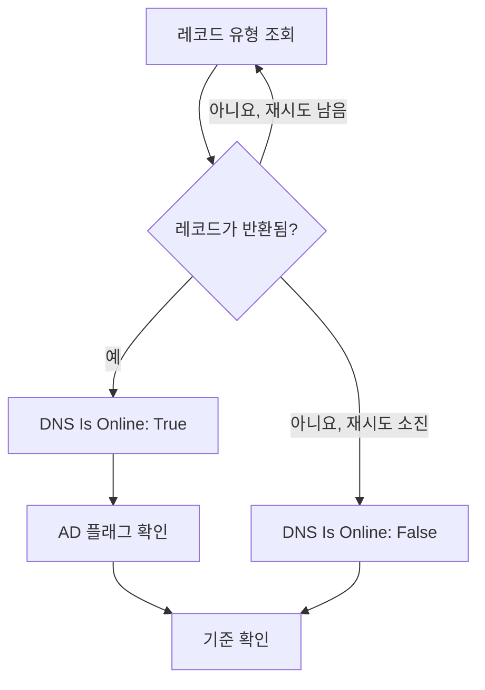

# DNS 모니터

DNS 모니터는 일정에 따라 DNS 레코드를 조회하고 응답을 확인합니다. 이름이 확인(resolve)되는지, 얼마나 빠른지, 레코드에 무엇이 들어 있는지입니다. 사용자가 알아채기 전에 DNS 장애, 바뀌거나 사라진 레코드, 느린 리졸버를 잡아내는 데 사용하세요.

:::cards
- [모니터 만들기](#dns-모니터-만들기): 대시보드에서 여섯 단계.
- [구성 옵션](#구성-옵션): 이름, 레코드 유형, DNS 서버.
- [모니터링 기준](#모니터링-기준): 이름 확인, 레코드, 응답 시간, DNSSEC.
- [문제 해결](#문제-해결): 모니터와 `dig`의 결과가 다를 때.
:::

## 작동 방식

확인할 때마다 프로브는 DNS 서버에 이름 하나의 레코드 유형 하나를 묻습니다. 예를 들어 `example.com`의 `A` 레코드입니다. 서버가 그 유형의 레코드를 하나 이상 반환하면 이름은 온라인입니다. 실패했거나, 시간 초과되었거나, 레코드를 반환하지 않은 쿼리는 1초 뒤에, 설정한 재시도 횟수만큼 다시 시도합니다. 그런 다음 프로브는 검증 리졸버에 응답에 DNSSEC의 authenticated data(AD) 플래그가 있는지 묻고, OneUptime이 결과를 모니터의 기준에 통과시킵니다.



자체 네트워크 연결을 잃은 프로브는 결과를 보고하지 않으므로 DNS를 오프라인으로 표시할 수 없습니다.

## 시작하기 전에

- **모니터를 만들 수 있는 역할**: Project Owner, Project Admin, Project Member, Monitor Admin 또는 Monitor Member, 또는 Create Monitor 권한이 있는 사용자 지정 역할.
- **DNS 서버에 연결할 수 있는 프로브.** 모든 새 모니터에는 프로젝트의 기본 프로브가 선택됩니다. 내부 리졸버처럼 프라이빗 네트워크에 있는 DNS 서버를 조회하려면 그 네트워크 안의 [사용자 지정 프로브](/docs/probe/custom-probe)를 사용합니다.

## DNS 모니터 만들기

:::steps
### 새 모니터 시작

**모니터**로 이동해 **모니터 생성**을 클릭합니다. **모니터 유형**에서 **더 많은 모니터 유형**을 클릭하고 **DNS Monitoring** 아래의 **DNS**를 선택합니다.

### 이름 지정

`example.com A records` 같은 **이름**을 입력하고 **다음**을 클릭합니다.

### 쿼리 입력

조회할 **도메인 이름**(예: `example.com`)을 입력하고 **레코드 유형**을 선택합니다. 특정 서버에 물으려면 **DNS 서버(선택 사항)** 항목에 입력합니다. 비워 두면 프로브 자체의 리졸버를 사용합니다.

### 테스트

**모니터 테스트**를 클릭하고 **프로브 선택**에서 프로브를 고른 다음 **테스트 실행**을 클릭합니다. **모니터 테스트 결과**에 프로브가 받은 레코드가 표시됩니다.

### 기준 검토

**모니터 기준**은 [기본 기준](#기본-기준)으로 시작합니다. 이름이 확인되지 않으면 오프라인, 확인되면 온라인입니다. 레코드에 무엇이 들어 있는지 확인하려면 **DNS Record Value** 필터를 추가한 다음 **다음**을 클릭합니다.

### 프로브 선택 및 생성

**프로브**와 **모니터링 간격**(**5분마다**로 시작)을 그대로 두거나 바꾼 다음 **모니터 생성**을 클릭합니다. 모니터 페이지가 열립니다.
:::

## 구성 옵션

| 필드 | 기본값 | 입력할 내용 |
| --- | --- | --- |
| **도메인 이름** | 없음 | 조회할 이름(예: `example.com`, `_sip._tcp.example.com`). `PTR` 레코드라면 역방향 이름(예: `34.216.184.93.in-addr.arpa`). |
| **레코드 유형** | `A` | 조회할 레코드 유형. [레코드 유형](#레코드-유형)을 참고하세요. |
| **DNS 서버(선택 사항)** | 프로브의 리졸버 | 대신 조회할 DNS 서버(예: `8.8.8.8`, `ns1.example.com`). `CAA`를 포함한 모든 레코드 유형을 이 서버에 묻습니다. |
| **포트**(**추가 필드** 아래) | `53` | **DNS 서버(선택 사항)** 항목에 있는 서버의 포트. DNSSEC 확인도 같은 포트에 묻습니다. |
| **타임아웃 (ms)** (**추가 필드** 아래) | `5000` | 응답을 기다리는 시간(밀리초). |
| **재시도**(**추가 필드** 아래) | `3` | 첫 시도가 실패한 뒤의 재시도 횟수. `0`은 한 번만 시도한다는 뜻입니다. |

### 레코드 유형

**DNS Record Value** 기준은 입력한 텍스트를 프로브가 기록한 형태의 각 레코드와 비교하므로, 다음 형식에 맞춰 입력하세요.

| 레코드 유형 | 담고 있는 것 | 값 형식(기준용) |
| --- | --- | --- |
| `A` | IPv4 주소 | `93.184.216.34` |
| `AAAA` | IPv6 주소 | `2606:2800:220:1:248:1893:25c8:1946` |
| `CNAME` | 이 이름이 별칭으로 가리키는 이름 | `example.net` |
| `MX` | 메일 서버 | `10 mail.example.com`(우선순위, 그다음 서버) |
| `NS` | 네임서버 | `ns1.example.com` |
| `TXT` | SPF나 확인용 레코드 같은 텍스트 | `v=spf1 include:_spf.example.com ~all` |
| `SOA` | 영역의 권한 시작(start of authority) | `ns1.example.com hostmaster.example.com 2024010101 7200 3600 1209600 3600`(서버, 연락처, 일련번호, refresh, retry, expire, 최소 TTL) |
| `PTR` | 주소가 거꾸로 가리키는 이름(역방향 DNS) | `server1.example.com` |
| `SRV` | 서비스 | `10 5 5060 sip.example.com`(우선순위, 가중치, 포트, 대상) |
| `CAA` | 이 이름에 대해 발급할 수 있는 인증 기관 | `0 letsencrypt.org`(플래그, 그다음 인증 기관) |

여러 문자열로 나뉜 `TXT` 레코드는 하나의 값으로 합쳐집니다.

## 모니터링 기준

기준은 이름을 온라인, 저하됨, 오프라인 중 무엇으로 볼지, 그리고 그에 따라 인시던트를 선언할지 알림을 생성할지를 정합니다. 각 기준은 하나 이상의 필터를 확인합니다.

| 필터 | 조건 | 확인하는 것 |
| --- | --- | --- |
| **DNS Is Online** | **참**, **거짓** | 쿼리가 그 유형의 레코드를 하나 이상 반환했는지 여부. |
| **DNS Response Time (in ms)** | **Greater Than**, **Less Than**, **Greater Than Or Equal To**, **Less Than Or Equal To** | 쿼리에 걸린 시간. |
| **DNS Record Exists** | **참**, **거짓** | 그 유형의 레코드가 돌아왔는지 여부. |
| **DNS Record Value** | **포함**, **Not Contains**, **Starts With**, **Ends With**, **Equal To**, **Not Equal To** | 레코드의 값. 레코드 하나라도 일치하면 필터가 일치합니다. |
| **DNSSEC Is Valid** | **참**, **거짓** | 검증 리졸버가 응답에 AD 플래그를 설정하는지 여부. |

**DNS Record Value**는 레코드 중 _하나라도_ 일치하면 일치합니다. `A` 레코드가 여러 개이면, **Equal To** `93.184.216.34`는 그중 하나가 그 주소일 때 일치하고, **Not Equal To**는 그중 하나가 그 주소가 아닐 때 일치합니다.

**DNSSEC Is Valid**는 **DNS 서버(선택 사항)** 항목의 서버에 그 **포트**로 묻고, 비어 있으면 Google Public DNS(`8.8.8.8`)에 묻습니다. 따라서 설정하는 서버는 DNSSEC를 검증하는 서버여야 합니다. 프로브가 이 확인을 실행할 수 없으면 필터에는 값이 없고, 어느 쪽으로도 일치하지 않습니다. 서명된 영역을 완전히 확인하려면 [DNSSEC 모니터](/docs/monitor/dnssec-monitor)를 사용합니다.

필터가 둘 이상이면 **일치 조건**이 필터가 모두 일치해야 하는지(**전체**), 하나만 일치하면 되는지(**모두**)를 정합니다. 기준의 **작업**은 그 기준이 하는 일을 정합니다: 모니터 상태 변경, 알림 생성, 인시던트 선언, 또는 이들 중 여러 개.

### 기본 기준

새 DNS 모니터는 두 가지 기준으로 시작합니다.

- **오프라인** — 모든 재시도 후에도 이름이 확인되지 않거나, 그 유형의 레코드가 없습니다. 모니터는 **오프라인**으로 표시되고 "_monitor name_ is offline"이라는 인시던트가 생성됩니다. 이름이 다시 확인되면 인시던트는 스스로 해결됩니다.
- **온라인** — 이름이 확인됩니다. 모니터는 **정상 작동**으로 표시됩니다.

기준은 위에서 아래로 확인되며, 처음 일치한 기준이 무엇을 할지 정합니다. 일치하는 기준이 없으면 모니터는 기본 상태를 표시합니다. 기준 아래의 **추가 필드**에서 다른 상태를 고르지 않으면 **정상 작동**입니다.

### 일정 기간에 걸친 평가

**일정 기간에 걸쳐 이 기준을 평가**는 필터 아래의 확인란으로, **DNS Is Online** 필터와 **DNS Response Time (in ms)** 필터에 제공됩니다. 켜면 최신 확인 대신 지난 확인들의 기간을 판단합니다. **평가**에서 집계를 고르고, **지난 시간 동안(분)** 항목에서 2분에서 60분 사이의 기간을 고릅니다.

| 집계 | 일치하는 경우 |
| --- | --- |
| **평균**, **합계**, **Maximum Value**, **Minimum Value** | 기간 전체에 대한 그 값이 조건을 충족할 때. **DNS Response Time (in ms)** 필터만 해당합니다. |
| **All Values** | 기간 안의 모든 확인이 조건을 충족할 때. |
| **Any Value** | 기간 안의 확인 중 적어도 하나가 조건을 충족할 때. |

**All Values**는 기간이 실제로 데이터로 채워진 뒤에만 일치합니다. 방금 만든 모니터나 확인이 더 이상 기록되지 않는 모니터에는 지난 N분에 대해 말할 만한 기록이 없으므로, 기준은 가진 값 하나로 일치하지 않고 기다립니다. **Any Value**는 "확인 한 번이라도 임계값을 넘으면 바로 알려 달라"를 위한 설정이며, 여전히 즉시 실행됩니다.

**데이터가 없는 경우**는 기간이 기준을 뒷받침할 수 없는 동안 무슨 일이 일어날지 정합니다.

| 옵션 | 일어나는 일 | 용도 |
| --- | --- | --- |
| **Ignore**(기본값) | 기준이 일치하지 않습니다. | 일반적인 임계값 알림. |
| **트리거** | 데이터가 없는 것 자체를 문제로 봅니다. | 침묵 자체가 장애인 확인. |
| **Treat As Zero** | 기간을 하나의 0으로 비교합니다. | 이벤트가 없으면 정말로 0을 뜻하는 카운터. |

### 기준 예시

| 목표 | 필터 | 조건 | 값 |
| --- | --- | --- | --- |
| 이름이 더 이상 확인되지 않으면 오프라인 | **DNS Is Online** | **거짓** | — |
| 이름의 유일한 `A` 레코드가 바뀌면 알림 | **DNS Record Value** | **Not Equal To** | `93.184.216.34` |
| `MX` 레코드가 내 도메인 밖을 가리키면 알림 | **DNS Record Value** | **Not Contains** | `example.com` |
| DNS가 느릴 때 저하됨으로 표시 | **DNS Response Time (in ms)** | **Greater Than** | `500` |
| DNSSEC 검증이 실패하면 알림 | **DNSSEC Is Valid** | **거짓** | — |

## 문제 해결

:::details 모니터는 오프라인인데 내 쪽에서는 이름이 확인됨
프로브가 다른 서버에 물었거나, 다른 레코드 유형을 물었습니다. **레코드 유형**을 확인하세요. `CNAME`만 있거나 `AAAA` 레코드만 있는 이름에는 `A` 레코드가 없습니다. 같은 서버에 대한 `dig`와 비교합니다.

```bash
dig @8.8.8.8 example.com A
```
:::

:::details 올바른 주소가 있는데도 Not Equal To 기준이 실행됨
**DNS Record Value**는 레코드 하나라도 일치하면 일치합니다. 레코드가 여러 개이면 **Not Equal To**는 그중 하나만 달라도 실행됩니다. 특정 값이 레코드 중에 있는지 확인하려면, 처음 일치한 기준이 우선하므로 기준의 순서를 활용합니다.

1. 기본 오프라인 기준을 맨 위에 둡니다: **DNS Is Online** / **거짓**.
2. 그 아래에 **DNS Record Value** / **Equal To** / 기대하는 값으로 된 기준을 추가하고, 모니터를 **정상 작동**으로 표시하게 합니다.
3. 다시 그 아래에 **DNS Is Online** / **참** 기준을 추가하고, 모니터를 **오프라인**으로 표시하며 인시던트를 선언하게 합니다. 이 기준은 그 값이 없는 응답에만 일치합니다.
:::

:::details DNSSEC Is Valid가 한 번도 일치하지 않음
**DNS 서버(선택 사항)** 항목의 서버가 DNSSEC를 검증하지 않아 AD 플래그를 설정하지 않거나, 프로브가 확인을 실행하지 못했습니다. `8.8.8.8`로 검증하려면 이 필드를 비워 두거나, [DNSSEC 모니터](/docs/monitor/dnssec-monitor)를 사용합니다.
:::

## 다음 단계

:::cards
- [DNSSEC 모니터](/docs/monitor/dnssec-monitor): 서명된 영역의 신뢰 체인을 검증합니다.
- [도메인 모니터](/docs/monitor/domain-monitor): 도메인의 등록과 만료를 지켜봅니다.
- [사용자 지정 프로브](/docs/probe/custom-probe): 자체 네트워크에서 내부 DNS 서버를 조회합니다.
- [인시던트 개요](/docs/incidents/index): 모니터가 인시던트를 선언한 뒤에 일어나는 일.
:::
