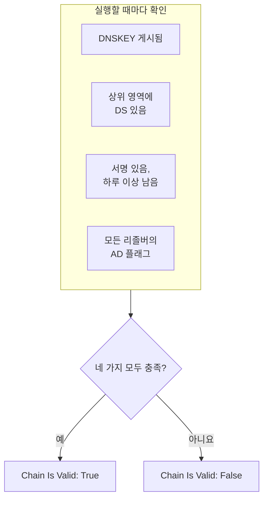

# DNSSEC 모니터

DNSSEC 모니터는 서명된 DNS 영역이 여전히 검증을 통과하는지 확인합니다. 영역이 키를 게시하는지, 상위 영역이 그 영역을 보증하는지, 서명이 만료되지 않았는지, 검증 리졸버가 영역을 받아들이는지입니다. 리졸버가 도메인에 대해 `SERVFAIL`로 응답하기 시작하기 전에 끊어진 신뢰 체인을 잡아내는 데 사용하세요.

:::cards
- [모니터 만들기](#dnssec-모니터-만들기): 대시보드에서 여섯 단계.
- [확인하는 내용](#작동-방식): 유효한 체인을 이루는 확인들.
- [모니터링 기준](#모니터링-기준): 체인의 유효성, 키, DS 레코드, 서명, 리졸버, 네임서버.
- [모범 사례](#모범-사례): 잘 작동하는 임계값과 리졸버.
:::

## 작동 방식

확인할 때마다 프로브는 영역에 대해 일련의 DNS 쿼리를 실행합니다.

| 쿼리 | 묻는 대상 | 알려 주는 것 |
| --- | --- | --- |
| `DNSKEY` | **리졸버**의 첫 번째 리졸버 | 영역이 서명 키를 게시하는지 여부. |
| `DS` | **리졸버**의 첫 번째 리졸버 | 상위 영역이 이 영역의 delegation signer 레코드를 게시하는지 여부. |
| `SOA`, DNSSEC 레코드 포함 | **리졸버**의 첫 번째 리졸버 | 영역의 레코드가 서명되었는지 여부(그 `SOA` 레코드에 서명하는 `RRSIG`)와, 가장 먼저 만료되는 서명이 언제 만료되는지. |
| `A`, DNSSEC 검증 포함 | **리졸버**의 모든 리졸버 | 각 검증 리졸버가 영역을 받아들이는지 여부. 리졸버는 이를 authenticated data(AD) 플래그로 나타냅니다. |
| `NS`, 그다음 `SOA` | 첫 번째 리졸버, 그다음 그 리졸버가 알려 주는 각 권한 네임서버 | 모든 네임서버가 같은 SOA 일련번호를 제공하는지 여부. **네임서버 일관성 확인**이 켜져 있을 때만. |

검증 리졸버는 루트부터 아래로 신뢰 체인을 확인하므로, AD 플래그는 체인 전체가 유지된다는 뜻입니다. 다음이 모두 충족되면 체인은 유효한 것으로 봅니다.

남은 기간이 하루 미만인 서명은 이미 끊어진 것으로 보므로, 리졸버가 영역을 거부하기 시작하기 최대 하루 전에 알 수 있습니다. 체인이 끊어졌거나 네임서버가 어긋난 것을 발견한 확인은, OneUptime이 결과를 모니터의 기준에 통과시키기 전에 1초 뒤에, 설정한 재시도 횟수만큼 다시 실행됩니다. 한 번의 시도에 속한 모든 쿼리는 **타임아웃 (ms)** 값의 세 배인 기한을 공유합니다. 시간이 다 된 시도는 영역에 대한 판정이 아니라 시간 초과를 보고합니다.

## 시작하기 전에

- **모니터를 만들 수 있는 역할**: Project Owner, Project Admin, Project Member, Monitor Admin 또는 Monitor Member, 또는 Create Monitor 권한이 있는 사용자 지정 역할.
- **서명된 영역.** 영역이 서명되어 있고, 그 DS 레코드가 등록 대행자를 통해 상위 영역에 게시되어 있어야 합니다.
- **프로브의 아웃바운드 DNS.** 지정한 리졸버로, 그리고 네임서버 일관성 확인을 위해 영역의 권한 네임서버로 나가는 DNS입니다. 모든 새 모니터에는 프로젝트의 기본 프로브가 선택됩니다.

## DNSSEC 모니터 만들기

:::steps
### 새 모니터 시작

**모니터**로 이동해 **모니터 생성**을 클릭합니다. **모니터 유형**에서 **더 많은 모니터 유형**을 클릭하고 **DNS Monitoring** 아래의 **DNSSEC**를 선택합니다.

### 이름 지정

`example.com DNSSEC` 같은 **이름**을 입력하고 **다음**을 클릭합니다.

### 영역 입력

**영역 (도메인 이름)** 항목에 검증할 영역(예: `example.com`)을 입력합니다. **리졸버**는 기본값을 그대로 두거나, 쉼표로 구분해 직접 나열합니다. 네트워크가 임의의 서버로 가는 DNS를 차단하지 않는다면 **네임서버 일관성 확인**은 켜 둡니다.

### 테스트

**모니터 테스트**를 클릭하고 **프로브 선택**에서 프로브를 고른 다음 **테스트 실행**을 클릭합니다. **모니터 테스트 결과**에 각 확인에서 찾은 내용이 표시됩니다.

### 기준 검토

**모니터 기준**은 [기본 기준](#기본-기준)으로 시작합니다. 체인이 끊어지면 오프라인, 유효하면 온라인입니다. 서명이 만료되기 전에 경고를 받으려면 기준을 추가한 다음([모범 사례](#모범-사례) 참고) **다음**을 클릭합니다.

### 프로브 선택 및 생성

**프로브**와 **모니터링 간격**(**5분마다**로 시작)을 그대로 두거나 바꾼 다음 **모니터 생성**을 클릭합니다. 모니터 페이지가 열립니다.
:::

## 구성 옵션

| 필드 | 기본값 | 입력할 내용 |
| --- | --- | --- |
| **영역 (도메인 이름)** | 없음 | 검증할 영역(예: `example.com`). |
| **리졸버** | `1.1.1.1, 8.8.8.8, 9.9.9.9` | 조회할 검증 리졸버(쉼표로 구분). 체인이 유효한 것으로 보려면 모두 AD 플래그를 반환해야 합니다. |
| **네임서버 일관성 확인** | 켜짐 | 각 권한 네임서버에 직접 묻고 SOA 일련번호를 비교합니다. 네트워크가 임의의 서버로 나가는 DNS를 차단하면 끕니다. |
| **서명 만료 경고(일)** (**추가 필드** 아래) | `7` | 모니터와 함께 저장됩니다. **DNSSEC Signature Expires In Days** 필터는 기준에서 지정한 값을 사용하므로, 임계값은 기준에서 설정합니다. |
| **타임아웃 (ms)** (**추가 필드** 아래) | `10000` | 각 DNS 쿼리를 기다리는 시간(밀리초). 한 번의 시도는 모두 합쳐 이 값의 최대 세 배까지 걸릴 수 있습니다. |
| **재시도**(**추가 필드** 아래) | `3` | 첫 시도가 실패한 뒤의 재시도 횟수. `0`은 한 번만 시도한다는 뜻입니다. |

## 모니터링 기준

기준은 영역을 온라인, 저하됨, 오프라인 중 무엇으로 볼지, 그리고 그에 따라 인시던트를 선언할지 알림을 생성할지를 정합니다. 각 기준은 하나 이상의 필터를 확인합니다.

| 필터 | 조건 | 확인하는 것 |
| --- | --- | --- |
| **DNSSEC Chain Is Valid** | **참**, **거짓** | 위의 네 가지 확인이 모두 충족됨: 키 게시, 상위 영역의 DS, 하루 이상 남은 서명, 모든 리졸버의 AD 플래그. |
| **DNSSEC DNSKEY Record Exists** | **참**, **거짓** | 영역이 DNSKEY 레코드를 하나 이상 게시함. |
| **DNSSEC DS Record Exists At Parent** | **참**, **거짓** | 상위 영역이 이 영역의 DS 레코드를 게시함. |
| **DNSSEC Signature Expires In Days** | **Greater Than**, **Less Than**, **Greater Than Or Equal To**, **Less Than Or Equal To** | 가장 먼저 만료되는 서명(RRSIG)이 만료될 때까지 남은 일수(정수). |
| **DNSSEC Resolver Consensus (AD Flag)** | **참**, **거짓** | **리졸버**의 모든 리졸버가 AD 플래그를 반환함. |
| **DNSSEC Nameservers Are Consistent** | **참**, **거짓** | 모든 권한 네임서버가 같은 SOA 일련번호로 응답함. **네임서버 일관성 확인**이 꺼져 있는 동안에는 항상 **참**. |

필터가 둘 이상이면 **일치 조건**이 필터가 모두 일치해야 하는지(**전체**), 하나만 일치하면 되는지(**모두**)를 정합니다. 기준의 **작업**은 그 기준이 하는 일을 정합니다: 모니터 상태 변경, 알림 생성, 인시던트 선언, 또는 이들 중 여러 개.

### 기본 기준

새 DNSSEC 모니터는 두 가지 기준으로 시작합니다.

- **체인이 끊어짐** — **DNSSEC Chain Is Valid**가 **거짓**입니다. 모니터는 **오프라인**으로 표시되고 "_monitor name_ DNSSEC chain is broken"이라는 인시던트가 생성됩니다. 체인이 다시 유효해지면 인시던트는 스스로 해결됩니다.
- **체인이 유효함** — 모니터는 **정상 작동**으로 표시됩니다.

기준은 위에서 아래로 확인되며, 처음 일치한 기준이 무엇을 할지 정합니다. 일치하는 기준이 없으면 모니터는 기본 상태를 표시합니다. 기준 아래의 **추가 필드**에서 다른 상태를 고르지 않으면 **정상 작동**입니다.

기본 기준은 그것만으로 서명 만료나 네임서버 일관성을 지켜보지 않습니다. 아래와 같이 이를 위한 기준을 추가하세요.

### 기준 예시

| 목표 | 필터 | 조건 | 값 |
| --- | --- | --- | --- |
| 체인이 끊어지면 오프라인(기본 기준) | **DNSSEC Chain Is Valid** | **거짓** | — |
| 서명이 만료되기 전에 경고 | **DNSSEC Signature Expires In Days** | **Less Than** | `7` |
| DS 레코드를 잃은 위임 잡기 | **DNSSEC DS Record Exists At Parent** | **거짓** | — |
| 서로 의견이 다른 리졸버 잡기 | **DNSSEC Resolver Consensus (AD Flag)** | **거짓** | — |
| 어긋난 네임서버 잡기 | **DNSSEC Nameservers Are Consistent** | **거짓** | — |

## 모범 사례

1. **항상 연결할 수 있는 리졸버를 고르세요.** 체인이 유효한 것으로 보려면 모든 리졸버가 AD 플래그를 반환해야 하므로, 프로브가 연결할 수 없는 리졸버가 있으면 재시도가 소진되는 순간 확인이 실패합니다. 기본값인 `1.1.1.1`, `8.8.8.8`, `9.9.9.9`는 서로 다른 세 운영자가 운영하므로, 한 리졸버에서는 검증되지만 다른 리졸버에서는 검증되지 않는 영역도 잡아냅니다.
2. **서명이 만료되기 전에 경고를 받으세요.** 서명 도구는 서명이 만료되기 전에 영역에 다시 서명하므로, 만료가 가까운 서명은 재서명이 멈췄다는 뜻입니다. 알림을 생성하는 **DNSSEC Signature Expires In Days** / **Less Than** / `7` 기준과, 인시던트를 선언하는 `2`짜리 두 번째 기준을 추가합니다. 처음 일치한 기준이 우선하므로, 두 기준 모두 체인을 유효로 표시하는 기준보다 위로 끌어 올리고 `2`일 기준을 먼저 둡니다. 재서명이 잘 작동하는 동안에는 조용하도록, 서명 도구가 재서명하기 전에 보통 서명에 남겨 두는 기간보다 낮은 임계값을 고릅니다.
3. **서명된 모든 영역을 모니터링하세요.** apex 도메인, 서명된 하위 도메인, 다른 운영자에게 위임된 모든 영역을 포함합니다.
4. **네임서버 일관성 확인을 켜 두고,** 이를 위한 기준을 추가하세요. 기본 서버로부터의 영역 전송이 멈춘 보조 서버를 잡아내며, 이는 DNSSEC 검증만으로는 놓칠 수 있습니다.

## 문제 해결

:::details 체인이 끊어졌다고 보고되지만 `dig`로는 영역이 검증됨
**리졸버**의 리졸버 중 하나가 AD 플래그를 반환하지 않았습니다. 프로브에서 연결할 수 없었거나, DNSSEC를 검증하지 않는 리졸버입니다. **모니터 테스트 결과**와 각 확인의 요약에 있는 **Resolver Checks** 표에 리졸버마다 응답과 오류가 표시됩니다. 프로브가 연결할 수 없는 리졸버를 빼고, 검증 리졸버만 나열합니다.
:::

:::details 변경 직후 네임서버가 일관되지 않다고 보고됨
영역이 바뀐 뒤 한동안은 보조 서버가 기본 서버보다 늦을 수 있습니다. 확인 요약의 **Nameserver Consistency** 표에 네임서버마다 SOA 일련번호가 표시됩니다. 하나가 계속 뒤처져 있으면 그 보조 서버는 영역 전송이 멈춘 것입니다. 모든 네임서버에 오류가 표시되면 프로브가 네임서버에 직접 묻는 것이 차단되었을 수 있습니다. **네임서버 일관성 확인**을 끕니다.
:::

:::details 확인이 시간 초과를 보고함
한 번의 시도에 속한 모든 쿼리는 **타임아웃 (ms)** 값의 세 배를 공유합니다. 느리거나 연결할 수 없는 리졸버가 그 시간을 다 써 버립니다. **리졸버**에서 빼거나 타임아웃을 늘립니다.
:::

## 다음 단계

:::cards
- [DNS 모니터](/docs/monitor/dns-monitor): 이름이 확인되는지, 레코드에 무엇이 들어 있는지 확인합니다.
- [도메인 모니터](/docs/monitor/domain-monitor): 도메인의 등록과 만료를 지켜봅니다.
- [SSL 인증서 모니터](/docs/monitor/ssl-certificate-monitor): 도메인에서 제공되는 인증서를 지켜봅니다.
- [인시던트 개요](/docs/incidents/index): 모니터가 인시던트를 선언한 뒤에 일어나는 일.
:::
