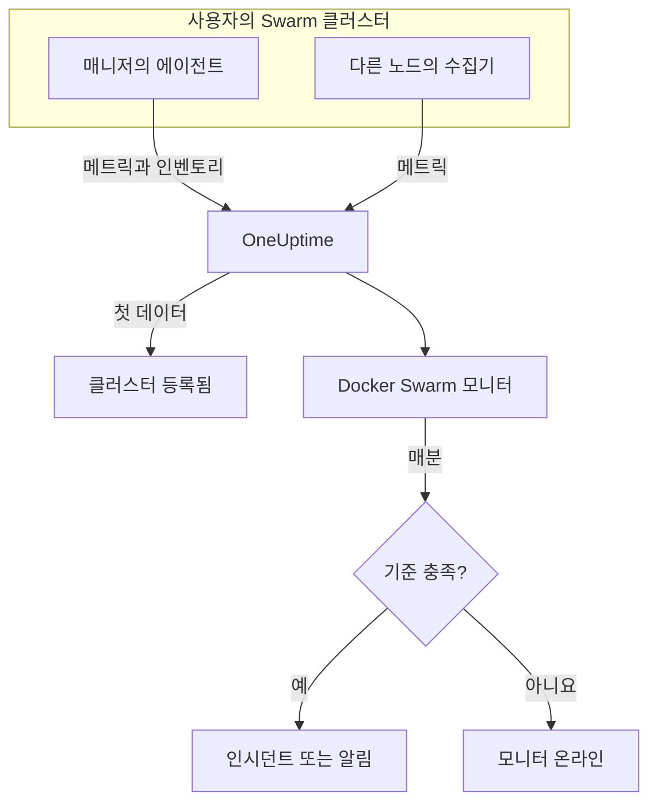

# Docker Swarm 모니터

Docker Swarm 모니터는 Swarm 클러스터의 서비스 작업 뒤에 있는 컨테이너를 감시하고, 작업이 다시 시작되거나 과열되거나 메모리가 부족해지면 알려 줍니다. OneUptime Docker Swarm 에이전트가 보내는 컨테이너 메트릭을 읽으므로 외부에서 아무것도 탐색하지 않습니다. 에이전트를 설치한 다음 템플릿이나 직접 만든 쿼리로 모니터를 만드세요.

:::cards
- [모니터 만들기](#docker-swarm-모니터-만들기): 대시보드에서 6단계.
- [템플릿](#미리-만들어진-알림-템플릿): 작업마다 인시던트 하나를 여는 4개의 미리 만들어진 알림.
- [메트릭](#수집되는-메트릭): 알림에 쓸 수 있는 컨테이너 메트릭.
- [필터](#모니터-설정): 모니터를 서비스, 작업, 이미지로 좁힙니다.
:::

## 작동 방식

OneUptime Docker Swarm 에이전트는 매니저 노드에서 실행됩니다. 그 수집기는 30초마다 해당 노드의 Docker 데몬에서 컨테이너 통계를 읽고, 각 배치에 클러스터 이름 `docker.swarm.cluster.name`을 찍습니다. 옆에서 실행되는 작은 인벤토리 폴러는 5분마다 Swarm API에서 클러스터의 노드, 서비스, 작업을 읽습니다. 첫 데이터가 클러스터를 OneUptime에 등록합니다.

수집기는 자신이 실행되는 노드의 컨테이너만 봅니다. 모든 노드의 메트릭을 받으려면 같은 `DOCKER_SWARM_CLUSTER_NAME`으로 각 노드에서 수집기를 실행하세요.

Docker Swarm 모니터는 클러스터 하나에 연결됩니다. 매분 그 클러스터의 컨테이너 메트릭에 쿼리를 실행하고 결과를 기준과 비교합니다.

## 시작하기 전에

- **Docker Swarm 에이전트를 설치하세요**. 매니저 노드에 설치합니다. [Docker Swarm 에이전트 가이드](/docs/telemetry/docker-swarm)에서 설치와 업그레이드, 다른 노드에서 수집기를 실행하는 방법을 다룹니다.
- **클러스터가 등록되었는지 확인하세요.** 첫 데이터가 도착하면 에이전트의 `DOCKER_SWARM_CLUSTER_NAME` 이름으로 **제품 → 인프라 → Docker Swarm → 모든 클러스터** 에 나타납니다.

## Docker Swarm 모니터 만들기

:::steps
### 새 모니터 시작

**모니터** 로 이동해 **모니터 생성** 을 클릭합니다.

### Docker Swarm 선택

**모니터 유형** 에서 **더 많은 모니터 유형** 을 클릭하고 **인프라** 아래의 **Docker Swarm** 을 고르거나, 검색 상자에 `swarm`을 입력합니다. **이름** 을 입력하고(인시던트와 알림 제목에 쓰입니다) **다음** 을 클릭합니다.

### 클러스터 선택

**Docker Swarm Monitor Configuration** 에서 **Docker Swarm Cluster** 의 클러스터를 고릅니다. 데이터를 보낸 모든 클러스터가 목록에 있습니다.

### 감시할 대상 선택

세 탭 중 하나를 고릅니다.

- **Quick Setup** – [템플릿](#미리-만들어진-알림-템플릿)을 클릭합니다. 메트릭, 집계, 시간 범위, 임계값을 설정하고 아래 기준을 템플릿의 기준으로 바꿉니다. **시간 범위** 는 계속 바꿀 수 있습니다.
- **Custom Metric** – **Docker Swarm Metric** 에서 메트릭 하나를 고른 다음 **집계** 와 **시간 범위** 를 설정합니다. [필터](#모니터-설정)로 일부 작업만 남길 수 있습니다.
- **고급** – **메트릭 선택** 에서 쿼리와 수식을 직접 만듭니다. **Group by** 에 `resource.container.name`을 지정하면 작업을 하나씩 판단합니다.

### 기준 확인

**모니터 기준** 의 각 기준을 열어 **메트릭**, **집계**, **조건**, **Threshold** 를 확인합니다. 템플릿은 이것들을 채웁니다. **Custom Metric** 이나 **고급** 을 쓰면 모니터는 메트릭이 0으로 떨어지는 것만 감지하는 [기본 기준](#기본-기준)으로 시작하므로, 직접 임계값을 설정하세요.

### 모니터 만들기

**모니터 생성** 을 클릭합니다. OneUptime이 모니터 페이지를 열고 매분 평가합니다. 모니터가 연 인시던트와 알림은 클러스터의 **인시던트** 및 **알림** 페이지에도 표시됩니다.
:::

> [!TIP]
> 여러 템플릿을 한 번에 설정하려면 **제품 → 인프라 → Docker Swarm** 에서 클러스터를 열고 **Recommendations** 로 이동하세요. 원하는 템플릿과 호출할 사람을 고르면 OneUptime이 템플릿마다 모니터를 하나씩 만듭니다.

## 모니터 설정

| 필드 | 탭 | 하는 일 |
| --- | --- | --- |
| **Docker Swarm Cluster** | 모두 | 필수. 모든 쿼리를 `resource.docker.swarm.cluster.name`으로 한정합니다. 에이전트가 찍는 리소스 속성은 이것뿐이므로, 모니터는 `container.runtime`이나 `host.name` 필터를 추가하지 않습니다. |
| **서비스 이름** | Custom Metric, 고급 | 선택 사항. `docker.swarm.service.name`과 정확히 일치. 예: `web`. |
| **노드 이름** | Custom Metric, 고급 | 선택 사항. `docker.swarm.node.name`과 정확히 일치. 예: `swarm-node-1`. |
| **컨테이너 이름** | Custom Metric, 고급 | 선택 사항. `resource.container.name`과 정확히 일치. 작업의 컨테이너 이름은 `<service>.<slot>.<taskid>`이며, 예는 `web.1.abc123`입니다. |
| **컨테이너 이미지** | Custom Metric, 고급 | 선택 사항. `resource.container.image.name`과 정확히 일치. 예: `nginx:latest`. |
| **Docker Swarm Metric** | Custom Metric | [카탈로그](#수집되는-메트릭)의 메트릭 하나. |
| **집계** | Custom Metric | 샘플을 합치는 방식: **평균**, **최대**, **최소**, **합계**, **개수**. 메트릭의 일반적인 집계에서 시작합니다. |
| **시간 범위** | 모두 | 쿼리가 읽는 이동 기간으로, **Past 1 Minute** 부터 **Past 365 Days** 까지입니다. 새 모니터는 **Past 1 Minute** 에서 시작하고, 템플릿은 자체 값을 설정합니다. |
| **메트릭 선택** | 고급 | 쿼리 빌더: **메트릭**, **Aggregate by**, **Filter by attributes**, **Group by**, 그리고 쿼리를 결합하는 **메트릭 추가** 와 **수식 추가**. |

> [!WARNING]
> 함께 제공되는 에이전트는 아직 `docker.swarm.service.name`이나 `docker.swarm.node.name`을 설정하지 않으므로, **서비스 이름** 이나 **노드 이름** 을 채운 모니터는 데이터를 찾지 못합니다. 대신 **컨테이너 이미지** 로 좁히거나 `resource.container.name`으로 그룹화하세요.

## 미리 만들어진 알림 템플릿

**Quick Setup** 에는 템플릿이 4개 있습니다. 각각 완전한 모니터를 만듭니다. `resource.container.name`으로 그룹화한 쿼리, 작동하는 기준, 회복하는 기준입니다. 작업은 하나씩 판단되며 각자 인시던트와 알림을 받고, 그 근본 원인에는 영향받은 작업과 그 값이 나열됩니다. 임계값은 출발점이므로 편집할 수 있습니다.

표에 달리 적혀 있지 않으면, 기준은 기간의 매분 조건이 유지될 때만 작동하고 임계값에서 10% 지난 지점에서 회복하므로 경계 근처를 오가는 값 때문에 깜빡이지 않습니다.

| 템플릿 | 심각도 | 감시 대상 | 작동 조건 | 회복 조건 |
| --- | --- | --- | --- | --- |
| Task Down (Low Uptime) | 심각 | `container.uptime`, 작업별 Min, 최근 1분 | 값 중 하나가 60초 미만 | 모든 값이 66초 이상 |
| High Task CPU Usage | Warning | `container.cpu.utilization`, 작업별 Avg, 최근 5분 | 80 초과(코어 하나 기준 %) | 72 이하 |
| High Task Memory Usage | Warning | `container.memory.percent`, 작업별 Avg, 최근 5분 | 85% 초과 | 76.5% 이하 |
| High Task Process Count | Warning | `container.pids.count`, 작업별 Max, 최근 5분 | 500 초과 | 450 이하 |

**심각도** 는 선택 목록에 표시되는 레이블입니다. 템플릿이 만드는 인시던트와 알림은 프로젝트에서 가장 심각한 인시던트 및 알림 심각도로 시작하니, 기준에서 바꾸세요.

> [!NOTE]
> **Task Down (Low Uptime)** 템플릿은 재시작이 수준이 아니라 이벤트이므로 새로 생긴 샘플 하나에도 작동합니다. Swarm은 대체 작업에 새 컨테이너, 즉 새 계열을 주므로, 템플릿은 0이 아니라 1분 미만의 가동 시간을 찾습니다. 배포나 확장도 이것을 작동시키며, 새 작업들의 가동 시간이 1분을 넘으면 해제됩니다. 종료되고 대체되지 않은 작업은 아무것도 보내지 않으므로 잡히지 않습니다.

## 수집되는 메트릭

에이전트의 수집기는 OpenTelemetry `docker_stats` 수신기를 쓰므로, 메트릭은 작업 컨테이너마다 계열 하나인 표준 컨테이너 메트릭입니다. `docker_swarm_*` 메트릭은 없습니다. 노드, 서비스, 작업은 인벤토리로 추적되며 클러스터의 **서비스**, **작업**, **노드** 및 관련 페이지에 표시됩니다.

### CPU

| 메트릭 | 단위 | 설명 |
| --- | --- | --- |
| `container.cpu.utilization` | % | 작업 컨테이너의 CPU 사용률. 100%가 CPU 코어 하나입니다. |

### 메모리

| 메트릭 | 단위 | 설명 |
| --- | --- | --- |
| `container.memory.usage.total` | 바이트 | 작업 컨테이너가 쓰는 메모리. |
| `container.memory.percent` | % | 컨테이너 한도, 서비스가 한도를 정하지 않았으면 노드 전체 메모리에 대한 사용 메모리 비율. |

### 네트워크

| 메트릭 | 단위 | 설명 |
| --- | --- | --- |
| `container.network.io.usage.rx_bytes` | 바이트 | 작업 컨테이너가 받은 바이트. 수명 전체 카운터. |
| `container.network.io.usage.tx_bytes` | 바이트 | 작업 컨테이너가 보낸 바이트. 수명 전체 카운터. |

### 컨테이너

| 메트릭 | 단위 | 설명 |
| --- | --- | --- |
| `container.pids.count` | 개수 | 작업 컨테이너 안의 프로세스. 갑자기 늘면 포크 폭탄이나 누수일 수 있습니다. |
| `container.uptime` | 초 | 작업 컨테이너가 실행된 시간. 다시 예약되거나 다시 시작된 작업은 새 컨테이너를 0부터 시작합니다. |

각 계열은 컨테이너의 신원을 리소스 속성으로 가집니다: `resource.container.name`(`<service>.<slot>.<taskid>`), `resource.container.image.name`, `resource.docker.swarm.cluster.name`.

## 모니터링 기준

기준은 모니터의 쿼리나 수식 하나를 임계값과 비교합니다. Docker Swarm 모니터의 기준에는 **필터 유형** 이 없으며, 모든 규칙이 다음 필드로 메트릭 값을 확인합니다.

| 필드 | 하는 일 |
| --- | --- |
| **메트릭** | 확인할 쿼리나 수식(변수 이름으로 지정). |
| **집계** | 기간 안의 값을 하나의 답으로 만드는 방식: **평균**, **합계**, **Maximum Value**, **Minimum Value**, **All Values**(모든 값이 일치해야 함), **Any Value**(하나면 충분). |
| **조건** | **Greater Than**, **Less Than**, **Greater Than Or Equal To**, **Less Than Or Equal To**, **Equal To**, 또는 이상 조건 **Anomalously High**, **Anomalously Low**, **Anomalous**. |
| **Threshold** | 비교할 값. 메트릭에 단위가 있으면 옆에 단위 목록이 있습니다. 이상 조건에서는 표시되지 않습니다. |
| **민감도** | 이상 조건 전용. **낮음**(4σ), **중간**(3σ, 기본값), **높음**(2σ). |
| **기준선 기간** | 이상 조건 전용. 기록 14일(기본값), 28일, 60일, 90일. |
| **데이터가 없는 경우** | **추가 필드** 아래에 있습니다. 기간에 샘플이 없을 때의 동작: **Ignore**(기본값), **Treat As Zero**, **트리거**. |

이상 조건은 각 값을 기준선의 같은 요일·같은 시간대와 비교합니다. 기준선 기간에 기록이 충분히 쌓일 때까지 "Learning" 상태로 남으며 아무것도 만들지 않습니다.

각 기준은 일치했을 때 할 일도 정합니다. 모니터 상태 변경, 알림 생성, 인시던트 선언입니다. 기준은 위에서 아래로 확인되며, 처음 일치한 기준이 결정합니다.

### 기본 기준

템플릿으로 만들지 않은 모니터는 두 개의 기준으로 시작합니다.

| 순서 | 기준 | 일치하는 경우 | 결과 |
| --- | --- | --- | --- |
| 1 | Check if _monitor name_ is offline | 첫 번째 쿼리의 값 중 하나가 `0` | 모니터를 **오프라인** 으로 표시하고 인시던트 "_monitor name_ is offline"을 선언합니다. 모니터가 회복하면 스스로 해결됩니다. |
| 2 | Check if _monitor name_ is online | 값 중 하나가 `0`보다 큼 | 모니터를 **정상 작동** 으로 표시합니다. |

> [!IMPORTANT]
> 무응답은 어느 기준과도 일치하지 않습니다. 데이터를 보내지 않게 된 클러스터는 모니터를 원래 상태 그대로 둡니다. 데이터가 멈출 때 알림을 받으려면 기준에서 **데이터가 없는 경우** 를 **트리거** 로 설정하세요. OneUptime 자체가 데이터를 받지 못한 시간은 절대 데이터 없음으로 취급되지 않습니다. 그런 시간이 포함된 기간의 확인은 대신 기다리며, 자세한 내용은 [OneUptime이 데이터를 받지 못할 때](/docs/monitor/when-oneuptime-is-not-receiving)에서 설명합니다.

## 문제 해결

:::details 클러스터가 Docker Swarm Cluster 목록에 없음
클러스터는 에이전트의 데이터에서 스스로 등록됩니다. 에이전트가 매니저 노드에서 실행 중인지, `DOCKER_SWARM_CLUSTER_NAME`이 설정되어 있는지, 클러스터가 **제품 → 인프라 → Docker Swarm → 모든 클러스터** 에 있는지 확인하세요. [Docker Swarm 에이전트 가이드](/docs/telemetry/docker-swarm)에 노드에서 실행할 확인 절차가 있습니다.
:::

:::details 일부 작업에만 메트릭이 있음
수집기는 자신이 실행되는 노드의 Docker 데몬을 읽으므로, 그 노드의 작업만 봅니다. 같은 `DOCKER_SWARM_CLUSTER_NAME`으로 모든 노드에서 수집기를 실행하세요.
:::

:::details 서비스나 노드로 필터링한 모니터가 데이터를 찾지 못함
**서비스 이름** 과 **노드 이름** 은 `docker.swarm.service.name`과 `docker.swarm.node.name`에 맞추는데, 함께 제공되는 에이전트는 이것들을 설정하지 않습니다. 비우고 **컨테이너 이미지** 로 좁히거나, `resource.container.name`으로 그룹화하세요.
:::

:::details 모든 작업이 하나의 계열로 보임
템플릿처럼 리소스 속성 `resource.container.name`으로 그룹화하세요. 접두사 없는 `container.name`은 아무것과도 일치하지 않으므로, 모든 작업이 이름이 빈 계열 하나로 합쳐집니다.
:::

## 다음 단계

:::cards
- [Docker Swarm 에이전트](/docs/telemetry/docker-swarm): 이 모니터가 읽는 에이전트를 설치하고 업그레이드합니다.
- [Docker 모니터](/docs/monitor/docker-monitor): Docker 호스트 한 대의 컨테이너를 감시합니다.
- [인시던트 개요](/docs/incidents/index): 기준이 인시던트를 선언한 뒤 일어나는 일.
- [온콜 스케줄](/docs/on-call/schedules): 작업이 고장 났을 때 누구를 호출할지 정합니다.
:::
