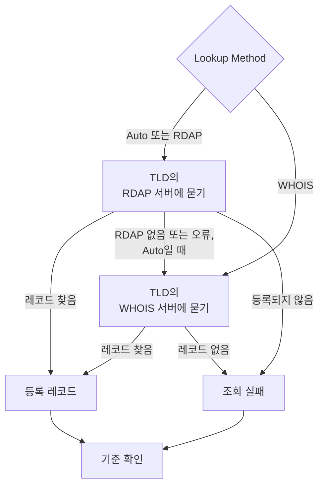

# 도메인 모니터

도메인 모니터는 일정에 따라 도메인의 등록 레코드를 읽어 만료일, 등록 대행자, 네임서버, 상태 코드를 추적하고, 도메인이 만료되기 전에 알려 줍니다. 웹사이트, API, 이메일이 의존하는 모든 도메인에 사용하세요. 등록이 만료되면 이 모두가 한꺼번에 멈춥니다.

:::cards
- [모니터 만들기](#도메인-모니터-만들기): 대시보드에서 여섯 단계.
- [조회 방법](#조회-방법): RDAP, WHOIS, 그리고 **Auto**가 기본값인 이유.
- [기본 기준](#기본-기준): 설정 없이 30일 전에 만료 경고.
- [문제 해결](#문제-해결): 폐지된 WHOIS 서버, 프록시, 누락된 날짜.
:::

## 작동 방식

확인할 때마다 프로브는 **Lookup Method**에 따라 RDAP 또는 WHOIS로 도메인의 등록 레코드를 조회하고, 찾은 내용을 정규화합니다. 만료일, 등록 대행자, 네임서버, 상태 코드입니다. 실패한 조회는 설정한 재시도 횟수만큼 다시 시도합니다. 그런 다음 OneUptime이 레코드를 모니터의 기준에 통과시킵니다.

조회로 등록 데이터를 얻을 수 없으면(TLD의 서비스가 폐지되었거나 도메인이 등록되지 않았기 때문에), 모니터는 빈 만료일로 정상이라고 보고되는 대신, 모니터의 프로브 응답에 이유가 표시된 채 **오프라인**으로 보고됩니다. "이 도메인은 사용 가능합니다"라고 답하는 레지스트리(예: DENIC의 `Status: free`)는 정상 레코드가 아니라 **등록되지 않음**으로 처리됩니다.

국제화 도메인 이름은 두 형식 모두 받습니다. `münchen.de`는 조회 전에 A-레이블(`xn--mnchen-3ya.de`)로 변환됩니다.

## 시작하기 전에

- **모니터를 만들 수 있는 역할**: Project Owner, Project Admin, Project Member, Monitor Admin 또는 Monitor Member, 또는 Create Monitor 권한이 있는 사용자 지정 역할.
- **프로브에서 레지스트리로 나가는 접근.** 모든 새 모니터에는 프로젝트의 기본 프로브가 선택됩니다. [사용자 지정 프로브](/docs/probe/custom-probe)는 다음에 연결할 수 있어야 합니다.

| 대상 | 프로토콜 | 용도 |
| --- | --- | --- |
| `https://data.iana.org/rdap/dns.json` | HTTPS, 포트 443 | 각 TLD의 RDAP 서버 위치를 알려 주는 IANA RDAP 부트스트랩 레지스트리. 한 번 가져와 24시간 동안 캐시합니다. |
| 레지스트리의 RDAP 서버 | HTTPS, 포트 443 | RDAP 조회. |
| WHOIS 서버 | TCP 포트 43 | WHOIS 조회. |

RDAP 요청은 프로브의 `HTTP_PROXY_URL` / `HTTPS_PROXY_URL` / `NO_PROXY` 설정을 따릅니다. WHOIS는 원시 소켓으로 동작하며 이 설정을 따르지 않습니다. 프로브가 `data.iana.org`에 연결할 수 없으면 **Auto**는 WHOIS로 대체하고 5분 뒤에 IANA를 다시 시도합니다.

## 도메인 모니터 만들기

:::steps
### 새 모니터 시작

**모니터**로 이동해 **모니터 생성**을 클릭합니다. **모니터 유형**에서 **더 많은 모니터 유형**을 클릭하고 **Basic Monitoring** 아래의 **도메인**을 선택합니다.

### 이름 지정

`example.com registration` 같은 **이름**을 입력하고 **다음**을 클릭합니다.

### 도메인 입력

**도메인 이름**(예: `example.com`)을 입력합니다. 다른 이유가 없다면 **Lookup Method**는 **Auto**로 둡니다([조회 방법](#조회-방법) 참고).

### 테스트

**모니터 테스트**를 클릭하고 **프로브 선택**에서 프로브를 고른 다음 **테스트 실행**을 클릭합니다. **모니터 테스트 결과**에 프로브가 읽은 등록 레코드와, RDAP와 WHOIS 중 어느 쪽이 응답했는지가 표시됩니다.

### 기준 검토

**모니터 기준**은 [기본 기준](#기본-기준)으로 시작합니다. 등록이 만료되었거나 읽을 수 없으면 오프라인, 30일 이내에 만료되면 알림입니다. 필요하면 바꾼 다음 **다음**을 클릭합니다.

### 프로브 선택 및 생성

**프로브**와 **모니터링 간격**(**5분마다**로 시작)을 그대로 두거나 바꾼 다음 **모니터 생성**을 클릭합니다. 모니터 페이지가 열립니다.
:::

## 구성 옵션

| 필드 | 기본값 | 입력할 내용 |
| --- | --- | --- |
| **도메인 이름** | 없음 | 등록된 도메인(예: `example.com`). 붙여 넣은 주소도 됩니다. `https://example.com/pricing`은 `example.com`으로 읽습니다. |
| **Lookup Method** | **Auto** | **Auto**, **RDAP**, **WHOIS** 중 하나. [조회 방법](#조회-방법)을 참고하세요. |
| **타임아웃 (ms)** (**추가 필드** 아래) | `10000` | 각 등록 조회를 기다리는 시간(밀리초). |
| **재시도**(**추가 필드** 아래) | `3` | 첫 시도가 실패한 뒤의 재시도 횟수. `0`은 한 번만 시도한다는 뜻입니다. |

실패한 조회는 모두 시도 사이에 1초씩 쉬면서 다시 시도합니다. 레지스트리가 도메인이 등록되지 않았다거나 등록 서비스가 없다고 답한 경우에도, 그 답이 일시적인 오류였을 때를 대비해 다시 시도합니다. 형식이 잘못된 도메인 이름만 조회 없이 바로 보고됩니다.

타임아웃은 확인 전체가 아니라 각 요청에 적용됩니다. RDAP를 시도한 뒤 WHOIS로 대체하는 **Auto** 확인은 두 배 이상 걸릴 수 있습니다.

### 조회 방법

등록 데이터는 두 가지 프로토콜로 읽을 수 있으며, 어느 쪽이 작동하는지는 TLD에 따라 다릅니다.

| 방법 | 동작 |
| --- | --- |
| **Auto** | 기본값. TLD가 RDAP 서비스를 게시하면 RDAP를 사용하고, 게시하지 않거나 RDAP 조회가 실패하면 WHOIS로 대체합니다. |
| **RDAP** | RDAP만 사용. TLD가 RDAP 서비스를 게시하지 않으면 명확한 오류와 함께 실패합니다. |
| **WHOIS** | WHOIS만 사용. |

**RDAP**([RFC 9083](https://www.rfc-editor.org/rfc/rfc9083))는 ICANN이 의무화한 WHOIS의 후속 프로토콜입니다. 각 TLD의 권한 서버는 [IANA의 부트스트랩 레지스트리](https://www.rfc-editor.org/rfc/rfc9224)에서 찾으므로, 레지스트리가 옮겨 가도 올바르게 유지됩니다. 모든 gTLD가 RDAP 서버를 게시합니다. TLD의 RDAP 서버가 도메인이 등록되지 않았다고 하면, **Auto**는 그것을 답으로 받아들이고 WHOIS에 묻지 않습니다.

**WHOIS**에는 이에 상응하는 탐색 메커니즘이 없습니다. 클라이언트는 TLD와 WHOIS 호스트를 잇는 고정된 대응표를 함께 배포하며, 이 대응표는 낡아 갑니다. Identity Digital의 모든 TLD(`.digital`, `.email`, `.life`, `.today`, `.zone` 외 약 290개)는 여전히 폐지된 호스트에 대응되어 있으며, 이 호스트는 이제 모든 쿼리에 레코드 대신 `TLD is not supported.`라는 문자 그대로의 텍스트로 답합니다. RDAP 서비스를 전혀 게시하지 않는 많은 ccTLD(`.io`, `.co`, `.de`, `.ch`, `.jp` 등)에는 WHOIS가 유일한 선택지로 남아 있습니다.

## 모니터링 기준

기준은 도메인을 정상과 문제 있음 중 무엇으로 볼지, 그리고 그에 따라 인시던트를 선언할지 알림을 생성할지를 정합니다. 각 기준은 하나 이상의 필터를 확인합니다.

| 필터 | 조건 | 확인하는 것 |
| --- | --- | --- |
| **Is Online** | **참**, **거짓** | 등록 조회 자체가 성공했는지 여부. |
| **Is Request Timeout** | **참**, **거짓** | 모든 시도에서 조회가 시간 초과되었는지 여부. |
| **Domain Expires In Days** | **Greater Than**, **Less Than**, **Greater Than Or Equal To**, **Less Than Or Equal To** | 등록이 만료될 때까지 남은 일수(하루 단위로 올림). |
| **Domain Is Expired** | **참**, **거짓** | 만료일이 지났는지 여부. |
| **Domain Registrar** | **포함**, **Not Contains**, **Starts With**, **Ends With**, **Equal To**, **Not Equal To** | 등록 대행자의 이름. |
| **Domain Name Server** | **포함**, **Not Contains**, **Starts With**, **Ends With**, **Equal To**, **Not Equal To** | 도메인의 네임서버. 그중 하나라도 일치하면 일치합니다. |
| **Domain Status Code** | **포함**, **Not Contains**, **Starts With**, **Ends With**, **Equal To**, **Not Equal To** | 도메인의 EPP 상태 코드. 그중 하나라도 일치하면 일치합니다. |

상태 코드는 어느 프로토콜이 응답했든 EPP 이름(`clientTransferProhibited`)으로 정규화되므로, **Auto**가 RDAP와 WHOIS 사이를 전환해도 기준은 계속 일치합니다. 등록 대행자의 _이름_ 은 응답한 서비스가 게시한 그대로이며 두 프로토콜 사이에서 조금씩 다를 수 있으므로, **Domain Registrar** 기준에는 **Equal To**보다 **포함**을 쓰는 것이 좋습니다.

날짜는 ISO 8601로 정규화됩니다. 레지스트리가 해석할 수 없는 형식으로 게시한 날짜는 저장하지 않고 생략하므로, 만료 기준은 판단할 수 없어 일치하지 않습니다. 조용히 영원히 "만료되지 않음"이라고 답하지 않습니다.

필터가 둘 이상이면 **일치 조건**이 필터가 모두 일치해야 하는지(**전체**), 하나만 일치하면 되는지(**모두**)를 정합니다. 기준의 **작업**은 그 기준이 하는 일을 정합니다: 모니터 상태 변경, 알림 생성, 인시던트 선언, 또는 이들 중 여러 개.

### 기본 기준

새 도메인 모니터는 세 가지 기준으로 시작하므로, 아무것도 설정하지 않아도 등록이 만료되기 전에 알려 줍니다.

1. **도메인 확인 실패** — 등록이 만료되었거나, 등록 데이터를 읽을 수 없었습니다. 모니터는 **오프라인**으로 표시되고 "_monitor name_ domain check failed"라는 인시던트가 생성됩니다. 등록을 다시 읽을 수 있고 유효해지면 인시던트는 스스로 해결됩니다.
2. **도메인이 곧 만료됨** — 등록은 만료되지 않았지만 30일 이내에 만료됩니다. "_monitor name_ domain expires soon"이라는 **알림**이 생성됩니다.
3. **도메인이 만료되지 않음** — 모니터는 **정상 작동**으로 표시됩니다.

"곧 만료됨" 경고는 인시던트가 아니라 알림입니다. 상태 페이지에 표시되지 않고, 온콜 정책을 추가하지 않는 한 아무도 호출하지 않으며, 모니터의 상태도 바꾸지 않습니다. 프로젝트의 두 번째 알림 심각도를 사용하며, 새 프로젝트에서는 **Low**입니다. 갱신이 등록 레코드에 나타나면 알림은 스스로 해결됩니다. 만료일을 게시하지 않는 레지스트리에서는 경고가 판단할 근거가 없으므로 조용히 있습니다.

기준은 위에서 아래로 확인되며, 처음 일치한 기준이 무엇을 할지 정합니다. 그래서 "곧 만료됨"이 "만료되지 않음"보다 위에 있습니다. 곧 만료될 도메인도 아직 만료되지 않았으므로 두 기준 모두에 일치하기 때문입니다.

더 일찍 경고를 받으려면 "곧 만료됨" 기준에 있는 **Domain Expires In Days** 필터의 값을 예를 들어 `60`으로 바꿉니다. 대신 누군가를 호출하려면 그 기준의 **작업**을 열고 **필터가 일치하면 인시던트를 선언합니다.** 항목을 켜거나, 알림은 그대로 두고 **온콜 정책**에서 온콜 정책을 추가합니다.

:::details 경고가 생기기 전에 만든 모니터에 경고 추가하기
OneUptime이 이 경고를 추가하기 전에 만든 모니터에는 "곧 만료됨" 기준이 없습니다. 추가하려면:

1. 모니터에서 **구성 → 기준**을 열고 **모니터링 기준 편집**을 클릭합니다.
2. **기준 추가**를 클릭합니다. 필터를 **Domain Is Expired** / **거짓**으로 설정하고, **필터 추가**를 클릭한 다음 두 번째 필터를 **Domain Expires In Days** / **Less Than Or Equal To** / `30`으로 설정합니다. **일치 조건**은 **전체**로 둡니다(필터가 두 개가 되면 필터 아래에 나타납니다).
3. **작업**에서 **필터가 일치하면 경고를 생성합니다.** 항목을 켜고 **필터가 일치하면 모니터 상태를 변경합니다.** 항목은 꺼 두어, 알림은 생성하되 모니터 상태는 바꾸지 않게 합니다.
4. 새 기준을 모니터를 온라인으로 표시하는 기준보다 위로 끌어 놓고 저장합니다.
:::

### 기준 예시

| 목표 | 필터 | 조건 | 값 |
| --- | --- | --- | --- |
| 도메인이 30일 이내에 만료되면 알림(기본 기준) | **Domain Expires In Days** | **Less Than Or Equal To** | `30` |
| 도메인이 만료되면 오프라인 | **Domain Is Expired** | **참** | — |
| 등록을 읽을 수 없으면 오프라인 | **Is Online** | **거짓** | — |
| 네임서버가 바뀌면 알림 | **Domain Name Server** | **Not Contains** | `ns1.example.com` |
| 도메인의 이전 잠금이 풀리면 알림 | **Domain Status Code** | **Not Contains** | `clientTransferProhibited` |

**Domain Name Server**와 **Domain Status Code**는 값 중 _하나라도_ 일치하면 일치하므로, **Not Contains**는 네임서버나 상태 코드 중 하나라도 텍스트를 포함하지 않으면 바로 일치합니다.

## 모범 사례

1. **갱신할 시간을 확보하세요** — 기본 경고는 만료 30일 전에 옵니다. 갱신에 승인이나 시간이 오래 걸리는 결제가 필요하다면 60일로 늘립니다.
2. **실패한 조회도 다루세요** — 오프라인 기준에 **Is Online** / **거짓** 필터를 넣어, 읽을 수 없는 등록이 정상으로 오인되지 않게 합니다. 새 모니터의 기본 기준에는 들어 있지만, 그 전에 만든 모니터에는 직접 추가해야 합니다. 가끔 프로브에 속도 제한을 거는 WHOIS 서버를 견디려면, 그 필터 아래의 **일정 기간에 걸쳐 이 기준을 평가**를 선택하고 **All Values**를 고릅니다. 그러면 기간 안의 모든 조회가 실패했을 때만 도메인이 오프라인이 됩니다.
3. **중요한 도메인을 모두 모니터링하세요** — 기본 도메인, 따로 등록한 하위 도메인, 이메일이나 API에 쓰는 모든 도메인을 포함합니다.
4. **등록 대행자 변경을 추적하세요** — 무단 이전을 잡아내도록 **Domain Registrar** / **Not Contains** / 사용 중인 등록 대행자 이름으로 된 기준을 추가합니다.

## 문제 해결

:::details WHOIS 서버가 "answered without any registration data"로 응답함
TLD의 WHOIS 호스트가 폐지되었거나, 프로브에 속도 제한을 걸고 있거나, 잠시 고장 났습니다. Identity Digital TLD에 아직 대응되어 있는 호스트 같은 폐지된 호스트는 매번 `TLD is not supported.`라고 답합니다. **Lookup Method**가 **WHOIS**인 상태로 실패가 계속되면 **Auto**로 바꿔, RDAP 서비스가 있는 TLD에서는 프로브가 그 서비스를 읽게 합니다.
:::

:::details 확인이 "No RDAP service is published"로 실패함
모니터가 **RDAP**를 사용하는데, 많은 ccTLD처럼 TLD가 RDAP 서비스를 게시하지 않습니다. **Lookup Method**를 WHOIS로 대체하는 **Auto**로 바꿉니다.
:::

:::details 도메인이 등록되지 않았다고 보고됨
레지스트리가 도메인을 사용할 수 있다고 답했습니다. 철자와, 하위 도메인이 아니라 `example.com`처럼 등록된 도메인을 입력했는지 확인합니다.
:::

:::details 프록시 뒤에 있는 프로브에서 조회가 실패함
RDAP는 프로브의 프록시 설정을 거치지만 WHOIS는 그렇지 않습니다. WHOIS를 위해 아웃바운드 TCP 포트 43을 허용하거나, RDAP 서비스를 게시하는 TLD에는 **Auto** 또는 **RDAP**를 사용합니다.
:::

:::details 만료일이 비어 있고 만료 기준이 한 번도 실행되지 않음
레지스트리가 만료일을 게시하지 않거나, 해석할 수 없는 형식으로 게시합니다. 날짜가 없으면 만료 기준은 판단할 수 없으므로 조용히 있습니다. **Is Online**은 여전히 레코드를 읽을 수 있는지 알려 줍니다.
:::

## 다음 단계

:::cards
- [SSL 인증서 모니터](/docs/monitor/ssl-certificate-monitor): 도메인의 인증서가 만료되기 전에 경고를 받습니다.
- [DNS 모니터](/docs/monitor/dns-monitor): 도메인의 레코드가 확인되는지, 무엇이 들어 있는지 확인합니다.
- [DNSSEC 모니터](/docs/monitor/dnssec-monitor): 서명된 영역의 신뢰 체인을 검증합니다.
- [에스컬레이션 규칙](/docs/on-call/escalation-rules): 알림과 인시던트로 누가 호출될지 정합니다.
:::
