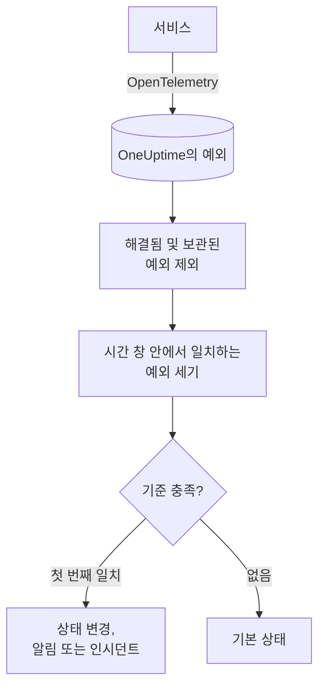

# 예외 모니터

예외 모니터는 서비스가 OneUptime에 보고하는 예외 중 필터(메시지, 예외 유형, 환경, 서비스)와 일치하는 예외를 시간 창 안에서 셉니다. 그 수가 기준을 충족하면 모니터의 상태를 바꾸거나, 알림을 만들거나, 인시던트를 선언합니다. 프로덕션의 새로운 충돌, 특정 예외 유형, 갑작스러운 오류 증가에 대해 알림을 받는 데 사용합니다.

:::cards
- [모니터 만들기](#예외-모니터-만들기): 셀 예외와 알림을 보낼 시점을 고릅니다.
- [환경](#환경): 모니터를 `production`으로 한정합니다.
- [평가 방식](#평가-방식): 무엇이 세어지고, 예외를 해결하면 어떻게 되는지.
- [기준](#기준): 조건과 기본값.
:::

## 작동 방식



OneUptime은 매분 모니터의 필터와 일치하고 시간 창 안에서 발생한 예외를 세며, 해결됨으로 표시했거나 보관한 예외는 제외합니다. 그 수를 모니터의 기준과 위에서부터 차례로 비교하고, 처음 일치하는 기준이 무슨 일이 일어날지 결정합니다. 일치하는 기준이 없으면 모니터는 기본 상태로 돌아갑니다.

## 시작하기 전에

- 서비스가 OpenTelemetry로 OneUptime에 예외를 보내고 있어야 합니다. [OpenTelemetry](/docs/telemetry/open-telemetry)를 참고하세요.
- 모니터를 환경으로 한정하려면 서비스가 리소스 속성 `deployment.environment`를 설정해야 합니다.

## 예외 모니터 만들기

:::steps
### 새 모니터 시작

**모니터**로 이동해 **모니터 생성**을 클릭합니다.

### Exceptions 선택

**모니터 유형**에서 **더 많은 모니터 유형**을 클릭하고 **텔레메트리** 아래의 **예외**를 선택하거나, 검색 상자에 `exceptions`를 입력합니다. **이름**을 입력하고 **다음**을 클릭합니다.

### 셀 예외 선택

**예외 모니터 구성**에서 **예외 메시지 필터**, **예외 유형**, **Environments**, **(시간) 동안의 모니터 예외**를 설정합니다. 비워 둔 필터는 모든 예외와 일치합니다. 필터 아래의 **예외 미리 보기**에 지금 일치하는 예외가 표시됩니다.

### 범위 좁히기(선택 사항)

**추가 필드**를 열어 텔레메트리 서비스나 인프라 엔터티로 필터링하거나, 해결됨 및 보관된 예외도 세도록 합니다.

### 기준 설정

**모니터 기준** 카드는 두 가지 기준으로 시작합니다. 일치하는 예외가 있으면 인시던트와 함께 오프라인, 하나도 없으면 온라인입니다. 알림을 받고 싶은 내용에 맞게 바꾸세요([기준](#기준) 참고).

### 모니터 만들기

**모니터 생성**을 클릭합니다. 모니터가 **개요** 페이지로 열리고 1분 안에 첫 평가가 실행됩니다.
:::

## 조회 대상

| 필드 | 일치 대상 | 기본값 |
| --- | --- | --- |
| **예외 메시지 필터** | 메시지에 이 텍스트가 포함된 예외. 대소문자를 구분하지 않습니다. | 비어 있음: 모든 예외 |
| **예외 유형** | 이 유형 중 하나의 예외. `TypeError, NullReferenceException`처럼 쉼표로 구분합니다. 유형 이름은 정확히 일치해야 합니다. | 비어 있음: 모든 유형 |
| **Environments** | 이 환경 중 하나에서 온 예외. 쉼표로 구분합니다([환경](#환경) 참고). | 비어 있음: 모든 환경 |
| **(시간) 동안의 모니터 예외** | 최근 5초부터 최근 24시간까지의 예외. | **지난 1분** |
| **텔레메트리 서비스로 필터링**(**추가 필드** 안) | 선택한 서비스 중 하나에서 온 예외. | 비어 있음: 모든 서비스 |
| **Filter by Infrastructure Entity**(**추가 필드** 안) | 선택한 호스트, 파드, 컨테이너 및 기타 엔터티 중 하나에서 온 예외. | 비어 있음: 모든 엔터티 |
| **해결된 예외 포함**(**추가 필드** 안) | 해결됨으로 표시된 예외도 셉니다. | 꺼짐 |
| **보관된 예외 포함**(**추가 필드** 안) | 보관된 예외도 셉니다. | 꺼짐 |

예외가 세어지려면 설정한 모든 필터와 일치해야 합니다.

### 환경

환경은 각 예외의 OpenTelemetry 리소스 속성 `deployment.environment`에서 가져옵니다. 예외 탐색기가 `env:production`으로 필터링하는 것과 같은 값입니다. 환경을 하나 입력하거나 쉼표로 구분해 여러 개 입력합니다. 예외는 그 환경이 그중 하나와 일치하면 세어집니다.

일치는 정확해야 하며 대소문자를 구분합니다. `production`은 `Production`이나 `prod`와 일치하지 않습니다. 이 필터를 설정하면 환경이 없는 예외는 세어지지 않습니다. 환경이 없는 예외를 포함해 모든 환경의 예외를 세려면 비워 두세요.

환경 필터는 다른 모든 필터와 결합되므로, 텔레메트리 서비스 하나와 `production`으로 한정한 모니터는 그 서비스의 프로덕션 예외만 셉니다.

API로 모니터를 만들 때는 단계의 `exceptionMonitor`에서 `environments`를 환경 이름 목록으로 설정합니다.

```json
{
  "exceptionMonitor": {
    "telemetryServiceIds": [],
    "environments": ["production"],
    "exceptionTypes": [],
    "message": "",
    "includeResolved": false,
    "includeArchived": false,
    "lastXSecondsOfExceptions": 300
  }
}
```

## 평가 방식

- **매분.** 예외 모니터는 프로브가 확인하지 않으므로 설정할 간격도, **프로브 및 간격** 페이지도 없습니다.
- **예외 유형이 아니라 발생 횟수.** 모니터는 일치하는 예외가 **(시간) 동안의 모니터 예외** 안에서 발생할 때마다 셉니다. 40번 발생한 예외 하나는 40으로 셉니다.
- **해결됨 및 보관된 예외는 제외됩니다.** **해결된 예외 포함**이나 **보관된 예외 포함**을 켜지 않으면, 해결됨으로 표시했거나 보관한 예외의 발생은 세어지지 않습니다. 따라서 예외를 해결됨으로 표시하면 그 예외가 연 인시던트가 닫힐 수 있습니다. 해결된 예외가 다시 발생하면 자동으로 미해결로 돌아가 다시 세어집니다.
- **예외가 없으면 개수는 0입니다.**
- **OneUptime 자체의 중단은 침묵이 아닙니다.** OneUptime 자체가 데이터를 받지 못한 시간(재시작, 업그레이드, 밀린 작업 처리 중)이 시간 창에 들어 있는 동안 확인은 기다립니다. 상태가 바뀌지 않으며, 인시던트나 알림이 열리거나 해결되지도 않습니다. [OneUptime이 데이터를 받지 못할 때](/docs/monitor/when-oneuptime-is-not-receiving)를 참고하세요.
- **기준은 위에서부터.** 처음 일치하는 기준이 결정하므로 가장 심각한 기준을 맨 위에 두세요.

모든 상태 변경은 그 이유와 함께 모니터의 **상태 타임라인**에 기록됩니다.

## 기준

예외 모니터의 기준에는 **필터 유형**이 하나뿐입니다. 창 안에서 일치한 예외의 수인 **Exception Count**입니다. **필터 조건**과 **값**을 고릅니다.

| 필터 조건 | 예외 수가 다음과 같을 때 일치 |
| --- | --- |
| **Greater Than** | 값보다 큼 |
| **Greater Than Or Equal To** | 값 이상 |
| **Less Than** | 값보다 작음 |
| **Less Than Or Equal To** | 값 이하 |
| **Equal To** | 값과 정확히 같음 |
| **Not Equal To** | 값이 아닌 모든 것 |

예외 수에는 이상 조건이 없습니다. 비교할 기준선이 없기 때문입니다.

새 예외 모니터는 다음 기준으로 시작합니다.

| 기준 | 필터 | 효과 |
| --- | --- | --- |
| Check if … has exceptions | **Exception Count** **Greater Than** `0` | 모니터를 오프라인으로 표시하고 인시던트를 선언합니다(자동 해결) |
| Check if … has no exceptions | **Exception Count** **Equal To** `0` | 모니터를 온라인으로 표시합니다 |

## 실전 예: 프로덕션 예외만

API가 프로덕션에서 예외를 던질 때마다 인시던트를 만들고, 스테이징에서는 아무 일도 없게 하려고 합니다. **Environments**를 `production`으로, **(시간) 동안의 모니터 예외**를 **지난 5분**으로 설정하고 기본 기준은 그대로 둡니다. 최근 5분 동안은 다음과 같습니다.

| 예외 | 환경 | 상태 | 세어지나요? |
| --- | --- | --- | --- |
| `TypeError` × 3 | `production` | 활성 | 예: 3 |
| `TypeError` × 40 | `staging` | 활성 | 아니요: 다른 환경 |
| `TimeoutError` × 2 | 없음 | 활성 | 아니요: 환경 없음 |
| `NullReferenceException` × 4 | `production` | 발생 후 해결됨 | 아니요: 해결됨 |

**Exception Count**가 3이므로 **Greater Than** `0`이 일치합니다. 모니터가 오프라인이 되고 인시던트가 선언됩니다. 활성 프로덕션 예외가 없는 5분이 지나면 온라인 기준이 일치하고 인시던트가 저절로 해결됩니다.

## 문제 해결

:::details 탐색기에는 예외가 보이는데 모니터는 0으로 셈
**Environments** 값을 탐색기의 `env:` 필터와 비교하세요. 일치는 정확해야 하고 대소문자를 구분하며, 필터를 설정하면 환경이 없는 예외는 제외됩니다. 그다음 그 예외들이 해결됨이나 보관됨 상태인지 확인하세요. 모니터의 **기준** 페이지(**구성** 아래)를 열고 **Edit Monitoring Criteria**를 클릭하면 **예외 미리 보기**에서 필터가 일치하는 항목을 볼 수 있습니다.
:::

:::details 예외를 해결했더니 인시던트도 해결됨
예상된 동작입니다. 해결된 예외는 세어지지 않으므로 개수가 줄어 기준이 더 이상 일치하지 않았습니다. 예외가 다시 발생하면 미해결로 돌아가 다시 세어집니다. 그래도 세려면 **해결된 예외 포함**을 켜세요.
:::

:::details 예외 유형 필터가 아무것과도 일치하지 않음
**예외 유형**은 예외가 보고될 때의 유형 이름(예: `TypeError`)과 정확히 비교됩니다. 예외 탐색기에서 유형을 복사하세요.
:::

## 다음 단계

:::cards
- [트레이스 모니터](/docs/monitor/traces-monitor): 실패한 스팬과 엔드포인트에 대해 알림을 받습니다.
- [로그 모니터](/docs/monitor/logs-monitor): 로그의 양과 내용에 대해 알림을 받습니다.
- [인시던트 및 알림 템플릿](/docs/monitor/incident-alert-templating): 유용한 알림 제목과 설명을 작성합니다.
- [OpenTelemetry](/docs/telemetry/open-telemetry): 예외를 OneUptime에 보냅니다.
:::
