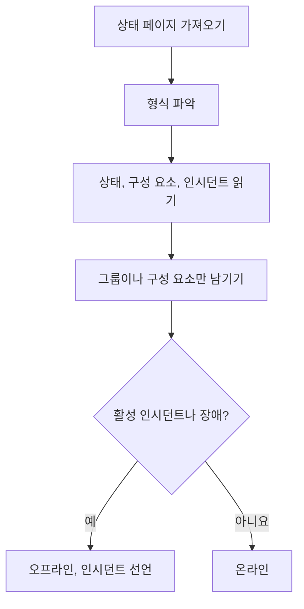

# 외부 상태 페이지 모니터

외부 상태 페이지 모니터는 여러분이 의존하는 서비스(AWS, GCP, Azure, GitHub, OpenAI, Anthropic 등 다수)의 공개 상태 페이지를 지켜보다가, 그 공급자가 장애나 성능 저하를 보고하면 알림을 보냅니다. 업스트림 문제를 공급자가 보고하는 즉시 알고, 여러분 자신의 문제와 구분하는 데 사용하세요.

:::cards
- [모니터 만들기](#외부-상태-페이지-모니터-만들기): 상태 페이지 URL을 붙여 넣고 지켜볼 대상을 고릅니다.
- [범위 좁히기](#구성-옵션): 구성 요소 그룹 하나나 구성 요소 하나를 지켜봅니다.
- [기준](#모니터링-기준): 기본적으로 무엇을 다운으로 보는지 설명합니다.
- [자주 쓰는 상태 페이지](#자주-쓰는-상태-페이지-url): 대부분의 팀이 의존하는 서비스의 URL입니다.
:::

## 작동 방식

검사할 때마다 프로브는 상태 페이지를 가져와 형식을 파악하고, 전체 상태, 구성 요소, 활성 인시던트를 읽습니다. 모니터의 범위를 구성 요소 그룹이나 구성 요소로 좁혔다면 그것만 계산합니다. 그런 다음 기준이 모니터를 온라인으로 볼지 오프라인으로 볼지 결정합니다.

다음 용도로 사용할 수 있습니다.

- 애플리케이션이 의존하는 타사 서비스의 가용성 모니터링
- 업스트림 공급자에 장애가 생기면 알림 받기
- 개별 구성 요소의 상태 추적
- 구성 요소 그룹 하나로 모니터링 범위 좁히기(예: OpenAI의 "APIs"만). 페이지의 다른 곳에서 일어난 무관한 인시던트로 모니터가 발생하지 않습니다
- 사용자에게 영향을 주기 전에 성능 저하 감지
- 여러분의 인시던트와 업스트림 공급자의 문제를 연관 짓기

## 지원되는 공급자

| 공급자 | 설명 |
| ------------------------ | ---------------------------------------------------------------------- |
| **Auto**(기본값) | 상태 페이지 형식을 자동으로 감지합니다 |
| **Atlassian Statuspage** | Atlassian Statuspage 기반 상태 페이지(JSON API) |
| **incident.io** | incident.io 기반 상태 페이지(예: `https://status.openai.com`) |
| **RSS** | RSS 피드를 제공하는 상태 페이지 |
| **Atom** | Atom 피드를 제공하는 상태 페이지 |

### 자동 감지

**Auto** 로 설정하면 OneUptime은 다음 순서로 상태 페이지 형식을 자동으로 감지합니다.

1. 먼저 incident.io 상태 페이지 API(`/proxy/<host>`)를 시도합니다.
2. 다음으로 Atlassian Statuspage JSON API(`/api/v2/status.json`, `/api/v2/components.json`, `/api/v2/incidents/unresolved.json`)를 시도합니다.
3. 둘 다 실패하면 페이지를 RSS나 Atom 피드로 파싱해 봅니다.
4. 마지막 대안으로 기본적인 HTTP 도달 가능성 검사를 수행합니다.

> [!NOTE]
> incident.io를 먼저 검사하는 이유는, 일부 incident.io 상태 페이지(예: `https://status.openai.com`)가 구성 요소 그룹과 활성 인시던트를 빼먹은 제한적인 Atlassian 호환 엔드포인트도 함께 제공하기 때문입니다. incident.io를 먼저 검사하면 그룹 정보가 담긴 더 풍부한 데이터가 사용됩니다.

도달 가능성 검사는 직접 선택한 공급자가 실패할 때의 대안이기도 합니다. 이 검사는 페이지가 응답하는지만 알려 주며(`2xx` 또는 `3xx` 응답이면 온라인), 구성 요소나 인시던트는 보고하지 않습니다.

## 외부 상태 페이지 모니터 만들기

:::steps
### 새 모니터 시작

**모니터** 로 이동해 **모니터 생성** 을 클릭합니다. **모니터 유형** 에서 **더 많은 모니터 유형** 을 클릭하고 **Basic Monitoring** 아래의 **External Status Page** 를 선택하거나, 검색 상자에 `statuspage` 를 입력합니다. **이름** 을 입력한 다음 **다음** 을 클릭합니다.

### 상태 페이지 URL 입력

**상태 페이지 URL** 을 입력합니다. 형식을 알고 있는 경우가 아니면 **공급자** 는 **Auto** 로 둡니다.

### 필요하면 범위 좁히기

**추가 필드** 를 열어 `APIs` 같은 **Component Group Filter (Optional)** 를 입력하고, 구성 요소 하나만 지켜보려면 **구성 요소 이름 필터 (선택 사항)** 를 입력합니다(그룹을 설정했다면 그 그룹 안에서).

### 테스트

**모니터 테스트** 를 클릭해 페이지를 한 번 가져오고, 찾은 공급자, 구성 요소, 인시던트를 확인합니다.

### 기준 검토

기준 단계는 공급자가 범위 안의 활성 인시던트나 장애를 보고하면 모니터를 오프라인으로 표시하는 [기본 기준](#기본-기준)으로 시작합니다. 필요하면 바꾼 뒤 **다음** 을 클릭합니다.

### 프로브 선택 및 생성

**프로브** 와 **모니터링 간격**(처음에는 **5분마다**)을 선택하고 **모니터 생성** 을 클릭합니다.
:::

## 구성 옵션

| 옵션 | 입력할 내용 | 기본값 |
| --- | --- | --- |
| **상태 페이지 URL** | 상태 페이지의 URL. Atlassian Statuspage나 incident.io 기반 사이트는 보통 루트 URL입니다(예: `https://status.example.com`). RSS/Atom 피드는 피드 URL을 직접 입력합니다. | — |
| **공급자** | 형식을 감지하려면 **Auto**, 알고 있다면 **Atlassian Statuspage**, **incident.io**, **RSS**, **Atom** 중 하나. | **Auto** |
| **Component Group Filter (Optional)** | 모니터의 범위를 좁힐 그룹. **추가 필드** 아래에 있습니다. | 모든 그룹 |
| **구성 요소 이름 필터 (선택 사항)** | 지켜볼 구성 요소. **추가 필드** 아래에 있습니다. | 범위 안의 모든 구성 요소 |
| **타임아웃 (ms)** | 상태 페이지를 기다리는 최대 시간. **추가 필드** 아래에 있습니다. | `10000`(10초) |
| **재시도** | 첫 시도가 실패한 뒤 1초 간격으로 다시 시도하는 횟수. `0` 은 한 번만 시도한다는 뜻입니다. **추가 필드** 아래에 있습니다. | `3`(최대 4번 시도) |

### Component Group Filter

상태 페이지가 구성 요소를 그룹으로 나눈다면, 모니터의 범위를 그룹 하나로 좁힐 수 있습니다. 예를 들어 `https://status.openai.com` 에서 `APIs` 를 입력하면 모니터의 범위가 OpenAI의 API 서비스로 좁혀집니다.

구성 요소 그룹을 설정하면 **활성 인시던트 수** 와 **전체 상태** 를 그 그룹의 구성 요소만으로 계산합니다. 무관한 그룹(예: ChatGPT)에 영향을 주는 인시던트는 "APIs" 그룹으로 범위를 좁힌 모니터를 발생시키지 않습니다.

구성 요소 그룹 필터링은 **Atlassian Statuspage** 와 **incident.io** 공급자에서 지원됩니다. RSS와 Atom 피드는 구성 요소 그룹을 제공하지 않습니다.

### 구성 요소 이름 필터

상태 페이지가 여러 구성 요소를 보고한다면, 구성 요소 이름을 지정해 그 구성 요소만 모니터링할 수 있습니다. 필터는 입력한 내용이 이름에 들어 있는 모든 구성 요소와 대소문자 구분 없이 일치합니다. `actions` 는 "Actions"라는 구성 요소와 일치합니다.

구성 요소 그룹도 설정했다면 구성 요소 이름 필터는 그 그룹 **안에서** 적용되므로, 큰 그룹 안의 구성 요소 하나를 겨냥할 수 있습니다. 두 필터 모두 지정하지 않으면 범위 안의 모든 구성 요소를 모니터링합니다. RSS나 Atom 피드에서는 이름 필터를 피드 항목의 제목과 비교합니다.

> [!WARNING]
> 아무것과도 일치하지 않는 필터는 정상처럼 보입니다. 범위 안에 구성 요소가 없으면 장애를 보고할 대상도 없기 때문입니다. 상태 페이지와 철자를 대조하고, **모니터 테스트** 로 필터가 무엇을 남기는지 확인하세요.

## 모니터링 기준

다음을 바탕으로 외부 서비스를 언제 온라인 또는 오프라인으로 볼지 결정하는 기준을 설정할 수 있습니다.

| 필터 유형 | 검사 대상 | 필터 조건 |
| --- | --- | --- |
| **External Status Page Is Online** | 상태 페이지에 도달할 수 있고 상태 데이터를 반환하는지 여부 | 참 또는 거짓 |
| **External Status Page Overall Status** | 페이지가 보고하는 전체 상태 | Equal To, Not Equal To, 포함, Not Contains, Starts With, Ends With |
| **External Status Page Component Status** | 범위 안 구성 요소의 상태(구성 요소 그룹 / 구성 요소 이름 필터 반영): 정상 작동, Under Maintenance, Degraded Performance, Partial Outage, Major Outage, Full Outage | Equal To, Not Equal To, 포함, Not Contains, Starts With, Ends With |
| **External Status Page Active Incidents** | 상태 페이지에 보고된 현재 활성 인시던트 수(필터를 설정하면 구성 요소 그룹 / 구성 요소로 범위가 좁혀집니다) | Equal To, Not Equal To 및 숫자 비교 |
| **External Status Page Response Time (in ms)** | 상태 페이지 데이터를 가져오는 데 걸리는 시간 | Greater Than, Less Than, Greater Than Or Equal To, Less Than Or Equal To |

전체 상태는 페이지에 쓰인 그대로이므로 값은 공급자마다 다릅니다. Atlassian Statuspage는 `All Systems Operational` 같은 자체 설명을, 피드는 `operational` 이나 `degraded_performance` 를, 도달 가능성 검사는 `reachable` 이나 `unreachable` 을 보고합니다. 이 비교는 대소문자를 구분합니다. 장애에 대한 알림에는 보통 **External Status Page Active Incidents** 와 **External Status Page Component Status** 가 더 믿을 만합니다.

RSS나 Atom 피드에서는 최근 24시간의 항목을 활성 인시던트로 셉니다. RSS 항목은 게시 날짜로, Atom 항목은 업데이트 날짜로 판단합니다.

### 기본 기준

OneUptime은 기본적으로 상태 페이지에서 정말 중요한 것, 즉 단순한 도달 가능성이 아니라 활성 인시던트와 구성 요소 상태를 바탕으로 기준을 만듭니다.

| 기준 | 필터 | 효과 |
| --- | --- | --- |
| Offline | 다음 중 **모두**(하나라도 해당): 페이지가 온라인이 아님; 범위 안에 활성 인시던트가 하나 이상 있음; 범위 안의 구성 요소가 Degraded Performance, Partial Outage, Major Outage, Full Outage 중 하나를 보고함 | 모니터를 오프라인으로 표시하고 인시던트를 선언하며, 기준이 더 이상 일치하지 않으면 인시던트가 저절로 해결됩니다 |
| Online | 다음 **전체**: 페이지가 온라인임; 범위 안에 활성 인시던트가 없음 | 모니터를 온라인으로 표시합니다 |

활성 인시던트 수와 구성 요소 상태가 구성 요소 그룹 / 구성 요소 이름 필터를 반영하므로, 이 기본 기준은 자동으로 여러분이 관심 있는 구성 요소만 겨냥합니다.

## 템플릿 변수

외부 상태 페이지 모니터에서 인시던트나 알림을 만들 때 제목, 설명, 해결 메모에 다음 변수를 쓸 수 있습니다([인시던트 및 알림 템플릿](/docs/monitor/incident-alert-templating) 참고).

| 변수 | 설명 |
| ------------------------- | ------------------------------------------------------------------------------- |
| `{{isOnline}}`            | 상태 페이지가 온라인인지 여부(true/false) |
| `{{responseTimeInMs}}`    | 응답 시간(밀리초) |
| `{{failureCause}}`        | 실패 원인(있는 경우) |
| `{{overallStatus}}`       | 전체 상태 표시 값 |
| `{{activeIncidentCount}}` | 활성 인시던트 수(필터가 있으면 그 범위로 좁혀짐) |
| `{{componentStatuses}}`   | 구성 요소 상태의 JSON 배열(`name`, `status`, `description`, `groupName`) |
| `{{provider}}`            | 감지된 공급자(Atlassian Statuspage, incident.io, RSS, Atom). 도달 가능성 검사 후에는 비어 있습니다 |
| `{{componentGroup}}`      | 모니터의 범위를 좁힌 구성 요소 그룹(있는 경우) |
| `{{componentName}}`       | 모니터의 범위를 좁힌 구성 요소(있는 경우) |

## 자주 쓰는 상태 페이지 URL

자주 쓰는 서비스의 상태 페이지 목록입니다. 상당수가 Atlassian Statuspage나 incident.io를 사용하므로 **Auto** 공급자가 자동으로 감지합니다. 둘 다 기반이 아니고 피드도 아닌 페이지는 도달 가능성 검사만 받습니다. 그런 경우 공급자가 RSS나 Atom 피드를 게시한다면 대신 그 피드를 모니터링하세요.

| 서비스 | 상태 페이지 URL |
| ---------------------------- | --------------------------------------------- |
| AWS                          | `https://health.aws.amazon.com/health/status` |
| Google Cloud Platform        | `https://status.cloud.google.com`             |
| Microsoft Azure              | `https://status.azure.com`                    |
| GitHub                       | `https://www.githubstatus.com`                |
| OpenAI                       | `https://status.openai.com`                   |
| Anthropic                    | `https://status.anthropic.com`                |
| Cloudflare                   | `https://www.cloudflarestatus.com`            |
| Datadog                      | `https://status.datadoghq.com`                |
| PagerDuty                    | `https://status.pagerduty.com`                |
| Twilio                       | `https://status.twilio.com`                   |
| Stripe                       | `https://status.stripe.com`                   |
| Slack                        | `https://status.slack.com`                    |
| Atlassian (Jira, Confluence) | `https://status.atlassian.com`                |
| Vercel                       | `https://www.vercel-status.com`               |
| Netlify                      | `https://www.netlifystatus.com`               |
| DigitalOcean                 | `https://status.digitalocean.com`             |
| Heroku                       | `https://status.heroku.com`                   |
| MongoDB Atlas                | `https://status.cloud.mongodb.com`            |
| Fastly                       | `https://status.fastly.com`                   |
| New Relic                    | `https://status.newrelic.com`                 |
| Sentry                       | `https://status.sentry.io`                    |
| CircleCI                     | `https://status.circleci.com`                 |

## 모범 사례

- **Auto 공급자 사용** — 정확한 형식을 알고 있지 않다면, 자동 감지가 대부분의 상태 페이지에서 잘 동작합니다.
- **구성 요소 그룹으로 범위 좁히기** — 공급자의 일부에만 의존한다면(예: OpenAI의 "APIs"만) 무관한 인시던트로 인한 소음을 막을 수 있습니다.
- **특정 구성 요소 모니터링** — 특정 서비스에만 의존할 때 유용합니다.
- **자체 모니터와 함께 사용** — 외부 상태 페이지 모니터를 자체 API 및 웹사이트 모니터와 함께 쓰세요. 둘이 동시에 다운되면 업스트림 상태 페이지가 근본 원인을 더 빨리 알려 줍니다.

## 문제 해결

:::details 모니터는 오프라인인데 인시던트는 제가 쓰지 않는 부분에 관한 것입니다
**Component Group Filter**, **구성 요소 이름 필터**, 또는 둘 다로 모니터의 범위를 좁히세요. 그러면 활성 인시던트 수와 구성 요소 상태가 범위 안의 것만 셉니다.
:::

:::details 장애 중에도 모니터가 오프라인이 되지 않습니다
필터가 아무것과도 일치하지 않아 정상처럼 보이거나, 페이지가 도달 가능성 검사만 받고 있을 수 있습니다. **모니터 테스트** 를 실행하고 찾은 공급자와 구성 요소를 확인하세요.
:::

:::details Auto가 잘못된 형식을 고르거나 구성 요소를 찾지 못합니다
**공급자** 를 그 페이지가 쓰는 것으로 알고 있는 공급자로 설정하세요. RSS나 Atom 피드라면 상태 페이지의 URL이 아니라 피드 자체의 URL을 입력하세요.
:::

:::details 내부 상태 페이지에 도달할 수 없습니다
프로브는 허용되지 않는 한 사설 네트워크 주소를 거부합니다. 네트워크 내부의 프로브에 `PROBE_ALLOW_PRIVATE_NETWORK_MONITORS=true` 를 설정하세요. [프라이빗 네트워크 접근](/docs/self-hosted/private-network-access)을 참고하세요.
:::

## 다음 단계

:::cards
- [인시던트 및 알림 템플릿](/docs/monitor/incident-alert-templating): 공급자의 상태를 인시던트 제목에 넣습니다.
- [API 모니터](/docs/monitor/api-monitor): 공급자의 상태와 함께 자체 엔드포인트를 검사합니다.
- [모니터 만들기](/docs/monitor/create-monitor): 모든 모니터 유형에 공통인 단계입니다.
:::
