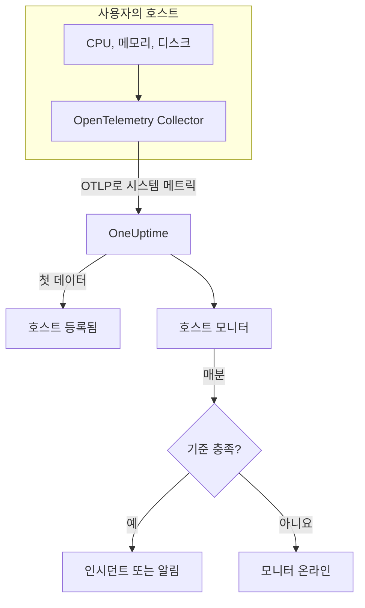

# 호스트 모니터

호스트 모니터는 머신 한 대(CPU, 메모리, 디스크, 부하, 프로세스)를 감시하고, 포화되거나 가득 차 갈 때 알려 줍니다. OpenTelemetry Collector가 호스트에서 보내는 OpenTelemetry 메트릭 `system.*`을 읽습니다. 이는 **호스트** 제품이 보여 주는 것과 같은 데이터이므로 외부에서 아무것도 탐색하지 않습니다.

:::cards
- [모니터 만들기](#호스트-모니터-만들기): 대시보드에서 6단계.
- [템플릿](#미리-만들어진-알림-템플릿): CPU, 메모리, 디스크, 부하, 프로세스용 5개의 미리 만들어진 알림.
- [메트릭](#수집되는-메트릭): 알림에 쓸 수 있는 호스트 메트릭과 그 단위.
- [호스트 또는 Server / VM?](#호스트-모니터-또는-server-vm-모니터): 두 머신 모니터 중 무엇을 쓸지.
:::

## 작동 방식

호스트에서 `hostmetrics` 수신기를 쓰는 OpenTelemetry Collector가 실행됩니다. 30초마다 호스트의 CPU, 메모리, 디스크, 네트워크, 부하, 프로세스 수치를 읽어 OTLP로 OneUptime에 보냅니다. 호스트에서 온 첫 데이터가 그 호스트를 **호스트** 에 등록합니다.

호스트 모니터는 호스트 한 대에 연결됩니다. 매분 그 호스트의 메트릭에 쿼리를 실행하고 결과를 기준과 비교합니다.

### 호스트 모니터 또는 Server / VM 모니터?

OneUptime에는 머신용 모니터가 두 가지 있습니다. 같은 호스트에서 둘 다 실행할 수 있습니다.

| | 호스트 모니터 | Server / VM 모니터 |
| --- | --- | --- |
| **에이전트** | `hostmetrics` 수신기를 쓰는 OpenTelemetry Collector | OneUptime 인프라 에이전트 |
| **데이터** | OpenTelemetry 메트릭 `system.*`와 `process.*`. **호스트** 페이지들이 차트로 보여 주는 것과 같음 | 에이전트가 모니터로 보내는 상태 보고서 |
| **기준** | 모든 메트릭 쿼리나 수식에 대한 임계값 또는 이상 탐지 | CPU, 메모리, 디스크 사용률 같은 기본 제공 확인 |
| **설정** | 수집기를 설치하면 호스트가 스스로 등록됨 | 모니터를 만든 다음 그 비밀 키를 에이전트에 전달 |

호스트가 이미 OpenTelemetry 데이터를 보내고 있거나, 같은 수집기에서 로그와 더 풍부한 메트릭을 받고 싶다면 호스트 모니터를 쓰세요. 다른 하나는 [서버 / VM 모니터](/docs/monitor/server-monitor)를 참고하세요.

## 시작하기 전에

- **호스트에서 OpenTelemetry Collector를 실행하세요**. `hostmetrics` 수신기를 씁니다. [호스트 OpenTelemetry 수집기](/docs/telemetry/host-otel-collector)에서 Linux, macOS, Windows를 다루며, **제품 → 인프라 → 호스트 → 문서** 에 바로 쓸 수 있는 구성이 있습니다.
- **사용률 메트릭을 켜세요.** `system.cpu.utilization`, `system.memory.utilization`, `system.filesystem.utilization`은 수신기에서 선택 사항이지만 CPU, 메모리, 파일 시스템 템플릿에 필요합니다. 대시보드의 구성은 이것들을 켭니다.
- **호스트가 등록되었는지 확인하세요.** 첫 데이터가 도착하면 `host.name` 이름으로 **제품 → 인프라 → 호스트 → 모든 호스트** 에 나타납니다.

## 호스트 모니터 만들기

:::steps
### 새 모니터 시작

**모니터** 로 이동해 **모니터 생성** 을 클릭합니다.

### 호스트 유형 선택

**모니터 유형** 에서 **더 많은 모니터 유형** 을 클릭하고 **인프라** 아래의 **호스트** 를 고릅니다. **이름** 을 입력하고(인시던트와 알림 제목에 쓰입니다) **다음** 을 클릭합니다.

### 대상 호스트 선택

**Host Monitor Configuration** 에서 **호스트** 의 머신을 고릅니다. 데이터를 보낸 모든 호스트가 목록에 있습니다.

### 감시할 대상 선택

세 탭 중 하나를 고릅니다.

- **Quick Setup** – [템플릿](#미리-만들어진-알림-템플릿)을 클릭합니다. 메트릭, 집계, 시간 범위, 임계값을 설정하고 아래 기준을 템플릿의 기준으로 바꿉니다. **시간 범위** 는 계속 바꿀 수 있습니다.
- **Custom Metric** – **Host Metric** 에서 메트릭 하나를 고른 다음 **집계** 와 **시간 범위** 를 설정합니다.
- **고급** – **메트릭 선택** 에서 쿼리와 수식을 직접 만듭니다. 예를 들어 `state` 필터나 `mountpoint` 그룹화입니다.

### 기준 확인

**모니터 기준** 의 각 기준을 열어 **메트릭**, **집계**, **조건**, **Threshold** 를 확인합니다. 템플릿은 이것들을 채웁니다. **Custom Metric** 이나 **고급** 을 쓰면 모니터는 메트릭이 0으로 떨어지는 것만 감지하는 [기본 기준](#기본-기준)으로 시작하므로, 직접 임계값을 설정하세요.

### 모니터 만들기

**모니터 생성** 을 클릭합니다. OneUptime이 모니터 페이지를 열고 매분 평가합니다. 모니터가 연 인시던트와 알림은 호스트의 **인시던트** 및 **알림** 페이지에도 표시됩니다.
:::

> [!TIP]
> 여러 템플릿을 한 번에 설정하려면 **제품 → 인프라 → 호스트** 에서 호스트를 열고 **Recommendations** 로 이동하세요. 원하는 템플릿과 호출할 사람을 고르면 OneUptime이 템플릿마다 모니터를 하나씩 만듭니다.

## 모니터 설정

| 필드 | 탭 | 하는 일 |
| --- | --- | --- |
| **호스트** | 모두 | 필수. 모든 쿼리를 호스트의 `resource.host.name`으로 한정합니다. |
| **Host Metric** | Custom Metric | [카탈로그](#수집되는-메트릭)의 메트릭 하나. CPU, 메모리, 디스크, 네트워크, 부하, 프로세스로 묶여 있습니다. |
| **집계** | Custom Metric | 샘플을 합치는 방식: **평균**, **최대**, **최소**, **합계**, **개수**. 메트릭의 일반적인 집계에서 시작합니다. |
| **시간 범위** | 모두 | 쿼리가 읽는 이동 기간으로, **Past 1 Minute** 부터 **Past 365 Days** 까지입니다. 새 모니터는 **Past 1 Minute** 에서 시작하고, 템플릿은 자체 값을 설정합니다. |
| **메트릭 선택** | 고급 | 쿼리 빌더: **메트릭**, **Aggregate by**, **Filter by attributes**, **Group by**, 그리고 쿼리를 결합하는 **메트릭 추가** 와 **수식 추가**. |

## 미리 만들어진 알림 템플릿

**Quick Setup** 에는 템플릿이 5개 있습니다. 각각 완전한 모니터를 만듭니다. 쿼리, 작동하는 기준, 회복하는 기준입니다. 임계값은 출발점이므로 편집할 수 있습니다.

기준은 기간의 매분 조건이 유지될 때만 작동하고 임계값에서 10% 지난 지점에서 회복하므로, 경계 근처를 오가는 값 때문에 깜빡이지 않습니다.

| 템플릿 | 심각도 | 감시 대상 | 작동 조건 | 회복 조건 |
| --- | --- | --- | --- | --- |
| High CPU Utilization | Warning | `user`와 `system` 상태의 `system.cpu.utilization`을 더해 퍼센트로 표시, 최근 5분 | 80% 초과 | 72% 이하 |
| High Memory Utilization | Warning | `used` 상태의 `system.memory.utilization`, 퍼센트, 최근 5분 | 85% 초과 | 76.5% 이하 |
| High Filesystem Usage | 심각 | `system.filesystem.utilization`, `mountpoint`와 `device`별 Max, 퍼센트, 최근 5분 | 90% 초과 | 81% 이하 |
| High Load Average (1m) | Warning | `system.cpu.load_average.1m`, Avg, 최근 5분 | 4 초과 | 3.6 이하 |
| High Process Count | Warning | `system.processes.count`, Max, 최근 5분 | 2000 초과 | 1800 이하 |

**심각도** 는 선택 목록에 표시되는 레이블입니다. 템플릿이 만드는 인시던트와 알림은 프로젝트에서 가장 심각한 인시던트 및 알림 심각도로 시작하니, 기준에서 바꾸세요.

- **CPU** 는 사용 중인 시간(`user`와 `system`의 합)으로, 호스트의 **개요** 가 차트로 보여 주는 것과 같은 수치입니다. iowait와 steal은 빠집니다.
- **메모리** 는 버퍼와 페이지 캐시를 제외하므로, 대부분 캐시로 찬 호스트에서는 작동하지 않습니다.
- **파일 시스템** 은 마운트마다 인시던트 하나를 엽니다. snap의 `squashfs` 마운트나 macOS의 `devfs` 같은 읽기 전용 가상 파일 시스템은 항상 100% 차 있으므로, 수집기의 `filesystem` 스크레이퍼에서 제외하세요.
- **부하 평균** 은 코어 수로 나누지 않은 실행 대기열 길이 그대로입니다. 4는 코어 2개 호스트에서는 포화이고 코어 32개 호스트에서는 평범한 수준이므로, 큰 호스트에서는 올리세요.
- **프로세스 수** 는 호스트 전체가 아니라 가장 큰 단일 프로세스 상태(`running`, `sleeping`, …)를 비교하므로, 프로세스 목록과 맞지 않습니다. 프로세스 스크레이퍼는 Linux에서만 보고합니다.

## 수집되는 메트릭

**Host Metric** 목록은 다음 메트릭을 제공합니다. 각각 `resource.host.name`을 가지며, 모니터는 이것으로 쿼리를 호스트 한 대로 한정합니다.

> [!IMPORTANT]
> 사용률 메트릭은 퍼센트가 아니라 0부터 1까지의 비율입니다. 원시 메트릭에 대한 임계값에서 80%는 `0.8`로 쓰세요. 템플릿은 수식으로 퍼센트로 바꾸므로 임계값이 80, 85, 90입니다.

### CPU

| 메트릭 | 단위 | 설명 |
| --- | --- | --- |
| `system.cpu.utilization` | 비율 | 각 `state`(`user`, `system`, `idle`, …)에 쓴 CPU 시간의 비율. `state`로 필터링하세요. 모든 상태의 평균은 쓸모 있는 임계값에 결코 닿지 않습니다. |
| `process.cpu.utilization` | 비율 | 호스트에 있는 각 프로세스의 CPU 사용률. |

### 메모리

| 메트릭 | 단위 | 설명 |
| --- | --- | --- |
| `system.memory.utilization` | 비율 | 각 `state`(`used`, `free`, `cached`, …)에 있는 물리 메모리의 비율. 사용 중인 메모리는 `state = used`로 필터링합니다. |
| `system.memory.usage` | 바이트 | 메모리 사용량(바이트). |

### 디스크

| 메트릭 | 단위 | 설명 |
| --- | --- | --- |
| `system.filesystem.utilization` | 비율 | 각 파일 시스템 용량 중 사용 중인 비율. `mountpoint`와 `device`별. |
| `system.filesystem.usage` | 바이트 | 파일 시스템 사용량(바이트). |

### 네트워크

| 메트릭 | 단위 | 설명 |
| --- | --- | --- |
| `system.network.io` | 바이트 | 받고 보낸 바이트. 수명 전체 카운터. |

### 부하

| 메트릭 | 단위 | 설명 |
| --- | --- | --- |
| `system.cpu.load_average.1m` | 개수 | 최근 1분의 부하 평균. |
| `system.cpu.load_average.5m` | 개수 | 최근 5분의 부하 평균. |
| `system.cpu.load_average.15m` | 개수 | 최근 15분의 부하 평균. |

### 프로세스

| 메트릭 | 단위 | 설명 |
| --- | --- | --- |
| `system.processes.count` | 개수 | 호스트의 프로세스. 프로세스 `status`마다 계열 하나. |

**고급** 의 쿼리 빌더는 이것들만이 아니라 호스트가 보내는 모든 메트릭을 보여 줍니다.

## 모니터링 기준

기준은 모니터의 쿼리나 수식 하나를 임계값과 비교합니다. 호스트 모니터의 기준에는 **필터 유형** 이 없으며, 모든 규칙이 다음 필드로 메트릭 값을 확인합니다.

| 필드 | 하는 일 |
| --- | --- |
| **메트릭** | 확인할 쿼리나 수식(변수 이름으로 지정). |
| **집계** | 기간 안의 값을 하나의 답으로 만드는 방식: **평균**, **합계**, **Maximum Value**, **Minimum Value**, **All Values**(모든 값이 일치해야 함), **Any Value**(하나면 충분). |
| **조건** | **Greater Than**, **Less Than**, **Greater Than Or Equal To**, **Less Than Or Equal To**, **Equal To**, 또는 이상 조건 **Anomalously High**, **Anomalously Low**, **Anomalous**. |
| **Threshold** | 비교할 값. 메트릭에 단위가 있으면 옆에 단위 목록이 있습니다. 이상 조건에서는 표시되지 않습니다. |
| **민감도** | 이상 조건 전용. **낮음**(4σ), **중간**(3σ, 기본값), **높음**(2σ). |
| **기준선 기간** | 이상 조건 전용. 기록 14일(기본값), 28일, 60일, 90일. |
| **데이터가 없는 경우** | **추가 필드** 아래에 있습니다. 기간에 샘플이 없을 때의 동작: **Ignore**(기본값), **Treat As Zero**, **트리거**. |

이상 조건은 각 값을 기준선의 같은 요일·같은 시간대와 비교합니다. 기준선 기간에 기록이 충분히 쌓일 때까지 "Learning" 상태로 남으며 아무것도 만들지 않습니다.

각 기준은 일치했을 때 할 일도 정합니다. 모니터 상태 변경, 알림 생성, 인시던트 선언입니다. 기준은 위에서 아래로 확인되며, 처음 일치한 기준이 결정합니다.

### 기본 기준

템플릿으로 만들지 않은 모니터는 두 개의 기준으로 시작합니다.

| 순서 | 기준 | 일치하는 경우 | 결과 |
| --- | --- | --- | --- |
| 1 | Check if _monitor name_ is offline | 첫 번째 쿼리의 값 중 하나가 `0` | 모니터를 **오프라인** 으로 표시하고 인시던트 "_monitor name_ is offline"을 선언합니다. 모니터가 회복하면 스스로 해결됩니다. |
| 2 | Check if _monitor name_ is online | 값 중 하나가 `0`보다 큼 | 모니터를 **정상 작동** 으로 표시합니다. |

> [!IMPORTANT]
> 무응답은 어느 기준과도 일치하지 않습니다. 데이터를 보내지 않게 된 호스트는 모니터를 원래 상태 그대로 둡니다. 호스트가 조용해질 때 알림을 받으려면 기준에서 **데이터가 없는 경우** 를 **트리거** 로 설정하세요. OneUptime 자체가 데이터를 받지 못한 시간은 절대 데이터 없음으로 취급되지 않습니다. 그런 시간이 포함된 기간의 확인은 대신 기다리며, 자세한 내용은 [OneUptime이 데이터를 받지 못할 때](/docs/monitor/when-oneuptime-is-not-receiving)에서 설명합니다.

## 문제 해결

:::details 호스트가 호스트 목록에 없음
호스트는 수집기의 데이터에서 스스로 등록되며, 여기에는 `host.name`과 호스트의 OS 유형이 필요합니다. 둘 다 수집기의 `resourcedetection` 프로세서에서 옵니다. 수집기가 실행 중인지, 호스트가 **제품 → 인프라 → 호스트 → 모든 호스트** 에 있는지 확인하세요. 구성은 [호스트 OpenTelemetry 수집기](/docs/telemetry/host-otel-collector)에서 다룹니다.
:::

:::details CPU나 메모리 임계값이 작동하지 않음
사용률 메트릭은 최대 `1.0`인 비율이므로, 직접 입력한 임계값 `80`은 절대 넘지 않습니다. `0.8`을 쓰거나 퍼센트로 바꿔 주는 템플릿에서 시작하세요. 또한 `state`로 필터링하세요. CPU는 `user`와 `system`, 메모리는 `used`입니다. 모든 상태의 평균은 1을 상태 수로 나눈 값 근처에 머뭅니다.
:::

:::details 다른 호스트에서 인시던트가 작동함
모니터는 고른 호스트와 같은 `resource.host.name`으로 모든 쿼리를 한정합니다. 같은 `host.name`을 보고하는 호스트들은 하나의 계열로 합쳐지므로, 호스트마다 고유한 이름을 붙이세요.
:::

:::details 항상 가득 찬 마운트에서 High Filesystem Usage가 작동함
`/snap` 아래의 snap `squashfs` 루프 마운트나 macOS의 `devfs` 같은 읽기 전용 가상 파일 시스템은 설계상 100% 차 있고 회복하지 않습니다. 수집기의 `filesystem` 스크레이퍼에서 제외하세요.
:::

## 다음 단계

:::cards
- [호스트 OpenTelemetry 수집기](/docs/telemetry/host-otel-collector): 이 모니터가 읽는 수집기를 설치하고 구성합니다.
- [서버 / VM 모니터](/docs/monitor/server-monitor): 에이전트가 데이터를 보내는 머신용 모니터.
- [메트릭 모니터](/docs/monitor/metrics-monitor): 호스트와 서비스 전반에서 모든 메트릭으로 알림을 보냅니다.
- [인시던트 개요](/docs/incidents/index): 기준이 인시던트를 선언한 뒤 일어나는 일.
:::
