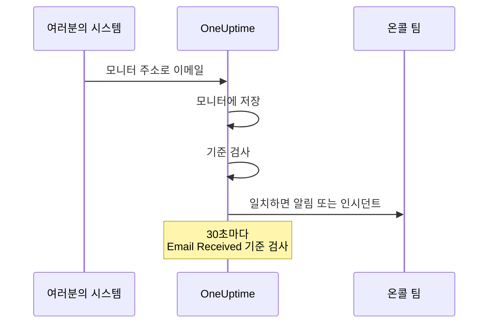

# 수신 이메일 모니터

수신 이메일 모니터는 모니터 하나에 속한 이메일 주소를 제공합니다. 이메일을 보낼 수 있는 것이라면 무엇이든(백업 작업, 레거시 시스템, 클라우드 공급자의 알림 등) 결과를 그 주소로 보내고, OneUptime은 모든 이메일을 기준에 따라 검사해 모니터를 다운으로 표시하거나, 인시던트를 열거나, 알림을 만들고, 정상화 소식이 오면 이를 해결합니다.

:::cards
- [모니터 만들기](#수신-이메일-모니터-만들기): 주소를 받고 발신자가 그 주소로 보내게 합니다.
- [주소 확인](#발신자에서-주소-확인): 발신자가 보낸 확인 이메일을 모니터에서 읽습니다.
- [기준 작성](#사용할-수-있는-필터-유형): 제목, 발신자, 본문으로 일치시키거나, 이메일이 끊기면 알림을 받습니다.
- [알림에 이메일 사용](#템플릿-변수): 제목과 본문을 알림 제목과 설명에 넣습니다.
:::

## 작동 방식

이메일은 푸시 방식입니다. 여러분의 시스템이 보내고 OneUptime이 듣습니다. 각 이메일은 도착하는 즉시 모니터의 기준에 따라 검사됩니다. 도착했어야 *하는* 이메일을 살피는 기준은 이와 별도로 일정에 따라 30초마다 검사됩니다.



1. 수신 이메일 모니터를 만들면 OneUptime이 고유한 이메일 주소를 부여합니다.
2. 그 주소로 보낸 모든 이메일은 모니터에 저장되고 위에서부터 기준에 따라 평가되며, 처음 일치한 기준이 결정합니다.
3. 일치한 기준은 모니터 상태를 바꾸고, 알림을 만들고, 인시던트를 선언할 수 있습니다. **인시던트 자동 해결** 이 켜진 인시던트나 **경고 자동 해결** 이 켜진 알림은 나중에 다른 기준(예: 모니터를 온라인으로 표시하는 기준)이 일치하면 해결됩니다.

## 수신 이메일 모니터 만들기

:::steps
### 새 모니터 시작

**모니터** 로 이동해 **모니터 생성** 을 클릭합니다.

### Incoming Email 선택

**모니터 유형** 에서 **더 많은 모니터 유형** 을 클릭하고 **Inbound Monitoring** 아래의 **Incoming Email** 을 선택하거나, 검색 상자에 `email` 을 입력합니다. **이름** 을 입력한 다음 **다음** 을 클릭합니다.

### 기준 검토

**기준** 단계는 이메일에 `error` 가 언급되면 모니터를 오프라인으로 표시하는 [기본 기준](#기본으로-제공되는-것)으로 시작합니다. 기준을 클릭해 바꾸거나 **기준 추가** 를 클릭해 하나를 추가합니다. 일반적인 설정은 [구성 예시](#구성-예시)를 참고하세요.

### 모니터 생성

**모니터 생성** 을 클릭합니다. 모니터가 **개요** 페이지로 열리며, 첫 이메일이 도착할 때까지 **Incoming Email Address** 카드에 복사 버튼과 함께 주소가 표시됩니다.

### 주소로 이메일 보내기

시스템이 알림을 그 주소로 보내도록 설정합니다. 발신자가 먼저 주소를 확인하라고 요구하면 [발신자에서 주소 확인](#발신자에서-주소-확인)을 참고하세요.
:::

> [!NOTE]
> 주소에는 모니터의 비밀 키가 들어 있으므로 모니터를 편집할 수 있는 사람만 볼 수 있습니다. 그 밖의 사람에게는 설정 정보가 숨겨져 있다고 표시됩니다.

## 이메일 주소 형식

각 수신 이메일 모니터는 다음 형식의 고유 주소를 받습니다.

```text
monitor-{secret-key}@{inbound-domain}
```

비밀 키는 UUID입니다. 예: `monitor-3f2b8c1e-5d4a-4f6b-9a7c-2e1d0b9f8a6c@inbound.yourdomain.com`. 첫 이메일이 도착한 뒤에도 주소는 모니터의 **개요** 페이지의 **Inbound email address** 카드에, 마지막 이메일이 도착한 시각 옆에 계속 표시됩니다. 모니터의 **문서** 페이지에도 표시됩니다.

## 이메일 주소 재설정 또는 사용자 지정

모니터의 **설정** 탭으로 이동합니다. **Incoming Email Address** 카드에 현재 주소가 표시되며, 이를 바꾸는 두 가지 방법이 있습니다.

| 작업 | 하는 일 | 사용할 때 |
| --- | --- | --- |
| **Reset Address** | 모니터에 무작위로 생성한 새 주소 `monitor-{secret-key}@{inbound-domain}` 을 부여합니다. 모니터에 사용자 지정 주소가 있으면 재설정 시 삭제됩니다. 먼저 확인을 요청합니다. | 주소가 유출되었거나, 그 주소로 보내는 것을 모두 끊고 싶을 때. |
| **Customize Address** | @ 앞부분을 고를 수 있습니다. 예: `nightly-backups@{inbound-domain}`. **Address name** 에 입력하고(이름을 입력해도 되고 주소 전체를 붙여 넣어도 됩니다) **Save Address** 를 클릭합니다. | 사람들이 알아볼 수 있는 주소를 원할 때. |

두 작업 모두 마지막에 복사 버튼과 함께 새 주소를 보여 줍니다.

> [!WARNING]
> **이전 주소는 즉시 작동을 멈춥니다**. 그 주소로 보낸 이메일은 무시되므로, 이 모니터로 이메일을 보내는 모든 시스템을 업데이트하세요.

사용자 지정 주소 규칙:

- 3~64자: 소문자, 숫자, 점(`.`), 하이픈(`-`), 밑줄(`_`)을 쓸 수 있으며, 점 두 개를 연달아 쓸 수 없습니다. 문자나 숫자로 시작하고 끝나야 합니다. 대문자로 입력하면 자동으로 소문자로 바뀝니다.
- 도메인은 항상 서버의 수신 이메일 도메인입니다.
- 이름은 다른 모니터가 이미 사용하고 있으면 안 됩니다. 서버의 모든 프로젝트가 수신 도메인을 공유하므로, 이름은 그 전체에서 고유해야 합니다.
- `monitor-{id}` 와 `workflow-{id}` 형식의 이름은 생성된 주소용으로 예약되어 있습니다. 도메인 자체에 속한 메일함 이름도 예약되어 있습니다: `abuse`, `admin`, `administrator`, `hostmaster`, `mailer-daemon`, `noc`, `postmaster`, `root`, `security`, `webmaster`.

사용자 지정 주소도 생성된 주소와 마찬가지로 자격 증명입니다. 그 주소를 아는 사람은 누구나 이 모니터가 평가하는 이메일을 보낼 수 있습니다. 생성된 주소는 사실상 추측할 수 없지만, 짧고 뻔한 이름은 추측할 수 있습니다. 이것이 중요하다면 추측하기 어려운 이름을 고르세요.

API 사용자는 기존 모니터에서 Monitor API로 같은 일을 할 수 있습니다. 사용자 지정 주소를 쓰려면 `incomingEmailCustomLocalPart` 를 이름으로 설정하고, 생성된 주소로 돌아가려면 `null` 로 설정합니다. 재설정은 같은 업데이트에서 새 `incomingEmailSecretKey` 를 쓰고 `incomingEmailCustomLocalPart` 를 `null` 로 설정하는 것입니다.

## 발신자에서 주소 확인

어떤 서비스는 누군가 그 주소에서 메일을 읽을 수 있다고 증명하기 전까지 새 주소로 알림을 보내지 않습니다. 먼저 확인 이메일을 보내며, 이 이메일은 다른 이메일처럼 모니터에 도착합니다. 읽는 방법은 다음과 같습니다.

:::steps
### 서비스에 주소 추가

서비스에 모니터의 주소를 추가하고 저장합니다. 서비스가 확인 이메일을 보냅니다.

### 최신 이메일 열기

OneUptime에서 모니터를 엽니다. **개요** 페이지의 **모니터 요약** 카드에 최신 이메일이 표시됩니다. **보낸 사람** 과 **제목** 이 확인 이메일의 것인지 확인한 다음 **자세히 보기** 를 클릭합니다.

### 코드나 링크 복사

코드나 링크는 **이메일 본문 (텍스트)** 항목에 있습니다. **이메일 본문 (HTML)** 항목은 HTML 소스를 보여 주므로, 거기서 링크를 복사한다면 링크 안의 `&amp;` 를 모두 `&` 로 바꾸세요.

### 확인 완료

이메일의 안내대로 확인을 완료합니다.
:::

그 뒤에 다른 이메일이 도착했다면 카드에 더 이상 확인 이메일이 표시되지 않습니다. **모니터링 로그** 를 열어 **이메일** 열에서 제목으로 확인 이메일을 찾고, 그 행의 **요약 보기** 를 클릭하세요.

> [!IMPORTANT]
> **기준도 이 이메일을 봅니다.** 확인 이메일도 다른 이메일처럼 평가됩니다. "if you received this in error" 같은 문구는 기본 기준 `error` 와 일치해 모니터를 오프라인으로 표시합니다. 이를 피하려면 확인하는 동안 모니터 **설정** 페이지의 **모니터링** 카드에서 **이 모니터 확인** 을 끄세요(확인을 요청합니다). 모니터링이 꺼진 모니터도 이메일은 기록하며, **모니터 요약** 카드에도 계속 표시됩니다. 하지만 아무것도 평가하지 않으므로 그 이메일은 **모니터링 로그** 에 행이 생기지 않습니다. 다른 이메일이 도착하기 전에 읽으세요. 다 끝나면 모니터 페이지 상단 배너의 **모니터링 켜기** 를 누르거나 스위치를 다시 켜세요.

**확인은 주소에 묶여 있습니다.** [주소를 재설정하거나 사용자 지정하면](#이메일-주소-재설정-또는-사용자-지정) 서비스는 새 수신자로 보므로 다시 확인해야 합니다.

### Azure Monitor 작업 그룹

2026년 7월부터 Azure는 작업 그룹의 모든 새 **Email** 수신자를 일회용 암호로 확인하도록 하는 요구 사항을 단계적으로 도입하고 있습니다. 확인되기 전까지 작업 그룹은 그 주소로 알림도 테스트 알림도 보내지 않습니다.

:::steps
1. 모니터 주소로 된 **Email** 알림을 작업 그룹에 추가하고 작업 그룹을 저장합니다. Azure는 `azure-noreply@microsoft.com` 같은 Microsoft 주소에서 확인 이메일을 보냅니다.
2. 위에서 설명한 대로 모니터에서 이메일을 읽고, 작업 그룹을 저장한 뒤 30분 안에 안내를 따르세요. 암호가 만료되면 작업 그룹을 열고 **Resend** 를 선택합니다.
3. 작업 그룹을 열고 **Test** 를 선택해 테스트 알림을 보냅니다. 이 알림은 실제 알림처럼 모니터에 도착하므로, 기준이 Azure의 이메일과 일치하는지도 알 수 있습니다.
:::

확인은 같은 Azure 테넌트의 모든 작업 그룹에 적용되므로, 각 주소는 한 번만 확인하면 됩니다.

### Amazon SNS

SNS 토픽에 대한 이메일 구독은 확인되기 전까지 아무것도 받지 않습니다. 구독을 만들면 Amazon SNS가 주소로 확인 이메일을 보냅니다. 위에서 설명한 대로 모니터에서 읽고, 그 안의 **Confirm subscription** 링크를 브라우저에서 여세요. SNS는 48시간 안에 확인되지 않은 구독을 삭제합니다. 그렇게 되면 구독을 다시 만드세요.

## 기본으로 제공되는 것

새 수신 이메일 모니터는 이메일 본문을 읽는 두 가지 기준으로 만들어집니다.

| 기준 | 필터 유형 | 필터 조건 | 값 | 효과 |
| -------- | ----------- | ---------------- | ------- | -------------------------------------------- |
| Offline  | Email Body  | 포함 | `error` | 모니터를 오프라인으로 표시하고 인시던트를 엽니다 |
| Online   | Email Body  | Not Contains | `error` | 모니터를 온라인으로 표시합니다 |

이는 작업이나 타사 도구가 자기 결과를 이메일로 보내는 일반적인 경우에 맞습니다. 본문에 `error` 가 언급된 메시지는 모니터를 다운시키고, 그 단어가 없는 다음 메시지는 모니터를 되살리고 인시던트를 해결합니다. 본문 비교는 대소문자를 구분하지 않으므로 `Error` 와 `ERROR` 도 일치합니다.

값을 발신자가 실제로 쓰는 내용(`FAILED`, `exit code 1` 등)으로 바꾸세요.

> [!NOTE]
> 이 기본값은 데드맨 스위치가 **아닙니다**. 이메일이 더 이상 오지 않아도 여기서는 아무것도 발생하지 않습니다. 제목, 발신자, 본문, 수신자만 읽는 기준은 이메일이 도착할 때만 평가되고 그 밖에는 평가되지 않습니다. 침묵에 대해 알림을 받으려면 **Email Received** / **Not Recieved In Minutes** 기준을 추가하세요. [예시 3](#예시-3-하트비트-모니터이메일-없음-알림)을 참고하세요.

## 사용할 수 있는 필터 유형

다음 이메일 필드를 바탕으로 기준을 만들 수 있습니다.

| 필터 유형 | 설명 |
| ------------------------- | ----------------------------------------------------------------------------------- |
| **이메일 제목** | 수신 이메일의 제목 줄 |
| **Email From Address** | 발신자의 이메일 주소: 표시 이름 없이 소문자로 된 주소만 |
| **Email Body** | 이메일 본문의 일반 텍스트 부분 |
| **Email To Address** | 수신자의 이메일 주소 |
| **Email Received** | 이메일 수신 시각에 대한 시간 기반 기준 |
| **JavaScript Expression** | 참으로 평가되어야 하는 사용자 지정 JavaScript 표현식 |

기준이 이메일을 읽기 전에 모니터 자신의 주소는 가려지므로, **Email To Address**, **이메일 제목**, **Email Body** 에서는 `[REDACTED]` 로 읽힙니다.

## 필터 조건

### 문자열 필터(제목, 발신자, 본문, 수신자)

| 필터 조건 | 설명 | 예시 |
| ---------------- | ----------------------------------------- | ---------------------------------- |
| **포함** | 필드에 지정한 텍스트가 들어 있음 | 제목에 "CRITICAL"이 들어 있음 |
| **Not Contains** | 필드에 지정한 텍스트가 들어 있지 않음 | 제목에 "TEST"가 들어 있지 않음 |
| **Equal To** | 필드가 지정한 텍스트와 정확히 일치함 | 발신자가 "alerts@service.com"과 같음 |
| **Not Equal To** | 필드가 지정한 텍스트와 일치하지 않음 | 제목이 "OK"와 같지 않음 |
| **Starts With** | 필드가 지정한 텍스트로 시작함 | 제목이 "[ALERT]"로 시작함 |
| **Ends With** | 필드가 지정한 텍스트로 끝남 | 제목이 "- Production"으로 끝남 |
| **Is Empty** | 필드가 비어 있음 | 본문이 비어 있음 |
| **Is Not Empty** | 필드에 내용이 있음 | 제목이 비어 있지 않음 |

이 비교는 모두 대소문자를 구분하지 않습니다. 값이 빈 필터는 절대 일치하지 않습니다.

### 시간 기반 필터(Email Received)

대시보드에는 이 조건들이 "Recieved"로 표기됩니다.

| 필터 조건 | 설명 | 예시 |
| --------------------------- | ----------------------------------- | -------------------------------- |
| **Recieved In Minutes** | X분 안에 이메일을 받음 | 30분 안에 이메일 수신 |
| **Not Recieved In Minutes** | X분 동안 이메일을 받지 못함 | 60분 동안 이메일 없음 |

이메일을 한 번도 받지 않은 모니터는 생성 시각을 마지막 이메일로 셉니다.

### JavaScript Expression

| 필터 조건 | 설명 |
| --------------------- | ------------------------------------- |
| **Evaluates To True** | 표현식이 참으로 간주되는 값을 반환함 |

표현식은 이메일 필드가 전혀 바인딩되지 않은 샌드박스에서 실행되므로, 검사를 일으킨 메시지의 제목, 발신자, 본문, 수신자를 읽을 수 없습니다. 이메일 내용으로 일치시키려면 **이메일 제목**, **Email From Address**, **Email Body**, **Email To Address** 필터 유형을 사용하세요.

## 구성 예시

각 예시는 기준 한 쌍입니다. 기준에는 필터, **일치 조건**(필터가 모두 일치해야 하는 **전체** 또는 하나만 일치해도 되는 **모두**), 작업(모니터 상태 변경, 알림 생성, 인시던트 선언)이 있습니다. 알림이나 인시던트의 **추가 필드** 에서 **경고 자동 해결**(또는 **인시던트 자동 해결**)을 켜면, 두 번째 기준이 첫 번째 기준이 연 것을 해결합니다.

### 예시 1: 중요한 이메일에 알림 생성

| 기준 | 필터 | 일치 조건 | 작업 |
| --- | --- | --- | --- |
| 중요한 이메일 | **이메일 제목** 포함 `CRITICAL`; **이메일 제목** 포함 `ALERT`; **이메일 제목** 포함 `ERROR` | **모두** | 상태를 오프라인으로 변경; 알림 생성 |
| 복구 이메일 | **이메일 제목** 포함 `RESOLVED`; **이메일 제목** 포함 `RECOVERED` | **모두** | 상태를 온라인으로 변경 |

중요한 기준을 맨 앞에 두세요. 기준은 위에서부터 검사되고 처음 일치한 기준이 결정합니다.

### 예시 2: 특정 발신자 모니터링

| 기준 | 필터 | 일치 조건 | 작업 |
| --- | --- | --- | --- |
| 작업 실패 | **Email From Address** Equal To `monitoring@legacy-system.com`; **이메일 제목** 포함 `Failed` | **전체** | 상태를 오프라인으로 변경; 인시던트 선언 |
| 작업 성공 | **Email From Address** Equal To `monitoring@legacy-system.com`; **이메일 제목** 포함 `Success` | **전체** | 상태를 온라인으로 변경 |

### 예시 3: 하트비트 모니터(이메일 없음 = 알림)

| 기준 | 필터 | 작업 |
| --- | --- | --- |
| 이메일이 늦음 | **Email Received** Not Recieved In Minutes `60` | 상태를 오프라인으로 변경; 알림 생성 |
| 이메일이 도착함 | **Email Received** Recieved In Minutes `60` | 상태를 온라인으로 변경 |

첫 번째 기준은 60분 동안 이메일이 오지 않으면 발생합니다. 완료 이메일을 보내는 예약 작업이나 배치 프로세스에 유용합니다. 두 번째 기준은 이메일이 도착하는 즉시 알림을 해결합니다. OneUptime 자체가 이메일을 받지 못한 분은 60분에 계산되지 않습니다. 자세한 내용은 [OneUptime이 데이터를 받지 못할 때](/docs/monitor/when-oneuptime-is-not-receiving)를 참고하세요.

## 사용 사례

| 사용 사례 | 모니터가 하는 일 |
| --- | --- |
| 레거시 시스템 통합 | 오래된 시스템이 이메일로만 보내는 알림을 OneUptime 인시던트로 바꾸고, 복구 이메일이 오면 해결합니다. |
| 타사 서비스 | 클라우드 공급자(AWS, GCP, Azure), 보안 스캐너, 백업 도구의 알림과 인증서 만료 경고를 받습니다. |
| 예약 작업 | 완료 이메일이 늦거나 작업이 실패를 이메일로 알리면 알림을 보냅니다. |
| 알림 통합 | Nagios, Zabbix 등의 도구에서 오는 이메일 알림을 모아, OneUptime을 알림을 관리하는 단일 창구로 만듭니다. |

## 템플릿 변수

이 모니터가 만드는 알림과 인시던트의 제목, 설명, 해결 메모에서 다음 변수를 사용할 수 있습니다. 기준의 알림 및 인시던트 양식은 **템플릿 변수** 아래에 이를 나열하며, 문법은 [인시던트 및 알림 템플릿](/docs/monitor/incident-alert-templating)에서 설명합니다.

| 변수 | 설명 |
| --------------------- | ----------------------------------------------------------------- |
| `{{emailSubject}}`    | 받은 이메일의 제목 |
| `{{emailFrom}}`       | 발신자의 이메일 주소 |
| `{{emailTo}}`         | 이메일의 수신자. 이 모니터 자신의 주소는 가려집니다 |
| `{{emailBody}}`       | 이메일의 일반 텍스트 본문 |
| `{{emailReceivedAt}}` | 이메일을 받은 시각(UTC 기준 ISO 8601 타임스탬프) |

- **제목에는 각 변수가 한 줄씩만 들어갑니다.** 제목에서 각 변수는 최대 150자의 한 줄로 잘리며, 그보다 길었으면 `...` 로 끝납니다. 제목은 500자를 넘을 수 없고, 제목이 너무 긴 알림이나 인시던트는 아예 만들어지지 않으므로, 이메일 전체를 인용하면 긴 이메일에 대해 모니터가 알림을 보내지 못하게 됩니다. 설명과 해결 메모에는 값 전체가 들어갑니다.
- **이 모니터의 주소는 가려집니다.** 주소는 비밀번호처럼 동작하므로 이메일을 저장하기 전에 가려지며, `{{emailTo}}` 는 `monitor-[REDACTED]@{inbound-domain}`(사용자 지정 주소면 `[REDACTED]@{inbound-domain}`)으로 읽힙니다.
- **누락된 이메일 검사는 마지막 이메일을 사용합니다.** **Email Received** 기준이 제때 이메일이 오지 않아 알림을 열면, 변수는 모니터가 마지막으로 받은 이메일을 나타냅니다. 아직 받은 이메일이 없으면 비어 있습니다.

## 모니터 요약 보기

모니터가 이메일을 받으면 **개요** 페이지의 **모니터 요약** 카드에 최신 이메일이 표시됩니다.

- **마지막 이메일 수신 시각**: 가장 최근 이메일을 받은 시각
- **보낸 사람**: 마지막 이메일의 발신자
- **제목**: 마지막 이메일의 제목 줄

**자세히 보기** 를 클릭하면 나머지를 볼 수 있습니다.

- **이메일 헤더**: 마지막 이메일의 전체 헤더
- **이메일 본문 (텍스트)**: 일반 텍스트 본문
- **이메일 본문 (HTML)**: HTML 본문. 렌더링하지 않고 HTML 소스로 표시됩니다

### 이전 이메일

카드에는 최신 이메일만 표시됩니다. 모니터가 평가한 모든 이메일은 **모니터링 로그** 에도 기록됩니다. **이메일** 열에는 제목과 발신자가 표시되고, 그 행의 **요약 보기** 는 카드와 같은 방식으로 이메일 전체를 보여 줍니다. 모니터링이 꺼진 모니터는 아무것도 평가하지 않으므로, 받은 이메일에 행이 생기지 않습니다. 기준 중 하나가 **Email Received** 를 검사하면, 모니터는 누락된 이메일을 검사할 때마다 행을 하나씩 기록합니다. 그런 행의 **이메일** 열에는 "Scheduled check"가 표시되고, **요약 보기** 에는 검사 시점의 최신 이메일이, 아직 이메일이 없었다면 "No email yet"이 표시됩니다. 모니터링 로그는 기본적으로 하루 동안 보관됩니다. 자체 호스팅 서버에서는 관리자가 Admin Dashboard 설정의 **모니터 로그 보존 기간(일)** 으로 이를 바꿀 수 있습니다.

## 자체 호스팅 설정

OneUptime을 자체 호스팅한다면 수신 이메일 공급자를 구성해야 합니다. 현재 지원되는 것은 다음과 같습니다.

- **SendGrid Inbound Parse** - 설정 방법은 [SendGrid 수신 이메일](/docs/self-hosted/sendgrid-inbound-email)을 참고하세요

설정하기 전까지 모니터의 주소 카드에는 수신 이메일이 구성되지 않았다고 표시됩니다.

## 고려 사항

- **이메일 주소 보안**: 모니터의 이메일 주소는 비밀번호처럼 동작합니다. 주소를 아는 사람은 누구나 모니터로 이메일을 보낼 수 있습니다. 공개적으로 공유하지 말고, 유출되면 모니터의 **설정** 탭에서 재설정하세요.
- **이메일 크기**: OneUptime은 첨부 파일을 포함해 최대 50 MB의 수신 이메일을 받습니다. 첨부 파일은 저장되지 않으며, 이름, 형식, 크기만 저장됩니다.
- **처리 시간**: 이메일은 비동기로 처리됩니다. 이메일을 보낸 뒤 알림이 만들어지기까지 몇 초가 걸릴 수 있습니다.
- **대소문자 무시**: 모든 문자열 비교(포함, Equal To 등)는 대소문자를 구분하지 않습니다.
- **일반 텍스트**: 이메일 본문 기준은 이메일의 일반 텍스트 부분을 읽습니다. HTML로만 보낸 이메일은 기준에서 볼 때 본문이 비어 있으므로 `error` 를 포함하지 않으며, 기본 기준은 모니터를 온라인으로 표시합니다.

## 문제 해결

### 이메일이 수신되지 않습니다

1. 이메일 주소가 올바른지(오타가 없는지) 확인합니다.
2. 발신자가 주소 확인을 기다리고 있는지 확인합니다. Azure Monitor 작업 그룹과 Amazon SNS는 새 주소가 확인될 때까지 아무것도 보내지 않습니다. [발신자에서 주소 확인](#발신자에서-주소-확인)을 참고하세요.
3. 스팸 필터가 이메일을 차단하고 있는지 확인합니다.
4. 수신 이메일 공급자가 올바르게 구성되었는지 확인합니다.
5. OneUptime 로그에 오류 메시지가 있는지 확인합니다.

### 알림이 만들어지지 않습니다

1. 기준이 이메일 내용과 일치하는지 확인합니다. 모니터 자신의 주소는 `[REDACTED]` 로 읽히고, HTML만 있는 이메일은 본문이 비어 있다는 점을 기억하세요.
2. 모니터링이 켜져 있는지 확인합니다. 모니터의 **설정** 페이지, **모니터링** 카드입니다.
3. **모니터링 로그** 를 열고 이메일 행의 **요약 보기** 를 클릭해 기준이 무엇을 읽었는지 확인합니다.
4. 기준의 순서를 확인합니다. 처음 일치한 기준이 결정합니다.

### 알림이 해결되지 않습니다

1. 해결 기준이 복구 이메일과 일치하는지 확인합니다.
2. 알림을 연 기준에서 **경고 자동 해결**(또는 **인시던트 자동 해결**)이 켜져 있는지 확인합니다.
3. 복구 이메일이 같은 모니터 주소로 보내지는지 확인합니다.

## 다음 단계

:::cards
- [인시던트 및 알림 템플릿](/docs/monitor/incident-alert-templating): 이메일의 제목과 본문을 알림에 넣습니다.
- [수신 요청 모니터](/docs/monitor/incoming-request-monitor): 대신 HTTP로 하트비트와 웹훅을 받습니다.
- [SendGrid 수신 이메일](/docs/self-hosted/sendgrid-inbound-email): 자체 호스팅 서버에서 수신 이메일을 설정합니다.
:::
