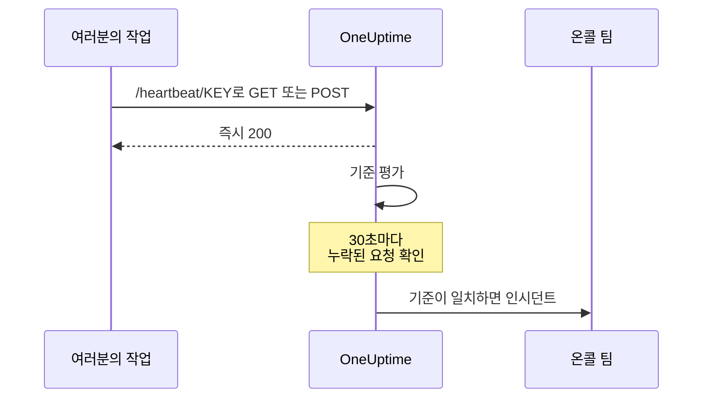
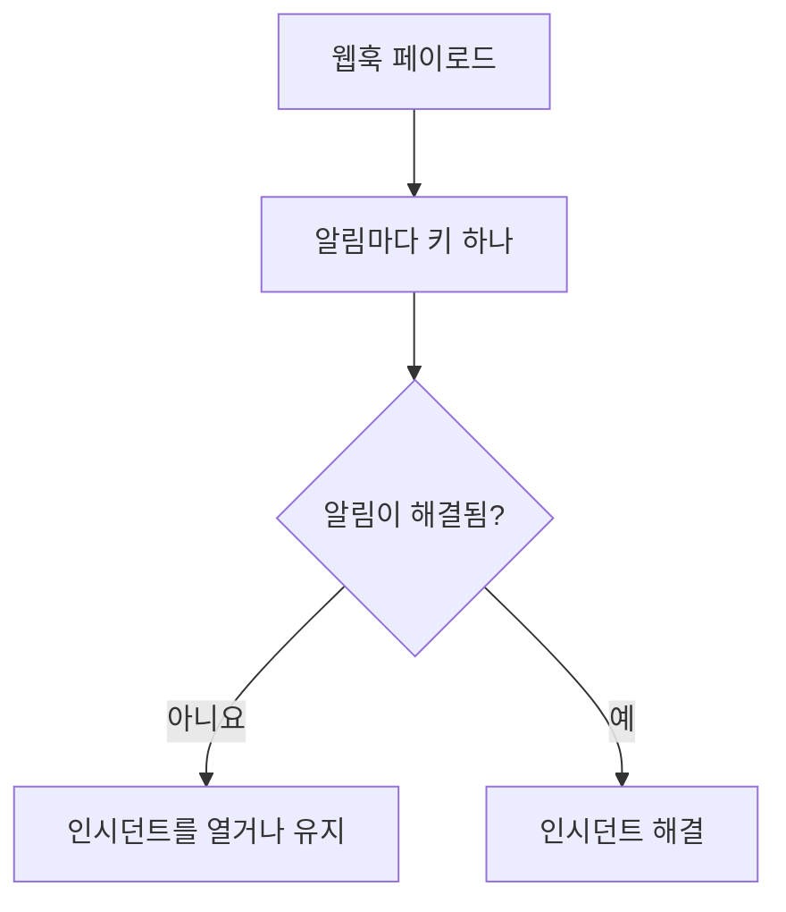

# 수신 요청 모니터

수신 요청 모니터는 다른 시스템이 HTTP 요청을 보낼 URL을 제공합니다. OneUptime은 모든 요청을 기준에 따라 평가하며, 모니터 상태를 바꾸고, 인시던트를 선언하고, 온콜 담당자를 호출할 수 있습니다.

이 모니터는 서로 다른 두 가지 역할을 합니다.

- **하트비트 모니터링** — cron 작업, 워커 또는 장치가 일정에 따라 URL을 호출하고, 호출이 끊기면 OneUptime이 인시던트를 엽니다.
- **다른 시스템의 알림 수신** — Prometheus Alertmanager, Grafana를 비롯해 JSON을 POST할 수 있는 무엇이든 알림을 보내면, OneUptime이 각 알림을 온콜 에스컬레이션과 복구 시 자동 해결이 붙은 인시던트로 만듭니다.

둘 다 같은 모니터 유형을 사용합니다. 둘을 가르는 것은 여러분이 설정하는 기준입니다.

:::cards
- [모니터 만들기](#수신-요청-모니터-만들기): 몇 단계만으로 하트비트 URL을 받습니다.
- [하트비트 보내기](#하트비트-보내기): curl, cron, Node.js, Python, Go에서 보냅니다.
- [호출이 끊기면 알림 받기](#10분-동안-하트비트가-없으면-오프라인으로-표시데드맨-스위치): 모니터를 데드맨 스위치로 만듭니다.
- [알림 받기](#다른-시스템의-알림-수신): Alertmanager나 Grafana의 알림마다 인시던트 하나를 엽니다.
:::

## 작동 방식

외부에서 시스템을 검사하는 것은 없습니다. 여러분의 시스템이 모니터의 URL을 호출하면 OneUptime이 즉시 응답한 뒤, 모니터의 기준에 따라 요청을 평가합니다. 들어오지 *않게 된* 요청을 살피는 기준은 백그라운드에서 30초마다 다시 검사되므로, 침묵도 인시던트를 열 수 있습니다.



다음 용도로 사용합니다.

- cron 작업과 예약된 태스크 모니터링
- 백그라운드 워커가 실행 중인지 확인
- 외부에서 도달할 수 없는 방화벽 뒤 서비스 모니터링
- Prometheus Alertmanager, Grafana 및 기타 알림 시스템으로부터 알림 수신
- HTTP를 지원하는 모든 시스템의 하트비트 신호 추적

## 수신 요청 모니터 만들기

:::steps
### 새 모니터 시작

**모니터** 로 이동해 **모니터 생성** 을 클릭합니다.

### Incoming Request 선택

**모니터 유형** 에서 **Incoming Request** 를 선택합니다. 맨 위에 있는 일반적인 유형 중 하나입니다. **이름** 을 입력한 다음 **다음** 을 클릭합니다.

### 기준 검토

**기준** 단계는 [기본 기준](#기본으로-제공되는-것)으로 시작합니다. 하트비트용으로는 **기준 추가** 를 클릭하고, 새 기준에 상태를 오프라인으로 바꾸고 인시던트를 선언하는 **Incoming Request** / **Not Recieved In Minutes** 필터를 주고, **인시던트 자동 해결** 을 켭니다. 그런 다음 목록 맨 위로 끌어 올립니다. 이유는 [기준 예시](#기준-예시)를 참고하세요.

### 모니터 생성

**모니터 생성** 을 클릭합니다. 모니터가 **개요** 페이지로 열리며, **Send the first heartbeat** 카드에 복사 버튼이 있는 **Heartbeat URL** 과 `curl` 명령 예시가 표시됩니다.

### 첫 요청 보내기

서비스가 그 URL로 요청을 보내도록 설정합니다([하트비트 보내기](#하트비트-보내기) 참고). 첫 요청이 도착하면 카드가 모니터 기록으로 바뀌고, **Heartbeat URL** 카드에 URL과 마지막 요청이 도착한 시각이 표시됩니다.
:::

> [!NOTE]
> URL에는 모니터의 비밀 키가 들어 있으므로 모니터를 편집할 수 있는 사람만 볼 수 있습니다. 언제든 모니터의 **문서** 페이지, 사이드 메뉴의 **구성** 섹션에서 다시 찾을 수 있습니다.

## 요청 URL

모니터에는 다음 형식의 고유 URL이 있습니다.

```text
https://oneuptime.com/heartbeat/YOUR_SECRET_KEY
```

자체 호스팅하는 경우 `https://oneuptime.com` 을 OneUptime 인스턴스의 URL로 바꾸세요.

이 URL로 **GET** 또는 **POST** 요청을 보냅니다. HEAD는 받아들여져 GET으로 처리되며, PUT, PATCH, DELETE는 404를 반환합니다. 경로에 있는 비밀 키가 유일한 자격 증명이므로 헤더나 토큰은 필요 없습니다. 쿼리 문자열은 무시되므로, 기준이 읽어야 할 내용은 본문이나 헤더로 보내세요.

> [!WARNING]
> 이 URL을 아는 사람은 누구나 모니터를 정상으로 표시할 수 있으므로 비밀로 다루세요. 유출되었다면 모니터의 **설정** 페이지를 열어 **수신 요청 비밀 키 재설정** 을 클릭한 다음, 모든 발신자를 업데이트하세요. 보낸 헤더는 모두 모니터에 저장되며, 모니터를 볼 수 있는 사람 누구에게나 보입니다. 이 엔드포인트로 보내는 헤더에 API 키나 토큰을 넣지 마세요.

> [!IMPORTANT]
> OneUptime은 즉시 빈 JSON 객체(`{}`)와 함께 `200` 으로 응답하고, 요청은 큐에서 처리합니다. 이 응답은 어떤 검증보다도 먼저 기록되므로, `200` 은 요청이 받아들여졌다는 확인이 **아닙니다**. 잘못된 비밀 키, 삭제된 모니터, 비활성화된 모니터도 모두 `200` 을 반환합니다. 요청이 제대로 도착하는지는 모니터 자체의 타임라인에서 확인하세요.

### 요청 본문 보내기

본문 안의 필드를 참조하려면(인시던트 제목의 `{{requestBody.status}}`, 인시던트 그룹화의 JSON 경로, JavaScript 표현식 기준 등) `Content-Type: application/json` 을 보내세요. 이 문서는 전체적으로 이 형식을 전제로 합니다. 본문은 JSON 객체나 배열이어야 합니다. 잘못된 JSON이나 `"error"` 같은 단독 값은 `500` 으로 거부됩니다.

| 콘텐츠 유형 | 기준과 템플릿이 보는 것 |
| --- | --- |
| `application/json` | 파싱된 JSON. |
| `application/x-www-form-urlencoded` | 파싱된 양식. 대괄호가 있는 키는 중첩되며(`alerts[0][status]=firing`), 모든 값은 문자열입니다. |
| 그 밖의 유형 또는 없음 | 빈 본문(`{}`). 따라서 모든 `requestBody` 참조는 아무것도 가리키지 않습니다. |

본문은 최대 50 MB까지 받으며, 그보다 크면 `413` 으로 거부됩니다. 본문을 `Content-Encoding: gzip` 으로 압축하지 마세요. JSON으로 저장되지 않아 그 안의 경로가 해석되지 않습니다.

### 하트비트 보내기

각 예시는 요청 하나를 보냅니다. `YOUR_SECRET_KEY` 를 모니터 URL에 있는 키로 바꾸세요.

:::tabs
@tab curl
```bash
# Simple GET request
curl https://oneuptime.com/heartbeat/YOUR_SECRET_KEY

# POST request with a JSON body
curl -X POST https://oneuptime.com/heartbeat/YOUR_SECRET_KEY \
  -H "Content-Type: application/json" \
  -d '{"status": "healthy", "version": "1.2.3"}'
```
@tab Cron
```bash
# Send a heartbeat every 5 minutes
*/5 * * * * curl -fsS https://oneuptime.com/heartbeat/YOUR_SECRET_KEY > /dev/null

# Or ping only when the job succeeds, so a failed run counts as a missed heartbeat
0 2 * * * /usr/local/bin/backup.sh && curl -fsS https://oneuptime.com/heartbeat/YOUR_SECRET_KEY > /dev/null
```
@tab Node.js
```javascript title="heartbeat.mjs"
// Node.js 18 or later: fetch is built in. Run with `node heartbeat.mjs`.
const response = await fetch(
  "https://oneuptime.com/heartbeat/YOUR_SECRET_KEY",
  {
    method: "POST",
    headers: { "Content-Type": "application/json" },
    body: JSON.stringify({ status: "healthy", version: "1.2.3" }),
  },
);

console.log(response.status); // 200
```
@tab Python
```python title="heartbeat.py"
# Python 3, standard library only. Run with `python3 heartbeat.py`.
import json
import urllib.request

request = urllib.request.Request(
    "https://oneuptime.com/heartbeat/YOUR_SECRET_KEY",
    data=json.dumps({"status": "healthy", "version": "1.2.3"}).encode(),
    headers={"Content-Type": "application/json"},
    method="POST",
)

with urllib.request.urlopen(request, timeout=10) as response:
    print(response.status)  # 200
```
@tab Go
```go title="heartbeat.go"
// Run with `go run heartbeat.go`.
package main

import (
	"bytes"
	"fmt"
	"net/http"
)

func main() {
	body := []byte(`{"status": "healthy", "version": "1.2.3"}`)

	resp, err := http.Post(
		"https://oneuptime.com/heartbeat/YOUR_SECRET_KEY",
		"application/json",
		bytes.NewReader(body),
	)
	if err != nil {
		panic(err)
	}
	defer resp.Body.Close()

	fmt.Println(resp.StatusCode) // 200
}
```
@tab PowerShell
```powershell
# Windows PowerShell 5.1 or PowerShell 7
Invoke-RestMethod -Method Post `
  -Uri "https://oneuptime.com/heartbeat/YOUR_SECRET_KEY" `
  -ContentType "application/json" `
  -Body '{"status": "healthy", "version": "1.2.3"}'
```
:::

## 모니터링 기준

서비스를 언제 온라인, 저하, 오프라인으로 볼지 결정하는 기준을 설정할 수 있습니다. 각 기준 필터에는 **필터 유형**(무엇을 볼지), **필터 조건**(어떻게 비교할지), **값** 이 있습니다.

### 기본으로 제공되는 것

새 수신 요청 모니터는 요청 본문을 읽는 두 가지 기준으로 만들어집니다.

| 기준 | 필터 유형 | 필터 조건 | 값 | 효과 |
| -------- | ------------ | ---------------- | ------- | -------------------------------------------- |
| Offline  | 요청 본문 | 포함 | `error` | 모니터를 오프라인으로 표시하고 인시던트를 엽니다 |
| Online   | 요청 본문 | Not Contains | `error` | 모니터를 온라인으로 표시합니다 |

이는 발신자가 페이로드에 자신의 상태를 보고하는 일반적인 경우에 맞습니다. 본문에 `error` 가 들어 있는 요청은 모니터를 다운시키고, 그 단어가 없는 다음 요청은 모니터를 되살리고 인시던트를 해결합니다. 본문이 전혀 없는 요청은 "`error` 를 포함하지 않음"으로 간주되므로, 단순한 하트비트 호출은 모니터를 온라인으로 유지합니다.

값을 발신자가 실제로 보내는 내용(`"status":"firing"`, `FAILED` 등)으로 바꾸세요. 비교는 키를 포함한 본문 전체에서 대소문자를 구분하는 부분 문자열 검색이므로, `{"error":null}` 도 `error` 와 일치합니다.

> [!NOTE]
> 이 기본값은 데드맨 스위치가 **아닙니다**. 요청이 더 이상 오지 않아도 여기서는 아무것도 발생하지 않습니다. 침묵에 대해 알림을 받으려면 아래에 설명한 대로 **Incoming Request** / **Not Recieved In Minutes** 기준을 추가하세요.

### 사용할 수 있는 필터 유형

| 필터 유형 | 검사 대상 | 참고 |
| --------------------- | ------------------------------------------------------ | -------------------------------------------------------------------------------------------- |
| Incoming Request | 시간 범위 안에 요청을 받았는지 여부 | 아무것도 오지 않을 때 발생할 수 있는 유일한 검사 |
| 요청 본문 | 요청 본문 | 부분 문자열 일치. 객체 본문은 압축된 JSON으로 비교합니다 |
| Request Header | 요청 헤더의 이름 | 헤더 이름 전체와 정확히 일치, 대소문자 무시 |
| Request Header Value | 요청 헤더의 값 | 헤더 값 전체와 정확히 일치, 대소문자 무시 |
| JavaScript Expression | `requestBody` 와 `requestHeaders` 에 대한 모든 표현식 | 가장 유연한 선택지입니다. [JavaScript 표현식](/docs/monitor/javascript-expression)을 참고하세요 |

### 필터 조건

필터 유형마다 고유한 조건이 있습니다.

| 필터 유형 | 조건 |
| --- | --- |
| **Incoming Request** | **Recieved In Minutes** — 지정한 분 안에 요청을 받았습니다. **Not Recieved In Minutes** — 지정한 분 안에 요청을 받지 못했습니다. (대시보드에는 이 철자로 표시됩니다.) |
| **요청 본문**, **Request Header**, **Request Header Value** | **포함** 과 **Not Contains** |
| **JavaScript Expression** | **Evaluates To True** |

> [!NOTE]
> 헤더 이름과 값은 소문자로, 부분 문자열이 아니라 이름이나 값 전체와 비교됩니다. `application/json` 은 `application/json; charset=utf-8` 과 일치하지 않습니다. 부분 문자열로 비교하는 것은 **요청 본문** 뿐입니다. 프록시나 OneUptime 자체 로드 밸런서가 추가하는 헤더(`x-forwarded-for`, `x-real-ip`)도 저장됩니다.

객체 본문은 공백 없는 압축된 JSON으로 비교되므로, **요청 본문** / **포함** 필터는 `"status":"firing"` 으로 써야 합니다. 보기 좋게 정리된 페이로드에서 `"status": "firing"` 을 복사하면 절대 일치하지 않습니다.

### 기준 예시

#### 10분 동안 하트비트가 없으면 오프라인으로 표시(데드맨 스위치)

| 필드 | 값 |
| --- | --- |
| **필터 유형** | Incoming Request |
| **필터 조건** | Not Recieved In Minutes |
| **값** | `10` |

#### 요청 본문 내용에 따라 저하로 표시

| 필드 | 값 |
| --- | --- |
| **필터 유형** | 요청 본문 |
| **필터 조건** | 포함 |
| **값** | `"status":"degraded"` |

> [!IMPORTANT]
> 데드맨 스위치를 기본 기준 **위에** 두세요. 기준은 위에서부터 검사되고 처음 일치한 기준이 결정합니다. 백그라운드 검사는 마지막 요청을 다시 읽으므로, 기본 온라인 기준("Request Body Not Contains `error`")이 계속 그 요청과 일치하고, 그 아래 기준에는 차례가 오지 않습니다. **기준 추가** 는 기준을 맨 아래에 추가하므로 위로 끌어 올리세요.

> [!WARNING]
> 모니터는 기준 중 적어도 하나가 **Incoming Request** 를 검사할 때만 백그라운드에서 다시 평가됩니다. 기준이 요청 본문, Request Header, JavaScript 표현식만 검사하는 모니터는 요청이 도착할 때만 평가되고 그 밖에는 평가되지 않으므로, 스스로 오프라인이 될 수 없습니다. 하트비트 누락 경보가 필요하면 **Incoming Request** 기준이 있어야 합니다.

백그라운드 검사는 분 단위로 세며, 값을 *넘는* 시간이 지나면 발생합니다. "Not Recieved In Minutes: 10"은 마지막 요청 후 약 11분 뒤에 발생합니다(검사는 30초마다 실행됩니다). 요청을 한 번도 받지 않은 모니터는 생성 시각을 마지막 요청으로 취급하므로, 새로 만든 모니터에 같은 기준을 두면 발신자를 연결하지 않았더라도 생성 후 약 11분 뒤에 발생합니다. 값에는 OneUptime이 데이터를 받고 있던 분만 계산됩니다. OneUptime 자체가 재시작하거나, 업그레이드되거나, 밀린 처리를 따라잡는 동안의 분은 계산되지 않습니다. 자세한 내용은 [OneUptime이 데이터를 받지 못할 때](/docs/monitor/when-oneuptime-is-not-receiving)를 참고하세요.

## 다른 시스템의 알림 수신

Alertmanager, Grafana 같은 도구는 하나 이상의 알림을 설명하는 JSON 문서를 POST합니다. 기본적으로 기준은 인시던트를 **하나** 만 열기 때문에, 알림 다섯 개가 담긴 페이로드도 인시던트 하나만 만듭니다. 인시던트 그룹화는 이를 바꿉니다. 페이로드에서 값을 뽑아 **서로 다른 값마다 별도의 인시던트** 를 열며, 이 인시던트들은 모두 동시에 열려 있을 수 있습니다.



### 인시던트 그룹화 켜기

:::steps
1. 기준을 열고 **설정** 을 펼칩니다.
2. **Group incidents and alerts by a payload field** 를 켭니다.
3. **Open a separate incident for each…** 를 입력합니다. 각 인시던트가 스스로 해결되게 하려면 **Auto-resolve each incident when…** 아래의 필드와 값도 입력합니다(아래 참고). 그런 다음 모니터를 저장합니다.
:::

| 필드 | 예시 | 하는 일 |
| ---------------------------------- | ---------------------------------------- | ---------------------------------------------------------------------- |
| Open a separate incident for each… | `requestBody.alerts[*].labels.alertname` | 서로 다른 값으로 인시던트를 나누는 경로 |
| Field that signals recovery | `requestBody.alerts[*].status` | 알림이 복구되었는지 판단하기 위해 검사하는 경로 |
| Value that means recovered | `resolved` | 복구를 나타내는 정확한 값 |
| Max incidents per request | `100`(기본값) | 값의 종류가 많은 필드가 인시던트를 무한정 열지 못하게 하는 안전 상한 |

### 경로 문법

경로는 리터럴 접두사 `requestBody.` 로 시작해야 합니다. 이 접두사가 없는 경로(`alerts[*].labels.alertname`)는 아무 경고 없이 아무것과도 일치하지 않습니다. `{{ }}` 감싸기는 선택 사항이며, `requestBody.status` 와 `{{requestBody.status}}` 는 똑같이 동작합니다.

- `[*]` 는 배열 전체로 펼쳐지며, **서로 다른** 값마다 인시던트가 하나씩 생깁니다. 같은 값을 내는 두 요소는 인시던트 하나로 합쳐지고, 그 인시던트의 상태(발생 중/해결됨)는 **처음** 일치한 요소에서 가져옵니다. **경로에서 와일드카드는 첫 번째 `[*]` 뿐입니다.** `requestBody.groups[*].alerts[*].name` 은 아무것과도 일치하지 않습니다.
- `[0]` 과 `[last]` 는 요소 하나를 선택하며, `[*]` 뒤에 올 수 있습니다.
- 객체와 배열 값, 빈 문자열, null은 건너뜁니다. `0` 과 `false` 는 유효한 키입니다.
- 본문은 JSON 객체여야 합니다. 최상위가 배열인 페이로드는 그룹화되지 않습니다.

### 해결은 이벤트 기반입니다

웹훅은 해당 페이로드에 있는 것만 설명하므로, OneUptime은 키가 더 이상 나타나지 않는다는 이유로 인시던트를 해결하지 않습니다. 인시던트는 페이로드가 그 키의 복구를 명시적으로 알릴 때만 해결됩니다. 다음 두 가지가 모두 참이어야 합니다.

1. **Field that signals recovery** 와 **Value that means recovered** 가 설정되어 있고 페이로드와 일치합니다. 비교는 대소문자를 구분하는 정확한 일치이므로 `Resolved` 는 `resolved` 와 일치하지 않습니다.
2. 기준의 인시던트에서, 인시던트 양식의 **추가 필드** 아래에 있는 **인시던트 자동 해결** 이 켜져 있습니다. 이것이 없으면 일치하는 복구 이벤트가 무시되고 인시던트는 열린 채로 남습니다. (알림과 **경고 자동 해결** 도 마찬가지입니다.) 기본 오프라인 기준은 이것이 켜진 상태로 시작하고, 기준에 직접 추가한 인시던트는 꺼진 상태로 시작합니다.

**Max incidents per request** 는 생성뿐 아니라 추출도 제한합니다. 상한을 넘는 키는 복구 판단에서도 보이지 않으므로, 서로 다른 키가 상한보다 많은 페이로드에서는 상한 밖에서 `resolved` 를 보고하는 알림이 자기 인시던트를 닫지 못합니다.

> [!NOTE]
> 모니터 하나가 OneUptime이 평가하는 속도보다 빠르게 요청을 받으면, OneUptime은 가장 최근 요청을 평가하고 그 사이의 요청은 건너뜁니다. 따라서 웹훅이 몰리면 발생 중이거나 해결된 알림이 평가되지 않을 수 있습니다. 자체 호스팅 서버에서는 OneUptime 앱 환경에 `INCOMING_REQUEST_INGEST_COALESCE_ENABLED=false` 를 설정하면 모든 요청을 각각 평가합니다.

> [!WARNING]
> **Field that signals recovery** 에는 `[*]` 가 있는데 **Open a separate incident for each…** 에는 없으면 아무것도 해결되지 않습니다. `[*]` 는 둘 다에 쓰거나 둘 다에 쓰지 마세요. `[*]` 가 없는 복구 경로는 페이로드 전체를 대상으로 평가되므로, 페이로드 수준의 `status: resolved` 는 그 페이로드의 모든 키를 해결합니다. 자기 상태가 아직 발생 중인 알림까지 포함됩니다.

### 인시던트 이름 짓기

그룹화 키는 **경로의 마지막 세그먼트** 를 딴 이름의 변수로 인시던트와 알림 템플릿에 제공됩니다.

| 경로 | 변수 |
| ---------------------------------------- | ----------------- |
| `requestBody.alerts[*].labels.alertname` | `{{alertname}}`   |
| `requestBody.alerts[*].fingerprint`      | `{{fingerprint}}` |
| `requestBody.commonLabels.severity`      | `{{severity}}`    |

전체 페이로드도 함께 사용할 수 있으므로, 인시던트 제목을 `{{alertname}}` 으로 하고 설명에서 `{{requestBody.commonAnnotations.summary}}` 를 참조하는 것도 가능합니다. [인시던트 및 알림 템플릿](/docs/monitor/incident-alert-templating)을 참고하세요.

> [!WARNING]
> 변수 이름은 OneUptime이 복구 이벤트를 열린 인시던트와 맞추는 데 쓰는 식별 정보의 일부입니다. 그룹화 경로를 마지막 세그먼트가 다른 경로로 바꾸면, 이전 경로로 현재 열려 있는 모든 인시던트가 고아가 됩니다. 더 이상 자동으로 해결할 수 없으므로 직접 닫아야 합니다.

`[*]` 는 그룹화 경로 필드 두 개에서**만** 동작합니다. 다른 곳에서는 해석되지 않으며, 해석되지 않은 자리 표시자는 비워지지 않고 **그대로** 출력됩니다. 제목을 `{{requestBody.alerts[*].labels.alertname}}` 로 하면 중괄호가 그대로 남은 채 표시됩니다. `{{requestBody.alerts[0].annotations.summary}}` 라는 제목은 해석되지만 항상 페이로드의 첫 번째 알림을 읽을 뿐, 이 인시던트를 연 알림을 읽지는 않습니다. 그룹화 변수와 페이로드의 공통 `commonAnnotations` 필드를 함께 쓰는 편이 좋습니다.

### 실전 예시

전체 Alertmanager 구성은 [Prometheus Alertmanager](/docs/integrations/prometheus-alertmanager)를 참고하세요. Grafana는 [Grafana](/docs/integrations/grafana)를 참고하세요.

## 모범 사례

1. **시간 범위를 알맞게 설정** — cron 작업이 5분마다 실행된다면 "Not Recieved In Minutes" 임계값을 10~15분으로 잡아 가끔 생기는 지연을 허용하고, 그 기준을 맨 앞에 두세요.
2. **의미 있는 데이터 포함** — 요청 본문에 상태 정보를 보내 세밀한 기준을 설정할 수 있게 하세요.
3. **`Content-Type: application/json` 과 함께 POST 사용** — 본문 안을 읽는 모든 것이 이것에 의존합니다.
4. **한 모니터에서 두 역할을 섞지 않기** — 이벤트 기반 알림을 받는 모니터에는 일정한 주기가 없으므로, 그 모니터에 "Not Recieved In Minutes" 기준을 두면 상태가 계속 오락가락합니다. 데드맨 스위치에는 별도의 모니터를 사용하세요.
5. **모니터 자체를 감시** — 요청을 보내는 서비스가 오류를 제대로 처리해, 실패한 요청이 눈에 띄지 않고 지나가지 않게 하세요.

## 문제 해결

:::details 발신자는 200을 받는데 모니터에 아무것도 표시되지 않습니다
`200` 은 요청을 검증하기 전에 보내지므로, 요청이 받아들여졌다는 증거가 아닙니다. URL의 비밀 키가 모니터의 **Heartbeat URL** 과 일치하는지, 모니터가 비활성화되지 않았는지 확인하세요. 그런 다음 모니터의 타임라인에서 요청이 도착하는지 살펴보세요.
:::

:::details 하트비트가 멈춰도 모니터가 오프라인이 되지 않습니다
침묵을 알아챌 수 있는 것은 **Incoming Request**(**Not Recieved In Minutes**) 기준뿐입니다. 없다면 추가하고 기본 기준 위로 끌어 올리세요. 기본 온라인 기준은 백그라운드 검사 때마다 마지막 요청과 일치하며, 처음 일치한 기준이 결정합니다.
:::

:::details 요청 본문 필터가 일치하지 않습니다
`Content-Type: application/json` 을 보내고, 값을 압축된 JSON으로 쓰세요. `"status":"firing"` 처럼 콜론 뒤에 공백이 없어야 합니다. JSON이나 양식 콘텐츠 유형이 없으면 본문을 파싱하지 않습니다.
:::

:::details Request Header 필터가 일치하지 않습니다
헤더 이름과 값은 전체로 비교됩니다. 일부가 아니라 `application/json; charset=utf-8` 같은 전체 값을 지정하세요.
:::

:::details 발신자가 500을 받습니다
요청은 `Content-Type: application/json` 이라고 하지만 본문이 JSON 객체나 배열이 아닙니다. 올바른 JSON을 보내거나 다른 콘텐츠 유형을 사용하세요.
:::

## 다음 단계

:::cards
- [Prometheus Alertmanager](/docs/integrations/prometheus-alertmanager): 수신 알림을 위한 완전한 설정입니다.
- [Grafana](/docs/integrations/grafana): Grafana 알림에 대한 같은 설정입니다.
- [인시던트 및 알림 템플릿](/docs/monitor/incident-alert-templating): 제목과 설명에서 쓸 수 있는 모든 변수입니다.
- [JavaScript 표현식](/docs/monitor/javascript-expression): 표현식 문법과 따옴표 규칙입니다.
:::
