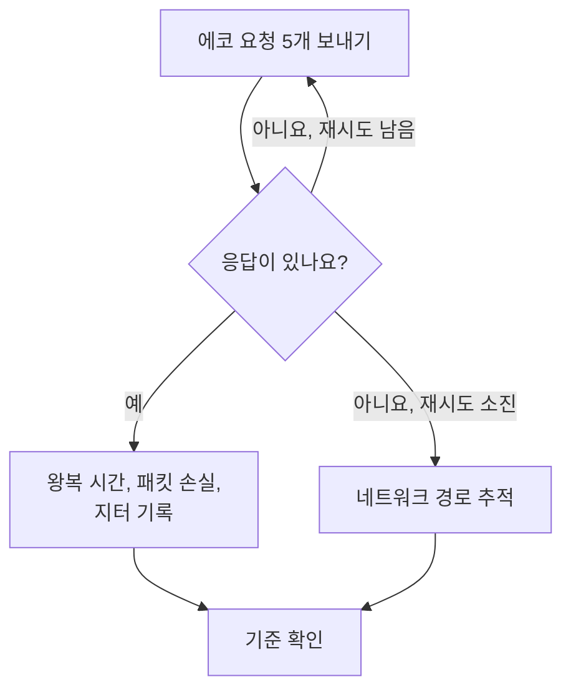

# IP 모니터

IP 모니터는 IPv4 또는 IPv6 주소가 ping(ICMP 에코 요청)에 응답하는지 확인하고, 왕복 시간, 패킷 손실, 지터를 측정합니다. 게이트웨이, 로드 밸런서의 가상 IP, 고정 주소를 가진 서버처럼 주소로 알고 있는 인프라에 사용하세요.

:::cards
- [모니터 만들기](#ip-모니터-만들기): 대시보드에서 여섯 단계.
- [구성 옵션](#구성-옵션): 주소, 시간 초과, 재시도.
- [모니터링 기준](#모니터링-기준): 연결 가능성, 지연 시간, 패킷 손실, 지터.
- [문제 해결](#문제-해결): 주소는 응답할 수 있는데 모니터가 오프라인으로 표시될 때.
:::

## 작동 방식

IP 모니터는 [Ping 모니터](/docs/monitor/ping-monitor)와 같은 확인을 실행합니다. 확인할 때마다 프로브는 주소에 에코 요청 다섯 개를 보냅니다. 응답이 하나라도 돌아오면 주소는 온라인이며, 프로브는 평균 왕복 시간을 응답 시간으로 기록하고 패킷 손실, 지터, 가장 빠른 응답과 가장 느린 응답도 함께 기록합니다. 응답이 돌아오지 않으면 프로브는 허용한 재시도 횟수만큼 다시 시도합니다. 그런 다음 OneUptime이 결과를 모니터의 기준에 통과시킵니다.

확인이 실패하면 프로브는 주소까지의 경로도 추적하고, 찾은 내용을 결과에 **Network Path at Time of Failure**로 첨부하므로 경로가 어디서 끊어졌는지 볼 수 있습니다.

어느 것을 사용할지:

| 모니터 | 받는 값 | 사용할 때 |
| --- | --- | --- |
| **IP** | IP 주소만 | 감시하려는 것이 주소 자체이고, 그 주소가 바뀌지 않을 때. |
| [Ping](/docs/monitor/ping-monitor) | 호스트 이름 또는 IP 주소 | 호스트를 이름으로 알고 있을 때. 이름은 확인할 때마다 해석되므로 모니터가 DNS 변경을 따라갑니다. |

> [!NOTE]
> 일부 호스팅 업체는 프로브가 실행되는 머신에서 ICMP를 차단합니다. ping을 전혀 보낼 수 없는 프로브는 대신 그 주소의 TCP 포트 `80`을 확인하므로, 모니터는 여전히 주소에 연결할 수 있는지 알려 줍니다. 이 경우 패킷 손실과 지터는 측정되지 않습니다.

자체 네트워크 연결을 잃은 프로브는 결과를 보고하지 않으므로 주소를 오프라인으로 표시할 수 없습니다.

## 시작하기 전에

- **모니터를 만들 수 있는 역할**: Project Owner, Project Admin, Project Member, Monitor Admin 또는 Monitor Member, 또는 Create Monitor 권한이 있는 사용자 지정 역할.
- **주소에 연결할 수 있는 프로브**(경로에서 ICMP가 허용되어야 합니다). 모든 새 모니터에는 프로젝트의 기본 프로브가 선택됩니다. 주소 앞에 방화벽이 있으면 [OneUptime Cloud의 프로브 IP 주소](/docs/configuration/ip-addresses)에서 오는 ICMP 에코 요청을 허용합니다. 프라이빗 주소에는 그 네트워크의 [사용자 지정 프로브](/docs/probe/custom-probe)가, IPv6 주소에는 IPv6로 연결할 수 있는 프로브가 필요합니다.

## IP 모니터 만들기

:::steps
### 새 모니터 시작

**모니터**로 이동해 **모니터 생성**을 클릭합니다. **모니터 유형**에서 **더 많은 모니터 유형**을 클릭하고 **Basic Monitoring** 아래의 **IP**를 선택합니다.

### 이름 지정

`Office gateway` 같은 **이름**을 입력하고 **다음**을 클릭합니다.

### 주소 입력

**IP 주소**에 확인할 IPv4 또는 IPv6 주소를 입력합니다(예: `192.168.1.1` 또는 `2001:db8::1`). 호스트 이름은 받지 않으며, 필드에 오류가 표시됩니다. 호스트에 이름으로 ping을 보내려면 [Ping 모니터](/docs/monitor/ping-monitor)를 사용합니다.

### 테스트

**모니터 테스트**를 클릭하고 **프로브 선택**에서 프로브를 고른 다음 **테스트 실행**을 클릭합니다. **모니터 테스트 결과**에 프로브가 본 왕복 시간과 패킷 손실이 표시됩니다.

### 기준 검토

**모니터 기준**은 [기본 기준](#기본-기준)으로 시작합니다. 주소가 응답하지 않으면 오프라인, 응답하면 온라인입니다. 필요하면 바꾼 다음 **다음**을 클릭합니다.

### 프로브 선택 및 생성

**프로브**와 **모니터링 간격**(**5분마다**로 시작)을 그대로 두거나 바꾼 다음 **모니터 생성**을 클릭합니다. 모니터 페이지가 열립니다.
:::

## 구성 옵션

| 필드 | 기본값 | 입력할 내용 |
| --- | --- | --- |
| **IP 주소** | 없음 | `192.168.1.1` 같은 IPv4 주소나 `2001:db8::1` 같은 IPv6 주소. IPv6 주소를 감싼 대괄호는 제거됩니다. |
| **요청 시간 초과(초)** (**추가 필드** 안) | `60` | 각 시도에서 응답을 기다리는 시간. 최대 60초입니다. |
| **실패 시 재시도** (**추가 필드** 안) | 프로브 기본값, 보통 `3` | 실패한 시도를 다시 시도하는 횟수. 최대 3번입니다. |

**실패 시 재시도**는 첫 시도 _이후의_ 재시도를 세므로, `0`이면 확인을 한 번 실행하고 `2`면 최대 세 번 실행합니다. 비워 두면 프로브의 기본값을 사용합니다. 프로브의 `PROBE_MONITOR_RETRY_LIMIT`가 다르게 정하지 않는 한 3입니다. 시간 초과를 포함한 모든 실패를 시도 사이에 1초씩 쉬면서 다시 시도합니다. 응답에 10초보다 오래 걸린 성공한 확인도 한 번 더 확인합니다.

## 모니터링 기준

기준은 주소를 온라인, 저하됨, 오프라인 중 무엇으로 볼지, 그리고 그에 따라 인시던트를 선언할지 알림을 생성할지를 정합니다. 각 기준은 하나 이상의 필터를 확인합니다.

| 필터 | 조건 | 확인하는 것 |
| --- | --- | --- |
| **Is Online** | **참**, **거짓** | 에코 요청 중 적어도 하나가 응답을 받았는지 여부. |
| **응답 시간(ms)** | **Greater Than**, **Less Than**, **Greater Than Or Equal To**, **Less Than Or Equal To** | 응답의 평균 왕복 시간. |
| **Packet Loss (in %)** | **Greater Than**, **Less Than**, **Greater Than Or Equal To**, **Less Than Or Equal To** | 에코 요청 다섯 개 중 응답을 받지 못한 비율. |
| **Jitter (in ms)** | **Greater Than**, **Less Than**, **Greater Than Or Equal To**, **Less Than Or Equal To** | 한 번의 확인에서 보낸 패킷들의 왕복 시간 표준 편차. |
| **Is Request Timeout** | **참**, **거짓** | 모든 시도에서 ping이 시간 초과되었는지 여부. |

필터가 둘 이상이면 **일치 조건**이 필터가 모두 일치해야 하는지(**전체**), 하나만 일치하면 되는지(**모두**)를 정합니다. 기준의 **작업**은 그 기준이 하는 일을 정합니다: 모니터 상태 변경, 알림 생성, 인시던트 선언, 또는 이들 중 여러 개.

### 기본 기준

새 IP 모니터는 두 가지 기준으로 시작합니다.

- **오프라인** — 모든 재시도 후에도 주소가 에코 요청에 하나도 응답하지 않거나 주소에 전혀 연결할 수 없습니다. 모니터는 **오프라인**으로 표시되고 "_monitor name_ is offline"이라는 인시던트가 생성됩니다. 주소가 다시 응답하면 인시던트는 스스로 해결됩니다.
- **온라인** — 주소가 응답합니다. 모니터는 **정상 작동**으로 표시됩니다.

기준은 위에서 아래로 확인되며, 처음 일치한 기준이 무엇을 할지 정합니다. 일치하는 기준이 없으면 모니터는 기본 상태를 표시합니다. 기준 아래의 **추가 필드**에서 다른 상태를 고르지 않으면 **정상 작동**입니다.

### 일정 기간에 걸친 평가

**일정 기간에 걸쳐 이 기준을 평가**는 필터 아래의 확인란으로, **Is Online**, **응답 시간(ms)**, **Packet Loss (in %)**, **Jitter (in ms)** 필터에 제공됩니다. 켜면 최신 확인 대신 지난 확인들의 기간을 판단합니다. **평가**에서 집계를 고르고, **지난 시간 동안(분)** 항목에서 2분에서 60분 사이의 기간을 고릅니다.

| 집계 | 일치하는 경우 |
| --- | --- |
| **평균**, **합계**, **Maximum Value**, **Minimum Value** | 기간 전체에 대한 그 값이 조건을 충족할 때. 숫자 필터만 해당합니다. |
| **All Values** | 기간 안의 모든 확인이 조건을 충족할 때. |
| **Any Value** | 기간 안의 확인 중 적어도 하나가 조건을 충족할 때. |

**All Values**는 기간이 실제로 데이터로 채워진 뒤에만 일치합니다. 방금 만든 모니터나 확인이 더 이상 기록되지 않는 모니터에는 지난 N분에 대해 말할 만한 기록이 없으므로, 기준은 가진 값 하나로 일치하지 않고 기다립니다. **Any Value**는 "확인 한 번이라도 임계값을 넘으면 바로 알려 달라"를 위한 설정이며, 여전히 즉시 실행됩니다.

**데이터가 없는 경우**는 기간이 기준을 뒷받침할 수 없는 동안 무슨 일이 일어날지 정합니다.

| 옵션 | 일어나는 일 | 용도 |
| --- | --- | --- |
| **Ignore**(기본값) | 기준이 일치하지 않습니다. | 일반적인 임계값 알림. |
| **트리거** | 데이터가 없는 것 자체를 문제로 봅니다. | 침묵 자체가 장애인 확인. |
| **Treat As Zero** | 기간을 하나의 0으로 비교합니다. | 이벤트가 없으면 정말로 0을 뜻하는 카운터. |

### 기준 예시

| 목표 | 필터 | 조건 | 값 |
| --- | --- | --- | --- |
| 주소에 연결할 수 없으면 오프라인 | **Is Online** | **거짓** | — |
| 지연 시간이 높으면 알림 | **응답 시간(ms)** | **Greater Than** | `100` |
| 손실이 많은 링크에서 주소를 저하됨으로 표시 | **Packet Loss (in %)** | **Greater Than** | `20` |
| 불안정한 연결에 알림 | **Jitter (in ms)** | **Greater Than** | `30` |

## 문제 해결

:::details 주소는 응답할 수 있는데 모니터가 오프라인으로 표시됨
주소나 그 앞의 방화벽이 프로브의 ICMP 에코 요청에 응답하지 않습니다. 프로브의 ICMP 에코 요청을 허용하거나, 대신 [포트 모니터](/docs/monitor/port-monitor)로 그 주소의 서비스를 감시합니다. 실패한 확인의 **Network Path at Time of Failure**에 경로가 어디까지 갔는지 표시됩니다.
:::

:::details IPv6 주소가 항상 실패함
확인을 실행한 프로브에 IPv6 연결이 없으며, 실패 내용에 그렇게 나옵니다. IPv6를 쓸 수 있는 프로브에서 모니터를 실행합니다. [사용자 지정 프로브](/docs/probe/custom-probe)를 참고하세요.
:::

:::details 패킷 손실과 지터가 비어 있음
확인을 실행한 프로브는 ping을 보낼 수 없어서 대신 TCP 포트 `80`을 확인했으며, 이 방식은 둘 다 측정하지 않습니다. ICMP를 보낼 수 있도록 허용된 프로브에서 모니터를 실행합니다.
:::

## 다음 단계

:::cards
- [Ping 모니터](/docs/monitor/ping-monitor): 호스트에 이름으로 ping을 보내며 DNS 변경을 따라갑니다.
- [포트 모니터](/docs/monitor/port-monitor): 주소만이 아니라 그 주소의 서비스를 확인합니다.
- [사용자 지정 프로브](/docs/probe/custom-probe): 프라이빗 주소와 IPv6 주소를 여러분의 네트워크에서 확인합니다.
- [인시던트](/docs/incidents/index): 모니터가 인시던트를 선언한 뒤에 일어나는 일.
:::
