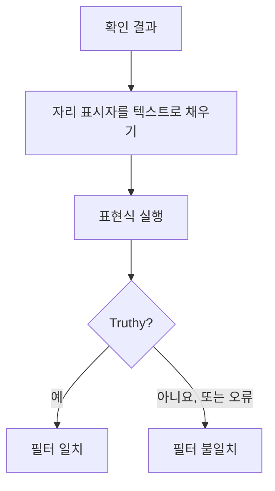

# JavaScript 표현식

**JavaScript Expression** 기준 필터는 고정된 비교 대신 JavaScript 한 줄로 모니터의 기준이 충족되었는지를 판단합니다. 기본 제공 필터로는 조건을 표현할 수 없을 때 사용하세요. JSON 응답 깊숙한 곳의 필드, 서로 비교하는 두 값, `&&`와 `||`로 묶은 여러 확인 같은 경우입니다.

:::cards
- [작동 방식](#작동-방식): 자리 표시자가 채워진 다음 표현식이 실행됩니다.
- [변수](#모니터-유형별-변수): 각 모니터 유형이 제공하는 것.
- [예시](#예시): API, 수신 요청, 데이터베이스용 표현식.
- [따옴표 규칙](#따옴표-규칙): 거의 모두가 하는 실수.
:::

## 작동 방식

표현식이 실행되기 전에, 표현식 안의 모든 `{{variable}}` 자리 표시자가 모니터의 최근 확인에서 나온 값으로 바뀝니다. 바뀌는 값은 일반 텍스트입니다. 그런 다음 그 결과가 JavaScript로 실행됩니다. truthy 값이 나오면 필터가 일치하고, 오류를 포함해 그 밖의 결과는 일치하지 않는다는 뜻입니다.



자리 표시자는 텍스트로 바뀌므로 `{{responseBody.item}}`은 원시 값이 됩니다. 문자열은 JavaScript 문자열이 되도록 따옴표로 감싸야 하고, 숫자나 불리언은 감싸지 않습니다. [따옴표 규칙](#따옴표-규칙)을 참고하세요. 표현식은 OneUptime 서버의 격리된 샌드박스에서 실행됩니다.

## JavaScript Expression 필터 추가

:::steps
### 기준 열기

모니터에서 **구성 → 기준**을 열고 **모니터링 기준 편집**을 클릭하거나, **모니터 생성**의 **기준** 단계를 사용합니다. 바꾸려는 기준 안에서 작업하거나, 새 기준이라면 **기준 추가**를 클릭합니다.

### 필터 추가

**필터** 아래에서 **필터 추가**를 클릭하고 **필터 유형**을 **JavaScript Expression**으로 설정합니다. **필터 조건**은 **Evaluates To True**입니다.

### 표현식 작성

[모니터 유형의 변수](#모니터-유형별-변수)를 사용해 **값**에 표현식을 입력합니다. 필터 아래의 링크 **Read documentation for using JavaScript expressions here.** 항목을 누르면 이 페이지가 열립니다.

### 저장

모니터를 저장합니다. 필터는 모니터의 다음 확인에서 평가됩니다.
:::

## 모니터 유형별 변수

JavaScript 표현식은 Website, API, Incoming Request, Incoming Email, SQL Query, Database Health 모니터에서 사용할 수 있습니다.

### 웹사이트 및 API 모니터

| 변수 | 설명 | 유형 |
| --- | --- | --- |
| `responseBody` | 응답 본문. 응답 본문이 JSON이면 파싱되고, 그렇지 않으면(HTML이나 XML 등) 문자열입니다. | `string` 또는 `JSON` |
| `responseHeaders` | 응답 헤더. 이름은 소문자입니다. | `Dictionary<string>` |
| `responseStatusCode` | 응답 상태 코드. | `number` |
| `responseTimeInMs` | 응답 시간(밀리초). | `number` |
| `isOnline` | 모니터가 응답을 온라인으로 보는지 여부. | `boolean` |

### 수신 요청 모니터

| 변수 | 설명 | 유형 |
| --- | --- | --- |
| `requestBody` | 요청 본문. | `string` 또는 `JSON` |
| `requestHeaders` | 요청 헤더. 이름은 소문자입니다. | `Dictionary<string>` |

### SQL 쿼리 모니터

| 변수 | 설명 | 유형 |
| --- | --- | --- |
| `rowCount` | 쿼리가 반환한 행 수. | `number` |
| `scalarValue` | 첫 번째 행의 첫 번째 열. | 임의 |
| `firstRow` | 첫 번째 행(열/값 쌍). | `JSON` |
| `executionTimeInMs` | 쿼리에 걸린 시간(밀리초). | `number` |
| `queryError` | 쿼리 오류(있었다면). | `string` |
| `isOnline` | 데이터베이스에 연결할 수 있었고 쿼리가 성공했는지 여부. | `boolean` |

### 데이터베이스 상태 모니터

`isOnline`, `engineVersion`, `connectionError`, `collectedGroups`, `unavailableGroups`, `metrics`. 데이터베이스 상태 모니터 페이지의 [JavaScript 표현식 변수](/docs/monitor/database-health-monitor#javascript-표현식-변수)를 참고하세요.

### 수신 이메일 모니터

필터는 제공되지만 이메일 필드는 연결되어 있지 않습니다. 표현식으로는 제목, 보낸 사람, 본문, 받는 사람을 읽을 수 없습니다. 대신 이메일 필터 유형을 사용하세요. [수신 이메일 모니터](/docs/monitor/incoming-email-monitor#사용할-수-있는-필터-유형)를 참고하세요.

## 예시

아래 각 줄은 하나의 완전한 표현식입니다. 다음과 같은 JSON 응답 본문이 있다고 합시다.

```json
{
  "item": "hello",
  "count": 3,
  "items": [{ "name": "hello" }]
}
```

| 표현식 | 일치하는 경우 |
| --- | --- |
| `"{{responseBody.item}}" === "hello"` | `item` 필드가 `hello`일 때. |
| `{{responseBody.count}} > 2` | `count` 필드가 2보다 클 때. |
| `"{{responseBody.items[0].name}}" === "hello"` | `items`의 첫 번째 요소의 이름이 `hello`일 때. |
| `{{responseStatusCode}} === 200 && {{responseTimeInMs}} < 500` | 상태가 200이고 응답이 0.5초 미만 걸렸을 때. |
| `/hel+o/.test("{{responseBody.item}}")` | `item` 필드가 정규식과 일치할 때. |
| `"{{responseHeaders.content-type}}".startsWith("application/json")` | 응답이 JSON일 때. 헤더 이름은 소문자입니다. |

조건은 `&&`와 `||`로 묶고, 괄호로 그룹을 만듭니다.

```javascript
({{responseStatusCode}} === 200 || {{responseStatusCode}} === 204) && {{responseTimeInMs}} < 1000
```

`{"status": "degraded", "region": "eu"}`를 `Content-Type: application/json`으로 받는 수신 요청 모니터라면:

```javascript
"{{requestBody.status}}" === "degraded" && "{{requestBody.region}}" === "eu"
```

쿼리가 개수를 반환하는 SQL 쿼리 모니터에서, 개수가 많거나 쿼리가 느릴 때 알림을 보내려면:

```javascript
{{scalarValue}} > 50 || {{executionTimeInMs}} > 2000
```

데이터베이스 상태 모니터에서는 `metrics` 객체 전체에 인덱스를 붙여 메트릭 하나를 읽습니다. 시계열 이름에 점이 들어 있어 중괄호 안에 넣을 수 없기 때문입니다.

```javascript
{{metrics}}['oneuptime.monitor.database.connections.used.percent'] > 90
```

## 따옴표 규칙

`{{var}}`는 값으로, 텍스트로 바뀝니다. 문자열을 비교하려면 `"{{responseBody.item}}" === "hello"`처럼 따옴표로 감싸고, 숫자를 비교하려면 `{{responseStatusCode}} === 200`처럼 감싸지 않습니다.

| 값 유형 | 쓰는 방법 | 예시 |
| --- | --- | --- |
| 문자열 | 따옴표로 감쌈 | `"{{responseBody.status}}" === "ok"` |
| 숫자 | 감싸지 않음 | `{{responseTimeInMs}} < 500` |
| 불리언 | 감싸지 않음 | `{{isOnline}} === true` |
| 객체 또는 배열 | 감싸지 않고 인덱스를 붙임 | `{{responseHeaders}}['content-type']` |

주의할 점 세 가지:

- **따옴표로 감싼 자리 표시자만 있으면 항상 참입니다.** `"{{responseBody.healthy}}"`는 필드가 `false`일 때 비어 있지 않은 문자열 `"false"`가 됩니다. 비교하거나(`"{{responseBody.healthy}}" === "true"`), 감싸지 않고 씁니다(`{{responseBody.healthy}} === true`).
- **값은 이스케이프되지 않습니다.** 큰따옴표나 줄 바꿈이 들어 있는 값은 문자열을 일찍 끝내 버려 표현식이 실패합니다. HTML 페이지에서 텍스트를 찾으려면 대신 **응답 본문** 필터를 사용합니다.
- **없는 경로는 쓴 그대로 남습니다.** 확인 결과에 그런 필드가 없으면 `{{responseBody.item}}`이 표현식에 그대로 남고, 대개 구문 오류가 됩니다. 그래서 필터는 일치하지 않습니다.

## 제한

표현식에는 실행 시간이 5초 주어집니다. 그보다 오래 걸리거나 오류를 던지는 표현식은 일치하지 않으며, 오류는 OneUptime 서버 로그에 기록됩니다.

## 문제 해결

:::details 표현식이 한 번도 일치하지 않음
먼저 따옴표를 확인합니다. 따옴표로 감싸지 않은 문자열 자리 표시자는 그냥 단어가 되어 구문 오류가 되고, 오류는 결코 일치하지 않습니다. 그다음 경로가 확인 결과에 있는지 확인합니다. 없는 경로의 자리 표시자는 채워지지 않습니다.
:::

:::details 표현식이 항상 일치함
따옴표로 감싼 자리 표시자만 있으면 비어 있지 않은 문자열이 되고, 이는 항상 truthy입니다. 값과 비교하세요.
:::

## 다음 단계

:::cards
- [인시던트 및 알림 템플릿](/docs/monitor/incident-alert-templating): 같은 자리 표시자를 인시던트 제목과 설명에 사용합니다.
- [API 모니터](/docs/monitor/api-monitor): HTTP 엔드포인트와 그 응답을 확인합니다.
- [수신 요청 모니터](/docs/monitor/incoming-request-monitor): 다른 시스템이 보내는 요청을 평가합니다.
:::
