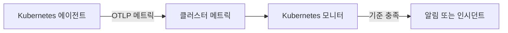

# Kubernetes 모니터

Kubernetes 모니터는 OneUptime Kubernetes 에이전트가 클러스터에서 보내는 메트릭(노드, Pod, 컨테이너, 워크로드, 오토스케일러, 컨트롤 플레인)으로 알림을 보냅니다. 미리 만들어진 알림 템플릿에서 시작하거나, 메트릭 하나를 고르거나, 직접 쿼리를 작성한 뒤 알림이나 인시던트를 여는 임계값을 설정합니다.

:::cards
- [에이전트 설치](/docs/monitor/kubernetes-agent): Helm 명령 하나로 클러스터를 OneUptime에 연결합니다.
- [모니터 만들기](#kubernetes-모니터-만들기): 클러스터를 고른 다음 템플릿, 메트릭, 쿼리 중 하나를 고릅니다.
- [알림 템플릿](#미리-만들어진-알림-템플릿): CrashLoopBackOff부터 etcd까지 17개의 미리 만들어진 알림.
- [기준](#모니터링-기준): 정적 임계값과 이상 탐지.
:::

## 작동 방식

에이전트는 클러스터의 메트릭을 OTLP로 OneUptime에 보내며, 각 메트릭에 클러스터 이름(`k8s.cluster.name`, 차트의 `clusterName`)을 붙입니다. 새 이름에서 온 첫 데이터가 클러스터를 **Kubernetes** 에 등록하고, 그때부터 Kubernetes 모니터에서 그 클러스터를 고를 수 있습니다. 모니터는 매분 자신의 **시간 범위** 동안 그 메트릭을 조회하고 집계해, 결과를 기준과 비교합니다.

## 시작하기 전에

- 클러스터에서 OneUptime Kubernetes 에이전트가 실행 중이어야 합니다. [Kubernetes 에이전트(Helm 설치)](/docs/monitor/kubernetes-agent)를 참고하세요. 설치 후 몇 분 안에 클러스터가 **Kubernetes** 에 나타납니다.
- 컨트롤 플레인 템플릿(**etcd No Leader**, **API Server Request Saturation**, **Scheduler Backlog**)에는 에이전트의 컨트롤 플레인 수집 `controlPlane.enabled`가 필요합니다. 관리형 클러스터(EKS, GKE, AKS)는 이 엔드포인트를 노출하지 않으므로, 그곳에서는 이 모니터들이 데이터를 받지 못합니다.

## Kubernetes 모니터 만들기

:::steps
### 새 모니터 시작

**모니터** 로 이동해 **모니터 생성** 을 클릭합니다. **더 많은 모니터 유형** 에서 **Kubernetes** 를 고르거나, 검색 상자에 `k8s`를 입력합니다.

### 클러스터 선택

**Kubernetes 클러스터** 에서 선택합니다. 목록에는 에이전트가 보고한 모든 클러스터가 있습니다.

### 감시할 대상 선택

세 탭 중 하나를 사용합니다.

| 탭 | 선택하는 내용 |
| --- | --- |
| **Quick Setup** | [미리 만들어진 알림 템플릿](#미리-만들어진-알림-템플릿). 메트릭, 범위, 시간 범위, 기준을 채웁니다. **시간 범위** 는 계속 바꿀 수 있습니다. |
| **Custom Metric** | [메트릭 카탈로그](#메트릭-카탈로그)의 메트릭 하나와 그 **리소스 범위**, 필터, **집계**(평균, 최대, 최소, 합계, 개수), **시간 범위**. |
| **고급** | **리소스 범위**, 필터, **시간 범위**, 그리고 **메트릭 선택** 아래의 직접 만든 메트릭 쿼리와 수식. 결과의 실시간 차트가 함께 표시됩니다. |

### 기준 설정

모니터가 상태를 바꾸는 시점과 알림이나 인시던트를 여는 시점을 설정합니다. [모니터링 기준](#모니터링-기준)을 참고하세요. 템플릿을 썼다면 이미 채워져 있으니 임계값, 심각도, 온콜 정책을 검토합니다.

### 모니터 저장

양식을 마치고 저장합니다. 모니터가 **모니터** 에 나타나고, 첫 평가부터 상태가 기준을 따릅니다.
:::

## 구성 옵션

### 리소스 범위와 필터

**리소스 범위** 는 메트릭을 평가하는 수준을 정하고, 양식에 어떤 필터가 표시될지 결정합니다. 모든 필터는 선택 사항입니다.

| 범위 | 감시 대상 | 필터 |
| --- | --- | --- |
| 클러스터 | 클러스터 전체 | — |
| 네임스페이스 | 네임스페이스 안의 리소스 | **네임스페이스** |
| 워크로드 | Deployment, StatefulSet, DaemonSet, Job, CronJob | **네임스페이스**, **워크로드 이름** |
| 노드 | 클러스터 노드 | **노드 이름** |
| Pod | Pod | **네임스페이스**, **Pod 이름** |

### 시간 범위

**시간 범위** 는 모니터를 평가할 때마다 메트릭 쿼리가 다루는 기간으로, **Past 1 Minute** 부터 **Past 365 Days** 까지입니다. 짧은 기간(1~15분)은 알림에 알맞고, 긴 기간은 잡음이 많은 메트릭을 부드럽게 합니다.

### 메트릭 쿼리와 수식

**고급** 탭에서는 각 쿼리가 메트릭, 그 값의 집계 방식, 선택적인 속성 필터를 지정합니다. **수식** 은 산술 연산으로 쿼리를 결합합니다. 예를 들어 노드 사용률 템플릿은 사용량을 할당 가능한 용량으로 나눕니다.

## 메트릭 카탈로그

**Custom Metric** 탭은 리소스 유형별로 다음 메트릭을 제공합니다.

| 범주 | 메트릭 |
| --- | --- |
| Pod | Pod CPU Usage, Pod Memory Usage, Pod Phase (Code), Pod Filesystem Usage, Pod Memory Limit Utilization, Pod CPU Limit Utilization, Pod Network I/O (Cumulative, Both Directions) |
| 노드 | Node CPU Usage, Node Allocatable CPU, Node Memory Usage, Node Filesystem Usage, Node Allocatable Memory, Node Ready Condition, Node Filesystem Available |
| 컨테이너 | Container Restarts, Container CPU Limit, Container CPU Request, Container Memory Limit, Container Memory Request, Container Ready |
| 워크로드 | Deployment Available Replicas, Deployment Desired Replicas, DaemonSet Misscheduled Nodes, DaemonSet Ready Nodes, StatefulSet Ready Replicas, Job Failed Pods, Job Successful Pods |
| HPA | HPA Current Replicas, HPA Desired Replicas, HPA Max Replicas, HPA Min Replicas |
| 컨트롤 플레인 | etcd Has Leader, API Server In-Flight Requests, Scheduler Pending Pods |

> [!NOTE]
> **Pod CPU Usage** 와 **Node CPU Usage** 의 단위는 퍼센트가 아니라 코어입니다. `0.18`은 코어의 0.18입니다. **Pod Phase (Code)** 메트릭은 코드(1 Pending, 2 Running, 3 Succeeded, 4 Failed, 5 Unknown)이므로 최대 또는 최소로 집계하고, 합계는 쓰지 마세요. 컨트롤 플레인 메트릭은 에이전트의 컨트롤 플레인 수집이 켜져 있을 때만 들어옵니다.

## 모니터링 기준

### 평가 대상

이 모니터들은 항상 **Metric Value**, 즉 구성한 메트릭 쿼리나 수식의 값을 평가합니다. 기준 양식에는 필터 유형 선택이 없고, **메트릭**, **집계**, **조건**, **Threshold** 가 표시됩니다.

### 집계 유형

| 집계 | 설명 |
| --- | --- |
| 평균 | 기간 동안의 평균값 |
| 합계 | 모든 값의 합 |
| Maximum Value | 기간 중 가장 높은 값 |
| Minimum Value | 기간 중 가장 낮은 값 |
| All Values | 모든 값이 기준과 일치해야 함 |
| Any Value | 하나 이상의 값이 일치하면 됨 |

### 조건

정적 임계값은 입력한 **Threshold** 와 비교됩니다. **Greater Than**, **Less Than**, **Greater Than Or Equal To**, **Less Than Or Equal To**, **Equal To** 가 있습니다.

기준선 이상 탐지에는 임계값이 필요 없습니다. 다음 조건 중 하나를 고르면 양식에 대신 **민감도** 와 **기준선 기간** 이 표시됩니다.

| 조건 | 값이 다음과 같을 때 일치 |
| --- | --- |
| **Anomalously High** | 예상 범위보다 올라감 |
| **Anomalously Low** | 예상 범위보다 내려감 |
| **Anomalous** | 어느 방향으로든 예상 범위를 벗어남 |

각 샘플은 **기준선 기간**(기본 14일, 그 밖에 28, 60, 90일)으로 만든, 같은 요일·같은 시간대의 기준선과 비교됩니다. **민감도** 는 예상 범위의 폭을 정합니다. **낮음 (4σ — 심각한 편차만)**, 기본값인 **중간 (3σ — 권장)**, **높음 (2σ — 노이즈가 많음, 매우 안정적인 서비스)** 중에서 고릅니다. 이상 조건은 선택한 기준선 기간 이상의 메트릭 기록이 쌓일 때까지 "Learning" 상태로 남으며 알림을 만들지 않습니다.

**추가 필드** 아래의 **데이터가 없는 경우** 는 기간 동안 쿼리가 아무것도 반환하지 않을 때의 동작을 정합니다. **Ignore**(기본값)는 일치하지 않고, **트리거** 는 무응답을 문제로 취급하며, **Treat As Zero** 는 0으로 비교합니다. OneUptime 자체가 데이터를 받지 못한 시간은 절대 데이터 없음으로 취급되지 않습니다. 그런 시간이 포함된 기간의 확인은 대신 기다리며, 자세한 내용은 [OneUptime이 데이터를 받지 못할 때](/docs/monitor/when-oneuptime-is-not-receiving)에서 설명합니다.

## 미리 만들어진 알림 템플릿

**Quick Setup** 탭은 다음 템플릿을 범주별로 보여 줍니다. 각 템플릿은 두 개의 기준을 채웁니다. 하나는 조건이 유지되는 동안 모니터를 오프라인으로 표시하고 인시던트와 알림을 열며, 다른 하나는 조건이 해소되면 모니터를 다시 온라인으로 돌립니다.

| 템플릿 | 범주 | 작동 조건 | 심각도 |
| --- | --- | --- | --- |
| CrashLoopBackOff Detection | 워크로드 | Pod가 생성된 이후 컨테이너가 5번 넘게 다시 시작됨 | 심각 |
| Pod Stuck in Pending | 예약 중 | 15분 기간의 모든 샘플에서 어떤 Pod가 Pending 단계에 있음 | Warning |
| Node Not Ready | 노드 | 노드가 NotReady를 보고함 | 심각 |
| High Node CPU Utilization | 노드 | 노드의 평균 CPU 사용량이 할당 가능한 CPU의 90%를 넘음 | Warning |
| High Node Memory Utilization | 노드 | 노드의 평균 메모리 사용량이 할당 가능한 메모리의 85%를 넘음 | Warning |
| Deployment Replica Mismatch | 워크로드 | Deployment의 사용 가능한 레플리카가 15분 동안 원하는 수보다 적음 | Warning |
| Job Failures | 워크로드 | Job에 실패한 Pod가 있음 | Warning |
| etcd No Leader | 컨트롤 플레인 | etcd에 선출된 리더가 없음 | 심각 |
| API Server Request Saturation | 컨트롤 플레인 | API 서버가 기간 내내 처리 중인 요청을 200개 이상 보유함 | 심각 |
| Scheduler Backlog | 예약 중 | 스케줄러의 대기 중인 Pod 큐가 5분 동안 비지 않음 | Warning |
| High Node Disk Usage | 스토리지 | 노드의 파일 시스템이 90% 넘게 참 | Warning |
| DaemonSet Misscheduled Nodes | 워크로드 | DaemonSet이 노드 셀렉터, 어피니티, 톨러레이션에 더 이상 맞지 않는 노드에서 Pod를 실행함 | Warning |
| High Node CPU Request Commitment | 노드 | 노드의 컨테이너 CPU 요청 합계가 할당 가능한 CPU의 90%를 넘음 | Warning |
| High Node Memory Request Commitment | 노드 | 노드의 컨테이너 메모리 요청 합계가 할당 가능한 메모리의 90%를 넘음 | Warning |
| HPA Saturated at Max Replicas | 워크로드 | HPA가 `maxReplicas`의 90% 이상으로 실행됨 | 심각 |
| Pod Memory Saturating Container Limit | 워크로드 | Pod가 컨테이너 메모리 한도의 90% 넘게 사용함 | 심각 |
| Pod CPU Saturating Container Limit | 워크로드 | Pod가 컨테이너 CPU 한도의 90% 넘게 사용함 | Warning |

객체별 메트릭을 쓰는 템플릿은 노드, Pod, Deployment, Job, DaemonSet, HPA를 각각 따로 평가합니다. 그래서 비정상 Pod가 여러 개인 클러스터는 클러스터 전체에 하나가 아니라 Pod마다 인시던트를 받습니다.

> [!NOTE]
> **CrashLoopBackOff Detection** 템플릿은 비율이 아니라 현재 Pod에서 컨테이너가 다시 시작된 누적 횟수를 읽습니다. 크래시 루프에 빠졌다가 회복한 컨테이너는 그 Pod가 교체될 때까지 알림을 열어 둡니다.

### 증상이 아니라 원인을 잡기

노드 수준 템플릿(High Node CPU Utilization, High Node Memory Utilization, Node Not Ready, Pod Stuck in Pending)은 리소스 고갈 연쇄의 *끝*, 즉 클러스터가 이미 성능이 저하된 시점에 작동합니다. 세 템플릿은 그 연쇄의 *시작* 에서 작동하며, 대개 해결책도 그곳에 있습니다.

- **Pod Memory Saturating Container Limit** 와 **Pod CPU Saturating Container Limit** 는 자신의 한도에 붙어 있는 워크로드를 잡습니다. 메모리 한도를 넘으면 즉시 OOMKill되고, CPU 한도를 넘으면 커널이 Pod를 스로틀링해 오류 없이 느려집니다. 둘 다 CrashLoopBackOff와 원인 모를 지연의 흔한 원인입니다.
- **HPA Saturated at Max Replicas** 는 여유가 남지 않은 오토스케일러를 잡습니다. Pod당 한도가 너무 낮은 워크로드는 스로틀링되거나 종료되고, 이것이 HPA가 확장 기준으로 삼는 바로 그 메트릭을 부풀립니다. 그래서 오토스케일러는 똑같이 자원이 부족한 레플리카를 상한에 닿을 때까지 계속 추가합니다. 해결책은 한도를 올리는 것이며, `maxReplicas`를 올리면 더 나빠집니다.

자동 확장되는 워크로드를 실행하는 모든 네임스페이스에서 이들을 함께 켜세요. 이 조합으로 "정말 용량이 더 필요함"과 "Pod당 자원이 부족함"을 구분할 수 있습니다.

> [!NOTE]
> 두 Pod 한도 템플릿은 Pod의 사용량을 컨테이너 한도의 **합** 으로 나누므로, 사이드카가 있는 Pod도 올바르게 측정됩니다. kubelet의 Pod 메모리 수치에는 회수 가능한 페이지 캐시가 포함되므로, 파일을 많이 쓰는 워크로드는 OOMKill되지 않은 채 메모리 템플릿에서 높게 나타날 수 있습니다. "곧 종료됨"이 아니라 "한도에 가까워짐"으로 읽으세요.

## 문제 해결

:::details 클러스터가 Kubernetes 클러스터 목록에 없음
클러스터는 에이전트를 설치할 때 쓴 `clusterName`으로, 에이전트의 데이터에서 스스로 등록됩니다. 에이전트의 Pod가 실행 중인지, 클러스터가 **제품 → 인프라 → Kubernetes → 모든 클러스터** 에 있는지 확인하세요. [Kubernetes 에이전트(Helm 설치)](/docs/monitor/kubernetes-agent)에서 설치 방법과 데이터가 들어오지 않을 때 확인할 사항을 설명합니다.
:::

:::details 컨트롤 플레인 템플릿이 작동하지 않음
**etcd No Leader**, **API Server Request Saturation**, **Scheduler Backlog** 는 에이전트의 컨트롤 플레인 수집만 모으는 메트릭을 읽습니다. 에이전트의 Helm 값에서 `controlPlane.enabled`를 켜세요. 기본값은 꺼짐입니다. 관리형 클러스터(EKS, GKE, AKS)는 이 엔드포인트를 노출하지 않으므로, 그곳에서는 이 모니터들이 데이터를 받지 못합니다.
:::

:::details CPU 임계값이 작동하지 않음
**Pod CPU Usage** 와 **Node CPU Usage** 의 단위는 퍼센트가 아니라 코어이므로, 임계값 `80`은 80코어를 뜻합니다. 임계값을 코어 단위로 정하거나, 퍼센트를 비교하는 **High Node CPU Utilization** 또는 **Pod CPU Saturating Container Limit** 에서 시작하세요.
:::

:::details Pod가 회복한 뒤에도 CrashLoopBackOff Detection이 열려 있음
템플릿은 현재 Pod에서 컨테이너가 다시 시작된 누적 횟수를 읽으므로, 한 번 5를 넘으면 다시 내려가지 않습니다. 알림은 재배포, 축출, 노드 드레인 등으로 Pod가 교체되면 해결됩니다.
:::

## 다음 단계

:::cards
- [Kubernetes 에이전트(Helm 설치)](/docs/monitor/kubernetes-agent): Helm으로 에이전트를 설치, 업그레이드, 조정합니다.
- [Kubernetes 에이전트](/docs/telemetry/kubernetes-agent): 네임스페이스 필터, 컨트롤 플레인 메트릭, 로그 심각도 필터, AI 에이전트.
- [메트릭 모니터](/docs/monitor/metrics-monitor): 에이전트의 사용자 지정 메트릭과 eBPF 메트릭을 포함한 모든 메트릭으로 알림을 보냅니다.
- [인시던트 및 알림 템플릿](/docs/monitor/incident-alert-templating): 임계값을 넘은 Pod나 노드를 인시던트 제목에 넣습니다.
:::
