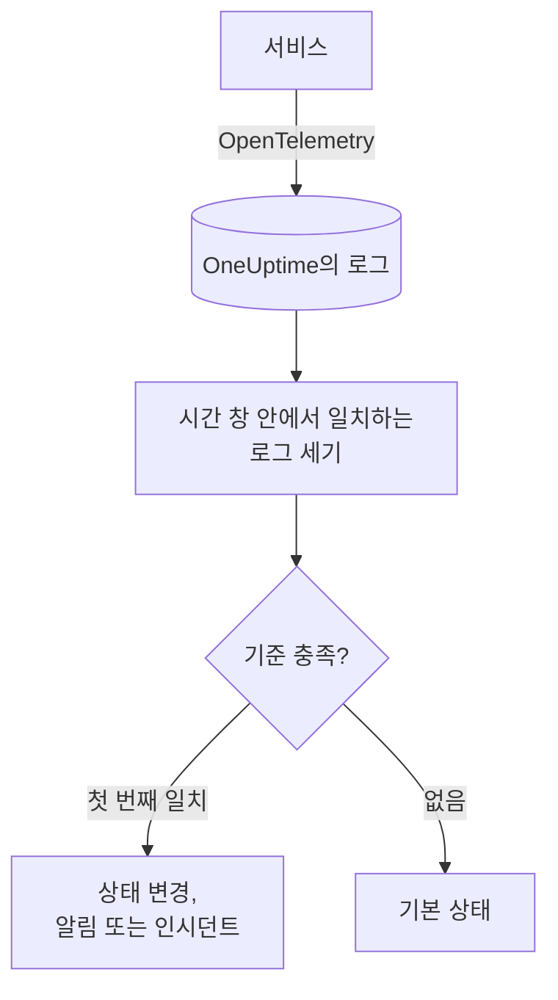
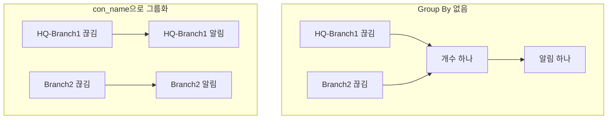

# 로그 모니터

로그 모니터는 서비스가 OneUptime에 보내는 로그 중 필터(텍스트, 심각도, 서비스, 속성)와 일치하는 로그를 시간 창 안에서 셉니다. 그 수가 기준을 충족하면 모니터의 상태를 바꾸거나, 알림을 만들거나, 인시던트를 선언합니다. 오류 급증, 특정 오류 메시지, 로그를 더 이상 남기지 않는 서비스를 알아차리는 데 사용합니다.

:::cards
- [모니터 만들기](#로그-모니터-만들기): 셀 로그와 알림을 보낼 시점을 고릅니다.
- [평가 방식](#평가-방식): 시간 창, 개수, 1분 주기.
- [기준](#기준): 임곗값, 이상 감지, 기본값.
- [그룹별 알림](#그룹별-알림group-by): 터널, 사용자, 인터페이스마다 알림 하나.
:::

## 작동 방식



OneUptime은 매분 모니터의 필터와 일치하고 시간 창 안에 도착한 로그를 셉니다. 그 수를 모니터의 기준과 위에서부터 차례로 비교하고, 처음 일치하는 기준이 무슨 일이 일어날지 결정합니다. 일치하는 기준이 없으면 모니터는 기본 상태로 돌아갑니다.

## 시작하기 전에

- 서비스가 OpenTelemetry(또는 OneUptime이 수집하는 다른 로그 소스)로 OneUptime에 로그를 보내고 있어야 합니다. [OpenTelemetry](/docs/telemetry/open-telemetry)를 참고하세요.
- 터널 이름이나 사용자 이름처럼 로그 줄 안의 값으로 필터링하거나 그룹화하려면, 먼저 [로그 파이프라인](/docs/telemetry/log-pipelines)으로 그 값을 속성으로 만드세요.

## 로그 모니터 만들기

:::steps
### 새 모니터 시작

**모니터**로 이동해 **모니터 생성**을 클릭합니다.

### Logs 선택

**모니터 유형**에서 **더 많은 모니터 유형**을 클릭하고 **텔레메트리** 아래의 **로그**를 선택하거나, 검색 상자에 `logs`를 입력합니다. **이름**을 입력하고 **다음**을 클릭합니다.

### 셀 로그 선택

**로그 모니터 구성**에서 **이 텍스트를 포함하는 모니터 로그**, **(시간) 동안의 모니터 로그**, **로그 심각도**를 설정합니다. 비워 둔 필터는 모든 로그와 일치합니다. 필터 아래의 **로그 미리보기**에 지금 일치하는 로그가 표시됩니다.

### 범위 좁히기(선택 사항)

**추가 필드**를 열어 텔레메트리 서비스, 인프라 엔터티, 속성으로 필터링합니다. 모니터 전체에 알림 하나가 아니라 터널, 사용자, 인터페이스마다 알림 하나를 받으려면 **Group by Attributes**에 속성을 추가합니다([그룹별 알림](#그룹별-알림group-by) 참고).

### 기준 설정

**모니터 기준** 카드는 두 가지 기준으로 시작합니다. 일치하는 로그가 없으면 인시던트와 함께 오프라인, 하나 이상 일치하면 온라인입니다. 알림을 받고 싶은 내용에 맞게 바꾸세요([기준](#기준) 참고).

### 모니터 만들기

**모니터 생성**을 클릭합니다. 모니터가 **개요** 페이지로 열리고 1분 안에 첫 평가가 실행됩니다.
:::

## 조회 대상

| 필드 | 일치 대상 | 기본값 |
| --- | --- | --- |
| **이 텍스트를 포함하는 모니터 로그** | 본문에 이 텍스트가 포함된 로그. 대소문자를 구분하지 않습니다. | 비어 있음: 모든 로그 |
| **(시간) 동안의 모니터 로그** | 최근 5초부터 최근 24시간까지의 로그. | **지난 1분** |
| **로그 심각도** | 선택한 심각도 중 하나를 가진 로그. | 비어 있음: 모든 심각도 |
| **Group by Attributes** | 필터가 아닙니다. 이 속성 값의 조합마다 따로 셉니다. | 비어 있음: 개수 하나 |
| **텔레메트리 서비스로 필터링**(**추가 필드** 안) | 선택한 서비스 중 하나에서 온 로그. | 비어 있음: 모든 서비스 |
| **Filter by Infrastructure Entity**(**추가 필드** 안) | 선택한 호스트, 파드, 컨테이너 및 기타 엔터티 중 하나에서 온 로그. | 비어 있음: 모든 엔터티 |
| **속성으로 필터링**(**추가 필드** 안) | 속성이 모든 조건을 충족하는 로그. 조건마다 "같음", "포함" 같은 자체 연산자가 있습니다. | 비어 있음: 조건 없음 |

로그가 세어지려면 설정한 모든 필터와 일치해야 합니다.

### 로그 심각도

각 로그는 일곱 가지 심각도 중 하나로 저장됩니다. OpenTelemetry 로그에서는 심각도가 로그의 심각도 번호에서 정해지므로, 로거가 출력한 텍스트가 아니라 심각도로 선택하세요.

| 심각도 | OpenTelemetry 심각도 번호 |
| --- | --- |
| **트레이스** | 1–4 |
| **Debug** | 5–8 |
| **Information** | 9–12 |
| **Warning** | 13–16 |
| **오류** | 17–20 |
| **Fatal** | 21–24 |
| **지정되지 않음** | 그 밖의 모든 것 |

## 평가 방식

- **매분.** 로그 모니터는 프로브가 확인하지 않으므로 설정할 간격도, **프로브 및 간격** 페이지도 없습니다.
- **평가마다 숫자 하나.** 모니터는 모든 필터와 일치하고, 평가 전 **(시간) 동안의 모니터 로그** 안에 도착한 로그를 셉니다. **지난 5분**이면 평가마다 5분 전까지 살펴보므로 연속된 평가의 창이 겹칩니다.
- **로그가 없으면 개수는 0입니다.** 로그를 더 이상 남기지 않는 서비스는 0이 되며, 기본 오프라인 기준이 바로 이것을 찾습니다.
- **OneUptime 자체의 중단은 침묵이 아닙니다.** OneUptime 자체가 데이터를 받지 못한 시간(재시작, 업그레이드, 밀린 작업 처리 중)이 시간 창에 들어 있는 동안 확인은 기다립니다. 상태가 바뀌지 않으며, 인시던트나 알림이 열리거나 해결되지도 않습니다. [OneUptime이 데이터를 받지 못할 때](/docs/monitor/when-oneuptime-is-not-receiving)를 참고하세요.
- **기준은 위에서부터.** 처음 일치하는 기준이 결정하므로 가장 심각한 기준을 맨 위에 두세요. 그룹화된 모니터는 다르게 동작하며, 그룹마다 모든 기준을 확인합니다([기준 평가 방식이 다릅니다](#기준-평가-방식이-다릅니다) 참고).

모든 상태 변경은 그 이유와 함께 모니터의 **상태 타임라인**에 기록됩니다.

## 기준

로그 모니터의 기준에는 **필터 유형**이 하나뿐입니다. 창 안에서 일치한 로그의 수인 **Log Count**입니다. **필터 조건**을 고르고, 임곗값 조건이면 **값**도 정합니다.

| 필터 조건 | 로그 수가 다음과 같을 때 일치 |
| --- | --- |
| **Greater Than** | 값보다 큼 |
| **Greater Than Or Equal To** | 값 이상 |
| **Less Than** | 값보다 작음 |
| **Less Than Or Equal To** | 값 이하 |
| **Equal To** | 값과 정확히 같음 |
| **Anomalously High** | 이번 주의 이 시간대에 예상되는 범위보다 높음 |
| **Anomalously Low** | 그 범위보다 낮음 |
| **Anomalous** | 어느 방향으로든 그 범위를 벗어남 |

이상 조건에는 **값**이 없습니다. **민감도**(Low, 기본값인 Medium, High)와 14일(기본값), 28일, 60일, 90일 중 **기준선 기간**을 고릅니다. OneUptime은 개수를 분당 비율로 바꾸어 그 기간 동안의 같은 요일·시간대와 비교합니다. 기준선은 모니터의 서비스와 심각도만 대상으로 하며, 텍스트 필터와 속성 필터는 포함하지 않습니다. 그 요일·시간대에 기록이 충분히 쌓일 때까지 기준은 아직 학습 중이며 발동하지 않습니다.

새 로그 모니터는 다음 기준으로 시작합니다.

| 기준 | 필터 | 효과 |
| --- | --- | --- |
| Check if … is offline | **Log Count** **Equal To** `0` | 모니터를 오프라인으로 표시하고 인시던트를 선언합니다(자동 해결) |
| Check if … is online | **Log Count** **Greater Than** `0` | 모니터를 온라인으로 표시합니다 |

> [!TIP]
> 침묵이 아니라 오류에 대해 알림을 받으려면 **로그 심각도**를 **오류**로 설정하고, 오프라인 기준을 **Log Count** **Greater Than** 창 안에서 허용할 오류 수로 바꾸세요.

## 실전 예: 오류 급증

checkout 서비스가 5분 동안 50개가 넘는 오류를 기록하면 인시던트를 만들고 싶다고 합시다.

- **로그 심각도**: **오류**
- **(시간) 동안의 모니터 로그**: **지난 5분**
- **텔레메트리 서비스로 필터링**: `checkout`
- 기준 1: **Log Count** **Greater Than** `50`: 모니터를 오프라인으로 표시하고 인시던트 선언
- 기준 2: **Log Count** **Less Than Or Equal To** `50`: 모니터를 온라인으로 표시

연속된 네 번의 평가:

| 시각 | 최근 5분간의 오류 로그 | 일치하는 기준 | 일어나는 일 |
| --- | --- | --- | --- |
| 10:00 | 12 | 2 | 모니터가 온라인입니다. |
| 10:01 | 64 | 1 | 모니터가 오프라인이 되고 인시던트가 선언됩니다. |
| 10:02 | 81 | 1 | 오프라인 상태가 유지됩니다. 인시던트가 이미 열려 있으므로 두 번째 인시던트는 선언되지 않습니다. |
| 10:06 | 9 | 2 | 모니터가 다시 온라인이 되고, **인시던트 자동 해결**이 켜져 있으므로 인시던트가 저절로 해결됩니다. |

창이 겹치기 때문에 한 번의 오류 폭주가 끝난 뒤에도 최대 5분 동안 개수가 높게 유지됩니다. 더 빨리 회복해야 하는 모니터에는 더 짧은 창을 사용하세요.

## 그룹별 알림(Group By)

**Group by Attributes**는 로그 모니터의 개수를 서로 다른 속성 값 조합마다(IPsec 터널마다, VPN 사용자마다, 방화벽 인터페이스마다) 하나씩 나누고, 그룹마다 따로 기준을 평가합니다. 메트릭 모니터의 [Group By](/docs/monitor/metrics-monitor#시리즈별-알림group-by)에 해당하는 로그 기능입니다.

### 그룹마다 알림 하나

Group By가 없으면 종료된 IPsec 터널을 지켜보는 모니터는 모니터 전체에 대한 개수 하나이며, **모니터 전체에 알림 하나**를 보냅니다. 그 알림이 열려 있는 동안 두 번째 터널이 끊겨도 새로운 일은 일어나지 않습니다. 모니터가 이미 알림 중이기 때문입니다.

터널 이름으로 Group By를 설정하면 `HQ-Branch1` 터널의 종료가 자체 알림을 열고, 10분 뒤 `Branch2` 터널의 종료가 그 옆에 **두 번째 별도 알림**을 엽니다.



### 독립적인 해결

각 그룹의 알림이나 인시던트는 따로 해결됩니다. 어떤 그룹이 더 이상 기준을 충족하지 않으면(`HQ-Branch1`이 시간 창 안에서 더 이상 종료를 기록하지 않으면) 그 알림은 해결되지만, `Branch2`의 알림은 `Branch2`도 멈출 때까지 열려 있습니다. 한 그룹이 회복된다고 다른 그룹의 알림이 닫히는 일은 없습니다.

로그 모니터는 상태가 아니라 이벤트를 봅니다. 그룹의 알림은 그 그룹이 시간 창 전체 동안 기준을 충족하는 것을 아무것도 기록하지 않으면 해결되며, 터널이 다시 올라왔는지와는 관계없습니다.

### 예: Sophos IPsec 터널마다 알림 하나

여기서는 방화벽의 syslog 줄이 대상 접두사 없이 [Key=Value 파서](/docs/telemetry/log-pipelines#keyvalue-parser)로 속성에 나뉘어, 터널 이름이 `con_name` 속성이 된다고 가정합니다.

```text
log_component="IPSec" con_name="HQ-Branch1" status="Terminated" message="IPSec Connection HQ-Branch1 between 10.171.4.117 and 10.171.4.118 for Child HQ-Branch1 terminated."
```

:::steps
1. **로그** 모니터를 만듭니다.
2. **이 텍스트를 포함하는 모니터 로그**를 `terminated`로, **(시간) 동안의 모니터 로그**를 **지난 5분**으로 설정합니다.
3. **추가 필드**에서 속성 필터 `log_component` = `IPSec`을 추가합니다.
4. **Group by Attributes**에 `con_name`을 추가합니다.
5. 필터 **Log Count** **Greater Than** `0`으로 제목이 `IPsec tunnel {{con_name}} terminated`인 알림이나 인시던트를 만드는 기준을 추가합니다.
:::

이제 종료를 기록한 터널마다 자체 알림(`IPsec tunnel HQ-Branch1 terminated`, `IPsec tunnel Branch2 terminated`)을 받고, 각 알림은 따로 해결됩니다.

### 제목과 설명의 그룹 값

각 Group By 속성의 값은 메트릭 시리즈의 레이블처럼 알림이나 인시던트의 제목, 설명, 해결 메모에서 쓸 수 있는 [템플릿 변수](/docs/monitor/incident-alert-templating)입니다. `con_name`으로 그룹화하면 `{{con_name}}`을 쓸 수 있습니다. 점이 들어간 키는 경로로 읽히므로 `sophos.con_name`은 `{{sophos.con_name}}`이 됩니다. 제목에 아직 그룹이 드러나지 않으면 그룹이 덧붙여지며(`IPsec tunnel terminated - Con Name: HQ-Branch1`), `{{seriesResourceSuffix}}`와 `{{seriesResourceSummary}}`는 메트릭 모니터에서와 같이 동작합니다.

### 그룹을 세는 방식

- 속성은 최대 10개입니다. 값의 서로 다른 조합마다 그룹이 하나씩 생깁니다.
- Group By 속성이 없는 로그는 그 속성을 **빈 값**으로 세므로, 속성이 없는 로그끼리 자체 그룹을 이루고 그 그룹의 알림에는 해당 속성 값이 표시되지 않습니다. 모든 알림이 그룹 값 없이 도착한다면 속성의 키를 확인하세요. 대상 접두사가 있는 로그 파이프라인은 `con_name`을 `sophos.con_name`으로 저장합니다.
- 256자를 넘는 그룹 값은 256자로 잘립니다.
- 확인 한 번에 평가되는 그룹은 최대 **100개 그룹**으로, 로그가 가장 많은 100개입니다. 더 많은 그룹이 일치하면 나머지는 그 확인에서 건너뛰고 경고가 기록됩니다. 그 그룹들까지 다루려면 모니터의 필터를 좁히세요.

### 기준 평가 방식이 다릅니다

- **모든 기준이 평가됩니다.** 그룹화된 메트릭 모니터와 마찬가지로, 서로 다른 그룹이 동시에 서로 다른 기준을 충족할 수 있습니다. 두 기준을 충족하는 그룹도 첫 번째 기준에서 나온 알림 하나만 받으므로, 기준을 가장 심각한 것부터 순서대로 두세요.
- **그룹은 시간 창 안에 무언가를 기록했을 때만 존재합니다.** 따라서 **Equal To 0**과 **Less Than** 기준은 적어도 한 번 기록한 그룹에 대해서만 발동합니다. 로그가 아예 들어오지 않을 때 알림을 받으려면 Group By가 없는 모니터를 사용하세요.
- **이상 감지**(**Anomalously High**, **Anomalously Low**, **Anomalous**)는 그룹별로 평가되지 않으므로(기준선이 모니터 전체를 대상으로 함), 그룹화된 모니터에서는 이 필터가 절대 일치하지 않습니다.
- 모니터의 상태는 어떤 그룹이든 처음 충족한 기준을 따릅니다. 어떤 그룹도 어떤 기준도 충족하지 않으면 모니터는 기본 상태로 돌아갑니다.

## 문제 해결

:::details 모니터가 오프라인인데 서비스는 로그를 남기고 있음
개수가 0이었으므로 필터가 서비스가 보내는 로그와 하나도 일치하지 않습니다. 모니터의 **기준** 페이지(**구성** 아래)를 열고 **Edit Monitoring Criteria**를 클릭하면 **로그 미리보기**에서 필터가 지금 선택하는 항목을 볼 수 있습니다. 흔한 원인은 심각도 번호가 아니라 로거가 출력하는 텍스트로 심각도를 고른 경우([로그 심각도](#로그-심각도) 참고), 일치하지 않는 서비스 또는 속성 필터, 그리고 서비스의 로그 사이 간격보다 짧은 시간 창입니다.
:::

:::details 급증이 있었는데 알림이 없었음
기준은 위에서부터 확인되며 첫 번째 일치가 결정합니다. **Log Count** **Greater Than** `0` 같은 넓은 기준이 예상한 기준보다 위에 있으면 그 기준이 먼저 일치해 나머지를 막습니다. 가장 심각한 기준을 맨 위에 두세요.
:::

:::details 이상 기준이 전혀 발동하지 않음
아직 학습 중입니다. 비교 대상인 요일·시간대에 기록이 아직 충분하지 않습니다. **Group by Attributes**가 설정된 모니터에서는 이상 조건이 절대 일치하지 않으므로 그곳에서는 임곗값을 사용하세요.
:::

:::details 그룹 알림이 그룹 값 없이 도착함
Group By 속성이 없는 로그는 빈 값으로 셉니다. 로그 탐색기에서 키의 정확한 이름을 확인하세요. 대상 접두사가 있는 로그 파이프라인은 `con_name`을 `sophos.con_name`으로 저장합니다.
:::

## 다음 단계

:::cards
- [로그 파이프라인](/docs/telemetry/log-pipelines): 로그 줄을 속성으로 나누어 필터링과 그룹화에 씁니다.
- [인시던트 및 알림 템플릿](/docs/monitor/incident-alert-templating): 그룹 값과 개수를 제목과 설명에 넣습니다.
- [메트릭 모니터](/docs/monitor/metrics-monitor): 메트릭에 대해 호스트별 또는 컨테이너별로 알림을 받습니다.
- [트레이스 모니터](/docs/monitor/traces-monitor): 실패한 스팬에 대해 같은 방식으로 알림을 받습니다.
:::
