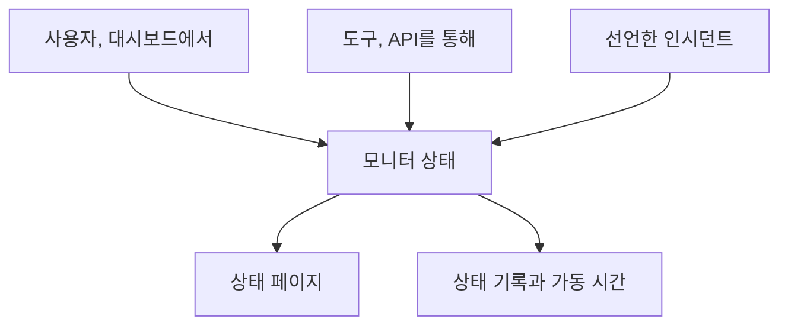

# 수동 모니터

수동 모니터에는 자동 확인이 없습니다. 상태는 대시보드나 API로 설정한 그대로입니다. 타사 의존성, 물리적 시스템, 비즈니스 프로세스처럼 OneUptime이 스스로 확인할 수 없는 대상을 상태 페이지와 인시던트에 나타내는 데 사용하세요.

:::cards
- [만들기](#수동-모니터-만들기): 대시보드에서 한 단계.
- [상태 바꾸기](#상태-업데이트): 대시보드에서, 또는 API를 통해 자체 도구에서.
- [인시던트와 알림](#인시던트와-알림): 인시던트를 선언하면서 같은 단계에서 상태를 설정합니다.
:::

## 수동 모니터를 사용하는 경우

| 사용 사례 | 설명 |
| --- | --- |
| 타사 서비스 | 의존하지만 직접 모니터링할 수 없는 외부 서비스의 상태를 추적합니다. |
| 물리적 인프라 | 네트워크 모니터링이 없는 하드웨어나 물리적 시스템을 나타냅니다. |
| 비즈니스 프로세스 | 서비스 상태에 영향을 주는 비기술적 프로세스를 추적합니다. |
| API 기반 상태 | 자체 도구가 OneUptime API로 상태를 설정하게 합니다. |
| 상태 페이지 자리 표시자 | OneUptime 밖에서 관리되는 구성 요소를 상태 페이지에 표시합니다. |

상태 페이지를 게시하는 공급자에게는 필요하지 않습니다. [외부 상태 페이지 모니터](/docs/monitor/external-status-page-monitor)가 그 페이지를 대신 따라갑니다.

## 작동 방식

수동 모니터에는 모니터링 간격, 프로브, 기준이 없습니다. 상태는 사용자, API를 쓰는 도구, 또는 선언한 인시던트가 바꿀 때까지 설정한 그대로 유지되며, 새 상태는 모니터가 표시되는 모든 곳에 표시됩니다.



변경마다 모니터의 **상태 타임라인**에 항목이 남으므로, 가동 시간과 상태 기록이 다른 모니터와 똑같이 보관됩니다. 수동 모니터는 활성 모니터가 아니므로, OneUptime Cloud에서 요금에 아무것도 더하지 않습니다.

## 수동 모니터 만들기

:::steps
### 새 모니터 시작

**모니터**로 이동해 **모니터 생성**을 클릭합니다.

### Manual 선택

**모니터 유형**에서 **더 많은 모니터 유형**을 클릭하고 **기타** 아래의 **Manual**을 선택합니다.

### 이름을 지정하고 만들기

**이름**을 입력하고(원하면 **추가 필드** 아래에 **설명**도 입력하고) **모니터 생성**을 클릭합니다. 수동 모니터에는 더 필요한 것이 없으므로 이 첫 단계에서 바로 만들어집니다.
:::

## 상태 업데이트

### 대시보드에서

:::steps
1. 모니터를 열고 사이드 메뉴에서 **상태 타임라인**을 클릭합니다.
2. **모니터 상태 이벤트 만들기**를 클릭합니다.
3. **모니터 상태**를 고릅니다. **시작**은 지금입니다. 변경이 더 일찍 일어났다면 더 이른 시간을 설정합니다.
4. **모니터 상태 이벤트 만들기**를 클릭합니다. 새 상태가 모니터와, 모니터를 보여 주는 모든 상태 페이지에 바로 표시됩니다.
:::

### API로

새 상태를 모니터 상태 이벤트로 보냅니다. `ApiKey` 헤더에는 프로젝트의 [API 키](/docs/api-reference/api-reference)를 넣습니다.

```bash
curl -X POST https://oneuptime.com/api/monitor-status-timeline \
  -H "ApiKey: $ONEUPTIME_API_KEY" \
  -H "Content-Type: application/json" \
  -d '{"data": {"monitorId": "<monitor id>", "monitorStatusId": "<monitor status id>"}}'
```

- `monitorId`는 모니터의 ID입니다. 모니터 페이지에서 **ID** 줄을 클릭하면 복사됩니다.
- `monitorStatusId`는 설정할 상태입니다. **모니터 → 설정 → 모니터 상태**에서 그 상태 행의 **ID 표시**를 고릅니다.
- `startsAt`은 선택 사항입니다. 생략하면 변경은 지금부터 시작됩니다.
- 자체 호스팅 설치에서는 `oneuptime.com` 대신 자체 호스트로 요청을 보냅니다.

모니터에 이미 있는 상태를 보내면 `Monitor Status cannot be same as previous status.`와 함께 거부되고 아무것도 기록되지 않으므로, 실행할 때마다 보고하는 도구는 이 응답을 무시해도 됩니다.

## 인시던트와 알림

수동 모니터는 모니터를 고르는 모든 곳에서 다른 모니터처럼 고를 수 있습니다.

- 인시던트를 선언하고 **모니터**에서 모니터를 고릅니다. **모니터 상태를 다음으로 변경**을 사용하면 선언과 함께 모니터의 상태도 설정되고, 인시던트를 해결하면 모니터가 다시 정상 작동으로 돌아갑니다. 단, 그 모니터에 아직 열려 있는 다른 인시던트가 있으면 돌아가지 않습니다. [인시던트 선언](/docs/incidents/declaring-incidents#2단계-영향받는-리소스)을 참고하세요.
- 고객에게 알리지 않고 팀이 처리해야 할 문제라면 모니터에 대한 알림을 만듭니다.
- 직접 지켜보는 의존성을 고객에게 보여 주려면 상태 페이지에 추가합니다.

## 다음 단계

:::cards
- [모니터 만들기](/docs/monitor/create-monitor): 대신 확인해 주는 모니터 유형들.
- [외부 상태 페이지 모니터](/docs/monitor/external-status-page-monitor): 대신 공급자의 상태 페이지를 자동으로 따라갑니다.
- [상태 페이지 개요](/docs/status-pages/index): 모니터의 상태를 고객에게 보여 줍니다.
:::
