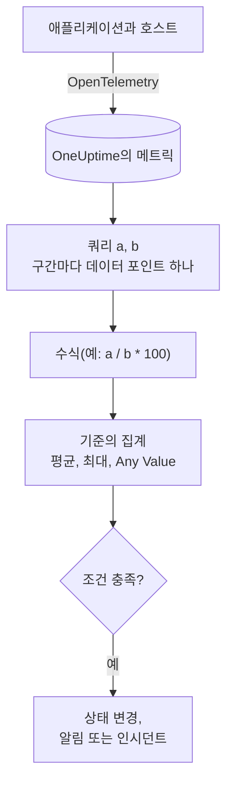

# 메트릭 모니터

메트릭 모니터는 애플리케이션과 인프라가 OneUptime에 보내는 메트릭을 조회하고, 비율이나 합계가 필요하면 수식으로 결합한 뒤, 그 결과를 이동하는 시간 범위에 걸쳐 기준과 비교합니다. 요청률, 오류율, 큐 깊이, CPU, 메모리, 디스크(모든 숫자 시리즈)에 사용하며, 그룹화하면 호스트나 컨테이너마다 알림 하나를 받을 수 있습니다.

:::cards
- [모니터 만들기](#메트릭-모니터-만들기): 쿼리, 수식, 시간 범위, 기준.
- [평가 방식](#평가-방식): 데이터 포인트, 수식, 기준의 집계.
- [실전 예](#실전-예-늘어나는-큐): 같은 데이터를 집계 방식별로 보기.
- [시리즈별 알림](#시리즈별-알림group-by): 호스트, 컨테이너, 마운트 지점마다 알림 하나.
:::

## 작동 방식

OneUptime은 매분 모니터의 각 메트릭 쿼리를 그 시간 범위에 대해 실행합니다. 쿼리는 시간 구간마다 데이터 포인트 하나를 반환하고, 수식은 구간별로 쿼리를 결합합니다. 그런 다음 각 기준이 확인하는 쿼리나 수식의 데이터 포인트를 하나로 줄이고(평균, 최대 또는 각 포인트에 대한 검사), 그 결과를 임곗값과 비교합니다.

## 시작하기 전에

- 애플리케이션이나 인프라가 OpenTelemetry로 OneUptime에 메트릭을 보내고 있어야 합니다. [OpenTelemetry](/docs/telemetry/open-telemetry)를 참고하세요.
- 메트릭의 이름과, 필터링하거나 그룹화할 속성을 알아 두세요. **메트릭**과 **Group by** 목록에는 OneUptime이 받은 이름과 속성만 표시됩니다.

## 메트릭 모니터 만들기

:::steps
### 새 모니터 시작

**모니터**로 이동해 **모니터 생성**을 클릭합니다.

### Metrics 선택

**모니터 유형**에서 **더 많은 모니터 유형**을 클릭하고 **텔레메트리** 아래의 **메트릭**을 선택하거나, 검색 상자에 `metrics`를 입력합니다. **이름**을 입력하고 **다음**을 클릭합니다.

### 시간 범위 선택

**메트릭 모니터 구성**에서 **시간 범위**를 고릅니다. 각 평가가 얼마나 과거까지 보는지입니다. 처음 값은 **Past 1 Minute**입니다.

### 메트릭 쿼리 추가

**메트릭 선택**에서 **메트릭**과 그것을 **Aggregate by**로 집계할 방법을 고릅니다. 속성으로 필터링하거나 **Group by**로 그룹화하려면 **Filters & grouping**을 엽니다. 쿼리를 하나 더 추가하려면 **메트릭 추가**를, 결합하려면 **수식 추가**를 클릭합니다. 쿼리 아래의 차트에서 시간 범위를 미리 볼 수 있으므로, 기준이 확인할 값을 볼 수 있습니다.

### 기준 설정

**모니터 기준**에서 각 기준은 확인할 **메트릭**(쿼리 또는 수식), 그 **집계**, **조건**, **Threshold**를 고릅니다. 새 모니터가 처음 갖는 기준은 [기준](#기준)을 참고하세요.

### 모니터 만들기

**모니터 생성**을 클릭합니다. 모니터가 **개요** 페이지로 열리고 1분 안에 첫 평가가 실행됩니다.
:::

## 조회 대상

### 메트릭 쿼리

| 필드 | 역할 | 기본값 |
| --- | --- | --- |
| **메트릭** | 조회할 메트릭. | 필수 |
| **Aggregate by** | 각 시간 구간의 값을 데이터 포인트 하나로 합치는 방법: 평균, 합계, Min, Max, 개수 또는 백분위수(P50, P75, P90, P95, P99). | 평균 |
| **Filter by attributes**(**Filters & grouping** 안) | 속성이 이 조건을 충족하는 시리즈만. | 필터 없음 |
| **Group by**(**Filters & grouping** 안) | 이 속성의 고유한 값마다 시리즈 하나([시리즈별 알림](#시리즈별-알림group-by) 참고). | 시리즈 하나 |

각 쿼리와 수식에는 추가한 순서대로 변수(`a`, `b`, `c` 등)가 붙습니다.

### 수식

수식은 쿼리 변수를 `+`, `-`, `*`, `/`, `%`, `^`와 괄호로 구간별로 결합합니다. 변수는 앞에 `$`를 붙여도 되고 붙이지 않아도 됩니다.

- `a / b * 100`: `b`에서 `a`가 차지하는 비율(백분율)
- `a + b`: 두 메트릭의 합
- `a - b`: 둘의 차이

### 이동 시간 창

**시간 범위**는 각 평가가 얼마나 과거까지 보는지를 정합니다: **Past 1 Minute**, **Past 5 Minutes**, **Past 10 Minutes**, **Past 15 Minutes**, **Past 30 Minutes**, **Past 1 Hour**, **Past 2 Hours**, **Past 3 Hours**, **Past 6 Hours**, **Past 12 Hours**, **Past 1 Day**, **Past 2 Days**, **Past 3 Days**, **Past 7 Days**, **Past 14 Days**, **Past 30 Days**, **Past 60 Days**, **Past 90 Days**, **Past 180 Days**, **Past 365 Days**.

범위가 길수록 각 시간 구간이 넓어지므로, 데이터 포인트 하나가 더 긴 시간을 나타냅니다.

| 시간 범위 | 데이터 포인트 하나당 |
| --- | --- |
| Past 1 Minute부터 Past 3 Hours까지 | 1분 |
| Past 6 Hours, Past 12 Hours | 5분 |
| Past 1 Day | 15분 |
| Past 2 Days, Past 3 Days | 30분 |
| Past 7 Days | 1시간 |
| Past 14 Days, Past 30 Days | 1일 |
| Past 60 Days부터 Past 180 Days까지 | 1주 |
| Past 365 Days | 1개월 |

## 평가 방식

- **매분.** 메트릭 모니터는 프로브가 확인하지 않으므로 설정할 간격도, **프로브 및 간격** 페이지도 없습니다.
- **먼저 쿼리, 그다음 수식.** 각 쿼리는 자신의 **Aggregate by**를 사용해 시간 범위의 시간 구간마다 데이터 포인트 하나를 반환합니다. 수식은 쿼리의 데이터 포인트로 구간마다 계산됩니다.
- **그다음 기준의 집계.** 각 기준은 자신의 **메트릭**의 데이터 포인트를 임곗값과 비교할 값으로 줄입니다.

| 집계 | 조건을 확인하는 대상 |
| --- | --- |
| 평균 | 데이터 포인트의 평균 |
| 합계 | 데이터 포인트의 합계 |
| Maximum Value | 가장 높은 데이터 포인트 |
| Minimum Value | 가장 낮은 데이터 포인트 |
| All Values | 모든 데이터 포인트: 모두 조건을 충족해야 함 |
| Any Value | 모든 데이터 포인트: 하나만 조건을 충족해도 충분함 |

- **기준은 위에서부터.** Group By가 없는 모니터에서는 처음 일치하는 기준이 결정하므로 가장 심각한 기준을 맨 위에 두세요. 그룹화된 모니터는 시리즈마다 모든 기준을 확인합니다([기준 평가 방식이 다릅니다](#기준-평가-방식이-다릅니다) 참고).
- **데이터 없음은 0이 아닙니다.** 쿼리가 시간 범위 안에서 데이터 포인트를 반환하지 않으면, 기준은 **추가 필드** 아래의 **데이터가 없는 경우** 설정에 따라 동작합니다: **Ignore**(기본값: 기준이 일치하지 않음), **Treat As Zero**, **트리거**.
- **OneUptime 자체의 중단은 침묵이 아닙니다.** OneUptime 자체가 데이터를 받지 못한 시간(재시작, 업그레이드, 밀린 작업 처리 중)이 시간 범위에 들어 있는 동안 확인은 기다립니다. **데이터가 없는 경우** 설정과 관계없이 상태가 바뀌지 않으며, 인시던트나 알림이 열리거나 해결되지도 않습니다. [OneUptime이 데이터를 받지 못할 때](/docs/monitor/when-oneuptime-is-not-receiving)를 참고하세요.

## 기준

이 모니터들은 항상 **Metric Value**, 즉 구성한 메트릭 쿼리나 수식의 집계 값을 평가합니다. 기준 양식에는 필터 유형 선택기가 없으며 **메트릭**, **집계**, **조건**, **Threshold**가 표시됩니다. 메트릭에 단위가 있으면 임곗값 옆에서 단위를 고릅니다.

| 조건 | 값이 다음과 같을 때 일치 |
| --- | --- |
| **Greater Than** | 임곗값보다 큼 |
| **Greater Than Or Equal To** | 임곗값 이상 |
| **Less Than** | 임곗값보다 작음 |
| **Less Than Or Equal To** | 임곗값 이하 |
| **Equal To** | 임곗값과 정확히 같음 |
| **Anomalously High** | 이번 주의 이 시간대에 예상되는 범위보다 높음 |
| **Anomalously Low** | 그 범위보다 낮음 |
| **Anomalous** | 어느 방향으로든 그 범위를 벗어남 |

이상 조건에는 임곗값이 없습니다. 대신 양식에 **민감도**(Low, 기본값인 Medium, High)와 **기준선 기간**(기본값인 14일, 28일, 60일, 90일)이 표시되며, 각 데이터 포인트를 그 기간으로 만든 같은 요일·시간대의 기준선과 비교합니다. 그 요일·시간대에 기록이 충분히 쌓일 때까지 기준은 아직 학습 중이며 알림을 만들지 않습니다.

새 메트릭 모니터는 첫 번째 쿼리에 대한 두 기준으로 시작하며, 둘 다 집계가 **Any Value**입니다.

| 기준 | 조건 | 효과 |
| --- | --- | --- |
| Check if … is offline | **Equal To** `0` | 모니터를 오프라인으로 표시하고 인시던트를 선언합니다(자동 해결) |
| Check if … is online | **Greater Than** `0` | 모니터를 온라인으로 표시합니다 |

> [!NOTE]
> 오프라인 기준은 침묵이 아니라 보고된 값 0에 발동합니다. 메트릭이 더 이상 들어오지 않을 때 알림을 받으려면 그 기준의 **데이터가 없는 경우**를 **트리거**로 설정하세요.

## 실전 예: 늘어나는 큐

checkout 큐가 계속 깊게 유지될 때 인시던트를 만들고 싶다고 합시다. 쿼리 `a`는 게이지 `checkout.queue.depth`이고 **Aggregate by**는 Max, **시간 범위**는 **Past 5 Minutes**입니다. 한 번의 평가에서 1분 단위 데이터 포인트 다섯 개가 보입니다.

| 분 | 10:01 | 10:02 | 10:03 | 10:04 | 10:05 |
| --- | --- | --- | --- | --- | --- |
| `a` | 640 | 980 | 1,500 | 1,620 | 1,100 |

**메트릭** `a`, **조건** **Greater Than**, **Threshold** `1000`인 기준은 **집계**마다 다른 답을 냅니다.

| 집계 | 1,000과 비교하는 값 | 일치? |
| --- | --- | --- |
| 평균 | 1,168 | 예 |
| 합계 | 5,840 | 예 |
| Maximum Value | 1,620 | 예 |
| Minimum Value | 640 | 아니요 |
| All Values | 640, 980, 1,500, 1,620, 1,100 | 아니요: 두 포인트가 1,000을 넘지 않음 |
| Any Value | 640, 980, 1,500, 1,620, 1,100 | 예: 1,500이 넘음 |

**평균**은 지속적인 적체에 알림을 보내고 한 번의 깊은 1분은 무시합니다. **All Values**는 범위 안의 모든 분이 깊어질 때까지 기다립니다. **Any Value**는 처음 깊어진 1분에 알림을 보냅니다.

## 시리즈별 알림(Group By)

메트릭 쿼리의 **Group by**는 그 쿼리를 고유한 속성 값마다(호스트마다, 컨테이너마다, 마운트 지점마다) 시리즈 하나로 나누며, Group By가 설정된 모니터는 각 시리즈를 독립적으로 평가합니다. 이 설정 하나가 "플릿 전체가 비정상"과 "`prod-db-01`이 비정상"의 차이를 만듭니다.

### 그룹마다 알림 하나

Group By를 `host.name`으로 설정하면, 50개 호스트를 지켜보는 디스크 사용량 모니터는 **임곗값을 넘은 호스트마다 알림(또는 인시던트) 하나**를 보냅니다. 호스트 A가 가득 차면 자체 알림이 열리고, 10분 뒤 호스트 B가 가득 차면 그 옆에 두 번째 별도 알림이 열립니다.

Group By가 없으면 같은 모니터는 스칼라 하나입니다. 쿼리가 모든 호스트를 숫자 하나로 합치고, 모니터는 **모니터 전체에 알림 하나**를 보냅니다. 그 알림이 열려 있는 동안 두 번째 호스트가 임곗값을 넘어도 아무 일도 일어나지 않으며(모니터가 이미 알림 중이므로 새로 보낼 것이 없음), 온콜 엔지니어는 호스트 B에 대해 알지 못합니다. **호스트별 알림은 Group By를 설정해야 받을 수 있습니다.** 호스트별, 컨테이너별, 마운트 지점별로 호출받고 싶다면 설정하세요.

### 독립적인 해결

그룹별 알림은 각자 자신의 그룹을 따라갑니다. 호스트 A가 다시 임곗값 아래로 내려가면 그 알림은 저절로 해결되고, 호스트 B의 알림은 호스트 B가 회복될 때까지 열려 있습니다. 한 그룹이 회복된다고 다른 그룹의 알림이 닫히는 일은 없습니다.

### 기준 평가 방식이 다릅니다

- **그룹화된 모니터는 모든 기준을 평가합니다.** 그래서 심각도 단계가 서로 다른 그룹에서 동시에 발동할 수 있습니다. "Critical: 95보다 큼"을 "Warning: 80보다 큼" 위에 두면, 같은 확인에서 96%인 호스트는 심각 알림을, 85%인 호스트는 경고 알림을 엽니다. 두 단계를 모두 넘은 호스트도 처음 일치한 기준에서 나온 알림 정확히 하나만 받으므로, **기준을 가장 심각한 것부터 순서대로 두세요**.
- **그룹화되지 않은 모니터는 처음 일치하는 기준에서 멈춥니다.** 그 기준 하나만 발동합니다. 이것도 알림 기준을 정상 기준보다 위에 두어야 하는 이유입니다. 넓은 정상 기준을 맨 위에 두면 거의 모든 확인에서 일치해, 그 아래의 알림 기준이 평가되지 않습니다.

| 호스트 | 디스크 사용량 | Critical (> 95) | Warning (> 80) | 발생한 알림 |
| --- | --- | --- | --- | --- |
| `prod-db-01` | 96% | 예 | 예 | Critical |
| `prod-db-02` | 85% | 아니요 | 예 | Warning |
| `prod-db-03` | 40% | 아니요 | 아니요 | 없음 |

### 그룹화할 속성 고르기

누군가를 호출할 만한 별개의 대상을 실제로 식별하는 속성으로 그룹화하세요. 플릿 전체의 호스트 메트릭이라면 호스트 속성, 컨테이너 메트릭이라면 컨테이너나 파드 속성, 파일 시스템이나 디스크 I/O 메트릭이라면 마운트 지점이나 장치 속성, 네트워크 메트릭이라면 인터페이스 속성입니다. **Group by** 드롭다운에는 컬렉터가 실제로 보내는 속성이 채워지므로, 키를 직접 입력하지 말고 목록에서 고르세요.

이미 시스템 전체에 대한 스칼라 하나인 메트릭(클러스터 전체의 리더 플래그, 스케줄러 적체, 단일 호스트 모니터에서 그 호스트의 CPU)은 그룹화하지 마세요. 그런 메트릭을 그룹화하면 시리즈가 정확히 하나만 나오고, 알림 제목 외에는 아무것도 바뀌지 않습니다.

그룹화 속성의 값은 알림이나 인시던트의 제목, 설명, 해결 메모에서 [템플릿 변수](/docs/monitor/incident-alert-templating)로도 쓸 수 있습니다. `host.name`으로 그룹화하면 제목을 `Disk almost full on {{host.name}}`로 만들 수 있습니다.

## 문제 해결

:::details 차트에는 초과가 보이는데 모니터가 알림을 보내지 않았음
먼저 기준의 **집계**를 확인하세요. **All Values**는 시간 범위 안의 모든 데이터 포인트가 임곗값을 넘을 때만 일치하고, **평균**은 짧은 급증을 평탄하게 만듭니다. 그다음 기준의 **메트릭**이 의도한 쿼리나 수식인지(`a`는 수식 `c`가 아님), 임곗값이 생각한 단위인지 확인하세요.
:::

:::details 메트릭이 더 이상 들어오지 않는데 아무 일도 일어나지 않았음
데이터 포인트가 없는 시간 범위는 값 0이 아닙니다. **데이터가 없는 경우**가 기본값인 **Ignore**이면 기준은 일치하지 않습니다. 침묵에 대해 알림을 받으려면 기준의 **추가 필드**에서 **트리거**로 설정하세요.
:::

:::details 플릿 전체에 알림이 하나만 옴
쿼리에 **Group by**가 없어서 모든 호스트가 숫자 하나로 합쳐집니다. 쿼리를 호스트, 컨테이너, 마운트 지점 속성으로 그룹화하세요([시리즈별 알림](#시리즈별-알림group-by) 참고).
:::

:::details 이상 기준이 전혀 발동하지 않음
아직 학습 중입니다. 비교 대상인 요일·시간대에 **기준선 기간** 안의 기록이 아직 충분하지 않습니다.
:::

## 다음 단계

:::cards
- [인시던트 및 알림 템플릿](/docs/monitor/incident-alert-templating): 호스트와 값을 알림 제목에 넣습니다.
- [로그 모니터](/docs/monitor/logs-monitor): 로그의 양과 내용에 대해 그룹별로 알림을 받습니다.
- [호스트 모니터](/docs/monitor/host-monitor): 호스트를 위한 기성 CPU, 메모리, 디스크 확인.
- [OpenTelemetry](/docs/telemetry/open-telemetry): 메트릭을 OneUptime에 보냅니다.
:::
