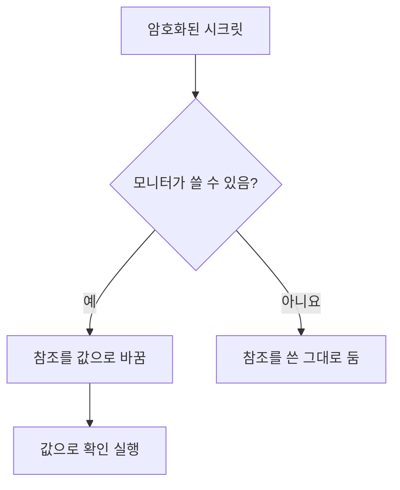

# 모니터 시크릿

모니터 시크릿은 모니터에 필요한 비밀번호, API 키, 토큰을 모니터 자체 밖에 둡니다. 값을 한 번 암호화해 저장하고, 어떤 모니터가 쓸 수 있는지 고른 다음, 모니터에서 필요한 곳에 `{{monitorSecrets.NAME}}`으로 참조합니다.

:::cards
- [시크릿 추가](#시크릿-추가): 값을 저장하고 누가 쓸 수 있는지 고릅니다.
- [접근 선택](#시크릿을-쓸-수-있는-모니터-선택): 모든 모니터, 특정 모니터, 레이블이 있는 모니터.
- [시크릿 사용](#시크릿-사용): `{{monitorSecrets.NAME}}`이 작동하는 곳.
:::

## 시크릿이 모니터에 전달되는 방식

시크릿은 암호화되어 저장되며, 저장한 뒤에는 다시 표시되지 않습니다. OneUptime은 모니터를 프로브에 넘기기 전에, 모니터가 쓸 수 있는 각 참조를 복호화된 값으로 바꿉니다. 모니터가 쓸 수 없는 참조는 쓴 그대로 남습니다.

확인을 실행하는 프로브가 값을 받으므로, 시크릿을 쓰는 모니터는 신뢰하는 프로브에서 실행해야 합니다. OneUptime의 자체 프로브나, 직접 운영하는 [사용자 지정 프로브](/docs/probe/custom-probe)입니다.

## 시작하기 전에

- **Growth 요금제 이상**(OneUptime Cloud의 경우). 자체 호스팅 설치에는 요금제가 없습니다.
- **시크릿을 관리할 수 있는 역할**: Project Owner, Project Admin, 또는 Create Monitor Secret 권한이 있는 사용자 지정 역할.

## 시크릿 다루기

### 시크릿 추가

:::steps
1. **모니터 → 설정 → 시크릿**으로 이동해 **모니터 시크릿 만들기**를 클릭합니다.
2. **이름**과 **시크릿 값**을 입력합니다. 이름은 참조할 때 쓰는 것으로, 예를 들어 `ApiKey`입니다. 문자, 숫자, 하이픈(`-`), 밑줄(`_`)만 쓸 수 있으며, 한 프로젝트 안의 두 시크릿이 같은 이름을 가질 수 없습니다.
3. **접근** 단계에서 어떤 모니터가 쓸 수 있는지 고른 다음(다음 섹션 참고) **모니터 시크릿 만들기**를 클릭합니다.
:::

> [!IMPORTANT]
> 시크릿은 암호화되어 안전하게 저장됩니다. 시크릿 값은 저장한 뒤 다시 표시되지 않습니다. 표에도, 편집 양식에도, API에도 나오지 않습니다. 값을 잃어버리면 원래 받은 곳에서 다시 가져와 다시 설정해야 합니다. 시크릿을 교체하려면 해당 행의 **시크릿 값 업데이트** 버튼을 사용합니다. 삭제하고 다시 만들 필요가 없습니다.

### 시크릿을 쓸 수 있는 모니터 선택

각 시크릿에는 세 가지 접근 옵션 중 하나가 있습니다.

| 옵션 | 시크릿을 쓸 수 있는 모니터 | 용도 |
| --- | --- | --- |
| **모든 모니터** | 나중에 만드는 모니터를 포함해 프로젝트의 모든 모니터. | 여러 모니터가 함께 쓰는 자격 증명. |
| **특정 모니터** | 고른 모니터만. 기본값이며, 이 옵션들이 생기기 전에 만든 시크릿도 이렇게 동작합니다. | 하나 또는 몇 개의 모니터를 위한 자격 증명. |
| **레이블이 있는 모니터** | 고른 레이블 중 하나 이상이 있는 모니터. 그 레이블 중 하나를 모니터에 추가하면 접근 권한이 생기고, 레이블을 빼면 모니터의 다음 실행부터 접근 권한이 없어집니다. | 시간이 지나며 바뀌는 모니터 그룹을 위한 자격 증명. |

옵션은 시크릿 행의 **편집**으로 언제든 바꿀 수 있습니다. 고른 옵션의 목록만 유지됩니다. **모든 모니터**로 바꾸면 시크릿의 모니터 목록과 레이블 목록이 비워지고, **특정 모니터**와 **레이블이 있는 모니터** 사이를 바꾸면 바꾸기 전 목록이 비워집니다.

시크릿은 다른 프로젝트의 모니터에서는 절대 쓸 수 없습니다.

> [!WARNING]
> 시크릿을 쓸 수 있는 모니터를 편집할 수 있는 사람은 누구나 그 시크릿을 모니터가 연결하는 곳으로 보낼 수 있습니다. **모든 모니터**라면 프로젝트에서 모니터를 만들거나 편집할 수 있는 모든 사람이 해당됩니다. **레이블이 있는 모니터**라면 그 레이블 중 하나를 모니터에 추가할 수 있는 사람도 포함됩니다.

API에서 접근 옵션은 `monitorAccess` 필드이며, 값은 `All Monitors`, `Specific Monitors`, `Monitors With Labels` 중 하나입니다. 목록은 `monitors` 필드와 `labels` 필드에 들어갑니다. `monitorAccess` 없이 만든 시크릿은 `Specific Monitors`가 됩니다.

### 시크릿 사용

시크릿을 쓰려면 시크릿을 받는 필드에 `{{monitorSecrets.SECRET_NAME}}`을 씁니다. 예를 들어 요청 헤더 `Authorization: Bearer {{monitorSecrets.ApiKey}}`는 `ApiKey` 시크릿의 값을 보냅니다.

다음 모니터 유형과 필드가 시크릿을 받습니다.

| 모니터 유형 | 필드 |
| --- | --- |
| API | URL, 요청 헤더와 본문, 클라이언트 인증서, 개인 키, 암호 문구(mTLS) |
| 웹사이트 | URL, 클라이언트 인증서, 개인 키, 암호 문구(mTLS) |
| Ping, IP, 포트, NTP, SSL Certificate | 확인할 호스트 또는 URL |
| DNS | 도메인 이름과 DNS 서버 |
| DNSSEC, 도메인 | 도메인 이름 |
| SQL Query | 호스트, 데이터베이스 이름, 사용자 이름, 비밀번호, 쿼리 |
| Database Health | 호스트, 데이터베이스 이름, 사용자 이름, 비밀번호 |
| External Status Page | 상태 페이지 URL |
| Synthetic Monitor, Custom JavaScript Code | 스크립트 |
| Network Device | SNMP 커뮤니티 문자열, SNMPv3 인증 키와 개인 정보 보호 키 |

Synthetic Monitor나 Custom JavaScript Code 모니터의 스크립트가 실행되기 전에 시크릿이 채워지므로, 스크립트 안의 `{{monitorSecrets.ApiKey}}` 같은 참조는 실행 시점에 복호화된 값입니다.

모니터가 쓸 수 없는 시크릿을 참조하면, 그 참조는 그대로 남고 값으로 바뀌지 않습니다.

모니터를 저장하기 전에 테스트하면 **모든 모니터**에서 쓸 수 있는 시크릿만 채워집니다. 새 모니터는 아직 어떤 목록에도 없고 레이블도 없기 때문입니다. 모니터를 저장한 뒤에는 모니터가 쓸 수 있는 모든 시크릿이 테스트에 사용됩니다.

## 문제 해결

:::details 모니터가 `{{monitorSecrets.NAME}}`을 문자 그대로 보냄
모니터가 그 시크릿을 쓸 수 없거나, 이름이 일치하지 않습니다. 해당 행의 **편집**으로 시크릿의 접근 옵션을 확인하고, 참조의 이름이 시크릿의 이름과 정확히 같은지 확인합니다.
:::

:::details 새 모니터를 테스트할 때 시크릿이 채워지지 않음
모니터를 저장하기 전에는 **모든 모니터**에서 쓸 수 있는 시크릿만 채워집니다. 모니터를 저장한 다음 다시 테스트합니다.
:::

:::details 필드가 시크릿을 무시함
위 표에 있는 필드만 시크릿을 받습니다. 그 밖의 필드에서는 `{{monitorSecrets.NAME}}`이 쓴 그대로 전송됩니다.
:::

## 다음 단계

:::cards
- [API 모니터](/docs/monitor/api-monitor): 요청 헤더로 시크릿을 보냅니다.
- [합성 모니터](/docs/monitor/synthetic-monitor): 브라우저 스크립트 안에서 시크릿을 사용합니다.
- [SQL 쿼리 모니터](/docs/monitor/sql-monitor): 데이터베이스 비밀번호를 암호화된 상태로 둡니다.
:::
