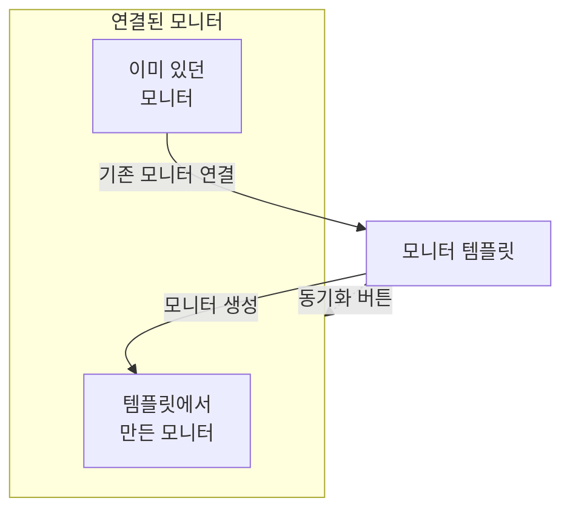

# 모니터 템플릿

모니터 템플릿은 저장된 모니터 구성(유형, 기준, 간격, 레이블, 사용자 정의 필드 기본값)으로, 여기서 클릭 한 번으로 모니터를 만들 수 있습니다. 템플릿에서 만들었거나 템플릿에 연결한 모니터는 계속 연결된 상태로 남습니다. 템플릿을 바꾼 다음 그 변경을 모든 모니터에 동기화합니다. 모든 서비스에 같은 상태 확인을 두거나 프로덕션과 스테이징에서 같은 API 확인을 하는 것처럼, 많은 모니터가 똑같이 동작해야 할 때 템플릿을 사용합니다.

:::cards
- [템플릿 만들기](#템플릿-만들기): 모니터 생성처럼 네 단계입니다.
- [템플릿으로 모니터 만들기](#템플릿으로-모니터-만들기): 클릭 한 번으로 만들거나, 이미 있는 모니터를 연결합니다.
- [변경 사항 동기화](#연결된-모니터에-변경-사항-동기화): 동기화 버튼마다 복사하는 내용.
- [모니터별 값 유지](#모니터별-값-유지): 대상이나 헤더를 동기화로부터 보호합니다.
:::

## 템플릿의 작동 방식

템플릿 자체는 아무것도 감시하지 않습니다. 모니터는 템플릿에서 만들어지거나 템플릿에 연결되며, 템플릿 페이지에 **연결된 모니터**로 나열됩니다. 템플릿을 바꿔도 동기화하기 전까지 그 모니터들은 바뀌지 않습니다. 각 동기화 버튼은 템플릿의 한 부분을 연결된 모든 모니터에 복사하며, 보호한 필드는 각 모니터 자신의 값을 유지합니다.



## 시작하기 전에

- **템플릿을 만들 수 있는 역할**: Project Owner, Project Admin, Project Member, Monitor Admin 또는 Monitor Member, 또는 Create Monitor Template 권한이 있는 사용자 지정 역할. 템플릿을 바꾸려면 같은 역할이나 Edit Monitor Template 권한이 필요합니다.
- **연결된 모니터를 업데이트할 권한.** 동기화는 여러분의 이름으로 연결된 각 모니터에 기록하며, 권한이 닿지 않는 모니터는 건너뜁니다.

## 템플릿 만들기

:::steps
### 템플릿 열기

**모니터 → 설정 → 템플릿**으로 이동해 **모니터 템플릿 만들기**를 클릭합니다.

### 템플릿 이름 지정

**템플릿 정보**에서 `Production API Health` 같은 **템플릿 이름**과 **템플릿 설명**을 입력한 다음 **다음**을 클릭합니다.

### 모니터 기본값 설정

**모니터 기본값**에서 모니터 생성과 같은 선택기로 **모니터 유형**을 고릅니다. 필요하면 **기본 모니터 이름**을 입력합니다. 비워 두면 각 모니터는 감시하는 리소스의 이름을 따릅니다. **기본 모니터 설명**과 **레이블**은 **추가 필드**에 있습니다. **다음**을 클릭합니다.

### 기준과 간격 설정

**기준**에서 [모니터 생성](/docs/monitor/create-monitor#기준)과 같은 방식으로 확인할 대상과 기준을 입력합니다. 맨 위의 **Template sync settings** 카드에서 필드를 동기화로부터 보호할 수 있습니다([모니터별 값 유지](#모니터별-값-유지) 참고). 프로브가 확인하는 모니터 유형에서는 마지막 단계인 **간격**이 **모니터링 간격**을 묻습니다. 마지막 단계에서 **모니터 템플릿 만들기**를 클릭합니다.
:::

템플릿이 목록에 추가됩니다. 템플릿을 열면 부분마다 카드가 있는 페이지가 보입니다. **템플릿 정보**, **모니터 기본값**, **모니터링 기준**, **모니터링 간격**(**최소 프로브 합의** 포함), **레이블**, **Custom Field Defaults**(프로젝트에 모니터 사용자 정의 필드가 있을 때), **연결된 모니터**입니다. 각 부분은 자기 카드에서 바꿉니다. 예를 들어 **기준 편집**이나 **간격 편집**을 사용합니다.

## 템플릿으로 모니터 만들기

- **새 모니터.** 목록의 템플릿 행에서 **모니터 생성**을 클릭하거나, 템플릿 페이지에서 **템플릿에서 모니터 만들기**를 클릭합니다. **모니터 생성**이 템플릿의 유형과 설정이 채워진 상태로 열립니다. 필요한 부분을 바꾼 뒤 만듭니다. 새 모니터는 템플릿에 연결됩니다.
- **이미 있는 모니터.** **연결된 모니터**에서 **기존 모니터 연결**을 클릭하고 모니터를 고릅니다. 동기화하기 전까지 각 모니터는 자기 설정을 유지합니다.

**Custom Field Defaults**에 설정한 값은 템플릿에서 만드는 모든 모니터에 기록됩니다. 자동 가져오기 규칙과 알림 정책이 템플릿으로 만드는 모니터도 포함됩니다.

## 연결된 모니터에 변경 사항 동기화

템플릿을 편집하면 템플릿만 바뀝니다. 변경을 연결된 모니터에 복사하려면 바꾼 카드의 동기화 버튼을 사용합니다. 각 버튼에는 **Sync Criteria to 3 Linked Monitors**처럼 대상 모니터 수가 표시되며, 연결된 것이 없는 동안에는 비활성화되어 있습니다. 동기화는 되돌릴 수 없습니다.

| 버튼 | 연결된 각 모니터에 복사하는 것 | 그대로 두는 것 |
| --- | --- | --- |
| **연결된 모니터에 기준 동기화** | 기준과 대상, 요청 옵션 같은 단계 설정(보호된 필드 제외) | 모니터링 간격, 최소 프로브 합의, 이름, 설명, 레이블, 사용자 정의 필드 값 |
| **연결된 모니터에 동기화 간격 적용** | 모니터링 간격과 최소 프로브 합의 | 기준, 이름, 설명, 레이블, 사용자 정의 필드 값 |
| **연결된 모니터에 레이블 동기화** | 레이블만 | 그 밖의 모든 것 |
| **Sync Custom Fields to Linked Monitors** | 템플릿에 기본값이 있는 사용자 정의 필드(각 모니터의 기존 값을 대체) | 템플릿이 비워 둔 사용자 정의 필드와 그 밖의 모든 것 |

모니터 하나만 동기화하려면 **연결된 모니터**의 해당 행에서 **템플릿에서 동기화**를 클릭합니다. 기준과 단계 설정(보호된 필드 제외), 모니터링 간격, 최소 프로브 합의, 레이블이 복사되고, 모니터의 이름, 설명, 사용자 정의 필드 값은 그대로 남습니다. **템플릿에서 연결 해제**는 모니터의 연결을 끊으며, 모니터는 설정을 유지합니다.

동기화 후에는 업데이트된 모니터 수가 요약으로 표시됩니다. **부분적으로 동기화됨**은 일부 연결된 모니터에 아직 이전 구성이 남아 있다는 뜻이며, 보통 여러분의 권한이 그 모니터에 닿지 않기 때문입니다.

## 모니터별 값 유지

기준 동기화는 대상, 요청 헤더, 시간 초과 같은 단계 설정도 복사합니다. 이 필드를 보호하지 않으면 그렇습니다. 필드를 보호하면 연결된 각 모니터가 그 필드의 자기 값을 유지합니다.

:::steps
### 템플릿 열기

**모니터 → 설정 → 템플릿**으로 이동해 템플릿을 엽니다.

### 기준 편집

**모니터링 기준** 카드에서 **기준 편집**을 클릭합니다.

### 필드 보호

**Template sync settings**에서 연결된 모니터에 남겨 둘 각 필드 옆의 **Do not sync this field**를 선택합니다.

### 저장

변경 사항을 저장합니다. **모니터링 기준** 카드와 각 동기화의 확인 창에 보호된 필드가 나열됩니다.

### 동기화

**연결된 모니터에 기준 동기화**를 사용하거나, 개별 연결된 모니터에서 **템플릿에서 동기화**를 사용합니다.
:::

예를 들어 API 템플릿에서 **Monitor destination**과 **Request headers**를 보호합니다. 프로덕션과 스테이징 모니터는 각자의 URL과 헤더를 유지하면서, 둘 다 템플릿의 업데이트된 기준과 보호되지 않은 다른 설정을 받습니다.

사용할 수 있는 옵션은 모니터 유형에 따라 다릅니다. 대상과 포트, HTTP 요청 옵션, 데이터베이스 연결, DNS 설정, 인프라 선택기, 텔레메트리 쿼리 등이 있습니다. 클라이언트 인증서와 그 개인 키처럼 서로 관련된 자격 증명은 함께 유지됩니다.

### 제외 항목의 동작

- 선택한 필드는 기존 각 모니터의 현재 값을 유지합니다. 비어 있거나 설정되지 않은 값도 포함됩니다. 요청 헤더와 다른 컬렉션은 통째로 유지됩니다.
- 선택하지 않은 필드는 계속 템플릿에서 동기화됩니다. 보호한 필드의 선택을 해제하고 저장하면 다음 동기화 때 템플릿의 값이 복사됩니다.
- 제외 항목은 일괄 동기화와 개별 동기화 모두에 적용됩니다. 제외 항목은 템플릿에 저장되며, 동기화할 때마다 따로 고르는 것이 아닙니다.
- 새 모니터는 여전히 템플릿의 필드 값으로 시작합니다. 제외 항목은 기존 모니터의 동기화에만 영향을 줍니다.
- 기준은 항상 동기화됩니다. 기준만 동기화하면 모니터링 간격, 레이블, 그 밖의 모니터 수준 설정은 그대로입니다.
- 기존 템플릿에는 설정하기 전까지 필드 제외 항목이 없습니다. 네트워크 장치 모니터는 계속 자기 장치 연결을 자동으로 유지합니다.

여러 단계가 있는 템플릿에서는 보호된 값을 단계 ID로 대응시킵니다. 따로 만든 단일 단계 모니터도 단일 단계 템플릿을 받을 수 있습니다. 보호된 단계를 대응시킬 수 없으면 어떤 모니터도 업데이트되기 전에 동기화가 거부되므로, 새로 생겼거나 순서가 바뀐 단계가 실수로 다른 단계의 대상이나 자격 증명을 복사하는 일이 없습니다.

> [!IMPORTANT]
> 저장된 템플릿의 모니터 유형을(**모니터 기본값 편집**으로) 바꾸기 전에, **기준 편집**에서 새 유형에 해당하지 않는 제외 항목을 해제하세요. 템플릿의 제외 항목은 모두 그 모니터 유형에 존재해야 합니다.

## API로 구성하기

템플릿의 각 단계는 `MonitorStep.value` 객체 안에서 `doNotSyncFields` 배열을 받습니다. API 모니터의 대상과 헤더 컬렉션 전체를 보호하려면 다음과 같이 합니다.

```json title="monitorSteps (excerpt)"
{
  "_type": "MonitorSteps",
  "value": {
    "monitorStepsInstanceArray": [
      {
        "_type": "MonitorStep",
        "value": {
          "id": "<step id>",
          "doNotSyncFields": ["monitorDestination", "requestHeaders"]
        }
      }
    ]
  }
}
```

지원되는 모든 단계 설정을 동기화하려면 배열을 생략하거나 `[]`로 설정합니다. 지원되지 않는 필드 이름과 템플릿의 모니터 유형에 해당하지 않는 필드는 거부됩니다. 동기화를 제어하는 것은 템플릿의 배열이며, 연결된 모니터의 비슷한 메타데이터가 이를 덮어쓰지 않습니다.

:::details 모니터 유형별 doNotSyncFields 필드 이름
| 모니터 유형 | 필드 이름 |
| --- | --- |
| 웹사이트, API, Ping, IP, 포트, SSL Certificate, NTP | `monitorDestination`, `requestTimeoutInMs`, `retryCount` |
| API만 | `requestHeaders`, `requestType`, `requestBody` |
| 웹사이트와 API | `doNotFollowRedirects`, `allowSelfSignedCertificates`, `tlsClientAuthentication`(클라이언트 인증서, 키, 암호를 함께) |
| 포트, NTP | `monitorDestinationPort` |
| Synthetic Monitor, Custom JavaScript Code | `customCode` |
| Synthetic Monitor | `browserTypes`, `screenSizeTypes`, `retryCountOnError` |
| DNS | `dnsMonitor.queryName`, `dnsMonitor.recordType`, `dnsMonitor.resolver`(DNS 서버와 포트를 함께), `dnsMonitor.timeout`, `dnsMonitor.retries` |
| 도메인 | `domainMonitor.domainName`, `domainMonitor.lookupMethod`, `domainMonitor.timeout`, `domainMonitor.retries` |
| DNSSEC | `dnssecMonitor.domainName`, `dnssecMonitor.resolvers`, `dnssecMonitor.checkNameserverConsistency`, `dnssecMonitor.signatureExpiryWarningDays`, `dnssecMonitor.timeout`, `dnssecMonitor.retries` |
| SQL Query | `sqlMonitor.connection`, `sqlMonitor.connectionTimeoutInMs`, `sqlMonitor.statementTimeoutInMs`, `sqlMonitor.query`, `sqlMonitor.maxRows` |
| Database Health | `databaseMonitor.connection`, `databaseMonitor.connectionTimeoutInMs`, `databaseMonitor.statementTimeoutInMs`, `databaseMonitor.enabledMetricGroups` |
| External Status Page | `externalStatusPageMonitor.statusPageUrl`, `externalStatusPageMonitor.provider`, `externalStatusPageMonitor.components`, `externalStatusPageMonitor.timeout`, `externalStatusPageMonitor.retries` |
| 로그, Security Events, 트레이스, AI / LLM, 메트릭, 예외 | `logMonitor`, `securityEventsMonitor`, `traceMonitor`, `llmMonitor`, `metricMonitor`, `exceptionMonitor`(모니터의 전체 구성) |

인프라 모니터(Kubernetes, Docker, 호스트, Podman, Proxmox, Docker Swarm, Ceph, 스토리지 어레이, IoT Device)는 리소스 선택기, 필터, 메트릭 쿼리, 쿼리 시간 범위를 보호할 수 있습니다. 그 이름은 해당 유형의 템플릿에 있는 **Template sync settings**에 나열됩니다.
:::

## 문제 해결

:::details 동기화 결과가 "부분적으로 동기화됨"으로 표시됨
일부 연결된 모니터가 업데이트되지 않았습니다. 보통 여러분의 권한이 그 모니터에 닿지 않기 때문입니다. 연결된 모든 모니터를 업데이트할 수 있는 사람에게 동기화를 다시 실행해 달라고 요청합니다.
:::

:::details 동기화가 "a template step cannot be matched to an existing monitor step"으로 실패함
보호된 필드를 모니터 중 하나의 단계에 대응시킬 수 없어서, 어떤 모니터도 바뀌기 전에 동기화가 멈췄습니다. 템플릿의 단계에 모니터 단계와 같은 ID를 주거나, 단일 단계 모니터에는 단일 단계 템플릿을 사용합니다.
:::

:::details 동기화 버튼이 비활성화되어 있음
아직 템플릿에 연결된 모니터가 없습니다. 템플릿으로 모니터를 만들거나 **연결된 모니터**에서 **기존 모니터 연결**을 클릭합니다.
:::

:::details 저장이 "Unsupported do not sync field"로 실패함
`doNotSyncFields`의 이름이 템플릿 모니터 유형의 필드가 아닙니다. 위의 필드 이름과 대조해 보세요.
:::

## 다음 단계

:::cards
- [모니터 만들기](/docs/monitor/create-monitor): 템플릿이 채우는 양식.
- [API 모니터](/docs/monitor/api-monitor): API 템플릿이 담는 설정.
- [모니터 시크릿](/docs/monitor/monitor-secrets): 자격 증명을 복사하지 않고 여러 모니터에서 공유합니다.
- [Terraform 모니터 단계](/docs/terraform/monitor-steps): 모니터와 그 단계를 코드로 관리합니다.
:::
