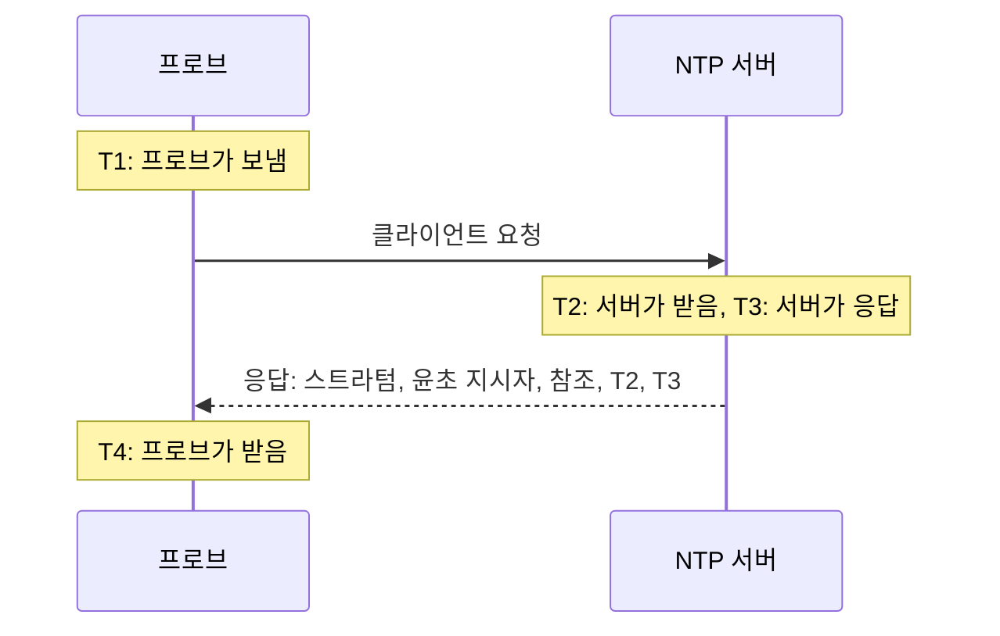

# NTP 모니터

NTP 모니터는 타임 서버가 UDP 포트 123에서 응답하고 정확한 시간을 제공하는지 확인합니다. 즉 동기화되어 있는지, 적절한 스트라텀에 있는지, 그리고 시계가 프로브의 시계와 일치하는지 확인합니다. 데이터 센터의 GPS 시계나 사내 장비가 동기화하는 내부 서버처럼 직접 운영하는 타임 서버와, 의존하고 있는 공용 서버에 사용하세요.

:::cards
- [모니터 만들기](#ntp-모니터-만들기): 대시보드에서 여섯 단계로 진행합니다.
- [검사가 읽는 항목](#검사가-읽는-항목): 스트라텀, 시계 오차, 윤초 지시자와 응답의 나머지 항목.
- [모니터링 기준](#모니터링-기준): 도달 가능성, 동기화, 스트라텀, 오차.
- [문제 해결](#문제-해결): 서버는 정상인데 모니터가 다르게 표시할 때.
:::

## 작동 방식

검사할 때마다 프로브는 임의의 로컬 포트에서 서버의 UDP 포트로 SNTP 클라이언트 요청(NTP 버전 4, 클라이언트 모드)을 하나 보내고 응답을 기다립니다. 그 요청에 대한 실제 응답만 인정됩니다. 프로브는 요청의 전송 타임스탬프에 임의의 64비트를 넣고, 이를 그대로 돌려주지 않거나 NTP 패킷보다 짧거나 서버 모드가 아닌 패킷은 모두 무시합니다. 이전 검사에 대한 오래된 응답이나 위조된 응답 때문에 중단된 서버가 살아 있는 것처럼 보이는 일은 없습니다.

네 개의 타임스탬프로 프로브는 **시계 오차**를 ((T2 − T1) + (T3 − T4)) / 2로 계산합니다. 서버의 시계가 프로브의 시계와 얼마나 떨어져 있는지를 나타냅니다. 오차가 양수이면 서버가 앞서 있다는 뜻입니다. 이 공식은 요청과 응답에 걸리는 시간이 같다고 가정하므로, 한쪽 방향이 훨씬 느린 경로에서는 오차가 왕복 시간의 절반까지 치우칠 수 있습니다.

> [!NOTE]
> 오차는 프로브 자체의 시계를 기준으로 측정됩니다. OneUptime Cloud의 프로브는 시계를 동기화된 상태로 유지합니다. [사용자 지정 프로브](/docs/probe/custom-probe)에서도 chrony나 systemd-timesyncd로 호스트의 시계를 동기화해 두세요. 그렇지 않으면 오차 알림이 서버가 아니라 프로브의 문제일 수 있습니다.

응답한 서버에는 정확한 시간 없이 응답하더라도 다시 묻지 않습니다. 무응답, 거부된 포트, 실패한 DNS 조회는 새 요청으로 재시도합니다. 서버가 전혀 응답하지 않으면 프로브는 서버까지의 경로도 추적하고, 찾은 내용을 **Network Path at Time of Failure**로 첨부합니다. 자체 네트워크 연결이 끊긴 프로브는 결과를 보고하지 않으므로 서버를 오프라인으로 표시할 수 없습니다.

## 시작하기 전에

- **모니터를 만들 수 있는 역할**: Project Owner, Project Admin, Project Member, Monitor Admin 또는 Monitor Member, 또는 Create Monitor 권한이 있는 사용자 지정 역할.
- **서버의 UDP 포트 123에 도달할 수 있는 프로브.** 공용 타임 서버는 어떤 프로브로든 검사할 수 있습니다. 사설 네트워크의 서버에는 그 네트워크 안의 [사용자 지정 프로브](/docs/probe/custom-probe)를 사용하세요. 서버 앞의 방화벽은 [OneUptime Cloud 프로브의 IP 주소](/docs/configuration/ip-addresses) 또는 사용자 지정 프로브에서 오는 TCP뿐 아니라 UDP도 통과시켜야 합니다.

## NTP 모니터 만들기

:::steps
### 새 모니터 시작

**모니터**로 이동해 **모니터 생성**을 클릭합니다. **모니터 유형**의 검색 상자에 `ntp`를 입력하고 **NTP**를 선택합니다. **더 많은 모니터 유형**의 네트워크 그룹에도 있습니다.

### 이름 지정

`GPS 타임 서버` 같은 **이름**을 입력하고 **다음**을 클릭합니다.

### 서버 입력

**NTP 서버**에 `time.example.com`이나 `192.168.1.10` 같은 서버의 호스트 이름 또는 IP 주소를 입력합니다. 요청은 포트 123으로 갑니다. 다른 포트를 사용하려면 **추가 필드**를 열고 **포트**를 설정합니다.

### 테스트

**모니터 테스트**를 클릭하고 **프로브 선택**에서 프로브를 고른 뒤 **테스트 실행**을 클릭합니다. **모니터 테스트 결과**에 서버가 응답했는지, 동기화되어 있는지, 스트라텀, 그리고 시계가 얼마나 어긋나 있는지가 표시됩니다.

### 기준 검토

**모니터 기준**은 [기본 기준](#기본-기준)으로 시작합니다. 서버가 정확한 시간을 제공하지 않으면 오프라인, 제공하면 온라인입니다. 필요하면 변경한 뒤 **다음**을 클릭합니다.

### 프로브 선택 후 생성

**프로브**와 **모니터링 간격**(처음에는 **5분마다**)을 그대로 두거나 변경하고 **모니터 생성**을 클릭합니다. 모니터 페이지가 열립니다.
:::

## 구성 옵션

| 필드 | 기본값 | 입력할 내용 |
| --- | --- | --- |
| **NTP 서버** | 없음 | `time.example.com`, `192.168.1.10`, `2001:db8::123` 같은 서버. `udp://` 없이 호스트만 입력합니다. `time.example.com:1123`처럼 호스트 뒤에 쓴 포트는 **포트** 대신 사용됩니다. |
| **포트**(**추가 필드** 안) | `123` | 서버가 NTP에 응답하는 UDP 포트(`1`~`65535`). `123`을 쓰려면 비워 둡니다. |
| **요청 시간 초과(초)**(**추가 필드** 안) | `5` | 한 번의 시도가 DNS 조회를 포함해 응답을 기다리는 시간. 최대 60초입니다. |
| **실패 시 재시도**(**추가 필드** 안) | 프로브 기본값, 보통 `3` | 응답을 받지 못한 시도를 다시 시도하는 횟수. 최대 3입니다. |

**실패 시 재시도**는 첫 번째 시도 _이후_ 재시도 횟수를 셉니다. `0`이면 검사를 한 번, `2`이면 최대 세 번 실행하며, 시도 사이에 1초씩 쉽니다. 비워 두면 프로브 기본값을 사용합니다. 프로브의 `PROBE_MONITOR_RETRY_LIMIT`가 다르게 지정하지 않는 한 3입니다.

## 검사가 읽는 항목

모니터 페이지에는 각 프로브의 최신 검사가 표시됩니다.

| 필드 | 의미 |
| --- | --- |
| **동기화됨** | 서버가 스트라텀 1~15로, 윤초 지시자의 경보 없이, 실제 타임스탬프가 담긴 응답을 보냈는지 여부. |
| **시계 오차** | 서버의 시계가 프로브의 시계와 얼마나, 어느 방향으로 떨어져 있는지. 정상 서버는 몇 밀리초 이내입니다. |
| **스트라텀** | 서버가 기준 시계에서 몇 홉 떨어져 있는지. 자체 GPS나 원자 시계 소스가 있는 서버는 1, 스트라텀 1 서버에 동기화하는 서버는 2, 이런 식입니다. 16은 동기화되지 않았다는 뜻입니다. |
| **참조** | 서버가 무엇에 동기화하는지. 스트라텀 1에서는 `GPS`, `PPS`, `NIST` 같은 소스 이름, 스트라텀 2부터는 상위 서버의 주소입니다. |
| **윤초 지시자** | 예정된 윤초가 없으면 0, 그날 끝에 윤초가 추가되거나 제거되면 1 또는 2, 서버가 자신의 시계가 동기화되지 않았다고 알리면 3입니다. |
| **루트 분산** | 서버 자신의 시간이 실제 시간과 얼마나 떨어져 있을 수 있는지에 대한 서버의 추정치. 서버가 소스에 연결하지 못하는 동안 계속 커집니다. ntpd는 루트 지연의 절반과 이 값의 합이 1.5초를 넘으면 그 서버를 더 이상 신뢰하지 않습니다. |
| **루트 지연** | 서버에서 기준 시계까지의 왕복 시간. |
| **응답 시간** | 프로브가 요청을 보낸 때부터 응답을 받을 때까지의 시간(DNS 조회 제외). |
| **서버 시간** | 서버가 응답을 보낼 때의 서버 시계. |

시간 제공을 거부하는 서버는 대신 **kiss-o'-death**를 보냅니다. 네 글자 코드가 담긴 스트라텀 0 응답입니다. 가장 흔한 코드는 `RATE`(서버가 프로브의 빈도를 제한함), `DENY`와 `RSTR`(서버의 접근 규칙이 프로브를 거부함), `INIT`(아직 동기화되지 않음)입니다. 검사는 코드를 표시하고, 서버가 응답은 하지만 동기화되지 않은 것으로 봅니다.

## 모니터링 기준

기준은 서버를 언제 온라인, 저하, 오프라인으로 볼지, 그리고 그때 인시던트를 선언할지 알림을 만들지를 결정합니다. 각 기준은 하나 이상의 필터를 확인합니다.

| 필터 | 조건 | 확인하는 내용 |
| --- | --- | --- |
| **NTP Is Online** | **참**, **거짓** | 서버가 프로브의 요청에 NTP 응답을 보냈는지 여부. kiss-o'-death도 응답입니다. |
| **NTP Is Synchronized** | **참**, **거짓** | 응답한 서버가 동기화된 시간을 제공하는지 여부. 서버가 응답하지 않으면 이 필터는 확인하지 않으니, 그 경우에는 **NTP Is Online**을 사용하세요. |
| **NTP Stratum** | **Greater Than**, **Greater Than Or Equal To**, **Less Than**, **Less Than Or Equal To**, **Equal To**, **Not Equal To** | 서버의 스트라텀. kiss-o'-death의 0은 동기화되지 않음을 뜻하는 16으로 계산됩니다. |
| **NTP Clock Offset (in ms)** | **Greater Than**, **Less Than**, **Greater Than Or Equal To**, **Less Than Or Equal To** | 서버의 시계가 프로브의 시계와 얼마나 떨어져 있는지(방향 무관). |
| **NTP Response Time (in ms)** | **Greater Than**, **Less Than**, **Greater Than Or Equal To**, **Less Than Or Equal To** | 요청부터 응답까지의 시간. |
| **NTP Root Dispersion (in ms)** | **Greater Than**, **Less Than**, **Greater Than Or Equal To**, **Less Than Or Equal To** | 서버 자신이 추정한 최대 오차. |

필터가 두 개 이상이면 **일치 조건**에서 **전체**를 고르면 모든 필터가, **모두**를 고르면 그중 하나만 일치하면 됩니다. 기준의 **작업**은 그 기준이 하는 일을 정합니다. 모니터 상태 변경, 알림 생성, 인시던트 선언, 또는 이들의 조합입니다.

### 기본 기준

새 NTP 모니터는 두 개의 기준으로 시작합니다.

- **오프라인** — 서버가 응답하지 않거나, 동기화되지 않았거나, 시계가 프로브의 시계와 `1000` ms 이상 떨어져 있습니다. 모니터는 **오프라인**으로 표시되고 "_모니터 이름_ is not serving good time"이라는 인시던트가 생성됩니다. 서버가 다시 정확한 시간을 제공하면 자동으로 해결됩니다.
- **온라인** — 서버가 응답하고, 동기화되어 있으며, 시계가 프로브의 시계와 `1000` ms 이내입니다. 모니터는 **정상 작동**으로 표시됩니다.

기준은 위에서 아래로 확인되며, 처음 일치하는 기준이 결과를 결정합니다. 잘못된 시간으로 응답하는 서버는 의도적으로 중단된 것으로 취급합니다. 그 서버를 따르는 모든 클라이언트가 그 시간을 그대로 가져가기 때문입니다.

### 일정 기간에 걸친 평가

**일정 기간에 걸쳐 이 기준을 평가**는 각 NTP 필터 아래에 있는 체크박스입니다. 켜면 최신 검사 대신 지난 검사들의 구간으로 판단합니다. **평가**에서 집계 방식을, **지난 시간 동안(분)**에서 2~60분 사이의 구간을 고릅니다. 스트라텀, 오차, 루트 분산은 서버가 응답한 검사에만 있으므로 무응답 구간에는 이 필터들의 데이터가 없고, 이때는 **데이터가 없는 경우**가 결과를 정합니다.

### 기준 예시

| 목표 | 필터 | 조건 | 값 |
| --- | --- | --- | --- |
| GPS 서버가 네트워크 소스로 전환되면 알림 | **NTP Stratum** | **Greater Than** | `1` |
| 시계가 어긋나기 시작하면 알림 | **NTP Clock Offset (in ms)** | **Greater Than** | `100` |
| 서버의 오차 한계가 커지면 알림 | **NTP Root Dispersion (in ms)** | **Greater Than** | `500` |
| 응답이 느려지면 알림 | **NTP Response Time (in ms)** | **Greater Than** | `1000` |

## 문제 해결

:::details 서버는 정상인데 모니터는 응답이 없었다고 표시합니다
요청이나 응답이 도중에 사라졌습니다. TCP는 허용하지만 UDP는 허용하지 않는 방화벽, 프로브의 주소가 빠진 ntpd `restrict` 또는 chrony `allow` 규칙, 내부 인터페이스에서만 수신하는 서버가 모두 이렇게 보입니다. **Network Path at Time of Failure**에서 경로가 어디까지 갔는지 확인할 수 있습니다. 프로브를 허용하거나, 네트워크 안의 [사용자 지정 프로브](/docs/probe/custom-probe)에서 서버를 검사하세요.
:::

:::details 모니터가 서버가 요청을 거부했다고 표시합니다
호스트가 그 UDP 포트에서 수신 중인 것이 없다고 응답했습니다(ICMP port unreachable). NTP 서비스가 중지되었거나 다른 포트에서 수신하고 있습니다. 서비스를 시작하거나 **포트**를 서비스가 사용하는 포트로 설정하세요.
:::

:::details 서버가 kiss-o'-death로 응답합니다
`RATE`는 서버가 프로브의 빈도를 제한한다는 뜻입니다. 프로브는 검사마다 한 번만 묻기 때문에, **모니터링 간격**을 늘리거나 서버의 제한에서 프로브의 주소를 제외하면 멈춥니다. `DENY`와 `RSTR`는 서버의 접근 규칙이 프로브를 거부한다는 뜻입니다. `INIT`와 `STEP`은 서버가 아직 동기화되지 않았다는 뜻이며, 시작 후 몇 분 동안은 정상입니다.
:::

:::details 한 프로브의 모든 NTP 모니터에 비슷한 오차가 보입니다
어긋난 것은 서버가 아니라 프로브의 시계입니다. 프로브의 호스트가 시계를 동기화하고 있는지 확인하거나, 다른 프로브에서 모니터를 실행하세요.
:::

:::details 검사마다 오차가 크게 달라집니다
프로브가 서버에서 멀거나, 경로가 한쪽 방향으로 더 느립니다. 서버에 더 가까운 프로브를 사용하거나, **일정 기간에 걸쳐 이 기준을 평가**와 **평균**으로 몇 분 동안의 오차를 기준으로 판단하세요.
:::

## 다음 단계

:::cards
- [Ping 모니터](/docs/monitor/ping-monitor): 호스트 자체에 도달할 수 있는지 확인합니다.
- [포트 모니터](/docs/monitor/port-monitor): 같은 호스트의 TCP 서비스를 확인합니다.
- [사용자 지정 프로브](/docs/probe/custom-probe): 자체 네트워크의 타임 서버를 확인합니다.
- [인시던트 및 알림 템플릿](/docs/monitor/incident-alert-templating): 스트라텀과 오차를 인시던트 제목에 넣습니다.
:::
