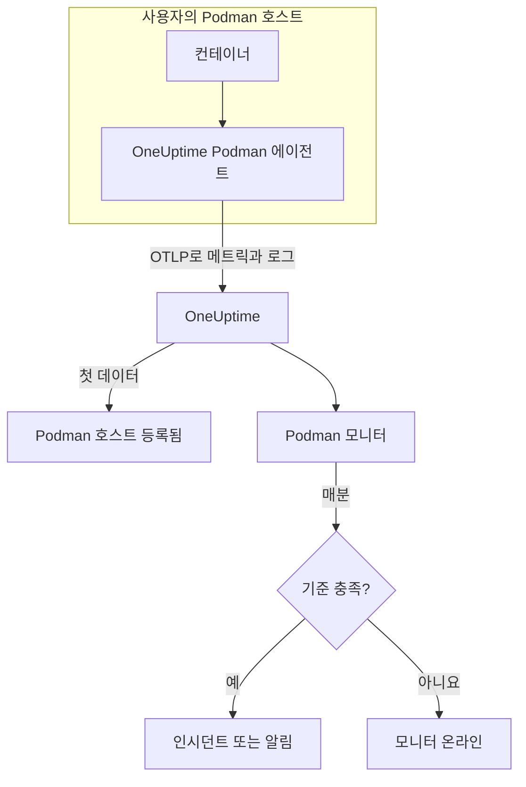

# Podman 모니터

Podman 모니터는 Podman 호스트 한 대의 컨테이너를 감시하고, 컨테이너가 과열되거나 메모리가 부족해지거나 계속 다시 시작되면 알려 줍니다. OneUptime Podman 에이전트가 호스트에서 보내는 메트릭을 읽으므로 외부에서 아무것도 탐색하지 않습니다. 에이전트를 설치한 다음 템플릿이나 직접 만든 쿼리로 모니터를 만드세요.

:::cards
- [모니터 만들기](#podman-모니터-만들기): 대시보드에서 6단계.
- [템플릿](#미리-만들어진-알림-템플릿): 컨테이너마다 인시던트 하나를 여는 5개의 미리 만들어진 알림.
- [메트릭](#수집되는-메트릭): 에이전트가 수집하는 내용과 각 메트릭의 의미.
- [로그](#수집되는-로그): 컨테이너 로그와 이에 필요한 로그 드라이버.
:::

## 작동 방식

OneUptime Podman 에이전트는 호스트에서 컨테이너로 실행됩니다. 30초마다 Podman의 Docker 호환 API 소켓을 통해 컨테이너 통계를 읽고, 컨테이너의 로그 파일을 추적해, 둘 다 OTLP로 OneUptime에 보냅니다. 호스트에서 온 첫 데이터가 그 호스트를 OneUptime에 등록합니다.

Podman 모니터는 호스트 한 대에 연결됩니다. 매분 그 호스트의 컨테이너 메트릭에 쿼리를 실행하고 결과를 기준과 비교합니다.



## 시작하기 전에

- **Podman 에이전트를 설치하세요**. 호스트에 설치합니다. [Podman 에이전트 가이드](/docs/telemetry/podman-host)에서 설치, 업그레이드, 확인 방법을 설명합니다. 에이전트에는 `/run/podman/podman.sock`에 있는 Podman API 소켓이 필요합니다.
- **호스트가 등록되었는지 확인하세요.** 첫 데이터가 도착하면 에이전트의 `PODMAN_HOST_NAME` 이름으로 **제품 → 인프라 → Podman → 모든 호스트** 에 나타납니다.
- **컨테이너 로그가 필요하면** 컨테이너를 `k8s-file` 로그 드라이버로 실행하세요. [로그 드라이버 요구 사항](#로그-드라이버-요구-사항)을 참고하세요.

## Podman 모니터 만들기

:::steps
### 새 모니터 시작

**모니터** 로 이동해 **모니터 생성** 을 클릭합니다.

### Podman Container 선택

**모니터 유형** 에서 **더 많은 모니터 유형** 을 클릭하고 **인프라** 아래의 **Podman Container** 를 고르거나, 검색 상자에 `podman`을 입력합니다. **이름** 을 입력하고(인시던트와 알림 제목에 쓰입니다) **다음** 을 클릭합니다.

### 호스트 선택

**Podman Monitor Configuration** 에서 **Podman Host** 의 호스트를 고릅니다. 데이터를 보낸 모든 호스트가 목록에 있습니다.

### 감시할 대상 선택

세 탭 중 하나를 고릅니다.

- **Quick Setup** – [템플릿](#미리-만들어진-알림-템플릿)을 클릭합니다. 메트릭, 집계, 시간 범위, 임계값을 설정하고 아래 기준을 템플릿의 기준으로 바꿉니다. **시간 범위** 는 계속 바꿀 수 있습니다.
- **Custom Metric** – **Podman Metric** 에서 메트릭 하나를 고른 다음 **집계** 와 **시간 범위** 를 설정합니다. **컨테이너 이름** 과 **컨테이너 이미지** 로 일부 컨테이너만 남길 수 있습니다.
- **고급** – **메트릭 선택** 에서 쿼리와 수식을 직접 만듭니다. **Group by** 에 `resource.container.name`을 지정하면 컨테이너를 하나씩 판단합니다.

### 기준 확인

**모니터 기준** 의 각 기준을 열어 **메트릭**, **집계**, **조건**, **Threshold** 를 확인합니다. 템플릿은 이것들을 채웁니다. **Custom Metric** 이나 **고급** 을 쓰면 모니터는 메트릭이 0으로 떨어지는 것만 감지하는 [기본 기준](#기본-기준)으로 시작하므로, 직접 임계값을 설정하세요.

### 모니터 만들기

**모니터 생성** 을 클릭합니다. OneUptime이 모니터 페이지를 열고 매분 평가합니다. 모니터가 연 인시던트와 알림은 호스트의 **인시던트** 및 **알림** 페이지에도 표시됩니다.
:::

> [!TIP]
> 여러 템플릿을 한 번에 설정하려면 **제품 → 인프라 → Podman** 에서 호스트를 열고 **Recommendations** 로 이동하세요. 원하는 템플릿과 호출할 사람을 고르면 OneUptime이 템플릿마다 모니터를 하나씩 만듭니다.

## 모니터 설정

| 필드 | 탭 | 하는 일 |
| --- | --- | --- |
| **Podman Host** | 모두 | 필수. 모든 쿼리를 호스트의 `resource.host.name`으로 한정합니다. OneUptime은 모든 쿼리에 `resource.container.runtime = podman`도 추가합니다. |
| **Podman Metric** | Custom Metric | 에이전트 카탈로그의 메트릭 하나. CPU, 메모리, 네트워크, 블록 I/O, 컨테이너로 묶여 있습니다. |
| **컨테이너 이름** | Custom Metric, 고급 | 선택 사항. `resource.container.name`과 정확히 일치. 예: `my-container`. |
| **컨테이너 이미지** | Custom Metric, 고급 | 선택 사항. `resource.container.image.name`과 정확히 일치. 예: `nginx:latest`. |
| **집계** | Custom Metric | 샘플을 합치는 방식: **평균**, **최대**, **최소**, **합계**, **개수**. 메트릭의 일반적인 집계에서 시작합니다. |
| **시간 범위** | 모두 | 쿼리가 읽는 이동 기간으로, **Past 1 Minute** 부터 **Past 365 Days** 까지입니다. 새 모니터는 **Past 1 Minute** 에서 시작하고, 템플릿은 자체 값을 설정합니다. |
| **메트릭 선택** | 고급 | 쿼리 빌더: **메트릭**, **Aggregate by**, **Filter by attributes**, **Group by**, 그리고 쿼리를 결합하는 **메트릭 추가** 와 **수식 추가**. |

## 미리 만들어진 알림 템플릿

**Quick Setup** 에는 템플릿이 5개 있습니다. 각각 완전한 모니터를 만듭니다. `resource.container.name`으로 그룹화한 쿼리, 작동하는 기준, 회복하는 기준입니다. 컨테이너는 하나씩 판단되며 각자 인시던트와 알림을 받습니다. 임계값은 출발점이므로 편집할 수 있습니다.

기준은 기간의 매분 조건이 유지될 때만 작동하고 임계값에서 10% 지난 지점에서 회복하므로, 경계 근처를 오가는 값 때문에 깜빡이지 않습니다.

| 템플릿 | 심각도 | 감시 대상 | 작동 조건 | 회복 조건 |
| --- | --- | --- | --- | --- |
| High Container CPU Usage | Warning | `container.cpu.utilization`, 컨테이너별 Avg, 최근 5분 | 80 초과(코어 하나 기준 %) | 72 이하 |
| High Container Memory Usage | Warning | `container.memory.percent`, 컨테이너별 Avg, 최근 5분 | 85% 초과 | 76.5% 이하 |
| High Container Restart Count | 심각 | `container.restarts`, 컨테이너별 Max, 최근 5분 | 총 재시작 5회 초과 | 4.5 이하 |
| High Container Process Count | Warning | `container.pids.count`, 컨테이너별 Max, 최근 5분 | 500 초과 | 450 이하 |
| Container Restarted (Low Uptime) | 심각 | `container.uptime`, 컨테이너별 Min, 최근 1분 | 120초 미만 | 132초 이상 |

**심각도** 는 선택 목록에 표시되는 레이블입니다. 템플릿이 만드는 인시던트와 알림은 프로젝트에서 가장 심각한 인시던트 및 알림 심각도로 시작하니, 기준에서 바꾸세요.

두 퍼센트 템플릿은 **평균** 을 씁니다. 메트릭이 이미 컨테이너별 퍼센트이므로 1분 평균이 지속적인 값이 됩니다. 재시작 횟수와 프로세스 수는 **최대** 를 쓰며, 임계값을 넘는 샘플 하나가 곧 신호입니다.

> [!NOTE]
> `container.cpu.utilization`은 `podman stats`가 출력하는 수치입니다. 100%는 컨테이너의 전체 CPU 할당이 아니라 CPU 코어 하나입니다. 여러 코어를 받은 컨테이너는 정상일 때도 100을 훨씬 넘으므로, 그런 컨테이너는 임계값을 올리세요.

> [!NOTE]
> `container.restarts`는 Podman이 유지하는 누적 합계이며, 기간 안의 재시작 횟수가 아닙니다. 그래서 **High Container Restart Count** 템플릿은 컨테이너를 다시 만들어 횟수가 초기화될 때까지 열려 있습니다.

> [!CAUTION]
> `container.uptime`은 실행 중인 컨테이너에만 있습니다. 멈춘 채로 있는 컨테이너는 데이터를 보내지 않으므로, **Container Restarted (Low Uptime)** 템플릿은 재시작과 재배포를 잡을 뿐 영구적인 종료는 잡지 못합니다. 2분보다 짧게 실행되도록 만든 컨테이너는 수명 내내 알림 상태로 남습니다.

CPU 스로틀링 템플릿은 없습니다. 에이전트가 수집하는 스로틀링 메트릭은 늘기만 하므로, "한 번이라도 스로틀링됨" 알림은 한 번 작동한 뒤 결코 해제되지 않습니다. 둘 다 계속 수집되므로 차트로는 볼 수 있습니다.

## 수집되는 메트릭

에이전트는 OpenTelemetry `docker_stats` 수신기를 Podman의 Docker 호환 소켓 `/run/podman/podman.sock`에 대해 30초마다 사용합니다. 각 컨테이너의 메트릭은 그 신원을 리소스 속성으로 가집니다: `resource.container.name`, `resource.container.image.name`, `resource.container.id`, `resource.container.runtime`(`podman`), `resource.host.name`.

### CPU

| 메트릭 | 설명 |
| --- | --- |
| `container.cpu.utilization` | 컨테이너의 CPU 사용률. 100%가 CPU 코어 하나입니다. |
| `container.cpu.usage.total` | 컨테이너가 시작된 이후 쓴 CPU 시간(나노초). 수명 전체 카운터. |
| `container.cpu.throttling_data.throttled_time` | 컨테이너가 CPU 한도로 스로틀링된 나노초. 수명 전체 카운터. |
| `container.cpu.throttling_data.throttled_periods` | 컨테이너가 시작된 이후의 스로틀링 기간 수. 수명 전체 카운터. |

### 메모리

| 메트릭 | 설명 |
| --- | --- |
| `container.memory.usage.total` | 사용 중인 메모리(바이트). |
| `container.memory.usage.limit` | 메모리 한도(바이트). |
| `container.memory.percent` | 컨테이너 한도, 한도가 없으면 호스트 메모리에 대한 메모리 사용률(%). |

### 네트워크

| 메트릭 | 설명 |
| --- | --- |
| `container.network.io.usage.rx_bytes` | 받은 바이트. 수명 전체 카운터. |
| `container.network.io.usage.tx_bytes` | 보낸 바이트. 수명 전체 카운터. |

### 블록 I/O

| 메트릭 | 설명 |
| --- | --- |
| `container.blockio.io_service_bytes_recursive.read` | 블록 장치에서 읽은 바이트. |
| `container.blockio.io_service_bytes_recursive.write` | 블록 장치에 쓴 바이트. |

### 컨테이너

| 메트릭 | 설명 |
| --- | --- |
| `container.uptime` | 컨테이너가 시작된 이후의 초. 실행 중인 컨테이너만 보고합니다. |
| `container.restarts` | 컨테이너가 다시 시작된 횟수. 누적 합계. |
| `container.pids.count` | 컨테이너 안의 작업 수. cgroup의 pids 컨트롤러는 프로세스뿐 아니라 스레드도 셉니다. |

**Podman Metric** 목록에는 `container.cpu.usage.percpu`, `container.memory.rss`, `container.memory.cache`, 네트워크 패킷 카운터도 있습니다. 함께 제공되는 에이전트 구성은 이것들을 켜지 않으므로, 이를 바탕으로 만들기 전에 호스트의 **메트릭** 페이지를 확인하세요. `container.cpu.throttling_data.throttled_periods`는 목록에 없으므로 **고급** 에서 조회하세요.

## 모니터링 기준

기준은 모니터의 쿼리나 수식 하나를 임계값과 비교합니다. Podman 모니터의 기준에는 **필터 유형** 이 없으며, 모든 규칙이 다음 필드로 메트릭 값을 확인합니다.

| 필드 | 하는 일 |
| --- | --- |
| **메트릭** | 확인할 쿼리나 수식(변수 이름으로 지정). |
| **집계** | 기간 안의 값을 하나의 답으로 만드는 방식: **평균**, **합계**, **Maximum Value**, **Minimum Value**, **All Values**(모든 값이 일치해야 함), **Any Value**(하나면 충분). |
| **조건** | **Greater Than**, **Less Than**, **Greater Than Or Equal To**, **Less Than Or Equal To**, **Equal To**, 또는 이상 조건 **Anomalously High**, **Anomalously Low**, **Anomalous**. |
| **Threshold** | 비교할 값. 메트릭에 단위가 있으면 옆에 단위 목록이 있습니다. 이상 조건에서는 표시되지 않습니다. |
| **민감도** | 이상 조건 전용. **낮음**(4σ), **중간**(3σ, 기본값), **높음**(2σ). |
| **기준선 기간** | 이상 조건 전용. 기록 14일(기본값), 28일, 60일, 90일. |
| **데이터가 없는 경우** | **추가 필드** 아래에 있습니다. 기간에 샘플이 없을 때의 동작: **Ignore**(기본값), **Treat As Zero**, **트리거**. |

이상 조건은 각 값을 기준선의 같은 요일·같은 시간대와 비교합니다. 기준선 기간에 기록이 충분히 쌓일 때까지 "Learning" 상태로 남으며 아무것도 만들지 않습니다.

각 기준은 일치했을 때 할 일도 정합니다. 모니터 상태 변경, 알림 생성, 인시던트 선언입니다. 기준은 위에서 아래로 확인되며, 처음 일치한 기준이 결정합니다.

### 기본 기준

템플릿으로 만들지 않은 모니터는 두 개의 기준으로 시작합니다.

| 순서 | 기준 | 일치하는 경우 | 결과 |
| --- | --- | --- | --- |
| 1 | Check if _monitor name_ is offline | 첫 번째 쿼리의 값 중 하나가 `0` | 모니터를 **오프라인** 으로 표시하고 인시던트 "_monitor name_ is offline"을 선언합니다. 모니터가 회복하면 스스로 해결됩니다. |
| 2 | Check if _monitor name_ is online | 값 중 하나가 `0`보다 큼 | 모니터를 **정상 작동** 으로 표시합니다. |

> [!IMPORTANT]
> 무응답은 어느 기준과도 일치하지 않습니다. 데이터를 보내지 않게 된 호스트는 모니터를 원래 상태 그대로 둡니다. 데이터가 멈출 때 알림을 받으려면 기준에서 **데이터가 없는 경우** 를 **트리거** 로 설정하세요. OneUptime 자체가 데이터를 받지 못한 시간은 절대 데이터 없음으로 취급되지 않습니다. 그런 시간이 포함된 기간의 확인은 대신 기다리며, 자세한 내용은 [OneUptime이 데이터를 받지 못할 때](/docs/monitor/when-oneuptime-is-not-receiving)에서 설명합니다.

## 수집되는 로그

에이전트는 각 컨테이너의 `ctr.log` 파일도 추적하고, 각 줄을 다음 내용을 가진 OpenTelemetry 로그 레코드로 보냅니다.

| 필드 | 값 |
| --- | --- |
| `resource.host.name` | 호스트. `PODMAN_HOST_NAME`에서 가져옵니다. |
| `resource.container.id` | 전체 컨테이너 ID. |
| `resource.container.runtime` | 항상 `podman`. |
| `attributes["log.iostream"]` | `stdout` 또는 `stderr`. |
| `severityText` / `severityNumber` | 줄 안에 레벨이 있으면 그 레벨 키워드에서 읽습니다(`[ERROR]`, `app.INFO:`, `{"level":"warn"}`, `level=error`). 레벨이 없는 줄은 스트림을 따릅니다. `stderr`는 `ERROR`, `stdout`은 `INFO`입니다. |
| `body` | 컨테이너가 쓴 줄. 스택 트레이스 줄처럼 공백이나 닫는 괄호로 시작하는 줄은 앞 줄에 이어 붙습니다. |
| `time` | 그 줄에 대한 Podman의 타임스탬프. |

로그는 호스트의 **로그** 페이지와 각 컨테이너 페이지에 표시됩니다.

### 로그 드라이버 요구 사항

에이전트는 Podman의 `k8s-file` 로그 드라이버가 `/var/lib/containers/storage/overlay-containers/*/userdata/ctr.log`에 쓰는 파일을 읽습니다. rootful Podman의 기본값은 `journald`로, 대신 systemd 저널에 쓰므로 읽을 파일이 없습니다.

| 드라이버 | 에이전트에 보이는 것 |
| --- | --- |
| `k8s-file`(또는 Podman이 같은 방식으로 다루는 `json-file`) | 모든 줄. |
| `journald` | 없음. 로그가 systemd 저널에 있습니다. |
| `none` | 없음. 로그가 버려집니다. |

메트릭은 로그 드라이버와 관계없습니다. 컨테이너가 `journald`를 쓰는 호스트도 메트릭은 계속 보고하며, **로그** 페이지만 비어 있습니다.

컨테이너의 드라이버와 Podman의 기본값을 확인합니다.

```bash
podman inspect <container> --format '{{.HostConfig.LogConfig.Type}}'
podman info --format '{{.Host.LogDriver}}'
```

`k8s-file`로 바꾸세요. Podman은 컨테이너를 만들 때 로그 드라이버를 정하므로, 바꾼 뒤에는 각 컨테이너를 다시 만드세요. 재시작하면 이전 드라이버가 그대로 남습니다.

:::tabs
@tab podman run
드라이버를 지정해 컨테이너를 시작합니다.

```bash
podman run --log-driver k8s-file ... <image>
```

기존 컨테이너를 바꾸려면 제거한 뒤 다시 실행합니다.

```bash
podman rm -f <container>
podman run --log-driver k8s-file ... <image>
```
@tab Podman Compose
각 서비스에 드라이버를 지정합니다.

```yaml title="docker-compose.yml"
services:
  my-app:
    image: my-app:latest
    logging:
      driver: "k8s-file"
      options:
        max-size: "100m"
```

그런 다음 서비스를 다시 만듭니다.

```bash
podman compose up -d --force-recreate <service>
```
@tab containers.conf
이후에 만드는 모든 컨테이너의 기본값을 `k8s-file`로 합니다. `/etc/containers/containers.conf`(rootful) 또는 `~/.config/containers/containers.conf`(rootless)에 설정합니다.

```toml title="containers.conf"
[containers]
log_driver = "k8s-file"
```

그런 다음 각 컨테이너를 제거하고 다시 만듭니다.
:::

## 문제 해결

:::details 호스트가 Podman Host 목록에 없음
호스트는 에이전트의 데이터에서 스스로 등록됩니다. 에이전트 컨테이너가 실행 중인지, Podman API 소켓이 켜져 있는지, 호스트가 **제품 → 인프라 → Podman → 모든 호스트** 에 있는지 확인하세요. [Podman 에이전트 가이드](/docs/telemetry/podman-host)에 호스트에서 실행할 확인 절차가 있습니다.
:::

:::details 메트릭은 들어오지만 로그 페이지가 비어 있음
컨테이너가 거의 확실히 `journald`를 쓰고 있습니다. 로그가 필요한 컨테이너를 `k8s-file`로 바꾸고([로그 드라이버 요구 사항](#로그-드라이버-요구-사항) 참고) 다시 만드세요.
:::

:::details 에이전트가 "no files match the configured criteria"를 로그에 남김
에이전트가 `/var/lib/containers/storage/overlay-containers/*/userdata/ctr.log`를 찾았지만 아무것도 없었습니다. 호스트의 어떤 컨테이너도 `k8s-file`을 쓰지 않거나, 에이전트의 `/var/lib/containers/storage` 마운트가 없거나 비어 있거나, 에이전트와 컨테이너가 서로 다른 모드로 실행되기 때문입니다. rootless 컨테이너는 rootful 경로가 다루지 않는 곳에 저장소를 두며, 그 반대도 마찬가지입니다.
:::

:::details 데이터가 잘못된 호스트 이름으로 들어옴
OneUptime은 `resource.host.name`으로 호스트를 식별하며, 에이전트는 이를 `PODMAN_HOST_NAME`에서 가져옵니다. 첫 데이터 이후 `PODMAN_HOST_NAME`을 바꾸면 첫 호스트의 이름이 바뀌는 대신 두 번째 호스트가 생기며, 모니터는 만들 때의 이름에 계속 묶여 있습니다.
:::

:::details CPU 알림이 작동하지 않음
**High Container CPU Usage** 템플릿처럼 쿼리를 `resource.container.name`으로 그룹화해 컨테이너를 하나씩 판단하세요. 바쁜 호스트에서 모든 컨테이너를 평균하면 유휴 컨테이너 때문에 값이 낮아집니다. 100%는 코어 하나를 뜻하므로, 여러 코어를 쓸 수 있는 컨테이너에는 더 높은 임계값이 필요합니다.
:::

:::details 재시작 횟수 알림이 해제되지 않음
`container.restarts`는 누적 합계이므로 저절로 임계값 아래로 내려가지 않습니다. 원인을 고친 뒤 컨테이너를 다시 만들어 횟수를 초기화하거나, 임계값을 올리세요.
:::

## 다음 단계

:::cards
- [Podman 에이전트](/docs/telemetry/podman-host): 이 모니터가 읽는 에이전트를 설치, 업그레이드, 문제 해결합니다.
- [Docker 모니터](/docs/monitor/docker-monitor): Docker 호스트용 같은 모니터.
- [인시던트 개요](/docs/incidents/index): 기준이 인시던트를 선언한 뒤 일어나는 일.
- [온콜 스케줄](/docs/on-call/schedules): 컨테이너가 고장 났을 때 누구를 호출할지 정합니다.
:::
