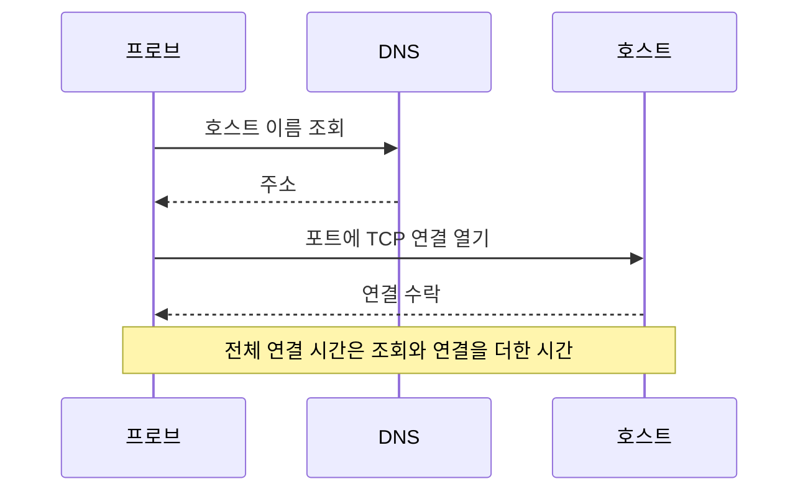

# 포트 모니터

포트 모니터는 호스트가 어떤 포트에서 TCP 연결을 받는지 확인하고, 연결에 걸리는 시간을 측정합니다. HTTP를 쓰지 않거나 HTTP를 확인하고 싶지 않은 서비스, 즉 데이터베이스, 메일 서버, SSH, 메시지 브로커 등에 사용하세요.

:::cards
- [모니터 만들기](#포트-모니터-만들기): 대시보드에서 여섯 단계.
- [연결 시간](#연결-시간): DNS, TCP, 전체 시간이 각각 측정하는 것.
- [모니터링 기준](#모니터링-기준): 연결 가능성과 연결 시간.
- [문제 해결](#문제-해결): 서비스는 작동 중인데 모니터가 오프라인으로 표시될 때.
:::

## 작동 방식

확인할 때마다 프로브는 호스트 이름이 주어졌다면 그 이름을 조회하고, 포트에 TCP 연결을 엽니다. 연결이 수락되는 즉시 포트는 온라인이며, 프로브는 아무것도 보내지 않고 연결을 닫습니다. 거부되었거나 시간 초과된 연결은 허용한 재시도 횟수만큼 다시 시도합니다. 그런 다음 OneUptime이 결과를 모니터의 기준에 통과시킵니다.

프로브는 TCP 연결만 엽니다. SNMP 에이전트처럼 UDP로만 수신하는 서비스는 포트 모니터로 확인할 수 없습니다.

확인이 실패하면 프로브는 호스트까지의 경로도 추적하고 그 이름을 조회한 뒤, 찾은 내용을 결과에 **Network Path at Time of Failure**로 첨부하므로 경로가 어디서 끊어졌는지 볼 수 있습니다. 자체 네트워크 연결을 잃은 프로브는 결과를 보고하지 않으므로 서비스를 오프라인으로 표시할 수 없습니다.

## 시작하기 전에

- **모니터를 만들 수 있는 역할**: Project Owner, Project Admin, Project Member, Monitor Admin 또는 Monitor Member, 또는 Create Monitor 권한이 있는 사용자 지정 역할.
- **포트에 연결할 수 있는 프로브.** 모든 새 모니터에는 프로젝트의 기본 프로브가 선택됩니다. 서비스 앞에 방화벽이 있으면 [OneUptime Cloud의 프로브 IP 주소](/docs/configuration/ip-addresses)가 포트에 연결하도록 허용합니다. 데이터베이스처럼 프라이빗 네트워크에 있는 서비스에는 그 네트워크 안의 [사용자 지정 프로브](/docs/probe/custom-probe)가 필요합니다.

## 포트 모니터 만들기

:::steps
### 새 모니터 시작

**모니터**로 이동해 **모니터 생성**을 클릭합니다. **모니터 유형**에서 **포트**를 선택합니다.

### 이름 지정

`Orders database` 같은 **이름**을 입력하고 **다음**을 클릭합니다.

### 호스트와 포트 입력

**호스트 이름 또는 IP 주소**에 포트가 있는 호스트를 입력합니다(예: `db.example.com` 또는 `10.0.0.12`). **포트**에는 `5432` 같은 포트 번호를 입력합니다.

### 테스트

**모니터 테스트**를 클릭하고 **프로브 선택**에서 프로브를 고른 다음 **테스트 실행**을 클릭합니다. **모니터 테스트 결과**에 연결이 열렸는지와 각 부분에 걸린 시간이 표시됩니다.

### 기준 검토

**모니터 기준**은 [기본 기준](#기본-기준)으로 시작합니다. 포트가 연결을 받지 않으면 오프라인, 받으면 온라인입니다. 필요하면 바꾼 다음 **다음**을 클릭합니다.

### 프로브 선택 및 생성

**프로브**와 **모니터링 간격**(**5분마다**로 시작)을 그대로 두거나 바꾼 다음 **모니터 생성**을 클릭합니다. 모니터 페이지가 열립니다.
:::

## 구성 옵션

| 필드 | 기본값 | 입력할 내용 |
| --- | --- | --- |
| **호스트 이름 또는 IP 주소** | 없음 | 호스트(예: `example.com`, `192.168.1.1`, `2001:db8::1`). `http://` 없이 호스트만 입력합니다. |
| **포트** | 없음 | 연결할 TCP 포트로, `1`부터 `65535`까지입니다. |
| **요청 시간 초과(초)** (**추가 필드** 안) | `60` | 한 번의 시도에 걸릴 수 있는 시간으로, DNS 조회와 TCP 연결을 합친 시간입니다. 최대 60초입니다. |
| **실패 시 재시도** (**추가 필드** 안) | 프로브 기본값, 보통 `3` | 실패한 시도를 다시 시도하는 횟수. 최대 3번입니다. |

**실패 시 재시도**는 첫 시도 _이후의_ 재시도를 세므로, `0`이면 확인을 한 번 실행하고 `2`면 최대 세 번 실행합니다. 비워 두면 프로브의 기본값을 사용합니다. 프로브의 `PROBE_MONITOR_RETRY_LIMIT`가 다르게 정하지 않는 한 3입니다. 시간 초과를 포함한 모든 실패를 시도 사이에 1초씩 쉬면서 다시 시도합니다. 10초보다 오래 걸린 성공한 연결도 한 번 더 확인합니다.

자주 쓰는 포트:

| 포트 | 서비스 |
| --- | --- |
| `22` | SSH |
| `25` | SMTP |
| `80` | HTTP |
| `443` | HTTPS |
| `3306` | MySQL |
| `5432` | PostgreSQL |
| `6379` | Redis |
| `27017` | MongoDB |

> [!NOTE]
> 많은 호스팅 업체가 외부로 나가는 SMTP를 차단합니다. ping을 보낼 수 없는 프로브(프로브는 이를 통해 자신이 그런 업체에서 실행 중임을 알아차립니다)에서는 시간 초과된 포트 `25` 확인을 온라인으로 봅니다. 메일 서버의 포트 `25`를 확실하게 확인하려면, 그 포트에 연결하도록 허용된 [사용자 지정 프로브](/docs/probe/custom-probe)에서 모니터를 실행합니다.

## 연결 시간

호스트 이름의 경우 프로브는 확인을 두 단계로 나누어 측정합니다.

| 단계 | 시작 | 끝 |
| --- | --- | --- |
| **DNS 조회** | 확인 시작 | 첫 TCP 연결 시도 |
| **TCP 연결** | 첫 TCP 연결 시도 | 연결이 수락될 때까지. IPv6와 IPv4 주소 사이를 전환하는 데 쓴 시간도 포함합니다 |

**Total Connection Time (DNS + TCP)** 값은 확인 시작부터 연결이 수락될 때까지입니다. 이 값은 포트 모니터의 응답 시간이기도 하므로, 응답 시간을 쓰는 기존 기준, 알림, 차트는 그대로 작동합니다.

대상이 IP 주소이면 DNS 조회가 없으므로 그 단계는 빠집니다. 단계별 측정이 생기기 전의 확인 결과에는 전체 연결 시간만 표시됩니다.

## 모니터링 기준

기준은 포트를 온라인, 저하됨, 오프라인 중 무엇으로 볼지, 그리고 그에 따라 인시던트를 선언할지 알림을 생성할지를 정합니다. 각 기준은 하나 이상의 필터를 확인합니다.

| 필터 | 조건 | 확인하는 것 |
| --- | --- | --- |
| **Is Online** | **참**, **거짓** | 포트가 연결을 수락했는지 여부. |
| **Total Connection Time (DNS + TCP) (in ms)** | **Greater Than**, **Less Than**, **Greater Than Or Equal To**, **Less Than Or Equal To** | 호스트 이름의 DNS 조회를 포함한 전체 연결 시간. |
| **Port DNS Lookup Time (in ms)** | **Greater Than**, **Less Than**, **Greater Than Or Equal To**, **Less Than Or Equal To** | 첫 TCP 시도 전의 DNS 조회. 대상이 IP 주소이면 값이 없습니다. |
| **Port TCP Connect Time (in ms)** | **Greater Than**, **Less Than**, **Greater Than Or Equal To**, **Less Than Or Equal To** | 첫 TCP 시도부터 연결이 수락될 때까지. IPv6와 IPv4 사이의 전환을 포함합니다. |
| **Is Request Timeout** | **참**, **거짓** | 모든 시도에서 DNS 조회나 TCP 연결이 시간 초과를 넘겼는지 여부. |

대상이 IP 주소이면 DNS 조회 기준에는 평가할 것이 없습니다. 호스트 이름과 IP 주소 모두에서 작동해야 하는 기준에는 전체 시간이나 TCP 연결 시간을 사용합니다.

필터가 둘 이상이면 **일치 조건**이 필터가 모두 일치해야 하는지(**전체**), 하나만 일치하면 되는지(**모두**)를 정합니다. 기준의 **작업**은 그 기준이 하는 일을 정합니다: 모니터 상태 변경, 알림 생성, 인시던트 선언, 또는 이들 중 여러 개.

### 기본 기준

새 포트 모니터는 두 가지 기준으로 시작합니다.

- **오프라인** — 모든 재시도 후에도 포트가 연결을 받지 않습니다. 모니터는 **오프라인**으로 표시되고 "_monitor name_ is offline"이라는 인시던트가 생성됩니다. 포트가 다시 연결을 받으면 인시던트는 스스로 해결됩니다.
- **온라인** — 포트가 연결을 받습니다. 모니터는 **정상 작동**으로 표시됩니다.

기준은 위에서 아래로 확인되며, 처음 일치한 기준이 무엇을 할지 정합니다. 일치하는 기준이 없으면 모니터는 기본 상태를 표시합니다. 기준 아래의 **추가 필드**에서 다른 상태를 고르지 않으면 **정상 작동**입니다.

### 일정 기간에 걸친 평가

**일정 기간에 걸쳐 이 기준을 평가**는 필터 아래의 확인란으로, **Is Online**, **Total Connection Time (DNS + TCP) (in ms)**, **Port DNS Lookup Time (in ms)**, **Port TCP Connect Time (in ms)** 필터에 제공됩니다. 켜면 최신 확인 대신 지난 확인들의 기간을 판단합니다. **평가**에서 집계를 고르고, **지난 시간 동안(분)** 항목에서 2분에서 60분 사이의 기간을 고릅니다.

| 집계 | 일치하는 경우 |
| --- | --- |
| **평균**, **합계**, **Maximum Value**, **Minimum Value** | 기간 전체에 대한 그 값이 조건을 충족할 때. 숫자 필터만 해당합니다. |
| **All Values** | 기간 안의 모든 확인이 조건을 충족할 때. |
| **Any Value** | 기간 안의 확인 중 적어도 하나가 조건을 충족할 때. |

**All Values**는 기간이 실제로 데이터로 채워진 뒤에만 일치합니다. 방금 만든 모니터나 확인이 더 이상 기록되지 않는 모니터에는 지난 N분에 대해 말할 만한 기록이 없으므로, 기준은 가진 값 하나로 일치하지 않고 기다립니다. **Any Value**는 "확인 한 번이라도 임계값을 넘으면 바로 알려 달라"를 위한 설정이며, 여전히 즉시 실행됩니다.

**데이터가 없는 경우**는 기간이 기준을 뒷받침할 수 없는 동안 무슨 일이 일어날지 정합니다.

| 옵션 | 일어나는 일 | 용도 |
| --- | --- | --- |
| **Ignore**(기본값) | 기준이 일치하지 않습니다. | 일반적인 임계값 알림. |
| **트리거** | 데이터가 없는 것 자체를 문제로 봅니다. | 침묵 자체가 장애인 확인. |
| **Treat As Zero** | 기간을 하나의 0으로 비교합니다. | 이벤트가 없으면 정말로 0을 뜻하는 카운터. |

### 기준 예시

| 목표 | 필터 | 조건 | 값 |
| --- | --- | --- | --- |
| 포트가 닫혀 있으면 오프라인 | **Is Online** | **거짓** | — |
| 연결이 느리면 알림 | **Total Connection Time (DNS + TCP) (in ms)** | **Greater Than** | `500` |
| 연결이 느리면 서비스를 저하됨으로 표시 | **Total Connection Time (DNS + TCP) (in ms)** | **Greater Than** | `200` |
| DNS가 느리면 알림 | **Port DNS Lookup Time (in ms)** | **Greater Than** | `100` |
| TCP 핸드셰이크가 느리면 알림 | **Port TCP Connect Time (in ms)** | **Greater Than** | `250` |

## 문제 해결

:::details 서비스는 작동 중인데 모니터가 오프라인으로 표시됨
프로브가 연결을 열 수 없었습니다. 방화벽이 연결을 버리거나, 서비스가 프라이빗 인터페이스에서만 수신하거나, 포트가 잘못되었습니다. 인시던트의 근본 원인과 모니터의 **모니터링 로그**에 오류가 표시되고, **Network Path at Time of Failure**에 경로가 어디까지 갔는지 표시됩니다. 방화벽에서 프로브를 허용하거나 네트워크 안의 [사용자 지정 프로브](/docs/probe/custom-probe)를 사용합니다.
:::

:::details DNS 조회 시간이 항상 비어 있음
대상이 IP 주소라서 조회할 것이 없습니다. 대신 **Total Connection Time (DNS + TCP) (in ms)** 또는 **Port TCP Connect Time (in ms)** 필터를 사용합니다.
:::

:::details UDP 서비스를 확인해야 함
포트 모니터는 TCP 연결만 엽니다. DNS 서버에는 [DNS 모니터](/docs/monitor/dns-monitor)를, UDP 포트 123의 시간 서버에는 [NTP 모니터](/docs/monitor/ntp-monitor)를 사용합니다. 둘 다 실제 쿼리를 보냅니다.
:::

## 다음 단계

:::cards
- [Ping 모니터](/docs/monitor/ping-monitor): 호스트 자체에 연결할 수 있는지 확인합니다.
- [SSL 인증서 모니터](/docs/monitor/ssl-certificate-monitor): TLS 포트의 인증서를 확인합니다.
- [데이터베이스 상태 모니터](/docs/monitor/database-health-monitor): 열린 포트를 넘어 데이터베이스의 상태를 감시합니다.
- [사용자 지정 프로브](/docs/probe/custom-probe): 여러분의 네트워크에 있는 포트를 확인합니다.
:::
