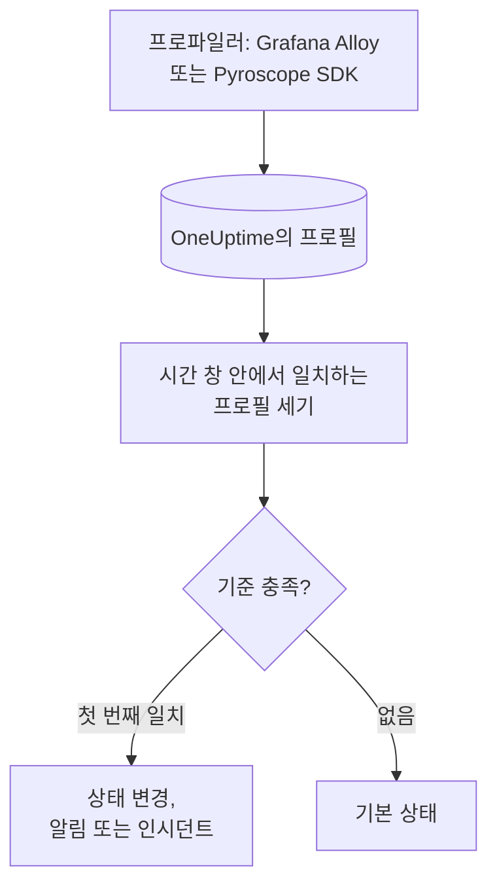

# 프로필 모니터

프로필 모니터는 서비스가 OneUptime에 보내는 연속 프로필 중 필터(프로필 유형, 서비스, 속성)와 일치하는 프로필을 시간 창 안에서 셉니다. 그 수가 기준을 충족하면 모니터의 상태를 바꾸거나, 알림을 만들거나, 인시던트를 선언합니다. 주된 용도는 서비스에서 프로파일링 데이터가 더 이상 들어오지 않는 것을 알아차리는 것입니다.

> [!IMPORTANT]
> 대시보드의 **모니터 생성**에는 Profiles가 없습니다. 아직 필터를 위한 양식이 없기 때문입니다. 아래 설명처럼 [API](/docs/api-reference/api-reference)나 [Terraform](/docs/terraform/monitor-steps)으로 프로필 모니터를 만드세요. 만든 뒤에는 대시보드에서 모니터의 **기준** 페이지에서 기준을 보고 편집할 수 있지만, 필터는 API나 Terraform으로만 바꿀 수 있습니다.

:::cards
- [모니터 만들기](#프로필-모니터-만들기): API나 Terraform으로 보낼 구성.
- [조회 대상](#조회-대상): 프로필 유형, 서비스, 속성, 창.
- [기준](#기준): 사용할 수 있는 조건.
- [실전 예](#실전-예-프로필이-더-이상-들어오지-않음): 서비스가 프로필을 더 이상 보내지 않을 때 알기.
:::

## 작동 방식



OneUptime은 매분 모니터의 필터와 일치하고 시간 창 안에서 시작된 프로필을 셉니다. 그 수를 모니터의 기준과 위에서부터 차례로 비교하고, 처음 일치하는 기준이 무슨 일이 일어날지 결정합니다. 일치하는 기준이 없으면 모니터는 기본 상태로 돌아갑니다.

## 시작하기 전에

- 서비스가 Grafana Alloy(eBPF)나 Pyroscope SDK로 OneUptime에 연속 프로파일링 데이터를 보내고 있어야 합니다. [연속 프로파일링](/docs/telemetry/profiles)을 참고하세요.
- 모니터를 만들 수 있는 API 키가 있거나, OneUptime Terraform 공급자가 설정되어 있어야 합니다.
- 지켜볼 각 텔레메트리 서비스의 ID와, 그 서비스가 보내는 프로필 유형(`cpu`, `wall`, `alloc_objects`, `alloc_space`, `goroutine` 등)을 알고 있어야 합니다.

## 프로필 모니터 만들기

:::steps
### 셀 대상 선택

단계의 `profileMonitor` 구성을 작성합니다. 이 구성은 서비스 하나의 CPU 프로필을 최근 5분 동안 셉니다.

```json
{
  "profileMonitor": {
    "telemetryServiceIds": [],
    "profileTypes": ["cpu"],
    "profileType": "",
    "attributes": {},
    "lastXSecondsOfProfiles": 300
  }
}
```

서비스의 ID를 `telemetryServiceIds`에 넣거나, 모든 서비스의 프로필을 세려면 목록을 비워 두세요. 각 필드는 [조회 대상](#조회-대상)에서 설명합니다.

### 모니터 만들기

[API](/docs/api-reference/api-reference)나 [Terraform](/docs/terraform/monitor-steps)으로, 모니터 유형이 `Profiles`이고 이 구성과 하나 이상의 기준을 담은 단계가 있는 모니터를 만듭니다. Terraform에서는 `jsonencode()`로 작성한 구성을 단계의 `profile_monitor` 속성으로 전달합니다.

### 대시보드에서 확인

**모니터**에서 모니터를 엽니다. 1분 안에 첫 평가가 실행되고, 기준이 일치하는 즉시 상태가 바뀝니다.
:::

## 조회 대상

| 필드 | 일치 대상 | 기본값 |
| --- | --- | --- |
| `profileTypes` | 이 유형 중 하나의 프로필. `cpu`처럼 정확히 비교합니다. | 비어 있음: 모든 유형 |
| `profileType` | 유형에 이 텍스트가 포함된 프로필. 대소문자를 구분하지 않습니다. 설정하면 `profileTypes`는 무시됩니다. | 비어 있음 |
| `telemetryServiceIds` | 이 텔레메트리 서비스 중 하나에서 온 프로필. | 비어 있음: 모든 서비스 |
| `entityKeys` | 이 호스트, 파드, 컨테이너 및 기타 인프라 엔터티 중 하나에서 온 프로필. | 비어 있음: 모든 엔터티 |
| `attributes` | 속성이 이 값을 가진 프로필. | 비어 있음: 조건 없음 |
| `lastXSecondsOfProfiles` | 평가 전 이 초 안에 시작된 프로필. | 없음: 항상 설정하세요. 그렇지 않으면 저장된 모든 프로필이 세어져 개수가 절대 0으로 떨어지지 않습니다 |

프로필이 세어지려면 설정한 모든 필터와 일치해야 합니다.

## 평가 방식

- **매분.** 프로필 모니터는 프로브가 확인하지 않으므로 설정할 간격도, **프로브 및 간격** 페이지도 없습니다.
- **평가마다 숫자 하나.** 모니터는 모든 필터와 일치하고 `lastXSecondsOfProfiles` 안에서 시작된 프로필을 셉니다. 프로파일러는 일정한 간격으로 업로드하므로, 창에 여러 번의 업로드가 들어갈 여유를 두세요.
- **프로필이 없으면 개수는 0입니다.** 프로파일러가 업로드를 멈춘 서비스는 0이 됩니다.
- **OneUptime 자체의 중단은 침묵이 아닙니다.** OneUptime 자체가 데이터를 받지 못한 시간(재시작, 업그레이드, 밀린 작업 처리 중)이 시간 창에 들어 있는 동안 확인은 기다립니다. 상태가 바뀌지 않으며, 인시던트나 알림이 열리거나 해결되지도 않습니다. [OneUptime이 데이터를 받지 못할 때](/docs/monitor/when-oneuptime-is-not-receiving)를 참고하세요.
- **기준은 위에서부터.** 처음 일치하는 기준이 결정하므로 가장 심각한 기준을 맨 위에 두세요.

모든 상태 변경은 그 이유와 함께 모니터의 **상태 타임라인**에 기록됩니다.

## 기준

프로필 모니터의 기준에는 필터가 하나뿐입니다. 창 안에서 일치한 프로필의 수인 **Profile Count**입니다. 이 값을 다음과 비교합니다.

| 필터 조건 | 프로필 수가 다음과 같을 때 일치 |
| --- | --- |
| **Greater Than** | 값보다 큼 |
| **Greater Than Or Equal To** | 값 이상 |
| **Less Than** | 값보다 작음 |
| **Less Than Or Equal To** | 값 이하 |
| **Equal To** | 값과 정확히 같음 |
| **Not Equal To** | 값이 아닌 모든 것 |

프로필 수에는 이상 조건이 없습니다. 비교할 기준선이 없기 때문입니다.

## 실전 예: 프로필이 더 이상 들어오지 않음

checkout 서비스는 CPU 프로필을 업로드하는 Pyroscope SDK를 실행합니다. 프로필이 5분 동안 들어오지 않으면 인시던트를 만들고 싶다고 합시다.

- `profileTypes`: `["cpu"]`, `telemetryServiceIds`: checkout 서비스, `lastXSecondsOfProfiles`: `300`
- 기준 1: **Profile Count** **Equal To** `0`: 모니터를 오프라인으로 표시하고 인시던트 선언
- 기준 2: **Profile Count** **Greater Than** `0`: 모니터를 온라인으로 표시

SDK가 업로드하는 동안에는 평가마다 프로필 몇 개가 세어지고 기준 2가 모니터를 온라인으로 유지합니다. 서비스가 SDK 없이 배포되면 마지막 업로드 5분 뒤 개수가 0으로 떨어지고, 기준 1이 일치해 인시던트가 선언됩니다. 수정 후 첫 업로드로 개수가 다시 0을 넘고, 그 인시던트에 **인시던트 자동 해결**이 켜져 있으면 인시던트가 저절로 해결됩니다.

## 문제 해결

:::details 모니터는 0으로 세는데 OneUptime에는 프로필이 보임
보이는 프로필과 필터를 비교하세요. `profileTypes`는 유형과 정확히 일치해야 하고, `telemetryServiceIds`에는 올바른 서비스 ID가 들어 있어야 합니다. `lastXSecondsOfProfiles`가 짧으면 두 업로드 사이에 놓일 수도 있습니다.
:::

:::details 모니터 생성에 Profiles가 없음
예상된 동작입니다. 대시보드에는 아직 프로필 모니터의 필터를 위한 양식이 없습니다. [프로필 모니터 만들기](#프로필-모니터-만들기)에서 설명한 대로 API나 Terraform으로 만드세요.
:::

## 다음 단계

:::cards
- [연속 프로파일링](/docs/telemetry/profiles): Grafana Alloy나 Pyroscope SDK에서 프로필을 보냅니다.
- [모니터 단계](/docs/terraform/monitor-steps): Terraform에서 단계 구성을 전달합니다.
- [트레이스 모니터](/docs/monitor/traces-monitor): 실패한 스팬에 대해 알림을 받습니다.
- [메트릭 모니터](/docs/monitor/metrics-monitor): CPU, 메모리 및 기타 메트릭에 대해 알림을 받습니다.
:::
