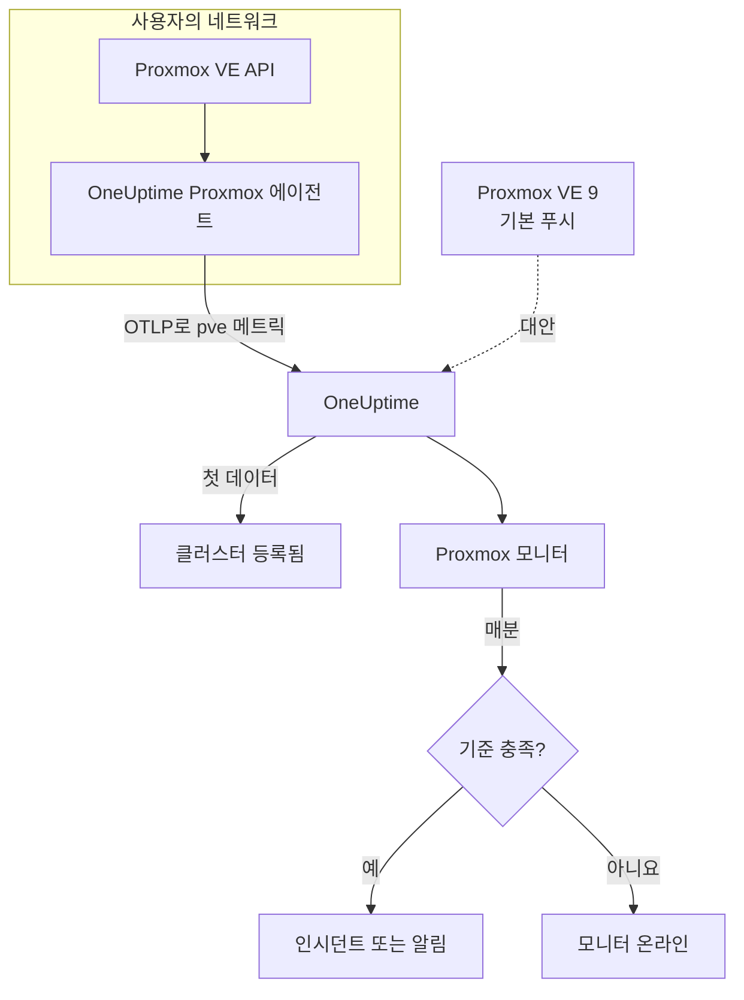

# Proxmox 모니터

Proxmox 모니터는 Proxmox VE 클러스터 하나(노드, VM과 LXC 컨테이너, 스토리지, HA 상태, 백업 작업 범위, 스토리지 복제)를 감시하고, 노드가 오프라인이 되거나 게스트가 멈추거나 스토리지가 가득 차 갈 때 알려 줍니다. OneUptime Proxmox 에이전트가 수집하는 `pve_*` 메트릭을 읽으므로 외부에서 아무것도 탐색하지 않습니다.

:::cards
- [모니터 만들기](#proxmox-모니터-만들기): 대시보드에서 6단계.
- [템플릿](#미리-만들어진-알림-템플릿): 노드, 게스트, 볼륨마다 인시던트 하나를 여는 11개의 미리 만들어진 알림.
- [리소스 식별](#리소스-식별): 노드, 게스트, 스토리지 볼륨 하나를 대상으로 지정하는 방법.
- [메트릭](#수집되는-메트릭): 모니터가 알림에 쓸 수 있는 모든 `pve_*` 계열.
:::

## 작동 방식

OneUptime Proxmox 에이전트는 Proxmox VE API에 닿을 수 있는 머신에서 실행됩니다. 30초마다 클러스터 및 노드 수집기로 prometheus-pve-exporter를 수집하고, 각 계열에 그것이 설명하는 리소스 레이블을 붙인 뒤, 클러스터 이름 `proxmox.cluster.name`을 찍어 OTLP로 OneUptime에 메트릭을 보냅니다. 첫 데이터가 클러스터를 등록합니다. Proxmox VE 9 이상은 대신 아무것도 설치하지 않고 메트릭을 직접 푸시할 수 있습니다. [기본 푸시](#proxmox-ve-기본-푸시)를 참고하세요.

Proxmox 모니터는 클러스터 하나에 연결됩니다. 매분 그 클러스터의 메트릭에 쿼리를 실행하고 결과를 기준과 비교합니다.

## 시작하기 전에

- **Proxmox 에이전트를 설치하세요**. Proxmox VE API에 닿을 수 있는 곳에 읽기 전용 API 토큰으로 설치합니다. [Proxmox 에이전트 가이드](/docs/telemetry/proxmox)에서 토큰, 설치, 기본 푸시를 다룹니다.
- **클러스터가 등록되었는지 확인하세요.** 첫 수집 후 약 1분이 지나면 에이전트의 `PROXMOX_CLUSTER_NAME` 이름으로 **제품 → 인프라 → Proxmox → 모든 클러스터** 에 나타납니다.

## Proxmox 모니터 만들기

:::steps
### 새 모니터 시작

**모니터** 로 이동해 **모니터 생성** 을 클릭합니다.

### Proxmox 선택

**모니터 유형** 에서 **더 많은 모니터 유형** 을 클릭하고 **인프라** 아래의 **Proxmox** 를 고르거나, 검색 상자에 `proxmox`를 입력합니다. **이름** 을 입력하고(인시던트와 알림 제목에 쓰입니다) **다음** 을 클릭합니다.

### 클러스터 선택

**Proxmox Monitor Configuration** 에서 **Proxmox Cluster** 의 클러스터를 고릅니다. 데이터를 보낸 모든 클러스터가 목록에 있습니다.

### 감시할 대상 선택

세 탭 중 하나를 고릅니다.

- **Quick Setup** – [템플릿](#미리-만들어진-알림-템플릿)을 클릭합니다. 메트릭, 필터, 집계, 시간 범위, 임계값을 설정하고 아래 기준을 템플릿의 기준으로 바꿉니다. **시간 범위** 는 계속 바꿀 수 있습니다.
- **Custom Metric** – **Proxmox Metric** 에서 메트릭 하나를 고른 다음 **집계** 와 **시간 범위** 를 설정합니다. [필터](#모니터-설정)로 리소스 종류나 리소스 하나로 좁힙니다.
- **고급** – **메트릭 선택** 에서 쿼리와 수식을 직접 만듭니다. 예를 들어 `pve_memory_usage_bytes / pve_memory_size_bytes`로 메모리 퍼센트를 구합니다. **Group by** 에 `id`를 지정하면 리소스를 하나씩 판단합니다.

### 기준 확인

**모니터 기준** 의 각 기준을 열어 **메트릭**, **집계**, **조건**, **Threshold** 를 확인합니다. 템플릿은 이것들을 채웁니다. **Custom Metric** 이나 **고급** 을 쓰면 모니터는 메트릭이 0으로 떨어지는 것만 감지하는 [기본 기준](#기본-기준)으로 시작하므로, 직접 임계값을 설정하세요.

### 모니터 만들기

**모니터 생성** 을 클릭합니다. OneUptime이 모니터 페이지를 열고 매분 평가합니다. 모니터가 연 인시던트와 알림은 클러스터의 **인시던트** 및 **알림** 페이지에도 표시됩니다.
:::

> [!TIP]
> 여러 템플릿을 한 번에 설정하려면 **제품 → 인프라 → Proxmox** 에서 클러스터를 열고 **Recommendations** 로 이동하세요. 원하는 템플릿과 호출할 사람을 고르면 OneUptime이 템플릿마다 모니터를 하나씩 만듭니다.

## 모니터 설정

| 필드 | 탭 | 하는 일 |
| --- | --- | --- |
| **Proxmox Cluster** | 모두 | 필수. 모든 쿼리를 `resource.proxmox.cluster.name`으로 한정합니다. |
| **리소스 범위** | Custom Metric, 고급 | 선택 사항. **노드**, **Guest (VM / container)**, **스토리지**, **클러스터** 중 하나로, `pve.scope`와 정확히 일치합니다. |
| **PVE ID** | Custom Metric, 고급 | 선택 사항. `pve.id`와 정확히 일치: 노드 이름(`pve1`), VMID(`100`), `<node>/<storage>`(`pve1/local`). 범위와 함께 써서 리소스 하나를 대상으로 지정합니다. |
| **노드 이름** | Custom Metric, 고급 | 선택 사항. 노드 자신의 계열만(`pve.scope = node`와 `pve.id`). 그 노드의 게스트나 스토리지는 고를 수 없습니다. |
| **Guest ID** | Custom Metric, 고급 | 선택 사항. `qemu/100`이나 `lxc/101` 같은 원시 `id` 레이블과 정확히 일치. 설정하면 다른 필터는 무시됩니다. |
| **Proxmox Metric** | Custom Metric | [카탈로그](#수집되는-메트릭)의 메트릭 하나. |
| **집계** | Custom Metric | 샘플을 합치는 방식: **평균**, **최대**, **최소**, **합계**, **개수**. 메트릭의 일반적인 집계에서 시작합니다. |
| **시간 범위** | 모두 | 쿼리가 읽는 이동 기간으로, **Past 1 Minute** 부터 **Past 365 Days** 까지입니다. 새 모니터는 **Past 1 Minute** 에서 시작하고, 템플릿은 자체 값을 설정합니다. |
| **메트릭 선택** | 고급 | 쿼리 빌더: **메트릭**, **Aggregate by**, **Filter by attributes**, **Group by**, 그리고 쿼리를 결합하는 **메트릭 추가** 와 **수식 추가**. |

## 리소스 식별

모든 계열은 자신이 속한 Proxmox 리소스를 가리키는 데이터 포인트 레이블 `id`를 가집니다.

| `id` 값 | 리소스 |
| --- | --- |
| `node/<name>` | 클러스터 노드. 예: `node/pve1`. |
| `qemu/<vmid>` | QEMU 가상 머신. 예: `qemu/100`. |
| `lxc/<vmid>` | LXC 컨테이너. 예: `lxc/101`. |
| `storage/<node>/<storage>` | 노드의 스토리지 볼륨. 예: `storage/pve1/local`. |

예외가 두 가지 있습니다. 복제 계열(`pve_replication_*`)은 `id`에 복제 **작업** ID(예: `100-0`)를 가지며, 클러스터 전체의 `pve_not_backed_up_total`에는 `id`가 아예 없습니다.

필터는 접두사가 아니라 같음으로 비교하므로, 에이전트는 `id`를 필터에 쓸 수 있는 세 속성으로도 나눕니다. 템플릿은 이 속성들을 씁니다.

| 속성 | 값 | `qemu/100`의 경우 |
| --- | --- | --- |
| `pve.scope` | `node`, `guest`, `storage`, `cluster`(`qemu`와 `lxc`는 둘 다 `guest`) | `guest` |
| `pve.type` | `node`, `qemu`, `lxc`, `storage` | `qemu` |
| `pve.id` | `id`의 첫 `/` 뒤의 모든 것(`pve1`, `100`, `pve1/local`) | `100` |

리소스 종류 하나로 좁히려면 `pve.scope`나 `pve.type`으로, 리소스 하나로 좁히려면 `pve.id`나 `id`로 필터링하고, 리소스를 하나씩 판단하려면 `id`로 그룹화하세요.

## 미리 만들어진 알림 템플릿

**Quick Setup** 에는 템플릿이 11개 있습니다. 각각 완전한 모니터를 만듭니다. 쿼리, 속성 필터, 그룹화, 작동하는 기준, 회복하는 기준입니다. 대부분 `id`로 그룹화하므로, 노드, 게스트, 볼륨, 작업마다 자체 인시던트와 알림을 받습니다. 임계값은 출발점이므로 편집할 수 있습니다.

표에 달리 적혀 있지 않으면 템플릿은 최근 5분을 읽습니다. 기준은 기간의 매분 조건이 유지될 때만 작동하고, 임계값 기준은 임계값에서 10% 지난 지점에서 회복하므로 경계 근처를 오가는 값 때문에 깜빡이지 않습니다.

| 템플릿 | 심각도 | 감시 대상 | 작동 조건 | 회복 조건 |
| --- | --- | --- | --- | --- |
| Node Offline | 심각 | `pve.scope = node`의 `pve_up`, `id`별 Min | 1 미만 | 1이 됨 |
| Guest Down | Warning | `pve.scope = guest`의 `pve_up`과 `pve_onboot_status`, `id`별 Min | `pve_onboot_status`가 1인데 `pve_up`이 1 미만 | `pve_up`이 다시 1이 되거나, 부팅 시 시작이 꺼짐 |
| Cluster Quorum at Risk | 심각 | `pve.scope = node`의 `pve_up` ÷ `pve_node_info` × 100(둘 다 합계): 온라인 노드의 비율 | 50% 이하 | 55% 초과 |
| High Node CPU Usage | Warning | `pve.scope = node`의 `pve_cpu_usage_ratio`, `id`별 Avg | 0.9 초과(노드 코어의 90%) | 0.81 이하 |
| High Node Memory Usage | Warning | `pve.scope = node`의 `pve_memory_usage_bytes` ÷ `pve_memory_size_bytes` × 100, `id`별 | 85% 초과 | 76.5% 이하 |
| High Guest CPU Usage | Warning | `pve.scope = guest`의 `pve_cpu_usage_ratio`, `id`별 Avg, 최근 15분 | 15분 내내 0.95 초과(vCPU의 95%) | 0.855 이하 |
| Storage Near Full | Warning | `pve.scope = storage`의 `pve_disk_usage_bytes` ÷ `pve_disk_size_bytes` × 100, `id`별 | 85% 초과 | 76.5% 이하 |
| Container Root Disk Near Full | Warning | `pve.type = lxc`에 대한 같은 디스크 비율, `id`별 | 90% 초과 | 81% 이하 |
| HA Resource in Error State | 심각 | `state = error`의 `pve_ha_state`, `id`별 Max | 0 초과 | 0이 됨 |
| Guest Not Backed Up | Warning | `pve_not_backed_up_total`, Max(클러스터 전체에 계열 하나) | 0 초과 | 0이 됨 |
| Replication Failing | 심각 | `pve_replication_failed_syncs`, `id`(작업 ID)별 Max | 0 초과 | 0이 됨 |

**심각도** 는 선택 목록에 표시되는 레이블입니다. 템플릿이 만드는 인시던트와 알림은 프로젝트에서 가장 심각한 인시던트 및 알림 심각도로 시작하니, 기준에서 바꾸세요.

- **중단 감지 템플릿은 최소를 씁니다**. 그래서 리소스가 내려가 있던 수집 한 번이 작동시키며, 리소스가 실행 중이던 수집에 가려지지 않습니다.
- **Guest Down** 템플릿은 부팅 시 시작하도록 설정된 게스트만 보므로, 일부러 멈춘 게스트 때문에 누군가 호출되는 일은 없습니다.
- **Cluster Quorum at Risk** 템플릿은 근사치입니다. pve-exporter에는 corosync 메트릭이 없으므로 온라인인 노드를 셉니다.
- **High Guest CPU Usage** 템플릿은 노드 템플릿보다 높고 느립니다. 게스트는 원래 vCPU를 쓰도록 만들어졌으므로, 결코 내려오지 않는 게스트만 호출합니다.
- **비율 수식** 은 양쪽의 **합계** 를 씁니다. 둘 다 같은 수집에서 오므로 결과는 진짜 퍼센트입니다.
- **Container Root Disk Near Full** 템플릿은 QEMU VM을 제외합니다. QEMU 게스트 에이전트가 없으면 디스크 사용량이 0으로 나오기 때문입니다.
- **Guest Not Backed Up** 템플릿은 백업 작업에 포함되었는지만 다룹니다. pve-exporter는 백업이 실행되었는지, 성공했는지 알려 주지 않습니다. 게스트 목록을 보려면 `pve_not_backed_up_info`를 `id`로 그룹화하세요.
- **복제 지연**(현재 시각에서 마지막 동기화를 뺀 값)은 기준에서 시간 계산을 할 수 없으므로 알림에 쓸 수 없습니다. 클러스터의 **개요** 페이지에 표시되니, 대신 **Replication Failing** 으로 알림을 보내세요.

### Proxmox VE 기본 푸시

Proxmox VE 9 이상은 내장 OpenTelemetry 메트릭 서버로 아무것도 설치하지 않고 메트릭을 푸시할 수 있습니다. [Proxmox 에이전트 가이드](/docs/telemetry/proxmox)를 참고하세요. OneUptime은 푸시를 같은 `pve_*` 계열로 바꾸므로, 카탈로그와 CPU, 메모리, 스토리지 템플릿이 그대로 작동합니다.

**Node Offline** 과 **Cluster Quorum at Risk** 도 작동합니다. 각 노드는 자신의 상태만 푸시하므로, 보고를 멈춘 노드는 아직 살아 있는 노드들이 중단(`pve_up` = 0)으로 보고합니다. [노드가 보고를 멈출 때](/docs/telemetry/proxmox#when-a-node-stops-reporting)를 참고하세요. **Guest Down**, **HA Resource in Error State**, **Guest Not Backed Up**, **Replication Failing** 에는 에이전트만 수집하는 데이터가 필요합니다.

## 수집되는 메트릭

에이전트는 클러스터와 노드 수집기 모두로 30초마다 prometheus-pve-exporter를 수집하며, 여기에는 익스포터의 `backup-info`와 `replication` 수집기(둘 다 기본적으로 켜짐)도 포함됩니다.

### 가용성

| 메트릭 | 단위 | 설명 |
| --- | --- | --- |
| `pve_up` | — | 노드나 게스트가 켜져 있거나 실행 중이면 1, 아니면 0. |
| `pve_uptime_seconds` | 초 | 노드나 게스트의 가동 시간. |
| `pve_version_info` | 개수 | 레이블에 담긴 Proxmox VE 릴리스. 항상 1. |

### 노드

| 메트릭 | 단위 | 설명 |
| --- | --- | --- |
| `pve_node_info` | 개수 | 노드 메타데이터, 항상 1. 합하면 보고 중인 노드 수가 됩니다. |
| `pve_cpu_usage_ratio` | 비율 | 사용 가능한 CPU 대비 사용 중인 CPU의 비율(0–1). |
| `pve_cpu_usage_limit` | 코어 | 사용 가능한 CPU(코어). 게스트는 그 vCPU. |
| `pve_memory_usage_bytes` | 바이트 | 사용 중인 메모리. |
| `pve_memory_size_bytes` | 바이트 | 전체 메모리. |

CPU와 메모리 계열은 각 게스트에 대해서도 `qemu/*`와 `lxc/*` ID로 보고됩니다.

### 게스트

| 메트릭 | 단위 | 설명 |
| --- | --- | --- |
| `pve_guest_info` | 개수 | 레이블에 담긴 게스트 메타데이터(이름, 노드, 유형 `qemu` 또는 `lxc`). 항상 1. |
| `pve_network_receive_bytes` | 바이트 | 게스트가 받은 바이트. 수명 전체 카운터. |
| `pve_network_transmit_bytes` | 바이트 | 게스트가 보낸 바이트. 수명 전체 카운터. |
| `pve_disk_read_bytes` | 바이트 | 게스트가 디스크에서 읽은 바이트. 수명 전체 카운터. |
| `pve_disk_write_bytes` | 바이트 | 게스트가 디스크에 쓴 바이트. 수명 전체 카운터. |
| `pve_onboot_status` | 개수 | 노드가 부팅될 때 게스트가 시작되면 1. 이 설정이 있는 멈춘 게스트는 대개 계획에 없던 중단입니다. |

### 스토리지

| 메트릭 | 단위 | 설명 |
| --- | --- | --- |
| `pve_disk_usage_bytes` | 바이트 | 디스크나 스토리지에서 사용 중인 바이트. QEMU 게스트는 QEMU 게스트 에이전트가 설치되어 있지 않으면 0입니다. |
| `pve_disk_size_bytes` | 바이트 | 디스크나 스토리지의 전체 크기. |
| `pve_storage_info` | 개수 | 스토리지 메타데이터, 항상 1. 합하면 스토리지 볼륨 수가 됩니다. |

### HA

| 메트릭 | 단위 | 설명 |
| --- | --- | --- |
| `pve_ha_state` | — | 각 HA 리소스에 대해 HA 상태(`started`, `stopped`, `error`, …)마다 계열 하나가 있으며, 현재 상태에서 1입니다. 상태로 알림을 보내려면 `state` 레이블로 필터링하세요. |

### 백업

익스포터의 클러스터 수준 `backup-info` 수집기에서 옵니다. 백업 **작업** 포함 여부만 보고합니다.

| 메트릭 | 단위 | 설명 |
| --- | --- | --- |
| `pve_not_backed_up_total` | 개수 | 어떤 백업 작업에도 속하지 않은 게스트. `id`가 없는 클러스터 전체 계열 하나. |
| `pve_not_backed_up_info` | 개수 | 포함되지 않은 게스트마다 계열 하나, 항상 1, 게스트의 `id` 레이블이 붙습니다. 게스트가 백업 작업에 들어가면 사라집니다. |

### 복제

익스포터의 노드 수준 `replication` 수집기에서 옵니다. 계열은 클러스터에 복제 작업이 있을 때만 존재하며, `id`에 작업 ID를 가집니다.

| 메트릭 | 단위 | 설명 |
| --- | --- | --- |
| `pve_replication_failed_syncs` | 개수 | 연속으로 실패한 동기화 시도. 0보다 크면 복제본이 오래되어 가고 있습니다. |
| `pve_replication_duration_seconds` | 초 | 마지막 동기화에 걸린 시간. |
| `pve_replication_last_sync_timestamp_seconds` | 초 | 마지막으로 **성공한** 동기화의 Unix 시각. |
| `pve_replication_last_try_timestamp_seconds` | 초 | 마지막 **시도** 의 Unix 시각. 마지막 동기화보다 새로우면 최근 시도가 실패한 것입니다. |
| `pve_replication_next_sync_timestamp_seconds` | 초 | 다음 예정된 동기화의 Unix 시각. |
| `pve_replication_info` | 개수 | 레이블에 담긴 작업 메타데이터(유형, 원본, 대상, 게스트). 항상 1. |

## 모니터링 기준

기준은 모니터의 쿼리나 수식 하나를 임계값과 비교합니다. Proxmox 모니터의 기준에는 **필터 유형** 이 없으며, 모든 규칙이 다음 필드로 메트릭 값을 확인합니다.

| 필드 | 하는 일 |
| --- | --- |
| **메트릭** | 확인할 쿼리나 수식(변수 이름으로 지정). |
| **집계** | 기간 안의 값을 하나의 답으로 만드는 방식: **평균**, **합계**, **Maximum Value**, **Minimum Value**, **All Values**(모든 값이 일치해야 함), **Any Value**(하나면 충분). |
| **조건** | **Greater Than**, **Less Than**, **Greater Than Or Equal To**, **Less Than Or Equal To**, **Equal To**, 또는 이상 조건 **Anomalously High**, **Anomalously Low**, **Anomalous**. |
| **Threshold** | 비교할 값. 메트릭에 단위가 있으면 옆에 단위 목록이 있습니다. 이상 조건에서는 표시되지 않습니다. |
| **민감도** | 이상 조건 전용. **낮음**(4σ), **중간**(3σ, 기본값), **높음**(2σ). |
| **기준선 기간** | 이상 조건 전용. 기록 14일(기본값), 28일, 60일, 90일. |
| **데이터가 없는 경우** | **추가 필드** 아래에 있습니다. 기간에 샘플이 없을 때의 동작: **Ignore**(기본값), **Treat As Zero**, **트리거**. |

이상 조건은 각 값을 기준선의 같은 요일·같은 시간대와 비교합니다. 기준선 기간에 기록이 충분히 쌓일 때까지 "Learning" 상태로 남으며 아무것도 만들지 않습니다.

각 기준은 일치했을 때 할 일도 정합니다. 모니터 상태 변경, 알림 생성, 인시던트 선언입니다. 기준은 위에서 아래로 확인되며, 처음 일치한 기준이 결정합니다.

### 기본 기준

템플릿으로 만들지 않은 모니터는 두 개의 기준으로 시작합니다.

| 순서 | 기준 | 일치하는 경우 | 결과 |
| --- | --- | --- | --- |
| 1 | Check if _monitor name_ is offline | 첫 번째 쿼리의 값 중 하나가 `0` | 모니터를 **오프라인** 으로 표시하고 인시던트 "_monitor name_ is offline"을 선언합니다. 모니터가 회복하면 스스로 해결됩니다. |
| 2 | Check if _monitor name_ is online | 값 중 하나가 `0`보다 큼 | 모니터를 **정상 작동** 으로 표시합니다. |

> [!IMPORTANT]
> 무응답은 어느 기준과도 일치하지 않습니다. 데이터를 보내지 않게 된 클러스터는 모니터를 원래 상태 그대로 둡니다. 데이터가 멈출 때 알림을 받으려면 기준에서 **데이터가 없는 경우** 를 **트리거** 로 설정하세요. OneUptime 자체가 데이터를 받지 못한 시간은 절대 데이터 없음으로 취급되지 않습니다. 그런 시간이 포함된 기간의 확인은 대신 기다리며, 자세한 내용은 [OneUptime이 데이터를 받지 못할 때](/docs/monitor/when-oneuptime-is-not-receiving)에서 설명합니다.

## 문제 해결

:::details 클러스터가 Proxmox Cluster 목록에 없음
클러스터는 에이전트의 데이터에서 스스로 등록됩니다. 에이전트가 실행 중이고 데이터를 보내는지([Proxmox 에이전트 가이드](/docs/telemetry/proxmox) 참고), `PROXMOX_CLUSTER_NAME`이 설정되어 있는지 확인하세요.
:::

:::details 게스트 메트릭이 없음
게스트 계열은 익스포터의 클러스터 수집기에서 오며, 함께 제공되는 구성은 수집 매개변수 `cluster=1`로 이를 켭니다. 수집기 구성을 바꿨다면 되돌리세요.
:::

:::details High Node CPU Usage가 작동하지 않음
템플릿은 `pve_cpu_usage_ratio`를 `id`별로 평균하므로 노드를 하나씩 확인합니다. 직접 쿼리를 만들었다면 `id`로 그룹화하세요. 모든 노드의 평균은 유휴 노드 때문에 낮아집니다.
:::

:::details 클러스터에서 뺀 노드에 대해 Node Offline이 계속 작동함
Proxmox VE 기본 푸시에서는 클러스터에서 뺀 노드가 다운된 노드와 똑같아 보입니다. 보고를 멈췄으므로 아직 살아 있는 노드들이 계속 중단으로 보고합니다. 노드 페이지를 열고 **Remove Node** 를 클릭하면 노드가 사라지고 알림이 해결됩니다. 그러지 않으면 최대 7일 동안 오프라인으로 남습니다. 에이전트에는 이 문제가 없습니다. 에이전트는 클러스터에 묻고, 클러스터 목록에는 더 이상 그 노드가 없기 때문입니다.
:::

:::details 백업이나 복제 메트릭이 없음
`pve_not_backed_up_*`는 익스포터의 `backup-info` 수집기에서, `pve_replication_*`는 `replication` 수집기에서 옵니다. 둘 다 기본적으로 켜져 있으며, 함께 제공되는 구성의 수집 매개변수 `cluster=1`과 `node=1`이 다룹니다. 직접 익스포터를 운영한다면 이것들을 끄지 않았는지 확인하세요. `pve_replication_*`는 클러스터에 스토리지 복제 작업이 있을 때만 존재합니다.
:::

:::details pve_network_receive_bytes 같은 카운터가 늘기만 함
네트워크와 디스크 I/O 계열은 수명 전체 카운터이고, 기준은 원시 값을 비교합니다. 비율 연산자는 없으며, 쿼리 빌더의 **Convert to per-second rate** 는 차트만 바꿉니다. 차트에서는 비율로 보거나, 같은 카운터의 **최대** 쿼리에서 **최소** 쿼리를 빼는 수식처럼 증가량으로 알림을 보내세요.
:::

## 다음 단계

:::cards
- [Proxmox 에이전트](/docs/telemetry/proxmox): 에이전트를 설치하거나 기본 푸시를 설정합니다.
- [Ceph 모니터](/docs/monitor/ceph-monitor): Proxmox 클러스터 뒤의 Ceph 스토리지를 감시합니다.
- [VMware 모니터](/docs/monitor/vmware-monitor): vSphere용 같은 종류의 모니터.
- [인시던트 개요](/docs/incidents/index): 기준이 인시던트를 선언한 뒤 일어나는 일.
:::
