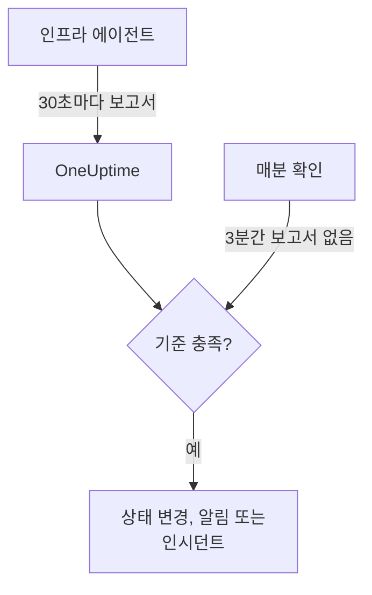

# 서버 / VM 모니터

Server / VM 모니터는 OneUptime 인프라 에이전트(`oneuptime-infrastructure-agent`)를 통해 머신 한 대를 감시합니다. 이 에이전트는 30초마다 CPU, 메모리, 디스크, 부하, 네트워크, 실행 중인 프로세스를 OneUptime에 보고하는 작은 서비스입니다. 이 페이지에서는 에이전트를 Server / VM 모니터에 연결하는 방법, 에이전트가 보고하는 내용, 그리고 서버가 온라인인지 오프라인인지 판단하는 기준을 작성하는 방법을 설명합니다.

> [!IMPORTANT]
> **모니터 생성** 에서는 더 이상 **Server / VM** 을 선택할 수 없습니다. 이미 있는 Server / VM 모니터는 계속 작동하며, 이 페이지의 모든 내용이 적용됩니다. 새 서버를 감시하려면 대신 [호스트 모니터](/docs/monitor/host-monitor)를 만드세요. [호스트 OpenTelemetry 수집기](/docs/telemetry/host-otel-collector)가 보내는 호스트 메트릭으로 알림을 보냅니다.

:::cards
- [에이전트 연결](#에이전트-연결): 설치하고, 모니터의 비밀 키를 전달한 뒤 시작합니다.
- [에이전트가 보고하는 내용](#에이전트가-보고하는-내용): CPU, 메모리, 디스크, 부하, 네트워크, 프로세스.
- [모니터링 기준](#모니터링-기준): 서버를 온라인 또는 오프라인으로 볼 시점을 정합니다.
- [문제 해결](#문제-해결): 에이전트가 보고하지 않거나 모니터가 오프라인이 되지 않을 때.
:::

## 작동 방식

에이전트는 시스템 서비스로 실행됩니다. 30초마다 보고서를 수집해 모니터의 비밀 키로 서명한 뒤 OneUptime URL로 보냅니다. OneUptime은 수치를 모니터의 메트릭으로 저장하고 보고서를 모니터의 기준과 대조합니다.

무응답은 따로 확인합니다. OneUptime은 매분 3분 이상 보고가 없는 모든 Server / VM 모니터의 **Is Online** 기준을 다시 평가하며, 기준이 허용하는 시간(기본값 3분)보다 오래 응답이 없는 서버를 오프라인으로 간주합니다. **Is Online** 기준이 없는 모니터는 에이전트가 응답하지 않는다는 이유만으로는 오프라인으로 표시되지 않습니다. 이 무응답에는 OneUptime이 데이터를 받고 있던 시간만 포함됩니다. OneUptime 자체가 재시작, 업그레이드, 밀린 작업 처리 중이던 시간은 포함되지 않으며, 자세한 내용은 [OneUptime이 데이터를 받지 못할 때](/docs/monitor/when-oneuptime-is-not-receiving)에서 설명합니다.



## 시작하기 전에

- 프로젝트에 있는 Server / VM 모니터.
- 모니터를 편집할 수 있는 권한. 비밀 키와 이를 포함한 설정 명령은 모니터를 편집할 수 있는 사람에게만 표시됩니다.
- 서버의 root 권한(Linux, macOS) 또는 관리자 권한(Windows). 에이전트는 자신을 시스템 서비스로 설치합니다.
- 서버에서 OneUptime URL로 나가는 HTTPS 연결(직접 또는 HTTP 프록시를 통해).

## 에이전트 연결

아래 명령은 `https://oneuptime.com`과 `YOUR_SECRET_KEY`를 사용합니다. 모니터 자체의 설정 명령에는 OneUptime URL과 모니터의 비밀 키가 이미 채워져 있으므로, 가능하면 모니터에서 복사하세요.

:::steps
### 모니터의 설정 명령 열기

**모니터** 로 이동해 Server / VM 모니터를 열고 **문서** 를 선택합니다. **Set up your Server Monitor (Linux/Mac)** 및 **Set up your Server Monitor (Windows)** 카드에 이 모니터용 명령이 있습니다. 에이전트가 처음 보고하기 전까지는 모니터의 **개요** 에도 표시됩니다.

### 에이전트 설치

:::tabs
@tab Linux
```bash
curl -sSL https://oneuptime.com/docs/static/scripts/infrastructure-agent/install.sh | sudo bash
```
@tab macOS
```bash
curl -sSL https://oneuptime.com/docs/static/scripts/infrastructure-agent/install.sh | sudo bash
```
@tab Windows
1. [최신 GitHub 릴리스](https://github.com/OneUptime/oneuptime/releases/latest)에서 에이전트를 내려받습니다. x64는 `oneuptime-infrastructure-agent_windows_amd64.zip`, ARM64는 `oneuptime-infrastructure-agent_windows_arm64.zip`입니다.
2. zip 파일의 압축을 풉니다. 안에 `oneuptime-infrastructure-agent.exe`가 있습니다.
3. 압축을 푼 폴더에서 **명령 프롬프트** 를 관리자 권한으로 엽니다.
:::

설치 스크립트는 사용 중인 운영 체제와 프로세서(x86-64 또는 ARM64)에 맞는 최신 릴리스를 내려받아 `oneuptime-infrastructure-agent` 바이너리를 `$HOME/bin`에 둡니다. 자체 호스팅에서는 스크립트가 사용자의 OneUptime URL에서 제공됩니다.

### 모니터에 연결

:::tabs
@tab Linux
```bash
sudo oneuptime-infrastructure-agent configure --secret-key=YOUR_SECRET_KEY --oneuptime-url=https://oneuptime.com
```
@tab macOS
```bash
sudo oneuptime-infrastructure-agent configure --secret-key=YOUR_SECRET_KEY --oneuptime-url=https://oneuptime.com
```
@tab Windows
```shell
oneuptime-infrastructure-agent configure --secret-key=YOUR_SECRET_KEY --oneuptime-url=https://oneuptime.com
```
:::

`configure`는 비밀 키와 URL을 에이전트의 구성 파일에 저장하고 에이전트를 시스템 서비스로 설치합니다. 두 플래그 모두 필수입니다. 자체 호스팅에서는 `https://oneuptime.com`을 사용자의 URL로 바꾸세요.

서버가 프록시를 통해 인터넷에 연결된다면 `--proxy-url`을 추가합니다.

```bash
sudo oneuptime-infrastructure-agent configure --proxy-url=http://proxy.example.com:8080 --secret-key=YOUR_SECRET_KEY --oneuptime-url=https://oneuptime.com
```

### 에이전트 시작

:::tabs
@tab Linux
```bash
sudo oneuptime-infrastructure-agent start
```
@tab macOS
```bash
sudo oneuptime-infrastructure-agent start
```
@tab Windows
```shell
oneuptime-infrastructure-agent start
```
:::

에이전트는 시작할 때 OneUptime에서 비밀 키를 확인하고 바로 첫 보고서를 보냅니다.

### 보고되는지 확인

`sudo oneuptime-infrastructure-agent status`를 실행합니다(Windows에서는 `sudo` 없이). `Service is running`이 출력됩니다. OneUptime에서는 첫 보고서가 도착하면 모니터의 **개요** 에 설정 명령이 더 이상 표시되지 않고, **메트릭** 탭에서 서버 차트가 그려지기 시작합니다.
:::

## 에이전트 참조

### 명령

| 명령 | 하는 일 |
| --- | --- |
| `configure --secret-key=<key> --oneuptime-url=<url>` | 설정을 저장하고 에이전트를 시스템 서비스로 설치합니다. 프록시를 통해 보고서를 보내려면 `--proxy-url=<url>`을 추가합니다. |
| `start` | 서비스를 시작합니다. `configure`를 실행하기 전에는 시작하지 않습니다. |
| `stop` | 서비스를 중지합니다. |
| `restart` | 서비스를 다시 시작합니다. |
| `status` | 서비스가 실행 중인지 중지되었는지 출력합니다. |
| `logs` | 에이전트 로그의 마지막 100줄을 출력합니다. `-n <lines>`는 다른 줄 수를 출력하고, `-f`는 새 줄을 계속 따라갑니다. |
| `uninstall` | 서비스를 제거하고 에이전트의 구성 파일을 삭제합니다. |
| `help` | 명령 목록을 보여 줍니다. |

Linux와 macOS에서는 `sudo`로, Windows에서는 관리자 권한의 **명령 프롬프트** 에서 실행합니다. 구성된 에이전트의 비밀 키, URL, 프록시를 바꾸려면 `stop`과 `uninstall`을 실행한 뒤 `configure`와 `start`를 다시 실행합니다.

### 파일

| 파일 | Linux 및 macOS | Windows |
| --- | --- | --- |
| 구성 | `/etc/oneuptime-infrastructure-agent/config.json` | `%PROGRAMDATA%\oneuptime-infrastructure-agent\config.json` |
| 로그 | `/var/log/oneuptime-infrastructure-agent/oneuptime-infrastructure-agent.log` | `%PROGRAMDATA%\oneuptime-infrastructure-agent\oneuptime-infrastructure-agent.log` |

에이전트가 이 디렉터리에 쓸 수 없으면 대신 `~/.oneuptime-infrastructure-agent/`를 사용합니다. 환경 변수 `ONEUPTIME_AGENT_CONFIG_PATH`와 `ONEUPTIME_AGENT_LOG_PATH`로 각 경로를 명시적으로 지정할 수 있습니다.

## 에이전트가 보고하는 내용

모든 보고서에는 서버의 호스트 이름과 다음 내용이 들어 있습니다.

| 영역 | 보고되는 내용 |
| --- | --- |
| CPU | 사용률(%), 코어 수, 코어별 사용률, user, system, idle, I/O 대기, steal, nice, IRQ, soft IRQ에 쓴 시간 |
| 메모리 | 전체, 사용 중, 여유, 사용 가능 메모리, 버퍼와 캐시, 사용률(%), 그리고 스왑의 전체, 사용 중, 여유, 사용률(%) |
| 디스크 | 마운트된 각 디스크의 마운트 경로, 장치, 파일 시스템, 전체·사용 중·여유 공간, 사용률(%), 읽고 쓴 바이트와 작업 수, I/O 시간 |
| 부하 | 1분, 5분, 15분 부하 평균 |
| 네트워크 | 각 인터페이스의 송수신 바이트와 패킷, 들어오고 나가는 오류와 드롭, 그리고 연결된 연결과 대기 중인 연결 |
| 호스트 | 운영 체제, 플랫폼과 버전, 커널 버전과 아키텍처, 가동 시간, 부팅 시각, 가상화, 프로세스 수 |
| 프로세스 | 실행 중인 각 프로세스의 이름, PID, 명령, CPU(%), 메모리, 상태, 스레드, 사용자, 시작 시각 |

운영 체제가 제공하지 않는 값은 생략됩니다. 모니터의 **메트릭** 탭은 가용성, CPU, 메모리, 디스크 사용량과 디스크 I/O, 부하 평균, 스왑, 네트워크 트래픽과 오류, 연결, 가동 시간, 프로세스 수를 차트로 보여 줍니다.

## 모니터링 기준

기준은 모니터가 언제 온라인, 성능 저하, 오프라인인지, 그리고 언제 알림이나 인시던트를 여는지 정합니다. 기준의 각 필터에는 **필터 유형**, **필터 조건**, 그리고 대부분의 유형에서 값이 있습니다.

| 필터 유형 | 확인하는 내용 | 필터 조건 |
| --- | --- | --- |
| Is Online | 에이전트가 최근(기본값은 최근 3분 이내)에 보고했는지 | 참, 거짓 |
| CPU Usage (in %) | 전체 CPU 사용률 | Greater Than, Less Than, Greater Than Or Equal To, Less Than Or Equal To |
| Memory Usage (in %) | 사용 중인 메모리 | CPU와 같음 |
| Disk Usage (in %) | **디스크 경로** 에 지정한 디스크의 사용률 | CPU와 같음 |
| Swap Usage (in %) | 사용 중인 스왑 | CPU와 같음 |
| CPU IO Wait (in %) | CPU 시간 중 I/O를 기다린 비율 | CPU와 같음 |
| Load Average (1 minute) | 최근 1분의 부하 평균 | CPU와 같음 |
| Load Average (5 minute) | 최근 5분의 부하 평균 | CPU와 같음 |
| Load Average (15 minute) | 최근 15분의 부하 평균 | CPU와 같음 |
| Server Process Name | 이 이름의 프로세스가 실행 중인지(대소문자 구분 없음) | Is Executing, Is Not Executing |
| Server Process Command | 정확히 이 명령줄의 프로세스가 실행 중인지(대소문자 구분 없음) | Is Executing, Is Not Executing |
| Server Process PID | 이 PID의 프로세스가 실행 중인지 | Is Executing, Is Not Executing |

**디스크 경로** 에는 `/`, `/mnt/data`, `C:\`, `/dev/sda1` 같은 마운트 지점이나 장치를 넣습니다. 비워 두면 `/`입니다. `*`를 입력하면 에이전트가 보고하는 모든 디스크를 확인합니다. 임계값을 넘는 디스크마다 따로 알림이 생기므로, 두 번째 디스크가 차더라도 첫 번째 디스크의 열린 알림 뒤에 가려지지 않습니다.

### 일정 기간에 걸쳐 평가

**일정 기간에 걸쳐 이 기준을 평가** 는 기준 양식에 있는 별도의 체크박스이며 필터 조건이 아닙니다. **Is Online** 과 모든 숫자형 필터 유형에서 사용할 수 있습니다. 이를 켜면 최신 확인 값 대신, **지난 시간 동안(분)** 으로 정한 기간에 대한 집계값(**평가** 에서 선택: 평균, 합계, Maximum Value, Minimum Value, All Values, Any Value)을 비교합니다. **Is Online** 필터에서는 이 기간이 서버를 오프라인으로 보기 전까지 에이전트가 응답하지 않아도 되는 시간입니다.

**All Values** 는 기간이 실제로 데이터로 채워졌을 때만 일치합니다. 방금 만든 모니터나 확인 기록이 끊긴 모니터에는 최근 N분에 대해 판단할 만큼의 기록이 없으므로, 기준은 가진 값 하나로 일치시키지 않고 기다립니다. **Any Value** 는 "확인 한 번이라도 넘으면 바로 알려 줘"를 위한 설정이며, 여전히 즉시 작동합니다.

**데이터가 없는 경우** 는 기간이 기준을 뒷받침하지 못하는 동안 어떻게 할지 정합니다.

| 데이터가 없는 경우 | 동작 | 용도 |
| --- | --- | --- |
| **Ignore**(기본값) | 기준이 일치하지 않습니다. | 일반적인 임계값 알림. |
| **트리거** | 데이터가 없는 것 자체를 문제로 취급합니다. | 무응답 자체가 장애인 하트비트 방식의 확인. |
| **Treat As Zero** | 기간을 하나의 0으로 비교합니다. | "이벤트 없음"이 정말로 0을 뜻하는 카운터. |

> [!TIP]
> CPU와 부하는 항상 짧게 치솟습니다. 보고서 하나로 알림을 보내지 말고, **평균** 이나 **All Values** 로 몇 분에 걸쳐 평가하세요.

### 기준 예시

| 목표 | 필터 유형 | 필터 조건 | 값 |
| --- | --- | --- | --- |
| 에이전트가 보고를 멈추면 서버를 오프라인으로 표시 | Is Online | 거짓 | — |
| CPU 사용률이 90%를 넘으면 알림 | CPU Usage (in %) | Greater Than | `90` |
| 루트 디스크가 85% 넘게 차면 알림 | Disk Usage (in %), **디스크 경로** `/` | Greater Than | `85` |
| 85% 넘게 찬 디스크마다 하나씩 알림 | Disk Usage (in %), **디스크 경로** `*` | Greater Than | `85` |
| 메모리 사용률이 80%를 넘으면 알림 | Memory Usage (in %) | Greater Than | `80` |
| nginx가 멈추면 알림 | Server Process Name | Is Not Executing | `nginx` |

## 문제 해결

:::details 에이전트가 보고하지 않음
- 서비스가 실행 중인지 확인합니다: `sudo oneuptime-infrastructure-agent status`.
- 로그를 읽습니다: `sudo oneuptime-infrastructure-agent logs -n 50`. `Metrics successfully pushed to OneUptime server` 줄이 있으면 보고서가 전달되고 있는 것입니다.
- 에이전트는 시작할 때 비밀 키를 확인하고, OneUptime이 거부하면 `Secret key is invalid`를 로그에 남기고 종료합니다. 키를 모니터의 **설정** 페이지에 있는 **서버 모니터 비밀 키 재설정** 의 키와 비교하세요.
- 서버가 HTTPS로 OneUptime URL에 닿을 수 있는지, 방화벽이 나가는 연결을 막지 않는지 확인합니다.
:::

:::details `sudo`가 명령을 찾을 수 없다고 함
설치 스크립트는 실행한 사용자의 `$HOME/bin`에 바이너리를 두고, 사용한 디렉터리를 출력합니다. `sudo /root/bin/oneuptime-infrastructure-agent configure ...`처럼 전체 경로로 에이전트를 실행하세요. 대신 시스템 경로에 있는 디렉터리에 설치하려면 스크립트에 `-b`를 넘깁니다.

```bash
curl -sSL https://oneuptime.com/docs/static/scripts/infrastructure-agent/install.sh | sudo bash -s -- -b /usr/local/bin
```
:::

:::details `start`가 서비스 구성을 찾을 수 없다고 함
`configure`를 실행하지 않았거나 `uninstall`이 구성을 제거했습니다. 비밀 키와 URL로 `configure`를 실행한 다음 `start`를 실행하세요.
:::

:::details 서버가 꺼져도 모니터가 오프라인이 되지 않음
응답이 없는 서버를 오프라인으로 표시하는 것은 **Is Online** 기준뿐입니다. **필터 조건** 을 **거짓** 으로 설정한 기준을 추가하고, 바꿀 모니터 상태를 지정하세요.
:::

:::details 보고서가 프록시를 통과하지 못함
- `--proxy-url`에 넘긴 프록시 URL과 포트를 확인합니다.
- 프록시가 OneUptime URL로의 연결을 허용하는지 확인합니다.
- 프록시를 바꾸려면 `stop`과 `uninstall`을 실행하고, 새 `--proxy-url`로 `configure`를 실행한 다음 `start`를 실행합니다.
:::

## 다음 단계

:::cards
- [호스트 모니터](/docs/monitor/host-monitor): OpenTelemetry 호스트 메트릭을 기반으로 하는, 새 서버에 쓰는 모니터.
- [호스트 OpenTelemetry 수집기](/docs/telemetry/host-otel-collector): Linux, macOS, Windows에서 호스트 메트릭과 로그를 보냅니다.
- [인시던트 및 알림 템플릿](/docs/monitor/incident-alert-templating): CPU, 메모리, 디스크, 프로세스 정보를 인시던트 제목에 넣습니다.
:::
