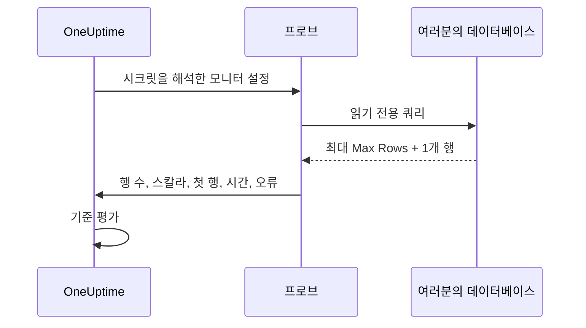

# SQL 쿼리 모니터

SQL 쿼리 모니터는 읽기 전용 SQL 쿼리를 프로브에서 일정에 따라 실행하고, 그 결과로 알림을 보냅니다. 대상은 반환된 행 수, 스칼라 값, 쿼리에 걸린 시간, 쿼리 오류입니다. "쿼리를 실행하고 인시던트를 연다"는 사용 사례를 위해 만들어졌으며, 예를 들어 최근 5분 동안 취소된 주문 수가 급증할 때, 큐 테이블이 너무 커질 때, 중요한 행이 사라질 때 알림을 받을 수 있습니다.

:::cards
- [읽기 전용 사용자 만들기](#읽기-전용-사용자-만들기): 모니터가 사용할 데이터베이스 로그인입니다.
- [모니터 만들기](#sql-쿼리-모니터-만들기): 프로브를 연결하고 쿼리를 입력합니다.
- [쿼리 작성](#쿼리-작성): 알림 기준이 되는 값을 첫 번째 열에 둡니다.
- [기준 설정](#기준-설정): 개수, 값, 느린 쿼리, 오류로 알림을 받습니다.
:::

## 작동 방식

검사할 때마다 프로브는 데이터베이스에 연결하고, 읽기 전용 컨텍스트에서 쿼리를 실행하고, 제한된 수의 행만 읽어 들여 압축된 요약을 OneUptime에 보고합니다. 그런 다음 모니터의 기준이 이 요약을 바탕으로 평가됩니다.

쿼리는 네트워크 안의 프로브에서 실행되므로, OneUptime이 데이터베이스에 직접 연결할 필요가 없고 전체 결과 집합이 프로브 밖으로 나가지도 않습니다. 결과의 작고 제한된 요약만 보고됩니다.



프로브가 보고하는 것은 다음뿐입니다.

| 값 | 설명 |
|---|---|
| **Row Count** | 쿼리가 반환한 행 수(Max Rows 제한으로 제한됨). |
| **스칼라 값** | 첫 번째 행의 첫 번째 열. `SELECT COUNT(*)` 형태의 쿼리에서 자연스럽게 쓰는 값입니다. |
| **First Row** | 열과 값의 쌍으로 표현한 첫 번째 행으로, 참고용으로 검사 요약에 표시됩니다. |
| **Execution Time** | 검사에 걸린 시간(밀리초). 쿼리뿐 아니라 연결 시간도 포함합니다. |
| **쿼리 오류** | 쿼리가 실패했을 때의 정리된 오류 메시지. |

전체 결과 집합은 OneUptime으로 전송되지 않으므로, 고객 데이터가 OneUptime 저장소에 복제되지 않습니다.

## 지원되는 데이터베이스

| 데이터베이스 | 기본 포트 |
|---|---|
| **PostgreSQL** | `5432` |
| **MySQL** | `3306` |
| **Microsoft SQL Server** | `1433` |

같은 와이어 프로토콜과 SQL 방언을 쓰는 MySQL 호환 및 PostgreSQL 호환 엔진도 대개 동작하지만, 공식적으로 테스트하는 것은 위의 세 엔진뿐입니다.

모니터가 연결하는 호스트와 포트가 [데이터베이스](/docs/telemetry/databases) 페이지에 있는 데이터베이스의 엔드포인트 중 하나이면, 이 모니터의 알림과 인시던트가 해당 데이터베이스의 페이지에도 나타납니다([데이터베이스의 알림](/docs/telemetry/databases#alerts-on-a-database) 참고). 모니터 시크릿 참조로 지정한 호스트는 대조되지 않습니다.

## 보안 모델

고객이 제공한 쿼리를 운영 데이터베이스에서 실행하는 일은 민감하므로, SQL 쿼리 모니터는 설계부터 읽기 전용이며 여러 겹의 통제를 둡니다.

| 통제 | 하는 일 |
|---|---|
| **최소 권한 데이터베이스 사용자** (기본 통제) | 쿼리에 필요한 테이블에만 접근할 수 있는 전용 읽기 전용 데이터베이스 사용자로 항상 연결하세요. 이것이 가장 중요한 통제입니다. [읽기 전용 사용자 만들기](#읽기-전용-사용자-만들기)를 참고하세요. |
| **읽기 전용 실행** | PostgreSQL과 MySQL에서는 프로브가 `READ ONLY` 트랜잭션을 열어, 쿼리 내용과 관계없이 모든 쓰기(쓰기를 하는 CTE 포함)를 거부합니다. 읽기 전용 트랜잭션이 없는 Microsoft SQL Server에서는 항상 롤백되는 트랜잭션 안에서 실행합니다. |
| **단일 문, 허용 목록 쿼리** | 쿼리는 `SELECT`, `WITH`, `VALUES`, `TABLE` 중 하나로 시작하는 단일 문이어야 합니다. 여러 문을 이어 붙인 쿼리(`SELECT 1; DROP TABLE …`)와 `INSERT`, `UPDATE`, `DELETE`, `DROP`, `EXEC`, `INTO` 같은 쓰기 또는 DDL 키워드는 프로브가 연결하기 전에 거부합니다. 이 검사는 안전망일 뿐 경계가 아니며, 경계는 읽기 전용 사용자입니다. |
| **문 타임아웃** | 모든 쿼리에는 엄격한 시간 제한이 있습니다. 너무 오래 실행되는 쿼리는 취소됩니다. |
| **행 수 제한** | Max Rows개(잘림을 감지하기 위해 한 개 더)를 넘는 행은 읽지 않으므로, 프로브 메모리와 데이터 양이 제한됩니다. |
| **자격 증명 가리기** | 데이터베이스 오류는 저장 전에 정리되어 비밀번호, 호스트, 사용자 이름, 데이터베이스 이름, 연결 문자열이 모두 가려지므로, 자격 증명이 오류 메시지로 새어 나가지 않습니다. |

## 시작하기 전에

- 데이터베이스 호스트와 포트에 네트워크로 접근할 수 있는 **프로브**. 데이터베이스가 인터넷에서 접근 가능하면 OneUptime이 호스팅하는 프로브를, 아니면 네트워크 안에서 실행되는 [사용자 지정 프로브](/docs/probe/custom-probe)를 사용합니다.
- **읽기 전용 데이터베이스 사용자** 와 연결 정보(호스트, 포트, 데이터베이스 이름, 사용자 이름, 비밀번호). SQL Server 통합 인증을 사용하는 경우에는 읽기 전용 Windows 또는 도메인 ID.

## 읽기 전용 사용자 만들기

항상 전용 읽기 전용 사용자로 연결하세요. 관리자로 엔진에 맞는 문을 실행하고, `orders` 를 여러분의 데이터베이스로 바꾸세요.

:::tabs
@tab PostgreSQL
```sql
-- PostgreSQL
CREATE USER oneuptime_ro WITH PASSWORD 'a-strong-password';
GRANT CONNECT ON DATABASE orders TO oneuptime_ro;
GRANT USAGE ON SCHEMA public TO oneuptime_ro;
GRANT SELECT ON ALL TABLES IN SCHEMA public TO oneuptime_ro;
-- Include tables created in the future:
ALTER DEFAULT PRIVILEGES IN SCHEMA public GRANT SELECT ON TABLES TO oneuptime_ro;
```
@tab MySQL
```sql
-- MySQL
CREATE USER 'oneuptime_ro'@'%' IDENTIFIED BY 'a-strong-password';
GRANT SELECT ON orders.* TO 'oneuptime_ro'@'%';
FLUSH PRIVILEGES;
```
@tab Microsoft SQL Server
```sql
-- Microsoft SQL Server
CREATE LOGIN oneuptime_ro WITH PASSWORD = 'a-strong-password';
USE orders;
CREATE USER oneuptime_ro FOR LOGIN oneuptime_ro;
ALTER ROLE db_datareader ADD MEMBER oneuptime_ro;
```
:::

권한을 더 좁히려면 쿼리가 읽는 테이블에만 `SELECT` 를 부여하세요.

## SQL 쿼리 모니터 만들기

:::steps
### 새 모니터 시작

**모니터** 로 이동해 **모니터 생성** 을 클릭합니다. **모니터 유형** 에서 **더 많은 모니터 유형** 을 클릭하고 **Database Monitoring** 아래의 **SQL Query** 를 선택하거나, 검색 상자에 `query` 를 입력합니다. **이름** 을 입력한 다음 **다음** 을 클릭합니다.

### 연결 정보 입력

**Database Type** 을 선택하고(포트가 해당 엔진의 기본값으로 바뀝니다) 호스트, 데이터베이스 이름, 읽기 전용 사용자의 자격 증명을 입력합니다. 비밀번호는 직접 입력하지 말고 [모니터 시크릿](#비밀번호에-모니터-시크릿-사용)으로 참조하세요. 각 필드는 [구성](#구성)에 설명되어 있습니다.

### 쿼리 입력

**SQL Query** 에 읽기 전용 문 하나를 입력합니다([쿼리 작성](#쿼리-작성) 참고).

### 테스트

**모니터 테스트** 를 클릭해 저장하기 전에 프로브에서 쿼리를 한 번 실행합니다.

### 기준 정하기

모니터가 처음 가진 기준을 검토하고 직접 기준을 추가합니다([기준 설정](#기준-설정) 참고). 그런 다음 **다음** 을 클릭합니다.

### 프로브 선택 및 생성

데이터베이스에 도달할 수 있는 **프로브** 와 **모니터링 간격** 을 선택하고 **모니터 생성** 을 클릭합니다.
:::

## 구성

| 필드 | 입력할 내용 |
|---|---|
| **Database Type** | PostgreSQL, MySQL, Microsoft SQL Server 중 하나. 유형을 고르면 기본 포트가 설정됩니다. |
| **호스트** | 프로브가 접근할 수 있는 데이터베이스 호스트(예: `db.internal`). |
| **포트** | 데이터베이스 포트. |
| **데이터베이스 이름** | 쿼리를 실행할 데이터베이스. |
| **Use Windows Integrated Authentication** | Microsoft SQL Server 전용. SQL 사용자 이름과 비밀번호 대신 프로브를 실행하는 계정으로 인증합니다. [Windows 통합 인증](#windows-통합-인증)을 참고하세요. |
| **사용자 이름** | 최소 권한의 읽기 전용 데이터베이스 사용자. |
| **비밀번호** | 데이터베이스 비밀번호. 비밀번호를 일반 텍스트로 입력하지 말고 `{{monitorSecrets.name}}` 으로 [모니터 시크릿](/docs/monitor/monitor-secrets)을 참조할 것을 강력히 권장합니다([비밀번호에 모니터 시크릿 사용](#비밀번호에-모니터-시크릿-사용) 참고). |
| **SQL Query** | 실행할 읽기 전용 쿼리([쿼리 작성](#쿼리-작성) 참고). |
| **Use SSL/TLS** | TLS로 연결하려면 켭니다. 켜면, 데이터베이스가 자체 서명 인증서를 쓰는 경우 **Verify server certificate** 를 끌 수 있습니다. |

### 추가 필드

| 필드 | 기본값 | 최대값 | 제한하는 것 |
|---|---|---|---|
| **Connection Timeout (ms)** | `10000` | `30000` | 연결을 맺을 때까지 기다리는 시간. |
| **Statement Timeout (ms)** | `15000` | `60000` | 쿼리가 실행될 수 있는 시간의 엄격한 상한. |
| **Max Rows** | `100` | `1000` | 데이터베이스에서 읽어 들이는 행 수의 상한. |

최대값보다 큰 값은 최대값으로 낮춰집니다.

### Windows 통합 인증

Microsoft SQL Server에서 **Use Windows Integrated Authentication** 을 켜면 프로브 프로세스의 ID로 신뢰할 수 있는 연결을 엽니다. 이 모드에서는 사용자 이름과 비밀번호 필드가 무시되며 드라이버로 전달되지 않습니다. 프로브에 도메인이 신뢰하는 ID가 필요하므로, 이 인증 모드에는 자체 호스팅 프로브를 사용하세요.

| 프로브 실행 환경 | 설정할 내용 |
|---|---|
| **Windows** | 읽기 전용 SQL Server 로그인이 있는 도메인 계정으로 프로브 서비스를 실행합니다. |
| **Linux 또는 macOS** | SQL Server 도메인에 맞게 Kerberos를 구성하고 프로브 프로세스에 유효한 티켓을 줍니다(예: keytab 사용). 공식 Linux 프로브 이미지에는 Microsoft ODBC Driver 18, unixODBC, Kerberos 클라이언트가 들어 있습니다. Kerberos 구성과 티켓 캐시를 컨테이너에 마운트하고, 프로브 프로세스가 읽을 수 있게 한 뒤, 위치가 기본값이 아니면 `KRB5_CONFIG` 또는 `KRB5CCNAME` 을 설정하세요. |

프로브를 실행하는 호스트에는 Microsoft ODBC Driver for SQL Server가 설치되어 있어야 합니다. 공식 프로브 이미지에는 **ODBC Driver 18** 이 포함되어 있습니다. 자체 호스팅 프로브나 사용자 지정 프로브를 실행하면, 프로브가 호스트에 등록된 가장 최신의 `ODBC Driver N for SQL Server` 를 자동으로 찾아 사용합니다(예를 들어 설치된 것이 Driver 17이면 그것을 사용). 꼭 Driver 18일 필요는 없습니다. 특정 드라이버로 고정하려면 프로브의 `SQL_SERVER_ODBC_DRIVER` 환경 변수를 정확한 드라이버 이름(예: `ODBC Driver 17 for SQL Server`)으로 설정하세요.

SQL Server에는 알맞은 `MSSQLSvc` 서비스 주체 이름이 있어야 하고, 프로브와 도메인 컨트롤러의 시계가 동기화되어 있어야 하며, 프로브는 그 서비스 주체 이름이 다루는 호스트 이름으로 SQL Server를 조회하고 접근할 수 있어야 합니다. 신뢰된 ID에는 모니터링 쿼리에 필요한 데이터베이스 권한만 부여하세요.

## 쿼리 작성

쿼리는 **읽기 전용 단일 문** 이어야 합니다. `SELECT`, `WITH`, `VALUES`, `TABLE` 중 하나로 시작해야 합니다. 끝의 세미콜론은 허용되지만 여러 문은 허용되지 않습니다. 쓰기와 DDL 키워드는 쿼리의 어느 위치에 있든 거부됩니다. `INTO` 도 포함되므로 `SELECT … INTO` 도 거부됩니다.

프로브는 저장할 때가 아니라 검사할 때마다 쿼리를 확인합니다. 이 규칙을 어긴 쿼리도 저장은 되지만, 그 뒤의 모든 검사가 "Only read-only queries are allowed (must start with SELECT, WITH, VALUES, or TABLE)." 로 실패하고 기본 기준이 모니터를 오프라인으로 만듭니다.

쿼리는 가볍고 범위가 좁게 유지하세요. 검사할 때마다 실행되므로 인덱스가 있는 열과 좁은 시간 범위를 우선하세요. 이 쿼리는 최근 5분 동안 취소된 주문을 셉니다.

:::tabs
@tab PostgreSQL
```sql
-- Count recent cancellations (PostgreSQL)
SELECT COUNT(*) AS cancelled
FROM orders
WHERE status = 'CANCELLED'
  AND created_at > NOW() - INTERVAL '5 minutes';
```
@tab MySQL
```sql
-- The same idea on MySQL
SELECT COUNT(*) AS cancelled
FROM orders
WHERE status = 'CANCELLED'
  AND created_at > NOW() - INTERVAL 5 MINUTE;
```
@tab Microsoft SQL Server
```sql
-- The same idea on Microsoft SQL Server
SELECT COUNT(*) AS cancelled
FROM orders
WHERE status = 'CANCELLED'
  AND created_at > DATEADD(minute, -5, GETDATE());
```
:::

> [!TIP]
> `COUNT(*)` 형태의 쿼리에서는 개수를 **Row Count**(한 행이 반환되므로 `1`)와 **스칼라 값**(첫 번째 열의 개수 자체) 둘 다로 얻을 수 있습니다. "몇 개인가"로 알림을 받으려면 **스칼라 값** 과 비교하세요.

## 비밀번호에 모니터 시크릿 사용

데이터베이스 비밀번호가 모니터에 일반 텍스트로 저장되지 않도록 [모니터 시크릿](/docs/monitor/monitor-secrets)을 만들고 비밀번호 필드에서 참조하세요.

:::steps
1. **모니터 → 설정 → 시크릿** 으로 이동해 모니터 시크릿을 만듭니다.
2. 이름을 지정하고(예: `dbPassword`) 이 모니터에 접근 권한을 줍니다.
3. 모니터의 **비밀번호** 필드에 `{{monitorSecrets.dbPassword}}` 를 입력합니다.
:::

OneUptime은 구성을 프로브에 넘기기 전에 서버에서 시크릿을 해석합니다. OneUptime이 이런 시크릿을 대신 만들어 주지는 않으며, 시크릿을 참조할지는 여러분이 정합니다. **사용자 이름**, **호스트**, **데이터베이스 이름**, **SQL Query** 필드도 시크릿 참조를 받지만 **포트** 는 받지 않습니다.

## 기준 설정

모니터를 언제 온라인, 저하, 오프라인으로 볼지 결정하는 기준을 추가합니다. SQL 쿼리 모니터에서 사용할 수 있는 검사는 다음과 같습니다.

| 필터 유형 | 검사 대상 |
|---|---|
| **SQL Is Online** | 데이터베이스에 접근할 수 있었고 쿼리가 성공했는지 여부. |
| **SQL Query Row Count** | 반환된 행 수. 보다 큼, 보다 작음, 같음 같은 연산자로 비교합니다. |
| **SQL Query Scalar Value** | 첫 번째 행의 첫 번째 열. 입력한 값이 숫자이면 숫자로, 아니면 문자열로 비교합니다. `COUNT(*)` 형태의 쿼리에는 이 검사를 사용합니다. |
| **SQL Query Execution Time (in ms)** | 쿼리에 걸린 시간. 느린 데이터베이스를 잡아내는 데 유용합니다. |
| **SQL Query Error** | 쿼리 오류 메시지. 비어 있을 때(또는 비어 있지 않을 때), 혹은 특정 문자열과 일치할 때 알림을 받습니다. |
| **JavaScript Expression** | `rowCount`, `scalarValue`, `firstRow`, `executionTimeInMs`, `queryError`, `isOnline` 에 대한 사용자 지정 JavaScript 표현식을 평가합니다. [JavaScript 표현식](/docs/monitor/javascript-expression#sql-쿼리-모니터)을 참고하세요. |

숫자 임계값은 정수입니다. `10.5` 가 아니라 `10` 으로 쓰세요. SQL Query 필터는 기간에 걸쳐 평가할 수 없으며, 각 검사는 독립적으로 평가됩니다.

새 SQL 쿼리 모니터는 두 가지 기준으로 시작합니다. **SQL Is Online** 이 false인 기준(모니터가 오프라인이 되고 저절로 해결되는 인시던트를 선언합니다)과, **SQL Is Online** 이 true인 기준(모니터를 온라인으로 표시합니다)입니다. **기준 추가** 는 기준을 맨 아래에 추가합니다. 기준은 위에서부터 검사되고 처음 일치한 기준이 결정하므로, 추가한 기준을 온라인 기준 위로 끌어 올리세요.

### 예시: 취소가 급증하면 알림 받기

위의 쿼리를 사용하는 경우:

| 기준 | 필터 |
|---|---|
| **저하됨** | `SQL Query Scalar Value` 가 `10` 보다 큼. |
| **오프라인** | `SQL Query Scalar Value` 가 `50` 보다 크거나 `SQL Is Online` 이 `false`. |

알맞은 사람이 호출되도록 기준에 온콜 정책을 연결하세요. SQL 쿼리 모니터에는 자체 템플릿 변수가 없습니다. 인시던트 제목은 `{{monitorName}}` 으로 모니터 이름을 넣을 수 있지만 쿼리 결과를 인용할 수는 없습니다.

## 고려 사항

- 쿼리는 검사할 때마다 실행되므로 가볍게 유지하세요. 인덱스와 좁은 시간 범위를 사용하고, Statement Timeout을 안전망으로 삼으세요.
- 보고되는 것은 행 수, 첫 번째 셀(스칼라), 첫 번째 행뿐입니다. 알림 기준으로 삼을 값이 첫 번째 열이 되도록 쿼리를 설계하세요.
- 결과가 Max Rows를 넘어 잘리면 검사 요약에 **Rows Truncated**: "Yes (result capped)" 가 표시됩니다. Max Rows는 필요할 때만 늘리세요. 결과 집합이 클수록 프로브의 메모리를 더 많이 씁니다.
- 쓰기와 DDL은 항상 거부됩니다. 쓰기 경로를 테스트해야 한다면 이 모니터는 그 용도가 아닙니다.
- 자격 증명이 저장 시 암호화된 상태로 유지되도록, 일반 텍스트 비밀번호보다 모니터 시크릿을 우선하세요.
- 쿼리가 실패한 검사는 오류를 보고하기 전에 1초 뒤 최대 세 번까지 다시 시도하므로, 잠깐의 연결 끊김으로 모니터가 오프라인이 되지 않습니다. 자체 호스팅 프로브에서는 `PROBE_MONITOR_RETRY_LIMIT` 로 횟수를 정합니다.

## 문제 해결

:::details 모든 검사가 "Only read-only queries are allowed" 로 실패합니다
쿼리가 `SELECT`, `WITH`, `VALUES`, `TABLE` 중 하나로 시작하지 않습니다. 앞에 주석이 있는 것은 괜찮지만 `SET` 이나 `DECLARE` 는 안 됩니다. 읽기 전용 단일 문으로 다시 작성하세요.
:::

:::details 검사가 "Disallowed SQL keyword" 로 실패합니다
`SELECT` 안이라도 쿼리 어딘가에 `INTO` 나 `EXEC` 같은 쓰기, DDL, 실행 키워드가 있습니다. 따옴표로 묶은 문자열과 주석 안의 단어는 해당하지 않습니다. 키워드를 없애거나, 로직을 읽기 전용 사용자가 읽을 수 있는 뷰로 옮기세요.
:::

:::details 검사가 타임아웃됩니다
프로브가 **Connection Timeout (ms)** 안에 연결하지 못했거나, 쿼리가 **Statement Timeout (ms)** 보다 오래 실행되었습니다. 프로브가 호스트와 포트에 도달할 수 있는지 확인한 뒤, 쿼리를 가볍게 만드세요. 인덱스가 있는 열로, 짧은 시간 범위에 걸쳐 필터링합니다.
:::

:::details 연결이 인증서 오류로 실패합니다
데이터베이스의 인증서가 자체 서명되었거나 프로브가 신뢰하지 않습니다. **Use SSL/TLS** 를 켜면 나타나는 **Verify server certificate** 를 끄거나, 프로브가 신뢰하는 인증서를 데이터베이스에 설정하세요.
:::

:::details Windows 통합 인증이 실패합니다
프로브에는 Microsoft ODBC Driver for SQL Server와 도메인이 신뢰하는 ID가 필요합니다. 공식 프로브 이미지를 실행하거나 드라이버를 설치한 뒤, [Windows 통합 인증](#windows-통합-인증)의 설정을 확인하세요.
:::

## 다음 단계

:::cards
- [데이터베이스 상태 모니터](/docs/monitor/database-health-monitor): SQL을 작성하지 않고 연결, 잠금, 복제를 살펴봅니다.
- [모니터 시크릿](/docs/monitor/monitor-secrets): 데이터베이스 비밀번호를 암호화해 보관합니다.
- [JavaScript 표현식](/docs/monitor/javascript-expression): 여러 값을 조합하는 기준을 작성합니다.
- [사용자 지정 프로브](/docs/probe/custom-probe): 네트워크 내부에서 검사를 실행합니다.
:::
