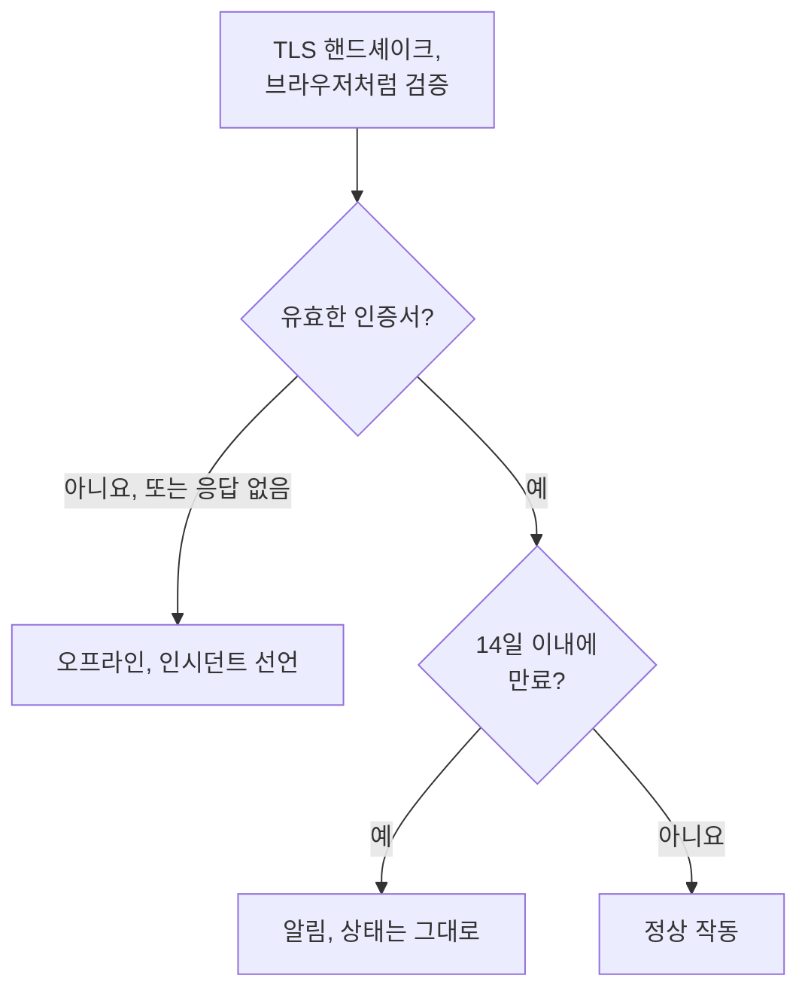

# SSL 인증서 모니터

SSL 인증서 모니터는 사이트와 서비스가 제시하는 TLS 인증서를 브라우저와 같은 방식으로 확인하고, 만료되기 전에 알려 줍니다. 또한 인증서가 더 이상 유효하지 않으면, 즉 만료되었거나, 자체 서명되었거나, 다른 호스트 이름용으로 발급되었거나, 브라우저가 신뢰하지 않는 기관에서 발급되었으면 모니터를 오프라인으로 만듭니다.

:::cards
- [모니터 만들기](#ssl-인증서-모니터-만들기): 대시보드에서 여섯 단계.
- [기본 기준](#기본-기준): 설정 없이 14일 전에 만료 경고.
- [모니터링 기준](#모니터링-기준): 유효성, 만료, 자체 서명 인증서.
- [문제 해결](#문제-해결): 자체 서명 인증서와 내부 인증서.
:::

## 작동 방식

확인할 때마다 프로브는 URL의 호스트와 포트(URL에 다른 포트가 없으면 `443`)로 TLS 연결을 열고, 브라우저처럼 인증서를 검증합니다. 신뢰할 수 있는 발급 기관, 일치하는 호스트 이름, 오늘을 포함하는 유효 기간입니다. 인증서가 검증을 통과하지 못해도 프로브는 인증서를 읽으므로, 만료일, 발급자, 지문은 어느 경우든 기록됩니다. 실패했거나, 시간 초과되었거나, 유효하지 않은 인증서를 제시한 연결은 허용한 재시도 횟수만큼 다시 시도합니다. 그런 다음 OneUptime이 결과를 모니터의 기준에 통과시킵니다.

자체 네트워크 연결을 잃은 프로브는 결과를 보고하지 않으므로 인증서를 유효하지 않다고 표시할 수 없습니다.

## 시작하기 전에

- **모니터를 만들 수 있는 역할**: Project Owner, Project Admin, Project Member, Monitor Admin 또는 Monitor Member, 또는 Create Monitor 권한이 있는 사용자 지정 역할.
- **호스트와 포트에 연결할 수 있는 프로브.** 모든 새 모니터에는 프로젝트의 기본 프로브가 선택됩니다. 프라이빗 네트워크의 서비스에는 그 네트워크 안의 [사용자 지정 프로브](/docs/probe/custom-probe)가 필요합니다.

## SSL 인증서 모니터 만들기

:::steps
### 새 모니터 시작

**모니터**로 이동해 **모니터 생성**을 클릭합니다. **모니터 유형**에서 **SSL Certificate**를 선택합니다.

### 이름 지정

`example.com certificate` 같은 **이름**을 입력하고 **다음**을 클릭합니다.

### URL 입력

**웹사이트 URL**에 인증서를 확인할 사이트(예: `https://example.com`)를 입력합니다. 다른 포트의 서비스라면 포트를 포함합니다: `https://example.com:8443`.

### 테스트

**모니터 테스트**를 클릭하고 **프로브 선택**에서 프로브를 고른 다음 **테스트 실행**을 클릭합니다. **모니터 테스트 결과**에 프로브가 받은 인증서가 발급자, 만료일과 함께 표시됩니다.

### 기준 검토

**모니터 기준**은 [기본 기준](#기본-기준)으로 시작합니다. 인증서가 유효하지 않으면 오프라인, 14일 이내에 만료되면 알림입니다. 필요하면 바꾼 다음 **다음**을 클릭합니다.

### 프로브 선택 및 생성

**프로브**와 **모니터링 간격**(**5분마다**로 시작하며, SSL 인증서 모니터에는 5분 이상의 간격이 제공됩니다)을 그대로 두거나 바꾼 다음 **모니터 생성**을 클릭합니다. 모니터 페이지가 열립니다.
:::

## 구성 옵션

| 필드 | 기본값 | 입력할 내용 |
| --- | --- | --- |
| **웹사이트 URL** | 없음 | 인증서를 확인할 사이트(예: `https://example.com`, `https://example.com:8443`). 호스트와 포트만 사용하며 경로는 무시합니다. |
| **요청 시간 초과(초)** (**추가 필드** 아래) | `60` | 각 시도에서 TLS 핸드셰이크를 기다리는 시간. 최대 60초입니다. |
| **실패 시 재시도**(**추가 필드** 아래) | 프로브 기본값, 보통 `3` | 실패한 시도를 다시 시도하는 횟수. 최대 3회입니다. |

**실패 시 재시도**는 첫 시도가 _끝난 뒤_ 이어지는 재시도를 세므로, `0`이면 확인을 한 번 실행하고 `2`이면 최대 세 번 실행합니다. 비워 두면 프로브의 기본값을 사용합니다. 프로브의 `PROBE_MONITOR_RETRY_LIMIT`가 달리 정하지 않으면 3입니다. 연결 오류, 인증서 검증 실패, 시간 초과는 모두 시도 사이에 1초씩 쉬면서 다시 시도합니다.

## 모니터링 기준

기준은 인증서를 정상, 저하됨, 문제 있음 중 무엇으로 볼지, 그리고 그에 따라 인시던트를 선언할지 알림을 생성할지를 정합니다. 각 기준은 하나 이상의 필터를 확인합니다.

| 필터 | 조건 | 확인하는 것 |
| --- | --- | --- |
| **Is Valid Certificate** | **참**, **거짓** | 인증서가 브라우저의 확인을 통과함: 신뢰할 수 있는 발급 기관, 일치하는 호스트 이름, 오늘을 포함하는 유효 기간. 엔드포인트가 응답하지 않았으면 **거짓**. |
| **Is Not A Valid Certificate** | **참**, **거짓** | **Is Valid Certificate**의 반대: 인증서가 그 확인을 통과하지 못했거나 확인할 수 없었으면 **참**. |
| **Is Expired Certificate** | **참**, **거짓** | 인증서의 만료일이 지났음. |
| **Is Self Signed Certificate** | **참**, **거짓** | 인증서 또는 그 체인의 인증서가 자체 서명됨. |
| **Expires In Days** | **Greater Than**, **Less Than**, **Greater Than Or Equal To**, **Less Than Or Equal To** | 인증서가 만료될 때까지 남은 일수. |
| **Expires In Hours** | **Greater Than**, **Less Than**, **Greater Than Or Equal To**, **Less Than Or Equal To** | 인증서가 만료될 때까지 남은 시간. |

**Expires In Days**는 온전한 일수를 셉니다. 14일 20시간 뒤에 만료되는 인증서는 14일이 남은 것입니다. **Expires In Hours**도 같은 방식으로 온전한 시간을 셉니다.

필터가 둘 이상이면 **일치 조건**이 필터가 모두 일치해야 하는지(**전체**), 하나만 일치하면 되는지(**모두**)를 정합니다. 기준의 **작업**은 그 기준이 하는 일을 정합니다: 모니터 상태 변경, 알림 생성, 인시던트 선언, 또는 이들 중 여러 개.

### 기본 기준

새 SSL 인증서 모니터는 세 가지 기준으로 시작하므로, 아무것도 설정하지 않아도 인증서가 만료되기 전에 알려 줍니다.

1. **인증서가 유효하지 않음** — 인증서가 만료되었거나, 자체 서명되었거나, 다른 호스트 이름용이나 신뢰할 수 없는 기관에서 발급되었거나, 엔드포인트가 응답하지 않아 확인할 수 없었습니다. 모니터는 **오프라인**으로 표시되고 "_monitor name_ certificate is not valid"라는 인시던트가 생성됩니다. 인시던트의 근본 원인에 이 중 어느 경우였는지가 나옵니다. 인증서가 다시 유효해지면 인시던트는 스스로 해결됩니다.
2. **인증서가 곧 만료됨** — 인증서는 유효하지만 14일 이내에 만료됩니다. "_monitor name_ certificate expires soon"이라는 **알림**이 생성됩니다.
3. **인증서가 유효함** — 모니터는 **정상 작동**으로 표시됩니다.

"곧 만료됨" 경고는 인시던트가 아니라 알림입니다. 상태 페이지에 표시되지 않고, 온콜 정책을 추가하지 않는 한 아무도 호출하지 않으며, 모니터의 상태도 바꾸지 않습니다. 프로젝트의 두 번째 알림 심각도를 사용하며, 새 프로젝트에서는 **Low**입니다. 갱신된 인증서가 반영되면 모니터는 "인증서가 유효함"으로 돌아가고, 알림은 스스로 해결됩니다.

기준은 위에서 아래로 확인되며, 처음 일치한 기준이 무엇을 할지 정합니다. 그래서 "곧 만료됨"이 "유효함"보다 위에 있습니다. 곧 만료되는 인증서도 아직 유효하므로 두 기준 모두에 일치하기 때문입니다.

더 일찍 경고를 받으려면 "곧 만료됨" 기준에 있는 **Expires In Days** 필터의 값을 예를 들어 `30`으로 바꿉니다. 대신 누군가를 호출하려면 그 기준의 **작업**을 열고 **필터가 일치하면 인시던트를 선언합니다.** 항목을 켜거나, 알림은 그대로 두고 **온콜 정책**에서 온콜 정책을 추가합니다.

:::details 경고가 생기기 전에 만든 모니터에 경고 추가하기
OneUptime이 이 경고를 추가하기 전에 만든 모니터에는 "곧 만료됨" 기준이 없습니다. 추가하려면:

1. 모니터에서 **구성 → 기준**을 열고 **모니터링 기준 편집**을 클릭합니다.
2. **기준 추가**를 클릭합니다. 필터를 **Is Valid Certificate** / **참**으로 설정하고, **필터 추가**를 클릭한 다음 두 번째 필터를 **Expires In Days** / **Less Than Or Equal To** / `14`로 설정합니다. **일치 조건**은 **전체**로 둡니다(필터가 두 개가 되면 필터 아래에 나타납니다).
3. **작업**에서 **필터가 일치하면 경고를 생성합니다.** 항목을 켜고 **필터가 일치하면 모니터 상태를 변경합니다.** 항목은 꺼 두어, 알림은 생성하되 모니터 상태는 바꾸지 않게 합니다.
4. 새 기준을 모니터를 온라인으로 표시하는 기준보다 위로 끌어 놓고 저장합니다.
:::

### 기준 예시

| 목표 | 필터 | 조건 | 값 |
| --- | --- | --- | --- |
| 한 달 전에 경고 | **Expires In Days** | **Less Than Or Equal To** | `30` |
| 마지막 날에 누군가를 호출 | **Expires In Hours** | **Less Than** | `24` |
| 인증서가 만료된 뒤에만 오프라인 | **Is Expired Certificate** | **참** | — |
| 자체 서명 인증서 표시 | **Is Self Signed Certificate** | **참** | — |

만료에 관한 기준은 인증서를 유효로 표시하는 기준보다 위에 있어야 합니다. 곧 만료되는 인증서도 아직 유효하고, 처음 일치한 기준이 우선하기 때문입니다.

## 모범 사례

1. **갱신할 시간을 확보하세요** — 기본 경고는 만료 14일 전에 오며, 스스로 갱신되는 인증서에 맞습니다. 갱신에 시간이 더 걸린다면(구매하는 인증서나 변경 절차 등) 30일로 늘립니다.
2. **모든 엔드포인트를 모니터링하세요** — 도메인이나 하위 도메인이 여러 개라면 각각 모니터를 만듭니다. 각각 자체 인증서를 가질 수 있습니다.
3. **다른 포트도 포함하세요** — `8443`처럼 `443`이 아닌 포트에서 TLS를 제공하는 서비스에도 인증서가 있습니다. URL에 포트를 넣습니다.
4. **갱신 후 확인하세요** — 인증서를 갱신한 뒤 모니터의 다음 결과를 확인합니다. 표시되는 만료일이 새 날짜여야 합니다.

## 문제 해결

:::details 브라우저에서는 인증서가 정상인데 모니터는 유효하지 않다고 함
인시던트의 근본 원인에 이유가 나옵니다. 흔한 원인은 중간 인증서 없이 인증서를 보내는 서버입니다. 브라우저는 빈 곳을 스스로 채우는 경우가 많지만 프로브는 그렇지 않습니다. 전체 체인을 보내도록 서버를 구성합니다. 또 다른 원인은 호스트 이름이 인증서에 없는 URL입니다.
:::

:::details 자체 서명 인증서를 쓰는 내부 서비스를 모니터링함
자체 서명 인증서는 결코 유효하지 않으므로 기본 기준은 모니터를 오프라인으로 유지합니다. **Is Self Signed Certificate**, **Is Expired Certificate**, **Expires In Days**는 여전히 작동하므로 이 필터들로 기준을 만듭니다. **구성 → 기준**에서:

1. "유효하지 않음" 기준에서 **필터 추가**를 클릭하고, 새 필터를 **Is Self Signed Certificate** / **거짓**으로 설정한 다음 **일치 조건**을 **전체**로 설정합니다. 엔드포인트가 응답하지 않거나 인증서가 다른 이유로 잘못되었을 때는 이 기준이 여전히 모니터를 오프라인으로 만듭니다.
2. 모니터를 **오프라인**으로 표시하고 인시던트를 선언하는 **Is Expired Certificate** / **참** 기준을 추가하고, 맨 위로 끌어 놓습니다.
3. "곧 만료됨" 기준에서 **Is Valid Certificate** / **참**을 **Is Expired Certificate** / **거짓**으로 바꿔, 경고가 자체 서명 인증서에도 적용되게 합니다.

인증서가 유효 기간 안에 있는 동안에는 어떤 기준도 일치하지 않으며, 모니터는 기본 상태인 **정상 작동**을 표시합니다.
:::

:::details 모니터가 "could not be checked because the endpoint is not reachable"로 오프라인임
프로브가 호스트와 포트로 TLS 연결을 열 수 없었습니다. URL의 포트와, 방화벽이 프로브를 통과시키는지 확인합니다. 프라이빗 네트워크의 호스트에는 [사용자 지정 프로브](/docs/probe/custom-probe)가 필요합니다.
:::

## 다음 단계

:::cards
- [웹사이트 모니터](/docs/monitor/website-monitor): 사이트 자체가 응답하는지 확인합니다.
- [도메인 모니터](/docs/monitor/domain-monitor): 도메인 등록이 만료되기 전에 경고를 받습니다.
- [에스컬레이션 규칙](/docs/on-call/escalation-rules): 알림과 인시던트로 누가 호출될지 정합니다.
- [인시던트 개요](/docs/incidents/index): 모니터가 인시던트를 선언한 뒤에 일어나는 일.
:::
