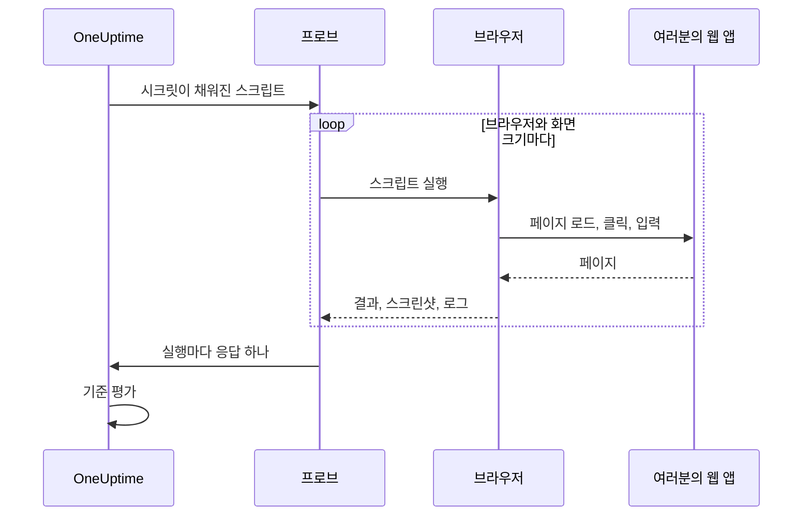

# 합성 모니터

합성 모니터는 직접 작성한 Playwright 스크립트로 실제 브라우저에서 웹 앱을 일정에 따라 조작합니다. 페이지를 열고, 양식을 채우고, 사용자 여정을 클릭으로 따라가며, 여정이 실패하면 검사도 실패합니다. 가동 시간 검사로는 보이지 않는 장애, 예를 들어 더 이상 되지 않는 로그인, 눌러도 아무 일도 일어나지 않는 결제 버튼, 끝내 로딩이 끝나지 않는 대시보드를 잡아내는 데 사용하세요.

:::cards
- [모니터 만들기](#합성-모니터-만들기): 스크립트를 작성하고 브라우저와 화면 크기를 고릅니다.
- [스크립트 작성](#스크립트-작성): 바로 실행할 수 있는 로그인 여정으로 시작합니다.
- [스크린샷](#스크린샷): 실행이 실패했을 때 페이지가 어떻게 보였는지 확인합니다.
- [스크립트에서 쓸 수 있는 것](#스크립트에서-사용할-수-있는-모듈): Playwright, HTTP, 암호화, 메트릭.
:::

## 작동 방식

검사할 때마다 프로브는 선택한 브라우저와 화면 크기마다 한 번씩 차례로 스크립트를 실행합니다. 각 실행은 이전 실행의 쿠키나 저장소가 없는 새 브라우저로 시작합니다. 스크립트는 페이지를 조작하고, 스크린샷을 찍고, 결과를 반환하거나 오류를 던집니다. 프로브는 모든 실행을 보고하고, OneUptime은 이를 바탕으로 기준을 평가합니다.



| 화면 유형 | 뷰포트 |
| --- | --- |
| Mobile | 360 × 640 |
| Tablet | 1024 × 768 |
| Desktop | 1920 × 1080 |

브라우저는 Chromium과 Firefox입니다.

## 시작하기 전에

- 웹 앱에 도달할 수 있는 **프로브**. 네트워크 내부의 앱에는 [사용자 지정 프로브](/docs/probe/custom-probe)를 사용하세요. 프로브의 Docker 이미지에는 Chromium과 Firefox가 들어 있습니다. Docker 밖에서 실행하는 프로브에는 이를 설치해야 합니다.
- 여정에 필요한 모든 비밀번호와 토큰을 [모니터 시크릿](/docs/monitor/monitor-secrets)으로 저장해 둡니다.

## 합성 모니터 만들기

:::steps
### 새 모니터 시작

**모니터** 로 이동해 **모니터 생성** 을 클릭합니다. **모니터 유형** 에서 **더 많은 모니터 유형** 을 클릭하고 **Synthetic Monitoring** 아래의 **Synthetic Monitor** 를 선택하거나, 검색 상자에 `playwright` 를 입력합니다. **이름** 을 입력한 다음 **다음** 을 클릭합니다.

### 스크립트 추가

**Playwright Code** 편집기에 스크립트를 작성합니다. [아래 예제](#스크립트-작성)에서 시작하세요.

### 브라우저와 화면 크기 선택

**브라우저 유형** 에서 브라우저를, **화면 유형** 에서 크기를 선택합니다. 스크립트는 조합마다 한 번씩 실행되므로, 브라우저 두 개와 크기 세 개를 고르면 검사마다 여섯 번 실행됩니다. **추가 필드** 의 **오류 시 재시도 횟수** 로 실패한 실행을 최대 5번까지 다시 시도할 수 있습니다.

### 테스트

**모니터 테스트** 를 클릭해 프로브에서 스크립트를 한 번 실행하고, 각 실행의 결과, 로그, 스크린샷을 확인합니다.

### 기준 검토

모니터는 두 가지 기준으로 시작합니다. 실행 중 하나라도 실패하면 오프라인이 되고 인시던트를 선언하며, 실패한 실행이 없으면 온라인이 됩니다. 기준을 바꾸거나 직접 추가한 뒤([기준](#기준) 참고) **다음** 을 클릭합니다.

### 프로브 선택 및 생성

**프로브** 와 **모니터링 간격** 을 선택하고(합성 모니터는 5분 이상의 간격을 제공합니다) **모니터 생성** 을 클릭합니다.
:::

## 스크립트 작성

스크립트는 `async` 함수의 본문입니다. `page` 는 이미 열려 있는 Playwright 호환 페이지입니다. 이를 조작하고, `return` 으로 결과를 반환하고, `throw` 로(또는 Playwright 호출이 타임아웃되게 해서) 실행을 실패시킵니다. 다음 예제는 로그인한 뒤 대시보드가 로드되는지 확인합니다.

```javascript title="Synthetic monitor script"
await page.goto("https://app.example.com/login");
screenshots["login-page"] = await page.screenshot();

await page.fill("#email", "monitoring@example.com");
await page.fill("#password", "{{monitorSecrets.AppPassword}}");
await page.click("button[type=submit]");

// Fails the run if the dashboard does not appear within 10 seconds.
await page.waitForSelector(".dashboard", { timeout: 10000 });
screenshots["dashboard"] = await page.screenshot();

console.log(`Signed in on ${browserType}, ${screenSizeType}`);

return {
  data: { title: await page.title() },
};
```

| 목적 | 방법 | OneUptime이 기록하는 것 |
| --- | --- | --- |
| 결과 보고 | `return { data: ... }` | 실행의 **결과**. `data` 만 유지됩니다. |
| 실행 실패 | `throw new Error("...")` 또는 대기가 타임아웃되게 하기 | 실행의 **스크립트 오류**. |
| 증거 남기기 | `screenshots["name"] = await page.screenshot()` | 실행이 실패해도 보존되는 스크린샷. |
| 흔적 남기기 | `console.log(...)` | 실행의 로그 메시지. |

실행 내용을 보려면 모니터의 **개요** 를 엽니다. **모니터 요약** 카드에는 브라우저와 화면 크기마다 블록이 하나씩 있고, **자세히 보기** 를 누르면 각 실행의 스크린샷이 표시됩니다.

### Playwright 사용

사용자 상호작용을 재현하는 데 Playwright를 사용합니다. `page` 값은 이 실행을 위해 만든 페이지에 대한 안전한 Playwright 호환 파사드입니다. `Page`, `Locator`, `Frame`, `ElementHandle`, `JSHandle`, `Request`, `Response`, 키보드, 마우스, 브라우저 컨텍스트의 일반적인 메서드를 사용할 수 있습니다. 여기에는 탐색, 로케이터, 클릭, 양식 입력, 페이지 평가, 팝업, 추가 페이지, 응답 검사, 스크린샷이 포함됩니다. 이 실행의 브라우저 컨텍스트는 `page.context()` 로 접근할 수 있으며, 예를 들어 새 페이지를 열거나 팝업을 처리할 수 있습니다.

합성 스크립트는 프로브의 Node.js 프로세스에서 실행되지 않습니다. 값은 복사된 데이터나 실행에 묶인 불투명한 기능으로 런타임 경계를 넘으므로, 일부 Playwright API는 다르게 동작하거나 전혀 동작하지 않습니다.

| 사용할 수 없는 것 | 대신 사용할 것 |
| --- | --- |
| 브라우저 실행 또는 연결 메서드, CDP 세션, 요청 라우팅, 노출된 바인딩, Playwright 비공개 필드, 호스트 파일 시스템 경로를 읽거나 쓰는 모든 옵션. 따라서 `page.context().browser()` 는 사용할 수 없습니다. | 주어진 페이지와 브라우저 컨텍스트. |
| 이벤트 리스너(`page.on(...)`, `page.once(...)`). 호출하면 명확한 오류로 실패합니다. | 대화 상자와 팝업에는 `page.waitForEvent(...)`, 또는 문자열이나 정규식으로 맞추는 응답 및 요청 대기. |
| 이벤트, 요청, 응답, URL 대기 메서드에 넘기는 함수 조건자. | 문자열이나 정규식 매처, 로케이터, 명시적 폴링. |
| 동기식 프레임 접근자(`page.frames()`, `page.mainFrame()`, `page.frame(...)`). | iframe에는 `page.frameLocator(...)`. |
| `page.request.*` | HTTP 요청에는 전역 `axios`. |
| 전체 페이지 스크린샷과 PDF 출력. | 뷰포트 스크린샷. 아래에 설명한 실패 증거 동작은 그대로 유지됩니다. |

`page.waitForNavigation(...)`, `page.setDefaultTimeout(...)`, `page.setDefaultNavigationTimeout(...)` 은 지원됩니다. `page.waitForEvent(...)` 는 `dialog`, `domcontentloaded`, `load`, `popup`, `request`, `requestfailed`, `requestfinished`, `response` 를 기다립니다. `page.evaluate()` 같은 메서드에 넘긴 평가 함수는 모니터링 대상 브라우저 페이지에서 실행되며, 프로브 프로세스에서는 실행되지 않습니다. 실행마다 최대 여덟 개의 페이지를 사용할 수 있습니다.

브라우저 권한은 위치 정보와 알림으로 제한됩니다. 클립보드, 카메라, 마이크, MIDI, 로컬 글꼴 등 호스트 장치에 대한 권한은 모니터 스크립트에서 사용할 수 없습니다.

### 스크립트가 반환하는 것

스크립트가 반환한 데이터는 저장 전에 JSON으로 직렬화됩니다. 일반 객체와 배열 안에서 `NaN` 과 `Infinity` 는 `null` 이 되고, `undefined` 속성과 함수는 제거되며, `Date` 객체는 ISO 문자열이 됩니다. `JSON.stringify` 가 처리하는 방식과 같습니다. 클래스 인스턴스 등 일반 객체가 아닌 것은 통째로 제거됩니다. `BigInt` 는 문자열이 됩니다. 순환 참조가 있거나, 30단계를 넘게 중첩되었거나, 5 MB보다 큰 결과는 대신 실행을 실패시킵니다.

### 반환된 데이터로 알림 받기

스크립트가 `data` 로 반환한 값이 모니터의 **Result Value** 이며, 기준에서 이를 비교할 수 있습니다. `data` 가 객체나 배열이면 Result Value 필터의 **필드 경로(선택 사항)** 를 입력해 필드 하나를 비교합니다. 예를 들어 `status`, `timings.loadTime`, `errors[0].message` 입니다. 필터는 모니터가 실행되는 모든 브라우저와 화면 크기의 데이터를 대상으로 검사되며, 그중 하나라도 일치하면 일치합니다. 경로와 조건이 동작하는 방식은 [반환된 데이터로 알림 받기](/docs/monitor/custom-code-monitor#반환된-데이터로-알림-받기)를 참고하세요.

## 스크린샷

스크립트 컨텍스트에는 미리 선언된 `screenshots` 객체가 있습니다. 스크립트의 어느 지점에서든 여기에 스크린샷을 대입하세요. 이 스크린샷은 **스크립트가 오류를 던져도** (어설션 실패, 타임아웃, 예기치 않은 오류 포함) 보존되므로, 실행이 실패했을 때 페이지가 정확히 어떻게 보였는지 확인할 수 있습니다. 저장된 스크린샷은 OneUptime 대시보드에서 해당 모니터 실행마다 표시됩니다.

```javascript
// Capture screenshots via the `screenshots` side-channel — they are preserved on both success and failure.

await page.goto("https://app.example.com/login");
screenshots["login-page"] = await page.screenshot();

await page.fill("#email", "user@example.com");
await page.fill("#password", "wrong");
await page.click("button[type=submit]");

// If the next assertion throws, the `login-page` screenshot above is still captured.
await page.waitForSelector(".dashboard", { timeout: 5000 });

screenshots["dashboard"] = await page.screenshot();

return {
  data: "Login succeeded",
};
```

실행 한 번에 최대 20개의 스크린샷을 보존하며, 각각 최대 10 MB, 합계 50 MB까지입니다. 모니터의 인시던트나 알림 설명에 스크린샷을 넣으면, 실패한 실행이 여는 인시던트나 알림의 페이지와 관련 이메일에도 스크린샷을 표시할 수 있습니다. [스크린샷 표시](/docs/monitor/incident-alert-templating#합성-모니터)를 참고하세요.

:::details 스크린샷 반환(이전 방식)
이전 버전과의 호환을 위해 스크린샷을 반환 값의 일부로 스크립트에서 반환할 수도 있습니다. 이렇게 반환한 스크린샷은 스크립트가 정상적으로 끝났을 때 **만** 보존되며, 스크립트가 오류를 던지면 사라집니다. 실패의 증거가 필요하다면 위의 사이드 채널 방식을 사용하세요.

```javascript
// Legacy pattern — screenshots only captured on successful return.
const screenshots = {};
screenshots["screenshot-name"] = await page.screenshot();

return {
  data: "Hello World",
  screenshots: screenshots,
};
```
:::

## 모니터 시크릿 사용

스크립트 어디에서나 시크릿을 `{{monitorSecrets.NAME}}` 으로 참조합니다. OneUptime은 스크립트가 프로브에 도달하기 전에 참조를 시크릿 값으로, 일반 텍스트 그대로 바꿉니다. 따라서 문자열로 쓰려면 시크릿을 따옴표로 감싸고, 숫자나 불리언으로 쓰려면 따옴표 없이 둡니다.

```javascript
// Used as a string: wrap it in quotes.
const password = "{{monitorSecrets.AppPassword}}";

// Used as a number or a boolean: leave it bare.
const retryLimit = {{monitorSecrets.RetryLimit}};
const verbose = {{monitorSecrets.Verbose}};
```

시크릿을 만들고 사용할 수 있는 모니터를 고르는 방법은 [모니터 시크릿](/docs/monitor/monitor-secrets)을 참고하세요.

## 사용자 정의 메트릭

`oneuptime.captureMetric()` 함수로 스크립트에서 사용자 정의 메트릭을 기록할 수 있습니다. 이 메트릭은 OneUptime에 저장되며, Metric Explorer를 사용해 대시보드에 차트로 그릴 수 있습니다.

```javascript
oneuptime.captureMetric(name, value, attributes);
```

| 매개변수 | 유형 | 설명 |
| --- | --- | --- |
| `name` | string, 필수 | 메트릭 이름(예: `"dashboard.load.time"`). 자동으로 `custom.monitor.` 접두사가 붙어 저장됩니다. |
| `value` | number, 필수 | 메트릭의 숫자 값. |
| `attributes` | object, 선택 | 추가 컨텍스트를 위한 키-값 쌍. |

### 예제

```javascript
await page.goto("https://app.example.com");

const startTime = Date.now();
await page.waitForSelector("#dashboard-loaded");
const loadTime = Date.now() - startTime;

// Capture page load time, tagged with this run's browser and screen size
oneuptime.captureMetric("dashboard.load.time", loadTime, {
  page: "dashboard",
  browser: browserType,
  screen: screenSizeType,
});

screenshots["dashboard"] = await page.screenshot();

return {
  data: { loadTime },
};
```

기록된 메트릭은 Metric Explorer에 `custom.monitor.dashboard.load.time` 같은 이름으로 나타나고, 모니터의 **메트릭** 페이지의 **사용자 정의 메트릭** 에도 나타납니다. OneUptime은 모든 데이터 포인트에 모니터와 프로브를 추가합니다. 브라우저나 화면 크기로 필터링하려면 예제처럼 이를 속성으로 넘기세요.

실행 한 번에 기록할 수 있는 메트릭은 최대 100개이고 값은 숫자만 가능하며, OneUptime은 검사 한 번의 모든 실행을 합쳐 최대 100개를 보존합니다. 사용자 지정 코드 모니터와 마찬가지로 일부 속성 이름은 [예약되어](/docs/monitor/custom-code-monitor#예약된-속성-키) 있어, 스크립트가 설정하면 제거됩니다.

## 기준

| 필터 유형 | 검사 대상 |
| --- | --- |
| **오류** | 실행이 던진 오류(있는 경우). |
| **Result Value** | 실행이 반환한 `data`. |
| **실행 시간(ms)** | 실행에 걸린 시간. |
| **브라우저 유형** | 실행에 사용한 브라우저: **Equal To** 또는 **Not Equal To**. |
| **Screen Size** | 실행에 사용한 화면 크기: **Equal To** 또는 **Not Equal To**. |

각 필터는 모든 실행을 대상으로 검사되며, 실행 하나라도 일치하면 일치합니다. 필터는 실행 단위가 아니라 각각 따로 검사됩니다. **오류** Is Not Empty와 **브라우저 유형** Equal To `Firefox` 를 함께 쓰면, Firefox 실행이 실패했을 때만이 아니라, 어떤 실행이 실패했고 실행 중 하나가 Firefox를 사용했을 때 일치합니다. 브라우저 하나만 따로 지켜보려면 그 브라우저 전용 모니터를 만드세요.

인시던트와 알림 템플릿에서는 모든 실행이 `{{syntheticResponses}}` 에 들어 있습니다. [인시던트 및 알림 템플릿](/docs/monitor/incident-alert-templating#합성-모니터)을 참고하세요.

## 스크립트에서 사용할 수 있는 모듈

| 이름 | 설명 |
| --- | --- |
| `page` | 브라우저와 상호작용하기 위한 안전한 Playwright 호환 파사드입니다. `page.context()` 로 이 실행의 브라우저 컨텍스트에 접근해 페이지를 만들거나 팝업을 처리할 수 있지만, 브라우저 실행/연결, CDP, 라우팅, 바인딩, 비공개 필드, 호스트 경로 옵션은 사용할 수 없습니다. |
| `screenshots` | 스크린샷을 대입하는, 미리 선언된 객체입니다(예: `screenshots['login-page'] = await page.screenshot()`). 여기에 대입한 스크린샷은 나중에 스크립트가 오류를 던져도 보존됩니다. |
| `browserType` | 이 실행이 사용하는 브라우저: `Chromium` 또는 `Firefox`. |
| `screenSizeType` | 이 실행이 사용하는 화면 크기: `Mobile`, `Tablet`, `Desktop` 중 하나. |
| `axios` | 함수로 호출하는 Axios와 `request`, `get`, `head`, `options`, `post`, `put`, `patch`, `delete`, `create` 를 지원하는 Promise 기반 HTTP 클라이언트입니다. 요청 본문은 최대 1 MB, 응답은 최대 5 MB이며, 리디렉션은 5번까지 따르고, 최대 30초 후 타임아웃됩니다. 사용자 지정 전송, 어댑터, 소켓, 에이전트, 프록시 재정의는 사용할 수 없습니다. |
| `crypto` | 브라우저 워커에서 구현한 SHA-256 해시, HMAC-SHA-256, `randomBytes`, `randomInt`, `randomUUID`. |
| `console` | `console.log`, `info`, `warn`, `error`. 메시지는 각 실행과 함께 보존됩니다. |
| `oneuptime.captureMetric` | 사용자 정의 메트릭을 기록합니다. [사용자 정의 메트릭](#사용자-정의-메트릭)을 참고하세요. |
| `http` | `request`, `get`, `Agent` 를 지원하는, 버퍼링 방식의 클라이언트 전용 호환 파사드입니다. |
| `https` | 클라이언트 전용 `http` 파사드의 HTTPS 버전입니다. |
| `Buffer`, `setTimeout`, `setInterval` | 그리고 각각의 `clear` 함수. |

스크립트는 Node.js가 아니라 브라우저 워커에서 실행되며, 자체 네트워크 연결을 열 수 없습니다. `fetch`, `XMLHttpRequest`, `WebSocket` 은 차단되어 있습니다. HTTP 요청에는 `axios` 를 사용하세요.

## 제한

| 제한 | 기본값 | 프로브 설정 |
| --- | --- | --- |
| 스크립트 타임아웃 | 60초. 타임아웃된 워커와 모든 브라우저 하위 프로세스는 종료됩니다. | `PROBE_SYNTHETIC_MONITOR_SCRIPT_TIMEOUT_IN_MS` |
| 실행 한 번의 전체 프로세스 트리 메모리 | 1.5 GiB | `PROBE_SYNTHETIC_MONITOR_MAX_PROCESS_TREE_RSS_BYTES` |
| 쓰기 가능한 브라우저 저장소 | 256 MiB | `PROBE_SYNTHETIC_MONITOR_MAX_DISK_BYTES` |
| 프로브 하나에서 동시에 하는 실행 | 4 | `PROBE_SYNTHETIC_MONITOR_MAX_CONCURRENCY` |
| 실행당 페이지 | 8 | — |

메모리나 저장소 제한을 넘으면 해당 실행이 종료되고 임시 프로필이 삭제됩니다. 프로브 설정은 자체 호스팅 프로브에 적용되며, Helm 차트는 프로브마다 같은 값을 설정합니다(예: `syntheticMonitorScriptTimeoutInMs`).

브라우저는 프로브의 Docker 이미지에 포함되어 있으므로, 자체 호스팅 프로브는 이미지를 업데이트하면 더 새로운 브라우저를 받습니다.

## 문제 해결

:::details 실행이 실패하는데 이유를 알 수 없습니다
위험한 단계마다 그 전에 `screenshots` 객체에 스크린샷을 대입하세요. 실행이 실패해도 보존되며, 그 시점에 페이지가 어떻게 보였는지 보여 줍니다.
:::

:::details `page.on(...)` 이 오류를 던집니다
이벤트 리스너는 격리 경계를 넘을 수 없습니다. 대화 상자와 팝업에는 `page.waitForEvent(...)` 를, 또는 문자열이나 정규식으로 맞추는 응답이나 요청 대기를 사용하세요.
:::

:::details 실행이 타임아웃됩니다
`page.waitForSelector(...)` 와 스크립트 자체의 제한보다 짧은 `timeout` 으로 특정 요소를 기다리세요. 그러면 느린 단계에서 명확한 오류와 함께 실행이 실패합니다.
:::

:::details 자체 호스팅 프로브에서 브라우저 실행 파일을 찾을 수 없다고 나옵니다
프로브가 Docker 이미지 밖에서 실행되고 있고 Chromium이나 Firefox가 설치되어 있지 않습니다. 프로브 이미지를 실행하거나 그 컴퓨터에 브라우저를 설치하세요.
:::

## 다음 단계

:::cards
- [사용자 지정 코드 모니터](/docs/monitor/custom-code-monitor): 브라우저 없이 스크립트로 API를 검사합니다.
- [스크린샷 표시](/docs/monitor/incident-alert-templating#합성-모니터): 실패한 실행의 스크린샷을 인시던트에 넣습니다.
- [모니터 시크릿](/docs/monitor/monitor-secrets): 자격 증명을 스크립트에서 빼 둡니다.
:::
