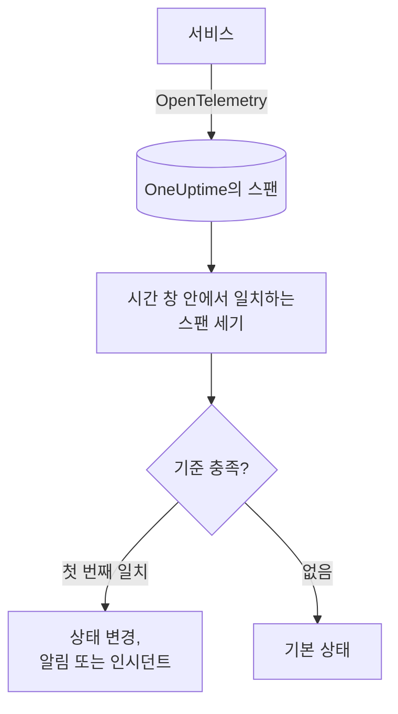

# 트레이스 모니터

트레이스 모니터는 서비스가 OneUptime에 보내는 스팬 중 필터(스팬 이름, 상태, 서비스, 속성)와 일치하는 스팬을 시간 창 안에서 셉니다. 그 수가 기준을 충족하면 모니터의 상태를 바꾸거나, 알림을 만들거나, 인시던트를 선언합니다. 엔드포인트에 대한 요청 실패, 오류 스팬 급증, 트레이스를 더 이상 보내지 않는 서비스에 대해 알림을 받는 데 사용합니다.

:::cards
- [모니터 만들기](#트레이스-모니터-만들기): 셀 스팬과 알림을 보낼 시점을 고릅니다.
- [스팬 상태 코드](#스팬-상태-코드): OK, ERROR, UNSET의 의미와 무엇으로 필터링할지.
- [평가 방식](#평가-방식): 시간 창, 개수, 1분 주기.
- [기준](#기준): 임곗값, 이상 감지, 기본값.
:::

## 작동 방식

OneUptime은 매분 모니터의 필터와 일치하고 시간 창 안에서 시작된 스팬을 셉니다. 그 수를 모니터의 기준과 위에서부터 차례로 비교하고, 처음 일치하는 기준이 무슨 일이 일어날지 결정합니다. 일치하는 기준이 없으면 모니터는 기본 상태로 돌아갑니다.

## 시작하기 전에

- 서비스가 OpenTelemetry로 OneUptime에 트레이스를 보내고 있어야 합니다. [OpenTelemetry](/docs/telemetry/open-telemetry)를 참고하세요.
- 지켜볼 스팬의 정확한 이름을 트레이스 탐색기에서 찾아 두세요. 스팬 이름은 계측이 정하며, 예를 들면 `POST /api/checkout`이나 `GET`입니다.

## 트레이스 모니터 만들기

:::steps
### 새 모니터 시작

**모니터**로 이동해 **모니터 생성**을 클릭합니다.

### Traces 선택

**모니터 유형**에서 **더 많은 모니터 유형**을 클릭하고 **텔레메트리** 아래의 **트레이스**를 선택하거나, 검색 상자에 `traces`를 입력합니다. **이름**을 입력하고 **다음**을 클릭합니다.

### 셀 스팬 선택

**추적 모니터 구성**에서 **스팬 이름**, **(시간) 동안의 모니터 트레이스**, **스팬 상태로 필터링**을 설정합니다. 비워 둔 필터는 모든 스팬과 일치합니다. 필터 아래의 **스팬 미리보기**에 지금 일치하는 스팬이 표시됩니다.

### 범위 좁히기(선택 사항)

**추가 필드**를 열어 텔레메트리 서비스, 인프라 엔터티, 속성으로 필터링합니다.

### 기준 설정

**모니터 기준** 카드는 두 가지 기준으로 시작합니다. 일치하는 스팬이 없으면 인시던트와 함께 오프라인, 하나 이상 일치하면 온라인입니다. 알림을 받고 싶은 내용에 맞게 바꾸세요([기준](#기준) 참고).

### 모니터 만들기

**모니터 생성**을 클릭합니다. 모니터가 **개요** 페이지로 열리고 1분 안에 첫 평가가 실행됩니다.
:::

> [!TIP]
> AI 기능이 잘못 응답할 때(실패, 거부, 잘림, 빈 응답, 플래그 지정, 느린 응답) 알림을 받으려면 대신 **텔레메트리** 아래의 **AI / LLM**을 선택하세요. 이 모니터는 트레이스 안의 AI 호출을 대신 읽어 주므로 스팬 필터를 직접 작성할 필요가 없습니다. [AI / LLM 옵저버빌리티](/docs/telemetry/ai-llm-observability#ai가-잘못-답할-때-알림-받기)를 참고하세요.

## 조회 대상

| 필드 | 일치 대상 | 기본값 |
| --- | --- | --- |
| **스팬 이름** | 이름에 이 텍스트가 포함된 스팬. 대소문자를 구분하지 않습니다. | 비어 있음: 모든 스팬 |
| **(시간) 동안의 모니터 트레이스** | 최근 5초부터 최근 24시간 사이에 시작된 스팬. | **지난 1분** |
| **스팬 상태로 필터링** | 선택한 상태 중 하나를 가진 스팬: **설정 안 됨**, **확인**, **오류**. | 비어 있음: 모든 상태 |
| **텔레메트리 서비스로 필터링**(**추가 필드** 안) | 선택한 서비스 중 하나에서 온 스팬. | 비어 있음: 모든 서비스 |
| **Filter by Infrastructure Entity**(**추가 필드** 안) | 선택한 호스트, 파드, 컨테이너 및 기타 엔터티 중 하나에서 온 스팬. | 비어 있음: 모든 엔터티 |
| **속성으로 필터링**(**추가 필드** 안) | 속성이 모든 조건을 충족하는 스팬. 조건마다 "같음", "포함" 같은 자체 연산자가 있습니다. | 비어 있음: 조건 없음 |

스팬이 세어지려면 설정한 모든 필터와 일치해야 합니다.

### 스팬 상태 코드

- **OK** — 애플리케이션 코드 또는 트레이스 파이프라인에 의해 작업이 명시적으로 성공으로 표시됨
- **ERROR** — 작업에서 오류가 발생함
- **UNSET** — 오류 상태가 설정되지 않음. 이는 OpenTelemetry의 기본 상태임

UNSET은 데이터가 누락되었다는 뜻이 아닙니다. OpenTelemetry 계측은 작업이 실패하면 ERROR를 설정하고 성공한 스팬은 UNSET으로 남겨 두므로, 정상적인 서비스에서는 대부분의 스팬이 UNSET입니다. OneUptime에서는 이러한 스팬이 녹색의 "Unset (no error)"로 표시됩니다. 예외를 기록해도 스팬의 상태는 바뀌지 않으므로 UNSET 스팬에도 예외가 있을 수 있습니다. 이러한 예외는 해당 스팬과 함께 나열됩니다. 실패에 대한 알림을 받으려면 ERROR로 필터링합니다. 실패하지 않은 모든 스팬을 카운트하려면 OK와 UNSET을 모두 선택합니다.

성공한 요청을 OK로 표시하려면 **트레이스 > 설정 > 파이프라인**에서 필터 조건이 **상태 = 설정 안 됨**이고 `http.response.status_code` 값(예: `200`)을 "확인 (1)" 상태로 매핑하는 **상태 리매퍼**가 포함된 트레이스 파이프라인을 추가합니다.

## 평가 방식

- **매분.** 트레이스 모니터는 프로브가 확인하지 않으므로 설정할 간격도, **프로브 및 간격** 페이지도 없습니다.
- **평가마다 숫자 하나.** 모니터는 모든 필터와 일치하고, 평가 전 **(시간) 동안의 모니터 트레이스** 안에서 시작된 스팬을 셉니다. **지난 5분**이면 평가마다 5분 전까지 살펴보므로 연속된 평가의 창이 겹칩니다.
- **스팬이 없으면 개수는 0입니다.** 트레이스를 더 이상 보내지 않는 서비스는 0이 되며, 기본 오프라인 기준이 바로 이것을 찾습니다.
- **OneUptime 자체의 중단은 침묵이 아닙니다.** OneUptime 자체가 데이터를 받지 못한 시간(재시작, 업그레이드, 밀린 작업 처리 중)이 시간 창에 들어 있는 동안 확인은 기다립니다. 상태가 바뀌지 않으며, 인시던트나 알림이 열리거나 해결되지도 않습니다. [OneUptime이 데이터를 받지 못할 때](/docs/monitor/when-oneuptime-is-not-receiving)를 참고하세요.
- **기준은 위에서부터.** 처음 일치하는 기준이 결정하므로 가장 심각한 기준을 맨 위에 두세요.

모든 상태 변경은 그 이유와 함께 모니터의 **상태 타임라인**에 기록됩니다.

## 기준

트레이스 모니터의 기준에는 **필터 유형**이 하나뿐입니다. 창 안에서 일치한 스팬의 수인 **Span Count**입니다. **필터 조건**을 고르고, 임곗값 조건이면 **값**도 정합니다.

| 필터 조건 | 스팬 수가 다음과 같을 때 일치 |
| --- | --- |
| **Greater Than** | 값보다 큼 |
| **Greater Than Or Equal To** | 값 이상 |
| **Less Than** | 값보다 작음 |
| **Less Than Or Equal To** | 값 이하 |
| **Equal To** | 값과 정확히 같음 |
| **Anomalously High** | 이번 주의 이 시간대에 예상되는 범위보다 높음 |
| **Anomalously Low** | 그 범위보다 낮음 |
| **Anomalous** | 어느 방향으로든 그 범위를 벗어남 |

이상 조건에는 **값**이 없습니다. **민감도**(Low, 기본값인 Medium, High)와 14일(기본값), 28일, 60일, 90일 중 **기준선 기간**을 고릅니다. OneUptime은 개수를 분당 비율로 바꾸어 그 기간 동안의 같은 요일·시간대와 비교합니다. 기준선은 모니터의 서비스와 스팬 상태만 대상으로 하며, 스팬 이름 필터와 속성 필터는 포함하지 않습니다. 그 요일·시간대에 기록이 충분히 쌓일 때까지 기준은 아직 학습 중이며 발동하지 않습니다.

새 트레이스 모니터는 다음 기준으로 시작합니다.

| 기준 | 필터 | 효과 |
| --- | --- | --- |
| Check if … is offline | **Span Count** **Equal To** `0` | 모니터를 오프라인으로 표시하고 인시던트를 선언합니다(자동 해결) |
| Check if … is online | **Span Count** **Greater Than** `0` | 모니터를 온라인으로 표시합니다 |

## 실전 예: checkout 요청 실패

5분 동안 checkout 서비스가 이름이 `POST /api/checkout`인 스팬 1,200개를 기록합니다. UNSET이 1,150개, OK가 20개, ERROR가 30개입니다. 같은 모니터라도 **스팬 상태로 필터링**에 따라 세는 수가 크게 달라집니다.

| 스팬 상태로 필터링 | Span Count | 측정하는 것 |
| --- | --- | --- |
| **오류** | 30 | 실패한 요청 |
| **확인** | 20 | 코드가 성공으로 표시한 요청만 |
| **설정 안 됨** 및 **확인** | 1,170 | 실패하지 않은 모든 요청 |
| 비어 있음 | 1,200 | 모든 요청 |

5분 동안 checkout 요청이 10개 넘게 실패하면 호출을 받으려면:

- **스팬 이름**: `POST /api/checkout`
- **(시간) 동안의 모니터 트레이스**: **지난 5분**
- **스팬 상태로 필터링**: **오류**
- 기준 1: **Span Count** **Greater Than** `10`: 모니터를 오프라인으로 표시하고 인시던트 선언
- 기준 2: **Span Count** **Less Than Or Equal To** `10`: 모니터를 온라인으로 표시

실패한 요청이 30개이면 기준 1이 일치하고 인시던트가 선언됩니다. 실패가 10개 이하인 5분이 지나면 기준 2가 일치해 모니터가 다시 온라인이 되고, 인시던트가 저절로 해결됩니다.

## 문제 해결

:::details 엔드포인트에 대한 스팬이 하나도 세어지지 않음
**스팬 이름**은 스팬의 이름과 비교되는데, 계측은 서버 스팬의 이름을 라우트(`POST /api/checkout`)나 메서드(`GET`)만으로 짓는 경우가 많습니다. 트레이스 탐색기에서 정확한 이름을 찾으세요. 그다음 모니터의 **기준** 페이지(**구성** 아래)를 열고 **Edit Monitoring Criteria**를 클릭하면 **스팬 미리보기**에서 필터가 지금 일치하는 항목을 볼 수 있습니다.
:::

:::details 확인으로 필터링하면 성공한 요청이 세어지지 않음
대부분의 계측은 성공한 스팬을 OK가 아니라 UNSET으로 남겨 둡니다([스팬 상태 코드](#스팬-상태-코드) 참고). **설정 안 됨**과 **확인**을 모두 선택하거나, 그곳에서 설명한 트레이스 파이프라인을 추가하세요.
:::

:::details 스팬에 예외가 있는데 오류로 세어지지 않음
예외를 기록해도 스팬의 상태는 바뀌지 않습니다. **오류**로 필터링하거나, 예외 자체에 대해 알림을 받으려면 [예외 모니터](/docs/monitor/exceptions-monitor)를 사용하세요.
:::

:::details 이상 기준이 전혀 발동하지 않음
아직 학습 중입니다. 비교 대상인 요일·시간대에 **기준선 기간** 안의 기록이 아직 충분하지 않습니다.
:::

## 다음 단계

:::cards
- [예외 모니터](/docs/monitor/exceptions-monitor): 서비스가 기록하는 예외에 대해 알림을 받습니다.
- [로그 모니터](/docs/monitor/logs-monitor): 로그의 양과 내용에 대해 알림을 받습니다.
- [검색 구문](/docs/telemetry/search-syntax): 트레이스 탐색기에서 스팬 이름과 상태를 찾습니다.
- [인시던트 및 알림 템플릿](/docs/monitor/incident-alert-templating): 유용한 알림 제목과 설명을 작성합니다.
:::
