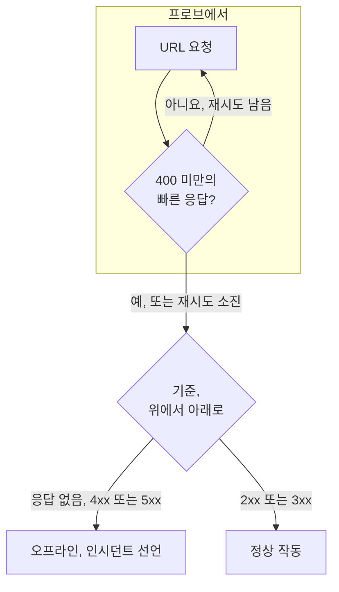

# 웹사이트 모니터

웹사이트 모니터는 웹 페이지가 응답하는지 확인합니다. 확인할 때마다 프로브가 페이지의 URL을 요청하며, 페이지가 응답하지 않거나 오류로 응답하면 모니터가 오프라인이 되고 인시던트를 선언합니다. 메서드, 헤더, 본문을 지정해 엔드포인트를 호출하려면 대신 [API 모니터](/docs/monitor/api-monitor)를 사용하세요.

:::cards
- [모니터 만들기](#웹사이트-모니터-만들기): 대시보드에서 여섯 단계.
- [구성 옵션](#구성-옵션): URL 자리 표시자, 리디렉션, 인증서, 시간 초과, 재시도.
- [모니터링 기준](#모니터링-기준): 처음부터 무엇을 정상 또는 중단으로 보는지.
- [문제 해결](#문제-해결): 모니터와 브라우저의 결과가 다를 때.
:::

## 작동 방식

확인할 때마다 프로브는 URL을 요청하고, 리디렉션을 따라간 뒤, 돌아온 것을 기록합니다. 상태 코드, 응답 시간, 헤더, 그리고 기준에 필요하면 본문입니다. 실패했거나, 시간 초과되었거나, `4xx` 또는 `5xx` 상태로 응답했거나, 10초보다 오래 걸린 요청은 허용한 재시도 횟수만큼 다시 시도합니다. 그런 다음 OneUptime이 결과를 모니터의 기준에 통과시킵니다.



모니터의 기준 중 응답 본문을 읽는 것(**응답 본문** 또는 **JavaScript Expression** 필터)이 없으면, 프로브는 `GET` 대신 `HEAD` 요청을 보내고, 서버가 `HEAD`를 거부하면 `GET`으로 다시 보냅니다. 서버의 액세스 로그에는 둘 중 어느 것이든 나타날 수 있습니다.

자체 네트워크 연결을 잃은 프로브는 결과를 보고하지 않으므로 사이트를 오프라인으로 표시할 수 없습니다.

## 시작하기 전에

- **모니터를 만들 수 있는 역할**: Project Owner, Project Admin, Project Member, Monitor Admin 또는 Monitor Member, 또는 Create Monitor 권한이 있는 사용자 지정 역할.
- **사이트에 연결할 수 있는 프로브.** 모든 새 모니터에는 프로젝트의 기본 프로브가 선택됩니다. 사이트 앞에 방화벽이 있으면 [OneUptime Cloud의 프로브 IP 주소](/docs/configuration/ip-addresses)를 허용합니다. 프라이빗 네트워크의 사이트에는 그 네트워크 안에서 실행되고 프라이빗 주소에 연결하도록 허용된 [사용자 지정 프로브](/docs/probe/custom-probe)가 필요합니다. [프라이빗 네트워크 접근](/docs/self-hosted/private-network-access)을 참고하세요.

## 웹사이트 모니터 만들기

:::steps
### 새 모니터 시작

**모니터**로 이동해 **모니터 생성**을 클릭합니다. **모니터 유형**에서 **웹사이트**를 선택합니다.

### 이름 지정

`Marketing site` 같은 **이름**을 입력하고 **다음**을 클릭합니다.

### URL 입력

**웹사이트 URL**에 `https://`를 포함한 페이지의 전체 주소를 입력합니다(예: `https://example.com`). 리디렉션, 인증서, 시간 초과, 재시도를 바꾸려면 그 아래의 **추가 필드**를 엽니다([구성 옵션](#구성-옵션) 참고).

### 테스트

**모니터 테스트**를 클릭하고 **프로브 선택**에서 프로브를 고른 다음 **테스트 실행**을 클릭합니다. **모니터 테스트 결과**에 프로브가 받은 응답이 표시됩니다.

### 기준 검토

**모니터 기준**은 [기본 기준](#기본-기준)으로 시작합니다. 사이트가 응답하지 않거나 오류로 응답하면 오프라인, `2xx` 또는 `3xx` 상태면 온라인입니다. 필요하면 바꾼 다음 **다음**을 클릭합니다.

### 프로브 선택 및 생성

**프로브**와 **모니터링 간격**(**5분마다**로 시작)을 그대로 두거나 바꾼 다음 **모니터 생성**을 클릭합니다. 모니터 페이지가 열립니다.
:::

## 구성 옵션

### 웹사이트 URL

확인할 페이지를 스킴을 포함한 전체 URL로 입력합니다: `https://example.com`, `https://example.com/pricing`, `http://example.com:8080/health`. URL에 [모니터 시크릿](/docs/monitor/monitor-secrets)을 `{{monitorSecrets.NAME}}` 형태로 넣을 수 있습니다. 예를 들어 쿼리 문자열의 토큰입니다.

### 동적 URL 자리 표시자

사이트 앞에 CDN이나 캐싱 프록시가 있으면 프로브가 서버 대신 캐시에서 응답을 받을 수 있습니다. 캐시를 우회하려면 URL에 자리 표시자를 추가합니다. 프로브는 확인할 때마다 자리 표시자를 새 값으로 바꿉니다.

| 자리 표시자 | 바뀌는 값 | 값 예시 |
| --- | --- | --- |
| `{{timestamp}}` | 현재 Unix 시간(초) | `1719500000` |
| `{{random}}` | 16진수 32자로 된 임의의 고유 문자열 | `3f2b8c1d9e7a4b6c8d0e1f2a3b4c5d6e` |

자리 표시자가 들어간 URL:

```text
https://example.com/health?cb={{timestamp}}
```

5분 간격의 두 번의 확인에서 프로브가 요청하는 URL:

```text
https://example.com/health?cb=1719500000
https://example.com/health?cb=1719500300
```

`{{random}}`도 같은 방식으로 사용합니다: `https://example.com/health?nocache={{random}}`.

### 추가 필드

이 설정들은 URL 아래의 **추가 필드**에 접혀 있습니다. 접힌 머리글에 설정 이름이 나열되고, 바꾼 설정이 표시됩니다.

| 필드 | 기본값 | 하는 일 |
| --- | --- | --- |
| **리디렉션을 따르지 않음** | 꺼짐 | 리디렉션을 따라가지 않고 첫 응답을 판단합니다. [아래](#리디렉션을-따르지-않음)를 참고하세요. |
| **자체 서명된 인증서 허용** | 꺼짐 | 모니터 자체의 호스트 이름에 대해 TLS 인증서 검증을 건너뜁니다. |
| **클라이언트 인증서(mTLS) 사용** | 꺼짐 | 클라이언트 인증서와 개인 키를 제시합니다. [클라이언트 인증서(mTLS)](#클라이언트-인증서mtls)를 참고하세요. |
| **요청 시간 초과(초)** | `60` | 각 시도를 기다리는 시간. 최대 60초입니다. |
| **실패 시 재시도** | 프로브 기본값, 보통 `3` | 실패한 시도를 다시 시도하는 횟수. 최대 3번입니다. [재시도와 시간 초과](#재시도와-시간-초과)를 참고하세요. |

#### 리디렉션을 따르지 않음

기본적으로 프로브는 리디렉션(`301`, `302`, `303`, `307`, `308`)을 최대 10번까지 따라가고, 마지막에 도착한 페이지를 판단합니다. 대신 리디렉션 응답 자체를 판단하려면 **리디렉션을 따르지 않음**을 켭니다. 예를 들어 `http://`가 `https://`로 리디렉션되는지 확인할 때입니다. [기본 기준](#기본-기준)은 리디렉션 응답을 온라인으로 봅니다.

**자체 서명된 인증서 허용**은 모니터 자체의 호스트 이름에 머무는 리디렉션을 따라갑니다. 다른 호스트 이름으로의 리디렉션은 평소처럼 검증됩니다.

#### 클라이언트 인증서(mTLS)

사이트에 상호 TLS가 필요하면 **클라이언트 인증서(mTLS) 사용**을 켜고 다음을 입력합니다.

| 필드 | 입력할 내용 |
| --- | --- |
| **클라이언트 인증서 (PEM)** | 제시할 PEM 인코딩 클라이언트 인증서. |
| **클라이언트 개인 키 (PEM)** | 짝이 되는 PEM 인코딩 개인 키. |
| **클라이언트 개인 키 암호** | 선택 사항. 개인 키가 암호화된 경우에만 필요한 암호. |

이는 curl의 `--cert` 및 `--key` 플래그에 해당합니다.

```bash
curl --cert client.crt --key client.key https://example.com/health
```

키를 모니터 설정에 두지 않으려면 인증서와 키를 [모니터 시크릿](/docs/monitor/monitor-secrets)으로 저장하고 이 필드에 `{{monitorSecrets.NAME}}`을 입력합니다. 시크릿은 서버에서 채워지며, 그 값은 대시보드에 절대 표시되지 않습니다.

클라이언트 인증서는 요청이 모니터 URL의 오리진(같은 스킴, 호스트, 포트)에 머무는 동안에만 제시됩니다. 다른 오리진으로 리디렉션된 뒤에는 프로브가 인증서 없이 계속합니다.

#### 재시도와 시간 초과

**실패 시 재시도**는 첫 시도 _이후의_ 재시도를 세므로, `0`이면 확인을 한 번 실행하고 `2`면 최대 세 번 실행합니다. 비워 두면 프로브의 기본값을 사용합니다. 프로브의 `PROBE_MONITOR_RETRY_LIMIT`가 다르게 정하지 않는 한 3입니다. 프로브는 시도 사이에 1초를 기다리며, 각 시도에는 **요청 시간 초과(초)** 전체가 주어집니다.

다음 실패는 다시 시도합니다: 연결 오류, 시간 초과, `4xx` 및 `5xx` 응답, 10초보다 느린 응답. 다음은 다시 시도해도 바뀌지 않으므로 다시 시도하지 않습니다: 잘못되었거나 차단된 URL, 10번을 넘는 리디렉션, 512 KiB보다 큰 응답.

## 모니터링 기준

기준은 웹사이트를 온라인, 저하됨, 오프라인 중 무엇으로 볼지, 그리고 그에 따라 인시던트를 선언할지 알림을 생성할지를 정합니다. 각 기준은 하나 이상의 필터를 확인합니다.

| 필터 | 조건 | 확인하는 것 |
| --- | --- | --- |
| **Is Online** | **참**, **거짓** | 상태 코드와 관계없이 사이트가 응답했는지 여부. |
| **응답 상태 코드** | **Equal To**, **Not Equal To**, **Greater Than**, **Less Than**, **Greater Than Or Equal To**, **Less Than Or Equal To** | HTTP 상태 코드. |
| **응답 시간(ms)** | **Greater Than**, **Less Than**, **Greater Than Or Equal To**, **Less Than Or Equal To** | 리디렉션을 포함해 요청에 걸린 시간. |
| **응답 본문** | **포함**, **Not Contains** | 응답 본문의 텍스트. 대소문자를 구분합니다. |
| **Response Header** | **포함**, **Not Contains** | 응답에 이 이름의 헤더가 있는지 여부. `x-cache`처럼 이름을 소문자로 입력합니다. |
| **Response Header Value** | **포함**, **Not Contains** | 헤더가 정확히 이 값을 가지는지 여부. `no-store`처럼 소문자로 비교합니다. |
| **JavaScript Expression** | **Evaluates To True** | 응답에 대한 식. [JavaScript 표현식](/docs/monitor/javascript-expression)을 참고하세요. |
| **Is Request Timeout** | **참**, **거짓** | 모든 시도에서 요청이 시간 초과되었는지 여부. |

**기준 추가**는 필터 이름을 딴 이름이 이미 붙은 기준을 추가합니다(예: _Response Time (in ms) is above 3000_). 직접 이름을 입력하기 전까지 이름은 필터에 따라 바뀝니다. 설명은 선택 사항이며, 추가하려면 기준의 **설정**을 엽니다.

필터가 둘 이상이면 **일치 조건**이 필터가 모두 일치해야 하는지(**전체**), 하나만 일치하면 되는지(**모두**)를 정합니다. 기준의 **작업**은 그 기준이 하는 일을 정합니다: 모니터 상태 변경, 알림 생성, 인시던트 선언, 또는 이들 중 여러 개.

### 기본 기준

새 웹사이트 모니터는 두 가지 기준으로 시작하므로, 아무것도 바꾸지 않아도 작동합니다.

- **오프라인** — 웹사이트가 응답하지 않거나, `400` 이상(또는 `200` 미만)의 상태 코드로 응답합니다. 모니터는 **오프라인**으로 표시되고 인시던트가 생성됩니다. 웹사이트가 돌아오면 인시던트는 스스로 해결됩니다.
- **온라인** — 웹사이트가 `200`, `204`, `301`처럼 `2xx` 또는 `3xx` 상태 코드로 응답합니다. 모니터는 **정상 작동**으로 표시됩니다.

기준 목록에서 두 기준은 모니터 이름을 따서 이름이 붙습니다: _Check if (name) is offline_, _Check if (name) is online_.

따라서 `204 No Content`로 응답하는 페이지나, **리디렉션을 따르지 않음**을 켜고 감시하는 리디렉션도 정상으로 봅니다. 정상을 뜻하는 상태 코드가 하나뿐이라면 모니터의 **구성 → 기준** 페이지에서 두 기준을 모두 바꿉니다. 예를 들어 각 기준에 있는 두 상태 코드 필터 대신, 온라인 기준에는 **응답 상태 코드** / **Equal To** / `200`을, 오프라인 기준에는 **Not Equal To** / `200`을 둡니다.

기준은 위에서 아래로 확인되며, 처음 일치한 기준이 무엇을 할지 정합니다.

일치하는 기준이 없으면 모니터는 기본 상태로 돌아갑니다. 기준 아래의 **추가 필드**에서 다른 상태를 고르지 않으면 **정상 작동**입니다. 접힌 **추가 필드** 머리글에 그 상태가 표시됩니다.

OneUptime이 이 기본값을 바꾸기 전에 만든 모니터는 만들 때의 기준을 유지하며, `200`만 온라인으로 봅니다. API나 Terraform으로 만든 모니터는 보낸 기준을 사용합니다.

### 일정 기간에 걸친 평가

**일정 기간에 걸쳐 이 기준을 평가**는 필터 아래의 확인란으로, **Is Online**, **응답 상태 코드**, **응답 시간(ms)** 필터에 제공됩니다. 켜면 최신 확인 대신 지난 확인들의 기간을 판단합니다. **평가**에서 집계를 고르고, **지난 시간 동안(분)** 항목에서 2분에서 60분 사이의 기간을 고릅니다.

| 집계 | 일치하는 경우 |
| --- | --- |
| **평균**, **합계**, **Maximum Value**, **Minimum Value** | 기간 전체에 대한 그 값이 조건을 충족할 때. 숫자 필터만 해당합니다. |
| **All Values** | 기간 안의 모든 확인이 조건을 충족할 때. |
| **Any Value** | 기간 안의 확인 중 적어도 하나가 조건을 충족할 때. |

**All Values**는 기간이 실제로 데이터로 채워진 뒤에만 일치합니다. 방금 만든 모니터나 확인이 더 이상 기록되지 않는 모니터에는 지난 N분에 대해 말할 만한 기록이 없으므로, 기준은 가진 값 하나로 일치하지 않고 기다립니다. **Any Value**는 "확인 한 번이라도 임계값을 넘으면 바로 알려 달라"를 위한 설정이며, 여전히 즉시 실행됩니다.

**데이터가 없는 경우**는 기간이 기준을 뒷받침할 수 없는 동안 무슨 일이 일어날지 정합니다.

| 옵션 | 일어나는 일 | 용도 |
| --- | --- | --- |
| **Ignore**(기본값) | 기준이 일치하지 않습니다. | 일반적인 임계값 알림. |
| **트리거** | 데이터가 없는 것 자체를 문제로 봅니다. | 침묵 자체가 장애인 확인. |
| **Treat As Zero** | 기간을 하나의 0으로 비교합니다. | 이벤트가 없으면 정말로 0을 뜻하는 카운터. |

### 기준 예시

| 목표 | 필터 | 조건 | 값 |
| --- | --- | --- | --- |
| 느릴 때 사이트를 저하됨으로 표시 | **응답 시간(ms)** | **Greater Than** | `3000` |
| `200`으로 제공된 오류 페이지 잡기 | **응답 본문** | **Not Contains** | `Welcome` |
| CDN 헤더가 있는지 확인 | **Response Header** | **포함** | `x-cache` |
| `200`만 정상으로 인정 | **응답 상태 코드** | **Equal To** | `200` |

## 문제 해결

:::details 모니터는 오프라인인데 브라우저에서는 사이트가 열림
프로브가 브라우저와 다른 응답을 받았습니다. 인시던트의 근본 원인과 모니터의 **모니터링 로그**에 프로브가 본 내용이 표시됩니다. 흔한 원인:

- 방화벽이나 봇 필터가 프로브를 차단합니다. [OneUptime Cloud의 프로브 IP 주소](/docs/configuration/ip-addresses)를 허용합니다.
- 사이트에 여러분의 네트워크에서만 연결할 수 있습니다. 그 안에서 [사용자 지정 프로브](/docs/probe/custom-probe)를 사용합니다.
- 인증서가 자체 서명되었거나 사설 인증 기관에서 발급되었습니다. **자체 서명된 인증서 허용**을 켜거나, [SSL 인증서 모니터](/docs/monitor/ssl-certificate-monitor)로 인증서를 따로 감시합니다.
:::

:::details 확인이 "Remote response exceeded the allowed size."로 실패함
프로브는 응답을 최대 512 KiB까지만 읽는데, 이 페이지는 그보다 큽니다. 상태 확인 엔드포인트처럼 더 작은 페이지를 모니터 대상으로 하거나, 프로브가 헤더만 읽으면 되도록 **응답 본문** 및 **JavaScript Expression** 필터를 제거합니다.
:::

:::details 확인이 "Monitor target exceeded 10 redirects."로 실패함
URL이 10번 넘게 리디렉션되며, 보통 루프입니다. `curl -IL`로 URL을 열어 리디렉션 과정을 확인하고, 그 과정이 끝나야 하는 페이지를 모니터 대상으로 합니다.
:::

:::details 프라이빗 네트워크 주소에 관한 메시지로 확인이 실패함
URL이 프라이빗 주소로 확인되며, 확인을 실행한 프로브는 프라이빗 주소에 연결하도록 허용되어 있지 않습니다. 자체 호스팅 프로브에서는 `PROBE_ALLOW_PRIVATE_NETWORK_MONITORS`로 이를 켭니다. [프라이빗 네트워크 접근](/docs/self-hosted/private-network-access)을 참고하세요.
:::

## 다음 단계

:::cards
- [API 모니터](/docs/monitor/api-monitor): 메서드, 헤더, 본문을 지정해 엔드포인트를 호출합니다.
- [SSL 인증서 모니터](/docs/monitor/ssl-certificate-monitor): 사이트 인증서가 만료되기 전에 경고를 받습니다.
- [모니터 시크릿](/docs/monitor/monitor-secrets): 토큰과 키를 모니터 설정에 두지 않습니다.
- [인시던트](/docs/incidents/index): 모니터가 인시던트를 선언한 뒤에 일어나는 일.
:::
