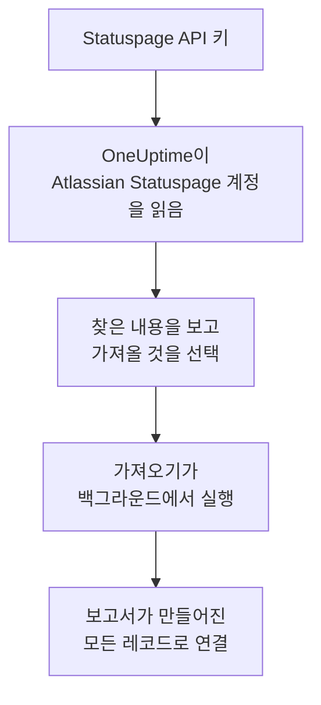

# Atlassian Statuspage에서 이전

**다른 도구에서 가져오기**를 사용하면 Atlassian Statuspage의 페이지를 몇 분 만에 OneUptime으로 옮겨 올 수 있습니다. Statuspage API 키가 있으면 OneUptime이 페이지와 그 구성 요소, 그룹, 이메일 구독자를 읽고, 찾은 내용을 보여 주며, 선택한 것을 만듭니다. Statuspage에서는 아무것도 바뀌지 않습니다.

:::cards
- [계정 가져오기](#atlassian-statuspage-계정-가져오기): 키를 만들고 계정을 읽은 뒤 가져올 것을 선택합니다.
- [가져오는 것](#가져오는-것): Statuspage의 각 페이지, 구성 요소, 구독자가 OneUptime에서 무엇이 되는지 설명합니다.
- [전환 마무리하기](#전환-마무리하기): 가져오기가 끝난 뒤 할 일입니다.
:::

## 작동 방식

- **키는 한 번만 사용됩니다.** OneUptime이 계정을 읽는 동안 암호화되어 보관되고, 읽기가 끝나는 즉시 삭제됩니다. 성공 여부와는 관계없습니다. 다시 표시되거나 로그에 기록되는 일은 없습니다.
- **OneUptime은 읽기만 합니다.** Atlassian Statuspage 자체 API만 호출합니다: `api.statuspage.io`. 요청은 1초에 한 번이며, 이는 Statuspage가 키 하나에 허용하는 최대치입니다. Atlassian Statuspage이(가) 속도를 줄이라고 요청하면 기다렸다가 다시 시도합니다.
- **가져오기를 시작하기 전에는 아무것도 만들어지지 않습니다.** 미리 보기는 항목마다 새 항목인지, 이미 OneUptime에 있는지(그대로 사용됨), 이전 가져오기에서 가져왔는지, 또는 가져올 수 없는 이유가 무엇인지 보여 줍니다.
- **다시 실행해도 같은 것을 두 번 만들지 않습니다.** OneUptime은 각 가져오기가 가져온 것을 Atlassian Statuspage ID로 기억합니다. Atlassian Statuspage에 페이지나 구성 요소을(를) 추가한 뒤 다시 실행하면 새로운 것만 만들어집니다.

## 시작하기 전에

- **OneUptime 프로젝트와, 가져오는 것을 만들 권한.** 프로젝트 소유자와 관리자는 모든 것을 가져올 수 있습니다. 다른 역할도 가져오기를 실행할 수 있으며, 만들 수 있는 종류의 레코드를 가져옵니다. 나머지는 이유와 함께 가져오지 않음으로 표시됩니다.
- **Statuspage API 키.** 계정 소유자만 만들 수 있습니다. 가져오기는 Statuspage에 아무것도 쓰지 않으며, 키로 볼 수 있는 모든 페이지를 읽습니다.
- **페이지를 위한 여유(OneUptime Cloud).** 요금제에는 상태 페이지와 구독자 수에 한도가 있습니다. 들어가지 않는 것은 가져오지 않음으로 표시됩니다. 구성 요소는 무료인 수동 모니터가 됩니다.

## Atlassian Statuspage 계정 가져오기

:::steps
### Statuspage에서 API 키 만들기
Statuspage에서 왼쪽 아래의 아바타를 선택한 다음 **API info**를 여세요. **Create key**를 선택하고 이름을 `OneUptime import`로 지정한 뒤 키를 복사하세요.

### 가져오기 페이지 열기
OneUptime에서 **프로젝트 설정** > **다른 도구에서 가져오기**로 이동해 **Atlassian Statuspage**을(를) 선택합니다.

### Atlassian Statuspage 연결하기
키을(를) **Atlassian Statuspage API 키**에 붙여 넣고 **내 Atlassian Statuspage 계정 읽기**를 선택합니다. 큰 계정은 몇 분이 걸리며, 읽는 동안 페이지를 떠나도 됩니다.

### 가져올 것 선택하기
미리 보기에는 찾은 내용이 종류별 섹션으로 나뉘어 표시됩니다. 만들어질 항목은 처음부터 선택되어 있습니다. 단, 구독자는 제외됩니다. 각 항목 아래에는 원래와 똑같이 가져오지 않는 부분이 표시됩니다. 선택한 상태 페이지가 선택하지 않은 모니터를 보여 주면 그렇다고 알려 주고, **이것들도 선택**으로 함께 선택할 수 있습니다. 구독자를 가져오려면 구독자를 선택한 뒤, 그 아래에서 이들이 업데이트 수신에 동의했고 옮겨도 된다는 것을 확인하세요. 아무에게도 이메일을 보내지 않습니다.

### 가져오기 시작하기
**가져오기 시작**을 선택합니다. 가져오기는 백그라운드에서 실행됩니다. 페이지를 떠나도 되며, 보고서는 그 페이지에서 기다립니다.
:::

보고서는 생성과 가져오지 않음의 개수를 보여 주고, 각 항목을 그 항목이 된 레코드로 가는 링크와 함께 나열합니다(실패한 항목이 먼저). 이전 가져오기는 같은 페이지의 **이전 가져오기**에 나열됩니다.

## 가져오는 것

| Atlassian Statuspage에서 | OneUptime에서 | 방식 |
| --- | --- | --- |
| Components | 수동 모니터 | 각 구성 요소는 상태 페이지가 보여 주는 수동 모니터가 됩니다. 아무것도 검사하지 않으므로, Statuspage에서처럼 OneUptime에서 상태를 직접 설정합니다. 구성 요소 그룹은 페이지의 그룹이 됩니다. |
| Pages | 상태 페이지 | 각 페이지는 이름과 설명, 그룹으로 나뉜 구성 요소, 강조 표시하는 구성 요소의 가동률과 기록과 함께 가져옵니다. 일부 사람만 볼 수 있는 페이지는 비공개로 가져옵니다. |
| Email subscribers | 상태 페이지 구독자 | 확인된 이메일 구독자는 옮겨도 된다고 확인하면 가져오며, 같은 구성 요소를 구독합니다. 아무에게도 이메일을 보내지 않으며, OneUptime에서 받는 모든 업데이트에는 구독 취소 링크가 있습니다. |

구성 요소는 정상 상태로 가져옵니다. 지금 Statuspage에서 정상이 아닌 구성 요소는 미리 보기에 표시되므로, 가져온 뒤 상태를 설정할 수 있습니다.

## 가져오지 않는 것

- **인시던트, 예정된 유지 관리와 그 기록.** OneUptime의 인시던트는 사람을 호출하는 현재 진행 중인 레코드이므로, 지난 인시던트는 Statuspage에 남습니다.
- **SMS, 웹훅, Slack, Microsoft Teams 구독자.** 미리 보기에 개수가 표시됩니다. 이메일 구독자만 가져옵니다.
- **인시던트 템플릿과 시스템 메트릭.** 아직 필요한 것은 OneUptime에서 추가하세요.
- **상태 페이지의 자체 도메인과 브랜딩.** OneUptime에서 도메인은 **사용자 정의 도메인**에, 로고는 **브랜딩**에 추가하세요.

## 한도

가져오기 한 번에 최대 2,000개의 레코드를 만듭니다. 모니터는 최대 1,000개, 상태 페이지는 50개까지입니다. 구독자는 이 수에 포함되지 않으며, 가져오기 한 번에 최대 5,000명까지 가져옵니다. 한도를 넘는 것은 가져오지 않음으로 표시됩니다. 나머지를 가져오려면 가져오기를 다시 실행하세요.

OneUptime Cloud에서는 요금제에 여유가 없는 상태 페이지와 구독자가 필요한 것과 함께 가져오지 않음으로 표시됩니다.

미리 보기는 하루 동안 보관됩니다. 계정을(를) 읽은 사람만 항목을 선택하고 가져오기를 시작할 수 있습니다. 프로젝트 소유자와 관리자는 모든 가져오기의 진행 상황과 보고서를 볼 수 있습니다.

## 전환 마무리하기

:::steps
### 상태 페이지 확인
**상태 페이지**에서 각 페이지를 열어 Statuspage의 페이지와 비교하세요. 각 구성 요소는 수동 모니터이므로, 상황이 바뀌면 OneUptime에서 상태를 바꾸세요.

### 상태 페이지 주소를 OneUptime으로 연결
**상태 페이지**에서 페이지를 열고 **사용자 정의 도메인**에 도메인을 추가한 뒤 DNS 레코드를 바꾸세요. 그러면 방문자와 구독자가 새 페이지로 오게 됩니다.

### Atlassian Statuspage에서 페이지 끄기
도메인이 OneUptime을 가리키게 되면 구독자가 두 번 알림을 받지 않도록 Statuspage에서 페이지를 닫으세요.
:::

## 문제 해결

:::details Atlassian Statuspage이(가) API 키를 받아들이지 않았습니다
키 전체를 복사했는지, 그리고 계정 소유자가 **API info**에서 만든 키인지 확인하세요. 키는 Statuspage 조직 하나에 속하며 그 조직의 페이지만 읽습니다. 그런 다음 **다시 시도**를 선택하세요.
:::

:::details 구독자를 가져올 수 없습니다
구독자 아래에서 이들이 업데이트 수신에 동의했고 옮겨도 된다는 것을 확인하는 상자를 선택하세요. **가져오기 시작**은 이 확인을 기다립니다. Statuspage에서 구독을 확인하지 않은 구독자는 그곳에 남습니다.
:::

:::details 일부 항목을 선택할 수 없습니다
항목마다 이유가 표시됩니다: 프로젝트에 이미 있는 이름, 이전 가져오기에서 가져온 것, 또는 만들 권한이 없거나 요금제에 포함되지 않는 레코드입니다.
:::

## 다음 단계

:::cards
- [상태 페이지 개요](/docs/status-pages/index): 상태 페이지가 무엇을 보여 주고 누가 볼 수 있는지.
- [구독자 및 공지](/docs/status-pages/subscribers): 구독자가 인시던트를 알게 되는 방식.
- [수동 모니터](/docs/monitor/manual-monitor): 상태를 직접 설정하는 모니터.
:::
