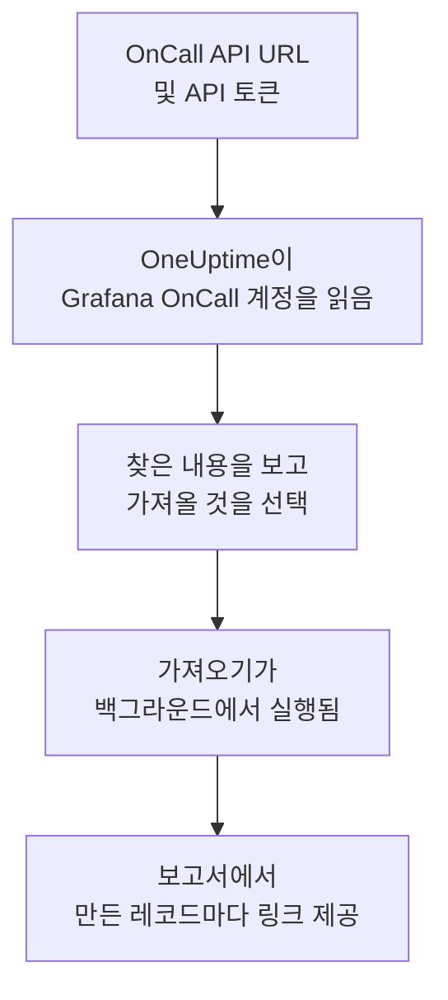

# Grafana OnCall에서 이전

Grafana Labs는 2026년 3월에 오픈 소스 Grafana OnCall을 보관 처리했으며, Grafana Cloud에서는 Grafana Cloud IRM의 일부로 계속 제공됩니다. 어디에서 운영하든 **다른 도구에서 가져오기**를 사용하면 온콜 설정을 몇 분 만에 OneUptime으로 옮겨 올 수 있습니다. OnCall API URL과 API 토큰이 있으면 OneUptime이 사용자, 팀, 스케줄, 에스컬레이션 체인을 읽고, 찾은 내용을 보여 주며, 선택한 것을 만듭니다. Grafana OnCall에서는 아무것도 바뀌지 않습니다.

:::cards
- [계정 가져오기](#grafana-oncall-계정-가져오기): 토큰을 만들고 계정을 읽은 뒤 가져올 것을 선택합니다.
- [가져오는 것](#가져오는-것): Grafana OnCall의 각 레코드가 OneUptime에서 무엇이 되는지 설명합니다.
- [전환 마무리하기](#전환-마무리하기): 가져오기가 끝난 뒤 할 일입니다.
:::

## 작동 방식

- **토큰은 한 번만 사용됩니다.** OneUptime이 계정을 읽는 동안 API URL과 함께 암호화되어 보관되고, 읽기가 끝나는 즉시 삭제됩니다. 성공 여부와는 관계없습니다. 다시 표시되거나 로그에 기록되는 일은 없습니다.
- **OneUptime은 입력한 주소에서 읽기만 합니다.** 붙여 넣은 OnCall API URL만 호출하며, 최대 초당 한 번입니다. 이는 토큰당 5분에 300건이라는 Grafana OnCall의 한도 안에 들어갑니다. Grafana OnCall이 속도를 줄이라고 요청하면 기다렸다가 다시 시도합니다.
- **주소는 요청할 때마다 확인됩니다.** OneUptime은 자신이 실행 중인 머신이나 클라우드 메타데이터 서비스를 호출하지 않으며, 리디렉션을 따르지 않습니다. OneUptime Cloud에서는 주소가 공개 주소여야 하고 `https://`로 시작해야 합니다. 자체 호스팅 OneUptime은 관리자가 끄지 않았다면 내부 네트워크의 Grafana OnCall도 읽을 수 있습니다. [Private Network Access](/docs/self-hosted/private-network-access)를 참고하세요.
- **가져오기를 시작하기 전에는 아무것도 만들어지지 않습니다.** 미리 보기는 항목마다 새 항목인지, 이미 OneUptime에 있는지(그대로 사용됨), 이전 가져오기에서 가져왔는지, 또는 가져올 수 없는 이유가 무엇인지 보여 줍니다.
- **다시 실행해도 같은 것을 두 번 만들지 않습니다.** OneUptime은 각 가져오기가 가져온 것을 Grafana OnCall ID로 기억합니다. Grafana OnCall에 사람이나 스케줄을 추가한 뒤 다시 실행하면 새로운 것만 만들어집니다.

## 시작하기 전에

- **OneUptime 프로젝트와, 가져오는 것을 만들 권한.** 프로젝트 소유자와 관리자는 모든 것을 가져올 수 있습니다. 다른 역할도 가져오기를 실행할 수 있으며, 만들 수 있는 종류의 레코드를 가져옵니다. 나머지는 이유와 함께 가져오지 않음으로 표시됩니다.
- **Grafana OnCall API 토큰.** Grafana 서비스 계정 토큰이 아니라 OnCall API 토큰을 사용하세요. 가져오기는 Grafana OnCall에 아무것도 쓰지 않습니다. 가져오기가 끝나면 토큰을 삭제하세요.
- **OnCall API URL.** OnCall 설정에서 API 토큰 옆에 표시됩니다. Grafana Cloud에서는 `https://oncall-prod-us-central-0.grafana.net/oncall`과 같은 형식입니다. 직접 설치한 경우에는 OnCall 엔진의 주소입니다.

## Grafana OnCall 계정 가져오기

:::steps
### Grafana OnCall에서 API 토큰 만들기
Grafana에서 **OnCall** > **Settings**를 엽니다. Grafana Cloud에서는 **IRM** > **Settings** > **Admin & API**를 엽니다. 그곳에 표시된 OnCall API URL을 복사합니다. **API tokens**에서 이름이 `OneUptime import`인 토큰을 만들고 복사합니다.

### 가져오기 페이지 열기
OneUptime에서 **프로젝트 설정** > **다른 도구에서 가져오기**로 이동해 **Grafana OnCall**을 선택합니다.

### Grafana OnCall 연결하기
주소를 **Grafana OnCall API URL**에, 토큰을 **Grafana OnCall API 키**에 붙여 넣고 **내 Grafana OnCall 계정 읽기**를 선택합니다. 계정이 크면 몇 분 걸리며, 읽는 동안 페이지를 떠나도 됩니다.

### 가져올 것 선택하기
미리 보기에는 찾은 내용이 종류별 섹션으로 나뉘어 표시됩니다. 만들어질 항목은 처음부터 선택되어 있습니다. 단, 어떤 팀, 스케줄, 에스컬레이션 체인에도 없는 사람은 제외됩니다. 각 항목 아래에는 원래와 똑같이 가져오지 않는 부분이 표시됩니다. 선택한 항목이 선택하지 않은 것을 사용하면 그렇다고 알려 주고, **이것들도 선택**으로 함께 선택할 수 있습니다.

### 가져오기 시작하기
초대할 사람이 있으면 **새 사람을 초대할 팀**에서 합류할 팀을 고릅니다. 그런 다음 **가져오기 시작**을 선택합니다. 가져오기는 백그라운드에서 실행됩니다. 페이지를 떠나도 되며, 보고서는 그 페이지에서 기다립니다.
:::

보고서는 생성, 초대, 가져오지 않음의 개수를 보여 주고, 각 항목을 그 항목이 된 레코드로 가는 링크와 함께 나열합니다(실패한 항목이 먼저). 이전 가져오기는 같은 페이지의 **이전 가져오기**에 나열됩니다.

## 가져오는 것

| Grafana OnCall | OneUptime | 방식 |
| --- | --- | --- |
| 사용자 | 프로젝트 구성원 | 이메일 주소로 일치시킵니다. 아직 프로젝트에 없는 사람은 선택한 팀으로 초대됩니다. |
| 팀 | 팀 | 구성원과 함께 생성됩니다. 프로젝트에 이미 같은 이름의 팀이 있으면 그대로 사용하며 구성원도 바꾸지 않습니다. |
| 스케줄 | 온콜 스케줄 | 각 로테이션은 같은 사람, 같은 시작 시각, 같은 인계, 같은 온콜 시간을 가진 레이어가 되며, 스케줄의 시간대를 쓰고 스케줄의 팀이 소유합니다. 위쪽 레이어의 로테이션은 여전히 아래쪽 레이어보다 우선합니다. |
| 에스컬레이션 체인 | 온콜 정책 | 사람, 팀 또는 스케줄의 온콜 담당자에게 알리는 단계는 에스컬레이션 규칙이 되고, 대기 단계는 다음 규칙 전의 대기 시간이 됩니다. 체인을 반복하는 단계는 정책의 반복이 됩니다. |

같은 레이어에서 동시에 온콜인 로테이션과, 여러 사람을 동시에 온콜로 두는 로테이션은 각각 별도의 OneUptime 스케줄이 됩니다. OneUptime 스케줄은 한 번에 한 사람만 온콜이기 때문입니다. 그 스케줄을 호출하던 온콜 정책은 이 스케줄 모두를 호출합니다.

## 가져오지 않는 것

- **알림 그룹과 그 기록.** OneUptime은 지난 알림이 아니라 설정에서 시작합니다.
- **통합, 라우트, 발신 웹훅.** 대신 모니터와 알림 소스가 OneUptime을 향하도록 하세요. [전환 마무리하기](#전환-마무리하기)를 참고하세요.
- **재정의, 일회성 교대, 이미 끝난 로테이션.** 아직 필요한 재정의는 가져오기 후 OneUptime에서 추가하세요.
- **캘린더 링크의 교대.** 교대가 iCal 링크에서 오는 스케줄은 레이어 없이 가져오므로, OneUptime에서 레이어를 추가하세요.
- **각 사람의 알림 규칙.** 각자 초대를 수락한 뒤 자신의 **사용자 설정**에서 호출받는 방법을 고릅니다.
- **OneUptime에 정확히 대응하는 것이 없는 단계.** Slack 사용자 그룹이나 채널에 알리는 단계, 웹훅을 호출하는 단계, 인시던트를 선언하는 단계, 알림을 해결하는 단계는 가져오지 않습니다. 사람에게 한 명씩 알리는 단계는 모두를 한꺼번에 호출하고, 특정 시간대나 알림 수일 때만 진행하는 단계는 항상 진행하며, 미리 보기에 무엇이 바뀌는지 표시됩니다.

## 한도

가져오기 한 번에 최대 2,000개의 레코드를 만듭니다. 사람은 최대 500명, 팀 200개, 온콜 스케줄 200개, 온콜 정책 200개까지입니다. 한도를 넘는 것은 가져오지 않음으로 표시됩니다. 나머지를 가져오려면 가져오기를 다시 실행하세요.

OneUptime Cloud에서는 요금제에 포함되지 않는 레코드가 필요한 요금제와 함께 가져오지 않음으로 표시됩니다.

미리 보기는 하루 동안 보관됩니다. 계정을 읽은 사람만 항목을 선택하고 가져오기를 시작할 수 있습니다. 프로젝트 소유자와 관리자는 모든 가져오기의 진행 상황과 보고서를 볼 수 있습니다.

## 전환 마무리하기

:::steps
### 온콜 스케줄 확인하기
**온콜 듀티** > **온콜 스케줄**에서 각 스케줄을 열어 지금 온콜인 사람과 다음 사람을 확인합니다.

### 모두가 호출을 받을 수 있는지 확인하기
초대받은 사람은 초대를 수락한 뒤, 호출을 받을 전화번호, 이메일 주소 또는 모바일 앱을 추가합니다. **온콜 듀티** > **준비 상태**에서 아직 연락이 닿지 않는 사람을 볼 수 있습니다.

### 알림을 OneUptime으로 보내기
모니터와 알림을 보내는 도구가 OneUptime을 향하도록 하고, 테스트로 자신을 한 번 호출해 보세요.

### Grafana OnCall에서 호출 끄기
OneUptime이 올바른 사람을 호출하면 두 번 호출되지 않도록 Grafana OnCall에서 알림을 끄세요.
:::

## 문제 해결

:::details Grafana OnCall이 API 키를 받아들이지 않았습니다
토큰 전체를 복사했는지, Grafana 서비스 계정 토큰이 아니라 OnCall API 토큰인지, API URL이 그 옆에 표시된 것인지 확인하세요. 그런 다음 **다시 시도**를 선택합니다.
:::

:::details OneUptime이 API URL을 호출하지 않았습니다
OnCall 설정에 표시된 그대로 OnCall API URL을 붙여 넣으세요. OneUptime Cloud에서는 `https://`로 시작하고 인터넷에서 접근할 수 있어야 합니다. 자체 호스팅 OneUptime은 관리자가 끄지 않았다면 내부 네트워크의 주소에도 접근할 수 있지만, OneUptime이 실행 중인 머신의 주소에는 절대 접근하지 않습니다.
:::

:::details 미리 보기에 어떤 종류의 레코드가 없습니다
토큰으로 읽을 수 없었으며, 미리 보기 맨 위에 그렇게 표시됩니다. 토큰은 만든 사람이 볼 수 있는 것을 읽으므로, Grafana OnCall 관리자로 토큰을 만들고 계정을 다시 읽으세요.
:::

:::details 일부 항목을 선택할 수 없습니다
항목마다 이유가 표시됩니다: 프로젝트에 이미 있는 이름, 이전 가져오기에서 가져온 것, 또는 만들 권한이 없거나 요금제에 포함되지 않는 레코드입니다.
:::

## 다음 단계

:::cards
- [온콜 스케줄](/docs/on-call/schedules): 레이어, 제한, 인수인계.
- [에스컬레이션 규칙](/docs/on-call/escalation-rules): 온콜 정책이 사람을 호출하는 방식.
- [PagerDuty에서 이전](/docs/moving-to-oneuptime/pagerduty): PagerDuty에서 팀을 옮겨 옵니다.
:::
