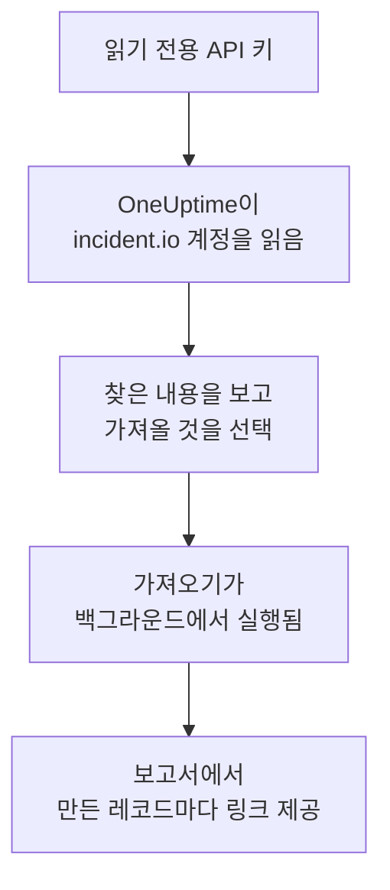

# incident.io에서 이전

**다른 도구에서 가져오기**를 사용하면 incident.io 설정을 몇 분 만에 OneUptime으로 옮겨 올 수 있습니다. 읽기 전용 incident.io API 키가 있으면 OneUptime이 사용자, 팀, 스케줄, 에스컬레이션 경로, 서비스, 인시던트 설정을 읽고, 찾은 내용을 보여 주며, 선택한 것을 만듭니다. incident.io에서는 아무것도 바뀌지 않습니다.

:::cards
- [계정 가져오기](#incidentio-계정-가져오기): 키를 만들고 계정을 읽은 뒤 가져올 것을 선택합니다.
- [가져오는 것](#가져오는-것): incident.io의 각 레코드가 OneUptime에서 무엇이 되는지 설명합니다.
- [전환 마무리하기](#전환-마무리하기): 가져오기가 끝난 뒤 할 일입니다.
:::

## 작동 방식

- **키는 한 번만 사용됩니다.** OneUptime이 계정을 읽는 동안 암호화되어 보관되고, 읽기가 끝나는 즉시 삭제됩니다. 성공 여부와는 관계없습니다. 다시 표시되거나 로그에 기록되는 일은 없습니다.
- **OneUptime은 읽기만 합니다.** incident.io 자체 API인 `api.incident.io`만 호출합니다. incident.io가 속도를 줄이라고 요청하면 기다렸다가 다시 시도합니다.
- **가져오기를 시작하기 전에는 아무것도 만들어지지 않습니다.** 미리 보기는 항목마다 새 항목인지, 이미 OneUptime에 있는지(그대로 사용됨), 이전 가져오기에서 가져왔는지, 또는 가져올 수 없는 이유가 무엇인지 보여 줍니다.
- **다시 실행해도 같은 것을 두 번 만들지 않습니다.** OneUptime은 각 가져오기가 가져온 것을 incident.io ID로 기억합니다. incident.io에 사람이나 스케줄을 추가한 뒤 다시 실행하면 새로운 것만 만들어집니다.

## 시작하기 전에

- **OneUptime 프로젝트와, 가져오는 것을 만들 권한.** 프로젝트 소유자와 관리자는 모든 것을 가져올 수 있습니다. 다른 역할도 가져오기를 실행할 수 있으며, 만들 수 있는 종류의 레코드를 가져옵니다. 나머지는 이유와 함께 가져오지 않음으로 표시됩니다.
- **데이터를 보기만 할 수 있는 incident.io API 키.** 가져오기는 incident.io에 아무것도 쓰지 않으므로, 키에 만들기, 편집, 관리 권한이 필요 없습니다.

## incident.io 계정 가져오기

:::steps
### incident.io에서 API 키 만들기
incident.io에서 **Settings** > **API keys**로 이동해 **Add new**를 선택합니다. 이름을 `OneUptime import`로 지정하고, 데이터를 보는 권한만 부여한 뒤(만들기, 편집, 관리 권한은 부여하지 않음) 키를 복사합니다.

### 가져오기 페이지 열기
OneUptime에서 **프로젝트 설정** > **다른 도구에서 가져오기**로 이동해 **incident.io**를 선택합니다.

### incident.io 연결하기
키를 **incident.io API 키**에 붙여 넣고 **내 incident.io 계정 읽기**를 선택합니다. 계정이 크면 몇 분 걸리며, 읽는 동안 페이지를 떠나도 됩니다.

### 가져올 것 선택하기
미리 보기에는 찾은 내용이 종류별 섹션으로 나뉘어 표시됩니다. 만들어질 항목은 처음부터 선택되어 있습니다. 단, 어떤 팀, 스케줄, 에스컬레이션 경로에도 없는 사람은 제외됩니다. 각 항목 아래에는 원래와 똑같이 가져오지 않는 부분이 표시됩니다. 선택한 항목이 선택하지 않은 것을 사용하면 그렇다고 알려 주고, **이것들도 선택**으로 함께 선택할 수 있습니다.

### 가져오기 시작하기
초대할 사람이 있으면 **새 사람을 초대할 팀**에서 합류할 팀을 고릅니다. 그런 다음 **가져오기 시작**을 선택합니다. 가져오기는 백그라운드에서 실행됩니다. 페이지를 떠나도 되며, 보고서는 그 페이지에서 기다립니다.
:::

보고서는 생성, 초대, 가져오지 않음의 개수를 보여 주고, 각 항목을 그 항목이 된 레코드로 가는 링크와 함께 나열합니다(실패한 항목이 먼저). 이전 가져오기는 같은 페이지의 **이전 가져오기**에 나열됩니다.

## 가져오는 것

| incident.io | OneUptime | 방식 |
| --- | --- | --- |
| 사용자 | 프로젝트 구성원 | 이메일 주소로 일치시킵니다. 아직 프로젝트에 없는 사람은 선택한 팀으로 초대됩니다. 비활성화된 사용자는 가져오지 않습니다. |
| 팀 | 팀 | 구성원과 함께 생성됩니다. 프로젝트에 이미 같은 이름의 팀이 있으면 그대로 사용하며 구성원도 바꾸지 않습니다. |
| 스케줄 | 온콜 스케줄 | 각 로테이션은 같은 사람, 같은 시작 시각, 같은 근무 길이, 같은 근무 시간을 가진 레이어가 되며, 스케줄의 시간대를 씁니다. 지금 적용 중인 로테이션 버전을 가져옵니다. |
| 에스컬레이션 경로 | 온콜 정책 | 각 레벨은 같은 대기 시간 후 같은 스케줄, 사용자, 팀을 호출하는 에스컬레이션 규칙이 됩니다. 반복은 정책의 반복이 되고, 분기에서는 첫 번째 경로를 가져옵니다. |
| 카탈로그 서비스 | 서비스 | 서비스 카테고리에 속한 카탈로그 유형의 항목으로, 서비스 카탈로그에 생성됩니다. 보관된 항목은 제외됩니다. |
| 심각도 | 인시던트 심각도 | incident.io의 순서대로, 가장 심각한 것부터 생성됩니다. 프로젝트에 이미 같은 이름의 심각도가 있으면 그대로 사용합니다. |
| 상태 | 인시던트 상태 | 분류(triage) 상태는 OneUptime이 인시던트를 시작하는 상태에, 종료 상태는 인시던트가 해결되는 상태에 대응합니다. 진행 중 및 일시 중지 상태는 확인됨과 해결됨 사이에 생성됩니다. |
| 인시던트 역할 | 인시던트 역할 | 리더 역할은 OneUptime의 인시던트 책임자에 대응하고, 나머지 역할은 생성됩니다. OneUptime은 각 인시던트를 선언한 사람을 기록하므로 보고자 역할은 필요 없습니다. |
| 사용자 정의 필드 | 인시던트 사용자 정의 필드 | 단일 선택 필드는 드롭다운, 다중 선택 필드는 다중 선택 드롭다운, 텍스트 및 링크 필드는 텍스트, 숫자 필드는 숫자가 되며, 옵션도 함께 가져옵니다. |

여러 사람이 동시에 온콜인 로테이션은 온콜인 사람마다 하나의 OneUptime 스케줄이 됩니다. OneUptime 스케줄은 한 번에 한 사람만 온콜이기 때문입니다. 그 스케줄을 호출하던 온콜 정책은 이 스케줄 모두를 호출합니다.

## 가져오지 않는 것

- **인시던트, 알림과 그 기록.** OneUptime은 지난 인시던트가 아니라 설정에서 시작합니다.
- **워크플로, 상태 페이지, 알림 라우트, 통합.** 대신 모니터와 알림 소스가 OneUptime을 향하도록 하세요. [전환 마무리하기](#전환-마무리하기)를 참고하세요.
- **옵션이 카탈로그에서 오는 사용자 정의 필드,** 그리고 OneUptime에 대응하는 상태가 없는 상태: declined, merged, canceled, learning.
- **스케줄 재정의와, 나중으로 예정된 로테이션 변경.** 미리 보기에 예정된 변경이 하나씩 표시되므로, 때가 되면 OneUptime에서 변경하세요.
- **OneUptime에 정확히 대응하는 것이 없는 에스컬레이션 단계.** Slack이나 Microsoft Teams 채널에 게시하는 단계는 OneUptime에서 워크스페이스 알림 규칙이 그 일을 하므로 제외되고, 다른 에스컬레이션 경로로 넘기는 단계도 마찬가지입니다. 다음 온콜 담당자를 호출하는 단계는 OneUptime에서 가장 가까운 것으로 가져오며, 미리 보기에 무엇이 바뀌는지 표시됩니다.

## 한도

가져오기 한 번에 최대 2,000개의 레코드를 만듭니다. 사람은 최대 500명, 팀 200개, 온콜 스케줄 200개, 온콜 정책 200개, 서비스 500개, 인시던트 사용자 정의 필드 100개, 인시던트 심각도, 상태, 역할은 각각 25개까지입니다. 한도를 넘는 것은 가져오지 않음으로 표시됩니다. 나머지를 가져오려면 가져오기를 다시 실행하세요.

OneUptime Cloud에서는 요금제에 포함되지 않는 레코드가 필요한 요금제와 함께 가져오지 않음으로 표시됩니다.

미리 보기는 하루 동안 보관됩니다. 계정을 읽은 사람만 항목을 선택하고 가져오기를 시작할 수 있습니다. 프로젝트 소유자와 관리자는 모든 가져오기의 진행 상황과 보고서를 볼 수 있습니다.

## 전환 마무리하기

:::steps
### 온콜 스케줄 확인하기
**온콜 듀티** > **온콜 스케줄**에서 각 스케줄을 열어 지금 온콜인 사람과 다음 사람을 확인합니다.

### 모두가 호출을 받을 수 있는지 확인하기
초대받은 사람은 초대를 수락한 뒤, 호출을 받을 전화번호, 이메일 주소 또는 모바일 앱을 추가합니다. **온콜 듀티** > **준비 상태**에서 아직 연락이 닿지 않는 사람을 볼 수 있습니다.

### 알림을 OneUptime으로 보내기
모니터와 알림을 보내는 도구가 OneUptime을 향하도록 하고, 테스트로 자신을 한 번 호출해 보세요.

### incident.io에서 호출 끄기
OneUptime이 올바른 사람을 호출하면 두 번 호출되지 않도록 incident.io에서 알림을 끄세요.
:::

## 문제 해결

:::details incident.io가 API 키를 받아들이지 않았습니다
키 전체를 복사했는지, **Settings** > **API keys**에서 키가 삭제되지 않았는지 확인하세요. 그런 다음 **다시 시도**를 선택합니다.
:::

:::details 미리 보기에 어떤 종류의 레코드가 없습니다
키로 읽을 수 없었으며, 미리 보기 맨 위에 그렇게 표시됩니다. 키에 그 종류의 데이터를 볼 권한을 부여하고 계정을 다시 읽으세요.
:::

:::details 일부 항목을 선택할 수 없습니다
항목마다 이유가 표시됩니다: 비활성화된 사용자, 프로젝트에 이미 있는 이름, 이전 가져오기에서 가져온 것, 또는 만들 권한이 없거나 요금제에 포함되지 않는 레코드입니다.
:::

## 다음 단계

:::cards
- [온콜 스케줄](/docs/on-call/schedules): 레이어, 제한, 인수인계.
- [인시던트 상태와 심각도](/docs/incidents/states-and-severities): 인시던트가 거치는 상태와 심각도.
- [Opsgenie에서 이전](/docs/moving-to-oneuptime/opsgenie): Opsgenie에서 팀을 옮겨 옵니다.
:::
