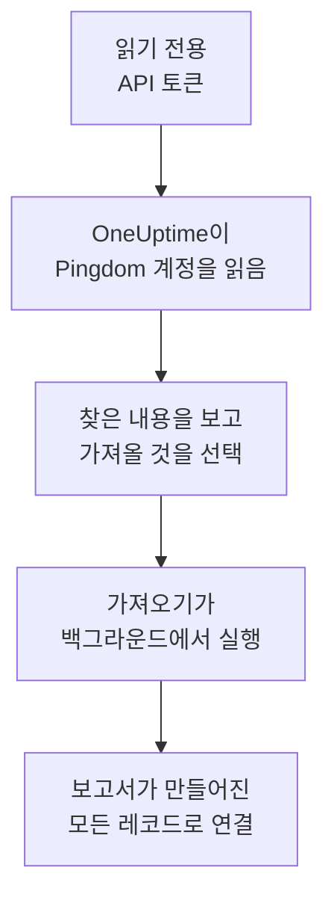

# Pingdom에서 이전

**다른 도구에서 가져오기**를 사용하면 Pingdom의 가동 검사를 몇 분 만에 OneUptime으로 옮겨 올 수 있습니다. 읽기 전용 Pingdom API 토큰이 있으면 OneUptime이 검사를 읽고, 찾은 내용을 보여 주며, 선택한 것을 만듭니다. Pingdom에서는 아무것도 바뀌지 않습니다.

:::cards
- [계정 가져오기](#pingdom-계정-가져오기): 토큰을 만들고 계정을 읽은 뒤 가져올 것을 선택합니다.
- [가져오는 것](#가져오는-것): Pingdom의 각 검사가 어떤 OneUptime 모니터가 되는지 설명합니다.
- [전환 마무리하기](#전환-마무리하기): 가져오기가 끝난 뒤 할 일입니다.
:::

## 작동 방식

- **키는 한 번만 사용됩니다.** OneUptime이 계정을 읽는 동안 암호화되어 보관되고, 읽기가 끝나는 즉시 삭제됩니다. 성공 여부와는 관계없습니다. 다시 표시되거나 로그에 기록되는 일은 없습니다.
- **OneUptime은 읽기만 합니다.** Pingdom 자체 API만 호출합니다: `api.pingdom.com`. Pingdom은 모든 요청을 토큰의 할당량에서 차감하므로, OneUptime은 설정이 있는 검사만 한 번에 하나씩 설정을 읽습니다. Pingdom이(가) 속도를 줄이라고 요청하면 기다렸다가 다시 시도합니다.
- **가져오기를 시작하기 전에는 아무것도 만들어지지 않습니다.** 미리 보기는 항목마다 새 항목인지, 이미 OneUptime에 있는지(그대로 사용됨), 이전 가져오기에서 가져왔는지, 또는 가져올 수 없는 이유가 무엇인지 보여 줍니다.
- **다시 실행해도 같은 것을 두 번 만들지 않습니다.** OneUptime은 각 가져오기가 가져온 것을 Pingdom ID로 기억합니다. Pingdom에 검사을(를) 추가한 뒤 다시 실행하면 새로운 것만 만들어집니다.

## 시작하기 전에

- **OneUptime 프로젝트와, 가져오는 것을 만들 권한.** 프로젝트 소유자와 관리자는 모든 것을 가져올 수 있습니다. 다른 역할도 가져오기를 실행할 수 있으며, 만들 수 있는 종류의 레코드를 가져옵니다. 나머지는 이유와 함께 가져오지 않음으로 표시됩니다.
- **Read access가 있는 Pingdom API 토큰.** 가져오기는 Pingdom에 아무것도 쓰지 않습니다.
- **결제 수단(OneUptime Cloud).** 검사를 실행하는 모니터는 Free 요금제에서도 사용량에 따라 요금이 부과되므로, 가져오기 전에 **프로젝트 설정** > **결제**에서 결제 수단을 추가하세요. 결제 수단이 없으면 그런 모니터는 가져오지 않음으로 표시됩니다.

## Pingdom 계정 가져오기

:::steps
### Pingdom에서 API 토큰 만들기
My Pingdom에서 **Settings** > **Pingdom API**를 열고 **Add API token**을 선택하세요. 이름을 `OneUptime import`로 지정하고 **Read access**를 선택한 뒤 토큰을 복사하세요.

### 가져오기 페이지 열기
OneUptime에서 **프로젝트 설정** > **다른 도구에서 가져오기**로 이동해 **Pingdom**을(를) 선택합니다.

### Pingdom 연결하기
토큰을(를) **Pingdom API 키**에 붙여 넣고 **내 Pingdom 계정 읽기**를 선택합니다. 큰 계정은 몇 분이 걸리며, 읽는 동안 페이지를 떠나도 됩니다.

### 가져올 것 선택하기
미리 보기에는 찾은 내용이 종류별 섹션으로 나뉘어 표시됩니다. 만들어질 항목은 처음부터 선택되어 있습니다. 단, Pingdom에서 일시 중지된 검사는 제외되며, 선택하면 일시 중지된 상태로 가져옵니다. 각 항목 아래에는 원래와 똑같이 가져오지 않는 부분이 표시됩니다.

### 가져오기 시작하기
**가져오기 시작**을 선택합니다. 가져오기는 백그라운드에서 실행됩니다. 페이지를 떠나도 되며, 보고서는 그 페이지에서 기다립니다.
:::

보고서는 생성과 가져오지 않음의 개수를 보여 주고, 각 항목을 그 항목이 된 레코드로 가는 링크와 함께 나열합니다(실패한 항목이 먼저). 이전 가져오기는 같은 페이지의 **이전 가져오기**에 나열됩니다.

## 가져오는 것

| Pingdom에서 | OneUptime에서 | 방식 |
| --- | --- | --- |
| Uptime checks | 모니터 | 각 검사는 같은 주소, 간격, 그리고 페이지에 있어야 하는(또는 없어야 하는) 텍스트를 가진 같은 종류의 모니터가 됩니다. |

- **HTTP 검사**는 웹사이트 모니터가 되고, 데이터나 헤더를 보내면 API 모니터가 됩니다.
- **ping과 TCP 검사**는 ping과 포트 모니터가 됩니다. **SMTP, POP3, IMAP 검사**는 해당 포트의 포트 모니터가 됩니다. OneUptime은 포트가 응답하는지만 검사하며, 메일 통신은 검사하지 않습니다.
- **DNS 검사**는 같은 네임 서버에 질의하는 DNS 모니터가 됩니다.
- **인증서 검사.** 만료가 가까운 인증서를 장애로 보는 HTTP 검사에는 같은 날수만큼 미리 경고하는 SSL 인증서 모니터도 그 이름으로 만들어집니다.

모든 모니터는 직접 만든 모니터처럼 프로젝트의 프로브에서 검사합니다. OneUptime에 없는 간격은 가장 가까운 간격이 되고, 1분이 넘는 타임아웃은 1분이 됩니다. 둘 중 하나가 바뀌면 미리 보기에 표시됩니다.

## 가져오지 않는 것

- **가동 이력, 응답 시간, 인시던트.** OneUptime은 가져오기가 끝난 시점부터 검사를 시작합니다.
- **알림 연락처와 연동.** [전환 마무리하기](#전환-마무리하기)에 설명된 대로 OneUptime에서 알릴 대상을 정하세요.
- **비밀번호와, 비밀 값이 있을 수 있는 헤더.** 로그인하는 모니터나 `Authorization`, 쿠키, 토큰 헤더를 보내는 모니터는 그것을 빼고 가져옵니다. [모니터 시크릿](/docs/monitor/monitor-secrets)으로 추가하세요.
- **UDP, 사용자 지정 HTTP, 트랜잭션 검사.** 같은 일을 하는 OneUptime 모니터가 없으며, 미리 보기에 각각 표시됩니다. [합성 모니터](/docs/monitor/synthetic-monitor)는 트랜잭션 검사처럼 페이지를 따라갈 수 있습니다.
- **DNS 검사가 기대하는 주소.** OneUptime에서 기준으로 추가하세요.
- **유지 관리 기간.** 미리 보기에 개수가 표시됩니다. OneUptime에서 예정된 유지 관리로 계획하세요.

## 한도

가져오기 한 번에 최대 2,000개의 레코드를 만듭니다. 모니터는 최대 1,000개까지입니다. 한도를 넘는 것은 가져오지 않음으로 표시됩니다. 나머지를 가져오려면 가져오기를 다시 실행하세요.

OneUptime Cloud에서는 검사를 실행하는 모니터에 결제 수단이 필요하며, 요금제에 여유가 없는 것은 필요한 것과 함께 가져오지 않음으로 표시됩니다.

미리 보기는 하루 동안 보관됩니다. 계정을(를) 읽은 사람만 항목을 선택하고 가져오기를 시작할 수 있습니다. 프로젝트 소유자와 관리자는 모든 가져오기의 진행 상황과 보고서를 볼 수 있습니다.

## 전환 마무리하기

:::steps
### 모니터 확인
**모니터**에서 각 모니터를 열어 첫 결과를 확인하세요. 하트비트 모니터는 새 주소를 가지므로, 이를 호출하는 작업이 그 주소를 가리키게 하세요.

### 알릴 대상 정하기
모니터에 소유자를 추가하거나 모니터가 여는 인시던트에 **온콜 듀티** > **온콜 정책**의 온콜 정책을 지정해, 문제가 생겼을 때 알맞은 사람이 알 수 있게 하세요.

### Pingdom에서 검사 끄기
OneUptime이 같은 대상을 검사하게 되면 두 번 알림을 받지 않도록 Pingdom에서 검사를 일시 중지하세요.
:::

## 문제 해결

:::details Pingdom이(가) API 키를 받아들이지 않았습니다
토큰 전체를 복사했는지, 그리고 **Pingdom API**에서 **Read access**로 만든 API 3.1 토큰인지 확인하세요. 그런 다음 **다시 시도**를 선택하세요.
:::

:::details 모니터가 가져오지 않음으로 표시됩니다
이유가 표시됩니다: OneUptime에 없는 종류의 모니터, OneUptime이 읽을 수 없는 주소, 또는 그 모니터를 위한 여유나 결제 수단이 없는 프로젝트입니다. 이름, 유형, 주소가 같은 모니터를 OneUptime이 이미 실행하고 있으면 그 모니터를 그대로 사용합니다.
:::

:::details 일부 항목을 선택할 수 없습니다
항목마다 이유가 표시됩니다: 프로젝트에 이미 있는 이름, 이전 가져오기에서 가져온 것, 또는 만들 권한이 없거나 요금제에 포함되지 않는 레코드입니다.
:::

## 다음 단계

:::cards
- [웹사이트 모니터](/docs/monitor/website-monitor): 웹사이트 모니터가 무엇을 어떻게 검사하는지.
- [포트 모니터](/docs/monitor/port-monitor): 포트 모니터가 무엇을 어떻게 검사하는지.
- [StatusCake에서 이전](/docs/moving-to-oneuptime/statuscake): StatusCake에서 검사를 옮겨 옵니다.
:::
