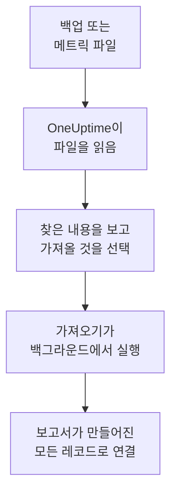

# Uptime Kuma에서 이전

Uptime Kuma는 직접 운영하는 서버에서 실행되므로, **다른 도구에서 가져오기**는 키 대신 파일에서 읽습니다. Uptime Kuma 1이 내보내는 백업이나, 모든 버전이 제공하는 메트릭 페이지입니다. OneUptime이 그 파일에서 모니터를 읽고, 찾은 내용을 보여 주며, 선택한 것을 만듭니다. Uptime Kuma에서는 아무것도 바뀌지 않습니다.

:::cards
- [모니터 가져오기](#uptime-kuma-모니터-가져오기): 파일을 저장하고 읽은 뒤 가져올 것을 선택합니다.
- [가져오는 것](#가져오는-것): Uptime Kuma의 각 모니터가 OneUptime에서 무엇이 되는지 설명합니다.
- [전환 마무리하기](#전환-마무리하기): 가져오기가 끝난 뒤 할 일입니다.
:::

## 작동 방식

- **파일은 한 번만 읽습니다.** OneUptime은 업로드하는 동안 파일을 읽어 모니터를 찾으며, 파일을 저장하지 않습니다. 파일 안의 비밀번호, 토큰, 푸시 키는 복사되지 않습니다.
- **OneUptime은 Uptime Kuma에 연결하지 않습니다.** 모든 것을 파일에서 가져옵니다. Uptime Kuma 백업도 메트릭 페이지도 아닌 파일은 이유와 함께 거부됩니다.
- **가져오기를 시작하기 전에는 아무것도 만들어지지 않습니다.** 미리 보기는 항목마다 새 항목인지, 이미 OneUptime에 있는지(그대로 사용됨), 이전 가져오기에서 가져왔는지, 또는 가져올 수 없는 이유가 무엇인지 보여 줍니다.
- **다시 실행해도 같은 것을 두 번 만들지 않습니다.** OneUptime은 각 가져오기가 가져온 것을 Uptime Kuma ID로 기억합니다. 모니터를 추가한 뒤 새 파일을 읽으면 새로운 것만 만들어집니다.

## 시작하기 전에

- **OneUptime 프로젝트와, 가져오는 것을 만들 권한.** 프로젝트 소유자와 관리자는 모든 것을 가져올 수 있습니다. 다른 역할도 가져오기를 실행할 수 있으며, 만들 수 있는 종류의 레코드를 가져옵니다. 나머지는 이유와 함께 가져오지 않음으로 표시됩니다.
- **Uptime Kuma 파일.** Uptime Kuma 1의 JSON 백업에는 각 모니터와 그 설정이 들어 있습니다. Uptime Kuma 2에는 백업이 없으므로 대신 메트릭 페이지를 저장하세요. 각 모니터의 이름, 유형, 주소는 있지만 검사 주기나 검사 내용은 없습니다.
- **결제 수단(OneUptime Cloud).** 검사를 실행하는 모니터는 Free 요금제에서도 사용량에 따라 요금이 부과되므로, 가져오기 전에 **프로젝트 설정** > **결제**에서 결제 수단을 추가하세요. 결제 수단이 없으면 그런 모니터는 가져오지 않음으로 표시됩니다.

## Uptime Kuma 모니터 가져오기

:::steps
### Uptime Kuma에서 파일 저장하기
Uptime Kuma 1에서는 **Settings** > **Backup**으로 이동해 **Export**를 선택하세요. Uptime Kuma 2에서는 **Settings** > **API Keys**에서 키를 추가하고, Uptime Kuma의 `/metrics`를 열어 사용자 이름 없이 키를 비밀번호로 사용해 로그인한 뒤 페이지를 텍스트 파일로 저장하세요.

### 가져오기 페이지 열기
OneUptime에서 **프로젝트 설정** > **다른 도구에서 가져오기**로 이동해 **Uptime Kuma**을(를) 선택합니다.

### 파일 읽기
**Uptime Kuma 백업 또는 메트릭 파일**에서 **파일 선택**을 선택하고 저장한 파일을 고른 뒤 **파일 읽기**를 선택하세요. OneUptime이 바로 읽고 찾은 내용을 보여 줍니다.

### 가져올 것 선택하기
미리 보기에는 찾은 내용이 종류별 섹션으로 나뉘어 표시됩니다. 만들어질 항목은 처음부터 선택되어 있습니다. 단, Uptime Kuma에서 일시 중지된 모니터는 제외되며, 선택하면 일시 중지된 상태로 가져옵니다. 각 항목 아래에는 원래와 똑같이 가져오지 않는 부분이 표시됩니다.

### 가져오기 시작하기
**가져오기 시작**을 선택합니다. 가져오기는 백그라운드에서 실행됩니다. 페이지를 떠나도 되며, 보고서는 그 페이지에서 기다립니다.
:::

보고서는 생성과 가져오지 않음의 개수를 보여 주고, 각 항목을 그 항목이 된 레코드로 가는 링크와 함께 나열합니다(실패한 항목이 먼저). 이전 가져오기는 같은 페이지의 **이전 가져오기**에 나열됩니다.

## 가져오는 것

| Uptime Kuma에서 | OneUptime에서 | 방식 |
| --- | --- | --- |
| Monitors | 모니터 | 백업에서는 각 모니터가 같은 주소, 간격, 타임아웃과 정상으로 보는 상태 코드를 가진 같은 종류의 모니터가 됩니다. 메트릭 페이지에서는 각 모니터를 5분마다 검사하도록 가져오므로, 가져온 뒤 하나씩 확인하세요. |

- **HTTP(S)와 키워드 모니터**는 웹사이트 모니터가 되고, 다른 메서드, 헤더 또는 JSON 본문을 보내면 API 모니터가 되며, 키워드도 그대로 설정됩니다.
- **JSON 쿼리 모니터**는 쿼리 없이 API 모니터가 됩니다. OneUptime에서 기준으로 추가하세요.
- **ping, 포트, DNS 모니터**는 ping, 포트, DNS 모니터가 됩니다.
- **푸시 모니터**는 수신 요청 모니터가 되며, 간격과 재시도 동안 요청이 오지 않으면 장애가 됩니다. OneUptime에서는 각각 새 주소를 받습니다.
- **수동 모니터**는 수동 모니터로 남습니다. **그룹**은 폴더이므로 그 안의 모니터가 각각 가져와집니다.
- **인증서 만료.** 인증서가 만료되기 전에 경고하는 모니터에는 SSL 인증서 모니터도 그 이름으로 만들어집니다.

모든 모니터는 직접 만든 모니터처럼 프로젝트의 프로브에서 검사합니다. OneUptime에 없는 간격은 가장 가까운 간격이 되고, 1분이 넘는 타임아웃은 1분이 됩니다. 둘 중 하나가 바뀌면 미리 보기에 표시됩니다.

## 가져오지 않는 것

- **가동 이력, 응답 시간, 인시던트.** OneUptime은 가져오기가 끝난 시점부터 검사를 시작합니다.
- **알림.** [전환 마무리하기](#전환-마무리하기)에 설명된 대로 OneUptime에서 알릴 대상을 정하세요.
- **비밀번호와, 비밀 값이 있을 수 있는 헤더.** 로그인하는 모니터나 `Authorization`, 쿠키, 토큰 헤더를 보내는 모니터는 그것을 빼고 가져옵니다. [모니터 시크릿](/docs/monitor/monitor-secrets)으로 추가하세요.
- **반전(upside down) 모니터.** 검사가 실패할 때 정상으로 보는 모니터이며, 이렇게 동작하는 OneUptime 모니터는 없습니다.
- **Docker, 데이터베이스, 게임 서버, MQTT 등 OneUptime에 대응하는 것이 없는 모니터.** 미리 보기에 각각 표시됩니다.
- **상태 페이지와 유지 관리.** 필요한 상태 페이지를 OneUptime에서 만들고 가져온 모니터를 표시하세요.

## 한도

가져오기 한 번에 최대 2,000개의 레코드를 만듭니다. 모니터는 최대 1,000개까지입니다. 파일은 최대 10MB까지입니다. 한도를 넘는 것은 가져오지 않음으로 표시됩니다. 나머지를 가져오려면 가져오기를 다시 실행하세요.

OneUptime Cloud에서는 검사를 실행하는 모니터에 결제 수단이 필요하며, 요금제에 여유가 없는 것은 필요한 것과 함께 가져오지 않음으로 표시됩니다.

미리 보기는 하루 동안 보관됩니다. 파일을(를) 읽은 사람만 항목을 선택하고 가져오기를 시작할 수 있습니다. 프로젝트 소유자와 관리자는 모든 가져오기의 진행 상황과 보고서를 볼 수 있습니다.

## 전환 마무리하기

:::steps
### 모니터 확인
**모니터**에서 각 모니터를 열어 첫 결과를 확인하세요. 하트비트 모니터는 새 주소를 가지므로, 이를 호출하는 작업이 그 주소를 가리키게 하세요.

### 알릴 대상 정하기
모니터에 소유자를 추가하거나 모니터가 여는 인시던트에 **온콜 듀티** > **온콜 정책**의 온콜 정책을 지정해, 문제가 생겼을 때 알맞은 사람이 알 수 있게 하세요.

### Uptime Kuma에서 검사 끄기
OneUptime이 같은 대상을 검사하게 되면 두 번 알림을 받지 않도록 Uptime Kuma에서 검사를 일시 중지하세요.
:::

## 문제 해결

:::details 파일이 거부되었습니다
OneUptime이 이유를 보여 줍니다: 10MB를 넘는 파일, 올바른 JSON이 아닌 파일, 또는 Uptime Kuma 백업도 메트릭 페이지도 아닌 파일입니다. 백업을 다시 내보내거나 `/metrics`를 일반 텍스트로 다시 저장한 뒤 다시 선택하세요.
:::

:::details 모니터가 가져오지 않음으로 표시됩니다
이유가 표시됩니다: OneUptime에 없는 종류의 모니터, OneUptime이 읽을 수 없는 주소, 또는 그 모니터를 위한 여유나 결제 수단이 없는 프로젝트입니다. 이름, 유형, 주소가 같은 모니터를 OneUptime이 이미 실행하고 있으면 그 모니터를 그대로 사용합니다.
:::

:::details 일부 항목을 선택할 수 없습니다
항목마다 이유가 표시됩니다: 프로젝트에 이미 있는 이름, 이전 가져오기에서 가져온 것, 또는 만들 권한이 없거나 요금제에 포함되지 않는 레코드입니다.
:::

## 다음 단계

:::cards
- [웹사이트 모니터](/docs/monitor/website-monitor): 웹사이트 모니터가 무엇을 어떻게 검사하는지.
- [수신 요청 모니터](/docs/monitor/incoming-request-monitor): OneUptime에서 하트비트가 작동하는 방식.
- [UptimeRobot에서 이전](/docs/moving-to-oneuptime/uptimerobot): UptimeRobot에서 검사를 옮겨 옵니다.
:::
