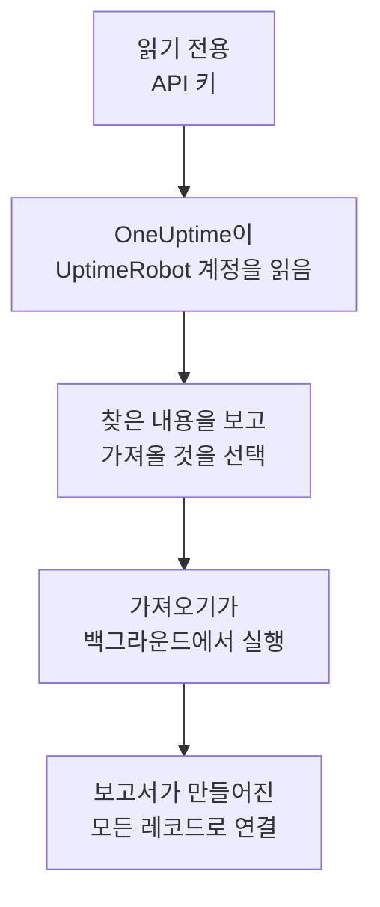

# UptimeRobot에서 이전

**다른 도구에서 가져오기**를 사용하면 UptimeRobot의 모니터와 상태 페이지를 몇 분 만에 OneUptime으로 옮겨 올 수 있습니다. 읽기 전용 UptimeRobot API 키가 있으면 OneUptime이 모니터와 공개 상태 페이지를 읽고, 찾은 내용을 보여 주며, 선택한 것을 만듭니다. UptimeRobot에서는 아무것도 바뀌지 않습니다.

:::cards
- [계정 가져오기](#uptimerobot-계정-가져오기): 키를 만들고 계정을 읽은 뒤 가져올 것을 선택합니다.
- [가져오는 것](#가져오는-것): UptimeRobot의 각 모니터와 상태 페이지가 OneUptime에서 무엇이 되는지 설명합니다.
- [전환 마무리하기](#전환-마무리하기): 가져오기가 끝난 뒤 할 일입니다.
:::

## 작동 방식

- **키는 한 번만 사용됩니다.** OneUptime이 계정을 읽는 동안 암호화되어 보관되고, 읽기가 끝나는 즉시 삭제됩니다. 성공 여부와는 관계없습니다. 다시 표시되거나 로그에 기록되는 일은 없습니다.
- **OneUptime은 읽기만 합니다.** UptimeRobot 자체 API만 호출합니다: `api.uptimerobot.com`. 요청은 6초에 한 번이며, UptimeRobot이 Free 계정에 허용하는 분당 10회 안에 머뭅니다. 그래서 큰 계정은 몇 분이 걸립니다. UptimeRobot이(가) 속도를 줄이라고 요청하면 기다렸다가 다시 시도합니다.
- **가져오기를 시작하기 전에는 아무것도 만들어지지 않습니다.** 미리 보기는 항목마다 새 항목인지, 이미 OneUptime에 있는지(그대로 사용됨), 이전 가져오기에서 가져왔는지, 또는 가져올 수 없는 이유가 무엇인지 보여 줍니다.
- **다시 실행해도 같은 것을 두 번 만들지 않습니다.** OneUptime은 각 가져오기가 가져온 것을 UptimeRobot ID로 기억합니다. UptimeRobot에 모니터을(를) 추가한 뒤 다시 실행하면 새로운 것만 만들어집니다.

## 시작하기 전에

- **OneUptime 프로젝트와, 가져오는 것을 만들 권한.** 프로젝트 소유자와 관리자는 모든 것을 가져올 수 있습니다. 다른 역할도 가져오기를 실행할 수 있으며, 만들 수 있는 종류의 레코드를 가져옵니다. 나머지는 이유와 함께 가져오지 않음으로 표시됩니다.
- **UptimeRobot API 키.** Read-only API key면 충분합니다. 가져오기는 UptimeRobot에 아무것도 쓰지 않습니다. Main API key도 되지만, 모니터 전용 키는 그 모니터만 읽습니다.
- **결제 수단(OneUptime Cloud).** 검사를 실행하는 모니터는 Free 요금제에서도 사용량에 따라 요금이 부과되므로, 가져오기 전에 **프로젝트 설정** > **결제**에서 결제 수단을 추가하세요. 결제 수단이 없으면 그런 모니터는 가져오지 않음으로 표시됩니다.

## UptimeRobot 계정 가져오기

:::steps
### UptimeRobot에서 API 키 만들기
UptimeRobot에서 **Integrations & API** > **API**로 이동합니다. **Read-only API key**를 만들거나 이미 있는 키를 복사하세요.

### 가져오기 페이지 열기
OneUptime에서 **프로젝트 설정** > **다른 도구에서 가져오기**로 이동해 **UptimeRobot**을(를) 선택합니다.

### UptimeRobot 연결하기
키을(를) **UptimeRobot API 키**에 붙여 넣고 **내 UptimeRobot 계정 읽기**를 선택합니다. 큰 계정은 몇 분이 걸리며, 읽는 동안 페이지를 떠나도 됩니다.

### 가져올 것 선택하기
미리 보기에는 찾은 내용이 종류별 섹션으로 나뉘어 표시됩니다. 만들어질 항목은 처음부터 선택되어 있습니다. 단, UptimeRobot에서 일시 중지된 모니터는 제외되며, 선택하면 일시 중지된 상태로 가져옵니다. 각 항목 아래에는 원래와 똑같이 가져오지 않는 부분이 표시됩니다. 선택한 상태 페이지가 선택하지 않은 모니터를 보여 주면 그렇다고 알려 주고, **이것들도 선택**으로 함께 선택할 수 있습니다.

### 가져오기 시작하기
**가져오기 시작**을 선택합니다. 가져오기는 백그라운드에서 실행됩니다. 페이지를 떠나도 되며, 보고서는 그 페이지에서 기다립니다.
:::

보고서는 생성과 가져오지 않음의 개수를 보여 주고, 각 항목을 그 항목이 된 레코드로 가는 링크와 함께 나열합니다(실패한 항목이 먼저). 이전 가져오기는 같은 페이지의 **이전 가져오기**에 나열됩니다.

## 가져오는 것

| UptimeRobot에서 | OneUptime에서 | 방식 |
| --- | --- | --- |
| Monitors | 모니터 | 각 모니터는 같은 주소, 간격, 타임아웃과 정상으로 보는 같은 상태 코드를 가진 같은 종류의 모니터가 됩니다. |
| Public status pages | 상태 페이지 | 각 페이지는 같은 모니터를 보여 줍니다. 페이지가 지정한 모니터, 페이지의 태그가 붙은 모니터, 또는 모든 모니터이며, 가동률과 기록 막대도 그대로입니다. 비밀번호가 있는 페이지는 비공개로 가져옵니다. |

- **HTTP(S)와 키워드 모니터**는 웹사이트 모니터가 되고, 다른 메서드, 헤더 또는 JSON 본문을 보내면 API 모니터가 됩니다. 키워드 모니터는 UptimeRobot에서처럼 키워드가 나타나거나 없을 때 장애가 되며, 대소문자를 포함해 정확히 일치시킵니다.
- **ping과 포트 모니터**는 ping과 포트 모니터가 됩니다.
- **하트비트 모니터**는 수신 요청 모니터가 되며, 간격과 유예 기간 동안 요청이 오지 않으면 장애가 됩니다. OneUptime에서는 각각 새 주소를 받습니다.
- **DNS와 API 모니터**는 DNS와 API 모니터가 됩니다.
- **SSL 만료 알림.** 인증서가 만료되기 전에 경고하는 모니터에는 같은 날수만큼 미리 경고하는 SSL 인증서 모니터도 그 이름으로 만들어집니다.

모든 모니터는 직접 만든 모니터처럼 프로젝트의 프로브에서 검사합니다. OneUptime에 없는 간격은 가장 가까운 간격이 되고, 1분이 넘는 타임아웃은 1분이 됩니다. 둘 중 하나가 바뀌면 미리 보기에 표시됩니다.

## 가져오지 않는 것

- **가동 이력, 응답 시간, 인시던트.** OneUptime은 가져오기가 끝난 시점부터 검사를 시작합니다.
- **알림 연락처와 연동.** [전환 마무리하기](#전환-마무리하기)에 설명된 대로 OneUptime에서 알릴 대상을 정하세요.
- **비밀번호와, 비밀 값이 있을 수 있는 헤더.** 로그인하는 모니터나 `Authorization`, 쿠키, 토큰 헤더를 보내는 모니터는 그것을 빼고 가져옵니다. [모니터 시크릿](/docs/monitor/monitor-secrets)으로 추가하세요.
- **UDP, 시각적 비교, 종속성 모니터.** 같은 일을 하는 OneUptime 모니터가 없으며, 미리 보기에 각각 표시됩니다.
- **포트가 열려 있는 동안 알림을 보내는 포트 모니터.** OneUptime 포트 모니터와 반대로 동작합니다.
- **DNS 모니터가 기대하는 응답과 API 모니터의 검증 조건.** OneUptime에서 기준으로 추가하세요.
- **유지 관리 기간.** 미리 보기에 개수가 표시됩니다. OneUptime에서 예정된 유지 관리로 계획하세요.
- **상태 페이지의 자체 도메인과 브랜딩.** OneUptime에서 도메인은 **사용자 정의 도메인**에, 로고는 **브랜딩**에 추가하세요.

## 한도

가져오기 한 번에 최대 2,000개의 레코드를 만듭니다. 모니터는 최대 1,000개, 상태 페이지는 50개까지입니다. 한도를 넘는 것은 가져오지 않음으로 표시됩니다. 나머지를 가져오려면 가져오기를 다시 실행하세요.

OneUptime Cloud에서는 검사를 실행하는 모니터에 결제 수단이 필요하며, 요금제에 여유가 없는 것은 필요한 것과 함께 가져오지 않음으로 표시됩니다.

미리 보기는 하루 동안 보관됩니다. 계정을(를) 읽은 사람만 항목을 선택하고 가져오기를 시작할 수 있습니다. 프로젝트 소유자와 관리자는 모든 가져오기의 진행 상황과 보고서를 볼 수 있습니다.

## 전환 마무리하기

:::steps
### 모니터 확인
**모니터**에서 각 모니터를 열어 첫 결과를 확인하세요. 하트비트 모니터는 새 주소를 가지므로, 이를 호출하는 작업이 그 주소를 가리키게 하세요.

### 알릴 대상 정하기
모니터에 소유자를 추가하거나 모니터가 여는 인시던트에 **온콜 듀티** > **온콜 정책**의 온콜 정책을 지정해, 문제가 생겼을 때 알맞은 사람이 알 수 있게 하세요.

### 상태 페이지 주소를 OneUptime으로 연결
**상태 페이지**에서 페이지를 열고 **사용자 정의 도메인**에 도메인을 추가한 뒤 DNS 레코드를 바꾸세요. 그러면 방문자와 구독자가 새 페이지로 오게 됩니다.

### UptimeRobot에서 검사 끄기
OneUptime이 같은 대상을 검사하게 되면 두 번 알림을 받지 않도록 UptimeRobot에서 검사를 일시 중지하세요.
:::

## 문제 해결

:::details UptimeRobot이(가) API 키를 받아들이지 않았습니다
키 전체를 복사했는지, 그리고 모니터 전용 키가 아니라 **Integrations & API**에 있는 계정의 Read-only 또는 Main API key인지 확인하세요. 그런 다음 **다시 시도**를 선택하세요.
:::

:::details 모니터가 가져오지 않음으로 표시됩니다
이유가 표시됩니다: OneUptime에 없는 종류의 모니터, OneUptime이 읽을 수 없는 주소, 또는 그 모니터를 위한 여유나 결제 수단이 없는 프로젝트입니다. 이름, 유형, 주소가 같은 모니터를 OneUptime이 이미 실행하고 있으면 그 모니터를 그대로 사용합니다.
:::

:::details 일부 항목을 선택할 수 없습니다
항목마다 이유가 표시됩니다: 프로젝트에 이미 있는 이름, 이전 가져오기에서 가져온 것, 또는 만들 권한이 없거나 요금제에 포함되지 않는 레코드입니다.
:::

## 다음 단계

:::cards
- [웹사이트 모니터](/docs/monitor/website-monitor): 웹사이트 모니터가 무엇을 어떻게 검사하는지.
- [수신 요청 모니터](/docs/monitor/incoming-request-monitor): OneUptime에서 하트비트가 작동하는 방식.
- [Pingdom에서 이전](/docs/moving-to-oneuptime/pingdom): Pingdom에서 검사를 옮겨 옵니다.
:::
