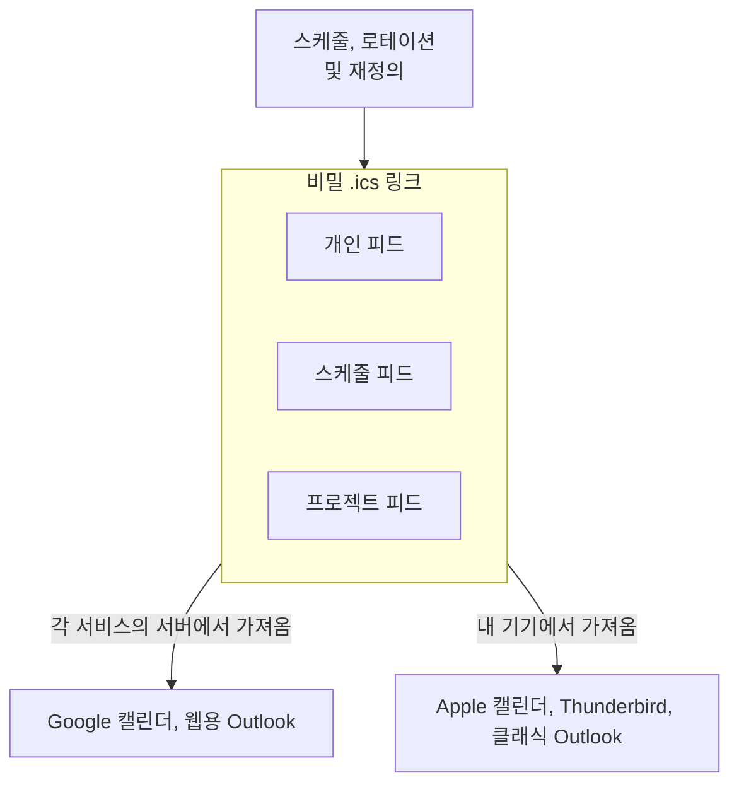

# 캘린더 피드

캘린더 피드는 온콜 근무를 평소에 보는 캘린더에 넣어 줍니다. OneUptime은 각 사람, 각 스케줄, 각 프로젝트마다 비밀 iCalendar(`.ics`) 링크를 게시합니다. Google 캘린더, Outlook, Apple 캘린더, Thunderbird를 비롯해 URL로 캘린더를 구독할 수 있는 앱이라면 어떤 앱이든 이 링크를 주기적으로 가져와 근무마다 일정 하나를 표시합니다. 설치할 것도, 연결할 계정도 없습니다. 링크가 곧 연동의 전부입니다.



> [!NOTE]
> 구독한 캘린더는 **계획** 용입니다. 캘린더 앱은 각자의 일정에 따라 피드를 다시 가져옵니다. Google 캘린더는 8~24시간마다 한 번만 가져옵니다. 그래서 근무 1시간 전에 이루어진 교대는 캘린더가 아니라 OneUptime의 자체 알림, 재배정 알림, 호출을 통해 전달됩니다.

## 받게 되는 것

- 근무마다 일정 하나. 개인 피드에서는 제목이 `On-call · <Schedule>` (스케줄이 정확히 하나의 에스컬레이션 정책에 연결되어 있으면 ` · <Policy>` 가 붙음)이고, 공유 피드에서는 `<Name> · On-call · <Schedule>` 입니다. 설명에는 온콜 담당자, 스케줄과 그 시간대, 레이어, 스케줄 시간대와 UTC와 내 시간대로 나타낸 근무 시간, 이 스케줄을 통해 나를 호출하는 에스컬레이션 정책, 대시보드의 스케줄 링크가 담깁니다.
- 재정의가 반영됩니다. 누군가 나를 대신하면 일정은 그 사람에게 넘어가고( `(covering for <Name>)` 가 붙음) 캘린더 앱에서는 같은 일정으로 남으므로, 중복되지 않고 그 자리에서 업데이트됩니다. 일부만 재정의하면 근무가 맞닿은 여러 일정으로 나뉩니다.
- 기본값은 과거 2일과 앞으로 90일입니다. 과거 60일, 앞으로 180일까지 넓힐 수 있습니다. 일정이 5,000개를 넘는 피드는 짧아지며, 캘린더 설명에 그렇게 표시됩니다.
- 일정은 한가함( `TRANSP:TRANSPARENT` )으로 표시되므로 구독한 피드가 내 일정을 막지 않습니다. 또한 비공개로 표시되지 않으므로, 공유 팀 캘린더에서는 볼 수 있는 모든 사람에게 제목이 보입니다.
- 시간은 UTC로 보내지고 캘린더 앱이 변환합니다. 설명에는 스케줄 시간대와 내 시간대의 현지 시각이 적힙니다. 내 시간대는 **프로필** (대시보드 오른쪽 위의 내 사진)의 **시간대** 에서, 스케줄의 시간대는 해당 **레이어** 페이지의 **Schedule timezone** 카드에서 설정합니다. 시간대가 없는 스케줄은 호출과 마찬가지로 서버의 시간대로 계산되며, 일정에 그렇게 표시됩니다.

고정 배정(에스컬레이션 정책 규칙에 직접 지정한 사용자나 팀)은 시작과 끝이 없으므로 어떤 피드에도 나타나지 않습니다. OneUptime Cloud에서 피드는 온콜 스케줄과 같은 요금제(Growth)를 따르며, 그보다 낮은 요금제의 프로젝트는 오류 대신 빈 캘린더를 받습니다.

## 세 가지 링크

| 링크 | 만드는 사람 | 담기는 내용 | 위치 |
| --- | --- | --- | --- |
| **개인 피드** | 각 사용자, 프로젝트마다 하나 | 그 프로젝트의 모든 스케줄에서 내 근무, 그리고 내가 누군가를 대신하는 근무(선택) | **사용자 설정** > **캘린더** > **캘린더 피드** |
| **스케줄 피드** | 스케줄을 편집할 수 있는 사람. 읽을 수 있는 사람은 링크를 복사 가능 | 한 스케줄의 모든 사람 근무와 선택적인 커버리지 공백 일정 | 스케줄 페이지의 **이 일정 구독** 카드 |
| **프로젝트 피드** | 온콜 스케줄을 편집할 수 있는 사람. 읽을 수 있는 사람은 링크를 복사 가능 | 프로젝트의 모든 스케줄에 있는 모든 사람 근무와 선택적인 커버리지 공백 일정 | **온콜 듀티** > **캘린더 피드** |

링크는 다음과 같은 형태입니다.

```text
https://<your host>/api/on-call-calendar/user/<token>/shifts.ics
https://<your host>/api/on-call-calendar/schedule/<token>/schedule.ics
https://<your host>/api/on-call-calendar/project/<token>/project.ics
```

> [!WARNING]
> 경로에 있는 43자 토큰이 유일한 자격 증명입니다. 로그인도, 쿠키도, API 키도 쓰지 않습니다. 이 링크들은 모두 비밀번호처럼 다루세요.

## 개인 피드

개인 피드는 프로젝트마다 따로 있습니다. 두 번째 프로젝트에는 두 번째 링크와 두 번째 캘린더가 생깁니다.

:::steps
### 캘린더 피드 열기

근무를 보고 싶은 프로젝트에서 **사용자 설정** > **캘린더** > **캘린더 피드** 를 엽니다. **캘린더** 는 사이드 메뉴의 섹션으로, 처음에는 접혀 있습니다.

### 링크 생성

**캘린더 링크 생성** 을 클릭합니다. 이제 **내 대기 근무 구독** 카드에 구독 방법이 하나로 모여 표시됩니다.

- **내 캘린더에 추가**: **Google 캘린더** 는 Google 캘린더를 열고, 캘린더를 추가할지 묻습니다. **Apple 캘린더 / Outlook** 은 링크의 `webcal://` 형식을 컴퓨터나 휴대폰이 구독에 쓰는 앱에서 엽니다. Mac, iPhone, iPad에서는 Apple 캘린더, Windows에서는 Outlook입니다.
- **또는 링크 복사**: **링크 복사** 는 URL로 캘린더를 구독할 수 있는 다른 앱을 위해 `https://` 링크를 복사합니다. 링크는 클릭해서 표시하기 전까지 페이지에서 숨겨져 있습니다.

### 링크 구독

아래 "캘린더 앱에서 구독하기"에서 사용하는 앱의 단계를 따르세요. 앱이 다음에 링크를 가져올 때 근무가 일정으로 나타납니다. "캘린더 새로 고침 주기"를 참조하세요.
:::

### 피드 설정

**캘린더 피드 설정** 카드에서 **설정 편집** 을 클릭하면 링크에 포함할 내용을 바꿀 수 있습니다.

| 설정 | 하는 일 |
| --- | --- |
| **다른 사람을 대신하는 근무 포함** | 기본적으로 켜져 있습니다. 평소에는 구성원이 아닌 스케줄에서 재정의로 맡게 된 근무를 추가합니다. |
| **지난 근무 표시 일수** | 캘린더가 과거로 거슬러 올라가는 범위(기본값 2, 최대 60). |
| **미래 일수** | 캘린더가 앞으로 보여 주는 범위(기본값 90, 7~180). |

상태 줄에는 링크를 마지막으로 가져온 시각, 가져간 캘린더 앱, 횟수, 그리고 링크를 구분할 수 있도록 토큰의 마지막 네 글자가 표시됩니다. 이틀이 지나도 링크를 가져간 곳이 없으면, 페이지에서 서버가 인터넷에서 접근 가능한지 묻습니다("문제 해결" 참조).

### 링크 관리

| 작업 | 결과 |
| --- | --- |
| **링크 다시 생성** | 새 토큰을 발급합니다. 이전 링크를 구독한 앱은 모두 업데이트가 멈춥니다. 30일 동안 이전 링크는 빈 캘린더를 제공해 그 앱들이 사본을 비우게 하고, 그 후에는 404를 반환합니다. 새 링크로 다시 구독하세요. |
| **비활성화** | 링크는 유지하지만, 다시 활성화할 때까지 빈 캘린더를 제공합니다. |
| **삭제** | 링크를 삭제합니다. 여전히 가져가는 앱은 404를 받고 마지막으로 가져온 내용을 계속 표시합니다. 비우게 하려면 먼저 비활성화하세요. |

### 예정된 근무와 대체

이 페이지에는 **Upcoming shifts** (앞으로 30일)와 아래에서 설명하는 **근무 전 알림** 카드도 있습니다. 내 근무마다 **대체자 구하기** 링크가 있습니다. 근무가 속한 프로젝트의 사용자 재정의를 열고, 그 근무에 맞게 미리 채운 새 재정의를 보여 줍니다. 나는 **누가 부재 중인가요?** 에, 근무 시간은 **시작** 과 **종료** 에 들어가므로(근무가 이미 시작되었다면 지금부터) **누가 대신하나요?** 만 남습니다. 재정의는 그 시간 동안의 내 호출을 모든 온콜 정책에서 대신하는 사람에게 보냅니다. 한 정책 안에만 있는 근무는 대신 그 정책의 사용자 재정의 페이지에서 대체합니다. 내가 다른 사람을 대신하는 근무에는 **대체자 구하기** 가 없습니다. 재정의는 연쇄되지 않으므로 대체의 대체는 아무것도 바꾸지 않기 때문입니다.

같은 개인 링크를 `?schedule=<id>` 로 한 스케줄에 한정한 것이 각 스케줄 페이지에 **이 일정에서 내 근무만** 으로 제공되며, 온콜 배너와 **내 온콜 정책** 페이지에는 위 페이지로 가는 **내 근무를 캘린더에 추가** 링크가 있습니다.

### 모바일 앱

모바일 앱에서는 **On-Call** > **Add shifts to my calendar** ( **Settings** > **Calendar feed** 에도 있음)에서 프로젝트마다 링크 하나를 제공합니다. iPhone에서는 **Open in Calendar** 가 기본 구독 화면을 엽니다. Android에서는 휴대폰에서 URL을 구독할 방법이 없으므로, 화면에 **Share link** 와 **Copy https link** 가 나오고 컴퓨터에서 링크를 추가하라고 안내합니다. 추가한 뒤에는 휴대폰으로 동기화됩니다. 앱의 **Your shifts** 목록도 같은 데이터에서 나오며 같은 **Get cover** 작업이 있습니다.

## 캘린더 앱에서 구독하기

앱에 버튼이 있으면 OneUptime의 **Google 캘린더** 나 **Apple 캘린더 / Outlook** 을 사용하세요. 다른 앱은 **링크 복사** 로 받은 `https://` 링크를 사용합니다. 두 형식은 아래 "https 링크와 webcal 링크"에서 설명합니다.

:::tabs
@tab Google 캘린더
1. OneUptime에서 **Google 캘린더** 를 클릭합니다. Google 캘린더가 열리고 캘린더를 추가할지 묻습니다. **추가** 를 클릭합니다.
2. 또는 웹용 Google 캘린더에서 **다른 캘린더** 옆의 **+** > **URL로 추가** 를 클릭하고, 링크(OneUptime의 **링크 복사** )를 붙여 넣은 다음 **캘린더 추가** 를 클릭합니다.

**Google 캘린더** 버튼은 Google의 URL로 추가 페이지인 `https://calendar.google.com/calendar/r?cid=` 뒤에 링크의 `webcal://` 형식을 퍼센트 인코딩해 붙여서 엽니다. 이 페이지는 `webcal://` 형식만 받습니다. `https://` 형식을 넣으면 Google은 "Unable to add calendar. Check the URL."이라고 응답합니다. **URL로 추가** 는 두 형식을 모두 받습니다.

Google은 피드를 **Google 서버에서** 가져오므로, OneUptime 서버는 인터넷에서 접근할 수 있어야 합니다. OneUptime Cloud는 항상 접근할 수 있으며, 자체 호스팅 설치라면 "문제 해결"을 참조하세요. 첫 번째 가져오기는 보통 구독 후 몇 분 안에 이루어지고, 그 뒤 Google은 대략 8~24시간마다, 때로는 더 드물게 새로 고칩니다. 구독한 캘린더에는 새로 고침 버튼이 없고, Google은 피드의 새로 고침 힌트를 무시합니다. Google이 링크를 읽으면 피드 페이지의 상태 줄에 **마지막 가져오기 … (클라이언트: Google Calendar)** 가 표시됩니다.

캘린더의 이름과 시간대는 **처음 구독할 때만** 읽습니다. 나중에 스케줄 이름을 바꿔도 Google의 캘린더 이름은 바뀌지 않으므로, 이름이 중요하다면 삭제하고 다시 추가하세요. Google은 캘린더 파일에 담긴 알림을 버리므로, Google 설정에서 그 캘린더의 기본 알림을 설정하거나, 더 좋은 방법으로 OneUptime의 자체 알림을 사용하세요. Google은 읽지 못한 주소를 기억합니다. 원인을 해결한 뒤 `?nocache=1` 을 뒤에 붙여 링크를 다시 추가하거나(OneUptime은 알 수 없는 쿼리 매개변수를 무시하므로 피드 자체는 바뀌지 않음) 링크를 다시 생성하세요. Android와 iOS의 Google 캘린더 앱은 URL로 구독할 수 없습니다. 컴퓨터에서 링크를 추가하면 휴대폰에도 나타납니다.
@tab 웹용 Outlook
1. **캘린더** > **캘린더 추가** > **웹에서 구독** 을 엽니다.
2. `https://` 링크(OneUptime의 **링크 복사** )를 붙여 넣고, 캘린더 이름을 정한 다음 **가져오기** 를 클릭합니다.

Outlook.com, 회사 또는 학교 계정의 웹용 Outlook, 새 Windows용 Outlook, Mac용 Outlook에서도 똑같이 작동합니다. Outlook은 **Microsoft 서버에서** 가져옵니다. Outlook.com은 약 3시간마다, 회사 또는 학교 계정은 4~6시간마다이며, 하루가 넘게 걸리기도 합니다. 주기는 고정이고 수동 새로 고침은 없습니다.

휴대폰과 웹용 Outlook에서도 캘린더를 보고 싶다면 데스크톱 앱이 아니라 여기서 구독하세요. 클래식 Windows용 Outlook에서 만든 구독은 그 PC에만 남습니다.
@tab 클래식 Windows용 Outlook
1. Outlook이 설치된 PC에서 OneUptime의 **Apple 캘린더 / Outlook** 을 클릭합니다. Windows가 `webcal://` 링크를 Outlook에 넘기고, Outlook이 인터넷 일정을 추가할지 묻습니다. Outlook이 없으면 Windows에는 `webcal` 처리기가 없습니다.
2. 또는 Outlook에서 **파일** > **계정 설정** > **계정 설정** > **인터넷 일정** > **새로 만들기** 를 열고, 링크(OneUptime의 **링크 복사** )를 붙여 넣은 다음 **추가** 를 클릭합니다.

클래식 Outlook에서 `https://…/shifts.ics` 링크 자체는 **열지 마세요** . 한 번만 가져오는 스냅숏이 되어 업데이트되지 않습니다. `webcal://` 링크를 열거나 **인터넷 일정** 에 주소를 추가하면 구독이 만들어집니다.

피드는 **보내기/받기** (F9, 또는 보내기/받기 그룹의 주기)에서 새로 고쳐집니다. 구독 설정에는 **업데이트 제한** 확인란이 있으며, 선택하면 Outlook은 게시자가 제안하는 주기보다 자주 새로 고치지 않습니다. OneUptime은 1시간( `X-PUBLISHED-TTL:PT1H` )을 제안하므로 피드는 약 1시간마다 새로 고쳐집니다. 이 힌트가 없는 피드는 확인란이 선택된 동안 전혀 새로 고쳐지지 않지만, OneUptime 피드에는 힌트가 있으므로 그대로 두어도 됩니다. 클래식 Outlook은 피드를 **내 PC에서** 가져오며 서버 인증서를 검증합니다.
@tab Apple 캘린더(macOS)
1. OneUptime에서 **Apple 캘린더 / Outlook** 을 클릭하거나, 캘린더에서 **파일** > **새로운 캘린더 구독** 을 선택하고 링크를 붙여 넣습니다.
2. 구독 시트에서 **자동 업데이트** 를 설정하고(5분, 15분, 1시간, 1일, 1주마다. 기본값은 1시간마다) **위치** 에서 **iCloud** 를 선택합니다. 그러면 캘린더가 iPhone과 iPad에도 나타나고 그 주기로 계속 새로 고쳐집니다.

macOS는 피드를 **내 Mac에서** 가져오므로, Mac이 접근할 수 있다면 사설 네트워크의 설치에서도 작동합니다. 자체 서명 인증서나 내부 CA 인증서는 먼저 macOS 키체인에서 신뢰하도록 설정해야 합니다. 이 시트에서는 **알림 제거** 가 기본으로 선택되어 있지만, 피드에 알람이 없으므로 여기서는 아무 영향이 없습니다.
@tab iPhone 및 iPad
기기에서 구독하려면 OneUptime 모바일 앱에서 **Open in Calendar** 를 탭하거나, **설정** > **캘린더** > **계정** > **계정 추가** > **기타** > **구독 캘린더 추가** 로 이동해 링크를 붙여 넣습니다.

기기 자체에서 만든 구독은 **설정** > **캘린더** > **계정** > **데이터 가져오기** 에 따라 새로 고쳐집니다. 기본값은 **자동** 으로, 주로 Wi-Fi에 연결해 충전하는 동안 가져옵니다. 안정적으로 새로 고치려면 위치를 **iCloud** 로 해서 Mac에서 구독하거나, **데이터 가져오기** 를 고정 주기로 설정하세요.
@tab Thunderbird
**파일** > **새로 만들기** > **캘린더** > **네트워크** > **iCalendar (ICS)** 를 선택하고, `https://` 링크를 붙여 넣은 다음 캘린더 속성에서 새로 고침 주기를 고릅니다: 1, 5, 15, 30, 60분. Thunderbird는 **내 컴퓨터에서** 가져오며 서버 인증서를 신뢰해야 합니다.
@tab Android
Google 캘린더 앱도 Samsung 캘린더도 URL을 구독할 수 없습니다. 컴퓨터에서 Google 캘린더에 `https://` 링크를 추가하면( **다른 캘린더** > **+** > **URL로 추가** ) 캘린더가 그 Google 계정의 다른 데이터와 함께 휴대폰으로 동기화됩니다. Android용 OneUptime 모바일 앱은 바로 이를 위해 **Share link** 와 **Copy https link** 를 제공합니다.
@tab 기타 서비스
Fastmail은 약 1시간마다 새로 고치며 **가져오기에 5번 연속 실패하면 구독을 비활성화합니다** . 그렇게 되면 서버가 정상으로 돌아온 뒤 다시 추가하세요. Proton Calendar는 4~16시간마다 새로 고치며 아주 큰 피드는 거부합니다. 거부되면 **미래 일수** 를 줄이세요. Confluence Team Calendars는 스케줄 피드를 받으며, 캘린더 이름의 28자 제한이 지켜집니다.
:::

## 캘린더 새로 고침 주기

| 캘린더 앱 | 일반적인 새로 고침 | 가져오는 곳 | 참고 |
| --- | --- | --- | --- |
| Google 캘린더(URL로 추가) | 8~24시간, 때로 더 오래 | Google 서버 | 수동 새로 고침 없음. 새로 고침 힌트 무시. 이름과 시간대는 처음 구독할 때만 읽음 |
| Outlook.com | 약 3시간 | Microsoft 서버 | 고정. 24시간을 넘길 수 있음 |
| 웹용 Outlook(회사, 학교) | 약 4~6시간 | Microsoft 서버 | 고정. 사용자가 조정할 수 없음 |
| 클래식 Windows용 Outlook | 보내기/받기 시. **업데이트 제한** 사용 시 약 1시간마다 | 내 PC | `webcal` 링크로 구독. 휴대폰이나 웹으로 동기화되지 않음 |
| Apple 캘린더(macOS) | 5분~매주, 기본값 1시간마다 | 내 Mac | iPhone과 iPad에 반영하려면 iCloud에 저장 |
| Apple 캘린더(iOS만) | **데이터 가져오기** 에 따름, 배터리 영향 | 내 휴대폰 | 안정성을 위해 Mac에서 구독 |
| Thunderbird | 1~60분 | 내 컴퓨터 | |
| Fastmail | 약 1시간마다 | Fastmail 서버 | 5번 실패하면 비활성화 |
| Proton Calendar | 4~16시간 | Proton 서버 | 큰 피드 거부 |

OneUptime 자체는 최신 데이터를 제공합니다. 레이어, 로테이션, 재정의, 정책 연결을 바꾸면 피드가 즉시 무효화되며, 응답은 최대 5분 동안만 캐시됩니다. 보이는 지연은 서버가 아니라 캘린더 앱 때문입니다. OneUptime은 `REFRESH-INTERVAL` 과 `X-PUBLISHED-TTL` 로 1시간마다 새로 고침을 제안하지만, 이 힌트를 따르는 것은 클래식 Outlook뿐이며 그것도 **업데이트 제한** 이 켜져 있을 때만입니다. Apple 캘린더, Thunderbird 등은 캘린더마다 설정한 주기로 새로 고칩니다.

## https 링크와 webcal 링크

둘 다 같은 피드를 가리킵니다. `webcal://` 은 스킴 이름만 바꾼 링크로, 운영 체제가 브라우저 대신 캘린더 앱을 열도록 합니다. 그 뒤 앱은 서버가 https를 제공하면 `https://` 로 피드를 가져오며, Apple 캘린더와 Google 캘린더가 그렇게 합니다.

- **링크 복사** 는 `https://` 형식을 줍니다. Google 캘린더의 **URL로 추가**, 웹용 Outlook, Thunderbird, Fastmail이 이 형식을 받습니다.
- **Apple 캘린더 / Outlook** 은 `webcal://` 형식을 엽니다. Apple 캘린더와 클래식 Windows용 Outlook은 이 형식으로 구독합니다. 클래식 Outlook에서 대신 `https://` 형식을 열면 한 번만 가져오기가 됩니다.
- **Google 캘린더** 는 Google의 URL로 추가 링크 안에 `webcal://` 형식을 담습니다. 그 페이지가 받는 유일한 형식입니다.
- OneUptime은 더 이상 `webcals://` 를 제공하지 않습니다. iOS는 이를 열지 못하고("주소가 유효하지 않음") Google도 받지 않습니다. 이미 `webcals://` 링크로 구독한 캘린더는 계속 작동합니다.
- 설치가 여전히 일반 `http` 로 실행된다면 피드는 토큰을 포함해 평문으로 전송되며, 대시보드에서 링크 옆에 경고가 표시됩니다. 링크를 널리 공유하기 전에 `https` 로 전환하세요.

피드 URL은 절대 리디렉션하지 않습니다. OneUptime에 도달한 스킴이 무엇이든 `200` 을 반환합니다. TLS가 앞단에서 종료되는 경우(OneUptime Cloud, 또는 자체 부하 분산 장치나 CDN 뒤) 앱은 캘린더 앱이 어떤 스킴을 썼는지 알 수 없고, 거기서 리디렉션하면 같은 URL로 되돌아가기 때문입니다. 일반 `http` 를 `https` 로 보내는 일은 TLS를 종료하는 프록시, 즉 이를 아는 유일한 홉에서 하세요.

## 알림과 재배정 알림

캘린더 앱은 구독한 피드의 알람을 전달하지 않습니다. Google은 버리고, Apple은 기본적으로 제거하고, Outlook은 단순화합니다. 그래서 OneUptime이 자체 알림을 보냅니다.

:::steps
1. **사용자 설정** > **캘린더** > **캘린더 피드** 를 엽니다.
2. **근무 전 알림** 카드에서 미리 알릴 시점을 고릅니다: **1주**, **1일**, **1시간**, **15분**, 또는 **사용자 지정** 으로 15분에서 14일 사이의 값. 여러 개를 함께 고를 수 있습니다.
3. 알림을 받는 방법은 **사용자 설정** > **알림 설정** (온콜 탭)의 **내 대기 근무 시작 전** 에서 고릅니다. 이메일과 푸시가 기본으로 켜져 있습니다.
:::

각 알림은 근무마다 한 번 보내집니다. 메시지에는 스케줄, 스케줄이 호출하는 정책, 내 시간대의 시작 시각이 담깁니다.

- 늦게 설정된 재정의 때문에 근무가 알림 시점 안으로 들어온 경우(누군가 시작 20분 전에 근무를 넘겨준 경우 등)에는 즉시 한 번 늦은 알림을 받습니다.
- 알림을 받은 근무가 다른 사람에게 넘어가면 **예정된 내 대기 근무가 재배정됨** 을 받습니다. 별도의 이벤트 유형이므로 따로 끌 수 있습니다.
- 근무가 시작된 뒤에는 알림을 보내지 않으며, 어떤 에스컬레이션 정책에도 연결되지 않은 스케줄에 대해서도 보내지 않습니다. 그런 스케줄은 아무도 호출할 수 없기 때문입니다.
- WhatsApp에서는 Meta가 사전 승인한 온콜 템플릿으로 알림이 옵니다. 이 템플릿은 스케줄과 에스컬레이션 정책을 알려 주고 스케줄로 연결하지만 시작 시각은 담지 않으며, WhatsApp은 영어로만 전송합니다. 재배정 알림에는 승인된 WhatsApp 템플릿이 없으므로 대신 다른 채널로 전달됩니다.

## 스케줄 또는 프로젝트의 공유 링크

공유 링크는 복사한 사람이 아니라 **프로젝트** 에 속하며, 사람들의 이름은 보여 주지만 이메일 주소는 절대 보여 주지 않습니다. 스케줄 링크를 공유 팀 캘린더(Google, Outlook, Confluence)에 넣으면 구독 하나로 팀 전체가 볼 수 있습니다.

### 스케줄 피드

스케줄 페이지의 **이 일정 구독** 카드는 두 부분으로 나뉩니다. **이 일정에서 내 근무만** (스케줄 필터가 적용된 개인 링크)과 **이 일정의 모든 사람 근무(팀 공유 링크)** 입니다. 스케줄에 **편집** 권한이 있는 사람은 **공유 링크 게시** 를 사용하거나, **링크 다시 생성** 으로 링크를 바꾸거나, **비활성화** 로 끌 수 있으며, 스케줄을 읽을 수 있는 사람은 링크를 복사할 수 있습니다. 카드에는 링크를 마지막으로 바꾼 시각이 표시됩니다.

### 프로젝트 피드

**온콜 듀티** > **캘린더 피드** 에는 **이 프로젝트의 모든 사람 근무(공유 링크)** 카드가 있습니다. 프로젝트의 모든 스케줄을 다루는 공유 링크 하나이며, 같은 게시, 다시 생성, 비활성화 작업과 개인 피드 페이지로 가는 링크가 있습니다.

### 공유 링크 설정

**공유 링크 설정** 카드에서 **설정 편집** 을 클릭합니다.

| 설정 | 하는 일 |
| --- | --- |
| **커버리지 공백 표시** | 기본적으로 꺼져 있습니다. 레이어가 담당해야 _하는데_ 아무도 온콜이 아닌 곳마다 `No coverage · <Schedule>` 일정을 추가합니다. 빈 레이어, 시작일이 미래인 레이어, 서로 맞물리지 않는 레이어, 24×7 스케줄의 모든 공백이 해당합니다. 업무 시간 스케줄의 업무 시간 외는 보고하지 않으며, 공백 일정은 오래된 것부터 최대 100개까지 만듭니다. |
| **표시할 최소 공백(분)** | 기본값 60. 더 짧은 공백은 숨깁니다. |
| **누군가 프로젝트를 떠나면 다시 생성** | 기본적으로 꺼져 있습니다. 누군가 프로젝트의 마지막 팀을 떠나면 링크를 자동으로 다시 생성해, 예전 동료의 캘린더가 더 이상 업데이트되지 않게 합니다. 그 뒤 다른 모든 사람이 다시 구독해야 하므로 직접 켜야 합니다. |
| **지난 근무 표시 일수**, **미래 일수** | 개인 피드와 같습니다. |

링크를 가진 사람이 떠나면 공유 링크를 바꾸거나, 위의 자동 교체를 켜세요.

누군가 프로젝트의 마지막 팀을 떠나면, OneUptime은 그 사람을 그 프로젝트의 스케줄 레이어와 에스컬레이션 규칙에서도 제거하고, 그 사람이 지정된 프로젝트의 진행 중인 재정의와 앞으로의 재정의(대신 받는 사람이든 대신하는 사람이든)를 삭제하며, 그 프로젝트의 개인 피드를 비활성화하고 그곳의 알림을 삭제합니다. 개인 링크는 소유자가 프로젝트 멤버인 동안에만 교대 근무를 보여 줍니다. 이는 링크를 가져올 때마다 확인되므로 떠난 사람은 빈 캘린더를 받고, 모바일 앱의 예정된 근무 목록에는 그 사람이 아직 구성원인 프로젝트만 포함됩니다.

## 일정 자세히 보기

- 모든 근무에는 스케줄과 근무 시작 시각으로 만든 고정 식별자가 있으므로, 같은 근무는 개인 피드에서도, 스케줄 피드에서도, 링크를 다시 생성한 뒤에도 같은 일정입니다. 캘린더 앱은 그 자리에서 업데이트하며, 변경이 있으면 일정의 시퀀스 번호가 올라갑니다.
- 근무 전체를 바꾸는 재정의는 일정을 유지한 채 사람을 바꿉니다. 근무의 일부를 대신하는 재정의는 맞닿은 일정 세 개를 만듭니다. 예: A 09:00–12:00, B 12:00–13:00, A 13:00–17:00.
- 스케줄이 둘 이상의 에스컬레이션 정책에 연결되어 있고 재정의가 그중 하나에만 적용되면, 정책마다 호출되는 사람이 다릅니다. 피드는 이를 숨기지 않고 보여 줍니다. 근무는 다른 정책들이 호출하는 사람의 일정으로 남고, 다른 사람을 호출하는 정책을 알려 주는 메모가 붙으며, 대신하는 사람에게는 `On-call · <Schedule> · <Policy> (covering for <Name>)` 제목의 일정이 추가됩니다.
- 지난 근무의 설명에는 "Past shifts reflect the current rotation, not who was actually paged"라는 줄이 들어갑니다.
- 어떤 에스컬레이션 정책에도 연결되지 않은 스케줄도 표시되며, 아무도 호출하지 않는다는 메모가 붙습니다.

## 감사가 아닌 계획용

피드는 지난 날짜를 포함해 로테이션을 **지금 설정된 그대로** 보여 줍니다. 나중에 입력한 재정의는 캘린더의 기록을 다시 씁니다. 실제로 온콜로 보낸 시간, 공정성 검토, 보상에는 호출기가 실제로 한 일을 바탕으로 하는 **온콜 듀티** > **보고서** > **사용자 온콜 시간** 을 사용하세요.

## 보안

- 링크의 토큰이 유일한 자격 증명입니다. 링크를 가진 사람은 누구나 다시 생성될 때까지 근무(이름, 스케줄, 정책)를 볼 수 있습니다. 채팅방이나 티켓에 링크를 붙여 넣지 마세요. 팀에 캘린더가 필요하면 개인 링크가 아니라 스케줄 링크나 프로젝트 링크를 공유하세요.
- 링크는 프로젝트마다 따로 있습니다. 개인 링크가 유출되어도 드러나는 것은 한 프로젝트의 근무이며, 내가 속한 모든 프로젝트가 아닙니다.
- 링크를 다시 생성하면 이전 토큰은 30일의 유예 기간에 들어갑니다(빈 캘린더, 그 후 404). **비활성화** 는 빈 캘린더를 제공합니다. 알 수 없거나 만료된 링크는 아무 단서 없는 404를 반환합니다. 빈 캘린더를 받은 구독 앱은 사본을 비우고, 404를 받은 앱은 사본을 유지합니다. 비활성화와 다시 생성이 빈 캘린더를 제공하는 이유입니다.
- 토큰은 해시로 저장되며, 설정 페이지에 표시되는 사본은 `ENCRYPTION_SECRET` 으로 암호화됩니다. 자체 호스팅 설치에서는 이 변수를 실제 비밀 값으로 설정하세요. 설정하지 않았거나 이 저장소에 포함된 자리 표시자( `secret`, 또는 `config.example.env` 가 설정하는 `please-change-this-to-random-value` ) 그대로이면 서버가 시작할 때 경고합니다. 나중에 바꾸면 저장된 사본을 더 이상 읽을 수 없으므로 페이지에 **링크 다시 생성** 이 나타나며, 다시 생성할 때까지 피드는 계속 작동합니다.
- 피드 응답에는 `Cache-Control: private` 가 붙고, 검색 엔진에서 제외되며( `X-Robots-Tag: noindex` ), 링크별·클라이언트 주소별로 속도가 제한됩니다.

OneUptime의 자체 Nginx는 피드 요청을 로그에 남기지 않습니다.

```nginx title="default.conf.template"
location ~ ^/api/on-call-calendar/(user|schedule|project)/ {
    access_log off;
    error_log /dev/null crit;
    proxy_max_temp_file_size 0;
    ...
}
```

그래서 토큰이 클라이언트 주소와 함께 로그 파일에 남는 일은 없으며, 애플리케이션도 토큰을 기록하지 않습니다. `access_log off` 는 요청마다 쓰는 줄을 없애고, `error_log` 는 업스트림 가져오기가 실패할 때 Nginx가 쓰는 줄을 없앱니다(이것이 없으면 재시작 중에 가져가는 모든 클라이언트의 토큰이 기록됨). `proxy_max_temp_file_size 0` 은 큰 피드가 임시 파일에 쓰이지 않게 합니다.

> [!WARNING]
> **OneUptime 앞단에서 운영하는 프록시, WAF, CDN은 기록하지 않도록 설정하지 않는 한 액세스 로그와 오류 로그에 전체 URI를 계속 기록합니다.** 피드를 배포하기 전에 확인하세요.

## 자체 호스팅 구성

따로 켤 것은 없습니다. 피드는 모든 설치에서 작동합니다. 네 개의 환경 변수로 제어하며, Docker Compose에서는 `config.env` 에, Helm에서는 values의 `onCallCalendarFeed` 아래에 설정합니다(차트의 [구성 참조](https://github.com/OneUptime/oneuptime/blob/master/HelmChart/Public/oneuptime/docs/configuration.md#on-call-calendar-feeds) 참조).

| 변수 | Helm 값 | 기본값 | 효과 |
| --- | --- | --- | --- |
| `DISABLE_ON_CALL_CALENDAR_FEED` | `onCallCalendarFeed.disabled` | `false` | 비상 스위치. 모든 피드 URL이 `Retry-After: 3600` 와 함께 `503` 을 반환합니다. 구독 앱은 가진 사본을 유지하고 나중에 다시 시도합니다. 아무것도 삭제되지 않습니다. |
| `ON_CALL_CALENDAR_FEED_RATE_LIMIT_WINDOW_SECONDS` | `onCallCalendarFeed.rateLimit.windowSeconds` | `60` | 속도 제한 창의 길이. |
| `ON_CALL_CALENDAR_FEED_RATE_LIMIT_PER_TOKEN_PER_WINDOW` | `onCallCalendarFeed.rateLimit.perTokenPerWindow` | `60` | 한 클라이언트 주소에서 한 링크를 창마다 가져올 수 있는 횟수. |
| `ON_CALL_CALENDAR_FEED_RATE_LIMIT_PER_IP_PER_WINDOW` | `onCallCalendarFeed.rateLimit.perIpPerWindow` | `3000` | 한 클라이언트 주소가 모든 링크에 걸쳐 창마다 가져올 수 있는 횟수. 한 주소 뒤에 있는 사무실 전체의 상한입니다. |

그 밖의 관련 사항:

- **`HOST` 및 `HTTP_PROTOCOL`** 로 링크를 만듭니다. `HOST` 가 비어 있거나 `localhost` 이거나 `HTTP_PROTOCOL` 이 `http` 이면 피드 페이지에 경고가 표시되고 링크는 외부에서 작동하지 않습니다. `HOST` 가 사설 주소( `10.x`, `172.16–31.x`, `192.168.x`, 컨테이너 이름처럼 점이 없는 이름, 또는 `.internal`, `.local`, `.lan` 등 아래의 이름)이면 페이지에서 Google 캘린더와 웹용 Outlook이 링크에 접근할 수 없다고 알려 줍니다. 같은 네트워크의 컴퓨터에 있는 앱은 여전히 접근할 수 있습니다.
- **`TRUSTED_PROXY_HOPS`** 는 주소별 제한이 어떤 주소를 셀지 정합니다. 기본값 `1` 은 기본 Docker Compose 및 Helm 구성에 맞습니다. `X-Forwarded-For` 에 덧붙이는 자체 프록시(CDN, WAF, 부하 분산 장치)마다 1을 더하세요. 그렇지 않으면 모든 캘린더 클라이언트가 같은 주소로 보여 하나의 예산을 나눠 씁니다. 차트 문서의 [Trusted proxies](https://github.com/OneUptime/oneuptime/blob/master/HelmChart/Public/oneuptime/docs/configuration.md#trusted-proxies) 를 참조하세요.
- **Redis** 는 캐시와 속도 제한기를 뒷받침합니다. 둘 다 우아하게 저하됩니다. Redis가 없어도 피드는 느려질 뿐 계속 만들어지고, 속도 제한기는 요청을 통과시킵니다.
- Helm 차트의 분할 모드( `worker.enabled: true` )에서는 피드가 API 계층에서 만들어지므로, 매 정시에 몰리는 캘린더 클라이언트에 맞춰 그 계층의 규모를 정하세요.
- 위의 Nginx 액세스 로그 예외는 함께 제공되는 `packages/Nginx/default.conf.template` 에 포함되어 있습니다. 템플릿을 사용자 지정할 때도 유지하세요.

## 문제 해결

:::details Google 캘린더에 "Unable to add calendar. Check the URL."이 표시됩니다
이전 버전의 OneUptime은 **Google 캘린더** 버튼에 링크의 `https://` 형식을 넣었는데, Google의 URL로 추가 페이지는 `webcal://` 형식만 받습니다. 피드 페이지를 새로 고치고 **Google 캘린더** 를 다시 클릭하거나, **다른 캘린더** > **+** > **URL로 추가** 로 링크를 추가하세요.
:::

:::details Google 캘린더에 캘린더는 보이지만 근무가 없습니다
먼저 피드 페이지의 상태 줄을 확인하세요. **마지막 가져오기 … (클라이언트: Google Calendar)** 는 Google이 링크를 읽었다는 뜻입니다. 브라우저에서 링크를 열어 무엇을 제공하는지 확인하세요. 빈 캘린더라면 `X-WR-CALDESC` 에 이유가 적혀 있습니다(아래 "캘린더가 비어 있습니다" 참조).

**아직 가져오지 않음** 은 Google이 링크를 읽지 못했다는 뜻입니다. 네트워크 밖의 컴퓨터에서 `curl -sI <link>` 를 실행하면 즉시 `Content-Type: text/calendar` 와 함께 `200` 이 와야 합니다. OneUptime 앞단의 리디렉션, 로그인 페이지, 방화벽, 봇 검사는 Google의 가져오기를 막습니다. 이전 버전의 OneUptime에서는 `PROVISION_SSL=true` 이고 TLS가 Nginx 앞에서 종료되는 설치의 리디렉션 루프도 그랬습니다. `200` 이 오면 `?nocache=1` 을 뒤에 붙여 링크를 다시 추가해 Google이 새로 읽게 하세요.
:::

:::details 링크를 가져간 곳이 없거나 "URL을 가져올 수 없음"이 표시됩니다
Google 캘린더, 웹용 Outlook, Fastmail, Proton은 **자체 서버에서** 가져오므로, OneUptime 호스트는 그들이 신뢰하는 인증서로 공용 인터넷에서 접근할 수 있어야 합니다. 사설 네트워크, VPN 뒤, 또는 내부 인증 기관을 쓰는 설치에는 무엇을 붙여 넣든 접근할 수 없습니다.

Apple 캘린더, Thunderbird, 클래식 Outlook은 기기에서 가져오므로, 기기가 대시보드를 열 수 있는 곳이라면 어디서든 작동합니다(자체 서명 인증서라면 그 기기에서 신뢰하도록 설정한 뒤). 피드 페이지의 상태 줄로 링크를 가져간 곳이 있는지 알 수 있으며, 네트워크 밖에서 링크에 `curl -I` 를 실행하는 것이 가장 빠른 확인 방법입니다.

```bash
curl -I "https://<your host>/api/on-call-calendar/user/<token>/shifts.ics"
```

OneUptime이 사설 네트워크에 _접근_ 하게 하는 것( [사설 네트워크 액세스](/docs/self-hosted/private-network-access) )은 별개의 문제이며 여기서는 도움이 되지 않습니다.
:::

:::details 캘린더가 오래되었습니다
먼저 새로 고침 표를 확인하세요. Google의 지연은 정상입니다. Google이 다시 보게 하려면 캘린더를 삭제하고 다시 추가하거나, 링크에 `?nocache=1` 을 붙이세요(알 수 없는 매개변수는 무시되므로 피드는 그대로지만 Google은 새것으로 취급). 클래식 Outlook에서는 F9를 누르고 **업데이트 제한** 설정을 확인하세요. Apple 캘린더에서는 **보기** > **캘린더 새로 고침** 을 사용하세요. 당일 변경이 중요하다면 캘린더보다 OneUptime의 알림과 재배정 알림에 의존하세요.
:::

:::details 캘린더가 비어 있습니다
빈 캘린더는 의도된 것입니다. 링크가 비활성화되었거나, 다시 생성한 뒤 30일 유예 기간 안에 있는 이전 링크이거나, 프로젝트가 온콜 스케줄이 포함된 요금제보다 낮거나, 그 프로젝트의 어떤 스케줄에도 더 이상 속해 있지 않다는 뜻입니다. 브라우저에서 링크를 열면 캘린더 설명( `X-WR-CALDESC` )에 이유가 적혀 있습니다. 프로젝트를 떠났다면 링크는 계속 비어 있습니다. 링크는 프로젝트 멤버인 동안에만 교대 근무를 보여 줍니다.
:::

:::details 링크가 404를 반환합니다
링크를 알 수 없거나, 삭제되었거나, 유예 기간이 끝났습니다. 새 링크를 생성해 다시 구독하세요.
:::

:::details 링크가 503을 반환합니다
`DISABLE_ON_CALL_CALENDAR_FEED` 가 설정되었거나 서버가 바쁩니다. 한 번에 몇 개의 피드만 만들어지며, 계산에 아주 오래 걸리는 스케줄은 중간에 끊깁니다. 이전 피드 사본이 있으면 서버는 대신 그것을 `Warning: 110` 헤더와 함께 제공하므로, 503은 대신 줄 것이 없었다는 뜻입니다. 클라이언트는 마지막 사본을 유지하고 `Retry-After` 주기 뒤에 다시 시도합니다. Fastmail은 연속 5번 실패하면 구독을 비활성화하므로, 서버가 정상으로 돌아오면 다시 추가하세요. `oncall_calendar_render_duration_ms` 지표로 운영자는 어떤 피드가 느린지 알 수 있습니다.
:::

:::details 429 또는 "too many requests"
한 주소 뒤의 많은 클라이언트(사무실 NAT, VPN 게이트웨이)는 주소별 예산을 나눠 씁니다. `ON_CALL_CALENDAR_FEED_RATE_LIMIT_PER_IP_PER_WINDOW` 를 늘리고 `TRUSTED_PROXY_HOPS` 를 확인하세요. 값이 너무 작으면 모든 클라이언트가 자체 프록시의 것으로 간주되어 모두 하나의 예산을 나눠 씁니다.
:::

:::details Apple 캘린더, Thunderbird, Outlook에서 인증서 오류가 납니다
이 앱들은 기기에서 TLS를 검증합니다. 내부 CA를 기기의 신뢰 저장소(macOS 키체인, Windows 인증서 저장소, Thunderbird 인증서 관리자)로 가져오거나, 공개적으로 신뢰받는 인증서를 사용하세요. Google이나 Microsoft 같은 서버 측 가져오기는 사설 CA를 신뢰하게 만들 수 없습니다.
:::

:::details 시간이 맞지 않습니다
파일의 모든 시간은 UTC이며, 캘린더 앱이 자기 시간대로 변환합니다. 근무가 일정한 차이만큼 밀려 보인다면 스케줄의 시간대(해당 **레이어** 페이지의 **Schedule timezone** )와 내 시간대( **프로필** 의 **시간대** )를 확인하세요. 시간대가 없는 스케줄은 서버의 시간대로 계산되며, 일정에 그렇게 표시됩니다.
:::

:::details 피드가 짧아졌다고 표시됩니다
기간 안에 일정이 5,000개를 넘었습니다. **미래 일수** 를 줄이거나, 프로젝트 전체 대신 **이 일정에서 내 근무만** 을 구독하세요.
:::

:::details Google에 이전 캘린더 이름이 표시됩니다
Google은 처음 구독할 때만 이름을 읽습니다. 캘린더를 삭제하고 다시 추가하세요.
:::

:::details 설정 페이지에 링크를 다시 생성해야 한다고 표시됩니다
링크를 만든 뒤 `ENCRYPTION_SECRET` 이 바뀌어 서버가 더 이상 링크를 보여 줄 수 없습니다. 기존 구독은 계속 작동합니다. 다시 생성하면 다시 복사할 수 있는 링크를 받고, 이전 링크는 30일 뒤 폐기됩니다.
:::

:::details 내 피드에 근무가 없습니다
스케줄의 근무만 나타납니다. 정책 규칙에서 사용자나 팀을 직접 배정한 것은 고정 배정이라 일정이 없습니다. 다른 사람이 재정의로 넘겨받은 근무는 이제 그 사람의 피드에 있으므로 내 피드에서 사라집니다. 구성원이 아닌 스케줄에서 재정의로 맡게 된 근무를 보려면 **다른 사람을 대신하는 근무 포함** 을 켜세요.
:::

## 다음 단계

:::cards
- [온콜 스케줄](/docs/on-call/schedules): 피드에 표시되는 로테이션을 설정합니다.
- [스케줄 타임라인](/docs/on-call/schedule-timeline): 대시보드에서 모든 스케줄을 나란히 봅니다.
- [에스컬레이션 규칙](/docs/on-call/escalation-rules): 스케줄을 정책에 연결해 근무 담당자가 호출되게 합니다.
:::
