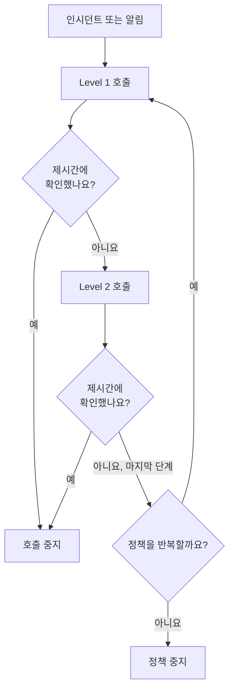
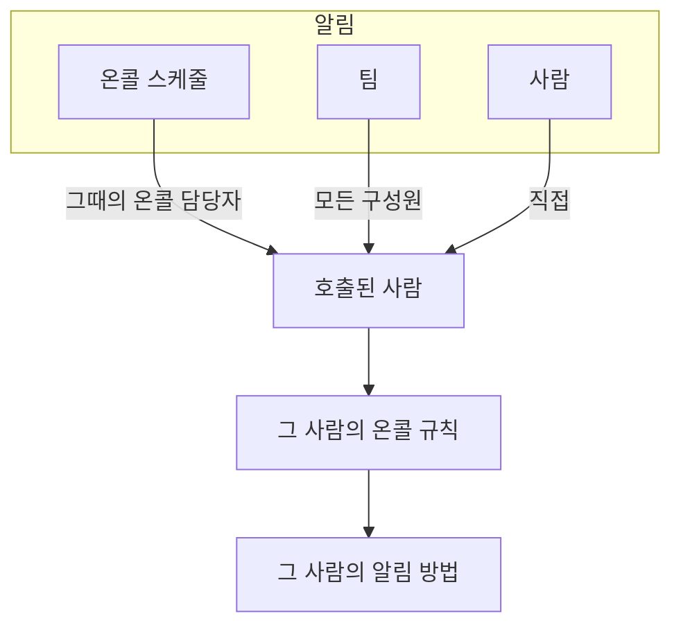

# 에스컬레이션 규칙

온콜 정책은 단계별로 사람을 호출합니다. 각 에스컬레이션 규칙은 하나의 단계로, 누구를 호출할지, 그리고 다음 단계를 호출하기 전에 누군가 확인하기를 얼마나 기다릴지를 정합니다. 정책의 규칙은 정책의 **에스컬레이션 규칙** 페이지에 순서대로 표시됩니다.



:::cards
- [먼저 호출되는 사람](#먼저-호출되는-사람): 첫 번째 단계가 있는 정책을 만듭니다.
- [에스컬레이션 규칙 추가](#에스컬레이션-규칙-추가): 다음 단계를 차례대로 추가합니다.
- [단계가 사람을 호출하는 방식](#단계가-사람을-호출하는-방식): 타이밍, 반복, 각 사람에게 연락하는 방법.
- [API와 Terraform](#api-또는-terraform으로-규칙-만들기): 정책과 규칙을 코드로 만듭니다.
:::

## 먼저 호출되는 사람

**온콜 정책** 페이지에서 온콜 정책을 만들면 양식에서 **이름** 과 **누구에게 먼저 알릴까요?** 를 묻습니다. 이 질문은 **알림** 과 같은 선택기를 사용하므로 온콜 스케줄, 팀, 사람을 필요한 만큼 고를 수 있습니다. 선택한 대상은 정책의 첫 번째 에스컬레이션 규칙인 **Level 1** 이 되며, 다음 단계를 호출하기 전에 확인을 **30분** 기다립니다.

:::steps
1. **온콜 듀티** > **온콜 정책** 으로 이동하여 **온콜 정책 만들기** 를 클릭합니다.
2. **이름** 을 입력합니다.
3. **누구에게 먼저 알릴까요?** 에서 **응답자 추가** 를 클릭하고 먼저 호출할 온콜 스케줄, 팀, 사람을 선택합니다.
4. **온콜 정책 만들기** 를 클릭합니다. 새 정책은 해당 **에스컬레이션 규칙** 페이지에서 열리며, 여기서 단계를 더 추가할 수 있습니다.
:::

**누구에게 먼저 알릴까요?** 는 선택 사항입니다. 비워 두면 정책은 에스컬레이션 규칙 없이 시작합니다. 규칙을 추가할 때까지 아무도 호출하지 않으며, 개요에도 그렇게 표시됩니다. 설명과 레이블은 **추가 필드** 아래에 있습니다. 이 질문은 에스컬레이션 규칙을 추가할 수 있는 사람에게만 표시됩니다.

## 에스컬레이션 규칙 추가

:::steps
### 정책의 에스컬레이션 규칙 열기

온콜 정책을 열고 사이드 메뉴에서 **에스컬레이션 규칙** 을 선택한 다음 **에스컬레이션 규칙 추가** 를 클릭합니다. 대화 상자는 짧은 한 페이지입니다.

### 알릴 대상 선택

**알림** 에서 **응답자 추가** 를 클릭하고, 검색하여 이 단계에서 호출할 온콜 스케줄, 팀, 사람을 필요한 만큼 선택합니다. 하나 이상 추가하세요.

| 응답자 | 단계가 실행될 때 호출되는 사람 |
| --- | --- |
| **온콜 스케줄** | 단계가 실행될 때 해당 스케줄의 온콜 담당자입니다. 고정된 사람이 아닙니다. |
| **팀** | 팀의 모든 구성원. |
| **사람** | 그 사람에게 직접. |

### 대기 시간 설정

**에스컬레이션 대기 시간(분)** 은 다음 단계를 호출하기 전에 확인을 기다리는 시간입니다. 처음 값은 **30분** 이며, 단계에 맞게 바꾸면 됩니다.

### 원하면 규칙에 이름 지정

나머지 항목은 모두 **추가 필드** 아래에 있으며, 열기 전까지 접혀 있습니다.

- **이름**: 선택 사항입니다. 이름을 지정하지 않은 규칙은 단계에 따라 이름이 붙습니다. 정책의 첫 번째 규칙은 **Level 1**, 두 번째는 **Level 2** 등입니다. 이름 필드에는 규칙이 받게 될 이름이 표시됩니다.
- **설명**: 선택 사항인 메모입니다. 예를 들어 이 단계가 누구를 왜 호출하는지 적습니다.

접혀 있을 때 **추가 필드** 의 머리글에는 두 항목의 이름과 규칙에 설정된 항목(설명 또는 직접 지정한 이름)이 표시됩니다.

### 규칙 만들기

**Create Rule** 을 클릭합니다. 규칙은 다른 규칙 아래에 정책의 다음 단계로 추가됩니다.
:::

## 단계가 사람을 호출하는 방식

인시던트나 알림이 정책에 도달하면 **Level 1** 이 즉시 응답자를 호출합니다. 대기 시간 안에 아무도 확인하지 않으면 **Level 2** 가 호출되고, 목록 아래로 계속 이어집니다. 마지막 단계의 대기 시간이 확인 없이 지나면, 정책의 **반복 정책** (규칙 아래에 있음)이 반복하도록 되어 있을 경우 허용된 횟수만큼 **Level 1** 부터 다시 시작하고, 그렇지 않으면 중지합니다. 인시던트나 알림을 확인하거나 해결하면 어느 단계에서든 호출이 중지됩니다.

이미 인지됨 또는 해결됨 상태로 생성된 인시던트, 알림, 에피소드(사후에 기록한 것)는 어떤 정책도 실행하지 않습니다. 아무도 호출되지 않으며, 피드에 정책 이름과 함께 그 사실이 남습니다. [이미 인지되었거나 해결된 상태로 선언된 인시던트](/docs/incidents/declaring-incidents#이미-인지되었거나-해결된-상태로-선언된-인시던트) 를 참조하세요.

정책을 반복하려면 **반복 정책** 카드에서 **편집** 을 클릭하고, **Repeat if no one acknowledges** 를 켠 다음 **Number of times to repeat** 를 설정합니다.

### 에스컬레이션 요약

**에스컬레이션 규칙** 페이지 맨 위의 요약에는 전체 단계가 표시됩니다. 각 단계가 언제 호출되는지, 누구를 호출하는지, 마지막 단계 이후에 무슨 일이 일어나는지입니다. 응답자를 모두 호출할 수 없는 단계는 카드에 그렇게 표시되며, 레이블을 클릭하면 누구이고 왜 그런지 볼 수 있습니다.

### 각 사람에게 연락하는 방법

단계가 호출하는 각 사람에게는 그 사람의 온콜 규칙에 따라 연락합니다. **사용자 설정** > **온콜 규칙** 에는 인시던트, 인시던트 에피소드, 알림, 알림 에피소드별 탭이 있고, 심각도별 카드에 어떤 알림 방법을 얼마 후에 시도하는지가 나옵니다. 프로젝트 관리자는 **사용자** > 구성원 > **온콜 규칙** 에서 구성원의 규칙을 보고 바꿀 수 있습니다.



어떤 사람에게 적용 중인 사용자 재정의가 있으면, 그 사람에게 가는 호출은 대신 맡은 사람에게 전송됩니다.

모든 메시지는 제공자가 받아들이는 형태로 보내지므로 호출은 항상 발송됩니다. 채널마다 담을 수 있는 양은 다음과 같습니다.

| 채널 | 담을 수 있는 가장 긴 메시지 |
| --- | --- |
| SMS | 1,600자 |
| 전화 | Twilio의 4,000자 통화 스크립트에 들어가는 만큼 |
| 푸시 알림 | 4KB, 그중 제목, 본문, 데이터가 최대 3KB |
| WhatsApp | 1,024자 |
| Telegram | 4,096자 |

이보다 긴 메시지(긴 제목이나 템플릿이 넣은 긴 설명이 있는 메시지)는 잘리며, 전체 내용은 OneUptime에 있다는 안내로 끝납니다: "… (truncated — see OneUptime for the full text)". WhatsApp 메시지의 문구는 고정된 템플릿이므로, 그곳에서는 대신 가장 긴 값이 잘리고 각각 "…"로 끝납니다. 메시지의 링크는 절대 잘리지 않습니다.

### 호출이 전송되지 않는 경우

전송되지 않은 호출은 그 사람의 **온콜 로그** (사용자 설정)에 이유가 표시됩니다. 행에는 **오류** 가 표시되고, 상태 메시지에 이유가 나옵니다. 더 이상 **Sending** 상태로 남지 않습니다. 메시지는 다음 중 하나를 알려 줍니다.

- 프로젝트 잔액으로 비용을 낼 수 없었으며, 누가 잔액을 추가할 수 있는지;
- 프로젝트에서 채널이 꺼져 있으며, 누가 켤 수 있는지.

프로젝트 소유자는 잔액이 충전되거나 채널이 다시 켜질 때까지 이에 관한 이메일을 한 번 받습니다.

OneUptime Cloud에서는 SMS, 통화, WhatsApp, Telegram 메시지마다 **프로젝트 설정 > 알림 > 알림 설정** 에 있는 프로젝트 잔액에서 비용이 지불됩니다. 제공자가 메시지를 받으면 정확한 비용이 잔액에서 차감되며, 한꺼번에 나가는 메시지 수와는 관계가 없습니다.

- 그곳에서 **자동 충전** 이 켜져 있으면, 잔액이 기준치 아래인 것을 발견한 메시지가 먼저 자동 충전에 설정된 금액을 추가하고 프로젝트의 카드에 청구합니다. 같은 순간에 잔액 부족을 발견한 메시지들은 카드에 한 번만 청구합니다.
- 그 청구가 실패하면(결제 수단이 없거나 카드가 거절된 경우) 자동 충전은 1시간 후 카드로 다시 시도하며, 그때까지 **알림 설정** 맨 위에 그렇게 표시됩니다. 잔액을 직접 추가하거나 자동 충전을 다시 저장하면 즉시 시도합니다.
- 자동 충전이 카드에 청구하지 못하는 동안에도 호출은 남은 잔액으로 계속 발송됩니다.

> [!IMPORTANT]
> 새 프로젝트에서는 SMS, 전화, WhatsApp, Telegram이 꺼져 있습니다. OneUptime Cloud에서는 모든 메시지가 프로젝트 잔액에서 지불되고, 자체 호스팅 설치에서는 먼저 Twilio 계정이나 Telegram 봇을 설정해야 하기 때문입니다. 채널이 꺼져 있는 동안에는 프로젝트의 누구도 그 채널에 알림 방법을 추가할 수 없습니다. 채널은 프로젝트 소유자, **Billing Admin**, 또는 **Manage Billing** 권한이 있는 사람만 **프로젝트 설정 > 알림 > 알림 설정** 의 **알림 채널** 카드에서 켤 수 있으며, 프로젝트 관리자는 켤 수 없습니다. 다른 모든 사람에게는 채널이 꺼져 있는 모든 곳에서 누가 켤 수 있는지 정확히 알려 줍니다. 그 채널에 대한 자신의 방법 목록 위, 설정 체크리스트, 그리고 무언가에 그 채널이 필요할 때 받는 메시지입니다.

## 규칙 편집, 순서 변경, 삭제

각 규칙의 카드에는 **Edit rule** 과 나머지 작업이 있는 **⋯** 메뉴가 있습니다.

- **Edit rule** 은 같은 한 페이지짜리 대화 상자를 규칙의 현재 내용(응답자, 대기 시간, **추가 필드** 아래의 이름과 설명)이 채워진 상태로 엽니다. 응답자를 추가하거나 제거하고 **변경 사항 저장** 을 클릭합니다. 이름을 지우면 규칙은 다시 단계의 이름을 받습니다.
- 규칙의 **⋯** 메뉴에 있는 **Move up** 과 **Move down** 은 규칙의 단계를 바꿉니다. 단계에 따라 이름이 붙은 규칙은 위치에 맞는 이름을 유지합니다. **Level 3** 이 **Level 2** 위로 올라가면 두 규칙의 이름이 서로 바뀝니다. **관리자** 처럼 직접 고른 이름은 규칙이 어디로 이동해도 그대로입니다.
- **Delete rule** 은 먼저 확인을 요청하고 그 단계가 누구를 호출하는지 알려 줍니다. 단계를 삭제하면 그 아래 단계들이 위로 올라가고, 단계에 따라 이름이 붙은 규칙은 그에 맞게 이름이 바뀝니다.

## API 또는 Terraform으로 규칙 만들기

에스컬레이션 규칙은 `/api/on-call-duty-policy-escalation-rule` 리소스이고, 규칙이 호출하는 사람, 팀, 스케줄은 `/api/on-call-duty-policy-escalation-rule-user`, `-team`, `-schedule` 리소스입니다.

- `name` 없이 만든 규칙은 대시보드에서와 같이 단계에 따라 이름이 붙습니다. 정책의 세 번째 단계가 되는 규칙이라면 **Level 3** 입니다. Terraform의 에스컬레이션 규칙 리소스에는 여전히 이름이 필요합니다.
- `escalateAfterInMinutes` 에는 대시보드 밖에서는 기본값이 없습니다. 이 값 없이 만든 규칙은 기다리지 않으며, 이 단계가 실행되자마자 다음 단계가 호출됩니다. 명시적으로 설정하세요. 대시보드가 제안하는 값은 30입니다.
- `miscDataProps` 에 `onCallSchedules`, `teams`, `users` (ID 목록)를 넣어 만든 규칙은 그 응답자를 받습니다. 대시보드의 **알림** 선택기가 응답자를 보내는 방식입니다. 이것들 없이 만든 규칙은 위의 리소스로 응답자를 추가할 때까지 아무도 호출하지 않습니다.
- 단계에 따라 이름이 붙은 규칙의 이름이 바뀌는 것은 대시보드에서 규칙을 이동하거나 삭제할 때입니다. API나 Terraform으로 `order` 를 바꾸면 순서만 바뀝니다.
- `/api/on-call-duty-policy` 에서 `miscDataProps` 에 `onCallSchedules`, `teams`, `users` (ID 목록)를 넣어 온콜 정책을 만들면, 대시보드와 같이 첫 번째 에스컬레이션 규칙이 생깁니다. 이들을 호출하는 **Level 1** 이며, `escalateAfterInMinutes` 는 30입니다. 모든 ID가 프로젝트에 속해야 하고 호출자가 에스컬레이션 규칙을 만들 수 있어야 하며, 그렇지 않으면 정책이 만들어지지 않습니다. 이것들 없이 만든 정책에는 이전처럼 규칙이 없으며, Terraform의 정책 리소스는 이것들을 보내지 않습니다.

```bash
curl -X POST https://oneuptime.com/api/on-call-duty-policy \
  -H "apikey: $ONEUPTIME_API_KEY" \
  -H "Content-Type: application/json" \
  -d '{
    "data": {
      "projectId": "<project-id>",
      "name": "Production on-call"
    },
    "miscDataProps": {
      "onCallSchedules": ["<schedule-id>"],
      "users": ["<user-id>"]
    }
  }'
```

## 다음 단계

:::cards
- [온콜 스케줄](/docs/on-call/schedules): 단계가 호출하는 로테이션을 만듭니다.
- [스케줄 타임라인](/docs/on-call/schedule-timeline): 모든 스케줄에서 누가 온콜인지 확인하고 커버리지 공백을 찾습니다.
- [수신 전화 정책](/docs/on-call/incoming-call-policy): 발신자가 전화로 온콜 엔지니어에게 연결되게 합니다.
:::
