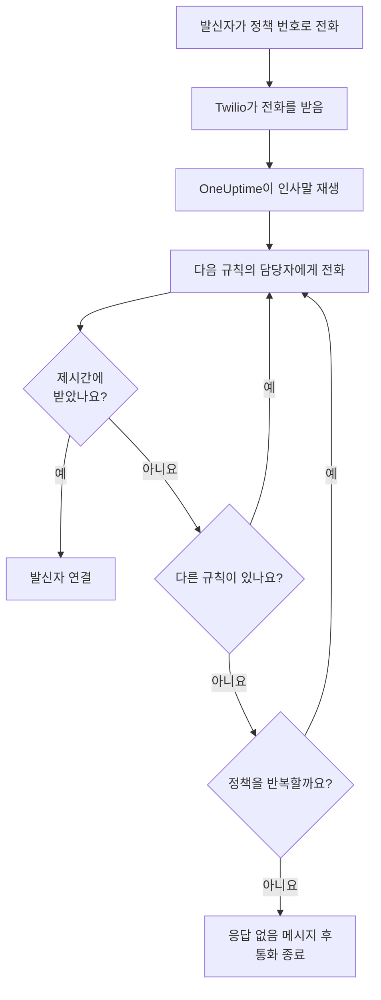
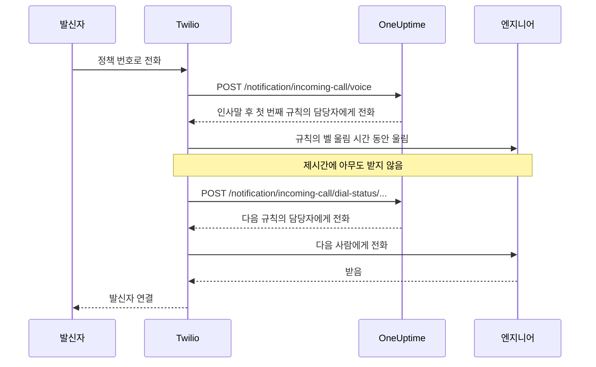

# 수신 전화 정책

수신 전화 정책은 팀에 온콜 담당자에게 연결되는 전화번호를 제공합니다. 누군가 그 번호로 전화하면 OneUptime은 누군가 받을 때까지 정책의 에스컬레이션 규칙에 있는 사람들에게 차례로 전화를 걸고, 발신자를 연결합니다. 번호와 통화는 사용자의 Twilio 계정으로 운영됩니다.

:::cards
- [정책 설정하기](#정책-설정하기): Twilio 계정부터 테스트 통화까지 7단계로.
- [통화 라우팅 방식](#통화-라우팅-방식): 누구에게 얼마나 전화하고 발신자가 무엇을 듣는지.
- [부재중 전화](#부재중-전화): 누가 알림을 받고 워크플로에서 어떻게 대응하는지.
- [문제 해결](#문제-해결): 전화가 도착하지 않거나 엔지니어에게 연결되지 않는 경우.
:::

## 시작하기 전에

| 필요한 것 | 이유 |
| --- | --- |
| Account SID와 Auth Token이 있는 Twilio 계정 | 정책의 번호와 통화가 이 계정으로 운영되며, Twilio가 이 계정에 요금을 청구합니다. |
| OneUptime Cloud의 **Growth** 요금제 | 프로젝트가 자체 Twilio 구성을 가지려면 필요합니다. |
| 직접 호스팅한다면 Twilio가 접근할 수 있는 OneUptime 서버 | Twilio는 모든 통화를 `https://<your host>/notification/incoming-call/voice` 로 보냅니다. |
| 프로젝트에서 켜진 **SMS** | 각 엔지니어의 번호는 SMS로 보낸 코드로 인증합니다. |
| 각 엔지니어의 인증된 번호 | 규칙은 프로젝트에서 수신 전화용 번호를 추가하고 인증한 사람에게만 전화합니다. |

## 정책 설정하기

:::steps
### Twilio 계정 추가

**프로젝트 설정** > **알림** > **알림 설정** 으로 이동합니다. **Twilio 구성** 카드에서 **Create Twilio Config** 를 클릭하고 양식을 채웁니다.

- **이름** 과 **설명**: 계정의 용도입니다. 예: "고객 지원 핫라인".
- **Twilio 계정 SID**: Twilio Console에서 가져옵니다. `AC` 로 시작합니다.
- **Twilio 인증 토큰**: Twilio Console에서 가져옵니다.
- **Twilio 기본 전화번호**: 그 계정의 번호로, 계정이 보내는 SMS와 통화에 쓰입니다.
- **Twilio 보조 전화번호**: 선택 사항입니다. 해당 국가의 수신자에게 기본 번호 대신 발신하는 번호입니다.
- **프로젝트 기본값으로 설정**: 프로젝트의 첫 번째 Twilio 구성에서는 켜져 있어, 프로젝트 구성원에게 가는 SMS와 통화도 이 계정을 거칩니다. 이 계정을 수신 전화 전용으로 쓰려면 끄세요.

### 정책 만들기

**온콜 듀티** > **수신 통화 정책** 으로 이동하여 **수신 통화 정책 만들기** 를 클릭합니다. "고객 지원 핫라인"과 같은 **이름** 과, 원하면 **설명** 과 **레이블** 을 입력합니다. 그런 다음 목록에서 정책을 엽니다.

### Twilio 계정 선택

정책의 **개요** 에는 번호가 매겨진 세 단계가 있는 **설정** 카드가 있습니다. 첫 번째 단계에서 **선택** 을 클릭하고, **Twilio 구성** 에서 계정을 고른 다음 **저장** 을 클릭합니다.

### 전화번호 추가

두 번째 단계에서 **Add Phone Number** 를 클릭합니다. Twilio 계정에 이미 있는 번호를 가져오려면 **Use Existing Phone Number** 를, 새 번호를 받으려면 **Reserve New Phone Number** 를 선택합니다. OneUptime이 번호가 자신을 가리키도록 설정하므로 Twilio에서 설정할 것은 없습니다. [전화번호](#전화번호) 를 참조하세요.

### 에스컬레이션 규칙 추가

세 번째 단계에서 **규칙 관리** 를 클릭합니다. 전화할 온콜 스케줄이나 사람마다, 전화할 순서대로 규칙을 추가합니다. [에스컬레이션 규칙](#에스컬레이션-규칙) 을 참조하세요.

### 각 엔지니어의 번호 인증

규칙이 전화할 수 있는 모든 사람이 수신 전화용 자기 번호를 추가하고 인증합니다. [엔지니어의 전화번호](#엔지니어의-전화번호) 를 참조하세요.

### 번호로 전화하기

세 단계가 모두 끝나면 카드가 **Phone Numbers & Twilio Configuration** 으로 바뀝니다. 아무 전화로나 번호에 전화한 다음, 정책의 **통화 로그** 를 열어 누구에게 전화가 갔는지 확인하세요.
:::

## 통화 라우팅 방식

1. Twilio가 통화를 OneUptime에 보내고, OneUptime이 정책의 **인사 메시지** 를 읽어 줍니다.
2. OneUptime은 첫 번째 에스컬레이션 규칙이 지정한 사람에게 전화합니다. 그 사람이거나, 그 시점에 규칙의 온콜 스케줄에서 온콜인 사람이며, 사용자 재정의도 반영됩니다. 그 사람의 전화에는 정책의 번호가 발신자로 표시됩니다.
3. 규칙의 **벨 울림 시간** 안에 받으면 발신자가 연결되고, 통화 로그에 누가 받았는지 기록됩니다.
4. 받지 않으면 발신자는 "Connecting you to the next available engineer."를 듣고, 다음 규칙의 담당자에게 전화가 갑니다.
5. 마지막 규칙 뒤에는 **아무도 응답하지 않을 경우 정책 반복** 이 켜져 있으면 **정책 반복 횟수** 만큼 첫 번째 규칙부터 다시 시작합니다. 그렇지 않으면 발신자는 **응답 없음 메시지** 를 듣고 통화가 끝납니다.

지금 전화할 사람이 없는 규칙은 아무에게도 전화하지 않고 건너뜁니다. 스케줄에 온콜 담당자가 없거나, 그 사람이 이 프로젝트에서 수신 전화용 인증 번호가 없거나, 더 이상 프로젝트 구성원이 아닌 경우입니다. 어떤 규칙에도 전화할 사람이 없으면 발신자는 **사용 가능한 사람 없음 메시지** 를 듣습니다. 비활성화된 정책은 모든 통화에 "Sorry, this service is currently disabled."라고 답하고 끊습니다.

OneUptime은 모든 요청에서 Twilio 구성의 Auth Token으로 Twilio의 서명을 확인하며, 확인할 수 없는 요청은 거부합니다.

> [!TIP]
> 정책의 번호를 "고객 지원 핫라인"처럼 휴대폰 연락처로 저장해 두면, 전달된 전화가 울릴 때 알아볼 수 있습니다.

## 에스컬레이션 규칙

에스컬레이션 규칙은 누군가 정책의 번호로 전화했을 때 목록의 위에서부터 누구에게 전화할지 정합니다. 정책을 열고 사이드 메뉴에서 **에스컬레이션 규칙** 을 선택한 다음 **에스컬레이션 규칙 추가** 를 클릭합니다. 규칙은 짧은 한 단계입니다.

- **전화할 대상**: 온콜 스케줄 또는 한 사람. 스케줄은 전화가 들어온 시점에 그 스케줄의 온콜 담당자에게 전화합니다. 사람은 프로젝트의 구성원입니다.
- **벨 울림 시간(초)**: 통화가 다음 규칙으로 넘어가기 전에 그 사람의 전화가 울리는 시간입니다. 처음 값은 20초이며, Twilio는 5~600을 받습니다.
- **이름** 과 **설명** 은 선택 사항이며 **추가 필드** 아래에 있습니다. 이름이 없는 규칙은 목록에서의 위치에 따라 **Level 1**, **Level 2** 로 표시됩니다.

규칙은 목록의 위에서 아래로 호출되며, 새 규칙은 끝에 추가됩니다. 순서를 바꾸려면 규칙 왼쪽 위의 핸들을 끌어 옮기세요. 키보드로는 핸들에 포커스를 두고 스페이스를 누른 뒤, 화살표 키로 옮기고 다시 스페이스를 누릅니다.

> [!WARNING]
> **음성 사서함에 주의**: **벨 울림 시간** 은 그 사람의 전화가 받지 않은 통화를 음성 사서함으로 넘기는 시간보다 짧게 두세요. 음성 사서함이 먼저 받으면 발신자는 음성 사서함에 연결되고, 통화는 다음 규칙으로 넘어가지 않습니다. Twilio는 울릴 때마다 자체적으로 몇 초를 더합니다. 그래서 새 규칙은 20초로 시작합니다. 기본값이 30초였을 때 추가한 규칙은 30초를 유지합니다. 그 규칙의 통화가 음성 사서함으로 간다면 그 규칙의 **벨 울림 시간** 을 줄이세요.

예를 들어 두 로테이션을 시도한 뒤 리더에게 전화하는 세 규칙:

| 단계 | 전화할 대상 | 벨 울림 시간 |
| --- | --- | --- |
| Level 1 | 주 온콜 스케줄 | 20초 |
| Level 2 | 보조 온콜 스케줄 | 20초 |
| Level 3 | 엔지니어링 리드(한 사람) | 20초 |

## 전화번호

정책에는 여러 번호를 둘 수 있으며, 모든 번호가 같은 규칙으로 전화합니다. 각 번호는 한 정책에 속합니다. 정책의 **개요** 에서 **Add Phone Number** 로 추가합니다.

:::tabs
@tab 가지고 있는 번호 사용
1. **Add Phone Number** 를 클릭한 다음 **Use Existing Phone Number** 를 클릭합니다. OneUptime이 정책의 Twilio 계정에 있는 번호를 나열합니다.
2. 번호 옆의 **선택** 을 클릭한 다음 **번호 할당** 을 클릭합니다.

이미 통화를 다른 곳으로 보내는 번호에는 "Currently has a webhook configured"가 표시됩니다. 할당하면 그 번호의 통화가 대신 OneUptime으로 갑니다.
@tab 새 번호 예약
1. **Add Phone Number** 를 클릭한 다음 **Reserve New Phone Number** 와 **번호 검색** 을 클릭합니다.
2. **국가** 를 고릅니다. 원하면 **지역 번호 (선택사항)** (예: 415)나, 번호에 들어갈 숫자를 **포함 (선택 사항)** 에 입력합니다. **검색** 을 클릭하면 최대 10개의 지역 번호가 나열됩니다.
3. 번호 옆의 **예약** 을 클릭하고 **예약** 으로 확인합니다. Twilio가 번호 요금을 Twilio 계정에 청구합니다.
:::

OneUptime은 번호의 음성 webhook을 `https://<your host>/notification/incoming-call/voice` 로 설정하며, 자체 호스팅 설치에서는 `HOST` 와 `HTTP_PROTOCOL` 로 만듭니다. 정책을 다른 Twilio 계정으로 옮기려면 먼저 번호를 해제하세요. 계정은 정책에 번호가 없을 때만 바꿀 수 있습니다.

번호를 해제하려면 번호 옆의 **해제** 를 클릭하고 **번호 해제** 로 확인합니다.

> [!CAUTION]
> 번호를 해제하면 **Use Existing Phone Number** 로 가져온 번호라도 Twilio에 반환되며, 다시 얻지 못할 수 있습니다. 정책이나 정책이 사용하는 Twilio 구성을 삭제해도 그 번호가 해제됩니다.

## 엔지니어의 전화번호

규칙은 그 사람이 이 프로젝트에서 수신 전화용으로 인증한 번호로 전화하며, 번호가 없는 사람은 건너뜁니다. 각자 자기 번호를 추가합니다.

:::steps
1. **사용자 설정** > **수신 통화 정책** > **수신 전화번호** 를 엽니다. **수신 통화 정책** 은 사이드 메뉴의 섹션으로, 처음에는 접혀 있습니다.
2. **전화번호 수신 통화 라우팅용** 카드에서 **전화번호 수신 통화 라우팅용 추가** 를 클릭하고 `+15551234567` 처럼 국가 코드와 함께 번호를 입력합니다.
3. OneUptime이 그 번호로 SMS를 통해 보내는 6자리 코드를 **인증 코드** 에 입력하고 **인증** 을 클릭합니다. **Send a new code** 는 새 코드를 보냅니다.
:::

각 사람은 프로젝트마다 인증된 번호를 하나만 가질 수 있습니다. 바꾸려면 먼저 이전 번호를 삭제하세요. 이 번호는 온콜 호출에 쓰이는 **알림 방법** 의 전화번호와 별개입니다.

수신 전화용 번호는 SMS로 인증하므로, 먼저 프로젝트에서 **SMS** 가 켜져 있어야 합니다. 프로젝트 소유자, **Billing Admin**, 또는 **Manage Billing** 이 있는 사람이 **프로젝트 설정 > 알림 > 알림 설정** 의 **알림 채널** 카드에서 켭니다.

## 음성 메시지와 정책 설정

정책을 열고 사이드 메뉴의 **고급** 아래에서 **설정** 을 선택합니다. **음성 메시지** 카드의 **Edit Messages** 로 발신자가 듣는 내용을, **정책 설정** 카드의 **Edit Policy Settings** 로 나머지를 바꿉니다.

| 설정 | 하는 일 | 새 정책의 값 |
| --- | --- | --- |
| **인사 메시지** | 전화를 받았을 때, 첫 번째 사람에게 전화하기 전에 읽어 줍니다. | "Please wait while we connect you to the on-call engineer." |
| **응답 없음 메시지** | 모든 규칙을 시도했는데 아무도 받지 않았을 때 읽어 줍니다. | "No one is available. Please try again later." |
| **사용 가능한 사람 없음 메시지** | 어떤 규칙에도 전화할 사람이 없을 때 읽어 줍니다. | "We are sorry, but no on-call engineer is currently available. Please try again later or contact support." |
| **활성화됨** | 비활성화된 정책은 모든 통화를 거절합니다. | 켜짐 |
| **아무도 응답하지 않을 경우 정책 반복** | 마지막 규칙 뒤에 첫 번째 규칙부터 다시 시작합니다. | 꺼짐 |
| **정책 반복 횟수** | 다시 시작하는 횟수. | 1 |

Twilio는 음성 합성으로 메시지를 읽어 주므로, 들리길 원하는 대로 적으세요.

## 통화 로그

모든 통화는 정책 사이드 메뉴의 **로그** 아래에 있는 **통화 로그** 페이지에 나옵니다. **발신자**, **Number Called**, 통화의 **상태**, 받은 사람( **응답자** ), **기간**, 시작 시각( **시작일** )입니다. 통화에서 **View Timeline** 을 클릭하면 **호출 타임라인** 이 나옵니다. 전화가 간 모든 사람, 사용된 번호, 각 시도의 결과입니다.

| 상태 | 일어난 일 |
| --- | --- |
| **Initiated**, **Escalated** | 통화가 아직 진행 중입니다. 전화가 들어와 울리고 있거나, 다음 규칙으로 넘어갔습니다. |
| **완료됨** | 누군가 받았고 발신자가 연결되었습니다. |
| **응답 없음** | 모든 에스컬레이션 규칙을 시도했지만 아무도 받지 않았습니다. 발신자는 **응답 없음 메시지** 를 들었습니다. |
| **Caller Hung Up** | 엔지니어의 전화가 울리는 동안 발신자가 끊었습니다. |
| **실패** | 아무에게도 전화할 수 없었습니다. 어떤 에스컬레이션 규칙에도 수신 전화용 인증 번호가 있는 온콜 사용자가 없었거나(발신자는 **사용 가능한 사람 없음 메시지** 를 들었음), 정책이 비활성화되어 있습니다. |

## 부재중 전화

아무에게도 연결되지 않고 끝난 통화는 부재중 전화입니다. 상태는 **응답 없음**, **Caller Hung Up**, **실패** 중 하나입니다.

### 알림을 받는 사람

통화가 부재중 전화가 되면 OneUptime은 정책의 소유자에게 알립니다. 정책의 **소유자** 페이지에 추가된 사용자와 팀 구성원입니다. 정책에 소유자가 없으면 대신 프로젝트 소유자에게 알립니다.

알림에는 누가 전화했는지, 어느 번호로 걸었는지, 왜 아무도 받지 않았는지, 누구에게 전화가 갔고 각 시도가 어떻게 끝났는지가 담기며, 통화 로그의 해당 통화로 연결됩니다.

소유자는 기본적으로 이메일을 받습니다. 각자 **사용자 설정** > **알림 설정** 의 **온콜** > **수신 통화 정책** > **부재중 전화** 에서 다른 채널(SMS, 전화, 푸시 등)을 고르거나 끌 수 있습니다.

### 워크플로에서 부재중 전화에 대응하기

수신 통화 로그는 워크플로 트리거로 쓸 수 있습니다.

- **On Create Incoming Call Log** 는 전화가 들어올 때 실행됩니다.
- **On Update Incoming Call Log** 는 통화가 진행되면서 실행됩니다. **Ended At** 을 설정하는 업데이트가 통화의 끝입니다.

부재중 전화에만 대응하려면(예: Slack이나 Microsoft Teams에 게시하거나 티켓을 열려면):

:::steps
1. **On Update Incoming Call Log** 트리거를 추가합니다. **Listen on** 을 **Ended At** 으로 설정하고, **Status**, **Caller Phone Number**, **Routing Phone Number** 처럼 사용할 필드를 선택합니다.
2. **If / Else** 단계를 추가합니다. 트리거의 **Status** 를 비교 연산 **is not equal to** 와 `Completed` 로 확인합니다.
3. 내 단계를 **Yes** 포트에 연결합니다.
:::

워크플로는 **Find One** 과 **Find Many** 로 통화 로그를 읽을 수 있지만, 만들거나 바꿀 수는 없습니다.

## 전화번호를 추가하고 해제할 수 있는 사람

정책의 전화번호에는 정책 자체와 같은 역할이 적용됩니다.

- **번호 조회** - 예약할 번호를 Twilio에서 찾거나 Twilio 계정에 이미 있는 번호를 나열하는 것 - 에는 수신 통화 정책을 읽는 권한과 통화 및 SMS 구성을 읽는 권한이 필요합니다. 그중 하나를 통해 Twilio 계정을 읽기 때문입니다. **Project Owner**, **Project Admin**, **Project Member**, **Viewer**, **Settings Admin**, **Settings Member**, **Settings Viewer** 는 둘 다 가지고 있습니다. 사용자 지정 역할에서는 **Read Incoming Call Policy** 와 **Read Call and SMS** 입니다.
- **번호 예약, 기존 번호 사용, 번호 해제** 에는 수신 통화 정책을 편집하는 권한이 필요합니다. **Project Owner**, **Project Admin**, **Project Member**, **Settings Admin**, **Settings Member**, 또는 사용자 지정 역할의 **Edit Incoming Call Policy** 입니다. 이 작업은 편집할 수 있는 정책의 번호를 바꿉니다. 일부 레이블로 제한된 역할이라면 그 레이블이 붙은 정책입니다.

이 권한 중 하나에 대한 레이블 없는 팀 차단은 그 권한을 없앱니다. 그 밖의 사람에게는 **Add Phone Number** 와 **해제** 가 잠긴 상태로 페이지에 남고, 도구 설명에 필요한 권한이 표시됩니다. API는 필요한 권한을 알려 주는 문장으로 요청을 거부합니다: "Looking up phone numbers needs permission to read incoming call policies and call and SMS settings." 또는 "Adding or releasing a phone number needs permission to edit incoming call policies." 번호 예약 요금은 OneUptime 잔액이 아니라 내 Twilio 계정에 청구되므로 결제 권한은 필요하지 않습니다.

## API 또는 Terraform으로 정책 만들기

| 리소스 | API 경로 |
| --- | --- |
| 수신 통화 정책 | `/api/incoming-call-policy` |
| 정책의 에스컬레이션 규칙 | `/api/incoming-call-policy-escalation-rule` |
| 정책의 전화번호(읽기 전용) | `/api/incoming-call-policy-phone-number` |
| 통화 로그(읽기 전용) | `/api/incoming-call-log` |

`escalateAfterSeconds` 없이 API로 만든 규칙은 20초 동안 울리며, Terraform이 `escalate_after_seconds` 없이 만든 규칙도 마찬가지입니다.

### 에스컬레이션 규칙 설정

| 설정 | API 필드 | 담는 내용 |
| --- | --- | --- |
| 전화할 대상 | `onCallDutyPolicyScheduleId` 또는 `userId` | 둘 중 하나만, 둘 다는 불가. 온콜 담당자에게 전화할 스케줄 또는 사람. |
| 벨 울림 시간(초) | `escalateAfterSeconds` | 통화가 다음으로 넘어가기 전에 전화가 울리는 시간(기본값: 20, 5~600). |
| 이름 및 설명 | `name`, `description` | 선택 사항. 이름이 없는 규칙은 목록에서의 위치에 따라 Level 1, Level 2 등으로 표시됩니다. |
| 순서 | `order` | 목록에서 규칙의 위치. 규칙은 위에서 아래로 호출됩니다. 순서가 없는 새 규칙은 끝에 추가됩니다. |

## 문제 해결

:::details 통화가 OneUptime에 도착하지 않습니다
- Twilio Console에서 번호를 엽니다. **A call comes in** 은 HTTP POST를 쓰는 webhook `https://<your host>/notification/incoming-call/voice` 여야 합니다. OneUptime은 번호를 추가할 때 `HOST` 와 `HTTP_PROTOCOL` 로 이를 설정합니다. 그 뒤 이 값들이 바뀌었다면 Twilio에서 webhook을 고치세요.
- 자체 호스팅한 OneUptime은 인터넷에서 https로 접근할 수 있어야 합니다. Twilio Console의 번호 통화 로그와 Twilio의 **Debugger** 에서 OneUptime의 응답을 볼 수 있습니다.
- `403` 응답은 요청의 서명이 맞지 않았다는 뜻입니다. Twilio 구성에 계정의 현재 **Twilio 인증 토큰** 이 들어 있는지, 그리고 OneUptime 앞의 프록시가 Twilio가 호출한 호스트와 스킴( `X-Forwarded-Host` 및 `X-Forwarded-Proto` )을 전달하는지 확인하세요.
:::

:::details 전화는 받지만 아무에게도 전화가 가지 않습니다
통화 로그에 **실패** 가 표시됩니다. 정책이 **활성화됨** 인지, 각 규칙의 온콜 스케줄에 지금 온콜 담당자가 있는지, 규칙이 전화하는 사람들이 이 프로젝트의 **사용자 설정** > **수신 통화 정책** > **수신 전화번호** 에 인증된 번호를 가지고 있는지 확인하세요. 규칙은 프로젝트 구성원에게만 전화합니다.
:::

:::details 통화가 음성 사서함으로 갑니다
통화가 엔지니어의 음성 사서함으로 간다면, 규칙의 **벨 울림 시간** 을 그 사람의 전화가 음성 사서함으로 넘어가는 시간보다 짧게 설정하세요. 음성 사서함이 받는 것도 응답으로 간주되며, 통화는 거기서 멈춥니다.
:::

:::details 새 번호를 예약할 수 없습니다
Twilio는 많은 국가에서 지역 번호를 판매하기 전에 승인된 regulatory bundle을 요구하며, 일부 번호는 Twilio 잔액이 양수여야 합니다. Twilio Console에서 이를 설정하거나, 그곳에서 번호를 받은 뒤 **Use Existing Phone Number** 로 추가하세요.
:::

:::details 정책의 Twilio 계정을 바꿀 수 없습니다
계정은 정책에 전화번호가 없을 때만 바꿀 수 있습니다. 페이지에 "Remove all phone numbers to change"가 표시됩니다. 번호를 해제하면 Twilio에 반환되므로 먼저 이전 계획을 세우세요.
:::

:::details 엔지니어 번호의 인증 코드가 오지 않습니다
프로젝트에서 SMS가 켜져 있어야 합니다. OneUptime Cloud에서 자체 기본 Twilio 구성이 없는 프로젝트는 잔액으로 SMS 요금을 내며, 잔액이 1 USD보다 많아야 합니다. 코드는 도착하는 데 1분쯤 걸릴 수 있습니다. **Send a new code** 를 클릭하면 새 코드를 보내며, **프로젝트 설정** > **알림** > **알림 로그** 에서 코드가 어떻게 되었는지 볼 수 있습니다.
:::

## 다음 단계

:::cards
- [에스컬레이션 규칙](/docs/on-call/escalation-rules): 온콜 정책이 단계별로 사람을 호출하는 방식.
- [온콜 스케줄](/docs/on-call/schedules): 규칙이 전화할 로테이션을 만듭니다.
- [워크플로](/docs/workflows/index): 부재중 전화에 대응합니다. 채널에 게시하거나 티켓을 엽니다.
- [Twilio SMS 및 음성 통합](/docs/self-hosted/twilio-integration): 자체 호스팅 설치용 Twilio를 설정합니다.
:::
