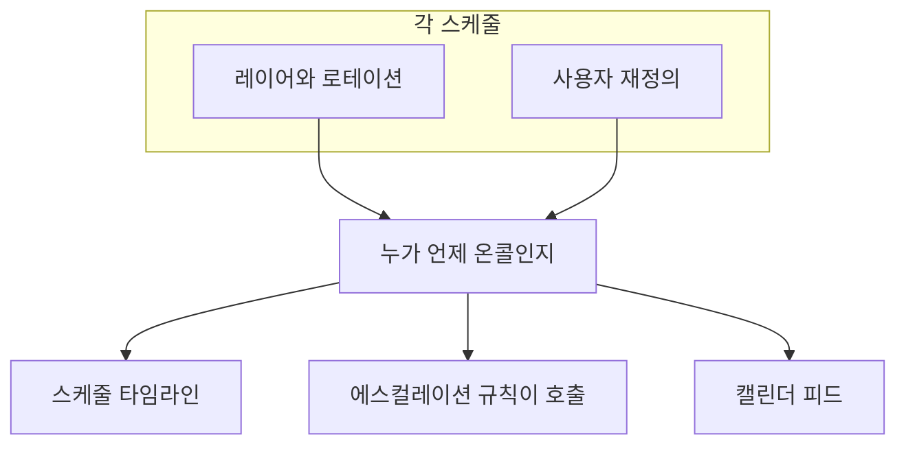

# 스케줄 타임라인

스케줄 타임라인은 프로젝트의 모든 온콜 스케줄을 주간 또는 월간 그리드 하나에 보여 줍니다. 행은 스케줄, 열은 날짜입니다. 각 스케줄을 열지 않고도 "이번 주에 우리 팀, 또는 조직 전체에서 누가 온콜인가?"에 답할 수 있습니다.

타임라인의 근무는 사용자 재정의를 포함해 OneUptime이 사람을 호출할 때 쓰는 바로 그 근무입니다. 타임라인, 에스컬레이션 규칙, 캘린더 피드는 모두 같은 곳에서 근무를 읽습니다.

## 타임라인 열기

- **온콜 듀티** > **스케줄 타임라인** 에는 볼 수 있는 모든 스케줄이 소유 팀별로 묶여 표시됩니다. **온콜 스케줄** 의 **타임라인 보기** 버튼도 같은 페이지를 엽니다.
- **팀** > 팀 > **온콜 스케줄** 에는 그 팀이 소유한 스케줄만 표시됩니다.

팀이 스케줄의 **소유자** 페이지에 등록되어 있으면 그 팀이 스케줄을 소유합니다. 소유 팀이 없는 스케줄은 **No owner team** 아래에 묶입니다. **Group by team** 을 끄면 모든 스케줄이 이름순으로 하나의 목록에 표시됩니다.

## 그리드 읽기

| 그리드의 표시 | 의미 |
| --- | --- |
| 막대 | 근무입니다. 누가 언제부터 언제까지 온콜인지 나타냅니다. 같은 사람은 모든 스케줄에서 같은 색입니다. |
| 흐린 막대 | 지난 근무. |
| **⇄** 가 표시된 막대 | 재정의입니다. 누군가 근무를 대신하고 있습니다. 그 아래의 얇은 줄에 근무를 넘긴 사람이 취소선과 함께 표시됩니다. |
| 빗금 친 호박색 블록 | 커버리지 공백입니다. 아무도 온콜이 아닙니다. 그 스케줄로 에스컬레이션되는 알림은 그때 아무도 호출하지 않습니다. |
| 빨간 선 | 현재. |
| 스케줄 이름 아래의 줄 | 지금 온콜인 사람, 또는 **No one on call now**. |

막대나 공백 위에 포인터를 올리거나 키보드로 이동하면 자세한 내용이 표시됩니다.

그리드 아래의 **On call this week** (월 보기에서는 **On call this month**)에는 기간 중 온콜인 모든 사람이 나옵니다. 이름 위에 포인터를 올리면 그 사람이 얼마 동안, 몇 개의 스케줄에서 온콜인지 볼 수 있습니다.

## 기간과 시간대 바꾸기

- **Week** 와 **Month** 사이를 전환하고, 화살표로 이동하고, **Today** 로 돌아옵니다.
- 시간은 내 시간대로 표시됩니다. 시간대 버튼은 **View timeline in timezone** 을 엽니다. 누가 언제 온콜인지는 바꾸지 않고 다른 시간대로 타임라인을 보여 주며, 각 스케줄은 여전히 자체 시간대에서 인계합니다.
- 타임라인은 과거 180일부터 앞으로 365일까지를 다룹니다.

> [!NOTE]
> 지난 근무는 각 스케줄의 현재 설정으로 다시 계산되므로, 지금 설정된 그대로의 로테이션을 보여 줍니다. 이는 당시 실제로 호출된 사람과 다를 수 있습니다. 사람들이 실제로 온콜로 보낸 시간은 **온콜 듀티** > **보고서** > **사용자 온콜 시간** 을 사용하세요.

## 스케줄이나 사람 찾기

- **검색** 은 스케줄 이름, 팀 이름, 온콜인 사람과 일치하는 항목을 찾습니다.
- 팀 필터로 보기를 한 팀이나 **My teams** 로 좁힐 수 있고, **Schedules I'm on** 은 내가 속한 스케줄만 남깁니다.
- 그리드 위에서 **with no one on call now** 또는 **with coverage gaps this week** (월 보기에서는 **with coverage gaps this month**)를 클릭하면 해당 스케줄만 표시됩니다. 다시 클릭하면 모두 표시됩니다.
- 그리드 아래의 사람이나 그 사람의 막대를 클릭하면 그 사람의 모든 근무가 강조됩니다. **Clear highlight** 는 강조를 해제하고, **Clear filters** 는 검색과 필터를 초기화합니다.

## 누가 무엇을 보는지

| 대상 | 규칙 |
| --- | --- |
| 권한 | **온콜 스케줄** 과 같은 권한 및 레이블 제한에 더해, 스케줄 레이어를 읽는 권한. |
| 재정의 | 재정의가 누구의 근무를 대신하는지는 사용자 재정의를 읽을 수 있는 사람에게만 표시됩니다. 다른 사람도 누가 호출되는지는 볼 수 있습니다. |
| 스케줄 수 | 한 번에 최대 250개의 스케줄을 이름순으로 표시합니다. 팀의 **온콜 스케줄** 페이지에서는 그 팀이 소유한 스케줄로 좁혀집니다. |
| 요금제 | OneUptime Cloud에서는 온콜 스케줄과 마찬가지로 타임라인에 **Growth** 요금제가 필요합니다. |

## 다음 단계

:::cards
- [온콜 스케줄](/docs/on-call/schedules): 교대할 사람, 레이어, 온콜 시간을 설정합니다.
- [캘린더 피드](/docs/on-call/calendar-feeds): 근무를 Google 캘린더, Outlook, Apple 캘린더에 넣습니다.
- [에스컬레이션 규칙](/docs/on-call/escalation-rules): 온콜 정책의 각 단계가 누구를 호출할지 정합니다.
:::
