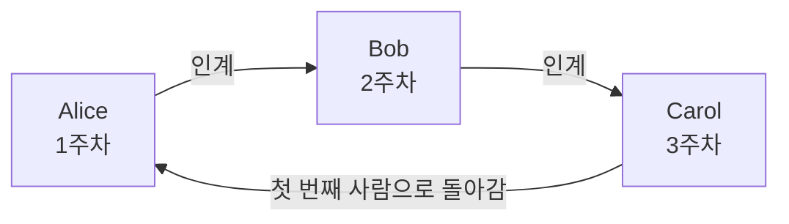
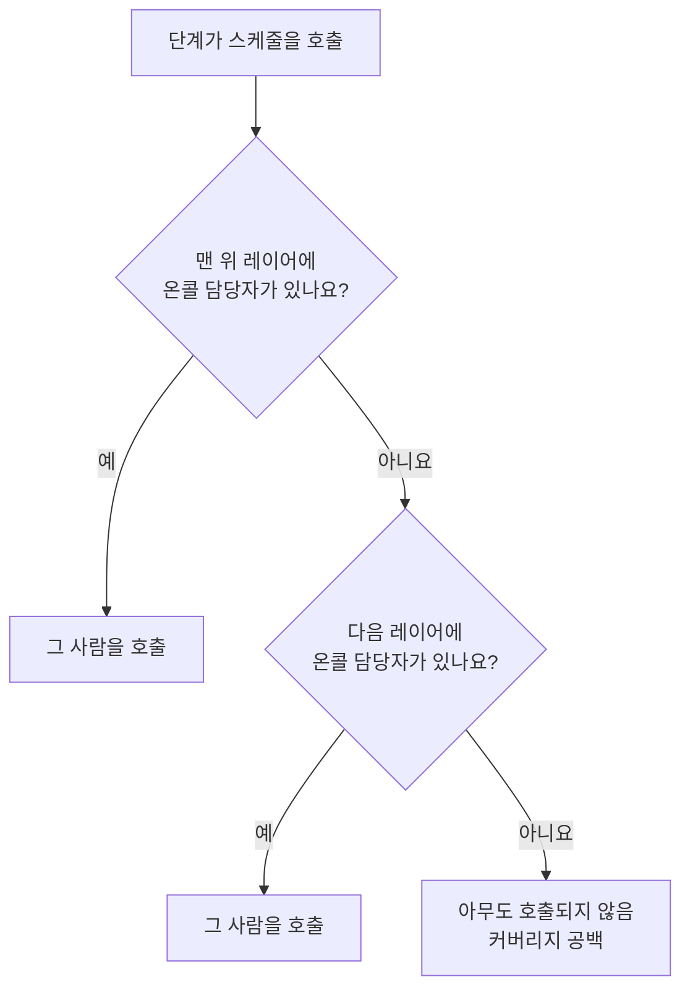

# 온콜 스케줄

온콜 스케줄은 어느 순간에 누가 온콜인지 정합니다. 사람들은 스케줄에서 교대로 담당합니다. 각자 한동안 온콜을 맡고, 그다음 사람이 이어받습니다. 스케줄을 온콜 정책의 에스컬레이션 규칙에 추가하면, 그 단계가 실행될 때 정책이 스케줄의 온콜 담당자를 호출합니다.

> [!NOTE]
> OneUptime Cloud에서 온콜 스케줄은 **Growth** 요금제 이상에서 제공됩니다. 프로젝트에 남아 있는 스케줄은 Growth 체험이 끝나거나 요금제가 낮아진 뒤에도, 그 스케줄을 지정한 에스컬레이션 규칙을 통해 담당자를 계속 호출합니다. 그래서 **Growth** 미만에서는 **온콜 스케줄** 페이지에 요금제 안내가 표시되고, 그 아래에 아직 설정된 스케줄이 나오며 거기서 삭제할 수 있습니다. 스케줄을 만들거나 바꾸려면 **Growth** 가 필요합니다.

:::cards
- [교대로 담당하는 사람](#교대로-담당하는-사람): 첫 번째 로테이션이 있는 스케줄을 만듭니다.
- [레이어](#레이어): 로테이션을 쌓고, 온콜 시간을 제한하고, 예비 담당을 추가합니다.
- [API와 Terraform](#api-또는-terraform으로-스케줄-만들기): 스케줄과 로테이션을 코드로 만듭니다.
:::

## 교대로 담당하는 사람

**온콜 스케줄** 페이지에서 스케줄을 만들면 양식에서 **이름** 과 **누가 교대로 담당하나요?** 를 묻습니다. 선택한 사람들이 스케줄의 첫 번째 레이어인 **Layer 1** 이 되어 24시간 온콜을 맡습니다.

:::steps
1. **온콜 듀티** > **온콜 스케줄** 로 이동하여 **온콜 스케줄 생성** 을 클릭합니다.
2. **이름** 을 입력합니다.
3. **누가 교대로 담당하나요?** 에서 **사용자 추가** 를 클릭하고 교대할 순서대로 사람을 고릅니다.
4. 필요하면 **추가 필드** 를 열어 1회 담당 기간, 시간대, 설명, 레이블을 바꿉니다.
5. **온콜 스케줄 생성** 을 클릭합니다. 새 스케줄은 해당 **레이어** 페이지에서 열리며, 여기서 로테이션을 바꾸거나 레이어를 더 추가할 수 있습니다.
:::

사람들은 한 명씩 교대하며, 스케줄을 만들자마자 첫 번째 사람이 온콜이 됩니다.



**누가 교대로 담당하나요?** 는 선택 사항입니다. 비워 두면 스케줄은 레이어 없이 시작합니다. 해당 **레이어** 페이지에서 레이어를 추가할 때까지 아무도 온콜이 아닙니다. 이 질문은 레이어를 추가할 수 있는 사람에게만 표시됩니다.

나머지 항목은 모두 **추가 필드** 아래에 있으며, 열기 전까지 접혀 있습니다.

| 필드 | 하는 일 |
| --- | --- |
| **1회 담당 기간** | **1일**, **1주**, **2주**, **1개월** 중 하나이며, 바꾸지 않으면 **1주** 입니다. 누군가 교대로 담당하게 되면 묻습니다. 각 사람이 그 기간 동안 온콜을 맡고, 스케줄을 만든 시각에 다음 사람이 이어받습니다. |
| **시간대** | 인계 시각과 온콜 시간을 유지하는 시간대입니다. 처음에는 내 시간대입니다. |
| **설명** | 스케줄에 대한 메모. |
| **레이블** | 스케줄을 찾고 묶기 위한 레이블. |

누군가 교대로 담당하고 **추가 필드** 에서 아무것도 바꾸지 않은 동안에는, 접힌 머리글에 앞으로 일어날 일이 표시됩니다. 각 사람이 1주 동안 온콜을 맡고, 그다음 사람이 이어받습니다.

## 레이어

스케줄의 로테이션은 해당 **레이어** 페이지의 레이어로 이루어집니다. 레이어는 위에서 아래로 읽히며, 온콜 담당자가 있는 가장 위의 레이어가 호출합니다. 그러므로 주 로테이션을 맨 위에, 예비 담당을 그 아래에 두세요.



**레이어 추가** 는 첫 번째 레이어처럼 시작하는 레이어를 추가합니다. 지금부터 온콜이며, 각 사람이 1주씩, 24시간 담당합니다. 레이어를 펼치면 사람을 추가하고, 시작 시점, 인계 주기, 첫 인계 시각, 온콜 시간을 바꿀 수 있습니다.

| 필드 | 설정하는 내용 |
| --- | --- |
| **Layer name** | 레이어가 담당하는 범위입니다. 예: "평일 주 담당". |
| **Rotation starts at** | 레이어의 로테이션이 시작되는 날짜와 시각. |
| **Rotate every** | 온콜이 레이어의 다음 사람에게 넘어가는 주기. |
| **First hand-off time** | 다음 사람에게 넘기는 첫 인계입니다. 시작 시점이거나 그 이후입니다. 이후의 인계는 로테이션 간격마다 이루어집니다. |
| **Restrictions** | 레이어가 온콜을 맡는 시간입니다. 스케줄의 시간대 기준으로 **제한 없음**, **하루 중 특정 시간**, **주중 특정 시간** 중 하나입니다. 그 시간 밖에서는 아래 레이어가 이어받습니다. |

어떤 레이어가 먼저 올지 바꾸려면 레이어 메뉴에서 **Move layer up (higher priority)** 또는 **Move layer down (lower priority)** 를 사용합니다.

각 사람은 어디서나 같은 색을 유지하므로 한눈에 따라갈 수 있습니다. 모든 레이어, 최종 스케줄과 그 재정의, 그리고 **스케줄 타임라인** 에서 같은 색입니다.

## API 또는 Terraform으로 스케줄 만들기

온콜 스케줄은 `/api/on-call-duty-policy-schedule` 리소스이고, 레이어와 레이어의 사람은 `/api/on-call-duty-schedule-layer` 및 `/api/on-call-duty-schedule-layer-user` 리소스입니다.

- `miscDataProps` 에 `firstLayerUsers` (교대하는 순서대로 나열한 사용자 ID 목록)를 넣어 스케줄을 만들면, 대시보드와 같이 첫 번째 레이어가 생깁니다. 지금부터 24시간 온콜인 **Layer 1** 입니다. `firstLayerRotation` 은 1회 담당 기간을 `{"_type": "Recurring", "value": {"intervalType": "Week", "intervalCount": 1}}` 와 같은 로테이션으로 지정하며, 없으면 1주입니다. 모든 사용자가 프로젝트 구성원이어야 하고 호출자가 레이어를 만들 수 있어야 하며, 그렇지 않으면 스케줄이 만들어지지 않습니다.
- 이것들 없이 만든 스케줄에는 이전처럼 레이어가 없으며, Terraform의 스케줄 리소스는 이것들을 보내지 않습니다.
- `rotation` 없이 만든 레이어는 늘 그래 왔듯이 매일 인계합니다.

```bash
curl -X POST https://oneuptime.com/api/on-call-duty-policy-schedule \
  -H "apikey: $ONEUPTIME_API_KEY" \
  -H "Content-Type: application/json" \
  -d '{
    "data": {
      "projectId": "<project-id>",
      "name": "Primary on-call",
      "timezone": "Europe/Berlin"
    },
    "miscDataProps": {
      "firstLayerUsers": ["<user-id-1>", "<user-id-2>", "<user-id-3>"],
      "firstLayerRotation": {"_type": "Recurring", "value": {"intervalType": "Week", "intervalCount": 1}}
    }
  }'
```

## 다음 단계

:::cards
- [에스컬레이션 규칙](/docs/on-call/escalation-rules): 온콜 정책의 단계에서 이 스케줄을 호출합니다.
- [스케줄 타임라인](/docs/on-call/schedule-timeline): 모든 스케줄을 커버리지 공백과 함께 나란히 봅니다.
- [캘린더 피드](/docs/on-call/calendar-feeds): 근무를 Google 캘린더, Outlook, Apple 캘린더에 넣습니다.
:::
