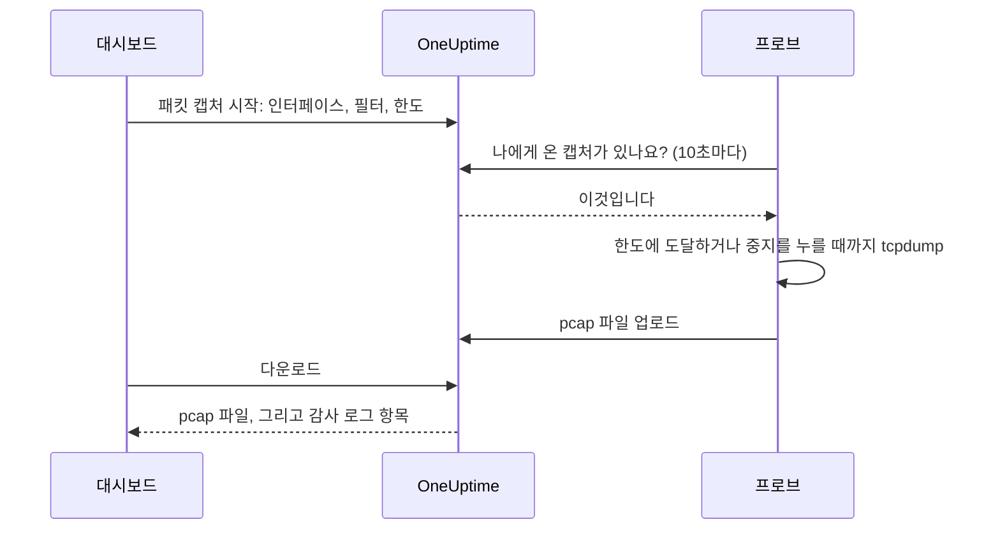

# 패킷 캡처

프로브가 보는 트래픽을 대시보드에서 바로 캡처하고, 파일을 Wireshark에서 엽니다. 프로브는 이미 문제를 살피는 네트워크 안에 있으므로 VPN을 열거나 점프 호스트에 로그인할 필요가 없습니다.

캡처는 프로브를 운영하는 사람이 켜기 전까지 모든 프로브에서 꺼져 있으며, 프로젝트 전용 프로브에서만 실행됩니다.

:::cards
- [작동 방식](#작동-방식): 패킷 캡처 시작부터 Wireshark에서 여는 파일까지.
- [패킷 캡처 켜기](#패킷-캡처-켜기): 프로브를 운영하는 사람이 Docker, Docker Compose, Kubernetes에서 설정하는 내용.
- [캡처 시작하기](#캡처-시작하기): 인터페이스를 고르고, 필요한 것만 남기고, 파일을 다운로드합니다.
- [참조](#참조): 한도, 필터, 권한, 감사 로그, 파일 보관 기간.
- [문제 해결](#문제-해결): 실패한 캡처의 메시지가 뜻하는 것.
:::

## 작동 방식



1. **시작.** 캡처를 시작할 수 있는 사람이 프로브의 인터페이스, 필터, 한도를 고르고 **캡처 시작**을 클릭합니다. OneUptime은 캡처를 저장하기 전에 필터와 한도가 프로브가 허용하는 범위인지 확인합니다.
2. **가져가기.** 프로브는 모니터를 요청하는 것처럼 10초마다 OneUptime에 작업을 요청합니다. 캡처를 받으면 `tcpdump`를 시작합니다.
3. **캡처.** 캡처는 기간, 패킷 한도, 파일 크기 중 먼저 도달한 한도에서 멈춥니다. **중지**를 누르면 일찍 끝나고, 그때까지 캡처한 내용은 남습니다.
4. **업로드.** 프로브가 pcap 파일을 업로드합니다. OneUptime은 이를 프로젝트의 비공개 파일로 저장합니다.
5. **다운로드.** 캡처에 **완료됨**과 **다운로드** 버튼이 표시됩니다. 파일은 Wireshark, tcpdump 또는 pcap 파일을 읽는 다른 도구에서 열립니다.

## 시작하기 전에

- **프로젝트 전용 프로브.** 글로벌 프로브는 다른 프로젝트의 트래픽도 다루므로 캡처하지 않습니다. 전용 프로브 설치 방법은 [사용자 지정 프로브](/docs/probe/custom-probe)를 참고하세요.
- **이 릴리스 이후의 프로브.** 이전 프로브는 어디에서 캡처할 수 있는지 보고하지 않습니다.
- **알맞은 권한.** 캡처를 시작하고 중지하려면 **Start Packet Capture**가, 파일을 다운로드하려면 **Download Packet Capture**가 필요합니다. 프로젝트 소유자와 관리자는 둘 다 가지고 있습니다. [권한](#권한)을 참고하세요.
- **프로브에 닿지 않는 트래픽을 위한 미러 포트.** 프로브는 자기 호스트의 인터페이스에 오가는 트래픽만 봅니다. 다른 장치 사이의 트래픽을 캡처하려면 그 장치들의 스위치 포트를 (SPAN으로) 프로브 호스트의 남는 인터페이스로 미러링하세요.

## 패킷 캡처 켜기

캡처는 프로브를 운영하는 사람이 프로브가 실행되는 곳에서 켭니다. 대시보드에서는 켤 수 없도록 설계되었습니다. 프로브에는 세 가지가 필요합니다.

| 설정 | 이유 |
| --- | --- |
| `PROBE_PACKET_CAPTURE_ENABLED=true` | 캡처를 켭니다. 다른 값이거나 값이 없으면 꺼진 상태로 둡니다. |
| 호스트 네트워크 | 프로브가 호스트 자체의 인터페이스와 미러 포트를 볼 수 있게 합니다. 없으면 프로브는 자기 컨테이너의 네트워크만 봅니다. |
| `NET_RAW` 권한(capability) | tcpdump가 캡처할 수 있게 합니다. Docker는 기본으로 부여합니다. Kubernetes의 Pod Security restricted 표준은 이를 제거하므로 추가하세요. |

:::tabs
@tab Docker
```bash
docker run --name oneuptime-probe --network host \
  --cap-add NET_RAW \
  -e PROBE_KEY=<probe-key> \
  -e PROBE_ID=<probe-id> \
  -e ONEUPTIME_URL=https://oneuptime.com \
  -e PROBE_PACKET_CAPTURE_ENABLED=true \
  -d oneuptime/probe:release
```
@tab Docker Compose
```yaml
services:
  oneuptime-probe:
    image: oneuptime/probe:release
    container_name: oneuptime-probe
    network_mode: host
    cap_add:
      - NET_RAW
    environment:
      - PROBE_KEY=<probe-key>
      - PROBE_ID=<probe-id>
      - ONEUPTIME_URL=https://oneuptime.com
      - PROBE_PACKET_CAPTURE_ENABLED=true
    restart: always
```
@tab Kubernetes
```yaml
apiVersion: apps/v1
kind: Deployment
metadata:
  name: oneuptime-probe
spec:
  selector:
    matchLabels:
      app: oneuptime-probe
  template:
    metadata:
      labels:
        app: oneuptime-probe
    spec:
      hostNetwork: true
      dnsPolicy: ClusterFirstWithHostNet
      containers:
        - name: oneuptime-probe
          image: oneuptime/probe:release
          securityContext:
            capabilities:
              add: ["NET_RAW"]
          env:
            - name: PROBE_KEY
              value: "<probe-key>"
            - name: PROBE_ID
              value: "<probe-id>"
            - name: ONEUPTIME_URL
              value: "https://oneuptime.com"
            - name: PROBE_PACKET_CAPTURE_ENABLED
              value: "true"
```
:::

프로브가 시작되면 로그에 `Packet capture is on: captures of up to 30 minutes and 25 MB can be started on this probe from the dashboard.`가 기록됩니다. 1분 안에 대시보드의 프로브 페이지에 **패킷 캡처 시작**이 나타납니다.

모든 프로브가 지키는 한도보다 낮은 한도를 이 프로브에 두려면 다음 중 하나를 추가하세요.

| 변수 | 기본값 | 하는 일 |
| --- | --- | --- |
| `PROBE_PACKET_CAPTURE_MAX_DURATION_IN_SECONDS` | `1800` | 이 프로브가 실행하는 가장 긴 캡처, 5초부터 1800초까지. |
| `PROBE_PACKET_CAPTURE_MAX_FILE_SIZE_IN_MB` | `25` | 이 프로브가 만드는 가장 큰 캡처 파일, 1MB부터 25MB까지. |

> [!NOTE]
> Docker Compose나 Helm 차트로 셀프 호스팅한 OneUptime에 함께 설치되는 프로브는 글로벌 프로브이므로 캡처하지 않습니다. 캡처하려는 네트워크에서 사용자 지정 프로브를 실행하세요.

## 캡처 시작하기

:::steps
### 프로브 또는 장치 열기

**모니터 → 설정 → 프로브**를 열고 프로브를 클릭하세요. **패킷 캡처** 카드에 캡처 목록이 표시됩니다. 또는 네트워크 장치를 열고 **Traffic** 페이지로 이동하세요. 그곳의 캡처는 장치 자신의 프로브에서 실행되며, 장치의 주소로 필터링된 상태로 시작합니다.

### 패킷 캡처 시작 클릭

양식은 캡처를 시작하기 전에 캡처에 무엇이 담기는지 알려 줍니다. 네트워크를 오가는 비밀번호, 토큰, 개인 데이터가 파일에 남습니다.

### 인터페이스 고르기

**모든 인터페이스 (any)**는 프로브의 모든 인터페이스에서 캡처합니다. 미러링된 트래픽을 캡처할 때는 스위치가 트래픽을 미러링하는 인터페이스를 고르세요.

### 캡처할 패킷 고르기

**호스트 또는 네트워크**, **포트**, **프로토콜**을 입력해 캡처 범위를 좁히거나, 비워 두어 모든 패킷을 남기세요. 양식에 입력값으로 만든 필터가 표시됩니다(예: `host 10.0.0.5 and tcp port 443`). 직접 필터를 쓰려면 **대신 BPF 필터 작성**을 클릭하세요.

### 한도 확인

**추가 필드**에는 **기간**, **패킷 한도**, **파일 크기 한도 (MB)**가 있습니다. 요약에 캡처가 언제 멈추는지 표시됩니다: `1분, 패킷 100,000개, 10 MB 중 먼저 도달하는 시점에 중지됩니다.`

### 캡처 시작 클릭

캡처는 프로브가 가져갈 때까지 **대기 중**, 그다음에는 진행 상황과 함께 **실행 중**으로 표시됩니다. 일찍 끝내려면 **중지**를 클릭하세요.
:::

캡처가 **완료됨**으로 표시되면 **다운로드**를 클릭하고 `.pcap` 파일을 Wireshark에서 여세요. **모든 인터페이스 (any)**에서 한 캡처는 Linux cooked capture이며, Wireshark는 다른 캡처와 똑같이 읽습니다.

## 참조

### 한도

| 한도 | 기본값 | 범위 |
| --- | --- | --- |
| 기간 | 1분 | 5초부터 30분까지 |
| 패킷 한도 | 100,000 | 1부터 1,000,000까지 |
| 파일 크기 한도 | 10 MB | 1 MB부터 25 MB까지 |

- 캡처는 처음 도달한 한도에서 멈춥니다. 크기 한도에 도달한 파일은 마지막 온전한 패킷 뒤에서 잘리므로 항상 열립니다.
- 프로브 하나는 한 번에 최대 2개의 캡처를 실행합니다.
- 프로브가 5분 안에 가져가지 않은 캡처는 실패하고, 그렇다고 알려 줍니다.
- 프로브는 모든 캡처를 이 한도와 프로브 자체의 더 낮은 한도로 다시 제한합니다.

### 필터

양식의 필드는 [BPF 필터](https://www.tcpdump.org/manpages/pcap-filter.7.html)를 만듭니다. tcpdump와 Wireshark의 캡처 필터 언어입니다.

| 호스트 또는 네트워크 | 포트 | 프로토콜 | 필터 |
| --- | --- | --- | --- |
| `10.0.0.5` | | 모든 프로토콜 | `host 10.0.0.5` |
| `10.0.0.0/24` | `443` | TCP | `net 10.0.0.0/24 and tcp port 443` |
| | `5060` | UDP | `udp port 5060` |
| | `8000-8080` | 모든 프로토콜 | `portrange 8000-8080` |
| `10.0.0.5` | | ICMP | `host 10.0.0.5 and (icmp or icmp6)` |

직접 쓰는 필터는 500자 이하의 한 줄이며, 영문자, 숫자, 공백, `. : / ( ) [ ] ! & | < > = + - * % ^ _`로 이루어집니다. OneUptime이 저장 전에 확인하고, tcpdump가 프로브에서 컴파일합니다. 프로브는 이를 셸을 거치지 않고 하나의 인수로 tcpdump에 넘깁니다.

### 권한

| 권한 | 할 수 있는 일 | 기본으로 가진 역할 |
| --- | --- | --- |
| **Start Packet Capture** | 캡처 시작과 중지 | Project Owner, Project Admin |
| **Download Packet Capture** | 캡처 파일 다운로드 | Project Owner, Project Admin |
| **Delete Packet Capture** | 캡처와 그 파일 삭제 | Project Owner, Project Admin |
| **Read Packet Capture** | 캡처 보기: 언제, 어느 프로브에서, 어떤 필터로 실행됐는지 | Project Owner, Project Admin, Project Member, Viewer |

팀에 **Start Packet Capture** 또는 **Download Packet Capture**를 주려면 **설정 → 팀**에서 팀을 열고 **권한** 페이지에서 권한을 추가하세요. [권한](/docs/permissions/index)을 참고하세요.

### 감사 로그와 개인정보

- 캡처 시작은 감사 로그에 **Packet Capture**의 **Create**로, 삭제는 **Delete**로 기록됩니다. 다운로드는 각각 누가 어떤 캡처를 다운로드했는지와 함께 **Download**로 기록됩니다.
- 파일은 프로젝트의 비공개 파일입니다. **Download Packet Capture** 권한으로 쓰는 **다운로드** 버튼만 파일을 내줍니다.
- 캡처와 그 파일은 시작 후 7일이 지나면 삭제됩니다. 캡처를 삭제하면 파일도 바로 삭제됩니다.

## 문제 해결

:::details '이 프로브에서 패킷 캡처가 꺼져 있습니다'
프로브가 `PROBE_PACKET_CAPTURE_ENABLED=true` 없이 실행되고 있습니다. [패킷 캡처 켜기](#패킷-캡처-켜기)의 설정으로 프로브를 다시 시작하세요.
:::

:::details "The probe is not allowed to capture packets on eth0"
tcpdump가 인터페이스를 열지 못했습니다. 프로브 컨테이너에 `NET_RAW` 권한을 주세요. Docker는 `--cap-add NET_RAW`, Docker Compose는 `cap_add`, Kubernetes는 `securityContext.capabilities.add`를 사용합니다.
:::

:::details "The interface does not exist on the probe"
프로브가 마지막으로 보고한 뒤 인터페이스가 사라졌거나, 프로브가 호스트 네트워크 없이 실행되어 컨테이너의 인터페이스만 보고 있습니다. 호스트 네트워크로 실행한 다음 인터페이스를 다시 고르세요.
:::

:::details "tcpdump could not use the filter"
tcpdump가 필터를 컴파일하지 못했습니다. 메시지에는 `syntax error`처럼 tcpdump가 직접 쓴 말이 들어 있습니다. [pcap-filter 설명서](https://www.tcpdump.org/manpages/pcap-filter.7.html)로 필터를 확인하세요.
:::

:::details "The probe did not pick up this capture within 5 minutes"
프로브 연결이 끊겼거나, 캡처를 시작한 뒤 프로브에서 패킷 캡처가 꺼졌습니다. 프로브의 **연결 상태**와 로그를 확인하세요.
:::

:::details '필터와 일치하는 패킷이 없었습니다.'
캡처는 실행됐지만 인터페이스에서 필터와 일치하는 것이 없었습니다. 트래픽이 이 인터페이스를 지나는지 확인하세요. 다른 장치 사이의 트래픽은 미러 포트를 통해서만 프로브에 닿습니다.
:::

:::details "This probe is already running 2 packet captures"
프로브 하나는 한 번에 캡처 2개를 실행합니다. 하나가 끝날 때까지 기다리거나 하나를 중지한 뒤 다시 시작하세요.
:::

## 다음 단계

:::cards
- [사용자 지정 프로브](/docs/probe/custom-probe): 캡처하려는 네트워크에 프로브를 설치합니다.
- [네트워크 장치 모니터](/docs/monitor/network-device-monitor): 트래픽을 캡처하는 장치를 모니터링합니다.
- [권한](/docs/permissions/index): 팀에 패킷 캡처 권한을 줍니다.
:::
